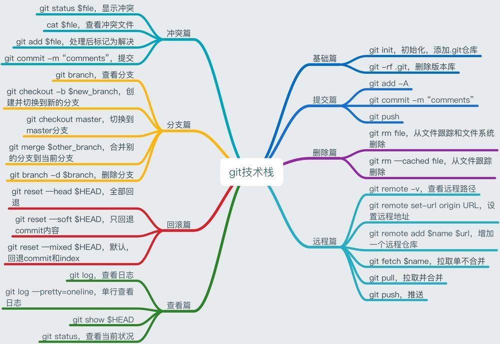
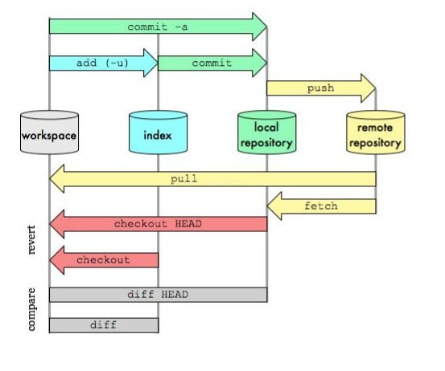
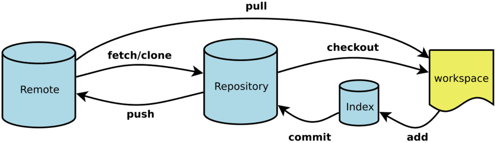

# Git常用命令行操作

## Git技术栈



## Git工作流




##### 了解下面这4个专有名词


* Workspace：工作区

> 程序员进行开发改动的地方，是你当前看到的，也是最新的。平常我们开发就是拷贝远程仓库中的一个分支，基于该分支进行开发。在开发过程中就是对工作区的操作。


* Index / Stage：暂存区

>.git目录下的index文件, 暂存区会记录git add添加文件的相关信息(文件名、大小、timestamp...)，不保存文件实体, 通过id指向每个文件实体。可以使用git status查看暂存区的状态。暂存区标记了你当前工作区中，哪些内容是被git管理的。

>当你完成某个需求或功能后需要提交到远程仓库，那么第一步就是通过git add先提交到暂存区，被git管理。


* Repository：仓库区（或本地仓库）


>保存了对象被提交 过的各个版本，比起工作区和暂存区的内容，它要更旧一些。

>git commit后同步index的目录树到本地仓库，方便从下一步通过git push同步本地仓库与远程仓库的同步。


* Remote：远程仓库

>远程仓库的内容可能被分布在多个地点的处于协作关系的本地仓库修改，因此它可能与本地仓库同步，也可能不同步，但是它的内容是最旧的。


##  Git本地仓库基础操作

* 在计算机创建指定项目文件夹，打开终端执行命令：

```
git init 

```

*  获得已有远程Git仓库

```
git clone https://git.oschina.net/Tocy/SampleCode.git

```

* 将工作区文件提交到本地代码仓库暂缓区 全局将文件提交至暂缓区（ . 是通配符，亦可替换为具体文件）

```
git add .

```

* 本地仓库文件状态查看

```
git status

```

git add 执行前后对比样例子

```
1.工作区文件，git add 前
MacBook-Pro:demo coo$ git status
   On branch master
   No commits yet
   Untracked files:
   (use "git add <file>..." to include in what will be committed)

   nothing added to commit but untracked files present (use "git add" to track)

2.暂缓文件，git add 后
MacBook-Pro:demo coo$ git add .
MacBook-Pro:demo coo$ git status
   On branch master

   No commits yet

   Changes to be committed:
   (use "git rm --cached <file>..." to unstage)
	

```
   

* 本地代码仓库暂缓区提交至本地仓库分支  

```
git commit -m ‘提交代码注释信息’

``` 

```
注：每次提交都会生成当前代码仓库一个版本号，遴选以及打tag都是根据每次commit作依据
```


* 本地代码仓库关联远程代码仓库
  1. git remote : 查看本地代码仓库原程分支
  2. git remote --help:查看当前命令详情
  3. git remote add origin https://github.com/bei.git 关联远程仓库

###### 命令执行样例：

```
MacBook-Pro:demo coo$ git remote
MacBook-Pro:demo coo$ git remote --help
MacBook-Pro:demo coo$ git remote add origin https://github.com/69/GI.git
MacBook-Pro:demo coo$ git remote
  origin
```

    

 * 本地代码仓库更新推送至远程分支
     *  git push origin master: 推送至远程分支  (也可指定为其他分支)


###### 命令执行样例：
```
MacBook-Pro:demo coo$ git push origin master 
Username for 'https://github.com': 输入账号
Password for 'https://github.com': 输入密码
Counting objects: 35, done.
Delta compression using up to 4 threads.
Compressing objects: 100% (30/30), done.
Writing objects: 100% (35/35), 16.94 KiB | 2.82 MiB/s, done.
Total 35 (delta 3), reused 0 (delta 0)
remote: Resolving deltas: 100% (3/3), done.
To https://github.com/View.git
* [new branch]      master -> master  
```
   

* 远程仓库打标签
   1. git tag:查询当前本地仓库tag详情
   2. git tag -a '0.0.1' -m '打标签’：给本地分支打标签
   3. git push --tags：将本地分支所有标签推送至远程代码仓库
   4. git log:查看commit提交的版本号信息
   5. 注：tag关联的是commit 提交的版本号，进而标记代码仓库
    
  
  
###### 命令执行样例：


   
* 标签维护操作
  1. git tag ‘0.0.2’:给本地仓库打标签
  2. git push orgin 0.0.2：将某个编号的tag推送至远程仓库给仓库加标签
  3. git tag -d 0.0.1：删除本地某个编号得标签
  4. git push origin :0.0.1 ：将本地仓库某个标签对应的远程仓库也删除
  
   
###### 命令执行样例：

>MacBook-Pro:demo coo$ git tag '0.0.2'
>
>MacBook-Pro:demo coo$ git tag
>
>0.0.1
>
>0.0.2
>MacBook-Pro:demo coo$ git push origin 0.0.2
>
>Counting objects: 10, done.
>
>Delta compression using up to 4 threads.
>
>Compressing objects: 100% (8/8), done.
>
>Writing objects: 100% (10/10), 8.46 KiB | 4.23 MiB/s, done.
>
>Total 10 (delta 3), reused 0 (delta 0)
>
>remote: Resolving deltas: 100% (3/3), completed with 3 local objects.
>
>To https://github.com/iew.git
>
>* [new tag]         0.0.2 -> 0.0.2
>
>MacBook-Pro:demo coo$ git tag -d 0.0.1
>
>Deleted tag '0.0.1' (was 02a2579)
>
>MacBook-Pro:demo coo$ git tag
0.0.2
>MacBook-Pro:demo coo$ git push origin :0.0.1
>
>To https://github.com/iew.git
>
>- [deleted]         0.0.1

  
  
  ```
  注意：该操作中并未将本地第二次commit推送至远程代码仓库master分支，
  但tag 0.0.2 关联的是第二次committag中存在修改代码,
  即使后期第三次提交将第二次代码改掉tag中依旧不会改变
  
  ```
   

*  git push 403错误解决

   ```
   重新在终端设置用户名密码:
   git remote set-url origin  https://github.com/bhn9/View.git 
   ``` 


## 提交历史查看

可以使用``git log``查看当前工程的所有提交的日志。

```
git log --stat      # 仅显示摘要选项
git log --pretty=oneline        # 定制记录格式
git log --graph     # 图像化分支和版本更新

```


## 抓取 拉取代码


## Git Remote 

* 查看当前的远程库

```
git remote

```
* 可以添加新的远程仓库

```
git remote add [short_name] [url]

```

* 显示对应的克隆地址

```
git remote -v

```

* 查看远程仓库信息

```
git remote show origin

```

* 远程仓库的删除和重命名

```
git remote rename [old_name] [new_name]

git remote rm [remote_name]

```


## Git分支


git分支是轻量级的，速度很快，仅记录索引信息。

* 显示所有分支

```
git branch 列出所有本地分支

git branch -r列出所有远程分支


git branch -a列出所有本地分支和远程分支


git checkout -b 新建一个分支，并切换到该分支


git branch --track 新建一个分支，与指定的远程分支建立追踪关系


git push origin --delete 删除远程分支

```


* 创建及切换分支

```
$ git branch testing    # 创建testing 分支
$ git checkout testing  # 切换到testing分支

```

* 删除分支

```

git branch -d hotfix

```

#### 案例

```

MacBook-Pro-4:GitFlowTest beichen$ git branch
  develop
  feature/test
* master
  testing
MacBook-Pro-4:GitFlowTest beichen$ git branch -d testing 
error: The branch 'testing' is not fully merged.
If you are sure you want to delete it, run 'git branch -D testing'.
MacBook-Pro-4:GitFlowTest beichen$ git branch -D testing
Deleted branch testing (was 1350804).
MacBook-Pro-4:GitFlowTest beichen$ git branch
  develop
  feature/test
* master


```


## Reset

reset命令把当前分支指向另一个位置，并且相应的变动工作区和暂存区

```

git reset —soft 只改变提交点，暂存区和工作目录的内容都不改变

git reset —mixed 改变提交点，同时改变暂存区的内容

git reset —hard 暂存区、工作区的内容都会被修改到与提交点完全一致的状态

git reset --hard HEAD让工作区回到上次提交时的状态


```


[Git高级教程](https://www.jianshu.com/p/15b8e6b7e3d7?utm_campaign=maleskine&utm_content=note&utm_medium=seo_notes&utm_source=recommendation)


[Git全面教程](https://www.jianshu.com/p/fe76f2890a14?utm_campaign=maleskine&utm_content=note&utm_medium=seo_notes&utm_source=recommendation)


[Git从入门到熟练使用](https://www.jianshu.com/p/34cfe097e06a?utm_campaign=maleskine&utm_content=note&utm_medium=seo_notes&utm_source=recommendation)