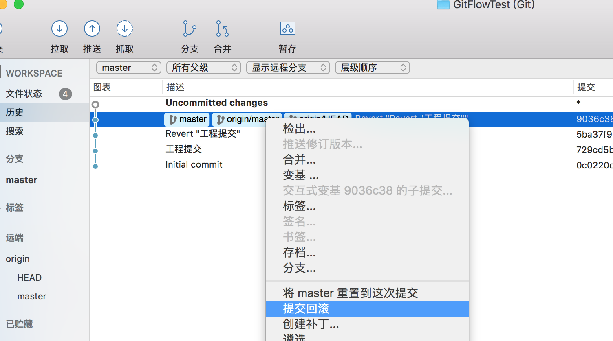

# Git可视化工具SourceTree使用


### 下载并注册SourceTree

[SourceTree 官网](https://cn.atlassian.com/software/sourcetree#)


* 创建本地仓库 : 点击创建本地仓库按钮,选择仓库地址,填写仓库名称,类型选git 


### 克隆代码
* 在自己的github项目中,复制url地址,然后克隆项目
* 在检出分支中,选择想要检出的分支.我这里检出的不是master分支.


## 检出分支   

通常项目是三种分支类型:

*  master主分支,稳定的版本; 
*  develop分支,日常开发分支,每个项目版本稳定之后,合并到master分支; 
*  fix分支,线上紧急bug.从master创建fix分支,修复测试通过后,合并到master主分支. 如果上一步你检出的是master分支,可以在origin中,检出其他分支到本地


### 暂存、丢弃、移除文件


### 解决冲突


### 检出分支


### 合并分支


###  遴选

* 为某次提交新建分支(只合并某次提交到一个分支上)


### 重命名文件名则点击菜单的“移动”选项


### 回滚操作




### Commit 重置


### 拉取与抓取+变&^基(rebase)的区别

* 拉取 : 把远程仓库的代码拉下来,与你本地提交的代码进行合并,合并到你的本地仓库

* 抓取 : 仅仅是把远程仓库的代码拉下来

* 变&^基(rebase) : 将抓取到的代码与本地仓库进行合并,且变&^基修改了提交历史,使得提交记录保持线性(美观).git变&^基细说


##  Git —— Flow

[Introducing GitFlow](https://datasift.github.io/gitflow/IntroducingGitFlow.html)

GitFlow有5大分支：master（主干）、develop（开发）、feature（功能）、release（预发布）、hotfix（热修复）。这里说下release分支，其实正名应该叫发布分支，我为什么叫他预发布分支呢，因为这个release分支并不是真正的发布，他是由develop分支经过多次feature功能迭代后分出来的一个分支，告诉大家这些功能准备的差不多了，可以准备发布了，但是实际上并没有发布。release分支创建好后，应由QA做测试，研发一起联调，然后先发布到测试环境中进行测试，QA如果觉得有问题，可以先提交工单给研发，研发在这个release分支上做小幅度bug修复，如果QA觉得可以使用的时候再由研发完成发布功能，此时release分支上所做的更改会被合并入master和develop分支中,release分支会在合并后被删除。


GitFlow 是由 Vincent Driessen 提出的一个 Git 操作流程标准。包含如下几个关键分支：

* master    主分支

```
定义：生产环境分支
作用：记录每一个正式发布版本，TAG所在分支
合并关系：允许release\hotfix分支的合并
建立时机：仓库初始化
初始代码来源：仓库创建

```

* develop   主开发分支，包含确定即将发布的代码

```
定义：开发分支
作用：保持最新的开发代码
合并关系：允许feature\release\hotfix分支的合并
建立时机：master创建完成
初始代码来源：master

```

* feature	新功能分支，一般一个新功能对应一个分支，对于功能的拆分需要比较合理，以避免一些后面不必要的代码冲突

```
定义：新功能分支
作用：独立的功能需求
合并关系：不允许任何分支合并
建立时机：需要开发新的功能
初始代码来源：任意线上commit，推荐使用develop最新commit
完成操作：合并至develop分支

```

* release 发布分支，发布时候用的分支，一般测试时候发现的 bug 在这个分支进行修复

```

定义：发布分支
作用：表示一个正式发布版本(我更倾向于叫他预发布)
合并关系：不允许任何分支合并
建立时机：线上代码满足发布要求
初始代码来源：任意线上commit，推荐使用develop最新commit
完成操作：合并至master/develop、打相应的TAG

```

* hotfix 热修复分支，紧急修 bug 的时候用

```
定义：修复BUG分支
作用：用于修复已发布版本BUG
合并关系：不允许任何分支合并
建立时机：发布版本出现BUG
初始代码来源：master(source tree 没有提供历史发布版本的hotfix创建，如需要可手动操作)
完成操作：合并修改内容至master/develop分支


```

注意：

* 远程仓库仅仅应该存在两个分支，一个是master分支，存放线上（生产环境）版本，这个分支的代码总是可靠可用的；另一个是develop分支，这个分支用于日常开发。

* 本来master分支上的内容不应直接提交（除了第一次初始化GitFlow前需要至少提交一次在master分支上，确保master里面有内容），master分支总是应该由develop分支发布到release分支，经过QA测试确认可以上线后（期间可以在release分支上进行小幅bug修复提交更改），再完成发布新版本功能然后合并入master分支（发布成功后release分支会被删除，在release分支上所做的更改会自动合并到master和develop分支上）。但是如果在GitFlow已经初始化后（develop分支已经有了）不小心在master上直接提交了新的commit，这会导致develop分支上缺少主干master分支上的内容，这个时候就需要先将master分支推送到远端，然后本地切回到master分支，然后再使用pull功能从master分支上拉取内容到develop分支（SourceTree会警告正要从未跟踪的分支上拉取内容，点继续），这样就把master上所做的更改来回到develop分支上了。 虽然有这个曲线救国的办法，但是平时在使用的过程中还是要注意规范，尽量避免这种情况。

* feature 分支 下可以有多个feature同时在开发，并不影响。feature最终是提交到develop分支上的，release是从develop分支上拉取的，release分支是提交到master分支上的（develop分支不能直接提交到master上），他们几个并不冲突。允许在仍然有feature在开发的情况下从develop分支拉取到release分支。


* 如果建立了某个开发功能（feature）或者发布版本（release）分支后，如果不想开发或者发布了，可以先切回到其他分支（比如master或develop分支），然后在要删除的分支上右击，选择“删除分支”


GitFlow 的优势有如下几点：

* 并行开发：GitFlow 可以很方便的实现并行开发：每个新功能都会建立一个新的 feature 分支，从而和已经完成的功能隔离开来，而且只有在新功能完成开发的情况下，其对应的 feature 分支才会合并到主开发分支上（也就是我们经常说的 develop 分支）。另外，如果你正在开发某个功能，同时又有一个新的功能需要开发，你只需要提交当前 feature 的代码，然后创建另外一个 feature 分支并完成新功能开发。然后再切回之前的 feature 分支即可继续完成之前功能的开发。

* 协作开发：GitFlow 还支持多人协同开发，因为每个 feature 分支上改动的代码都只是为了让某个新的 feature 可以独立运行。同时我们也很容易知道每个人都在干啥。

* 发布阶段：当一个新 feature 开发完成的时候，它会被合并到 develop 分支，这个分支主要用来暂时保存那些还没有发布的内容，所以如果需要再开发新的 feature，我们只需要从 develop 分支创建新分支，即可包含所有已经完成的 feature 。
支持紧急修复：GitFlow 还包含了 hotfix 分支。这种类型的分支是从某个已经发布的 tag 上创建出来并做一个紧急的修复，而且这个紧急修复只影响这个已经发布的 tag，而不会影响到你正在开发的新 feature。


### Glow flow 是如何工作的


* 新功能都是在 feature 分支上进行开发


* feature 分支都是从 develop 分支创建，完成后再合并到 develop 分支上，等待发布。


* 当需要发布时，我们从 develop 分支创建一个 release 分支


* 然后这个 release 分支会发布到测试环境进行测试，如果发现问题就在这个分支直接进行修复。在所有问题修复之前，我们会不停的重复发布->测试->修复->重新发布->重新测试这个流程。

发布结束后，这个 release 分支会合并到 develop 和 master 分支，从而保证不会有代码丢失。


* master 分支只跟踪已经发布的代码，合并到 master 上的 commit 只能来自 release 分支和 hotfix 分支。

* hotfix 分支的作用是紧急修复一些 Bug。它们都是从 master 分支上的某个 tag 建立，修复结束后再合并到 develop 和 master 分支上。


### Git Flow 使用


* 有过提交记录的master分支可以正常初始化git-flow


* 推送到远程服务器
注意只需要推送master和develop分支，如果你现在已经创建了feature或release或hotfix分支都不要推送，远端只需要master和develop.


* 新增Feature分支（功能）  ``Command+Option+F`` 打开GitFlow菜单，选择 “建立新功能”


* 完成feature功能开发


在开发分支上进行变基”（rebase）这个勾选框，如果勾上则表示保留在这个feature功能上的提交历史到develop分支上，不勾选则合并这个功能模块的提交历史成一个（Merge某某功能到develop）。默认是不勾选的。一般使用默认选项即可。

* 发布release分支  在 ``develop`` 基础上发起

若出现bug可在本分支修改


* 完成发布版本


* hotfix 分支（紧急修复线上版本bug）

> git-flow假定当前产品线只需要维护一个版本，所以Git-Flow的hotfix总是基于最新的master分支里的版本来开辟的。如果需要同时维护多个版本，那么就不应该用master分支了，可以多建几个分支比如1.x分支，2.x分支,3.x分支，这样就可以同时维护3个版本线的产品，但是所带来的维护量就变的很大了。所以建议大家只维护一个版本来做CI（持续集成）
>Git-Flow的hotfix分支和release分支有点像，区别在于release分支是由develop分支拉取出来的新分支，而hotfix分支是由master分支拉取出来的新分支，两者最终都会合并入master和develop分支。只不过hotfix用于生产环境中的紧急修复，需要快速响应和修复，减少Code ReView和QA环节的时间（不是说不做，只是说尽量快点完成这两个环节，尽量快点修复，否则大批用户都会受这个bug影响，毕竟是生产环境。）


#### 假如QA同学发现线上版本有个bug需要修复，他应该在Git的工单系统里把bug详细叙述了一下


* 修复完毕 


## Git LFS


Git LFS 是 Github 开发的一个 Git 的扩展，用于实现 Git 对大文件的支持

Git LFS（Large File Storage, 大文件存储）是可以把音乐、图片、视频等指定的任意文件存在 Git 仓库之外，而在 Git 仓库中用一个占用空间 1KB 不到的文本指针来代替的小工具。通过把大文件存储在 Git 仓库之外，可以减小 Git 仓库本身的体积，使克隆 Git 仓库的速度加快，也使得 Git 不会因为仓库中充满大文件而损失性能。

使用 Git LFS，在默认情况下，只有当前签出的 commit 下的 LFS 对象的当前版本会被下载。此外，我们也可以做配置，只取由 Git LFS 管理的某些特定文件的实际内容，而对于其他由 Git LFS 管理的文件则只保留文件指针，从而节省带宽，加快克隆仓库的速度；也可以配置一次获取大文件的最近版本，从而能方便地检查大文件的近期变动。


[LFS 使用指南](https://zzz.buzz/zh/2016/04/19/the-guide-to-git-lfs/#advanced-operations)


