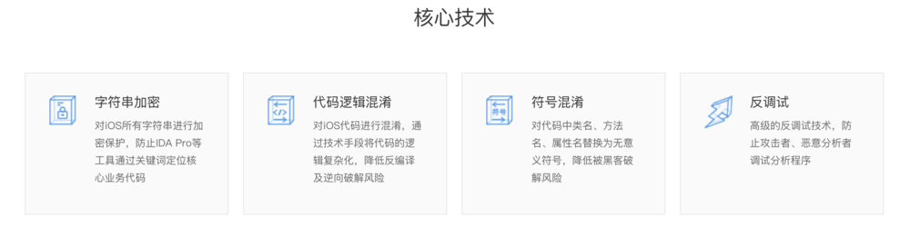
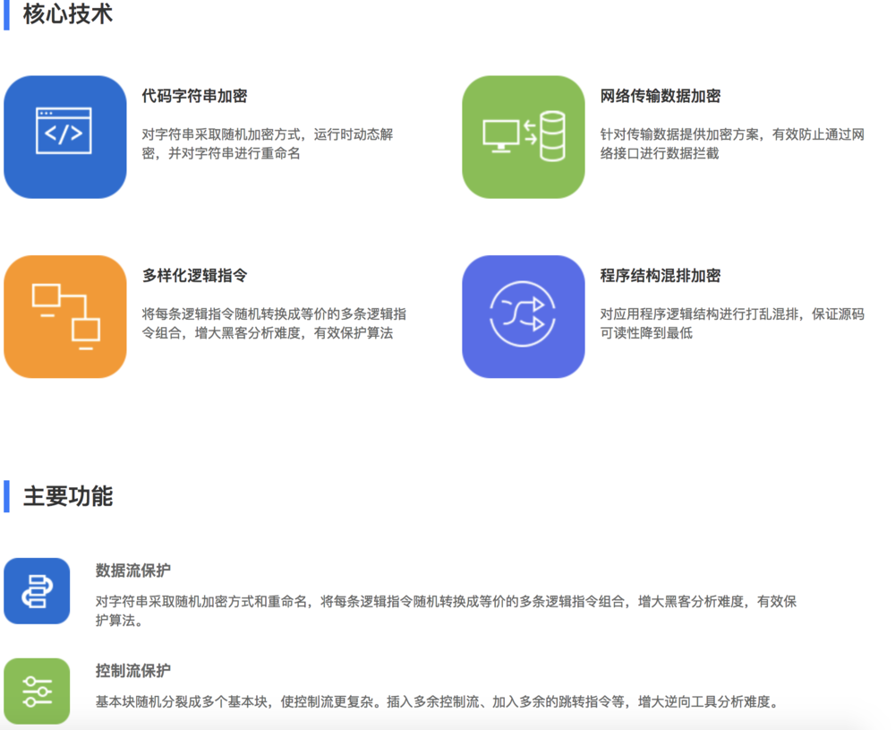
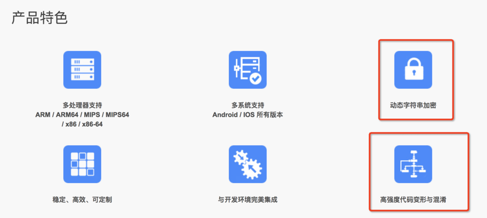
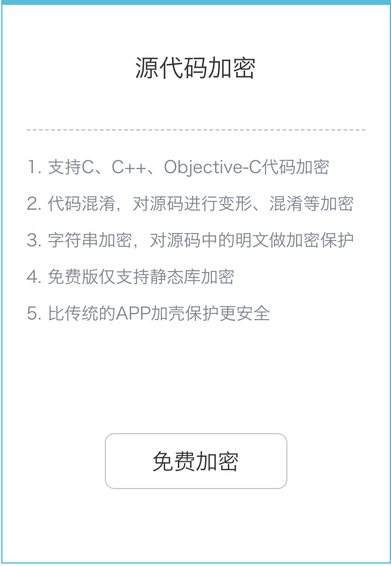

# 第十章 项目工程安全

#### ``代码混淆(Obfuscated code)``亦称花指令，是将计算机程序的代码，转换成一种功能上等价，但是难于阅读和理解的形式的行为。代码混淆可以用于程序源代码，也可以用于程序编译而成的中间代码。执行代码混淆的程序被称作代码混淆器。目前已经存在许多种功能各异的代码混淆器。

将代码中的各种元素，如变量，函数，类的名字改写成无意义的名字。比如改写成单个字母，或是简短的无意义字母组合，甚至改写成“__”这样的符号，使得阅读的人无法根据名字猜测其用途。重写代码中的部分逻辑，将其变成功能上等价，但是更难理解的形式。比如将for循环改写成while循环，将循环改写成递归，精简中间变量，等等。打乱代码的格式。比如删除空格，将多行代码挤到一行中，或者将一行代码断成多行等等。

####代码混淆器也会带来一些问题。主要的问题包括：
* 被混淆的代码难于理解，因此调试以及除错也变得困难起来。开发人员通常需要保留原始的未混淆的代码用于调试。
* 对于支持反射的语言，代码混淆有可能与反射发生冲突。代码混淆并不能真正阻止反向工程，只能增大其难度。
* 对于对安全性要求很高的场合，仅仅使用代码混淆并不能保证源代码的安全。

## iOS加固策略

对于iOS来说，由于系统是封闭的，APP上架需要通过App Store，安全性来说相当高。但是对于大厂和知名APP而言，别人给的安全保障永远没有自己做的来得踏实。所以对于大厂、少部分企业级和金融支付类应用来说加固是相当重要的

### 网易

网易安全

* 防静态分析，这里包括字符串加密、符号混淆、代码逻辑混淆和游戏存档加密；
* 防动态调试、反调试和通信安全（数据加密）；
* 外挂检测、加速挂、内存修改挂和自动任务挂等

### 爱加密

### Safengine

### 几维安全

### 梆梆安全

字符串加密
代码混淆（方法命，类命，变量名，符号表）
代码逻辑混淆
反调试

[iOS-代码混淆加固策略](https://www.jianshu.com/p/628a0c232c2a)

##常用的逆向分析手段

要知道怎么防备，我们就需要知道一些常用的逆向分析方式，这样才能知己知彼。通常来说分析有三种手段：

### 静态分析

* 静态分析这一阶段主要会利用给各种工具，来帮助开发者分析目标软件，常用的工具有比如Hopper、IDA、Keychain-Dumper、Class-dump等。
* 其中IDA是效果最好也是最贵的，代码还原度很高，基本上可以照着理清楚代码的逻辑了。

### 动态分析

* 动态分析是指在软件运行的过程中进行调试分析。
* 在iOS中runtime扮演了一个很重要的角色，我们在动态分析的过程中往往也是借助了runtime的强大能力来进行的，比如我们可以动态地更改代码的行为、可以获取到当前的视图层次等等。
* 这一部分我们可以利用的工具有包括Cycript、Reveal、LLDB等。

### 网络分析

* 网络分析是指利用像Charles这样的抓包分析工具，分析应用的流量信息，安全意识比较差的公司做的一些产品我们往往能从中得到一些敏感信息。

