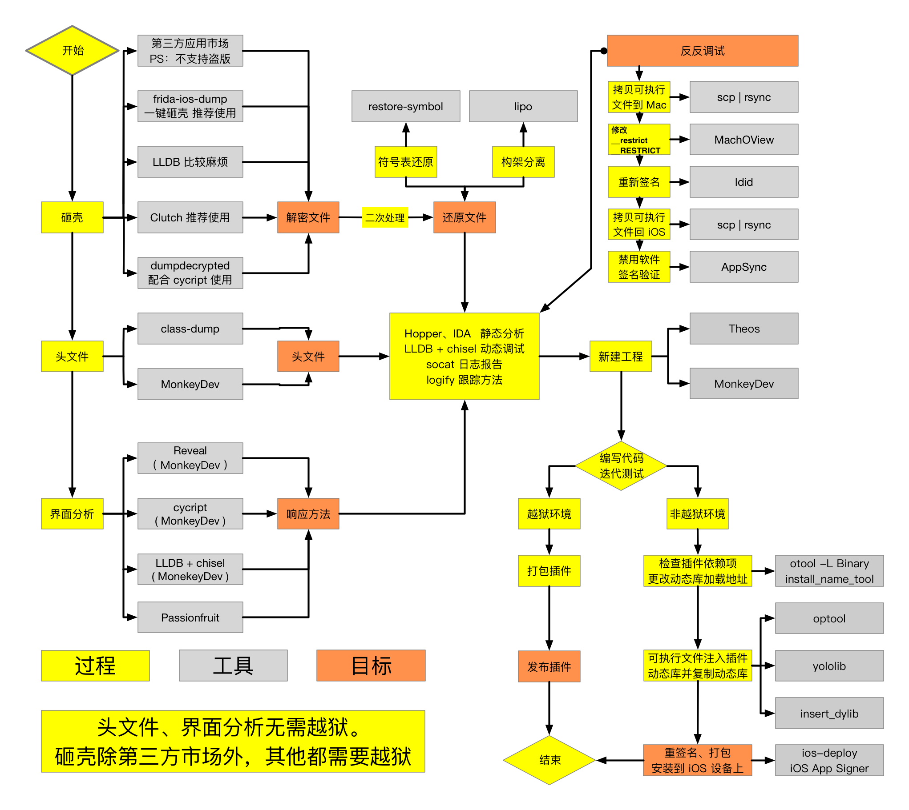
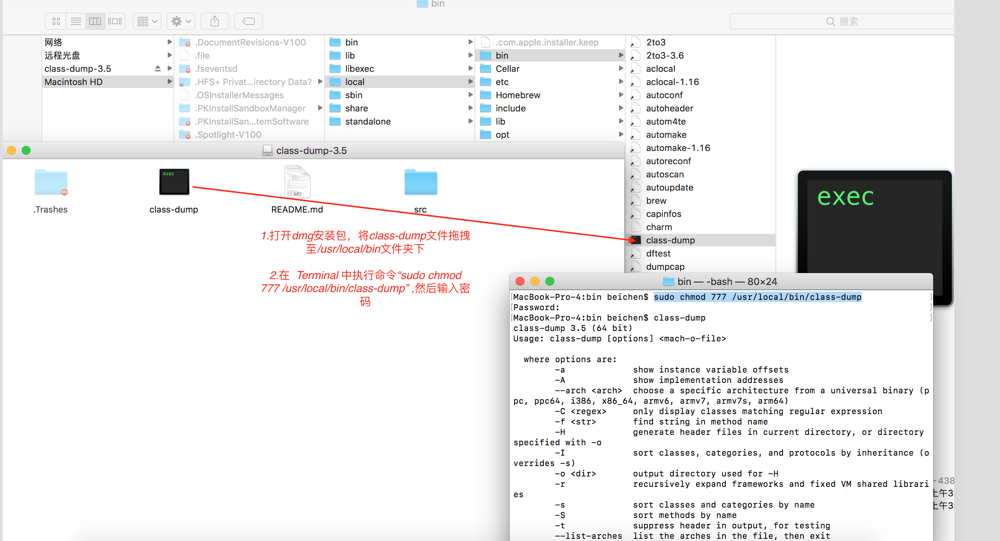
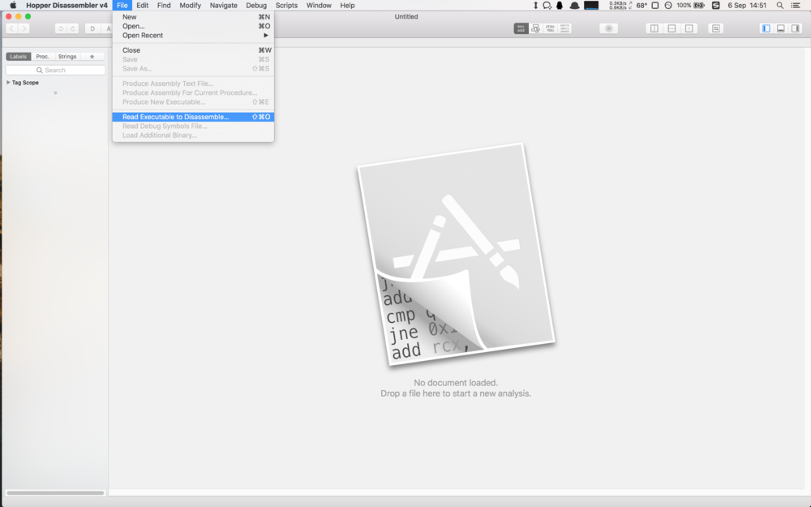
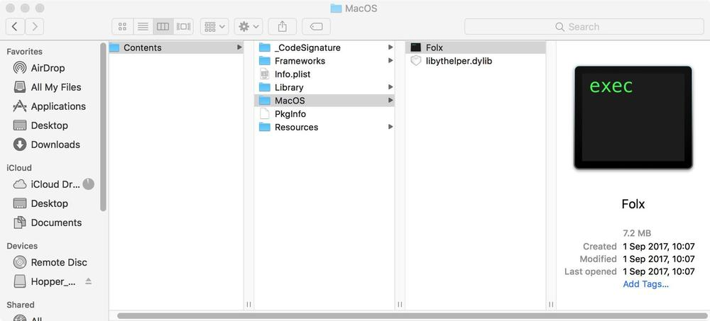
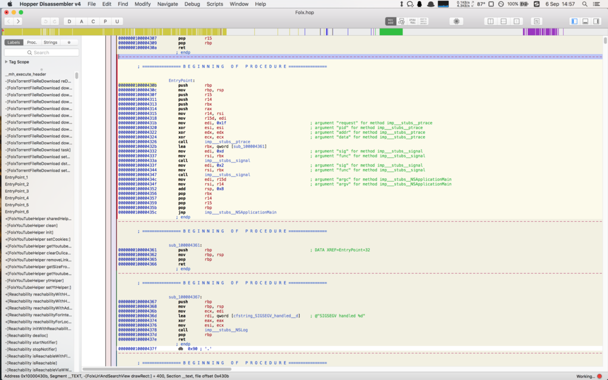
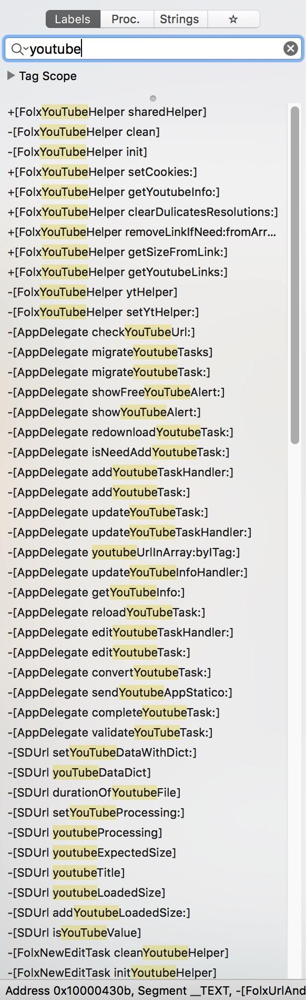

# 10.1 逆向入门


逆向总的流程，在这里只需要初步了解如何导出头文件即可，源码分析




## class-dump

class-dump是用来dump目标文件的类信息的工具。它利用Objective-C语言的runtime的特性，将存储在mach-O文件中的@interface和@protocol信息提取出来，并生成对应的.h文件


### Class-dump安装

[官网](http://stevenygard.com/projects/class-dump/)下载最新版本的class-dump的dmg安装包文件。如图中将安装包中文件放在：``/usr/local/bin`` 文件夹下



终端执行如下执行进行赋权：

```
sudo chmod 777 /usr/local/bin/class-dump 

```

查验是否安装成功；执行 `` class-dump  `` 结果如下说明安装成功

```

MacBook-Pro-4:bin beichen$ class-dump
class-dump 3.5 (64 bit)
Usage: class-dump [options] <mach-o-file>

  where options are:
        -a             show instance variable offsets
        -A             show implementation addresses
        --arch <arch>  choose a specific architecture from a universal binary (ppc, ppc64, i386, x86_64, armv6, armv7, armv7s, arm64)
        -C <regex>     only display classes matching regular expression
        -f <str>       find string in method name
        -H             generate header files in current directory, or directory specified with -o
        -I             sort classes, categories, and protocols by inheritance (overrides -s)
        -o <dir>       output directory used for -H
        -r             recursively expand frameworks and fixed VM shared libraries
        -s             sort classes and categories by name
        -S             sort methods by name
        -t             suppress header in output, for testing
        --list-arches  list the arches in the file, then exit
        --sdk-ios      specify iOS SDK version (will look in /Developer/Platforms/iPhoneOS.platform/Developer/SDKs/iPhoneOS<version>.sdk
        --sdk-mac      specify Mac OS X version (will look in /Developer/SDKs/MacOSX<version>.sdk
        --sdk-root     specify the full SDK root path (or use --sdk-ios/--sdk-mac for a shortcut)
MacBook-Pro-4:bin beichen$ which class-dump
/usr/local/bin/class-dump

```


### 使用class-dump

执行指令：

```
class-dump -H /Applications/Calculator.app -o /Users/GofLee/Desktop/CalculateHeads

```

[说明]()：

* ``/Applications/Calculator.app``：计算器app的路径；
* ``/Users/GofLee/Desktop/CalculateHeads``：存放dump结果的头文件文件夹路径。

我们也可以导出AppKit、UIKit的头文件：

```
class-dump -H /System/Library/Frameworks/AppKit.framework -o /Users/GofLee/Desktop/AppKitHeaders

```

[注意]()：有时class-dump指令会执行失败，无法得到想要的头文件，或头文件的内容是加密的密文。出现这种情况是因为class-dump的作用对象必须是未经加密的可执行文件，一般App Store中下载的App都是经过签名加密的，这个时候需要先进行砸壳。

注意，这里dump的是应用后缀是.app而不是.ipa，不要傻傻的去dump .ipa后缀了，会提示``class-dump: Input file (xxx.ipa) is neither a Mach-O file nor a fat archive.``错误的！


#### class-dump-z

``class-dump-z`` 是对 class-dump 和 class-dump-x 的改进版，完全用C++重写，避免动态调用，这使得 ``class-dump-z`` 比 class-dump 和 class-dump-x快10倍左右，并且可以在 Linux、Mac、 iPhone 上运行。

[class-dump-z](https://code.google.com/archive/p/networkpx/wikis/class_dump_z.wiki)

其他同class-dump。


## Hopper Disassembler。


超级强大的反编译软件，不仅可以把机器码解析成汇编，还能解析出相似与Objc的伪代码。总之就是太强大了，强大到我们几乎连class-dump都用不上了


* 打开Hopper，选择``File-Read Executable to Disassemble``直接粗暴读取二进制可执行文件来破解，如图所示。




* 选择Applications文件夹中的.APP，右键显示包内容，并找到可执行文件，类似于win平台的.exe文件，在这里：





* 等Hopper缓过神来，界面就差不多长这样。由于个人使用习惯，隐藏了底部和右边栏，可以在右上角的三个按钮选择是否开启。
左边栏是导航，可以看到使用Objc的方框语法列出了许多方法，还要啥class-dump？中间区域是汉莫拉比法典，记载了一些上古语言，讲述了一些你不需要了解的事，直接无视就行。




* 关键词来搜索应该不会错，所以在左边栏的搜索框中输入youtube，可以得到许多和Youtube相关的类和方法：




