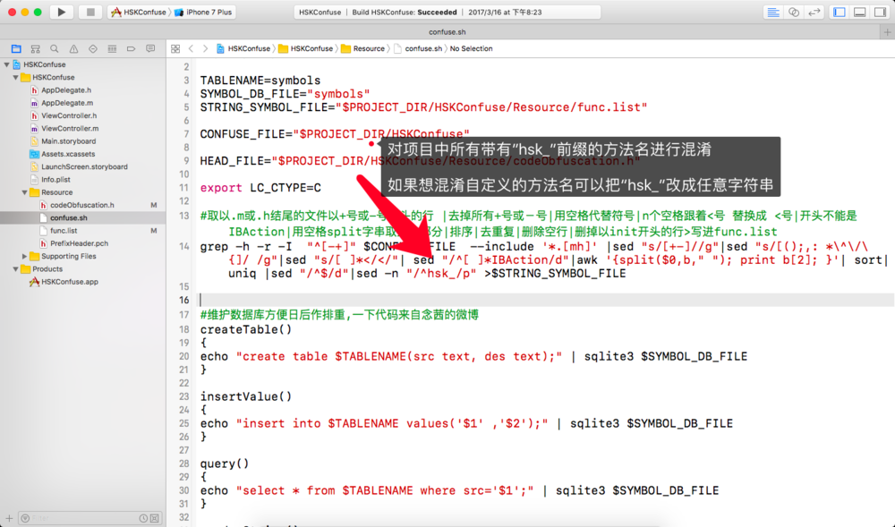
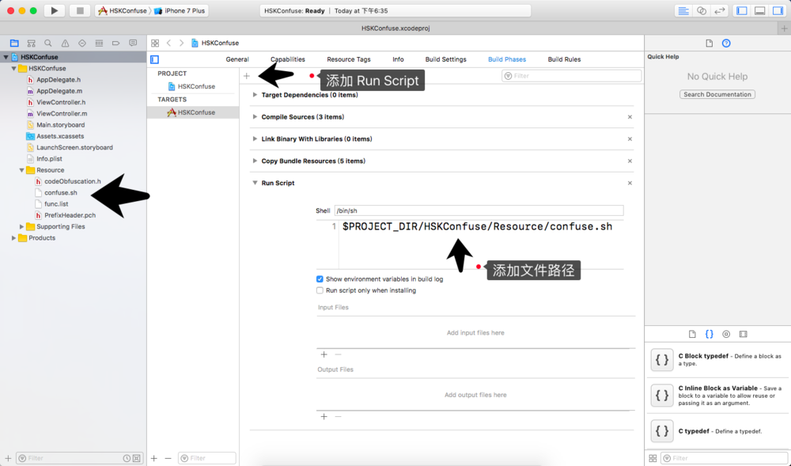
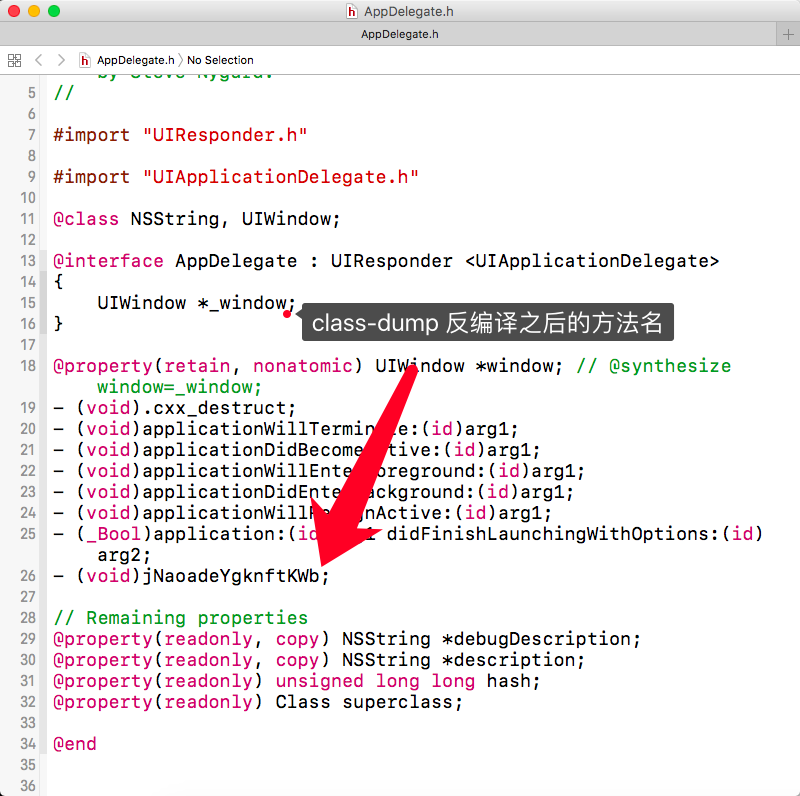

# 10.2 混淆实现


### Objective-C的方法名混淆

* 混淆的时机

>我们希望在开发时一直保留清晰可读的程序代码，方便自己。
同时，希望编译出来的二进制包含乱七八糟的混淆后的程序代码，恶心他人，可以在Build Phrase 中设定在编译之前进行方法名的字符串替换。


* 混淆的方法

> 方法名混淆其实就是字符串替换，有2个方法可以，一个是``#define``，一个是利用``tops``。利用#define的方法有一个好处，就是可以把混淆结果合并在一个.h中，在工程Prefix.pch的最前面#import这个.h。不导入也可以编译、导入则实现混淆。
> 
> 
> * 单段的selector，如func: ，可以通过#define func 来实现字符串替换。
> 
> * 多段的selector，如a:b:c: ，可以通过分别#define a 、b、c 来实现字符串替换。
> 
> 


### 脚本文件  `` confuse.sh ``



```

#!/usr/bin/env bash

TABLENAME=symbols
SYMBOL_DB_FILE="symbols"
STRING_SYMBOL_FILE="$PROJECT_DIR/HSKConfuse/Resource/func.list"

CONFUSE_FILE="$PROJECT_DIR/HSKConfuse"

HEAD_FILE="$PROJECT_DIR/HSKConfuse/Resource/codeObfuscation.h"

export LC_CTYPE=C

#取以.m或.h结尾的文件以+号或-号开头的行 |去掉所有+号或－号|用空格代替符号|n个空格跟着<号 替换成 <号|开头不能是IBAction|用空格split字串取第二部分|排序|去重复|删除空行|删掉以init开头的行>写进func.list
grep -h -r -I  "^[-+]" $CONFUSE_FILE  --include '*.[mh]' |sed "s/[+-]//g"|sed "s/[();,: *\^\/\{]/ /g"|sed "s/[ ]*</</"| sed "/^[ ]*IBAction/d"|awk '{split($0,b," "); print b[2]; }'| sort|uniq |sed "/^$/d"|sed -n "/^hsk_/p" >$STRING_SYMBOL_FILE


#维护数据库方便日后作排重,一下代码来自念茜的微博
createTable()
{
echo "create table $TABLENAME(src text, des text);" | sqlite3 $SYMBOL_DB_FILE
}

insertValue()
{
echo "insert into $TABLENAME values('$1' ,'$2');" | sqlite3 $SYMBOL_DB_FILE
}

query()
{
echo "select * from $TABLENAME where src='$1';" | sqlite3 $SYMBOL_DB_FILE
}

ramdomString()
{
openssl rand -base64 64 | tr -cd 'a-zA-Z' |head -c 16

}

rm -f $SYMBOL_DB_FILE
rm -f $HEAD_FILE
createTable

touch $HEAD_FILE
echo '#ifndef Demo_codeObfuscation_h
#define Demo_codeObfuscation_h' >> $HEAD_FILE
echo "//confuse string at `date`" >> $HEAD_FILE
cat "$STRING_SYMBOL_FILE" | while read -ra line; do
if [[ ! -z "$line" ]]; then
ramdom=`ramdomString`
echo $line $ramdom
insertValue $line $ramdom
echo "#define $line $ramdom" >> $HEAD_FILE
fi
done
echo "#endif" >> $HEAD_FILE


sqlite3 $SYMBOL_DB_FILE .dump


```


### 在Xcode-->Target--->Build Phases--->添加Run Script








### STCObfuscator

下载地址： [STCObfuscator](https://github.com/chenxiancai/STCObfuscator/blob/master/README.md)


