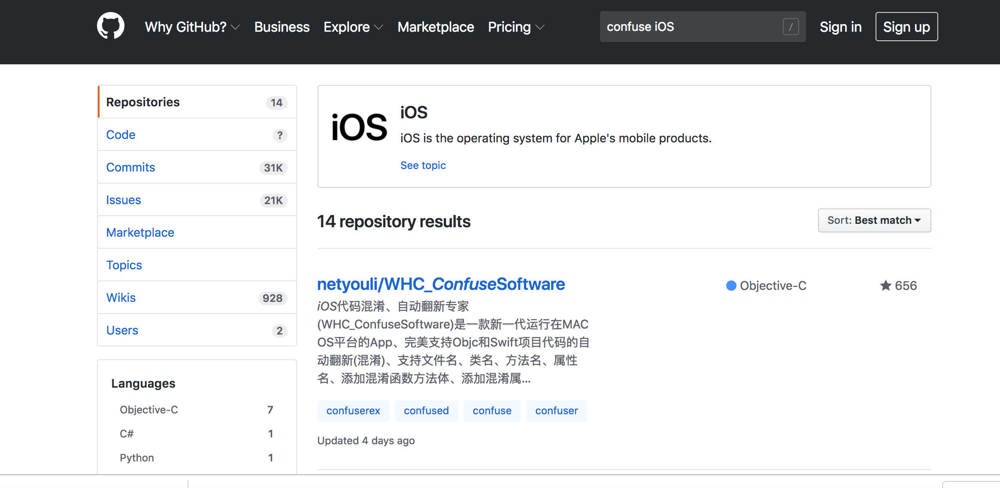

# 10.3 第三方混淆方案以及自动化

## WHC_ConfuseSoftware

iOS代码混淆、自动翻新专家(WHC_ConfuseSoftware)是一款新一代运行在MAC OS平台的App、完美支持Objc和Swift项目代码的自动翻新(混淆)、支持文件名、类名、方法名、属性名、添加混淆函数方法体、添加混淆属性、自动调用生成的混淆方法、字符串混淆加密等。。。功能强大而稳定。 http://www.wuhaichao.com

有空试试其实现 [GitHub](https://github.com/netyouli/WHC_ConfuseSoftware)

该项目不是开源免费使用的软件，如果想要免费开源的用户请慎重下载本项目，目前下载使用是需要购买Vip才能使用，具体详情请咨询作者

## STCObfuscator

[STCObfuscator](https://github.com/chenxiancai/STCObfuscator)

STCObfuscator 是用来进行object-c代码混淆的工具，在模拟器DEBUG环境下运行生成混淆宏，
混淆的宏可以在其他环境下进行编译，支持Cocoapod代码混淆.

[相关博客]：[https://blog.csdn.net/cating1314/article/details/80189295]

## Code-Confuse-Plugin

这是一款用于混淆iOS代码的插件。最近试用了几款目前很多开源的针对iOS代码混淆的插件，但混淆生成的文件一直不如人意，运行代码报错的地方依旧很多。同时有些插件实现的方式个人认为过于复杂，需要使用类似于class-dump的技术来进行反编译再进行混淆操作，同时很多插件使用的是直接更换需要混淆的关键字，工程过于庞大，对于代码的可读写性也有影响。于是决定自己写一个建议的插件，就有了本仓库的诞生。

[GitHub](https://github.com/LennonChin/Code-Confuse-Plugin)

## 脚本学习网站

[Shell](http://www.runoob.com/linux/linux-shell.html)

[Ruby](http://www.runoob.com/ruby/ruby-intro.html)

## 混淆过程

####  混淆实现方向

* 字符串加密
* 代码混淆（方法命，类命，变量名，符号表）
* 代码逻辑混淆
* 反调试

### 字符串加密

对字符串加密的方式目前我所了解到掌握到的最可靠方式就是用脚本将代码中的所有标记需要加密的字符串进行异或转换，这样代码中就不存在明文字符串了。当然第三方的字符串加密不可能这么简单，具体怎么做的我也不太清楚。不过为了增加字符串加密的难度复杂性，我们可以先将字符串用加密工具转换（例如AES、base64等）后的把加字符串放在工程中，并且把解密的钥匙放在工程中，用异或转换，把解密钥匙和加密后的字符串转换，这样就有2层保障，增加了复杂度。

