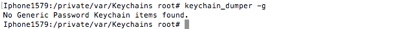

# 10.4 APP内部加密方案


##加密


加密，是以某种特殊的算法改变原有的信息数据，使得未授权的用户即使获得了已加密的信息，但因不知解密的方法，仍然无法了解信息的内容。


* 加密之所以安全，绝非因不知道加密解密算法方法，而是加密的密钥是绝对的隐藏，流行的RSA和AES加密算法都是完全公开的，一方取得已加密的数据，就算知道加密算法也好，若没有加密的密钥，也不能打开被加密保护的信息。单单隐蔽加密算法以保护信息，在学界和业界已有相当讨论，一般认为是不够安全的。公开的加密算法是给黑客和加密家长年累月攻击测试，对比隐蔽的加密算法要安全得多。

* 加密可以用于保证安全性， 但是其它一些技术在保障通信安全方面仍然是必须的，尤其是关于数据完整性和信息验证；例如，信息验证码（MAC）或者数字签名。另一方面的考虑是为了应付流量分析


* 加密或软件编码隐匿（Code Obfuscation）同时也在软件版权保护中用于对付反向工程，未授权的程序分析，破解和软件盗版及数位内容的数位版权管理 （DRM）等。


* 尽管加密或为了安全目的对信息解码这个概念十分简单，但在这里仍需对其进行解释。数据加密的基本过程包括对称为明文的原来可读信息进行翻译，译成称为密文或密码的代码形式。该过程的逆过程为解密，即将该编码信息转化为其原来的形式的过程。


### 加密分类

#### 对称加密（Symmetric Cryptography）

对称加密是最快速、最简单的一种加密方式，加密（encryption）与解密（decryption）用的是同样的密钥（secret key）。对称加密有很多种算法，由于它效率很高，所以被广泛使用在很多加密协议的核心当中。

对称加密通常使用的是相对较小的密钥，一般小于256 bit。因为密钥越大，加密越强，但加密与解密的过程越慢。如果你只用1 bit来做这个密钥，那黑客们可以先试着用0来解密，不行的话就再用1解；但如果你的密钥有1 MB大，黑客们可能永远也无法破解，但加密和解密的过程要花费很长的时间。密钥的大小既要照顾到安全性，也要照顾到效率，是一个trade-off。

对称加密的一大缺点是密钥的管理与分配，换句话说，如何把密钥发送到需要解密你的消息的人的手里是一个问题。在发送密钥的过程中，密钥有很大的风险会被黑客们拦截。现实中通常的做法是将对称加密的密钥进行非对称加密，然后传送给需要它的人。


#### 非对称加密（Asymmetric Cryptography）


非对称加密为数据的加密与解密提供了一个非常安全的方法，它使用了一对密钥，公钥（public key）和私钥（private key）。私钥只能由一方安全保管，不能外泄，而公钥则可以发给任何请求它的人。非对称加密使用这对密钥中的一个进行加密，而解密则需要另一个密钥。比如，你向银行请求公钥，银行将公钥发给你，你使用公钥对消息加密，那么只有私钥的持有人--银行才能对你的消息解密。与对称加密不同的是，银行不需要将私钥通过网络发送出去，因此安全性大大提高。


目前最常用的非对称加密算法是RSA算法，是Rivest, Shamir, 和Adleman于1978年发明，他们那时都是在MIT。


虽然非对称加密很安全，但是和对称加密比起来，它非常的慢，所以我们还是要用对称加密来传送消息，但对称加密所使用的密钥我们可以通过非对称加密的方式发送出去。为了解释这个过程，

第一步，B生成一对公钥（密码1）和私钥（密码1.1），A生成一对公钥（密码2）和私钥（密码2.2）。

第二步，B把公钥（密码1）发送给A。

第三步，A把信息用B的公钥（密码1）和自己的私钥（密码2.2）加密（想象一下怎么加密文档），然后把信息整个打包发送给B。

第四步，B用自己的私钥（密码1.1）和A的公钥（密码2）解密，获得信息。


## 常用的加密算法

### 安全散列算法

Secure Hash Algorithm，常见的算法包括了 MD5、SHA1、HMAC 等


将任意长度的二进制值映射为较短的固定长度的二进制值，这个短的二进制值称为哈希值，这个算法具有不可逆、碰撞低等特性。同时该类算法可以用作数字签名，用来证实某个信息确实是由某个人发出的，同时可以保证信息没有被修改。

哈希算法：

* 哈希算法：哈希算法将任意长度的二进制值映射为较短的固定长度的二进制值，这个小的二进制值称为哈希值。
* 哈希值是一段数据唯一且极其紧凑的数值表示形式。数据的哈希值可以检验数据的完整性。一般用于快速查找和加密算法。
* 典型的的哈希算法有：MD2、MD4、MD5 和 SHA-1等。
* 哈希算法是一种摘要算法，主要作用是用来获取数据的摘要。严格意义上来说不属于加密算法（因为没有解密过程）


这种算法有两个特性：

* 不同的输入一定得出不同的 hash 值；

* 无法从 hash 值倒推出原来的输入。

#### MD5加密

* MD5：Message Digest Algorithm MD5（中文名为消息摘要算法第五版）为计算机安全领域广泛使用的一种散列函数，用以提供消息的完整性保护。
* MD5算法具有以下特点：

	* 压缩性：任意长度的数据，算出的MD5值长度都是固定的（16进制，32位）。
	* 容易计算：从原数据计算出MD5值很容易。
	* 抗修改性：对原数据进行任何改动，哪怕只修改1个字节，所得到的MD5值都有很大区别。
	* 强抗碰撞：已知原数据和其MD5值，想找到一个具有相同MD5值的数据（即伪造数据）是非常困难的。


* 获取字符串MD5值：引入<CommonCrypto/CommonCrypto.h>、获取字符串的MD5值。

```
// 1.准备一个字符串用于加密(同一个字符串进行MD5加密出来的内容类似)
    NSString *str = @"I Love you";
    // 2.因为MD5是基于C语言的,所以需要将字符串进行编码
    const char *data = [str UTF8String];
    // 3.使用字符串数组去存取加密后相关的内容(MD5 16进制,32位)
    // CC_MD5_DIGEST_LENGTH 表示长度
    unsigned char result [CC_MD5_DIGEST_LENGTH];
    // 4.进行MD5加密
    // 参数1:需要加密的内容
    // 参数2:要加密的data的一个长度
    // 参数3:存储加密结果的数组(MD5)
    CC_MD5(data, (CC_LONG)strlen(data), result);
    // 5.创建可变字符串,保存结果
    NSMutableString *mStr = [NSMutableString string];
    // 6.遍历结果数组,然后添加到可变字符串中
    for (int i = 0; i < CC_MD5_DIGEST_LENGTH; i++) {
        [mStr appendFormat:@"%02x", result[i]];
    }

```

* 获取其它对象MD5值：引入<CommonCrypto/CommonCrypto.h>、将其它对象转化为NSData对象（可以将对象事先写入文件）、读取NSData对象的MD5值。代码示例：（以数组为例）

```
// 需求:创建一个数组,数组中存储元素,将这个数组写入到沙盒里
    // 创建数组
    NSArray *array = @[@"Jack", @"Rose"];
　　// 找沙盒路径
    NSString *path = [NSSearchPathForDirectoriesInDomains(NSDocumentDirectory, NSUserDomainMask, YES) objectAtIndex:0];
    // 拼接路径
    NSString *arrayPath = [path stringByAppendingPathComponent:@"array.plist"];
    // 写入
    [sender writeToFile:arrayPath atomically:YES];
    
    // 从沙盒中取出NSData数据
    NSData *data = [NSData dataWithContentsOfFile:arrayPath];
   
    
    // NSData类型数据加密过程
    // 1.创建MD5对象
    CC_MD5_CTX md5;
    
    // 2.初始化MD5对象
    CC_MD5_Init(&md5);
    
    // 3.准备开始进行数据加密
    CC_MD5_Update(&md5, data.bytes, (CC_LONG)data.length);
    
    // 4.结束MD5加密
    // 准备一个字符串数组用来存储结果
    unsigned char result[CC_MD5_DIGEST_LENGTH];
    CC_MD5_Final(result, &md5);
    // 5.获取结果
    NSMutableString *mStr = [[NSMutableString alloc] initWithCapacity:CC_MD5_DIGEST_LENGTH];
    // 遍历数组给可变字符串赋值
    for (int i = 0; i< CC_MD5_DIGEST_LENGTH; i++) {
        [mStr appendFormat:@"%02x", result[i]];
    }
　　NSLog(@"%@", mStr);

```


### 对称加密


symmetric-key encryption，其中常见的算法包括了 AES、DES、3DES 、RC4等。

* 对称加密指的是可以使用同一个密钥对内容进行加密和解密，相比非对称加密，它的特点是加/解密速度快，并且加密的内容长度几乎没有限制。


### 非对称加密

asymmetric/public-key encryption，常见的加密算法有 RSA、DSA、ECC 等。


* 非对称加密有两个密钥，分别为公钥和私钥，其中公钥公开给所有人，私钥永远只能自己知道。


* 使用公钥加密的信息只能使用私钥解密，使用私钥加密只能使用公钥解密。前者用来传输需要保密的信息，因为全世界只有知道对应私钥的人才可以解密；后者用来作数字签名，因为公钥对所有人公开的，可以用来确认这个信息是否是从私钥的拥有者发出的。


## 网络传输数据安全性


数据安全：是一种主动的包含措施，数据本身的安全必须基于可靠的加密算法与安全体系，主要是有对称算法与公开密钥密码体系两种（非对称算法），都包含了数据的加密和解密过程

传输数据安全：为了保证传输数据的安全，需要使用加密算法。在决定什么样的业务场景使用什么样的加密算法之前，先要了解我们的工具箱里有哪些可用工具。加密算法的工具箱里其实就两种工具：“对称”加密算法和“非对称”加密算法。清楚这两个分类是合理设计加密算法使用场景的大前提，两个分类里我们各挑选一个代表算法来研究，“对称”加密挑选AES，“非对称”加密选择RSA。了解AES和RSA之后我们再针对一些特定业务场景设计安全模型。


### App网络应用场景

现在绝大部分的App都在使用http和https，少部分会有自己的tcp长连接通道，更少部分的app搭配udp通道或者类似QUIC这种reliable UDP协议来提升体验。不管是什么协议，只要涉及客户端和服务器的通信，就必然要实现类似https安全握手的流程，部分或者全部，开发者总是在性能和安全性之间取舍。有实力的大厂可以鱼与熊掌兼得，初创型企业往往会避开性能优化，直接跳过安全问题。


* 使用http，不做任何加密相当于裸奔，初级工程师都可以轻易窥探你全部的业务数据。

* 使用http，但所有的流量都通过预埋在客户端的key进行AES加密，流量基本安全，不过一旦客户端代码被反编译窃取key，又会回到裸奔状态。

* 使用http，但AES使用的key通过客户端以GUID的方式临时生成，但为了保证key能安全的送达服务器，势必要使用服务器的公钥进行加密，所以要预埋服务器证书，又涉及到证书过期更新机制。而且无法动态协商使用的对称加密算法，安全性还是有暇疵。

* 所以要做到真正的安全，最后还是会回归到https的流程上来，https在身份验证，密钥协商，解密算法选择，证书更新等方面都已经做了最合适的选择。

* 对于App开发者来说，到底选择什么样的安全策略，是在全盘了解现有安全模型的前提下，在投入，产出，风险三者之间去平衡而做出最优的选择。


### App网络安全实战

在App安全上的投入再多也不会过，不过安全问题上所投入的开发资源应该根据开发团队技术积累，产品发布deadline，用户规模及产品关注度等综合因素考量。结合这些因素我把App分为三类，各类App对安全级别的要求不同，投入产出也不同。

#### 第一类，作坊式创业App

这些年伴随着移动互联网的创业潮，各式各样的app出现在用户的手机端。对于创业初期的团队来说，能把业务模型尽快实现上线当然是重中之重。但很多创业团队在安全上的投入几乎为零，所导致的安全问题比想象中的要严重。我见过不少使用http明文传输用户名密码的app，其中甚至包括一些知名传统企业。其实只要照顾到一些基础方面就能过滤掉大部分的安全漏洞了。这里提供一些小tip供创业初期团队参考：

*  Tip 1:尽量使用https

https可以过滤掉大部分的安全问题。https在证书申请，服务器配置，性能优化，客户端配置上都需要投入精力，所以缺乏安全意识的开发人员容易跳过https，或者拖到以后遇到问题再优化。https除了性能优化麻烦一些以外其他都比想象中的简单，如果没精力优化性能，至少在注册登录模块需要启用https，这部分业务对性能要求比较低。

* Tip 2:不要传输密码

不知道现在还有多少app后台是明文存储密码的。无论客户端，server还是网络传输都要避免明文密码，要使用hash值。客户端不要做任何密码相关的存储，hash值也不行。存储token进行下一次的认证，而且token需要设置有效期，使用refresh token去申请新的token。

* Tip 3:Post并不比Get安全

事实上，Post和Get一样不安全，都是明文。参数放在QueryString或者Body没任何安全上的差别。在Http的环境下，使用Post或者Get都需要做加密和签名处理。

* Tip 4:不要使用301跳转

301跳转很容易被Http劫持攻击。移动端http使用301比桌面端更危险，用户看不到浏览器地址，无法察觉到被重定向到了其他地址。如果一定要使用，确保跳转发生在https的环境下，而且https做了证书绑定校验。

* Tip 5:http请求都带上MAC

所有客户端发出的请求，无论是查询还是写操作，都带上MAC（Message Authentication Code）。MAC不但能保证请求没有被篡改（Integrity），还能保证请求确实来自你的合法客户端（Signing）。当然前提是你客户端的key没有被泄漏，如何保证客户端key的安全是另一个话题。MAC值的计算可以简单的处理为hash（request params＋key）。带上MAC之后，服务器就可以过滤掉绝大部分的非法请求。MAC虽然带有签名的功能，和RSA证书的电子签名方式却不一样，原因是MAC签名和签名验证使用的是同一个key，而RSA是使用私钥签名，公钥验证，MAC的签名并不具备法律效应。

* Tip 6:http请求使用临时密钥

高延迟的网络环境下，不经优化https的体验确实会明显不如http。在不具备https条件或对网络性能要求较高且缺乏https优化经验的场景下，http的流量也应该使用AES进行加密。AES的密钥可以由客户端来临时生成，不过这个临时的AES key需要使用服务器的公钥进行加密，确保只有自己的服务器才能解开这个请求的信息，当然服务器的response也需要使用同样的AES key进行加密。由于http的应用场景都是由客户端发起，服务器响应，所以这种由客户端单方生成密钥的方式可以一定程度上便捷的保证通信安全。

* Tip 7:AES使用CBC模式

不要使用ECB模式，原因前面已经分析过，记得设置初始化向量，每个block加密之前要和上个block的秘文进行运算。

#### 第二类，正规军App

* All Traffic HTTPS

全站使用HTTPS，而且是强制使用。baidu到今天（2016.04.13）还没有强制使用HTTPS。所有的流量都应该在HTTPS上产生，没有人可以决定哪些流量是可以不用考虑安全问题的。如果自建长连接使用tcp，udp或者其他网络协议，也应该实现类似HTTPS的密钥协商流程。

* Certificate Pinning

RSA的签名机制虽然看着安全，一旦出现上游证书颁发机构私钥泄漏，或者签名流程发现漏洞等情况，中间人攻击还是会导致数据被第三方破解甚至被钓鱼。Certificate Pinning是一种与服务器证书强绑定的机制，要么绑定证书本身，需要证书更新机制配合加强安全性，要么使用私钥绑定，这样更新证书的时候只要保证私钥不变即可。现在流行的HTTP framework，iOS端如AFNetworking，Android端如OKHttp都支持Certificate Pinning。

* Perfect Forward Secrecy

很多人会觉得非对称加密算法足够安全，只要使用了RSA或者AES，加密过后的数据就认为安全。但没有绝对的安全，无论是RSA或者AES算法本身都有可能在未来某一天被破解，正如当年的DES，甚至有传言NSA正如当年掌握了differential cryptanalysis一样，现在已经获取了某种方法来破解当前互联网当中的部分网络流量，至于到底是RSA还是AES就不得而知了。

未来计算机的计算能力是个未知数，或许某一天brute force能够暴力破解的密钥长度会远超128bits（现阶段上限应该在80bits）。

2014年1月3日，美国国家安全局（NSA）正在研发一款用于破解加密技术的量子计算机，希望破解几乎所有类型的加密技术。

即使算法本身没有被破解，密钥也有可能被泄漏，技术上的原因或者政策上的因素都可能导致RSA或者ECC的私钥被泄漏。所以尽可能针对不同的session使用不同的key能够使的我们的数据更佳安全。

Forward Secrecy就是为了避免某个私钥的泄漏或者被破解而导致历史数据一起泄漏。现在google的https配置所使用的是TLS_ECDHE_RSA算法，每次对称密钥的协商都是使用ECC生成临时的公钥私钥对（之前提到过ECC在快速生成密钥对上有优势），身份验证使用RSA算法进行签名。

每天跟踪信息安全动态

安全的攻防战不会有穷尽的一天，算法的更替会伴随着人类对知识的无尽渴望延绵至不可预知的未来。AES说不定哪天被破解了，openSSL可能又出现新的漏洞了，google又提倡新的安全模型了，NSA的量子计算机说不准已经在悄悄解密google的流量了，每天跟踪八卦最新业界动态才是码农避免因bug而背黑锅的不二法宝。

#### 第三类，带节操正规军App

现在互联网早已渗入每个人的平常生活当中，当我们的行为越来越多的迁移到互联网这个媒介当中之后，行为本身及所产生的关联数据都将被滴水不漏的记录起来，特别是在大数据研究兴起的当下，服务提供商总是希望尽可能多的记录用户所有的行为数据。每个互联网产品的使用者都成了样本，你的购物记录，商品浏览历史，搜索引擎搜索记录，打车记录，租房记录，股票记录，甚至聊天记录等等都是样本，毫不夸张的说，如果将淘宝，微信，支付宝，快滴，美团等等高频次产品数据统一分析，基本上可以将你的身高，性别，年龄，三维，家庭住址，恋爱史，家庭成员，甚至是个人喜好，性格等等完美的呈现出来，其后果远不是一个骚扰电话带来的隐私泄漏那么简单。

移动互联网的大部分使用者还不具备强烈的安全意识，当你用手机号作为登录id方便记忆的同时，骚扰电话就可能随时来临，你在百度输入租房关键字，下一秒中介就已经电话打上门。当你允许app上传通讯录匹配可能认识的好友同时，你认识哪些人就变得一清二楚，你p2p借贷未及时归还时，你的亲朋好友第二天就收到了催债电话。我们在享受移动互联网的便利同时，付出的是个人隐私这种隐形成本。下一次，当我们感叹新app好用便利的同时，静思三分钟，好好想想我们的哪些隐私又被当白菜卖了。

在互联网受众的安全意识普遍觉醒之前，只能靠app开发商，服务提供商的节操来保证用户信息隐私安全。

带节操的App在打算记录用户行为或者数据之前会考虑下是不是真的有需要，用户的确会有需要查询历史购买记录，但有多少人会在意自己几年前花几个小时浏览了杜蕾斯的产品。

服务器作为数据存储或者转发的媒介是不是真的需要了解真实的数据为何？现在WhatsApp，Telegram都已经支持端到端的加密聊天方式，服务器本身看到的都是秘文，只做秘文转发处理，带着这样的节操设计产品，用户才会觉得安全。

WhatsApp的端到端加密安全模型是怎么样实现的呢？非常值得学习。

简单来说是严格遵循forward secrecy。每个用户在注册成功之后会在服务器存一对永久的Identity Key，一对临时的Signed Pre Key（Signed Pre Key由Identity Key签名，每隔一段时间变化一次），n对临时的One-Time Pre Key（每次建立session消耗一个）。

每次session开始建立的时候使用Identity Key，Signed Pre Key， One Time Key生成Master Secret。Master Secret再通过HKDF算法生成对称加密使用的Root Key，Chain Key，Message Key。

Forward Secrecy体现在每次sender发送的消息被ack后，都会交换新的临时ECC Key对，并更新Root Key，Chain Key，Message Key。这样网络中的流量即使被第三方缓存起来，而且某一天某个Key Pair的私钥被破解，也不会对之前的流量产生安全影响。ECC Key对会随着消息的发送不停的“Ratcheting”。这是属于非对称加密的Forward Secrecy。

在sender的消息被ack之前，也就是新的ECC Key对交换成功之前，Message Key也会通过HKDF算法不停的“Ratcheting”，确保每条消息所使用的对称密钥也不相同。这是属于对称加密的Forward Secrecy。

有兴趣深入了解的同学可以自己google：WhatsApp Security WhitePaper。


### HTTPS通信链路的安全

https是在http通信协议上加了一层SSL/TLS安全握手过程，以保证通信双方的合法认证 并 保证数据以密文形式传输。本文不赘述SSL的具体过程及原理，以下是iOS端处理SSL安全认证的常见方法：

#### 确认server端返回的证书是CA授权的合法证书

```
SecTrustRef serverTrust = challenge.protectionSpace.serverTrust;

```

```
static BOOL serverTrustIsVaild(SecTrustRef trust) {
   BOOL allowConnection = NO;

// 假设验证结果是无效的
SecTrustResultType trustResult = kSecTrustResultInvalid;

// 函数的内部递归地从叶节点证书到根证书的验证
OSStatus statue = SecTrustEvaluate(trust, &trustResult);

    if (statue == noErr) {
    // kSecTrustResultUnspecified: 系统隐式地信任这个证书
    // kSecTrustResultProceed: 用户加入自己的信任锚点，显式地告诉系统这个证书是值得信任的

    allowConnection = (trustResult == kSecTrustResultProceed 
                                || trustResult == kSecTrustResultUnspecified);
    }
    return allowConnection;
}


```


#### 验证域名

可以通过以下的代码获得当前的验证策略：

```
CFArrayRef policiesRef;
SecTrustCopyPolicies(trust, &policiesRef);

```

打印 policiesRef 后，你会发现默认的验证策略就包含了域名验证。如果想自定义域名验证过程，可参考：

```
NSString *serverHostname = challenge.protectionSpace.host;
    CFRetain(serverTrust);
    
    SecPolicyRef SslPolicy = SecPolicyCreateSSL(YES, (__bridge CFStringRef)(serverHostname));
    SecTrustSetPolicies(serverTrust, SslPolicy);
    CFRelease(SslPolicy);
    serverTrustIsVaild(serverTrust)


```

或者取消域名验证

```
NSMutableArray *policies = [NSMutableArray array];
    
// BasicX509 不验证域名是否相同
SecPolicyRef policy = SecPolicyCreateBasicX509();
[policies addObject:(__bridge_transfer id)policy];
SecTrustSetPolicies(serverTrust, (__bridge CFArrayRef)policies);
serverTrustIsVaild(serverTrust)


```

#### 验证证书的确实是自己信任的证书。

App可以将证书文件存于bundle中，也可以将证书内的一些需要验证的value存于代码中，如：PublicKey。

```
SecCertificateRef serverCertificate = SecTrustGetCertificateAtIndex(trust, 0);
      NSData* serverCertificateData = (NSData* )SecCertificateCopyData(serverCertificate);
      NSString *serverCertPublicKey = (NSString* )SecCertificateCopyPublicKey(serverCertificate);//通过SecCertificateCopyPublicKey等一系列方法可以取出证书中的所有信息，以备进行比对。


```


注意使用：

```

 CFIndex certCount = SecTrustGetCertificateCount(trust);

```

去获取证书链上的每一级证书，必要时分别进行验证。


#### 自签名的证书链验证（optional）

假设你的服务器返回：[你的自签名的根证书] -- [你的二级证书] -- [你的客户端证书]，系统是不信任这个三个证书的。
所以你在验证的时候需要将这三个的其中一个设置为锚点证书，当然，多个也行。
比如将 [你的二级证书] 作为锚点后，SecTrustEvaluate() 函数只要验证到 [你的客户端证书] 确实是由 [你的二级证书] 签署的，那么验证结果为 kSecTrustResultUnspecified，表明了 [你的客户端证书] 是可信的。下面是设置锚点证书的做法：

```
NSMutableArray *certificates = [NSMutableArray array];

NSDate *cerData = /* 在 App Bundle 中你用来做锚点的证书数据，证书是 CER 编码的，常见扩展名有：cer, crt...*/

SecCertificateRef cerRef = SecCertificateCreateWithData(NULL, (__bridge CFDataRef)cerData);

[certificates addObject:(__bridge_transfer id)cerRef];

// 设置锚点证书。
SecTrustSetAnchorCertificates(serverTrust, (__bridge CFArrayRef)certificates);
serverTrustIsVaild(serverTrust)


```

只调用 SecTrustSetAnchorCertificates () 这个函数的话，那么就只有作为参数被传入的证书作为锚点证书，连系统本身信任的 CA 证书不能作为锚点验证证书链。要想恢复系统中 CA 证书作为锚点的功能，还要再调用下面这个函数：

```
// true 代表仅被传入的证书作为锚点，false 允许系统 CA 证书也作为锚点
SecTrustSetAnchorCertificatesOnly(trust, false);

```

###传输数据的安全

原则只有一个，不管是https还是http，不要明文传输敏感数据，防止数据泄露。并且要充分验证传输数据的完整性，保证数据不被篡改。

* 通常情况下，对称加密算法如AES加密可以高效加密数据，但key一旦泄露，服务器端不容易更改，所以更安全的加密方式为RSA非对称加密，更严格者可以使用双向RSA加密，保证request和response的数据都只有拥有private key的接收端可以正确解密。
* 有时为了使后台也不能得到明文信息，如用户密码。就需要在客户端进行MD5或者HASH不可逆加密。服务端存储的也应是同样算法加密后的值。由于目前MD5可以通过一些工具和网站解密出一些原文，我们有必要对md5进行一些二次加工，如加盐，加盐后乱序，重复多次md5加密等手段加大破解的难度。
* 通过计算form/body的hash/md5值，将其和数据一起发送出去，接收端自行计算接收data的hash/md5值，并和接收到的值进行比对，已验证数据完整性。（文件传输尤其需要）
* 有时，为了保证service api的访问安全，服务器会设置访问密码.

```
NSURLCredential *defaultCredential = [NSURLCredential credentialWithUser:@"username" password:@"password" persistence:NSURLCredentialPersistenceForSession];
        NSURL *APIURL = [NSURL URLWithString:@"www.test.com"];
        NSString *host = [APIURL host];
        NSInteger port = [APIURL port];
        NSString *scheme = [APIURL scheme];
        NSURLProtectionSpace *protectionSpace = [[NSURLProtectionSpace alloc] initWithHost:host port:port protocol:scheme realm:nil authenticationMethod:NSURLAuthenticationMethodHTTPBasic];
        NSURLCredentialStorage *credentials = [NSURLCredentialStorage sharedCredentialStorage];
        [credentials setDefaultCredential:defaultCredential forProtectionSpace:protectionSpace];
        
        NSURLSessionConfiguration *sessionConfiguration = [NSURLSessionConfiguration defaultSessionConfiguration];
        [sessionConfiguration setURLCredentialStorage:credentials];
        //sessionConfiguration.HTTPAdditionalHeaders =@{@"Authorization":[NSString stringWithFormat:@"Basic %@=%@",@"username",@"password"]};
        //不需要在手动设置header
        NSURLSession *sesson = [NSURLSession sessionWithConfiguration:sessionConfiguration];


```


## 本地存储加密


### 配置文件

为了存储必要的数据在本地，一般情况下使用NSUserDefaults 或者使用数据库的方式。由于在越狱的手机上，用户可以访问到该项目的私有文件夹，并且可以拿到 plist 和 db 文件，那么如果明文存储敏感数据的话，那么就可以轻易获取，危害用户的信息隐私，解决的办法在于，需要将这些信息进行加密之后再存储，虽然这样不能完全防止被破解，但是这样提高了黑客的破解代价。

```
具体的加密可以参照关键字段加密介绍的 RSA，DES 和 AES 加密算法。

```

最好不要使用 Base64 这种简单的加密和 md5 这种不可逆的加密，当然使用 DES 和 AES 也不是完全安全的，只要黑客对你的源码进行解析，发现了加密的公钥，依然可以破解你的信息，所以最好的方法是定期更换公钥，或者由服务器分配公钥。


Plist文件主要用于存储用户设置及App的配置信息，但App可能使用Plist文件存储明文的用户名、密码或其它一些个人敏感信息。而保存在Plist文件中的二进制格式文件数据则可以使用Plist文件编辑器（如plutil）进行查看或修改，即使在一个没有越狱的设备上，plist文件也可以通过工具iExplorer获取。对于以编码、未加密或弱加密形式存储的敏感信息就可能会导致敏感信息泄露了。WordPress的iOS版App曾经就在Plist文件中存储了明文的用户名和密码

* 尽量不要在iOS设备的Plist文件中保存敏感信息（如证件号、银行卡号、详细住址及其各对应的编码格式等）

* 对于有些APP功能需求，如果一定需要在iOS设备本地保存敏感信息，则可采用iOS提供的加密接口（如CommonCrypto）进行安全加密后保存。


### NSLog 打印内容缓存

为了清晰的看到接口返回的数据，或者为了定位每一步调用，相关参数的变化，有很多程序员会使用 NSLog 将数据和参数的值进行打印，而且一些第三方框架也会进行数据打印，这些数据在程序运行之后会在沙盒内的 /Library/Caches 下进行缓存。建议有打印数据需求的开发者将 NSLog 进行封装：

```

//------------------------打印日志-----------------------------
//DEBUG  模式下打印日志,当前行
#ifdef DEBUG
#   define DLog(fmt, ...) NSLog((@"%s [Line %d] " fmt), __PRETTY_FUNCTION__, __LINE__, ##__VA_ARGS__);
#else
#   define DLog(...)
#endif

#ifdef DEBUG
#   define QXDLog(fmt, ...) NSLog((@"-------------- \n %s [Line %d] \n------------" fmt), __PRETTY_FUNCTION__, __LINE__, ##__VA_ARGS__);

#define QXDAFNErrorLog(error) NSLog((@"-------------- \n %s [Line %d] \n \n %@-------------\n"), __PRETTY_FUNCTION__, __LINE__, [[NSString alloc] initWithData:error.userInfo[@"com.alamofire.serialization.response.error.data"] encoding:NSUTF8StringEncoding]);
#else
#   define QXDLog(...)
#   define QXDAFNErrorLog(error)
#endif


```

然后一般的第三方框架都会有 Log 输出等级的设置，在测试完成之后，可以将其设置为不输出 Log，保证安全。


###  SQLite数据库文件

打开程序目录/Library/Caches/项目bundle ID/下的cache.db文件, 会发现这个 db 文件对每个接口的请求返回数据进行了存储，当然包括以下敏感的数据，

iOS自带的SQLite数据库没有内置的加密支持，因此，许多iOS APP会直接以明文格式将许多敏感数据存储在SQLite数据库中,除非APP自身对数据进行加密后再存储。例如，为提供离线的邮件访问功能，Gmail的iOS APP以明文方式将所有邮件存储在SQLite数据库中。一旦可以物理访问到设备或其备份文件，存储在SQLite中未加密的敏感信息容易被泄露。 


例如：用户登录完成之后后台返回的用户信息数据，用户 Token ....这些信息是由 AFNetworking 这个框架进行缓存的。
而这些缓存对我们都是没有用的，这个时候可以使用限制程序缓存的方式，让这些缓存消失:

```
// 清除本地数据请求缓存
NSURLCache *sharedCache = [[NSURLCache alloc] initWithMemoryCapacity:0 diskCapacity:0 diskPath:0];
[NSURLCache setSharedURLCache:sharedCache];

```

安全方案

* 方案1，最简单的方法就是尽量不在客户端的SQLite数据库中保存敏感信息；

* 方案2，如果确实需要将某些敏感信息保存在SQLite数据库中时，可以结合使用以下几种方案：

	* 数据加密：使用如AES256加密算法对数据进行安全加密后再存入SQLite中； 
	* 整库加密：可使用第三方的SQLite扩展库，对数据库进行整体的加密。 
	* 数据覆盖：在删除SQLite数据库某条记录之前，可以使用垃圾数据update一下该条目。这样即使有人尝试从SQLite文件中恢复已删除的数据库时，他们也无法获取到实际的数据。

方案2中提到的三种子方案，也各有优缺点：


###  键盘缓存

#### 功能模块介绍

为提供自动填充和纠正的功能，iOS系统的自带键盘会缓存用户的输入信息。其会保存一个接近600个单词的列表，存放在``Library/Keyboard/ en_GB-dynamic-text.dat”或“/private/var/mobile/Library/Keyboard/dynamic-text.dat``文件中（iOS版本不同，位置及文件名会略有不同）。

####风险描述

这个功能会带来一个安全问题：它会明文存储用户在输入框中输入过的所有信息，如用户名、密码短语、安全问题回答等。由于键盘会缓存这些输入框信息，使得在开始输入一个如安全问题答案的时候，缓存会帮助攻击者自动完成该问题的答案输入。 
要想查看该键盘缓存，可以将上述如“en_GB-dynamic-text.dat”文件复制到电脑上，并使用十六进制编辑器打开。下图就是一个键盘缓存的使用16进制浏览的截图，可以看到明文的输入信息（this is a test）。


#### 安全方案

* 首先，对于以下位置或方式的输入，iOS不会对其输入内容进行缓存

	* 在标记为secure的字段、passwords字段内输入的内容不会缓存； 
	* 输入只包括数字的字符串不会被缓存，这也即意味着银行卡号、信用卡号是安全的，（iOS 5之前的版本会缓存）； 
	* 非常短的输入，如只有1或者2个字母组成的单词不会被缓存； 
	* 禁用了自动纠正功能的文本框会阻止输入内容被缓存；

* 可以在不需要缓存的文本框处禁用自动纠正功能。如下代码所示：

```
UITextField *textField = [[UITextField alloc] initWithFrame: frame ]; 
textField.autocorrectionType = UITextAutocorrectionTypeNo;

```	
	
*  输入框也可以被标记为密码输入类型，使得输入变得更加安全，防止缓存。如

```
textField.secureTextEntry = YES;

```
	
* 在所有敏感信息输入处均使用自定义键盘，当然自定义键盘也不能缓存用户输入。（这可能会影响用户体验）


另外除了文本输入的地方，在iOS系统上，当数据被复制到粘贴板上的时候，也会被进行明文缓存，而且粘贴板内容所有APP均可访问。为禁用文本框的复制/粘贴功能，使得用户无法在某些地方进行复制和粘贴，可在该文本输入的地方添加以下方法：


##### 在所有敏感信息输入处均使用自定义键盘（尤其是银行App和Hybird App）下面是一段自定义键盘收起和展开的事件响应：

```
-(BOOL)canPerformAction:(SEL)action withSender:(id)sender {
	UIMenuController *menuController = [UIMenuController sharedMenuController]; 
	if (menuController) {
		menuController.menuVisible = NO;
	}
	return NO;
}


```	


```

@interface WQSafeKeyboard : UIWindow  

@property (nonatomic, weak, setter = focusOnTextFiled:) UITextField *textFiled;  
+ (WQSafeKeyboard *)deploySafeKeyboard;  
@end  

@interface WQSafeKeyboard()  

@property (nonatomic, strong)WQInterKeyboard *keyboard;  
@end  

@implementation WQSafeKeyboard  

+ (WQSafeKeyboard *)deploySafeKeyboard  
{  
    WQSafeKeyboard *kb = [[WQSafeKeyboard alloc]init];  
    [kb addObserver];  
    return kb;  
}  

- (instancetype)init  
{  
    if (self = [super init]) {  
        self.windowLevel = UIWindowLevelAlert;  
        self.frame = CGRectZero;  
        self.rootViewController = self.keyboard;  
    }  
    return self;  
}  

- (void)dealloc  
{  
    [[NSNotificationCenter defaultCenter] removeObserver:self];  
}  

- (WQInterKeyboard *)keyboard  
{  
    if (!_keyboard) {  
        _keyboard = [[WQInterKeyboard alloc]init];  
    }  
    return _keyboard;  
}  

- (void)focusOnTextFiled:(UITextField *)textFiled  
{  
    _textFiled = textFiled;  
    self.keyboard.textField = _textFiled;  
}  

- (void)addObserver  
{  
    [[NSNotificationCenter defaultCenter]addObserver:self  
                                            selector:@selector(keyboardWillShow:)  
                                                name:UIKeyboardWillShowNotification  
                                              object:nil];  
    [[NSNotificationCenter defaultCenter]addObserver:self  
                                            selector:@selector(keyboardWillHide:)  
                                                name:UIKeyboardWillHideNotification  
                                              object:nil];  
}  

- (void)keyboardWillShow:(NSNotification *)notification  
{  
    if (![self.textFiled isFirstResponder]) {  
        return;  
    }  
    [self keyboardAnimationWithNotification:notification];  
}  

- (void)keyboardWillHide:(NSNotification *)notification  
{  
    if (![self.textFiled isFirstResponder]) {  
        return;  
    }  
    [self keyboardAnimationWithNotification:notification];  
}  

- (void)keyboardAnimationWithNotification:(NSNotification *)notification  
{  
    [self makeKeyAndVisible];  
    NSDictionary *userInfo = [notification userInfo];  
    CGRect kbFrame_end,kbFrame_begin;  
    NSTimeInterval animationDuration;  
    UIViewAnimationCurve animationCurve;  
    [userInfo[UIKeyboardFrameEndUserInfoKey] getValue:&kbFrame_end];  
    [userInfo[UIKeyboardFrameBeginUserInfoKey] getValue:&kbFrame_begin];  
    [userInfo[UIKeyboardAnimationCurveUserInfoKey] getValue:&animationCurve];  
    [userInfo[UIKeyboardAnimationDurationUserInfoKey] getValue:&animationDuration];  

    self.frame = [self resizeFrameToAdjust:kbFrame_begin];  
    [UIView animateWithDuration:animationDuration  
                          delay:0  
                        options:(animationCurve<<16)  
                     animations:^{  
                         self.frame = [self resizeFrameToAdjust:kbFrame_end];  
                     }completion:^(BOOL finished) {  

                     }];  
    if ([notification.name isEqualToString:UIKeyboardWillHideNotification]) {  
        [self resignKeyWindow];  
    }  
}  

- (CGRect)resizeFrameToAdjust:(CGRect)frame  
{  
    if ([[UIApplication sharedApplication] isStatusBarHidden] )  
        return frame;  

    if (SYSTEM_VERSION_LESS_THAN(@"7.0")) {  
        frame = CGRectMake(frame.origin.x,  
                           frame.origin.y - STATUSBAR_HEIGHT,  
                           frame.size.width,  
                           frame.size.height);  
    }  
    return frame;  
}  

@end


```
	
	
### 应用快照缓存

####功能模块介绍

当一个应用在后台被挂起时，iOS会生成一个当前屏幕的快照，当应用被重新唤起时，可以快速还原该APP之前的内容，以提高用户的使用体验。

####风险描述

然而，这样做也可能会导致一些应用数据的泄露。应用快照保存在``/var/mobile/Containers/Data/Application/XXXXXXX-XXXXXXXXX-XXXXXXXXX/Library/Caches/Snapshots/``目录下。恶意APP可通过读取该文件并发送至远程服务端，从而获得其快照内容信息。 
例如，以下快照截图就是在APP上查看邮件时直接按下home按键后截图的内容。


#### 安全方案

要防止这种信息泄露途径，屏幕内容就必须在iOS系统进行屏幕快照之前进行隐藏或模糊化处理，而iOS系统也提供了许多回调方法来提示程序将被挂起。例如以下两个方法：

```
-(void)applicationWillResignActive:(UIApplication *)application 
应用程序将要入非活动状态执行，在此期间，应用程序不接收消息或事件 
-(void)applicationDidEnterBackground:(UIApplication *)application 
程序将被推送到后台。 
```
下图为APP压入后台的过程，右边则是可供APP回调的方法，可利用其实现自己的一些需求：


	
	
	
#####方案一： 一个简单方法就是设置关键窗口的hidden属性为YES，这样当前在屏幕上显示的内容将被隐藏，返回一个空白的快照来替代任何内容。

```
[UIApplication sharedApplication].keyWindow.hidden=YES;

```
	
注意：如果在当前窗口后面有其他的窗口，当关键窗口被隐藏时，那些窗口将会被显示出来。所以当使用这种方法时要确保也隐藏了其他窗口。。 
当应用程序即将进入非活动状态时（如接到一个电话或切换到其他应用程序时），applicationWillResignActive方法会被回调。因此可以用以下代码来隐藏窗口。

```

-(void)applicationWillResignActive:(UIApplication *)application
{
    [UIApplication sharedApplication].keyWindow.hidden=YES;
}

```

另一个重要的地方是把这些代码加入到aplicationDidEnterBackground方法中，此方法会在APP被压入后台但在屏幕快照被调用前被调用。

```
-(void)applicationDidEnterBackground:(UIApplication *)application
{
    [UIApplication sharedApplication].keyWindow.hidden=YES;
}


```
	
	
###应用日志

####功能模块介绍

基于iOS APP程序开发排错的需要，开发人员一般都会写一些数据到日志中，而这些数据就可能包括证件号、登录用户名和密码、认证token或其它的一些敏感信息。

####风险描述

应用程序的错误日志是不被应用程序的沙盒隔离保护的，一个APP产生的错误日志可以被另一个APP读取。此外，在越狱iOS设备上，APP还可获取到其他应用输出所有的日志信息。因此，如果一个APP使用日志功能输出了某些敏感信息，那么恶意APP就能够读取到这些信息，并可将其发送到一个远程服务器上。另外，可以直接从AppStore上下载安装“console”应用，查看iOS系统及APP输出的错误日志信息。可以在“/var/log/”目录下找到iOS的日志文件。 
如下图所示，某个APP在日志中输出了用户名及登录密码：


####安全方案

不要在APP的日志中记录或打印敏感信息，并且在正式发布的时候，确保关闭了日志打印开关。
	
	
### keychain存储

#### 功能模块介绍

Keychain是一个拥有有限访问权限的SQLite数据库（AES256加密），可以为多种应用程序或网络服务存储少量的敏感数据（如用户名、密码、加密密钥等）。如保存身份和密码，以提供透明的认证，使得不必每次都提示用户登录。在iPhone上，Keychain存放在``/private/var/Keychains/keychain-2.db``SQLite数据库。 
Keychain数据库包含了一些Keychain条目，每个条目都由加密的数据和一系列未加密的描述属性组成，Keychain的条目类型（kSecClass）决定了其关联的一些描述属性。在iOS系统中，Keychain条目被分为5种类型：


其中，数字身份=证书+密钥。

在iOS的Keychain中，所有的Keychain条目都被存储在Keychain SQLite数据库的4张表中：genp、inet、cert和keys。genp数据表存储了普通密码的Keychain条目，inet数据表存储了网络密码的Keychain条目，cert和keys数据表分别存储了证书和密钥的Keychain条目。


Keychain的数据库内容使用了设备唯一的硬件密钥进行加密，该硬件密钥无法从设备上导出。因此，存储在Keychain中的数据只能在该台设备上读取，而无法复制到另一台设备上解密后读取。


iOS APP的Keychain数据是存储在应用沙箱外面的，各APP的keychain数据内容为逻辑隔离，由系统进程securityd实施访问控制。一个应用默认无法读取到另一个应用在Keychain中存储的数据。在iOS系统中，每个APP都附带一个唯一的应用标识符，而Keychain服务则使用这个应用标识符限制其对其它Keychain数据的访问。默认情况下，APP只能访问与他们的应用标识符相关联的数据。为了在多个APP间能够共享Keychain信息，Apple引入了Keychain访问组概念：拥有相同Keychain访问组标识符的应用，可以共享Keychain数据。APP的Keychain访问权限（即标识符）被加密嵌入在了APP的二进制文件中，但可以通过使用grep或sed命令将其从该文件中提取出来。


通过SSH连接到iPhone上，进入到应用的home目录中(``ios8:/var/mobile/Containers/Bundle/Application/[unique-id]/``)，运行以下命令：
 
```
sed –n ‘//,/<\/dict>/p’ [AppDirectory]/[ApplicationBinary] 
```

例如：以下命令列出了QQ应用的keychain权限：


上述输出表明QQ应用在存储或访问Keychain数据时，使用``BJFH5U299Z.com.tencent.generickeychain``这一Keychain访问组权限。

当应用向Keychain中添加一个条目时，该应用的应用标识符或Keychain 访问组权限也将被自动获取并添加到该条目的agrp列（访问组）。之后，当某个应用尝试访问该条Keychain条目时，Keychain服务通过该Keychain条目中对应的agrp值验证应用标识符或Keychain访问组，以判断是否允许访问。下图显示了keychain-2.db样例文件，圈出了QQ的Keychain访问组权限


随着iOS引入了数据保护机制，存储在Keychain中的数据被另一层与用户密码(passcode)相关联的加密机制保护着。数据保护加密密钥（保护类密钥-protection class keys）是由一个设备硬件密钥和一个由用户密码衍生的密钥共同产生的。可以通过向Keychain接口的SecItemAdd或SecItemUpdate方法的kSecAttrAccessible属性提供一个可访问常量来启用Keychain的数据保护。该可访问常量值决定一个Keychain条目在何时可被应用访问，同时也决定某个Keychain条目是否允许移动到另一台设备上。 
以下是Keychain条目的数据保护可访问常量列表： 

* kSecAttrAccessibleWhenUnlocked：Keychain条目只能在设备被解锁后被访问，此时用于解密Keychain条目的数据保护类密钥只在设备被解锁后才会被加载到内存中，并且当设备锁定后，加密密钥将在10s钟内自动清除。 
* kSecAttrAccessibleAfterFirstUnlock：Keychain条目可以在设备第一次解锁到重启过程中被访问，此时用于解密Keychain条目的数据保护类密钥只有在用户重启并解锁设备后才会被加载到内存中，并且该密钥将一直保留在内存中，直到下一次设备重启。 
* kSecAttrAccessibleAlways：Keychain条目即使在设备锁定时也可被访问，此时用于解密Keychain条目的数据保护类密钥一直被加载在内存中。 
* kSecAttrAccessibleWhenUnlockedThisDeviceOnly：Keychain条目只能在设备被解锁后被访问，并且无法在设备间移动。 
* kSecAttrAccessibleAfterFirstUnlockThisDeviceOnly：Keychain条目可在设备第一次解锁后访问，但无法在设备间移动 
* kSecAttrAccessibleAlwaysThisDeviceOnly：Keychain条目即使在设备锁定时也可被访问，但无法再设备将移动 
Keychain条目的数据保护可访问常量被映射到各Keychain表(genp、inet..)中的pdmn列(protection domain)。下表显示了keychain数据保护可访问常量和pdmn值之间的映射关系。


下图显示了keychain-2.db样例文件，红色方框为pdmn列


	

### 风险描述

为避免每次提示用户登录，APP很可能会在Keychain中直接存储明文的认证信息（如WiFi、邮箱密码）。而Keychain_dumper工具可用于导出越狱iOS设备上的所有Keychain条目，它使用“*”通配符格式的Keychain访问组权限，因而可以访问到设备上所有的Keychain条目。 
APP在添加Keychain条目时可能也会设置数据保护的可访问常量，如前文所述，该可访问常量决定了Keychain条目何时才能被访问。而数据保护机制又是与用户密码相关联的，只有在当用户设置iOS密码时，它才会保护数据。如下为导出Keychain数据的演示过程：

* 当设置了iOS密码且未解锁时，无法访问到Keychain中的数据




* 解锁后，（或未设置iOS密码）即可访问到Keychain中的数据。如下图，第一个是连接过的WiFi密码，第二个是在系统自带邮件应用中登录过的邮箱密码。


#### 安全方案


一旦攻击者能够物理接触到没有设置密码的iOS设备时，他就可以通过越狱该设备，运行如keychain_dumper这样的工具，读取到设备所有的Keychain条目，获取里面存储的明文信息。而即使在应用向Keychain中存储数据时使用了数据保护的接口（即上文提到的keychain数据保护可访问常量），未设置用户密码的Keychain数据仍没有被有效地保护着。为保证Keychain中存储的数据的安全，可采用以下建议： 

1. 尽量不在Keychain中直接存储明文的敏感信息。 
2. 向Keychain中存储数据时，不要使用kSecAttrAccessibleAlways，而是使用更安全的kSecAttrAccessibleWhenUnlocked或kSecAttrAccessibleWhenUnlockedThisDeviceOnly选项。 
3.  如果必须要存储，则可先检测用户是否设置了设备密码，并进行相应的风险提示。 
4. 对用户来说，想要保护Keychain中的数据，就是设置更强的密码，iOS默认允许4位数字口令（从0-9999），结合iOS的某些漏洞或设置，很容易被人快速暴力破解，而设置字母加数字的密码则会让破解过程花费更多的时间。


### 对本地文件的保护

文件系统中的文件、keychain中的项，都是加密存储的。当用户解锁设备后，系统通过UDID密钥和用户设定的密码生成一个用于解密的密码密钥，存放在内存中，直到设备再次被锁，开发者可以通过Data Protection API 来设定文件系统中的文件、keychain中的项应该何时被解密。

#### 文件保护

* 为filePath文件设置保护等级

```
/* 为filePath文件设置保护等级 */  
NSDictionary *attributes = [NSDictionary dictionaryWithObject:NSFileProtectionComplete  
                                                       forKey:NSFileProtectionKey];  
[[NSFileManager defaultManager] setAttributes:attributes  
                                 ofItemAtPath:filePath  
                                        error:nil];  

```

```
//文件保护等级属性列表  
NSFileProtectionNone                                    //文件未受保护，随时可以访问 （Default）  
NSFileProtectionComplete                                //文件受到保护，而且只有在设备未被锁定时才可访问  
NSFileProtectionCompleteUntilFirstUserAuthentication    //文件收到保护，直到设备启动且用户第一次输入密码  
NSFileProtectionCompleteUnlessOpen                      //文件受到保护，而且只有在设备未被锁定时才可打开，不过即便在设备被锁定时，已经打开的文件还是可以继续使用和写入  


```


* keychain项保护

```

* 设置keychain项保护等级 */  
NSDictionary *query = @{(__bridge id)kSecClass: (__bridge id)kSecClassGenericPassword,  
                        (__bridge id)kSecAttrGeneric:@"MyItem",  
                        (__bridge id)kSecAttrAccount:@"username",  
                        (__bridge id)kSecValueData:@"password",  
                        (__bridge id)kSecAttrService:[NSBundle mainBundle].bundleIdentifier,  
                        (__bridge id)kSecAttrLabel:@"",  
                        (__bridge id)kSecAttrDescription:@"",  
                        (__bridge id)kSecAttrAccessible:(__bridge id)kSecAttrAccessibleWhenUnlocked};    
      
OSStatus result = SecItemAdd((__bridge CFDictionaryRef)(query), NULL);  

```


```

//keychain项保护等级列表  
kSecAttrAccessibleWhenUnlocked                          //keychain项受到保护，只有在设备未被锁定时才可以访问  
kSecAttrAccessibleAfterFirstUnlock                      //keychain项受到保护，直到设备启动并且用户第一次输入密码  
kSecAttrAccessibleAlways                                //keychain未受保护，任何时候都可以访问 （Default）  
kSecAttrAccessibleWhenUnlockedThisDeviceOnly            //keychain项受到保护，只有在设备未被锁定时才可以访问，而且不可以转移到其他设备  
kSecAttrAccessibleAfterFirstUnlockThisDeviceOnly        //keychain项受到保护，直到设备启动并且用户第一次输入密码，而且不可以转移到其他设备  
kSecAttrAccessibleAlwaysThisDeviceOnly                  //keychain未受保护，任何时候都可以访问，但是不能转移到其他设备  

```


#### 应用实例

把一段信息infoStrng字符串写进文件，然后通过Data Protection API设置保护。

```
NSString *documentsPath =[NSSearchPathForDirectoriesInDomains(NSDocumentDirectory, NSUserDomainMask, YES) firstObject];  
NSString *filePath = [documentsPath stringByAppendingPathComponent:@"DataProtect"];  
[infoString writeToFile:filePath  
             atomically:YES   
               encoding:NSUTF8StringEncoding  
                  error:nil];  
NSDictionary *attributes = [NSDictionary dictionaryWithObject:NSFileProtectionComplete  
                                                       forKey:NSFileProtectionKey];  
[[NSFileManager defaultManager] setAttributes:attributes  
                                 ofItemAtPath:filePath  
                                        error:nil];  


```


设备锁屏（带密码保护）后，即使是越狱机，在root权限下cat读取那个文件信息也会被拒绝。


## 链接

[iOS应用程序安全(20)-本地数据存储及其安全性（NSUserDefaults, CoreData, Sqlite, Plist 文件）](https://blog.csdn.net/u012371575/article/details/78585172)


[IOS Application Security Part 20 – Local Data Storage (NSUserDefaults, CoreData, Sqlite, Plist files)](https://resources.infosecinstitute.com/ios-application-security-part-20-local-data-storage-nsuserdefaults-coredata-sqlite-plist-files/)


	
	
	
	
	
	
	
	
	
	
	
	
	
	
	
	
	


