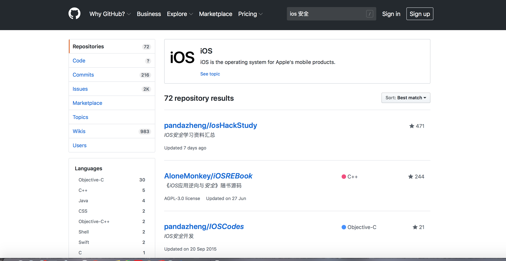

# 10.5 iOS 安全手段

iOS 安全学习网站

[GitHub](https://github.com/search?o=desc&q=ios+安全&s=stars&type=Repositories)




## 二进制安全
攻击者会拿到我们的应用进行分析，然后可能会篡改我们的执行文件或者是资源文件，因此我们有必要采用一些手段来防止他们窥探以及对应用的行为进行修改.

#### 防止调试器依附
通常黑客可能会通过gdb或者lldb来调试我们的应用以验证代码的行为，为后一步攻击做准备。而调试器之所以能够工作是因为Ptrace的存在，它为调试器提供了监控目标进程的机会。因此，通常情况下，我们在应用中禁用掉它，这可以参考我之前写的这篇文章以及github的demo

####越狱检测
当应用被安装在一台越狱后的设备之后，它所面临的安全风险就会相对来说大很多。而可能处于安全性的考虑，可能我们并不希望我们的应用运行在这样的环境下，因此我们可以通过一些检测来判断是否处在越狱的设备上。通常来说越狱设备上会安装Cydia、MobileSubstrate等。我们可以在代码中检测Applications下是否有相关应用存在，如果存在就可以给用户相应的提示并进行处理。

```
  - (BOOL)jailBreaked {
      if ([[UIApplication sharedApplication] canOpenURL:[NSURL URLWithString:@"cydia://"]]) {
          return YES;
      }
      return NO;
  }
```


####敏感字符串安全

编译之后的应用中对已经初始化的字符串依然是可见的，把应用丢到IDA或者Hopper中很容易就看到一些敏感字符串的值了。
因此字符串的加密处理是很有必要的，比如我们可以用一些简单的加密算法加密特别敏感的字符串，这样初始化出来的字符串是一串不可读的问题，需要使用的时候再进行解密。


####混淆

* 这一步主要是为了迷惑敌人的视线，提升分析难度。编译的时候可以通过脚本加入无意义的代码以及将正常的字符串替换为无意义的代码。
* 但是这样的方式会给自己在维护的时候带来一定困难，比如你的代码通过混淆后发生了crash，通过dsym符号表解析出来的崩溃信息也变得不可读了，还得对照混淆时候的映射表来查看，所以需要三思这个到底值不值得做。
* 除此之外，我们还可以混淆文件名。前几天想逆向看看滴滴的模块化是如何做的，无意发现了一张很有意思的图片，后缀表示是一个图片，但是实际上是个存有字符串的文件。我们可以用类似的方式伪装一些相对重要的文件


#### 敏感业务用更安全的语言
OC是一门具有动态特性的语言，这给了攻击者很多机会去修改你原有代码的行为，甚至是加上新的代码。因此在核心部分可以使用更加安全的代码，比如我们可以使用C甚至汇编去写。往简单来说用Swift来写代码都比OC一定程度上来得安全。
####自检
我们可以对二进制文件或者资源文件进行md5，然后交给我们的server去比对是否来自一个合法的应用，这一定程度上也能够提供一些防护性。


## 数据安全
####简单介绍
我们的应用可能会在本地存储一系列的文件，包括用户数据，数据库文件，甚至在日益兴起的Hybrid开发或者是各种Patch方式中我们会下载的源码文件。我们应该尽可能地确保这些文件不会轻易被窃取到，即使窃取到了之后黑客也没办法使用.


* 最基础的是我们发送网络请求时，使用get和post方式发送请求。两者具体区别就不做解释了，只是引出相关安全性问题


	* get：将参数暴露在外，（绝对不安全-->明文请求或者傻瓜式请求）
	
	* post：将参数放到请求体body中，（相对于get比较安全-->但是我们可以很容易用一些软件截获请求数据。比如说Charles（青花瓷））


* Charles（大部分app的数据来源都使用该工具来抓包，并做网络测试）

>注意：Charles在使用中的乱码问题，可以显示包内容，然后打开info.plist文件，找到java目录下面的VMOptions，在后面添加一项：-Dfile.encoding=UTF-8


* 要想非常安全的传输数据，建议使用https。抓包不可以，但是中间人攻击则有可能。建议双向验证防止中间人攻击

* 中间人攻击

当我们上网浏览网页，从网上获取数据的时候，我们知道，不管是http还是https协议，都是服务端被动，客户端主动。所以，客户端第一次发出请求之后，通常无法确定服务端是不是合法。


[](https://www.jianshu.com/p/5866f7bcad05)


