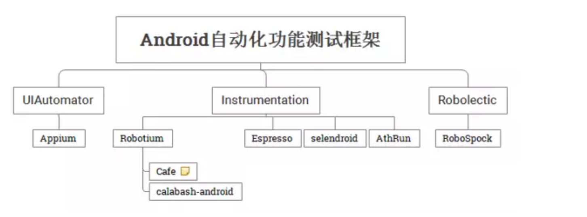
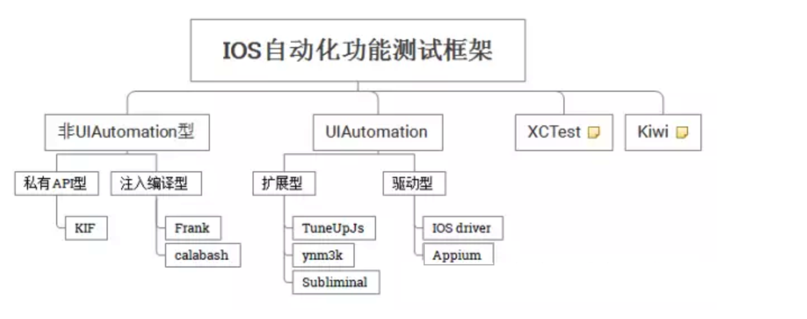
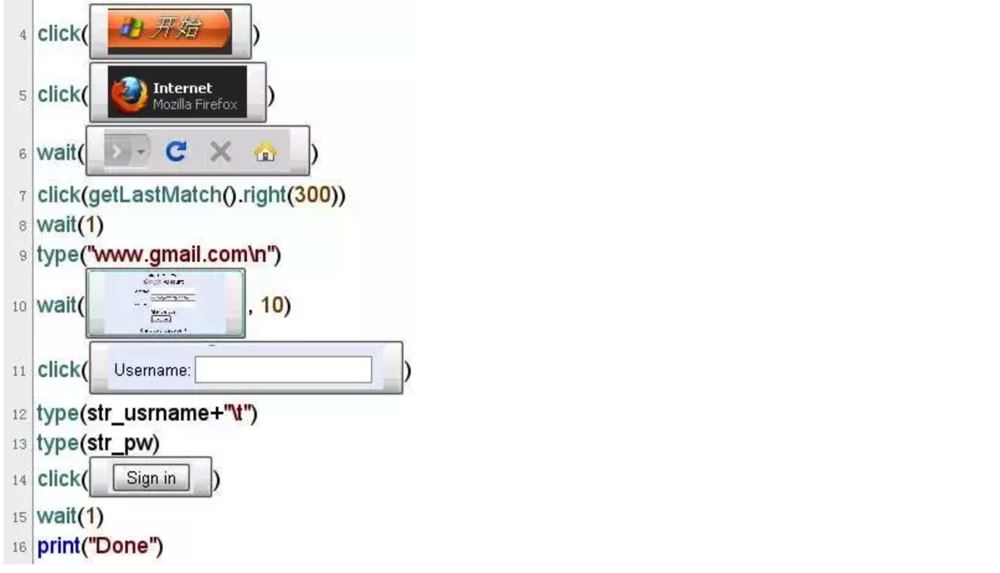

# 第十一章 项目工程单元测试

## 为什么需要单元测试

写代码的过程中，我们发现有一些很基础功能的接口，测试在黑盒测试中很难发现缺陷。假如我们在开发过程中书写好一些用例，不仅能提高代码的质量，也能保证在之后的改动中及时发现改动会带来的错误。

比较流行的有两种单元测试的思路模式，Test Driven Development(TDD)和Behavior Driven Development(BDD)。

#### TDD: 先根据需求或者接口情况编写测试，然后再根据测试来编写业务代码，这也就必然导致所有代码的public部分都会需要必要的测试。

#### BDD: 通过Given - When - Then三个流程化的条件来帮助开发确定应该测试什么

以下三个框架都是BDD(Behavior-driven development) - 行为驱动开发。行为驱动开发简单来说就是先定义行为，然后定义测试用例，接着再编写代码。 实践中发现，通常没有那么多时间来先定义行为，不过BDD中的domain-specific language (DSL)能够很好的描述用例的行为。

[Kiwi](https://github.com/kiwi-bdd/Kiwi) 老牌测试框架

[specta](https://github.com/specta/specta) 另一个BDD优秀框架

[Quick](https://github.com/Quick/Quick) 三个项目中Star最多，支持OC和Swift，优先推荐。

[KIF](https://github.com/kif-framework/KIF) 基于XCTest的测试框架，调用私有API来控制UI，测试用例用Objective C或Swift编写。

[appium](https://github.com/appium/appium) 基于Client - Server的测试框架。App相当于一个Server，测试代码相当于Client，通过发送JSON来操作APP，测试语言可以是任意的，支持android和iOS。

### 测试

测试应当包含：

* 核心功能：模型类和方法，以及它们和控制器的交互
* 最常用的 UI 操作
* 边际条件
* bug 修复

 
### FIRST 原则：测试的最佳实践

FIRST 是几个单词的缩写，简要描述了有效的单元测试需要什么条件，这些条件包括：

* Fast：测试的运行速度要快，这样人们就不介意你运行它们了。
* Independent/Isolated：一个测试不应当依赖于另一个测试。
* Repeatable：同一个测试，每次都应当获得相同的结果。外部数据提供者和并发问题会导致间歇性的出错。
* Self-validating：测试应当是完全自动化的，输出结果要么是 pass 要么是 fail，而不是依靠程序员对日志文件的解释。
* Timely：理想情况下，测试的编写，应当在编写要测试的产品代码之前。
遵循 FIRST 原则会让你的测试清晰和有用，而不会成为 App 的渊薮。

>单元测试（unit testing），是指对软件中的最小可测试单元进行检查和验证。对于单元测试中单元的含义，一般来说，要根据实际情况去判定其具体含义，如C语言中单元指一个函数，Java里单元指一个类，图形化的软件中可以指一个窗口或一个菜单等。总的来说，单元就是人为规定的最小的被测功能模块。单元测试是在软件开发过程中要进行的最低级别的测试活动，软件的独立单元将在与程序的其他部分相隔离的情况下进行测试。

动力的缺乏往往是因为对事物的理解不够彻底。举例来说，我们从来不会怀疑写代码的 80/20 原则，即需要使用 80% 的时间思考，用 20% 的时间进行真正的编码工作，这一点对于绝大多数程序员来说都是不言而喻的真理。但是对于单元测试，哪怕是科班出身的程序员都会质疑：在开发如此紧张的状态下，真的有必要去投入很大一块精力去进行单元测试么，投入产出比真的有这么大么？

### 单元测试会带来如下好处

##### 避免低级错误

* 这是单元测试最直接的作用，无论是新手还是老手，低级错误总是难以避免的，原因不一而足：因为疏忽造成的拼写错误，因为注意力不足造成调用的错误，因为对 API 望文生义的理解造成的方法调用错误等。细心和责任心可以大大减少低级错误的发生，但不能完全杜绝。而单元测试可以作为一个很好的补充。

##### 减少调试时间

* 在缺少宿主程序的情况下，单元测试可以充当宿主程序。而即使存在宿主程序，单元测试相对于宿主程序也有着入口简单，方便执行的优点，不再需要通过复杂的流程才能够进行对应方法的测试，大大减少调试时间。

##### 增加可维护性

* 这是我最推崇单元测试的原因，随着代码量膨胀，代码和代码之间的边界越来越模糊，新代码的加入对旧代码的影响并不是都能够通过逻辑推导获知。但对一个模块添加足够的单元测试后，新代码的加入可以在第一时间内测试完毕对旧逻辑的影响，增加整个模块的可维护性，减少这部分的测试工作，将更多的时间投入到更有意义的事情上去，如喜闻乐见的重构。

##### 帮助改善设计

* 接上一条，重构是贯穿于项目工程的一件任务，随着时间推移，项目总归会慢慢产生各种技术债务，渐进式的重构是很好的还债手段。但是作为一个保守的工程师，重构带来的不稳定有时候是无法接受的痛：既不带来可见的程序性能提高，又”浪费”了时间，与 KPI 无益。而单元测试可以第一时间揭示重构带来的问题，让我们大胆地进行调整，改善既有设计，实现一个良好的循环。

* 听到这里是不是干劲满满？然而不得不指出的一点是，单元测试不是万能的，并不是像很多人想的那样（甚至很多专业测试人员也包括在内）：有了单元测试，就可以不再需要其他测试了。单元测试聚焦的是一个模块单元的功能完整性和鲁棒性，但是模块间互动可能带来的问题并不属于单元测试的范畴(虽然说单元测试和集成测试的边界有时候会傻傻分不清楚)，同时也有很大部分的界面测试和功能测试仍旧离不开测试工程。

##### 解决经验困境

* 相对于动力困境，经验困境反倒更难以解决。最大原因是这方面的教程并不多，新手入手难度较大。懂得使用 XCTest 到能够构建一个完整的测试工程往往有着巨大的实践认知鸿沟。所以仅就这段时间使用 XCTest 的经验谈怎么合理地使用 XCTest 给一个完整项目做单元测试。

##### 构造自己的单元测试基础类库

* 一个让人觉得匪夷所思的事情在于，当我们去创建我们的 iOS 工程时，我们会进行框架设计，模块划分，我们有专门的基础类库，网络层，持久化层，表现层等。尤其是基础类库，在大公司里面基本是代代相传，百用不爽。但到了单元测试这边，哪怕是大公司也是一穷二白，基本没有任何积累。而实际上通过构造更完善的测试用基础类库，能够使得单元测试事半功倍。

## 选择什么框架来做单元测试 -- 移动APP自动化测试框架

简介

移动APP的UI自动化测试长久以来一直是一个难点，难点在于UI的”变”, 变化导致自动化用例的大量维护。从分层测试的角度，自动化测试应该逐层进行。最大量实现自动化测试的应该是单元测试，最容易实现也最容易在早期发现问题；其次是接口级测试，以验证逻辑为目的进行自动化，由于接口的相对稳定，自动化测试成本相对也可以接受；自动化成本最大的便是UI级自动化测试，然而UI界面是直接反馈给用户的效果展示，适度的尤其是BVT级的自动化测试也是非常必要的。本文通过分析几种自动化框架的异同，使测试人员在选择自动化框架时有所参考。

### Android自动化框架

#### [Instrumentaion](https://developer.android.com/reference/android/app/Instrumentation.html) 

Instrumentaion是Android自带的一个测试框架，是很多其它测试框架的基础，可以在同进程中加载被测组件。它有很多丰富的高层封装，使用者可以使用基于instrumentation的其他框架，避免过多二次开发量。但Instrumentation不支持跨应用，导致基于instrumentation的框架都继承了这个缺点。

#### [Robotium](https://github.com/robotiumtech/robotium)

Robotium是基于Instrumentation框架开发的一个更强的框架. 对常用的操作进行了易用性的封装. 用于开发功能性、系统和验收测试场景。它运行时绑定到GUI组件。它安装了一个测试用例套件作为在Android设备或仿真器上的应用程序，并提供用于执行测试的真实环境。

* 优点： 容易在最短的时间内编写测试脚本，易用性高。自动跟随当前activity。 由于运行时绑定到GUI组件，所以相比Appium，它的测试执行更快，更强大。 不访问代码或不了解app实现，也可以工作。 支持Activities、Dialogs、Toasts、Menus、Context Menus和其他Android SDK控件。

* 缺点： 不能处理flash和web组件。在旧设备上会变得很慢。 由于不支持iOS设备,当自动化测试同时覆盖 android与iOS的情况时，测试会被中断。没有内置的记录和回放功能.，使用记录功能需要 TestDroid 和 Robotium Recorder 这样的收费工具。

#### [UIAutomator](https://google.github.io/android-testing-support-library/docs/uiautomator/)

UIAutomator是由谷歌提供的测试框架，它提供了原生Android app和游戏的高级UI测试。这是一个包含API的Java库，用来创建功能性UI测试，还有运行测试的执行引擎。该库自带Android SDK。

* 优点：它在运行访问不同的进程时，会给JUnit测试案例特权。库由谷歌社区支持和维护。

* 缺点：仅支持android4.1（API level 16）及以上。 不支持脚本记录。 支持的重点是Java。 你不能获得当前活动或仪表化。目前不支持web视图。 库仅支持使用Java，因此很难和使用Ruby的cucumber混合。如想支持BDD框架，建议使用Java自己的BDD框架，例如Jbehave。

####[Espresso](https://google.github.io/android-testing-support-library/docs/espresso/index.html)

Espresso是Google的开源自动化测试框架。相对于Robotium和UIAutomator，它的特点是规模更小、更简洁、API更加精确、编写测试代码简单、容易快速上手。因为是基于Instrumentation的，所以不能跨App。

#### [ Calabash](https://github.com/calabash)

Calabash是一个适用于iOS和Android开发者的跨平台app测试框架，可用来测试屏幕截图、手势和实际功能代码。Calabash开源免费并支持Cucumber语言，Cucumber能让你用自然的英语语言表述app的行为，实现BDD（Behavior Driven Development，行为驱动开发）。 Cucumber中的所有语句使用Ruby定义。

* 优点： 有大型社区支持。列表项 简单，类似英语表述的测试语句支持在屏幕上的所有动作，如滑动，缩放，旋转，敲击等。 跨平台开发支持（同样的代码在Android和iOS设备中都适用）。

* 缺点：测试步骤失败后，将跳过所有的后续步骤，这可能会导致错过更严重的产品问题。测试耗费时间，因为它总是默认先安装app。 需要Calabash框架安装在ios的ipa文件中， 因此测试人员必须要有iOS的app源码。 除了Ruby，对其他语言不友好。

#### [Appium](http://appium.io/)

Appium是一个开源的、跨平台的自动化测试工具，支持IOS、Android和FirefoxOS平台。 通过Appium，开发者无需重新编译app或者做任何调整，就可以测试移动应用，可以使测试代码访问后端API和数据库。它是通过驱动苹果的UIAutomation和Android的UiAutomator框架来实现的双平台支持，同时绑定了Selenium WebDriver用于老的Android平台测试。开发者可以使用WebDriver兼容的任何语言编写测试脚本，如Java， OC， JS， PHP，Python， Ruby， C#，Clojure 和Perl语言。

#### [Selendroid](https://www.gitbook.com/book/lihuazhang/selendroid/details)

Selendroid 是一个基于Instrumentation的一个框架. 完全兼容Webdriver协议。 Selendroid 可以在模拟器和实际设备上使用，也可以集成网格节点作为缩放和并行测试。

#### [ Robolectric](http://robolectric.org/)

Robolectric 是一款Android单元测试框架，但它并不依赖于Android提供的测试功能，它通过实现一套JVM能运行的Android代码，然后在unit test运行的时候去截取android相关的代码调用，然后转到Robolectric实现的代码（shadow objects）去执行这个调用的过程。因此它不像模拟器或设备需要dexing（Android dex编译器将类文件编译成Android设备上的Dalvik VM使用的格式）、打包、部署和运行的过程，大大减少了测试执行的时间。Pivotal实验室声称使用Robolectric可以在28秒内运行1047个测试。

除了实现Android里面的类的现有接口，Robolectric还给每个Shadow类额外增加了很多接口，可以读取对应的Android类的一些状态。比如它为ImageView提供了getImageResourceId()方法，测试者可以通过getImageResourceId()接口来确定是不是正确显示了期望的Image。

#### [RoboSpock](http://robospock.org/)

RoboSpock是一个开源的Android测试框架，它提供了简单的编写BDD行为驱动开发规范的方法，使用Groovy语言，支持Google Guice库。RoboSpock合并了Robolectic和Spock的功能。

#### [Cafe](http://cafe.baidu.com/#panel1)

Cafe是百度出品的一个基于Robotium的测试框架，它提供了跨进程的测试解决方案。

#### [Athrun](http://code.taobao.org/p/athrun/wiki/index/)

Athrun 是taobao出的一个移动测试框架，它支持Android和IOS。Android部分是基于Instrumentation，在Android原有的ActivityInstrumentationTestCase2类基础上进行了扩展，提供了一整套面向对象的API。 IOS上的自动化测试包括注入式自动化框架AppFramework，和基于录制的自动化框架Athrun_IOS, InstrumentDriver。

#### 其他

其他自动化框架还有应用于稳定性测试的Monkey系列（Monkey, Monkeyrunner, MonkeyTalk）, 其中MonkeyTalk 支持iOS 和 Android，它可以为应用进行真实的，功能性交互测试。MonkeyTalk 提供简单的 “smoke tests”，复杂数据驱动的测试套件。MonkeyTalk 支持原生，移动和混合应用，真实设备或者模拟器。MonkeyTalk 使得场景捕获非常容易，可以记录高级别，可读的测试脚本。还有适用于浏览器自动测试的Selenium WebDriver，可以真实测试用户行为，用户交互如触摸、手指滚动、长按等，还支持HTML5的一些特性，比如本地存储、session存储、应用缓存等。而CTS则是应用于兼容性测试的自动化工具， CTS大部分是基于Junit和仪表盘技术编写的。还扩展了自动化测试过程，可以自动执行用例，自动收集和汇总测试结果。CTS采用XML配置文件的方式将这些测试用例分组成多个测试计划（plan）,第三方也可以创建自己的plan。

各个测试框架的继承关系如下,继承关系决定了有些框架的先天优势或先天不足. 在实际应用中可以集成多个框架。

* 基于Instrumentation的测试框架，比如Espresso，Robotium，Selendroid等，都不能支持跨APP使用。 如自动化测试中有跨APP操作，可以结合UiAutomator实现。
* 支持BDD的自动化框架比较少，可以在calabash 和 RoboSpock及Jbehave之间选择。
* 若想同时支持Android和IOS，可选框架有Appium和Calabash，或AthRun。
* 若为单元测试选择框架，可选Instrumentation或Robolectric。Robolectric实现了shadow object 类，耗时短。

### IOS自动化框架

#### [XCTest](https://developer.apple.com/library/mac/documentation/DeveloperTools/Conceptual/testing_with_xcode/chapters/01-introduction.html)

XCTest是苹果在iOS 7和Xcode5引入的一个简单而强大的测试框架，它的测试编写起来非常简单，并且遵循xUnit风格。XCTest的优点是与Xcode深度集成，有专门的Test导航栏，但因为受限于官方测试API，因此功能不是很丰富。

#### [UIAutomation](https://developer.apple.com/library/ios/documentation/DeveloperTools/Conceptual/InstrumentsUserGuide/UIAutomation.html)

UIAutomation是苹果提供的UI自动化测试框架，使用Javascript编写。基于UIAutomation有扩展型的工具框架和驱动型的框架。扩展型框架以JavaScript扩展库方法提供了很多好用js工具，注入式的框架通常会提供一些Lib或者是Framework，要求测试人员在待测应用的代码工程中导入这些内容，框架可以通过他们完成对app的驱动。驱动型UI Automation 在自动化测试底层使用了UI Automation库，通过TCP通信的方式驱动UI Automation来完成自动化测试，通过这种方式，编辑脚本的语言不再局限于JavaScript。

#### [Frank](http://www.testingwithfrank.com/)

Frank是iOS平台一款非常受欢迎的app测试框架，它使用Cucumber语言来编写测试用例， Frank包含一个强大的“app inspector”–Symbiote，可以用它来获得运行中app的详细信息，便于开发者将来进行测试回顾。 它允许使用Cucumber编写结构化英语句子的测试场景。 Frank要求测试时在应用程序内部编译，这意味着对源代码的改变是强制性的。操作方式为使用Cucumber和JSON组合命令，将命令发送到在本地应用程序内部运行的服务器上，并利用UISpec运行命令。

* 优点： 测试场景是在Cucumber的帮助下，用可理解的英语句子写的。强大的Symbiote实时检查工具。 活跃的社区支持。 不断扩大中的库。

* 缺点：对手势的支持有限。 在设备上运行测试有点难。 修改配置文件需要在实际设备上运行。 记录功能不可用。

#### [KIF](http://www.oschina.net/translate/ios-ui-testing-with-kif)

KIF是Keep It Functional项目的缩写，是一款iOS app功能性测试框架，使用Objective-C语言编写，对苹果开发者来说非常容易上手，更是一款开发者广为推荐的测试工具。KIF tester使用私有API来了解App中的视图层级。但缺点是运行较慢。

#### [Calabash-ios]()

详见Calabash-android 描述。

#### [Subliminal](http://inkling.github.io/Subliminal/)

Subliminal是另一款与XCTest集成的框架。与KIF不同的是，它基于UIAutomation编写，旨在对开发者隐藏UIAutomation中一些复杂的细节。

#### [Kiwi](https://github.com/kiwi-bdd/Kiwi/wiki/Getting-Started-with-Kiwi-2.0)

Kiwi是对XCTest的一个完整替代，使用xSpec风格编写测试。 Kiwi带有自己的一套工具集，包括expectations、mocks、stubs，甚至还支持异步测试。它是一个适用于iOS 开发的Behavior Driven Development（BDD）库，优点在于其简洁的接口和可用性，易于设置和使用，非常适合新手开发者。Kiwi使用Objective-C语言编写，易于IOS开发人员上手。

#### [Appium](http://appium.io/)

Appium是一个开源的、跨平台的自动化测试工具，支持IOS、Android和FirefoxOS平台。 通过Appium，开发者无需重新编译app或者做任何调整，就可以测试移动应用，可以使测试代码访问后端API和数据库。它是通过驱动苹果的UIAutomation和Android的UiAutomator框架来实现的双平台支持，同时绑定了Selenium WebDriver用于老的Android平台测试。开发者可以使用WebDriver兼容的任何语言编写测试脚本，如Ruby，C#，Java，  JS，OC， PHP，Python，Perl和Clojure 语言

#### 总结（IOS） 

iOS自动化测试框架继承关系如下. XCTest与 Xcode 的 IDE 直接集成,使用简单, 但其不支持stub和mock, 所以单使用XCTest框架的较少. Kiwi是一个iOS平台十分好用的行为驱动开发BDD的测试框架，有着非常漂亮的语法，可以写出结构性强，非常容易读懂的测试。UI Automation是Apple官方提供的UI自动化测试的解决方法,但接口不够丰富。

* KIF、Frank、Calabash都是通过使用代码的形式来模拟事件触发，使得被测代码就像是由用户行为所触发的一样。但这样的代价是插入一个额外层的复杂度。
* IOS测试框架中支持BDD的有calabash 和Kiwi。
* 可选用的单元测试框架有Kiwi，Specta，Quick等，而KIF，Subliminal和calabash更适用于UI级验收测试。

### 有趣的自动化测试框架

#### [Sikuli 图形化编程技术](http://www.sikuli.org/)

Sikuli 是由 MIT 的研究团队发布的新型图形化编程技术。它以图像检索技术为基础，提供了一套基于Python 的脚本语言以及集成开发环境。使用者可利用屏幕截图直接引用 GUI 元素进行编程，完成交互操作。Sikuli的脚本编写遵循 Python语法规范。由于 Sikuli基于 Python，其核心代码由 Java 编写，可在用户自定义的 Java 工程中将其作为 Java 标准类库进行引用。

Sikuli将 GUI 对象的屏幕截图作为函数的参数直接引用，整个代码的语义清晰明了，可读性极强。脚本执行过程中，利用图像检索算法分析匹配当前屏幕中对应的控件，并对其应用相应的鼠标或键盘操作。这种方式使得我们在脚本编写时，既无需关心繁琐的应用程序相关 API 亦不用获取 Web 内容对象。

缺点：

* 仅支持windows， MACOSX，和Linux平台，还不支持移动平台。
* 依赖屏幕截图，使得1）在不同平台，不同分辨率，不同操作系统上需要维护一套图形源文件，不利于跨平台移植；2）若出现程序逻辑外的界面遮挡，则影响程序执行。
* 但作为现有自动化测试工具的补充，尤其是对无法获取API的工程，比如flash 动画， 是非常有效的。

#### [A/B test 框架 AppGrader](https://www.utest.com/articles/utest-launches-appgrader-for-android)

虽然AppGrader不是一流的测试框架，但也有所长。它可以帮开发者将自己的应用与其他众多同类型应用进行多方面比较，比如图形和功能。通过对比结果，开发者可以更有针对性地提高和改进自己的应用。目前AppGrader仅支持Android平台。

#### [IOS A/B test 框架 FlipTest](http://www.fliptest.co.uk/)

FlipTest是一个优秀的iOS app A/B测试框架，可为app挑选最佳的UI。FlipTest会基于外观和易用性等众多因素返回测试结果，进而帮开发者解决UI问题。用FlipTest进行测试无需向App Store重新提交应用或者大幅更改代码，只需要在app中添加一行代码，节省了不少时间。

