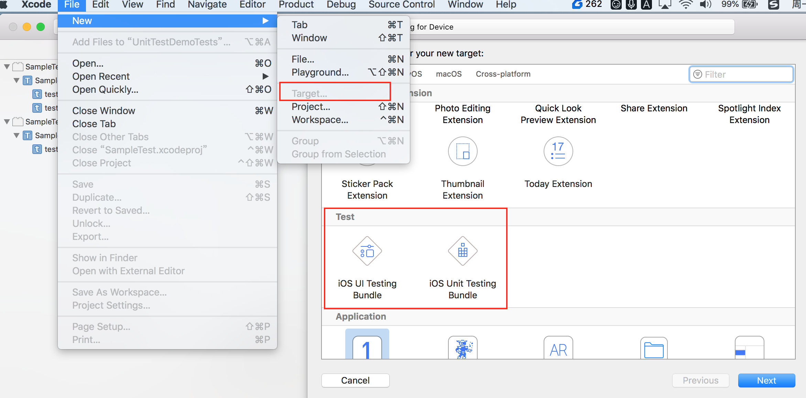
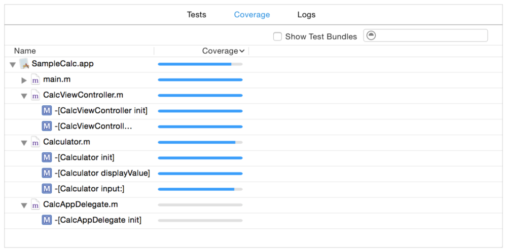

# 11.1 Unit Test 和 UI Test

常用的第三方框架例如YYModel、AFNetworking、Alamofire等等优秀框架中也有对框架自身编写的单元测试，学习仿写这些单元测试也是快速提升自己的一种手段。

#### 创建单元测试三种方式





### Unit Test


一个标准的测试类文件代码如下。其中``setUp``会在每一个测试用例开始前调用，用来初始化相关数据；``tearDown``在测试用例完成后调用，可以用来释放变量等结尾操作；``testPerformanceExample``中的会将方法中的block代码耗费时长打印出来；最后的``testExample``用来执行我们需要的测试操作，正常情况下，我们不使用这个方法，而是创建名为test+测试目的的方法来完成我们需要的操作


```

#import <XCTest/XCTest.h>

@interface SampleTestTests : XCTestCase

@end

@implementation SampleTestTests

- (void)setUp {
    [super setUp];
    
    每个类中 测试方法调用前  先调用这个方法  以方便 开发者 做些 测试前的准备
    // Put setup code here. This method is called before the invocation of each test method in the class.
}

- (void)tearDown {
    // Put teardown code here. This method is called after the invocation of each test method in the class.
    
    当这个 类中的 所有的 测试 方法  测试完后  会调用这个方法  
    // 销毁代码放在这里. 在调用这个类的每个测试方法之后都要调用.
    
    [super tearDown];
}

- (void)testExample {
    // This is an example of a functional test case.
    // Use XCTAssert and related functions to verify your tests produce the correct results.
}

这是 我们做性能测试的方法   把要测试的方法 放进Block 就可以了 。后面会重点介绍 

- (void)testPerformanceExample {
    // This is an example of a performance test case.
    [self measureBlock:^{
        // Put the code you want to measure the time of here.
    }];
}

@end


```


### UI Test


```
#import <XCTest/XCTest.h>

@interface SampleTestUITests : XCTestCase

@end

@implementation SampleTestUITests

- (void)setUp {
    [super setUp];
    
    // Put setup code here. This method is called before the invocation of each test method in the class.
    
    // In UI tests it is usually best to stop immediately when a failure occurs.
    self.continueAfterFailure = NO;
    // UI tests must launch the application that they test. Doing this in setup will make sure it happens for each test method.
    [[[XCUIApplication alloc] init] launch];
    
    // In UI tests it’s important to set the initial state - such as interface orientation - required for your tests before they run. The setUp method is a good place to do this.
}

- (void)tearDown {
    // Put teardown code here. This method is called after the invocation of each test method in the class.
    [super tearDown];
}

- (void)testExample {
    // Use recording to get started writing UI tests.
    // Use XCTAssert and related functions to verify your tests produce the correct results.
}

@end


```


每个测试用例方法的左侧有个菱形的标记，点击这个标记可以单独的运行这个测试方法。

* 如果测试通过没有发生任何断言错误，那么这个菱形就会变成绿色勾选状态。
* 使用快捷键command+U直接依次调用所有的单元测试。
* 可以在左侧的文件栏中选中单元测试栏目，然后直观的看到所有测试的结果。同样的点击右侧菱形位置的按钮可以运行单个测试方法或者文件


### 单元样例


异步网络


### 性能测试

```

- (void)testPerformanceExample {

    // This is an example of a performance test case.

    [self measureBlock:^{

        // Put the code you want to measure the time of here.

        for (int i =0; i<1000; i++) {

            NSLog(@"this is a example");

        }

    }];

}

```

* 将要开始执行测试代码时调用： ```- (void)setUp { … } ， ```

* 测试代码执行完后调用，测试失败不调用： ```- (void)tearDown{ … }，``` 

* 其他任何方法都会在 ``- (void)setUp`` 和 ``- (void)tearDown`` 调用。 

* 所有的测试类类名都以Tests结尾，同样类中所有的测试方法也都以- (void)test 开头。


第一次运行 会出现 改方法的耗时 ，然后 提示 noBase ...  


点进这个提示 我们可以设置base 设置之后再运行就点击左边的 灰色的 钩 


在Reports navigation中，选中你要查看的测试即可查看更详细的测试结果信息。


### 逻辑测试

新建了一个用以测试的model类，该类提供了三个接口。需要注意的是，在逻辑测试的某个操作步骤前后，应该有对应的数据发生了改变，这样才能够方便我们进行测试：

```
@interface LXDTestsModel : NSObject
@property (nonatomic, readonly, copy) NSString * name;
@property (nonatomic, readonly, strong) NSNumber * age;
@property (nonatomic, readonly, assign) NSUInteger flags;
+ (instancetype)modelWithName: (NSString *)name age: (NSNumber *)age flags: (NSUInteger)flags;
- (instancetype)initWithDictionary: (NSDictionary *)dict;
- (NSDictionary *)modelToDictionary;
@end

```

定义了一个testModelConvert方法用来测试模型跟json之间的转换是否正确：

```
- (void)testModelConvert
{
    NSString * json = @"{\"name\":\"SindriLin\",\"age\":22,\"flags\":987654321}";
    NSMutableDictionary * dict = [[NSJSONSerialization JSONObjectWithData: [json dataUsingEncoding: NSUTF8StringEncoding] options: kNilOptions error: nil] mutableCopy];
    LXDTestsModel * model = [[LXDTestsModel alloc] initWithDictionary: dict];
    XCTAssertNotNil(model);
    XCTAssertTrue([model.name isEqualToString: @"SindriLin"]);
    XCTAssertTrue([model.age isEqual: @(22)]);
    XCTAssertEqual(model.flags, 987654321);
    XCTAssertTrue([model isKindOfClass: [LXDTestsModel class]]);
    model = [LXDTestsModel modelWithName: @"Tessie" age: dict[@"age"] flags: 562525];
    XCTAssertNotNil(model);
    XCTAssertTrue([model.name isEqualToString: @"Tessie"]);
    XCTAssertTrue([model.age isEqual: dict[@"age"]]);
    XCTAssertEqual(model.flags, 562525);
    NSDictionary * modelJSON = [model modelToDictionary];
    XCTAssertTrue([modelJSON isEqual: dict] == NO);
    dict[@"name"] = @"Tessie";
    dict[@"flags"] = @(562525);
    XCTAssertTrue([modelJSON isEqual: dict]);
}

```
测试model类中添加了类方法，用来随机生成100个类实例对象，并且在每次创建对象后让线程休眠一段时间来模拟耗时操作：

```

+ (NSArray<lxdtestsmodel *> *)randomModels
{
    NSMutableArray * models = @[].mutableCopy;
    NSArray * names = @[
                    @"SindriLin", @"Bison", @"XiongZengHui", @"ZengChengChun", @"Tessie"
                        ];
    NSArray * ages = @[
                      @15, @20, @25, @30, @35
                      ];
    NSArray * flags = @[
                        @123, @456, @789, @012, @234
                        ];
    for (NSUInteger idx = 0; idx < 100; idx++) {
        LXDTestsModel * model = [LXDTestsModel modelWithName: names[arc4random() % names.count] age: ages[arc4random() % ages.count] flags: [flags[arc4random() % flags.count] unsignedIntegerValue]];
        [models addObject: model];
        [NSThread sleepForTimeInterval: 0.01];
    }
    return models;
}</lxdtestsmodel *>


```


### UI 测试 

* 打开 UnitTestDemoTestsUITests.m 发现 setUp 方法 和 UnitTest 中有些不同。多了一个 

* self.continueAfterFailure = NO; 和   [[[XCUIApplication alloc] init] launch];  苹果都有解释 。我们照做就可以了。

```
- (void)setUp {

    [super setUp];

    // Put setup code here. This method is called before the invocation of each test method in the class.

// 如果发生 测试不通过的情况 ，最好 停止程序的运行 

// In UI tests it is usually best to stop immediately when a failure occurs.

    self.continueAfterFailure = NO;

//  UI 测试必须 等应用 先开启 ，这个方法 可以确保应用的开启 在每个测试方法 测试的时候 。

    // UI tests must launch the application that they test. Doing this in setup will make sure it happens for each test method.

    [[[XCUIApplication alloc] init] launch];


    // In UI tests it’s important to set the initial state - such as interface orientation - required for your tests before they run. The setUp method is a good place to do this.

}


```


```
- (void)testLoginThree

{

    XCUIApplication *app = [[XCUIApplication alloc] init];

    // 下面这是一种通过 遍历 获取的形式

    for (NSInteger i = 0;i < app.textFields.count; i++) {

        if ([[app.textFields elementBoundByIndex:i] exists]) {//判断是否存在

            [[app.textFields elementBoundByIndex:i] tap];//输入框要获取焦点后才能给输入框自动赋值

            if (i == 0 ) {

                // 给 第一个userName 自动赋值 你好

                [[app.textFields elementBoundByIndex:i] typeText:@"你好"];

            }

            // 给 第二个userPass 自动赋值 德龙

            if (i == 1) {

                  [[app.textFields elementBoundByIndex:i] typeText:@"德龙"];

            }

        }

    }

}


```


* 以 能使用 textFields[@"username:"];  和  app.buttons[@"login"]  这种语法 来找到对应的控件 是因为

* usernameTextField 的Placeholder 是 username:  而  登录按钮的title 是 login  ！！！storyboard中都有设置 。 不然会报错。


```

- (void)testLoginFour

{

    XCUIApplication *app = [[XCUIApplication alloc] init];

//    //XCUIElement 这是 UI 元素的代理。元素都有类型和唯一标识。可以结合使用来找到元素在哪里，如当前界面上的一个输入框

    XCUIElementQuery *textFields = app.textFields;

//    XCUIElement *usernameTextField = [textFields objectForKeyedSubscript:@"username:"];

    XCUIElement *usernameTextField = textFields[@"username:"];

    [usernameTextField tap];

    [usernameTextField typeText:@"德龙"];

    XCUIElement *passwordTextField = app.textFields[@"password:"];

    [passwordTextField tap];

    [passwordTextField tap];

    [passwordTextField typeText:@"杨"];


    //

    [app.buttons[@"login"] tap];


    //登录成功后的控制器的title为loginSuccess，只需判断控制器的title时候一样便可判断登录是否成功

    NSLog(@"title is %@",app.navigationBars.element.identifier);

  XCTAssertEqualObjects(app.navigationBars.element.identifier, @"loginSuccess");


    // 延时 3s 再消失

    XCUIElement *window = [app.windows elementBoundByIndex:0];

    [window pressForDuration:3];

}


```

### 异步测试

```
- (void)testAsyncFunction{
    //创建一个XCTestExpectation对象。
    //这个测试只有一个，可以等待多个XCTestExpectation对象。
    
    XCTestExpectation * expectation = [self expectationWithDescription:@"Just a demo expectation,should pass"];
    dispatch_async(dispatch_get_global_queue(DISPATCH_QUEUE_PRIORITY_DEFAULT, 0), ^{
        sleep(1);
         NSLog(@"Async test");
        XCTAssert(YES,"should pass");
         //完成相应操作后调用fulfill  这将导致-waitForExpectation
        [expectation fulfill];
    });
    
     //测试将在此暂停，运行runloop，直到超时调用 或所有的expectations都调用了fulfill方法。
    [self waitForExpectationsWithTimeout:0.5 handler:^(NSError *error) {
        //Do something when time out关闭文件等操作
    }];
}


```


### 代码覆盖率


Xcode中的代码覆盖是LLVM提供的的测试选项。 当您启用代码覆盖时，LLVM将根据调用方法和函数的频率，对代码收集覆盖数据。 代码覆盖选项可以收集数据以报告正确性和性能的测试，无论是单元测试还是UI测试。

* 在 scheme editor 菜单中选中 Edit Scheme .


* 选中Test action，启用代码覆盖复选框以收集覆盖率数据。


注意：代码覆盖率数据收集会导致性能损失。当启动代码覆盖时，它以线性方式影响代码的执行。当严格评估测试的性能时，应该考虑是否启用代码覆盖。

``Reports navigator``中 Coverage 菜单中可以查看代码覆盖的相关数据。



用鼠标选中 - [Calculator input：]方法，将显示一个按钮，点击该按钮将带您进入带注解的源代码。


并突出显示未执行的代码。 它突出了需要覆盖的代码领域，而不是已经涵盖的领域。


### 断言注释：

* 大部分的测试方法使用断言决定的测试结果。所有断言都有一个类似的形式：比较，表达式为真假，强行失败等。

```

XCTFail(format…) //生成一个失败的测试;
 XCTFail(@”Fail”);
 
 XCTAssertNil(a1, format…) //为空判断， a1 为空时通过，反之不通过;
 XCTAssertNil(@”not nil string”, @”string must be nil”);
 
 XCTAssertNotNil(a1, format…) //不为空判断，a1不为空时通过，反之不通过；
 XCTAssertNotNil(@”not nil string”, @”string can not be nil”);
 
 XCTAssert(expression, format…) //当expression求值为TRUE时通过；
 XCTAssert((2 > 2), @”expression must be true”);
 
 XCTAssertTrue(expression, format…) //当expression求值为TRUE时通过；
 XCTAssertTrue(1, @”Can not be zero”);
 
 XCTAssertFalse(expression, format…) //当expression求值为False时通过；
 XCTAssertFalse((2 < 2), @”expression must be false”);
 
 XCTAssertEqualObjects(a1, a2, format…) //判断相等， [a1 isEqual:a2] 值为TRUE时通过，其中一个不为空时，不通过；
 XCTAssertEqualObjects(@”1″, @”1″, @”[a1 isEqual:a2] should return YES”);
 XCTAssertEqualObjects(@”1″, @”2″, @”[a1 isEqual:a2] should return YES”);
 
 XCTAssertNotEqualObjects(a1, a2, format…) //判断不等， [a1 isEqual:a2] 值为False时通过，
 XCTAssertNotEqualObjects(@”1″, @”1″, @”[a1 isEqual:a2] should return NO”);
 XCTAssertNotEqualObjects(@”1″, @”2″, @”[a1 isEqual:a2] should return NO”);
 
 XCTAssertEqual(a1, a2, format…) //判断相等（当a1和a2是 C语言标量、结构体或联合体时使用,实际测试发现NSString也可以）；
 XCTAssertNotEqual(a1, a2, format…) //判断不等（当a1和a2是 C语言标量、结构体或联合体时使用）;
 
 XCTAssertEqualWithAccuracy(a1, a2, accuracy, format…) 判断相等，（double或float类型）//提供一个误差范围，当在误差范围（+/- accuracy ）以内相等时通过测试;
 XCTAssertEqualWithAccuracy(1.0f, 1.5f, 0.25f, @”a1 = a2 in accuracy should return YES”);
 
 XCTAssertNotEqualWithAccuracy(a1, a2, accuracy, format…) 判断不等，（double或float类型）//提供一个误差范围，当在误差范围以内不等时通过测试;
 XCTAssertNotEqualWithAccuracy(1.0f, 1.5f, 0.25f, @”a1 = a2 in accuracy should return NO”);
 
 XCTAssertThrows(expression, format…) //异常测试，当expression发生异常时通过；反之不通过；
 XCTAssertThrowsSpecific(expression, specificException, format…) //异常测试，当expression发生 specificException 异常时通过；反之发生其他异常或不发生异常均不通过;
 XCTAssertThrowsSpecificNamed(expression, specificException, exception_name, format…) //异常测试，当expression发生具体异常、具体异常名称的异常时通过测试，反之不通过;
 XCTAssertNoThrow(expression, format…) //异常测试，当expression没有发生异常时通过测试；
 XCTAssertNoThrowSpecific(expression, specificException, format…)//异常测试，当expression没有发生具体异常、具体异常名称的异常时通过测试，反之不通过;
 XCTAssertNoThrowSpecificNamed(expression, specificException, exception_name, format…) //异常测试，当expression没有发生具体异常、具体异常名称的异常时通过测试，反之不通过;
 
 
 //下面介绍一下测试元素的语法
 
 XCUIApplication：
 //继承XCUIElement，这个类掌管应用程序的生命周期，里面包含两个主要方法
 launch():
 //启动程序
 terminate()
 //终止程序
 
 XCUIElement
 //继承NSObject，实现协议XCUIElementAttributes, XCUIElementTypeQueryProvider
 //可以表示系统的各种UI元素
 .exist
 //可以让你判断当前的UI元素是否存在，如果对一个不存在的元素进行操作，会导致测试组件抛出异常并中断测试
 descendantsMatchingType(type:XCUIElementType)->XCUIElementQuery
 //取某种类型的元素以及它的子类集合
 childrenMatchingType(type:XCUIElementType)->XCUIElementQuery
 //取某种类型的元素集合，不包含它的子类
 
 //这两个方法的区别在于，你仅使用系统的UIButton时，用childrenMatchingType就可以了，如果你还希望查询自己定义的子Button，就要用descendantsMatchingType
 
 //另外UI元素还有一些交互方法
 tap()
 //点击
 doubleTap()
 //双击
 pressForDuration(duration: NSTimeInterval)
 //长按一段时间，在你需要进行延时操作时，这个就派上用场了
 swipeUp()
 //这个响应不了pan手势，暂时没发现能用在什么地方，也可能是beta版的bug，先不解释
 typeText(text: String)
 //用于textField和textView输入文本时使用，使用前要确保文本框获得输入焦点，可以使用tap()函数使其获得焦点
 
 XCUIElementAttributes协议
 //里面包含了UIAccessibility中的部分属性


```

```
//1. Unconditional Fail：无条件失败当直接到达特定的代码分支指示失败时使用。
       XCTFail(@"无条件失败....");

//2.Boolean Tests
    BOOL a = NO;
    XCTAssert(a,@"失败时提示：a == false");
    XCTAssertTrue(a,@"失败时提示：a == false");
    XCTAssertFalse(a,@"失败时提示：a == true");

//3.基础数据类型
    NSInteger b = 1;
    NSInteger c = 1;
    NSInteger d = 2;
    XCTAssertEqual(b, c, @"失败时提示：b!= c");
    XCTAssertGreaterThan(d, c,@"失败时提示：d < c");
    XCTAssertEqualWithAccuracy(c, d, 1,@"失败时提示：c和d的误差的绝对值大于1");

//4.对象类型
    NSString *nameA = @"nameA";
    NSString *nameB = @"nameB";
    XCTAssertEqualObjects(nameA, nameB,@"失败时提示：nameA != nameB");
    XCTAssertNil(nameA,@"失败时提示：nameA != nil");
    
//5. Exception Tests
    NSArray *array = @[];
    XCTAssertThrows(array[0],@"失败时提示：array[0]没有抛出异常");
    XCTAssertNoThrow(array[0],@"失败时提示：array[0]抛出异常");
    XCTAssertThrowsSpecific(array[0], NSException,@"失败时提示：array[0]没有抛出NSException异常");
    XCTAssertThrowsSpecificNamed(array[0], NSException,@"NSRangeException",@"失败时提示：array[0]没有抛出名为NSRangeException的NSException异常");


```

```
//    XCTFail(@"this is a fail test");  // 生成一个失败的测试

//    XCTAssertNil(@"not a nil string",@"string must be nil"); // XCTAssertNil(a1, format...) 为空判断， a1 为空时通过，反之不通过；

//    XCTAssertNil(@"",@"string must be nil");  // 注意@"" 一样无法通过

    XCTAssertNil(nil,@"object must be nil");

    // XCTAssertNotNil(a1, format…) 不为nil 判断，a1不为  nil 时通过，反之不通过；

    // 注意空  和 nil 还是有区别的

    XCTAssertNotNil(@"not nil string", @"string can not be nil");

//    XCTAssert(expression, format...) 当expression求值为TRUE时通过； expression 为一个表达式

//    XCTAssert((2 > 2), @"expression must be true");

    XCTAssert((3>2),@"expression is true");

    // XCTAssertTrue(expression, format...) 当expression求值为TRUE时通过；>0 的都视为 true

    XCTAssertTrue(1, @"Can not be zero");

    // XCTAssertFalse(expression, format...) 当expression求值为False时通过；

    XCTAssertFalse((2 < 2), @"expression must be false");

    // XCTAssertEqualObjects(a1, a2, format...) 判断相等， [a1 isEqual:a2] 值为TRUE时通过，其中一个不为空时，不通过；

    XCTAssertEqualObjects(@"1", @"1", @"[a1 isEqual:a2] should return YES");

    //    XCTAssertEqualObjects(@"1", @"2", @"[a1 isEqual:a2] should return YES");

    //    XCTAssertNotEqualObjects(a1, a2, format...) 判断不等， [a1 isEqual:a2] 值为False时通过，

//        XCTAssertNotEqualObjects(@"1", @"1", @"[a1 isEqual:a2] should return NO");

    XCTAssertNotEqualObjects(@"1", @"2", @"[a1 isEqual:a2] should return NO");

    // XCTAssertEqual(a1, a2, format...) 判断相等（当a1和a2是 C语言标量、结构体或联合体时使用,实际测试发现NSString也可以）；

    // 1.比较基本数据类型变量

    //    XCTAssertEqual(1, 2, @"a1 = a2 shoud be true"); // 无法通过测试

    XCTAssertEqual(1, 1, @"a1 = a2 shoud be true"); // 通过测试

    // 2.比较NSString对象

    NSString *str1 = @"1";

    NSString *str2 = @"1";

//    NSString *str3 = str1;

    XCTAssertEqual(str1, str2, @"a1 and a2 should point to the same object"); // 通过测试

    //    XCTAssertEqual(str1, str3, @"a1 and a2 should point to the same object"); // 通过测试

    // 3.比较NSArray对象

        NSArray *array1 = @[@1];

        NSArray *array2 = @[@1];

        NSArray *array3 = array1;

//    XCTAssertEqual(array1, array2, @"a1 and a2 should point to the same object"); // 无法通过测试

    XCTAssertEqual(array1, array3, @"a1 and a2 should point to the same object"); // 通过测试

    // XCTAssertNotEqual(a1, a2, format...) 判断不等（当a1和a2是 C语言标量、结构体或联合体时使用）；

    // XCTAssertEqualWithAccuracy(a1, a2, accuracy, format...) 判断相等，（double或float类型）提供一个误差范围，当在误差范围（+/- accuracy ）以内相等时通过测试；

//    XCTAssertEqualWithAccuracy(1.0f, 1.5f, 0.25f, @"a1 = a2 in accuracy should return NO");  // 测试没法通过

    // XCTAssertNotEqualWithAccuracy(a1, a2, accuracy, format...) 判断不等，（double或float类型）提供一个误差范围，当在误差范围以内不等时通过测试；

    XCTAssertNotEqualWithAccuracy(1.0f, 1.5f, 0.25f, @"a1 = a2 in accuracy should return NO");  // 测试通过 

    // XCTAssertThrows(expression, format...) 异常测试，当expression发生异常时通过；反之不通过；（很变态）

    // XCTAssertThrowsSpecific(expression, specificException, format...) 异常测试，当expression发生 specificException 异常时通过；反之发生其他异常或不发生异常均不通过；

    // XCTAssertThrowsSpecificNamed(expression, specificException, exception_name, format...) 异常测试，当expression发生具体异常、具体异常名称的异常时通过测试，反之不通过；

    // XCTAssertNoThrow(expression, format…) 异常测试，当expression没有发生异常时通过测试；

    // XCTAssertNoThrowSpecific(expression, specificException, format...)异常测试，当expression没有发生具体异常、具体异常名称的异常时通过测试，反之不通过；

    // XCTAssertNoThrowSpecificNamed(expression, specificException, exception_name, format...) 异常测试，当expression没有发生具体异常、具体异常名称的异常时通过测试，反之不通过


```


### 测试失败(Test Failure)断点

* 断点导航器中,当一个测试方法发出一个失败的断言时这将停止测试运行。


* 在调试控制台上观察gameUnderTest和guess的输出结果：


### 命令行测试

* 有development-enabled设备插入，你可以按照名称或 id 调用他们。例如，如果你有一个名为”Development iPod touch”的 iPod 设备连接了测试的代码，可以使用下面的命令来测试代码`` > xcodebuild test -project MyAppProject.xcodeproj -scheme MyApp -destination 'platform=iOS,name=Development iPod touch ``


* 可以在 iOS模拟器上运行。使用模拟器可以应对不同的外形因素和操作系统版本。例如> ``xcodebuild test -project MyAppProject.xcodeproj -scheme MyApp -destination 'platform=iOS Simulator,name=iPhone,0S=7.0' ``

* ``-destination`` 参数可以被连接在一起，这样你只需使用一个命令，就可以跨目标进行指定集成共享方案。例如，下面的命令把之前的三个例子合并到一个命令中

```

> xcodebuild test -project MyAppProject.xcodeproj -scheme MyApp
-destination 'platform=OS X,arch=x86_64'
-destination 'platform=iOS,name=Development iPod touch'
-destination 'platform=iOS Simulator,name=iPhone,0S=7.0'


```


### 注意点

* 使用pod的项目中，在XC测试框架中测试内容包括第三方包时，需要手动去设置Header Search Paths才能找到头文件 ，还需要设置test target的PODS_ROOT。

* xcode7要使用真机做跑测试时，证书必须配对，否则会报错exc_breakpoint错误

* XCTestExpectation的fulfill方法只能调用一次，系统不会帮你检查，如果你调用两次就会出错，而且你经常都找不到错在哪里。


## 编写测试代码

* 定义API要求：添加到项目中的每个方法或函数定义需求和结果很重要。对于需求，包括输入和输出范围，抛出的异常以及引发它们的条件以及返回的值的类型。

* 在编写代码时编写测试用例：在设计和编写每个方法或函数时，请编写一个或多个测试用例以确保满足API的要求。

* 检查边界条件。如果方法的参数必须具有特定范围内的值，则测试应传递包含范围的最低和最高值的值。例如，如果一个过程具有可以具有0到100之间的值的整数参数，则该方法的测试代码应该为参数传递值0，50和100。

* 使用负面测试。负面测试确保您的代码适当地响应错误条件。验证您的代码在收到无效或意外输入值时的行为是否正确。还要验证它是否返回错误代码或引发异常。例如，如果一个整数参数的值必须在0到100之间，包括值，则创建传递值为-1和101的测试用例，以确保该过程引发异常或返回错误代码。

* 编写综合测试用例。综合测试结合不同的代码模块来实现一些更复杂的API行为。虽然简单，孤立的测试提供价值，堆叠测试运行复杂的行为，并倾向于捕获更多的问题。这些类型的测试在更现实的条件下模拟您的代码的行为。例如，除了向数组添加对象之外，您还可以创建数组，向其中添加多个对象，使用不同的方法删除其中的一些对象，然后确保剩余对象的集合和数量正确。

* 用测试用例覆盖您的错误修复。每当您修复错误时，请编写一个或多个验证修补程序的测试用例。

* 测试用例分为三部分：

	* 配置测试的初始状态
	* 对要测试的目标执行代码
	* 对测试结果进行断言（成功 or 失败）

* 测试代码结构
当测试用例多了，你会发现测试代码编写和维护也是一个技术活。通常，我们会从几个角度考虑：

* 不要测试私有方法（封装是OOP的核心思想之一，不要为了测试破坏封装）
* 对用例分组（功能，业务相似）
* 对单个用例保证测试独立（不受之前测试的影响，不影响之后的测试），这也是测
试是否准确的核心。
* 提取公共的代码和操作，减少copy/paste这类工作。


##让你的代码更容易单元测试

通常，为了单元测试的准确性，一个方法对于同样的输入，输出是一致的。如果你写了一个没有参数，或者没有返回值的方法。那这个方法就很难测试了。

* 如果项目框架使用的是MVC，
	* View只做纯粹的展示型工作，把用户交互通过各种方式传递到外部
	* Model只做数据存储类工作
	* Controller作为View和Model的枢纽，往往要和很多View和Model进行交互，也是测试的痛点。

* 对Controller瘦身是iOS架构中比较重要的一环。

* 把 UITableViewDataSource 的代码提取出来放到一个单独的类中，你可以单独测试这个类，可以复用，再也不用写第二遍。也适用于其他的protocol，如UICollectionViewDataSource。

* 将业务逻辑移到 Model 中，查找一个用户的目前的优先事项的列表，做为User的一个Category方法，而不是vc中直接写。
创建Store类，Store 对象会关心数据加载、缓存和设置数据栈。它也经常被称为服务层或者仓库。

* 把网络请求逻辑移到 Model 层，要在 view controller 中做网络请求的逻辑。取而代之，你应该将它们封装到另一个类中。这样，你的 view controller 就可以在之后通过使用回调（比如一个 completion 的 block）来请求网络了。这样的好处是，缓存和错误控制也可以在这个类里面完成。

* 把View 代码移到 View 层。不应该在 view controller 中构建复杂的 view 层次结构。你可以使用 Interface Builder 或者把 views 封装到一个 UIView 子类当中。

* 通讯:其他在 view controllers 中经常发生的事是与其他 view controllers，model，和 views 之间进行通讯。这当然是 controller 应该做的，但我们还是希望以尽可能少的代码来完成它。

