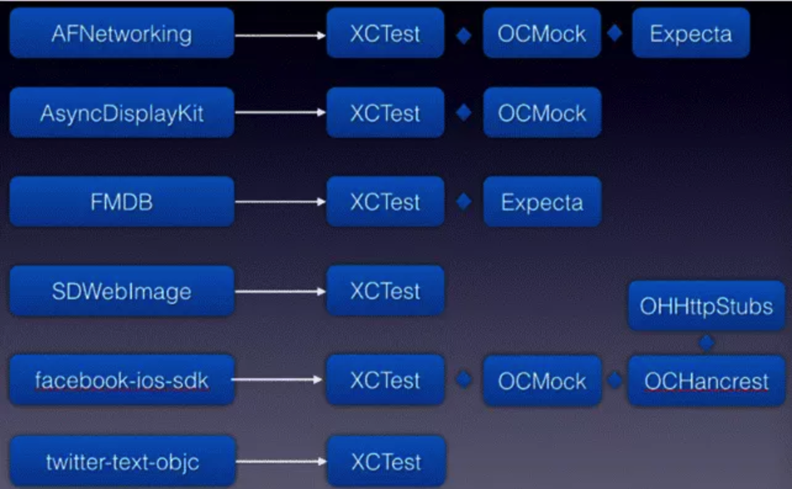
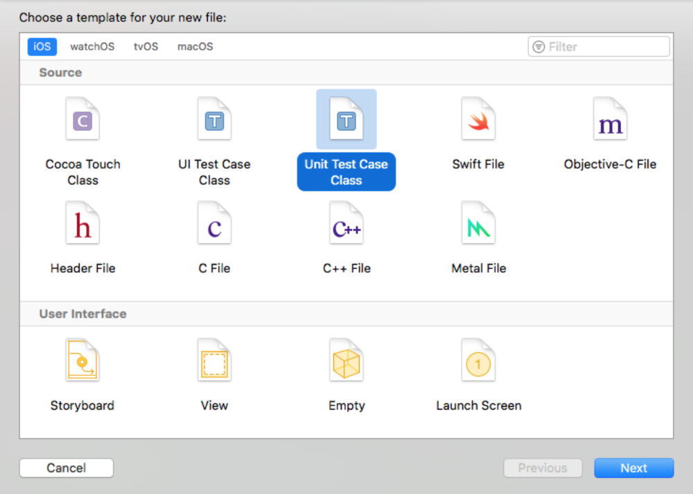
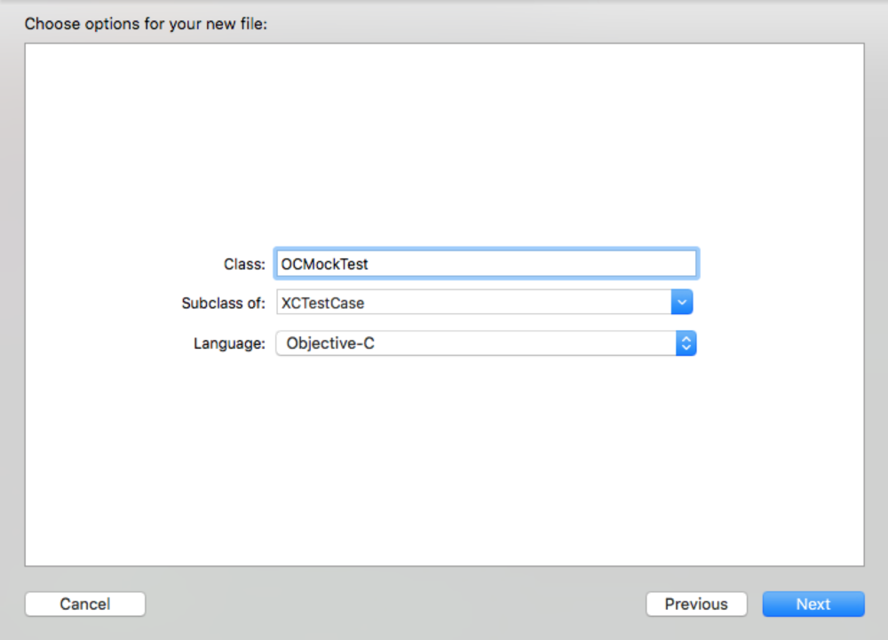
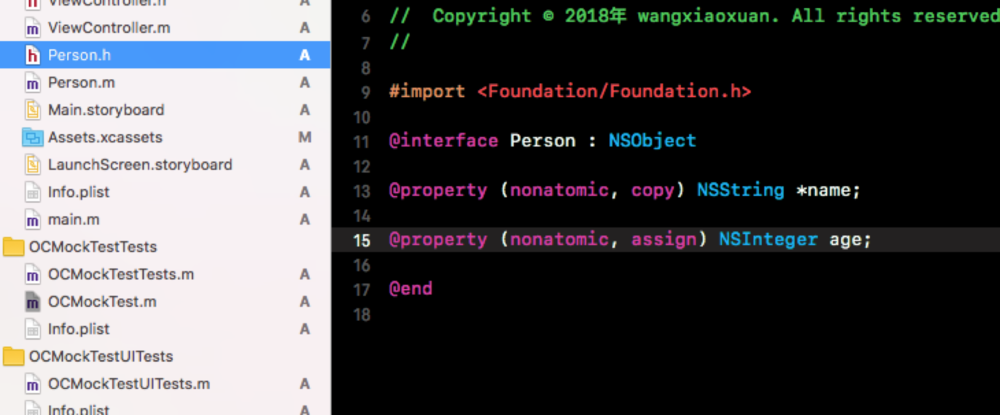
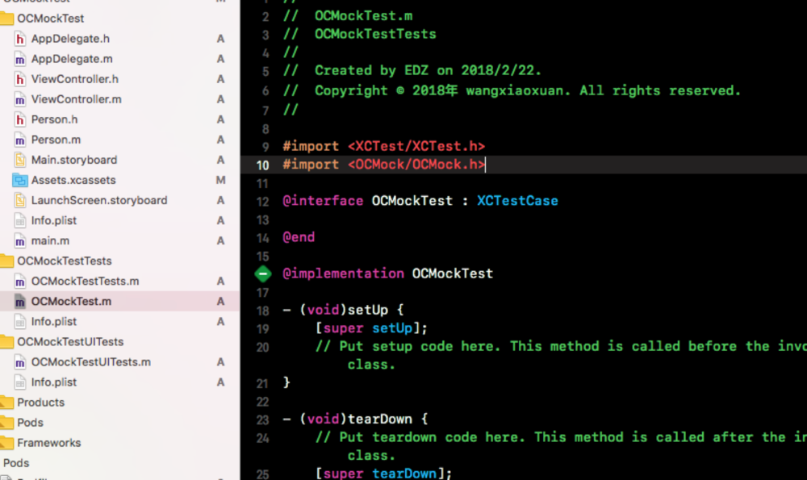
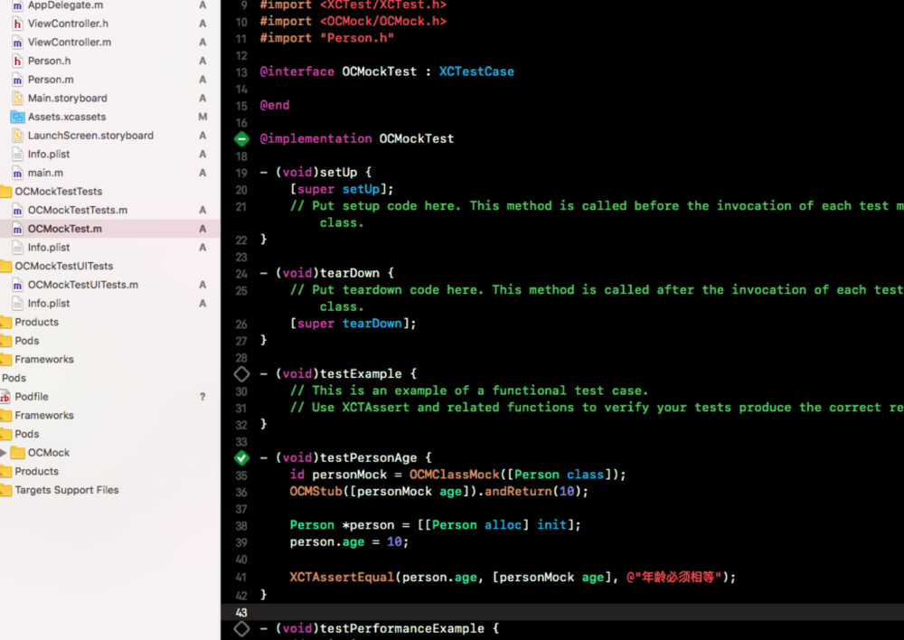

# 11.2 第三方框架使用


## XCTest + OCMock

首先来看看XCode内置的框架：XCTest。XCTest又可以分为两部分：Unit Test 和 UI Test，分别对应单元测试和UI测试。有一些三方的测试库也是基于XCTest框架的，这个在后文会讲到。由于是Apple官方提供的，所以这个框架会不断完善。

* 比较知名的开源库都采用 XCTest



### 配置运行XCTest需要的环境

* Test target是和主Target在同一个project文件下，运行的另一个Target，设置编译和Target Radio同样的文件加上自己加上的测试文件

* 工程中使用了Cocoapods来管理第三方库的话，Test target也需要添加响应的第三方库依赖，这样所有在工程中能使用到的代码，也能在测试用例用使用。


### 如何搭建OCMock的运行环境

[官网OCMock](http://ocmock.org/ios/)


OCMock 安装

* 可以在pod中安装，即将pod 'OCMock', '~> 3.2.2'放到Podfile中然后在终端输入:pod install即可完成安装。直接使用即可。

* 需要手动导入，需要自己设置项目依赖在主工程中Build Phases中添加依赖Link Binary.....，具体添加哪个framework看使用环境(OS,IOS,OStv)，注意:OCMock的Build Setting中Valid Architectures注意要和主工程支持的一致,build active architecture only设置为NO(编译出所有支持的版本arm7v，arm64之类)不容易出错。然后看看是否在Xcode/DerivedData/工程/Build/Products/Debug-iphonesimulator/生成了对应的framework(此路径为默认生成主工程包的路径,因此相关依赖也会默认生成在这里。主工程编译时查找需要的.a文件也会优先从当前目录查找,如果没有才会在build setting中设置的路径查找)












#### 如何使用XCTest + Mock来完成单元测试


* OCMock作用及实现原理

>对于一些不容易构造或不容易获取的对象，此时你可以创建一个虚拟的对象来完成测试。
实现思想：根据要mock的对象的class来创建一个对应的对象，并且设置好该对象的属性和调用预定方法后的动作（例如返回一个值，调用代码块，发送消息等等），然后将其记录到一个数组中，接下来开发者主动调用该方法，最后做一个verify（验证），从而判断该方法是否被调用，或者调用过程中是否抛出异常等。


* 使用说明

```
1.创建Mock对象

	1.1 类Mock
	id classMock = OCMClassMock([SomeClass class]);
	
	1.2 协议Mock
	id protocolMock = OCMProtocolMock(@protocol(SomeProtocol));
	
	1.3 严格的类和协议Mock
	默认的mock方式是nice(方法调用的时候返回nil或者是返回正确的方法)
	严格的模式下,mock的对象在调用没有被stub(置换)的方法的时候,会抛出异常.
	id classMock = OCMStrictClassMock([SomeClass class]);id protocolMock = OCMStrictProtocolMock(@protocol(SomeProtocol));
	
	1.4 部分Mock
	id partialMock = OCMPartialMock(anObject)
	这样创建的对象在调用方法时:
	如果方法被stub,调用stub后的方法.
	如果方法没有被stub,调用原来的对象的方法.
	partialMock 对象在调用方法后,可以用于稍后的验证此方法的调用情况(被调用,调用结果)
	
	1.5 观察者Mock
	id observerMock = OCMObserverMock();
	这样创建的对象可以用于观察/通知.
	
	
2 置换方法

	2.1 置换方法(待置换的方法返回objects)
	OCMStub([mock someMethod]).andReturn(anObject);
	在mock对象上调用某个方法的时候,这个方法一定返回一个anObject.(也就是说强制替换了某个方法的返回值为anObject)
	
	
	2.2 置换方法(待置换的方法返回values)
	OCMStub([mock aMethodReturningABoolean]).andReturn(YES);
	在mock对象上调用某个方法的时候,这个方法一定返回values.
	注意这里的原始值类型一定要和原来的方法的返回值一致.
	
	
	2.3 委托到另一个方法(置换委托方法到另外一个方法)
	OCMStub([mock someMethod]).andCall(anotherObject, @selector(aDifferentMethod));
	置换mock 对象的someMethod ==> anotherObject 的aDifferentMethod.
	这样,当mock对象调用someMethod方法的时候,实际上的操作就是anotherObject 调用了aDifferentMethod方法.
	
	
	2.4 置换一个blcok方法.
	OCMStub([mock someMethod]).andDo(^(NSInvocation invocation) { / block that handles the method invocation */ });
	在mock对象调用someMethod的时候,andDo后面的block会调用.block可以从NSInvocation中得到一些参数,然后使用这个NSInvocation对象来构造返回值等等.
	
	
	2.5 置换方法的参数
	OCMStub([mock someMethodWithReferenceArgument:[OCMArg setTo:anObject]]);
	OCMStub([mock someMethodWithReferenceArgument:[OCMArg setToValue:OCMOCK_VALUE((int){aValue})]]);
	mock对象在调用某个带参数的方法的时候,这个方法的参数可以被置换.
	setTo用来设置对象参数,setToValue用来设置原始值类型的参数.
	
	
	2.6 调用某个方法就抛出异常
	OCMStub([mock someMethod]).andThrow(anException);
	当mock对象调用someMethod的时候,就会抛出异常
	
	
	2.7 调用某个方法就发送通知
	OCMStub([mock someMethod]).andPost(aNotification);
	当mock对象调用someMethod的时候,就会发送通知.
	
	
	2.8 链式调用
	OCMStub([mock someMethod]).andPost(aNotification).andReturn(aValue);
	所有的actions(比如andReturn,andPost)可以链式调用.上面的例子中,mock对象调用someMethod方法后,发送通知,返回aValue
	
	
	2.9 转发的原来的对象/类
	OCMStub([mock someMethod]).andForwardToRealObject();
	使用部分mock的时候,使用类方法的可以转发到原来的对象/原来的类.
	这个功能在链式调用或者是使用expectation的时候很有用.
	
	
	2.10 什么也不做
	OCMStub([mock someMethod]).andDo(nil);
	可以给andDo传入nil参数,而不是原来一个block作为参数.
	这个功能在使用部分mock/mock类的时候很有用,可以屏蔽原来的行为.
	
	
3 验证作用

	3.1 运行后就验证
	id mock = OCMClassMock([SomeClass class]);
	/* run code under test */
	OCMVerify([mock someMethod]);
	在mock对象调用someMethod后就开始验证.(如果这个方法没有被调用),就抛出一个错误.
	在验证语句中可以使用 参数约束.
	
	3.2 置换后验证
	id mock = OCMClassMock([SomeClass class]);
	OCMStub([mock someMethod]).andReturn(myValue);
	/* run code under test */
	OCMVerify([mock someMethod]);
	在置换某个方法(置换了返回的参数)后,然后可以验证这个方法是否被调用.
	
	4 参数约束
	4.1 任意参数约束
	OCMStub([mock someMethodWithAnArgument:[OCMArg any]])
	OCMStub([mock someMethodWithPointerArgument:[OCMArg anyPointer]])
	OCMStub([mock someMethodWithSelectorArgument:[OCMArg anySelector]])
	不管传递什么参数,对于所有活跃的invocations,置换该方法.Pointers 和selectors 需要像上面一样特殊对待.对于既不是对象,也不是指针,更不是SEL类型的,不可以忽略的参数,可以使用 any 来代替.
	
	4.2 忽略非对象的参数
	[[[mock stub] ignoringNonObjectArgs] someMethodWithIntArgument:0]
	在这个invocation中,mock忽略所有的非对象参数.mock对象将会接收所有的someMethodWithIntArgument 方法 invocation,而不去管实际传递进来的参数是什么.如果这个方法含有对象参数和非对象参数,对象参数仍然可以使用OCMArg的参数约束.
	
	4.3 匹配参数
	OCMStub([mock someMethod:aValue)
	OCMStub([mock someMethod:[OCMArg isNil]])
	OCMStub([mock someMethod:[OCMArg isNotNil]])
	OCMStub([mock someMethod:[OCMArg isNotEqual:aValue]])
	OCMStub([mock someMethod:[OCMArg isKindOfClass:[SomeClass class]]])
	OCMStub([mock someMethod:[OCMArg checkWithSelector:aSelector onObject:anObject]])
	OCMStub([mock someMethod:[OCMArg checkWithBlock:^BOOL(id value) { /* return YES if value is ok */ }]])
	如果在置换创建的时候,有个一个参数传递进来了,置换方法将仅仅匹配精确参数的invocations.带不同的参数来调用的方法不会被匹配.
	OCMArg类提供了几个不同的方法来匹配不同的参数类型.
	对于checkWithSelector:onObject:方法, 当mock对象接收到someMethod:的时候, 会触发 anObject上的aSelector方法. 如果方法带参数,这个参数会传递给someMethod:. 这个方法应该返回一个BOOL值,表示这个参数是否和预期的一样.
	
	4.4 使用Hamcrest来匹配
	OCMStub([mock someMethod:startsWith(@"foo")]
	OCMock不带 Hamcrest 框架,所以如果想要使用的话,需要自己安装Hamcrest .
	
	
	
5 类方法的Mock


	5.1 置换类方法
	
	id classMock = OCMClassMock([SomeClass class]);
	OCMStub([classMock aClassMethod]).andReturn(@"Test string");
	// result is @"Test string"
	NSString *result = [SomeClass aClassMethod];
	置换类方法和置换实例方法的步骤相像.但是mock对象在深层次上对原有 类做了些更改.(替换了原有的的类的meta class).这让置换调用直接作用在mock对象上,而不是原有的类.
	注意:
	添加到类方法上的mock对象跨越了多个测试,mock的类对象在置换后不会deallocated,需要手动来取消这个mock关系.
	如果mock对象作用于同一个类, 这时的行为就不预测了.
	
	
	5.2 验证类方法的调用
	id classMock = OCMClassMock([SomeClass class]);
	/* run code under test */
	OCMVerify([classMock aClassMethod]);
	验证类方法的调用和验证实例方法的调用的使用方式一样.
	
	
	5.3 有歧义的类方法和实例方法
	id classMock = OCMClassMock([SomeClass class]);
	OCMStub(ClassMethod([classMock ambiguousMethod])).andReturn(@"Test string");
	// result is @"Test string"
	NSString *result = [SomeClass ambiguousMethod];
	置换了类方法,但是类有一个和类方法同名的实例方法,置换类方法的时候,必须使用ClassMethod()
	
	
	5.4 恢复类
	id classMock = OCMClassMock([SomeClass class]);
	/* do stuff */
	[classMock stopMocking];
	置换类方法后,可以将类恢复到原来的状态,通过调用stopMocking来完成.
	如果在结束测试前,需要恢复到原来的状态的话,这就很有用了.
	在mock对象被释放的时候,stopMocking会自动调用.
	当类恢复到原来的对象,类对象的meta class会变为原来的meta class.这会移除所有的方法置换.
	在调用了stopMocking之后,不应该继续使用mock对象.
	
	
6 部分Mock

	6.1 置换方法
	id partialMock = OCMPartialMock(anObject);
	OCMStub([partialMock someMethod]).andReturn(@"Test string");
	// result1 is @"Test string"
	NSString *result1 = [partialMock someMethod];
	// result2 is @"Test string", too!
	NSString *result2 = [anObject someMethod];
	部分Mock修改了原有的mock对象的类.(实际上是继承了待mock对象,然后替换用 继承的类来代替原有的类).
	这就是说: 使用真实的对象来调用,即使是使用self,也会影响 置换方法和预期的结果.
	
	
	6.2 验证方法调用
	id partialMock = OCMPartialMock(anObject);
	/* run code under test */
	OCMVerify([partialMock someMethod]);
	验证方法的调用和验证类方法,验证协议的调用类似.
	
	
	6.3 恢复对象
	id partialMock = OCMPartialMock(anObject);
	/* do stuff */
	[partialMock stopMocking];
	真正的对象可以通过调用stopMocking方法来恢复到原来的状态.
	这种情况只有在结束测试之前需要恢复到原来状态.
	部分mock对象会在释放的时候,会自动调用 stopMocking方法.
	当对象转变为原来的状态后,类会变为原来的类.也会移除所有的置换方法.
	在调用了stopMocking之后,最好不要去使用mock对象.
	
	
	
7 严格mock和期望


	7.1 Expect-run-verify 期望-运行-验证
	id classMock = OCMClassMock([SomeClass class]);
	OCMExpect([classMock someMethodWithArgument:[OCMArg isNotNil]]);
	/* run code under test, which is assumed to call someMethod */
	OCMVerifyAll(classMock)
	这是使用mock最原始的方法:
	创建mock对象
	期望调用某个方法
	测试代码(预想的是这段测试代码会调用上面期望调用的方法.
	验证mock对象(也就是验证期望的方法是否被调用了)
	如果预期的方法没有被调用,或者调用的时候,传递的参数不对,那么就好产生错误.可以使用上面 参数约束.
	严格的mock可以用在类和协议上.
	如果有怀疑的话,可以使用 3 验证作用
	
	
	7.2 严格的mock 和快速失败
	id classMock = OCMStrictClassMock([SomeClass class]);
	[classMock someMethod]; // this will throw an exception
	上面mock没有设置任何期望,直接掉调用某个方法会抛出异常.
	当超出去预期的调用的时候,会立即测试失败. 只有strict mock才会快速失败.
	
	
	7.3 置换操作和预期
	id classMock = OCMStrictClassMock([SomeClass class]);
	OCMExpect([classMock someMethod]).andReturn(@"a string for testing");
	/* run code under test, which is assumed to call someMethod */
	OCMVerifyAll(classMock)
	可以使用andReturn,andThrow,等预期的操作.如果方法被调用,会调用置换 方法,确认方法确实被调用了.
	
	
	7.4 延时验证
	id mock = OCMStrictClassMock([SomeClass class]);
	OCMExpect([mock someMethod]);
	/* run code under test, which is assumed to call someMethod eventually */
	OCMVerifyAllWithDelay(mock, aDelay);
	在某种情况下,预期的方法只有在 run loop 出于活跃状态的时候才会被调用.这时,可以将认证延时一会.aDelay是mock对象会等待的最大时间.通常情况下,在预期达到后就会返回.
	
	
	7.5 依序验证
	id mock = OCMStrictClassMock([SomeClass class]);
	[mock setExpectationOrderMatters:YES];
	OCMExpect([mock someMethod]);
	OCMExpect([mock anotherMethod]);
	// calling anotherMethod before someMethod will cause an exception to be thrown
	[mock anotherMethod];
	mock会按照在预期中设置好的顺序来判断.只要调用的不是按照期望的调用顺序,这个时候就会抛出异常.
	
	
	
8 观察者mock


	8.1 准备工作
	id observerMock = OCMObserverMock();
	[notificatonCenter addMockObserver:aMock name:SomeNotification object:nil];
	[[mock expect] notificationWithName:SomeNotification object:[OCMArg any]];
	为观察者和通知创建一个mock对象.
	在通知中心注册对象
	预期会调用这个通知.
	
	
	8.2 验证
	OCMVerifyAll(observerMock);
	目前观察者 mock 总是严格的mock.当一个不在预期中的通知调用的时候,就会抛出一个异常.
	这就是说,单个的通知实际上不是能被验证的.所有的通知必须按照预期赖设置.他们会在通过调用OCMVerifyAll来一起验证.
	
	
	
9 进阶话题


	9.1 对于普通的mock,快速失败
	对strict mock 对象,在一个mock对象上调用没有被mock方法(没有被置换)的时候,会抛出一个异常,这时候会发生 快速失败.
	id mock = OCMClassMock([SomeClass class]);
	[[mock reject] someMethod];
	这种情况下,mock会接受除了someMethod 的所有方法.触发someMethod方法会导致快速失败.
	
	
	9.2 在OCMVerifyAll时重新抛出异常
	在fail-fast的时候会抛出异常,但是这并不一定会导致测试失败.
	通过调用OCMVerifyAll重新抛出异常可以导致测试失败.
	这个功能在不在预期中的从notifications引发的invocations出现的时候使用.
	
	
	9.3 置换创建对象的方法
	id classMock = OCMClassMock([SomeClass class]);
	OCMStub([classMock copy])).andReturn(myObject);
	可以置换创建对象的 类/实例方法.当被置换的方法以 alloc,new,copy,mutableCopy开头的方法时,OCMock会自动调整对象的引用计数.
	id classMock = OCMClassMock([SomeClass class]);
	OCMStub([classMock new])).andReturn(myObject);
	尽管可以置换类的new方法,但是不建议这么做.
	没有办法置换 init 方法,因为这个方法是被mock对象自己实现的.
	
	
	9.4 基于实例对象的方法替换
	id partialMock = OCMPartialMock(anObject);
	OCMStub([partialMock someMethod]).andCall(differentObject, @selector(differentMethod));
	用一句话概括起来,Method swizzling 会在运行时替换一个方法的实现.
	使用 partial mock然后调用 andCall操作可以实现这个方法替换.
	当anObject收到someMethod消息时,anObject的实现没有触发,相反的,
	differentObject的differentMethod得到调用.
	其他方法并不会收到影响,仍然会调用原来的的方法的实现.
	
	
	
10 使用限制


	10.1 在一个指定的类上,只能有一个mock对象
	// don't do this
	id mock1 = OCMClassMock([SomeClass class]);
	OCMStub([mock1 aClassMethod]);
	id mock2 = OCMClassMock([SomeClass class]);
	OCMStub([mock2 anotherClassMethod]);
	原因是类的meta class 替换后,不会释放,mock类仍会存在,甚至可能跨tests.
	如果多个相同mock对象管理同一个类,运行时的行为就不可确定.
	
	
	10.2 在被置换的方法上设置期望,会不起作用
	id mock = OCMStrictClassMock([SomeClass class]);
	OCMStub([mock someMethod]).andReturn(@"a string");
	OCMExpect([mock someMethod]);
	/* run code under test */
	OCMVerifyAll(mock); // will complain that someMethod has not been called
	上面代码先替换了someMethod,然后强制someMethod返回”a string"
	由于现在mock的实现,所有的someMethod都会置换所处理.所以,即使这个方法被调用,这个验证也会失败.
	可以通过在expect后添加andReturn来避免这个问题. 也可以通过在expect后再次设置一个方法替换.
	
	
	10.3 Partial mock 不能在某些特定的类使用
	id partialMockForString = OCMPartialMock(@"Foo");
	// will throw an exception
	NSDate *date = [NSDate dateWithTimeIntervalSince1970:0];
	id partialMockForDate = OCMPartialMock(date);
	// will throw on some architectures
	不可能创建一个 toll-free bridged的类,例如 NSString,或者是NSDate.
	如果你试图这么去做,那么可能会抛出一个异常.
	
	
	10.4 某些特定的类不能被置换和验证
	id partialMockForString = OCMPartialMock(anObject);
	OCMStub([partialMock class]).andReturn(someOtherClass); // will not work
	不能mock某些运行时的方法,例如
	class,
	methodSignatureForSelector:
	forwardInvocation:
	
	
	10.5 NSString的类方法不能被置换和验证
	id stringMock = OCMClassMock([NSString class]);
	// the following will not work
	OCMStub([stringMock stringWithContentsOfFile:[OCMArg any] encoding:NSUTF8StringEncoding error:[OCMArg setTo:nil]]);
	
	
	10.6 NSObject 的方法不能被验证
	id mock = OCMClassMock([NSObject class]);
	/* run code under test, which calls awakeAfterUsingCoder: */
	OCMVerify([mock awakeAfterUsingCoder:[OCMArg any]]);
	// still fails
	不可能在NSObject 和它的分类category上使用verify-after-running.
	在某些情况下可能置换这个方法,然后验证.
	
	
	10.7 apple 的私有方法不能被验证
	UIWindow window = / get window somehow /
	id mock = OCMPartialMock(window);
	/ run code under test, which causes _sendTouchesForEvent: to be invoked */
	OCMVerify([mock _sendTouchesForEvent:[OCMArg any]]);
	// still fails
	含有下划线前缀,后缀,NS,UI开头的方法等.
	
	
	10.8 Verify-after-running不能使用延时
	只有在 严格的mock和期望中,可以使用expect-run-verify


```


## UI Automation


iOS提供了一个框架UIAutomation，可用来实现自动化测试，可以通过这个框架自定义一些列操作，自动的运行在真机设备或者xcode的模拟器上

UIAutomation框架的测试方式属于非注入式的，测试内容和最终上线内容一致，不需要源码，但是功能会有所受限。注入式的自动化测试需要用到第三方的工具。本文主要用到的是前者的方式。

测试环境需要用到instruments，xcode自带的工具。本文的例子为直接在模拟器上进行测试。

在Xcode8.1之前我们还能用UIAutomation 之类的工具进行自动化测试，然后再Xcode8.x之后我们无法用其进行 自动化测试。


[UI Automation](https://www.jianshu.com/p/0e28ae1bd2c2)


[iOS UITests(UI自动化测试 实现)](https://www.jianshu.com/p/cf445a2f5f5b)


[Appium自动化—浅谈iOS自动化测试环境搭建](https://www.jianshu.com/p/c43a94ecca97)


[iOS自动化测试框架对比](https://www.jianshu.com/p/047035416095)


[复杂业务场景下如何进行iOS端自动化测试](http://www.cocoachina.com/ios/20170425/19123.html)


[关于iOS逻辑自动化测试实践](http://www.code4app.com/blog-914657-1227.html)


[关于iOS自动化测试及性能测试的](https://blog.csdn.net/calvin_cn/article/details/75048005)


[移动APP自动化测试框架](https://www.cnblogs.com/fqfanqi/p/6139435.html)


[使用Python写iOS自动化测试](https://blog.methodname.com/webdriveragenthe-wda/)


[使用Appium进行iOS的真机自动化测试](https://www.jianshu.com/p/ae8846736dba)


[iOS 自动化测试 UI Automation](https://www.jianshu.com/p/0e28ae1bd2c2)


[iOS单元测试初探以及OCMock使用入门](https://www.jianshu.com/p/c37bde847682)


