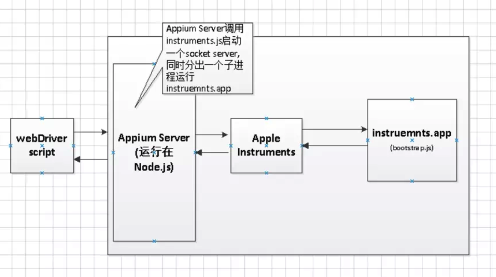

# 11.3 自动化测试 - Appium自动化


在日常的测试工作中，我们会发现有些测试工作重复率极高，测试人员需要花费大量的时间进行这些重复性的测试，浪费了大量的人力与时间。若能够将常用的测试场景进行自动化，那必定能节省许多的人力与时间。作为一个初次步入测试行业的小白，也十分渴望能够使用自动化来分担测试工作。上网搜索了很多的资料，了解了很多工具，再加上之前有稍微接触过Appium，所以决定使用Appium开启自动化的探索。Appium支持的脚本语言有很多，例如js、java、Python、ruby，可选择一种自己熟练的脚本语言进行编写。


## Appium工作原理

根据查阅的资料，简单的介绍一下appium的工作原理。首先Appium是c/s模式的，appium是基于webdriver协议添加对移动设备自动化api扩展而成的。webdriver是基于http协议的，第一连接会建session会话，并通过post发送一个json告知服务端相关测试信息。



客户端执行脚本后生成基于WebDriver协议下的URL请求，服务器接收URL请求（类似一个远程命令）并将命令转发给测试机器，测试机器接收命令，解析命令后执行相应的操作，并把执行结果返回给服务器端，服务器端再将执行结果返回给客户端。


## Appium环境搭建（osx）

### VPN  

环境搭建过程中有些安装需要翻墙安装，所以建议安装个VPN。网上随便搜个下载即可


###  环境基础

* java


```

MacBook-Pro:~ $ java -version
java version "1.8.0_66"
Java(TM) SE Runtime Environment (build 1.8.0_66-b17)
Java HotSpot(TM) 64-Bit Server VM (build 25.66-b17, mixed mode)

```

* Git

```
MacBook-Pro:~ $ git --version
git version 2.4.9 (Apple Git-60)

```


* Ruby

```
MacBook-Pro:~ $ ruby -v
ruby 2.0.0p481 (2014-05-08 revision 45883) [universal.x86_64-darwin14]

```

*  brew

```
MacBook-Pro:~ $ brew -v
Homebrew 0.9.9 (git revision f1293; last commit 2016-05-30)
Homebrew/homebrew-core (git revision c7ac; last commit 2016-05-31)
```
brew是Mac OS不可或缺的套件管理器。安装方法是：

```
ruby -e "$(curl -fsSL https://raw.githubusercontent.com/Homebrew/install/master/install)"
```


### 环境安装

#### java 安装


##  Appium 安装


Mac平台环境安装完毕之后，就可以开始安装Appium了

* 直接下载appium.dmg 运行即可 [Appium-Desktop下载传送门中]()

* .使用npm安装


### 使用命令行安装

官网上提供的步骤是下面这样的：

```
> brew install node      # get node.js
> npm install -g appium  # get appium
> npm install wd         # get appium client
> appium &               # start appium
> node your-appium-test.js  #跑个测试时看看

```


#### 安装node.js

Appium依赖Node.js环境，因此需要先安装node环境。安装方法是执行brew install node。
安装完成后，可以执行node -v查看node版本。

```
MacBook-Pro:~ $ node -v
v6.2.0

```


#### 安装 appium server

在终端输入npm install -g appium。过程可能会比较慢。

```
npm install -g appium

```


#### 安装appium client

```

在终端输入npm install wd。

```


#### 安装依赖库

如果没有安装 libimobiledevice，会导致Appium无法连接到iOS的设备，所以必须要安装，如果要在iOS10+的系统上使用appium，则需要安装ios-deploy

```
brew install libimobiledevice --HEAD
npm install -g ios-deploy  #如果是iOS10以上的系统才需要安装


```

#### appium-doctor 安装

```
npm install appium-doctor -g

```

安装后执行appium-doctor --ios指令，可以查看与iOS相关配置是否完整，下图是全部配置都成功,如果有那一项是打叉的，则进行安装就可以了。

```
appium-doctor --ios 

```


[使用Appium进行iOS的真机自动化测试](https://www.jianshu.com/p/ae8846736dba)


[Appium自动化—浅谈iOS自动化测试环境搭建](https://www.jianshu.com/p/c43a94ecca97)


