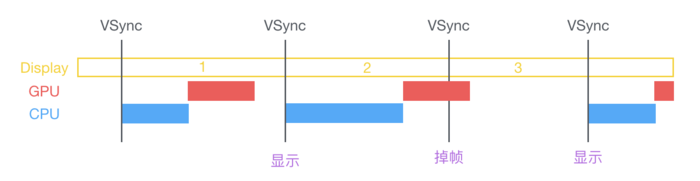
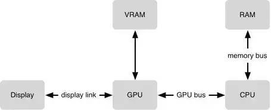
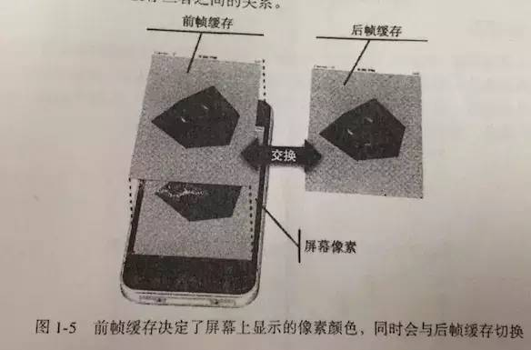

# 12.1 性能优化方向


##  iOS 产生能耗的过程

iOS 的显示系统是由 VSync 信号驱动的，VSync 信号由硬件时钟生成，每秒钟发出 60 次（这个值取决设备硬件，比如 iPhone 真机上通常是 59.97）。iOS 图形服务接收到 VSync 信号后，会通过 IPC 通知到 App 内。App 的 Runloop 在启动后会注册对应的 CFRunLoopSource 通过 mach_port 接收传过来的时钟信号通知，随后 Source 的回调会驱动整个 App 的动画与显示。




在VSync信号到来后，系统图形服务会通过CADisplayLink等机制通知App，App主线程开始在CPU中计算显示内容，比如视图的创建、布局计算、图片解码、文本绘制等。随后CPU会将计算好的内容提交到GPU去，由GPU进行变换、合成、渲染。随后GPU会把渲染结果提交到帧缓冲区去，等待下一次VSync信号到来时显示到屏幕上。由于垂直同步的机制，如果在一个VSync时间内，CPU或者GPU没有完成内容提交，则那一帧就会被丢弃，等待下一次机会再显示，而这时显示屏会保留之前的内容不变。这就是界面卡顿的原因。


### iOS 设备中的 CPU & GPU

#### CPU

> 加载资源，对象创建，对象调整，对象销毁，布局计算，Autolayout，文本计算，文本渲染，图片的解码， 图像的绘制（Core Graphics）都是在CPU上面进行的。
> 


#### GPU

> GPU是一个专门为图形高并发计算而量身定做的处理单元，比CPU使用更少的电来完成工作并且GPU的浮点计算能力要超出CPU很多。
> 
> GPU的渲染性能要比CPU高效很多，同时对系统的负载和消耗也更低一些，所以在开发中，我们应该尽量让CPU负责主线程的UI调动，把图形显示相关的工作交给GPU来处理，当涉及到光栅化等一些工作时，CPU也会参与进来，这点在后面再详细描述。
> 
> 相对于CPU来说，GPU能干的事情比较单一：接收提交的纹理（Texture）和顶点描述（三角形），应用变换（transform）、混合（合成）并渲染，然后输出到屏幕上。通常你所能看到的内容，主要也就是纹理（图片）和形状（三角模拟的矢量图形）两类。
> 


#### CPU 和 GPU 的协作

要在屏幕上显示视图，需要CPU和GPU一起协作，CPU计算好显示的内容提交到GPU，GPU渲染完成后将结果放到帧缓存区，随后视频控制器会按照VSync信号逐行读取帧缓冲区的数据，经过可能的数模转换传递给显示器显示。







iOS使用的是双缓冲机制。即GPU会预先渲染好一帧放入一个缓冲区内（前帧缓存），让视频控制器读取，当下一帧渲染好后，GPU会直接把视频控制器的指针指向第二个缓冲器（后帧缓存）。当你视频控制器已经读完一帧，准备读下一帧的时候，GPU会等待显示器的VSync信号发出后，前帧缓存和后帧缓存会瞬间切换，后帧缓存会变成新的前帧缓存，同时旧的前帧缓存会变成新的后帧缓存。


## 资源消耗原因以及解决办法

#### CPU资源消耗原因以及解决办法

* 对象的创建：

对象的创建会分配内存、设置属性等，会消耗CPU资源。所以尽量使用轻量对象代替，比如能用CALayer的时候尽量不用UIView，敏感位置能不用IB尽量使用纯代码手写。推荐使用懒加载在需要使用时候创建对象。


* 对象调整

对 UIView 的这些属性进行调整时，消耗的资源要远大于一般的属性。对此你在应用中，应该尽量减少不必要的属性修改。当视图层次调整时，UIView、CALayer 之间会出现很多方法调用与通知，所以在优化性能时，应该尽量避免调整视图层次、添加和移除视图。

* 对象销毁

当前类持有大量对象时候，其销毁时候的资源消耗就非常明显。建议创建销毁的异步队列，将需要销毁的对象放到队列中销毁。

* 布局计算

布局计算在UITableView使用中是最常见的消耗资源的地方。建议取到数据之后，异步进行计算布局并缓存下来，当复用Cell时候直接调用缓存数据。

* AutoLayout

Autolayout 对于复杂视图来说常常会产生严重的性能问题，AutoLayout相对低效的原因是隐藏在底层的命名为”Cassowary“的约束求解系统，随着视图数量的增长，Autolayout 带来的 CPU 消耗会呈指数级上升，当Cell内约束超过25个的时候，会降低滑动的帧率。

* 文本的计算以及渲染

UI中存在大量的对于文本高度的适配，可以参考：用 [NSAttributedString boundingRectWithSize:options:context:] 来计算文本宽高，用 -[NSAttributedString drawWithRect:options:context:] 来绘制文本。尽管这两个方法性能不错，但仍旧需要放到后台线程进行以避免阻塞主线程。常见的文本控件 （UILabel、UITextView 等），其排版和绘制都是在主线程进行的，当显示大量文本时，CPU 的压力会非常大。解决办法是利用TextKit或者是CoreText自定义文本控件[YYText](https://github.com/ibireme/YYText)

* 图片解码以及图像的绘制

当你用 UIImage 或 CGImageSource 的那几个方法创建图片时，图片数据并不会立刻解码。图片设置到 UIImageView 或者 CALayer.contents 中去，并且 CALayer 被提交到 GPU 前，CGImage 中的数据才会得到解码。这一步是发生在主线程的，并且不可避免。如果想要绕开这个机制，常见的做法是在后台线程先把图片绘制到 CGBitmapContext 中，然后从 Bitmap 直接创建图片。目前常见的网络图片库都自带这个功能。

* 文件系统的调用

NSFileManager获取一个目录获取文件信息，进行多次递归计算，stat几乎瞬间完成，NSFileManager耗时较长且消耗CPU。


#### GPU资源消耗原因以及解决办法：


* 纹理的渲染

当在较短时间显示大量图片时（比如 TableView 存在非常多的图片并且快速滑动时），CPU 占用率很低，GPU 占用非常高，界面仍然会掉帧。避免这种情况的方法只能是尽量减少在短时间内大量图片的显示，尽可能将多张图片合成为一张进行显示。


* 视图的混合（Blended）

视图结构过于复杂，混合的过程、会消耗很多 GPU 资源。为了减轻这种情况的 GPU 消耗，应用应当尽量减少视图数量和层次，并在不透明的视图里标明 opaque 属性以避免无用的 Alpha 通道合成。当然，这也可以用上面的方法，把多个视图预先渲染为一张图片来显示。

Blended Layers（视图混合）：在同一个区域内，存在着多个有透明度的图层，那么GPU需要更多的计算，混合上下多个图层才能得出最终像素的RGB值。

Misaligned Images（像素对齐）：逻辑像素（point）和 物理像素（pixel)无法相匹配；图片的size和显示图片的imageView的size（逻辑像素（point））不相等。


* 图形的生成

CALayer 的 border、圆角、阴影、遮罩（mask），CASharpLayer 的矢量图形显示，通常会触发离屏渲染（offscreen rendering），而离屏渲染通常发生在 GPU 中。可以尝试开启 CALayer.shouldRasterize 属性，但这会把原本离屏渲染的操作转嫁到 CPU 上去。


#### 解决方案：

* 预先计算UI布局
获取数据之后，异步计算Cell高度以及各控件高度和位置，并储存在CellLayouModel中，当每次Cell需要高度以及内部布局的时候就可以直接调用，不需要进行重复计算。

* 使用自动缓存高度

iOS 8之后出现了UITableView通过约束自动计算高度，但是因为iOS对于约束的算法问题，会导致流畅性降低，[FDTemplateLayoutCell](https://github.com/forkingdog/UITableView-FDTemplateLayoutCell/)很好的优化了这个问题


* 异步绘制

Facebook的开源项目[Texture](https://github.com/TextureGroup/Texture)（原AsyncDisplayKit），通过利用ASDisplayNode封装了CALayer，实现了异步绘制。

第三方微博客户端[墨客](https://itunes.apple.com/cn/app/moke-纯粹体验-for-新浪微博/id880813963?mt=8)的是现实，当滑动时，松开手指后，立刻计算出滑动停止时 Cell 的位置，并预先绘制那个位置附近的几个 Cell，而忽略当前滑动中的 Cell。但也有缺点，快速滑动的时候有可能会出现大量空白。


* 高效图片加载

* [FastImageCache-github](https://github.com/path/FastImageCache)

* [SDWebImage-github](https://github.com/SDWebImage/SDWebImage)

* [YYImage-github](https://github.com/ibireme/YYImage)


* 预加载

列表当中，当滑动到一个可以设定的位置的时候，提前获取下载下一页的数据，并绘制UI [预加载](https://zhuanlan.zhihu.com/p/23418800。)

* 针对Blended Layers以及Misaligned Images

---

Blended Layers：

尽量少的使用具有透明色的图片
尽量多的将UI部件增加背景色
减少同一像素点进行过多的颜色计算
Misaligned Images：

现象：

洋红色：UIView的frame像素不对齐，即不能换算成整数像素值。

黄色：UIImageView的图片像素大小与其frame.size不对齐，图片发生了缩放造成。

解决：

尽量使用ceil()，保证没有小数的UI绘制

尽量不实用0.01f标记UITableView或者UICollectionView的header以及footer

网络上获取的图片没有@2x和@3x的区别，需要我们缩放图片到与UIImageView对应的尺寸，且缩放后的图片的scale和[UIScreen mainScreen].scale相等，再显示出来。

---


## 视图层级优化

* 不要动态创建视图

* 在内存可控的前提下，缓存subview。

* 善用hidden。

* 减少视图层级

* 减少subviews个数，用layer绘制元素。

* 少用clearColor，maskToBounds，阴影效果等。

* 减少多余的绘制操作

* 不要用JPEG的图片，应当使用PNG图片。

* 使用透明view会引起blending，在iOS的图形处理中，blending主要指的是混合像素颜色的计算。最直观的例子就是，我们把两个图层叠加在一起，如果第一个图层的透明的，则最终像素的颜色计算需要将第二个图层也考虑进来。这一过程即为Blending。

* OpenGL中，GPU屏幕渲染有以下两种方式：

  * On-Screen Rendering即当前屏幕渲染，指的是GPU的渲染操作是在当前用于显示的屏幕缓冲区中进行。

  * Off-Screen Rendering即离屏渲染，指的是GPU在当前屏幕缓冲区以外新开辟一个缓冲区进行渲染操作。


## 网络耗能


#### 度量网络性能的三个重要指标

* 网络带宽(两个端点之间的通信通道每秒可以传输的位数，任何网络连接的最大速率取决于通信路径上的最慢链路)
* 网络延时(网络包在两个端点音一次往返所需的时间)
* 设备电量


### 优化网络操作

#### 一，承认网络性能存在的问题是解决问题的第一步。


#### 二，减少请求带宽

* 使用高效的数据交换格式
* 在可能的情况下使用预先压缩的数据(使用专门算法对诸如音频，视频和图像进行压缩或按比例缩放以适应通道与设备)
* 压缩每一个请求与响应负载(iOS网络请求中都是默认开启压缩的，接收到负载会自动解压缩并以最初的格式呈现在代码中。解压缩的计算代价要比传输10倍字节的通信代价低，因此，激活响应压缩几呼是有益无害的)
如果想禁用压缩，应该可以通过清除自动设定的Accept-Encoding头来实现。如相代码演示了如何清除这个头：

```
NSMutableURLRequest *request = [[NSMutableURLRequest alloc]initWithURL:url cachePolicy:NSURLCacheStorageAllowed timeoutInterval:20];
[request addValue:@"" forHTTPHeaderField:@"Accept-Encoding"];

```

#### 三，降低请求延迟

网络延迟包括在手机与运营商网络间建立连接的时间，建立TCP连接的时间，可能还有协商SSL连接的时间，以及发送与接收HTTP请求的时间。 应用可以按照顺序执行所有队列请求，在这个过程中一直保持激活相同的连接，避免建立多个TCP连接开销。

可以轻松为NSURLRequest开启管道支持，如下：

```
NSMutableURLRequest *request = [[NSMutableURLRequest alloc]initWithURL:url]; [request setHTTPShouldUsePipelining:YES];

```

* 并非所有的服务器都支持HTTP管道

#### 四，避免网络请求

* 默认缓存行为

* 精简请求次数

* 高效数据交互模式


## 测试工具

Core Animation，Instruments里的图形性能问题的测试工具。

view debugging，Xcode 自带的，视图层级。

reveal，视图层级。


##关于iOS 性能优化梳理： 基本工具、业务优化、内存优化、卡顿优化、布局优化、电量优化、 安装包瘦身、启动优化、网络优化等


#### 内存优化

[微信读书 iOS 性能优化总结](http://wereadteam.github.io/2016/05/03/WeRead-Performance/)

[微信读书 iOS 质量保证及性能监控](http://wereadteam.github.io/2016/12/12/Monitor/)

[iOS 性能优化之业务性能监控](http://skyming.me/2016/05/08/iOS-Performance-Optimization-Time-md/)


[iOS 性能优化之业务性能监控](http://skyming.me/2016/05/08/iOS-Performance-Optimization-Time-md/)


[魔窗研发副总裁沈哲：移动端SDK的优化之路](https://blog.csdn.net/magicwindow/article/details/51423463)


[搜狗输入法 iOS 版开发与优化实践](http://www.cocoachina.com/design/20160905/17483.html)

[蘑菇街 App 的稳定性与性能实践PPT](https://wenku.baidu.com/view/85e2bf48c4da50e2524de518964bcf84b8d52d5a.html)

#### 卡顿优化

[微信iOS卡顿监控系统](http://www.360doc.com/content/15/1104/16/28748685_510721166.shtml)

[iOS-卡顿检测](https://blog.csdn.net/u010262501/article/details/79616963)


#### 布局优化. 电量优化. 启动优化. 

[今日头条iOS客户端启动速度优化](https://techblog.toutiao.com/2017/01/17/iosspeed/)


[WWDC 2016 Session笔记：App启动时间优化](https://www.jianshu.com/p/69e1d169e55a)


[百度输入法-iOS 启动速度优化](https://chuanke.baidu.com/v1985705-207304-1265650.html)


[iOS瘦身之删除FrameWork中无用mach-O文件](https://www.infoq.cn/article/ios-thinning-delete-unnecessary-mach-o)

[基于clang插件的一种iOS包大小瘦身方案](https://www.infoq.cn/article/clang-plugin-ios-app-size-reducing)

[iOS可执行文件瘦身方法](http://blog.cnbang.net/tech/2544/)

[iOS图片优化方案](https://github.com/Magic-Unique/HXImage)


#### 网络优化

[美团点评移动网络优化实践](https://tech.meituan.com/Shark_SDK.html)


[开源版HttpDNS方案详解](http://www.cnblogs.com/softidea/p/5325192.html)


[携程 App 的网络性能优化实践](https://www.infoq.cn/article/how-ctrip-improves-app-networking-performance)


[携程 App 的网络性能优化实践](https://www.infoq.cn/article/how-ctrip-improves-app-networking-performance)


[蘑菇街 App Chromium 网络栈实践](https://www.infoq.cn/article/mogujie-app-chromium-network-layer)


#### 相关开源库

[HTTPDNSLib-for-iOS](https://github.com/CNSRE/HTTPDNSLib-for-iOS)

[HTTPDNSLib-for-Andorod](https://github.com/CNSRE/HTTPDNSLib)

[LSUnusedResources](https://github.com/tinymind/LSUnusedResources)

[LinkMap](https://github.com/huanxsd/LinkMap)


## 参考

[iOS离屏渲染之优化分析](http://www.cnblogs.com/fishbay/p/7576176.html)

[iOS视图渲染以及性能优化总结](https://www.jianshu.com/p/b29c682679c4)


[使用 ASDK 性能调优 - 提升 iOS 界面的渲染性能](https://www.jianshu.com/p/0c187818b39f)


[如何做优化，UITabelView才能更加顺滑](https://mp.weixin.qq.com/s?__biz=MjM5OTM0MzIwMQ==&mid=402351449&idx=1&sn=3ef1c82a123da76a1e899ab70bb5e9f7&scene=1&srcid=0118mcBfdWRqJ8w20WOqmbvh#rd)

[iOS 保持界面流畅的技巧](https://blog.ibireme.com/2015/11/12/smooth_user_interfaces_for_ios/)


[优化UITableViewCell高度计算的那些事](http://blog.sunnyxx.com/2015/05/17/cell-height-calculation/)


[iOS优化（三）没错我还是滑动优化](https://www.jianshu.com/p/f3e18bab841e)


[iOS开发针对对Masonry下的FPS优化讨论](https://juejin.im/entry/5a111ae86fb9a045211e4b62)

[iOS开发之Masonry框架源码解析](http://www.cnblogs.com/ludashi/p/5591572.html)


[iOS 2D Graphic（3）—— Offscreen Rendering离屏渲染](https://www.jianshu.com/p/161c46ddbeaf)


[iOS 流畅度性能优化、CPU、GPU、离屏渲染](https://www.jianshu.com/p/d27323c18790)


[iOS最全性能优化(上)](https://www.jianshu.com/p/9c450e512020)

[iOS最全性能优化(中)](http://www.jianshu.com/p/ad90e90dce4f)

[iOS最全性能优化(下)](http://www.jianshu.com/p/25e2f1ae51d2)


