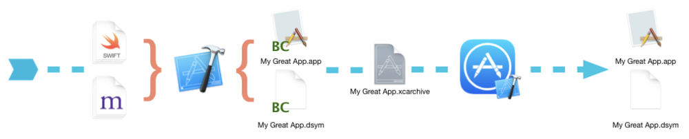
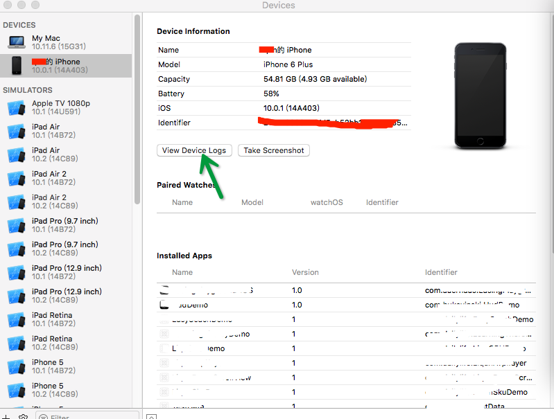
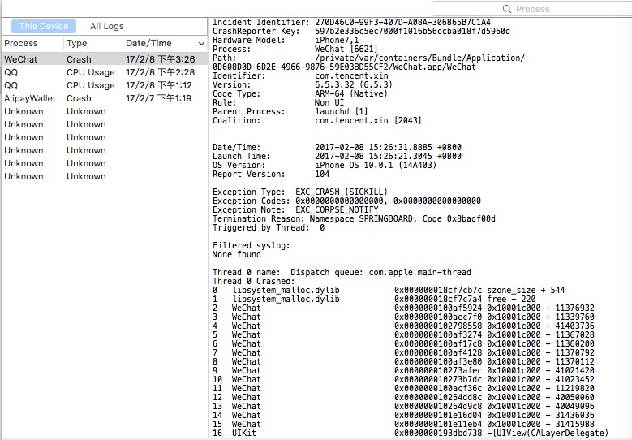
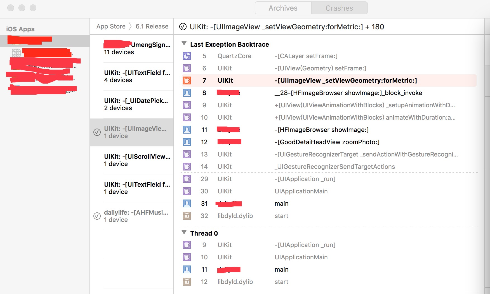
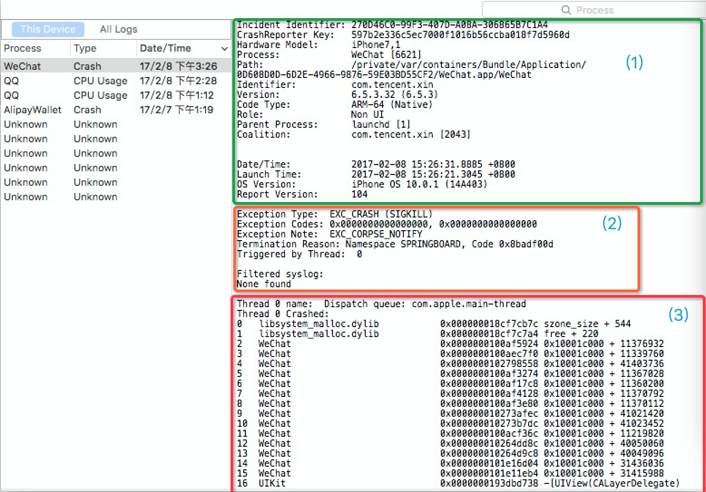

# 12.1 Crash文件解析


iOS 开发过程中会遇到crash，有些很容易就能定位到，例如数组越界、类型不匹配、方法不存在等。但是有些就比较头疼了，莫名其妙的，崩溃的让你怀疑自己是不是写了假程序，就算查看日志也是一堆只有机器才能看懂的内存地址，无法定位。其实可以根据原始crash文件，再配合一些其他文件和Xcode自带的解析工具symbolicatecrash，就可以是crash文件符号化，让你轻松定位到崩溃的元凶(当然说到底代码要是自己写的，那这个锅只能默默背着了。毕竟自己挖的坑，含着泪也要慢慢爬出来。😂)。


## 报错类型汇总

* Watchdog timeout 

```

Exception Code：0x8badf00d， 不太直观，可以读成“eat bad food”，意思是don‘t block main thread

紧接着下面会有一段描述：

Application Specific Information：

com.xxx.yyy　　 failed to resume in time

对于此类Crash，我们应该去审视自己App初始化时做的事情是否正确，是否在主线程请求了网络，或者其他耗时的事情卡住了正常初始化流程。

通常系统允许一个App从启动到可以相应用户事件的时间最多为5S，如果超过了5S，App就会被系统终止掉。在Launch，resume，suspend，quit时都会有相应的时间要求。在Highlight Thread里面我们可以看到被终止时调用到的位置，xxxAppDelegate加上行号。 

PS. 在连接Xcode调试时为了便于调试，系统会暂时禁用掉Watchdog，所以此类问题的发现需要使用正常的启动模式。


```

* User force-quit

```
Exception Codes: 0xdeadfa11, deadfall

这个强制退出跟我们平时所说的kill掉后台任务操作还不太一样，通常在程序bug造成系统无法响应时可以采用长按电源键，当屏幕出现关机确认画面时按下Home键即可关闭当前程序。


该进程异常退出，此异常类型崩溃的最常见原因是向对象发送了无法识别的消息，比如上文中向NSArray发送了addObject消息。
另外如果App Extensions需要太多时间来初始化（看门狗机制），那么App Extensions将终止于此异常类型，如果扩展因启动时挂起而死亡，则生成的崩溃报告的Exception Subtype将会是LAUNCH_HANG，由于扩展没有main函数，任何花在初始化上的时间都会在+load扩展库和相关库中的静态构造函数和方法中，你应该尽可能多地推迟这项工作。


```


* Low Memory termination

```
跟一般的Crash结构不太一样，通常有Free pages，Wired Pages，Purgeable pages，largest process 组成，同事会列出当前时刻系统运行所有进程的信息。

系统有四种内存警告，定义如下：

　　　　typedef enum {

    　　　　OSMemoryNotificationLevelAny      = -1,

    　　　　OSMemoryNotificationLevelNormal   =  0,

    　　　　OSMemoryNotificationLevelWarning  =  1,

    　　　　OSMemoryNotificationLevelUrgent   =  2,

    　　　　OSMemoryNotificationLevelCritical =  3

　　　　} OSMemoryNotificationLevel;

App在运行过程中，系统内存紧张时通常会先发警告，同时把后台挂起的程序终止掉，最终如果还是内存不够的话就会终止掉当前前台的进程。

当接受到内存警告的事后，我们应该释放尽可能多的内存，Crash其实也可以看做是对App的一种保护。

```

* Crash due to bugs

```
因为程序bug导致的Crash通常千奇百怪，很难一概而论。大部分情况通过Crash日志就可以定位出问题，当然也不排除部分疑难杂症看半天都不值问题出在哪儿。这个就只能看功底了，一点点找，总是能发现蛛丝马迹。是在看不出来时还可以求助于Google大神，总有人遇到和你一样的Bug 

```


###  Exception Type 常见异常类型信息


* ``EXC_BAD_ACCESS``

	* 此类型的Excpetion是我们最长碰到的Crash，通常用于访问了不改访问的内存导致。一般EXC_BAD_ACCESS后面的"()"还会带有补充信息。
	
	* SIGSEGV: 通常由于重复释放对象导致，这种类型在切换了ARC以后应该已经很少见到了。
	
	* SIGABRT:  收到Abort信号退出，通常Foundation库中的容器为了保护状态正常会做一些检测，例如插入nil到数组中等会遇到此类错误。
	
	* SEGV:（Segmentation  Violation），代表无效内存地址，比如空指针，未初始化指针，栈溢出等；
	
	* SIGBUS：总线错误，与 SIGSEGV 不同的是，SIGSEGV 访问的是无效地址，而 SIGBUS 访问的是有效地址，但总线访问异常(如地址对齐问题, 它之所以称为总线错误是因为对未对齐的内存访问时,被阻塞的组件就是地址总线)

	* SIGILL：尝试执行非法的指令，可能不被识别或者没有权限

* ``EXC_BAD_INSTRUCTION``

此类异常通常由于线程执行非法指令导致

* ``EXC_ARITHMETIC``

除零错误会抛出此类异常

### Exception Code

* ``0xbaaaaaad`` 此种类型的log意味着该Crash log并非一个真正的Crash，它仅仅只是包含了整个系统某一时刻的运行状态。通常可以通过同时按Home键和音量键，可能由于用户不小心触发

* ``0xbad22222``当VOIP程序在后台太过频繁的激活时，系统可能会终止此类程序

* ``0x8badf00d``这个前面已经介绍了，程序启动或者恢复时间过长被watch dog终止

* ``0xc00010ff``程序执行大量耗费CPU和GPU的运算，导致设备过热，触发系统过热保护被系统终止

* ``0xdead10cc``程序退到后台时还占用系统资源，如通讯录被系统终止

* ``0xdeadfa11``前面也提到过，程序无响应用户强制关闭


样例

```
Exception Type:   EXC_CRASH (SIGKILL)                     //异常的类型
Exception Subtype: KERN_INVALID_ADDRESS at 0x0000000000000118  //异常子类型

我手机中 WeChat展示形式如下:
Exception Code: 0x0000000000000000, 0x0000000000000000     //异常地址
Exception Note: EXC_CORPSE_NOTIFY//描述
Termination reason:Namespace SPRINGBOARD, Code 0x8badf00d   //终止原因

Triggered by Thread:  0                    //异常发生的线程(0为主线程，其他为子线程)


```


## iOS Crash Report


当app发生crash时，系统会生成crash report并存储在设备上。crash report会描述app在何种情况之下被系统终止运行，一般情况下描述会包括完整的线程调用堆栈，这对app的调试（和问题的定位）是非常有帮助的。所以你应当仔细研读这些crash report，去了解你的app究竟发生的是哪种crash，并尝试修复它们。

``Crash Report``，尤其是堆栈信息，在被符号化之前是不可读的。所谓符号化就是把内存地址用可读的函数名和行数来替换。如果你不是从设备直接获取的crash日志，而是通过Xcode的Device Window(即通过视图操作而非手动命令行)，它们会在几秒之后自动被符号化。当然你也可以把``.crash``文件加入到Xcode的Device Window并自行将它符号化。

``Low Memory Report``与其它crash report不同，它没有堆栈信息。当由于低内存而发生crash时，你必须反思你的内存使用模式和你针对低内存警告的应对方法。本文会提供给你几个内存管理的参考实现，供你参考。


### 获取Crash Report和Low Memory Report

[如何调试已经部署好的iOS Apps](https://developer.apple.com/library/archive/qa/qa1747/_index.html)讨论了如何从一个iOS设备直接拿到crash report和low memory report。


[App发布指南](https://help.apple.com/xcode/mac/current/#/dev8b4250b57)里的[分析Crash Reports](https://help.apple.com/xcode/mac/current/#/dev861f46ea8)讨论了如何查看那些crash report，这些report既包含通过TestFlight下载的测试用户处获得，又包含通过App Store下载的正式用户处获得。


### 符号化一篇Crash report


符号化指的是一种手段，这种手段指的是把堆栈信息（二进制信息）解释成源码里的方法名或者函数名，也就是所谓符号。只有符号化成功后，crash report才能帮助开发者定位问题。

> 注意：Low Memory Report不需要被符号化（因为没有堆栈信息）。
注意：在MacOS平台上产生的crash report在生成的时候一般都会被完全符号化过或者半符号化过。因此本节指的符号化针对的是从iOS、watchOS乃至tvOS中提取出来的crash report。整体处理流程上，macOS的carsh report比较类似。


*  1.编译器在把你的源代码转换成机器码的同时，也会生成一份对应的Debug符号表。Debug符号表其实是一个映射表，它把每一个藏在编译好的binary信息中的机器指令映射到生成它们的每一行源代码中。通过build setting里的Debug Information Format(DEBUG_INFORMATION_FORMAT),这些Debug符号表要么被存储在编译好的binary信息中，要么单独存储在Debug Symbol文件中(也就是dSYM文件)：一般来说，debug模式构建的app会把Debug符号表存储在编译好的binary信息中，而release模式构建的app会把debug符号表存储在dSYM文件中以节省体积。
在每一次的编译中，Debug符号表和app的binary信息通过构建时的UUID相互关联。每次构建时都会生成新的唯一的能够标识那次构建的UUID，即便你用同样的源代码，通过同样的编译setting，UUID也不会相同。相应的，dSYM文件也不能用于解析其它（UUID对应的）binary信息，即便构建自于同一个源代码。


> 意思就是说，同一次构建，app+dSYM+UUID是一套的。如果这几个文件不属于同一次构建，即便是相同的源代码，互相之间在符号化这个事情上也无法互相工作。


*  2.当你为了分发app而选择Archive（存档）时，Xcode会把app的二进制信息和.dYSM文件存储在你的home文件夹下的某个地方。你可以在Xcode的Organizer里面通过”Archived”选项找到所有你存档过的app。 更多存档app的细节，请点击[官方文档-分发你的App](https://help.apple.com/xcode/mac/current/#/dev8b4250b57)一文。


> 注意：想要解析来自于测试、app review或者客户的crash report，你需要保留分发出去的那些构建过的archive文件。


*  3.如果你是通过App Store分发app或者是Test Flight分发的beta版本的app，你将在上传archive到ITC（iTunes Connect）时看见一个“是否将dSYM一起上传”的选项。在上传对话框中，请勾选”在app中包含app符号表”。上传你的dYSM文件对于从TestFlight用户和客户以及愿意分享诊断信息的客户那边接收crash report是很有必要的。更多详情请参考[官方文档-分发](https://help.apple.com/xcode/mac/current/#/dev8b4250b57)你的App一文。


> 注意：接收自App Review的crash report是不会被符号化的，及时你再上传你的app到ITC时勾选了包含dSYM文件。任何来自于App Review的crash report都需要在Xcode里做符号化。


*  4.当你的app 发生crash时，一个没有被符号化的crash report会被创建并存储在设备上。

*  5.用户可以通过[调试已部署的iOS APP](https://developer.apple.com/library/archive/qa/qa1747/_index.html)里提到的方法来直接从他们的设备里获得crash report。如果你通过AdHoc或者企业证书分发app，这是你唯一能从用户获取crash report的方法。


*  6.从设备上直接获取的crash report是没有被符号化的，你需要通过Xcode来符号化。Xcode会结合dSYM文件和你app的二进制信息把堆栈里的每一个地址对应到源代码中。处理后的结果就是一个符号化过的crash report。

*  7.如果用户愿意和Apple共享诊断信息，或者用户通过TestFlight下载了你的beta版本app，那crash report会被上传到App Store。

*  8.App Store在符号化crash report后会把内部所有的crash reports做汇总并分组，这种聚合（相似crash report）的方法叫做crash聚类。

*  9.这些符号化后的crash report可以在你的Xcode的Crash Organizer中进行查看。


### Bitcode 

Bitcode（位编码）是一个编译好的项目的中间表现形式。当你在允许bitcode的前提下Archive一个app时，编译器会在二进制中包含bitcode而不是机器码。一旦binary信息被上传到App Store中，bitcode会被再次编译成机器码。也许App Store会在将来二次编译bitcode，例如为提高编译器性能而二次编译等。不过这不重要，因为一切对你来说是透明的，也就不需要你来额外付出什么。



因为你的binary信息的最终编译结果是在App Store上体现的，因此你的Mac将不会包含那些需要对从App Review或者用户的设备那里获取到的Crash report所必须的符号化用的dSYM。这里原文很拗口，大概意思就是需要的东西都在App Store云端，之后的操作会自动进行，见下文。


虽然当你Archive你的app时会创建dSYM文件，但它们只能用在bitcode binary信息中，并不能用于符号化crash report。 App Store允许你从Xcode或者ITC网站中下载这些随着bitcode编译而产生的dSYM文件。 为了解析从App Review或者给你发送crash report的用户的crash report，你必须要下载这些dSYM文件，这样才能符号化crash report。 如果是从crash reporting service那里接收crash report，符号化会自动完成。

注意：App Store上编译的binary信息和提交的原始文件的UUID是不同的。


### dSYM文件获取

1. 从Xcode下载dSYM文件
	* 在Archives organizer，选择你之前提交到App Store的Archive文件
	* 选择Download dSYM按钮Archive
	* Xcode会下载dSYM文件并且把他们插入到选择的Archive中。
2. 从ITC网站上下载dSYM文件
	* 打开App详情页面
	* 点击 Activity
	* 从所有的构建中，选择一个版本
	* 点击 下载dSYM文件的链接


[了解和分析iOS Crash Report](https://www.jianshu.com/p/8a46e78a450b)


[漫谈iOS Crash收集框架](http://www.cocoachina.com/ios/20150701/12301.html)


[iOS中Crash采集及PLCrashReporter使用](https://www.jianshu.com/p/930d7f77df6c)


## 获取crash log信息途径

### 自己收集,做错误分析 错误趋势:收集崩溃信息 存储 上传服务器 (时机可以是再一次打开应用时候同步)

```
// 将系统提供的获取崩溃信息函数 封装成CrashExceptioinCatcher类方法
//.h
#import <Foundation/Foundation.h>

@interface CrashExceptioinCatcher : NSObject 
+ (void)startCrashExceptionCatch;
@end

//.m
#import "CrashExceptioinCatcher.h"
// 提交异常Log信息
void uncaughtExceptionHandler(NSException *exception) {
    // 异常Log信息// TODO: 提交服务器收集
    // ....
//    NSArray *arr = [exception callStackSymbols];
//    NSString *reason = [exception reason];
//    NSString *name = [exception name];
//除了可以选择写到应用下的某个文件，通过后续处理将信息发送到服务器等
//不建议发送邮件形式告知程序人员,当数据量足够大,很可能就被当成垃圾邮件屏蔽了//或者调用某个处理程序来处理这个信息也可 但是 要慎重,有时候 闪退本身就是一种保护机制,错误不能继续错误下去 到此就应该戛然而止
}

@implementation CrashExceptioinCatcher

+ (void)startCrashExceptionCatch
{
    // Sets the top-level error-handling function where you can perform last-minute logging before the program terminates.
    NSSetUncaughtExceptionHandler(&uncaughtExceptionHandler); //设置异常Log信息的处理
}
//该类方法需要在  “didFinishLaunchingWithOptions”里面调就开始调用,因为我们需要在应用的整个生命周期中都有机会获取crash log 的机会,虽然我们希望自己的程序完美
[CrashExceptioinCatcher startCrashExceptionCatch];

```


### Xcode 工具获取真机Crash日志

Xcode-Devices中直接查看”测试机 设备的crash log”

* 在手机 设置-> 诊断与用量-> 诊断与用量数据  里面 有各种应用的crash log,

获取方式:手机连接电脑, xcode中 Window->Devices->xxx 的iPhone   明细栏目中 有 View Device log 按钮 点击即手机app中的crash log





crash log 源码




###   苹果官方提供的crash log崩溃收集服务


这个是需要用户配合的,因为需要用户在手机 中 设置-> 诊断与用量->勾选 自动发送 ,然后在xcode中 Window->Organizer->Crashes 对应的app,就是当前app最新一版本的crash log ,并且是解析过的,可以根据crash 栈 等相关信息 ,尤其是程序代码级别的 有超链接,一键可以直接跳转到程序崩溃的相关代码,这样更容易定位bug出处.





## crash log 解读

dYSM文件是iOS编译后保存16进制函数地址映射信息的中转文件，每次应用程序build或者 archive后，都会生成对应的xxx.app, xxx.app.dSYM文件。(所以说 每次封包 xxx.app, xxx.app.dSYM 都是需要备份的文件,方便追溯crash) 

xx.app.dSYM 文件和 友盟 crash log都有自己的 UUID 当二者一致 那么crash 的堆栈信息就一致,查出来的错误内存地址转化成的代码行才相对更准确





###  区域一 设备信息和 crash 信息  

通常第三方,会把 错误时间 硬件机型都统计出来了 给个扇形 折线 条形统计图鲜明表现出来告知我们, 如果是我们自己做错误收集,我们就应该实际需求归类处理这些对自己有用的数据. 


```
Incident Identifier: 270D46C0-99F3-407D-A08A-306865B7C1A4              //crash的id
CrashReporter Key:   597b2e336c5ec7000f1016b56ccba018f7d5960d              //crash的设备id
Hardware Model:      iPhone7,1                     //手机型号
Process:             [AppName] [6621]              //APP的名字[进程的id]
Path:                /private/.../Application.../WeChat  //APP的位置
Identifier:          com.tencent.xin                       //bundle ID
Version:             6.5.3.32 (6.5.3)              //版本号
Code Type:           ARM-64 (Native)               //app的应用架构之类 一些资料讲 如果是64 则是程序bug 如果是armv7 就是友盟端错误... 
Parent Process:      launchd [1]
Coalition:           com.tencent.xin [2043]

Date/Time:           2017-02-08 15:26:31.8885 +0800    //crash发生时间
Launch Time:         2017-02-08 15:26:21.3045 +0800    //进入应用时间
OS Version:          iOS 10.0.1 (14A404)                //iOS版本
Report Version:      105 


```

### 区域二 异常信息   相对最关键定位错误类型 方向信息


```

1、Exception Type
1）EXC_BAD_ACCESS

此类型的Excpetion是我们最长碰到的Crash，通常用于访问了不改访问的内存导致。一般EXC_BAD_ACCESS后面的"()"还会带有补充信息。

SIGSEGV: 通常由于重复释放对象导致，这种类型在切换了ARC以后应该已经很少见到了。

SIGABRT:  收到Abort信号退出，通常Foundation库中的容器为了保护状态正常会做一些检测，例如插入nil到数组中等会遇到此类错误。

SEGV:（Segmentation  Violation），代表无效内存地址，比如空指针，未初始化指针，栈溢出等；

SIGBUS：总线错误，与 SIGSEGV 不同的是，SIGSEGV 访问的是无效地址，而 SIGBUS 访问的是有效地址，但总线访问异常(如地址对齐问题, 它之所以称为总线错误是因为对未对齐的内存访问时,被阻塞的组件就是地址总线)

SIGILL：尝试执行非法的指令，可能不被识别或者没有权限

2）EXC_BAD_INSTRUCTION

此类异常通常由于线程执行非法指令导致

3）EXC_ARITHMETIC

除零错误会抛出此类异常

2、Exception Code

0xbaaaaaad 此种类型的log意味着该Crash log并非一个真正的Crash，它仅仅只是包含了整个系统某一时刻的运行状态。通常可以通过同时按Home键和音量键，可能由于用户不小心触发

0xbad22222当VOIP程序在后台太过频繁的激活时，系统可能会终止此类程序

0x8badf00d这个前面已经介绍了，程序启动或者恢复时间过长被watch dog终止

0xc00010ff程序执行大量耗费CPU和GPU的运算，导致设备过热，触发系统过热保护被系统终止

0xdead10cc程序退到后台时还占用系统资源，如通讯录被系统终止

0xdeadfa11前面也提到过，程序无响应用户强制关闭


Exception Type:   EXC_CRASH (SIGKILL)                     //异常的类型
Exception Subtype: KERN_INVALID_ADDRESS at 0x0000000000000118  //异常子类型

我手机中 WeChat展示形式如下:
Exception Code: 0x0000000000000000, 0x0000000000000000     //异常地址
Exception Note: EXC_CORPSE_NOTIFY//描述
Termination reason:Namespace SPRINGBOARD, Code 0x8badf00d   //终止原因

Triggered by Thread:  0                    //异常发生的线程(0为主线程，其他为子线程)


```


###  区域三 线程回溯(backtrace),线程信息,crash 栈


1. 以下做标记处并没展示出app执行代码 但是有地址 也是值得查查 该代码映射到哪里,这个应该用 dSYM 查一下
2. thread 1 基本是UI层级渲染相关的地址  深度渲染 影响开启进程???
3. Code 0x8badf00d  意思是 "程序启动或者恢复时间过长被watch dog终止"
 

>  "The exception code 0x8badf00d indicates that an application has been terminated by iOS because a watchdog timeout occurred. The application took too long to launch, terminate, or respond to system events. One common cause of this is doing synchronous networking on the main thread. Whatever operation is on Thread 0: needs to be moved to a background thread, or processed differently, so that it does not block the main thread." 参见 参考链接4
    那么问题就很简单了,就是应用重新被开启时间过长/终止/响应系统行为. 这种类似的事情应该放到父线程中操作,不应该放在主线程中阻塞主线程.
这里猜测"开启应用过程中 一些处理数据在主线程中了或者 做了一些耗费性能的离屏幕渲染的行为等 再根据dSYM定位的代码 理论上就可以明确错误了"

```
Thread 0 name:  Dispatch queue: com.apple.main-thread
Thread 0 Crashed:
  libsystem_malloc.dylib            0x000000018cf7cb7c szone_size + 544
  libsystem_malloc.dylib            0x000000018cf7c7a4 free + 220
  WeChat                            0x0000000100af5924 0x10001c000 + 11376932
  WeChat                            0x0000000100aec7f0 0x10001c000 + 11339760
  WeChat                            0x0000000102798558 0x10001c000 + 41403736
  WeChat                            0x0000000100af3274 0x10001c000 + 11367028
  WeChat                            0x0000000100af17c8 0x10001c000 + 11360200
  WeChat                            0x0000000100af4128 0x10001c000 + 11370792
  WeChat                            0x0000000100af3e80 0x10001c000 + 11370112
  WeChat                            0x000000010273afec 0x10001c000 + 41021420
 WeChat                            0x000000010273b7dc 0x10001c000 + 41023452
 WeChat                            0x0000000100acf36c 0x10001c000 + 11219820
 WeChat                            0x000000010264dd8c 0x10001c000 + 40050060
 WeChat                            0x000000010264d9c8 0x10001c000 + 40049096
 WeChat                            0x0000000101e16d04 0x10001c000 + 31436036
 WeChat                            0x0000000101e11eb4 0x10001c000 + 31415988
 UIKit                             0x0000000193dbd738 -[UIView(CALayerDelegate) layoutSublayersOfLayer:] + 1196
 QuartzCore                        0x000000019128640c -[CALayer layoutSublayers] + 14
QuartzCore 0x000000019127b0e8 CA::Layer::layout_if_needed(CA::Transaction*) + 292
UIKit 0x0000000193dd21a8 -[UIView(Hierarchy) layoutBelowIfNeeded] + 1020
UIKit 0x0000000193dce480 +[UIView(Animation) performWithoutAnimation:] + 104
UIKit 0x0000000194103728 -[UITableView _createPreparedCellForGlobalRow:withIndexPath:willDisplay:] + 1072
UIKit 0x00000001941037f4 -[UITableView _createPreparedCellForGlobalRow:willDisplay:] + 80
UIKit 0x00000001940f0d9c -[UITableView _updateVisibleCellsNow:isRecursive:] + 2304
UIKit 0x0000000194108858 -[UITableView _performWithCachedTraitCollection:] + 116
UIKit 0x0000000193ea4d04 -[UITableView layoutSubviews] + 176
WeChat 0x000000010264a078 0x10001c000 + 40034424
UIKit 0x0000000193dbd738 -[UIView(CALayerDelegate) layoutSublayersOfLayer:] + 1196
QuartzCore 0x000000019128640c -[CALayer layoutSublayers] + 148
QuartzCore 0x000000019127b0e8 CA::Layer::layout_if_needed(CA::Transaction*) + 292
UIKit 0x0000000193dd21a8 -[UIView(Hierarchy) layoutBelowIfNeeded] + 1020
UIKit 0x0000000193e7a620 -[UINavigationController _layoutViewController:] + 1196
UIKit 0x0000000193e77f04 -[UINavigationController _layoutTopViewController] + 228
UIKit 0x0000000193e90e5c -[UINavigationController navigationTransitionView:didEndTransition:fromView:toView:] + 760
UIKit 0x0000000193e90b28 -[UINavigationTransitionView _notifyDelegateTransitionDidStopWithContext:] + 420
UIKit 0x0000000193e90780 -[UINavigationTransitionView _cleanupTransition] + 724
UIKit 0x0000000193df8d38 -[UIViewAnimationState sendDelegateAnimationDidStop:finished:] + 312
UIKit 0x0000000193df6f14 +[UIViewAnimationState popAnimationState] + 324
UIKit 0x0000000193e8400c -[UINavigationTransitionView transition:fromView:toView:] + 1972
UIKit 0x0000000193e79d5c -[UINavigationController _startTransition:fromViewController:toViewController:] + 2572
UIKit 0x0000000193e78e28 -[UINavigationController _startDeferredTransitionIfNeeded:] + 856
UIKit 0x0000000193e789dc -[UINavigationController __viewWillLayoutSubviews] + 64
UIKit 0x0000000193e78940 -[UILayoutContainerView layoutSubviews] + 188
UIKit 0x0000000193dbd738 -[UIView(CALayerDelegate) layoutSublayersOfLayer:] + 1196
QuartzCore 0x000000019128640c -[CALayer layoutSublayers] + 148
QuartzCore 0x000000019127b0e8 CA::Layer::layout_if_needed(CA::Transaction*) + 292
QuartzCore 0x000000019127afa8 CA::Layer::layout_and_display_if_needed(CA::Transaction*) + 32
QuartzCore 0x00000001911f7c64 CA::Context::commit_transaction(CA::Transaction*) + 252
QuartzCore 0x000000019121f0d0 CA::Transaction::commit() + 512
QuartzCore 0x000000019121faf0 CA::Transaction::observer_callback(__CFRunLoopObserver*, unsigned long, void*) + 120
CoreFoundation 0x000000018df257dc __CFRUNLOOP_IS_CALLING_OUT_TO_AN_OBSERVER_CALLBACK_FUNCTION__ + 32
CoreFoundation 0x000000018df2340c __CFRunLoopDoObservers + 372
CoreFoundation 0x000000018de52068 CFRunLoopRunSpecific + 476
UIKit 0x0000000193e2b7cc -[UIApplication _run] + 608
UIKit 0x0000000193e26550 UIApplicationMain + 208
WeChat 0x00000001000a90ec 0x10001c000 + 577772
libdyld.dylib 0x000000018ce345b8 start + 4


Thread 1:
  libsystem_kernel.dylib            0x000000018cf46a88 __workq_kernreturn + 8
  libsystem_pthread.dylib           0x000000018d00936c _pthread_wqthread + 1452
  libsystem_pthread.dylib           0x000000018d008db4 start_wqthread + 4

Thread 2:
  libsystem_kernel.dylib            0x000000018cf46a88 __workq_kernreturn + 8
  libsystem_pthread.dylib           0x000000018d00936c _pthread_wqthread + 1452
  libsystem_pthread.dylib           0x000000018d008db4 start_wqthread + 4

Thread 3 name:  Dispatch queue: NSOperationQueue 0x1090b5900 :: NSOperation 0x1090f2b30 (QOS: USER_INTERACTIVE)
Thread 3:
  libsystem_kernel.dylib            0x000000018cf2816c mach_msg_trap + 8
  libsystem_kernel.dylib            0x000000018cf27fdc mach_msg + 72
  CoreFoundation                    0x000000018df25cec __CFRunLoopServiceMachPort + 192
  CoreFoundation                    0x000000018df23908 __CFRunLoopRun + 1132
  CoreFoundation                    0x000000018de52048 CFRunLoopRunSpecific + 444
  WeChat                            0x00000001029dbac4 0x10001c000 + 43776708
  CoreFoundation                    0x000000018df7e160 __invoking___ + 144
  CoreFoundation                    0x000000018de71c3c -[NSInvocation invoke] + 284
  Foundation                        0x000000018ea39c98 -[NSInvocationOperation main] + 40
  Foundation                        0x000000018e96e954 -[__NSOperationInternal _start:] + 620
 Foundation                        0x000000018ea3bb90 __NSOQSchedule_f + 228
 libdispatch.dylib                 0x000000018ce011c0 _dispatch_client_callout + 1

Thread 3 name:  KSCrash Exception Handler (Secondary)
Thread 3:
  libsystem_kernel.dylib            0x000000018cf2816c mach_msg_trap + 8
  libsystem_kernel.dylib            0x000000018cf27fdc mach_msg + 72
  libsystem_kernel.dylib            0x000000018cf2c28c thread_suspend + 76
  WeChat                            0x000000010041dcf0 0x10001c000 + 4201712
  libsystem_pthread.dylib           0x000000018d00b860 _pthread_body + 240
  libsystem_pthread.dylib           0x000000018d00b770 _pthread_body + 0
  libsystem_pthread.dylib           0x000000018d008dbc thread_start + 4                       0x00000001947a0e6c -[UIEventFetcher thr
.....
EOF

```


