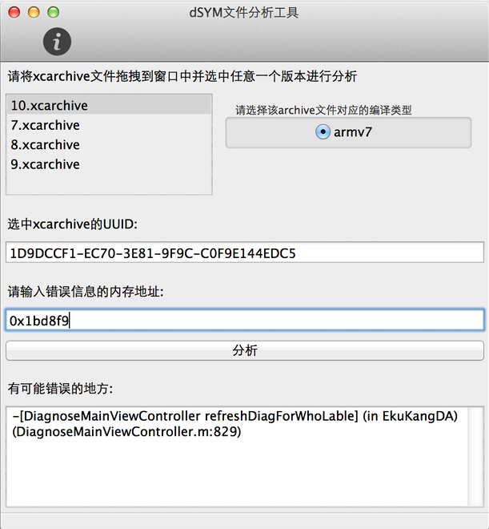

# 13.2 dSYMs文件解析


## dSYM符号集:


* 符号集是我们每次Archive一个包之后，都会随之生成的.dSYM文件，这个文件必须使用Xcode进行打包才有（Debug模式默认是关闭的）。每次发布一个版本，我们都需要备份这个文件，以方便以后的调试。
* 符号集中存储着文件名、函数名、行号与内存地址的映射表，通过符号集分析崩溃的.Crash文件可以准确知道具体的崩溃信息。
* 我们如果不使用.dSYM文件获取到的崩溃信息都是不完全的（官方文档说了会导致不完全符号化，也就是一部分符号化好了，一部分没有）。
* 每一个.dSYM文件都有一个UUID，和.app文件中的UUID对应，代表着是一个应用，而.dSYM文件中每一条崩溃信息也有一个单独的UUID，用来和程序的UUID进行校对。

## 符号集的生成与获取：

* 符号集在Organizer中选中打包的Archive->Show in Finder中选中Archive，右键显示包内容下的dSYMs文件夹下（或者点击Organizer右边的Download dSYM，XCode会从App Store下载该文件并插入到此Archive中）。
* 如果在Debug模式下，找到项目的Build Settings

>把Debug Infomatiion Format设置成DWARF with dSYM file
并把Generate Debug Symbols置为YES
然后编译，在项目文件夹Products中找到.app文件右击Show in Finder找到dSYM文件


## 校验文件

在符号化Crash文件之前，你需要准备好.crash和.dSYM并校验是否匹配


为什么要校验：

* 因为符号集存储着文件名、函数名、行号的信息，每一次代码更改后编译符号集也会随之变更，所以要想符号化.crash文件，.crash与符号集必须一一对应

* 也就是说由版本为1.0的代码生成了1.0的APP，同时生成了1.0的符号集，1.0的APP发生了Bug，生成了104115的crash文件，也只有1.0的符号集才能够符号化104115的crash文件，而同时也必须找到1.0的代码才能根据符号化的crash文件精确定位到bug产生的地方。

如何判断.crash、.dSYM与.app（是否匹配你的代码）是否匹配？

* 通过UUID来匹配，UUID是Xcode在编译时自动为每个版本生成的唯一标识，即使功能相同的可执行文件是使用相同的编译器设置从相同的源代码重建的，它也将具有不同的构建UUID，总之UUID是唯一的。

如何通过命令行获取UUID？

* 获取.crash的UUID

```
grep "'Your AppName' arm64" t.crash

```

* 获取.dSYM的UUID

```
dwarfdump --uuid 'Your AppName'.app.dSYM

```

* 获取.app的的UUID

```
dwarfdump --uuid 'Your AppName'.app/'Your AppName'

```


##  基础Crash分析

> 当APP发生闪退，手机内部会生成一个.Crash 或者.ips 文件，里面会包含崩溃时的信息，例如下

```
Last Exception Backtrace:
(0x18534a364 0x184590528 0x1852e2e9c 0x185217d0c 0x101134e1c 0x100fe8a24 0x184cc6a54 0x184cc6a14 0x184cd3698 0x1852f2544 0x1852f0120 0x18520fe58 0x1870bcf84 0x18e88f67c 0x1010b2650 0x184d2c56c)

Thread 0 name:  Dispatch queue: com.apple.main-thread
Thread 0 Crashed:
0   libsystem_kernel.dylib          0x0000000184e5c2e8 0x184e3a000 + 140008
1   libsystem_pthread.dylib         0x0000000184f712f8 0x184f6e000 + 13048
2   libsystem_c.dylib               0x0000000184dcafbc 0x184d68000 + 405436
3   libc++abi.dylib                 0x0000000184568068 0x184566000 + 8296
4   libc++abi.dylib                 0x0000000184580568 0x184566000 + 107880
5   libc++abi.dylib                 0x000000018457fea8 0x184566000 + 106152
6   libobjc.A.dylib                 0x000000018459065c 0x184588000 + 34396
7   CoreFoundation                  0x00000001852e2e9c 0x185204000 + 913052
8   CoreFoundation                  0x0000000185217d0c 0x185204000 + 81164
9   trend                           0x0000000101134e1c 0x100e34000 + 3149340
10  trend                           0x0000000100fe8a24 0x100e34000 + 1788452
11  libdispatch.dylib               0x0000000184cc6a54 0x184cc5000 + 6740
12  libdispatch.dylib               0x0000000184cc6a14 0x184cc5000 + 6676
13  libdispatch.dylib               0x0000000184cd3698 0x184cc5000 + 59032
14  CoreFoundation                  0x00000001852f2544 0x185204000 + 976196
15  CoreFoundation                  0x00000001852f0120 0x185204000 + 966944
16  CoreFoundation                  0x000000018520fe58 0x185204000 + 48728
17  GraphicsServices                0x00000001870bcf84 0x1870b2000 + 44932
18  UIKit                           0x000000018e88f67c 0x18e81c000 + 472700
19  trend                           0x00000001010b2650 0x100e34000 + 2614864
20  libdyld.dylib                   0x0000000184d2c56c 0x184d2b000 + 5484

```

这些信息我们看不懂，需要将其符号化。


### 崩溃日志符号化

* 第一步：在我们上传APPStore 并且审核通过后，我们需要将.IPA文件、.xcarchive 都保存起来，方便线上崩溃日志分析。

* 第二步：右键 .xcarchive ，显示包内容。如下图


* 第三步：桌面新建一个文件夹Crash,将上图中的 trend.app.dSYM 文件复制到Crash文件夹中，同时将崩溃日志 trend-2018-01-04-211936.crash也复制到文件夹中

* 第四步：将symbolicatecrash工具copy到Crash文件夹，这个文件到 这个路径找

```
find /Applications/Xcode.app -name symbolicatecrash -type f

```

```
/Applications/Xcode.app/Contents/Developer/Platforms/iPhoneOS.platform/Developer/Library/PrivateFrameworks/DTDeviceKit.framework/Versions/A/Resources

```

* 第五步 终于可以符号化了，具体如下，根据你的路径修改一下就OK了

```
zxs:~ yixue$ cd /Users/yixuePXh/Desktop/crash 
zxs:crash yixue$ ./symbolicatecrash /Users/yixuePXh/Desktop/crash/trend-2018-01-04-211936.crash  /Users/yixuePXh/Desktop/crash/trend.app.dSYM  > log.crash
Error: "DEVELOPER_DIR" is not defined at ./symbolicatecrash line 69.
zxs:crash yixue$ export DEVELOPER_DIR="/Applications/XCode.app/Contents/Developer"
zxs:crash yixue$ ./symbolicatecrash /Users/yixuePXh/Desktop/crash/trend-2018-01-04-211936.crash  /Users/yixuePXh/Desktop/crash/trend.app.dSYM  > log.crash

```
这个时候看log.crash文件

```
last Exception Backtrace:
0   CoreFoundation                  0x18534a364 __exceptionPreprocess + 124
1   libobjc.A.dylib                 0x184590528 objc_exception_throw + 56
2   CoreFoundation                  0x1852e2e9c _CFThrowFormattedException + 112
3   CoreFoundation                  0x185217d0c -[__NSDictionaryM setObject:forKey:] + 932
4   trend                           0x101134e1c -[YXAPIClient actionLogWithParameter:detailedID:M6_stock_id:] (YXAPIClient.m:1075)
5   trend                           0x100fe8a24 __59-[YXProductH5ViewController yxfindDayTypeKline:index:type:]_block_invoke (YXProductH5ViewController.m:372)
6   libdispatch.dylib               0x184cc6a54 _dispatch_call_block_and_release + 24
7   libdispatch.dylib               0x184cc6a14 _dispatch_client_callout + 16
8   libdispatch.dylib               0x184cd3698 _dispatch_main_queue_callback_4CF$VARIANT$mp + 1016
9   CoreFoundation                  0x1852f2544 __CFRUNLOOP_IS_SERVICING_THE_MAIN_DISPATCH_QUEUE__ + 12
10  CoreFoundation                  0x1852f0120 __CFRunLoopRun + 2012
11  CoreFoundation                  0x18520fe58 CFRunLoopRunSpecific + 436
12  GraphicsServices                0x1870bcf84 GSEventRunModal + 100
13  UIKit                           0x18e88f67c UIApplicationMain + 236
14  trend                           0x1010b2650 main (main.m:14)
15  libdyld.dylib                   0x184d2c56c start + 4


Thread 0 name:  Dispatch queue: com.apple.main-thread
Thread 0 Crashed:
0   libsystem_kernel.dylib          0x0000000184e5c2e8 __pthread_kill + 8
1   libsystem_pthread.dylib         0x0000000184f712f8 pthread_kill$VARIANT$mp + 396
2   libsystem_c.dylib               0x0000000184dcafbc abort + 140
3   libc++abi.dylib                 0x0000000184568068 __cxa_bad_cast + 0
4   libc++abi.dylib                 0x0000000184580568 std::__terminate(void (*)()) + 44
5   libc++abi.dylib                 0x000000018457fea8 __cxxabiv1::exception_cleanup_func(_Unwind_Reason_Code, _Unwind_Exception*) + 0
6   libobjc.A.dylib                 0x000000018459065c _objc_exception_destructor(void*) + 0
7   CoreFoundation                  0x00000001852e2e9c _CFArgv + 0
8   CoreFoundation                  0x0000000185217d0c -[__NSDictionaryM setObject:forKey:] + 932
9   trend                           0x0000000101134e1c -[YXAPIClient actionLogWithParameter:detailedID:M6_stock_id:] (YXAPIClient.m:1076)
10  trend                           0x0000000100fe8a24 __59-[YXProductH5ViewController yxfindDayTypeKline:index:type:]_block_invoke (YXProductH5ViewController.m:372)
11  libdispatch.dylib               0x0000000184cc6a54 _dispatch_call_block_and_release + 24
12  libdispatch.dylib               0x0000000184cc6a14 _dispatch_client_callout + 16
13  libdispatch.dylib               0x0000000184cd3698 _dispatch_main_queue_callback_4CF$VARIANT$mp + 1016

```

这个文件我们都看的懂，发现崩溃到 -[__NSDictionaryM setObject:forKey:]这个地方。


## appstore 崩溃日志分析


* 第一步：打开XCode ，点击 window ->Organizer 如下图


* 第二步，点击任意一个崩溃，例如第三行 ``UIKit:-(UIView(interbal) _addSubView..........``


* 第三步，点击图右边 Open in Project，然后选择当时上传APPStore的那个tag分支（不会变）中的``.xcodeproj`` 或者 ``. xcworkspace``，定位到崩溃处的代码。


## dSYMTool

[dSYMTool] (https://github.com/answer-huang/dSYMTools)   以及第三方工具

使用步骤:

1. 将打包发布软件时的xcarchive文件拖入软件窗口内的任意位置(支持多个文件同时拖入，注意：文件名不要包含空格)

2. 选中任意一个版本的xcarchive文件，右边会列出该xcarchive文件支持的CPU类型，选中错误对应的CPU类型。

3. 对比错误给出的UUID和工具界面中给出的UUID是否一致。

4. 将错误地址输入工具的文本框中，点击分析。




##  根据 crash 崩溃 报告的内存地址定位到代码位置

准备条件

* 首先要有崩溃的app上传时候的打包文件，也就是 .xcarchive文件。

* 友盟等统计错误分析错误趋势


步骤


*  ``.xcarchive``文件.  点击Xcode右上角的Organizer，然后点击Organizer上面的Archives,就可以看到下面有个列表，列出的都是打包的文件，其中一个就是你打包时候留下的，找到它。找到后点击右键显示包内容
 
 


* 看到dSYMs文件和Products文件夹 。先打开dSYMs文件夹，看到yourapp.app.dSYM文件，为了方便，把它复制到桌面。然后回去打开Products文件夹看到Applications文件夹，打开之，然后看到了你的app,同样把他复制到桌面。到这里准备工作完成


* 对着复制到桌面的yourapp.app.dSYM文件右键，显示包内容，然后是Contents文件夹，进入有Resources文件夹，打开后有DWARF，然后打开终端（在实用工具里）用cd命令打开DWARF文件夹 回车


* 打开友盟统计错误分析错误趋势   查看 ``Base Address ``


* 然后输入xcrun atos -arch arm64 -o Huayingdai 0x0000000100048000

	* 红色部分根据打包编译情况可以是 armv6,armv7,armv7s,arm64即:CPU Type
	
	* Huayingdai是你的app名字,即:``Binary Image``
	
	* 0x0000000100048000是crash的内存地址,即:``Base Address``


注意：

命令atos中输入的解析地址要求是构建的内存地址（built address）（因为这个地址是要对应于dSYM文件的，而dSYM文件是在构建产生的），而获取并上传的函数调用栈的地址是程序在运行时的内存地址，称之为实际加载地址。


## 内存地址

* 内存地址的解析， 是指从 ``内存地址`` 到 ``符号``。 内存地址是指程序运行时的内存地址（区别于程序编译之后的内存地址）

* 符号是指人类可读的代码信息，一般包括``文件名``、``类型``、``函数名``、``行数``。


[苹果开发者文档(Technical Note TN2123)](https://developer.apple.com/library/archive/technotes/tn2004/tn2123.html)指出，需要区分两个加载地址（``load address``）：``实际加载地址`` ``期望加载地址``

1. ``实际加载地址 (actual load address)``是指程序运行时的地址。每次程序装载(load)都可能不同。

2. ``期望加载地址 (intented load address)``是指编译之后指定的加载地址。

``偏移量 = 实际加载地址 - 期望加载地址``

``slide = acutal load address - intended load addrss``

### 获取load address,slide

* 加载地址(load address)

如果能够获取有系统的CrashReporter产生的完成的崩溃日志文件(.crash文件)，则从其中的Binary Images部分获取当前程序的``**实际加载地址(acutal load address)**``
举例如下：

```

Binary Images:
0x100028000 - 0x100c53fff TouchPalDialer arm64  <a197140a05563a0c983ef71bb8a83e1b> /var/mobile/Containers/Bundle/Application/C5B024A9-A8CC-4F1D-8613-99376B830C3E/TouchPalDialer.app/TouchPalDialer
0x1200c0000 - 0x1200e7fff dyld arm64  <36eff49275c23d2d815e48af33eea471> /usr/lib/dyld
0x182e60000 - 0x182e7dfff libJapaneseConverter.dylib arm64  <39642fdaade73029adb01e10922d2ba3> /System/Library/CoreServices/Encodings/libJapaneseConverter.dylib
```

* 偏移量(slide) 
调用底层C的API获取，``_dyld_get_image_vmaddr_slide(uint32_t image_index)``
举例如下：

```
+ (long) getImageSlide {
    long slide = -1;
    for (uint32_t i = 0; i < _dyld_image_count(); i++) {
        if (_dyld_get_image_header(i)->filetype == MH_EXECUTE) {
            slide = _dyld_get_image_vmaddr_slide(i);
            break;
        }
    }
    return slide;
}
```


## crash 产生源头


[了解和分析iOS Crash Report](https://www.jianshu.com/p/8a46e78a450b)


[漫谈iOS Crash收集框架](http://www.cocoachina.com/ios/20150701/12301.html)


[手把手教你查看和分析iOS的crash崩溃异常](http://www.cocoachina.com/ios/20180828/24713.html)


[iOS App 后台 Crash 调查](http://www.cocoachina.com/ios/20180814/24554.html)


[iOS监控-启动crash](http://www.cocoachina.com/ios/20180514/23365.html)


