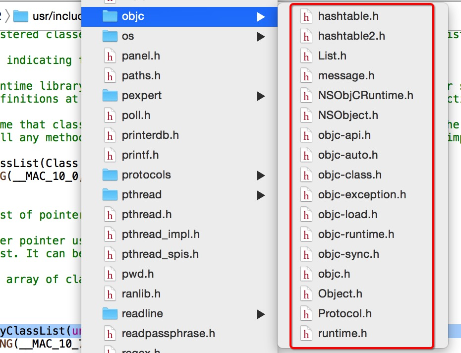
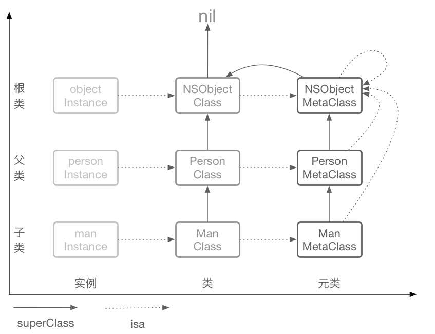
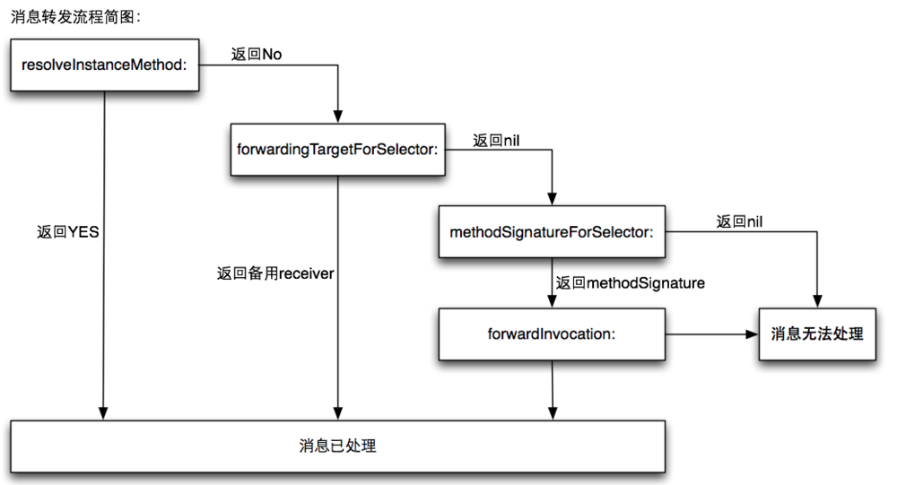

# 14.1 RunTime解析

Runtime其实有两个版本: “modern” 和 “legacy”。我们现在用的 Objective-C 2.0 采用的是现行 (Modern) 版的 Runtime 系统，只能运行在 iOS 和 macOS 10.5 之后的 64 位程序中。而 macOS 较老的32位程序仍采用 Objective-C 1 中的（早期）Legacy 版本的 Runtime 系统。这两个版本最大的区别在于当你更改一个类的实例变量的布局时，在早期版本中你需要重新编译它的子类，而现行版就不需要。

Runtime 基本是用 C 和汇编写的，可见苹果为了动态系统的高效而作出的努力。你可以在[这里](https://opensource.apple.com/source/objc4/)下到苹果维护的开源代码。苹果和GNU各自维护一个开源的 [runtime](https://github.com/RetVal/objc-runtime) 版本，这两个版本之间都在努力的保持一致。

高级编程语言想要成为可执行文件需要先编译为汇编语言再汇编为机器语言，机器语言也是计算机能够识别的唯一语言，但是OC并不能直接编译为汇编语言，而是要先转写为纯C语言再进行编译和汇编的操作，从OC到C语言的过渡就是由runtime来实现的。然而我们使用OC进行面向对象开发，而C语言更多的是面向过程开发，这就需要将面向对象的类转变为面向过程的结构体。

平时的业务中主要是使用官方[Api](https://developer.apple.com/documentation/objectivec/objective-c_runtime#//apple_ref/doc/uid/TP40001418-CH1g-126286)，解决我们框架性的需求。


### Runtime 作用
Objc 在三种层面上与 Runtime 系统进行交互：

1. 通过 Objective-C 源代码
2. 通过 Foundation 框架的 NSObject 类定义的方法
3. 通过对 Runtime 库函数的直接调用


### Objective-C 源代码

多数情况我们只需要编写 OC 代码即可，Runtime 系统自动在幕后搞定一切，还记得简介中如果我们调用方法，编译器会将 OC 代码转换成运行时代码，在运行时确定数据结构和函数。


### 通过 Foundation 框架的 NSObject 类定义的方法

Cocoa 程序中绝大部分类都是 NSObject 类的子类，所以都继承了 NSObject 的行为。(NSProxy 类时个例外，它是个抽象超类)

一些情况下，NSObject 类仅仅定义了完成某件事情的模板，并没有提供所需要的代码。例如 -description 方法，该方法返回类内容的字符串表示，该方法主要用来调试程序。NSObject 类并不知道子类的内容，所以它只是返回类的名字和对象的地址，NSObject 的子类可以重新实现。

还有一些 NSObject 的方法可以从 Runtime 系统中获取信息，允许对象进行自我检查。例如：

* -class方法返回对象的类；
* -isKindOfClass: 和 -isMemberOfClass: 方法检查对象是否存
* 于指定的类的继承体系中(是否是其子类或者父类或者当前类的成员变量)；
* -respondsToSelector: 检查对象能否响应指定的消息；
* -conformsToProtocol:检查对象是否实现了指定协议类的方法；
* -methodForSelector: 返回指定方法实现的地址。

### 通过对 Runtime 库函数的直接调用

Runtime 系统是具有公共接口的动态共享库。头文件存放于/usr/include/objc目录下，这意味着我们使用时只需要引入objc/Runtime.h头文件即可。



许多函数可以让你使用纯 C 代码来实现 Objc 中同样的功能。除非是写一些 Objc 与其他语言的桥接或是底层的 debug 工作，你在写 Objc 代码时一般不会用到这些 C 语言函数。对于公共接口都有哪些，后面会讲到。我将会参考苹果官方的 API 文档。


## Runtime 的术语的数据结构

要想全面了解 Runtime 机制，我们必须先了解 Runtime 的一些术语，他们都对应着数据结构。

#### SEL   -- objc_selector

```
Objc.h
/// An opaque type that represents a method selector.代表一个方法的不透明类型
typedef struct objc_selector *SEL;

```

```objc_msgSend```函数第二个参数类型为SEL，它是```selector```在```Objective-C```中的表示类型（Swift中是Selector类）。```selector```是方法选择器，可以理解为区分方法的 ID，而这个 ```ID``` 的数据结构是```SEL```:

```
@property SEL selector;

```

可以看到```selector```是```SEL```的一个实例。

```

A method selector is a C string that has been registered (or “mapped“) with the Objective-C runtime. Selectors generated by the compiler are automatically mapped by the runtime when the class is loaded.


```

其实```selector```就是个映射到方法的C字符串，你可以用 Objective-C 编译器命令```@selector()```或者 Runtime 系统的```sel_registerName```函数来获得一个 ```SEL`` 类型的方法选择器。


```selector``` 既然是一个 ```string``` ，我觉得应该是类似 ```className+method```的组合，命名规则有两条：

* 同一个类，selector不能重复
* 不同的类，selector可以重复

这也带来了一个弊端，我们在写C代码的时候，经常会用到函数重载，就是函数名相同，参数不同，但是这在Objective-C中是行不通的，因为selector只记了method的 ```name``` ，没有参数，所以没法区分不同的 ```method ```。

比如：

```
- (void)caculate(NSInteger)num;
- (void)caculate(CGFloat)num;

```

是会报错的。

我们只能通过命名来区别：

```
- (void)caculateWithInt(NSInteger)num;
- (void)caculateWithFloat(CGFloat)num;

```

在不同类中相同名字的方法所对应的方法选择器是相同的，即使方法名字相同而变量类型不同也会导致它们具有相同的方法选择器。


#### id


#### 类对象(objc_class)

``Objective-C``类是由``Class``类型来表示的，它实际上是一个指向``objc_class``结构体的指针。

```
typedef struct objc_class *Class;

```

查看``objc/runtime.h``中``objc_class``结构体的定义如下：


```
struct objc_class {
    Class _Nonnull isa  OBJC_ISA_AVAILABILITY;

#if !__OBJC2__
    Class _Nullable super_class                              OBJC2_UNAVAILABLE;
    const char * _Nonnull name                               OBJC2_UNAVAILABLE;
    long version                                             OBJC2_UNAVAILABLE;
    long info                                                OBJC2_UNAVAILABLE;
    long instance_size                                       OBJC2_UNAVAILABLE;
    struct objc_ivar_list * _Nullable ivars                  OBJC2_UNAVAILABLE;
    struct objc_method_list * _Nullable * _Nullable methodLists                    OBJC2_UNAVAILABLE;
    struct objc_cache * _Nonnull cache                       OBJC2_UNAVAILABLE;
    struct objc_protocol_list * _Nullable protocols          OBJC2_UNAVAILABLE;
#endif

} OBJC2_UNAVAILABLE;


```


``struct objc_class``结构体定义了很多变量，通过命名不难发现

* 结构体里保存了指向父类的指针、类的名字、版本、实例大小、实例变量列表、方法列表、缓存、遵守的协议列表等，
* 一个类包含的信息也不就正是这些吗？没错，类对象就是一个结构体``struct objc_class``，这个结构体存放的数据称为元数据(``metadata``)
* 该结构体的第一个成员变量也是isa指针，这就说明了Class本身其实也是一个对象，因此我们称之为类对象，类对象在编译期产生用于创建实例对象，是单例。


#### 实例(objc_object)

```
/// Represents an instance of a class.
struct objc_object {
    Class isa  OBJC_ISA_AVAILABILITY;
};

/// A pointer to an instance of a class.
typedef struct objc_object *id;

```

类对象中的元数据存储的都是如何创建一个实例的相关信息，那么类对象和类方法应该从哪里创建呢？
就是从isa指针指向的结构体创建，类对象的``isa``指针指向的我们称之为元类(``metaclass``)，
元类中保存了创建类对象以及类方法所需的所有信息，因此整个结构应该如下图所示:




#### 元类(Meta Class)

通过上图我们可以看出整个体系构成了一个自闭环，``struct objc_object``结构体实例它的isa指针指向类对象，
类对象的``isa``指针指向了元类，``super_class``指针指向了父类的类对象，
而元类的``super_class``指针指向了父类的元类，那元类的isa指针又指向了自己。

元类``(Meta Class)``是一个类对象的类。
在上面我们提到，所有的类自身也是一个对象，我们可以向这个对象发送消息(即调用类方法)。
为了调用类方法，这个类的isa指针必须指向一个包含这些类方法的一个``objc_class``结构体。这就引出了``meta-class``的概念，元类中保存了创建类对象以及类方法所需的所有信息。
任何``NSObject``继承体系下的``meta-class``都使用``NSObject``的``meta-class``作为自己的所属类，而基类的``meta-class``的``isa``指针是指向它自己。


#### Method(objc_method)

```	
	runtime.h
	/// An opaque type that represents a method in a class definition.代表类定义中一个方法的不透明类型
	typedef struct objc_method *Method;
	struct objc_method {
	    SEL method_name                                          OBJC2_UNAVAILABLE;
	    char *method_types                                       OBJC2_UNAVAILABLE;
	    IMP method_imp                                           OBJC2_UNAVAILABLE;
	}
```
	
Method和我们平时理解的函数是一致的，就是表示能够独立完成一个功能的一段代码，比如：

```
	- (void)logName
	{
	    NSLog(@"name");
	}

```	

我们来看下objc_method这个结构体的内容：

* SEL method_name 方法名
* char *method_types 方法类型
* IMP method_imp 方法实现

在这个结构体重，我们已经看到了SEL和IMP，说明SEL和IMP其实都是Method的属性。
	
	


#### IMP


```

/// A pointer to the function of a method implementation.  指向一个方法实现的指针
typedef id (*IMP)(id, SEL, ...); 
#endif

```

就是指向最终实现程序的内存地址的指针。

在iOS的``Runtime``中，``Method``通过``selector``和``IMP``两个属性，实现了快速查询方法及实现，相对提高了性能，又保持了灵活性。


#### 类缓存(objc_cache)

当Objective-C运行时通过跟踪它的``isa``指针检查对象时，它可以找到一个实现许多方法的对象。然而，你可能只调用它们的一小部分，并且每次查找时，搜索所有选择器的类分派表没有意义。所以类实现一个缓存，每当你搜索一个类分派表，并找到相应的选择器，它把它放入它的缓存。所以当``objc_msgSend``查找一个类的选择器，它首先搜索类缓存。这是基于这样的理论：如果你在类上调用一个消息，你可能以后再次调用该消息。

为了加速消息分发， 系统会对方法和对应的地址进行缓存，就放在上述的``objc_cache``，所以在实际运行中，大部分常用的方法都是会被缓存起来的，``Runtime``系统实际上非常快，接近直接执行内存地址的程序速度。


#### Category(objc_category)

``Category``是表示一个指向分类的结构体的指针，其定义如下：

```

struct category_t { 
    const char *name; 
    classref_t cls; 
    struct method_list_t *instanceMethods; 
    struct method_list_t *classMethods;
    struct protocol_list_t *protocols;
    struct property_list_t *instanceProperties;
};

```

```
name：是指 class_name 而不是 category_name。
cls：要扩展的类对象，编译期间是不会定义的，而是在Runtime阶段通过name对 应到对应的类对象。
instanceMethods：category中所有给类添加的实例方法的列表。
classMethods：category中所有添加的类方法的列表。
protocols：category实现的所有协议的列表。
instanceProperties：表示Category里所有的properties，这就是我们可以通过objc_setAssociatedObject和objc_getAssociatedObject增加实例变量的原因，不过这个和一般的实例变量是不一样的。


```


#### Ivar

Ivar 是表示成员变量的类型。

```

typedef struct objc_ivar *Ivar;

struct objc_ivar {
    char *ivar_name                                          OBJC2_UNAVAILABLE;
    char *ivar_type                                          OBJC2_UNAVAILABLE;
    int ivar_offset                                          OBJC2_UNAVAILABLE;
	#ifdef __LP64__
	    int space                                             OBJC2_UNAVAILABLE;
	#endif
}


```

其中 ivar_offset 是基地址偏移字节


#### Property

```
typedef struct objc_property *Property;
typedef struct objc_property *objc_property_t;//这个更常用
```
可以通过class_copyPropertyList 和 protocol_copyPropertyList 方法获取类和协议中的属性：

```
objc_property_t *class_copyPropertyList(Class cls, unsigned int *outCount)
objc_property_t *protocol_copyPropertyList(Protocol *proto, unsigned int *outCount)
```

* 返回的是属性列表，列表中每个元素都是一个 objc_property_t 指针


## Runtime消息传递


> 一个对象的方法像这样[obj foo]，编译器转成消息发送objc_msgSend(obj, foo)，Runtime时执行的流程是这样的：
> 
* 首先，通过obj的isa指针找到它的 class ;
* 在 class 的 method list 找 foo ;
* 如果 class 中没到 foo，继续往它的 superclass 中找 ;
* 一旦找到 foo 这个函数，就去执行它的实现IMP 。


但这种实现有个问题，效率低。但一个``class`` 往往只有 20% 的函数会被经常调用，可能占总调用次数的 80% 。每个消息都需要遍历一次``objc_method_list`` 并不合理。如果把经常被调用的函数缓存下来，那可以大大提高函数查询的效率。这也就是``objc_class`` 中另一个重要成员``objc_cache`` 做的事情 - 再找到``foo ``之后，把foo 的``method_name`` 作为``key`` ，``method_imp``作为``value`` 给存起来。当再次收到``foo ``消息的时候，可以直接在cache 里找到，避免去遍历``objc_method_list``。从前面的源代码可以看到``objc_cache``是存在``objc_class`` 结构体中的。


##### objec_msgSend的方法定义如下：

```
OBJC_EXPORT id objc_msgSend(id self, SEL op, ...)

```

那消息传递是怎么实现的呢？我们看看对象``object``，类``class``，方法``method``这几个的结构体：

```
//对象
struct objc_object {
    Class isa  OBJC_ISA_AVAILABILITY;
};
//类
struct objc_class {
    Class isa  OBJC_ISA_AVAILABILITY;
#if !__OBJC2__
    Class super_class                                        OBJC2_UNAVAILABLE;
    const char *name                                         OBJC2_UNAVAILABLE;
    long version                                             OBJC2_UNAVAILABLE;
    long info                                                OBJC2_UNAVAILABLE;
    long instance_size                                       OBJC2_UNAVAILABLE;
    struct objc_ivar_list *ivars                             OBJC2_UNAVAILABLE;
    struct objc_method_list **methodLists                    OBJC2_UNAVAILABLE;
    struct objc_cache *cache                                 OBJC2_UNAVAILABLE;
    struct objc_protocol_list *protocols                     OBJC2_UNAVAILABLE;
#endif
} OBJC2_UNAVAILABLE;
//方法列表
struct objc_method_list {
    struct objc_method_list *obsolete                        OBJC2_UNAVAILABLE;
    int method_count                                         OBJC2_UNAVAILABLE;
#ifdef __LP64__
    int space                                                OBJC2_UNAVAILABLE;
#endif
    /* variable length structure */
    struct objc_method method_list[1]                        OBJC2_UNAVAILABLE;
}                                                            OBJC2_UNAVAILABLE;
//方法
struct objc_method {
    SEL method_name                                          OBJC2_UNAVAILABLE;
    char *method_types                                       OBJC2_UNAVAILABLE;
    IMP method_imp                                           OBJC2_UNAVAILABLE;
}


```

1. 系统首先找到消息的接收对象，然后通过对象的isa找到它的类。
2. 在它的类中查找method_list，是否有selector方法。
3. 没有则查找父类的method_list。
4. 找到对应的method，执行它的IMP。
5. 转发IMP的return值。


## Runtime消息转发

前文介绍了进行一次发送消息会在相关的类对象中搜索方法列表，如果找不到则会沿着继承树向上一直搜索知道继承树根部（通常为NSObject），如果还是找不到并且消息转发都失败了就回执行doesNotRecognizeSelector:方法报unrecognized selector错。那么消息转发到底是什么呢？接下来将会逐一介绍最后的三次机会。

* 动态方法解析
* 备用接收者
* 完整消息转发




动态方法解析


首先，Objective-C运行时会调用 ``+resolveInstanceMethod:``或者 ``+resolveClassMethod:``，让你有机会提供一个函数实现。如果你添加了函数并返回YES， 那运行时系统就会重新启动一次消息发送的过程。


```
- (void)viewDidLoad {
    [super viewDidLoad];
    // Do any additional setup after loading the view, typically from a nib.
    //执行foo函数
    [self performSelector:@selector(foo:)];
}

+ (BOOL)resolveInstanceMethod:(SEL)sel {
    if (sel == @selector(foo:)) {//如果是执行foo函数，就动态解析，指定新的IMP
        class_addMethod([self class], sel, (IMP)fooMethod, "v@:");
        return YES;
    }
    return [super resolveInstanceMethod:sel];
}

void fooMethod(id obj, SEL _cmd) {
    NSLog(@"Doing foo");//新的foo函数
}

打印结果:2018-04-01 12:23:35.952670+0800 ocram[87546:23235469] Doing foo

```


可以看到虽然没有实现``foo:``这个函数，但是我们通过``class_addMethod``动态添加``fooMethod``函数，并执行``fooMethod``这个函数的IMP。从打印结果看，成功实现了。

如果``resolve``方法返回 ``NO`` ，运行时就会移到下一步：``forwardingTargetForSelector``。


备用接收者

如果目标对象实现了``-forwardingTargetForSelector:``，``Runtime`` 这时就会调用这个方法，给你把这个消息转发给其他对象的机会。

```
#import "ViewController.h"
#import "objc/runtime.h"

@interface Person: NSObject

@end

@implementation Person

- (void)foo {
    NSLog(@"Doing foo");//Person的foo函数
}

@end

@interface ViewController ()

@end

@implementation ViewController

- (void)viewDidLoad {
    [super viewDidLoad];
    // Do any additional setup after loading the view, typically from a nib.
    //执行foo函数
    [self performSelector:@selector(foo)];
}

+ (BOOL)resolveInstanceMethod:(SEL)sel {
    return YES;//返回YES，进入下一步转发
}

- (id)forwardingTargetForSelector:(SEL)aSelector {
    if (aSelector == @selector(foo)) {
        return [Person new];//返回Person对象，让Person对象接收这个消息
    }
    
    return [super forwardingTargetForSelector:aSelector];
}

@end

打印结果：2018-04-01 12:45:04.757929+0800 ocram[88023:23260346] Doing foo

```

可以看到我们通过``forwardingTargetForSelector``把当前``ViewController``的方法转发给了``Person``去执行了。打印结果也证明我们成功实现了转发。

### 完整消息转发

如果在上一步还不能处理未知消息，则唯一能做的就是启用完整的消息转发机制了。
首先它会发送``-methodSignatureForSelector:``消息获得函数的参数和返回值类型。如果``-methodSignatureForSelector:``返回``nil`` ，Runtime则会发出 ``-doesNotRecognizeSelector: ``消息，程序这时也就挂掉了。如果返回了一个函数签名，Runtime就会创建一个``NSInvocation`` 对象并发送 ``-forwardInvocation:``消息给目标对象。


实现一个完整转发的例子如下：

```

#import "ViewController.h"
#import "objc/runtime.h"

@interface Person: NSObject

@end

@implementation Person

- (void)foo {
    NSLog(@"Doing foo");//Person的foo函数
}

@end

@interface ViewController ()

@end

@implementation ViewController

- (void)viewDidLoad {
    [super viewDidLoad];
    // Do any additional setup after loading the view, typically from a nib.
    //执行foo函数
    [self performSelector:@selector(foo)];
}

+ (BOOL)resolveInstanceMethod:(SEL)sel {
    return YES;//返回YES，进入下一步转发
}

- (id)forwardingTargetForSelector:(SEL)aSelector {
    return nil;//返回nil，进入下一步转发
}

- (NSMethodSignature *)methodSignatureForSelector:(SEL)aSelector {
    if ([NSStringFromSelector(aSelector) isEqualToString:@"foo"]) {
        return [NSMethodSignature signatureWithObjCTypes:"v@:"];//签名，进入forwardInvocation
    }
    
    return [super methodSignatureForSelector:aSelector];
}

- (void)forwardInvocation:(NSInvocation *)anInvocation {
    SEL sel = anInvocation.selector;

    Person *p = [Person new];
    if([p respondsToSelector:sel]) {
        [anInvocation invokeWithTarget:p];
    }
    else {
        [self doesNotRecognizeSelector:sel];
    }

}

@end


打印结果：2018-04-01 13:00:45.423385+0800 ocram[88353:23279961] Doing foo

```


从打印结果来看，我们实现了完整的转发。通过签名，Runtime生成了一个对象``anInvocation``，发送给了``forwardInvocation``，我们在``forwardInvocation``方法里面让Person对象去执行了foo函数。签名参数v@:怎么解释呢，这里苹果文档Type Encodings有详细的解释。


