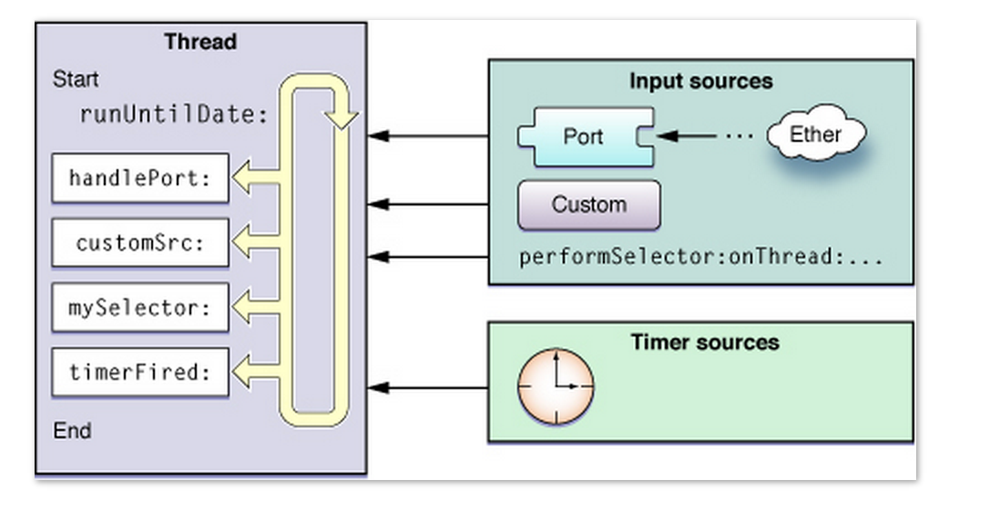

# 15.1 RunLoop解析

##RunLoop的定义

当有持续的异步任务需求时，我们会创建一个独立的生命周期可控的线程。RunLoop就是控制线程生命周期并接收事件进行处理的机制。

RunLoop是iOS事件响应与任务处理最核心的机制，它贯穿iOS整个系统。

* Foundation: NSRunLoop   
 * NSRunLoop 是基于 CFRunLoopRef 的封装，提供了面向对象的 API，但是这些 API 不是线程安全的。
* Core Foundation: CFRunLoop 核心部分，代码开源，C 语言编写，跨平台
 * CFRunLoopRef 是在 CoreFoundation 框架内的，它提供了纯 C 函数的 API，所有这些 API 都是线程安全的。

一般来讲，一个线程一次只能执行一个任务，执行完成后线程就会退出。如果我们需要一个机制，让线程能随时处理事件但并不退出，通常的代码逻辑是这样的：

```
	function loop() {
	    initialize();
	    do {
	        var message = get_next_message();
	        process_message(message);
	    } while (message != quit);
	}

```


* mach kernel属于苹果内核，RunLoop依靠它实现了休眠和唤醒而避免了CPU的空转。


* Runloop是基于pthread进行管理的，pthread是基于c的跨平台多线程操作底层API。它是mach thread的上层封装（可以参见Kernel Programming Guide），和NSThread一一对应（而NSThread是一套面向对象的API，所以在iOS开发中我们也几乎不用直接使用pthread）。


EventLoop模型本质上就是这样一运行循环 。 Event Loop 在很多系统和框架里都有实现，比如 Node.js 的事件处理，比如 Windows 程序的消息循环，再比如 OSX/iOS 里的 RunLoop。实现这种模型的关键点在于：如何管理事件/消息，如何让线程在没有处理消息时休眠以避免资源占用、在有消息到来时立刻被唤醒。所以，RunLoop 实际上就是一个对象，这个对象管理了其需要处理的事件和消息，并提供了一个入口函数来执行上面 Event Loop 的逻辑。线程执行了这个函数后，就会一直处于这个函数内部 “接受消息->等待->处理” 的循环中，直到这个循环结束（比如传入 quit 的消息），函数返回。


##基本作用
通过RunLoop机制实现省电，流畅，响应速度快，用户体验好

* 保持程序持续运行，程序一启动就会开一个主线程，主线程一开起来就会跑一个主线程对应的RunLoop,RunLoop保证主线程不会被销毁，也就保证了程序的持续运行
* 处理App中的各种事件（比如：触摸事件，定时器事件，Selector事件等）
* 节省CPU资源，提高程序性能，程序运行起来时，当什么操作都没有做的时候，RunLoop就告诉CUP，现在没有事情做，我要去休息，这时CUP就会将其资源释放出来去做其他的事情，当有事情做的时候RunLoop就会立马起来去做事情


##理解

进程是一家工厂，线程是一个流水线，Run Loop就是流水线上的主管；当工厂接到商家的订单分配给这个流水线时，Run Loop就启动这个流水线，让流水线动起来，生产产品；当产品生产完毕时，Run Loop就会暂时停下流水线，节约资源。
RunLoop管理流水线，流水线才不会因为无所事事被工厂销毁；而不需要流水线时，就会辞退RunLoop这个主管，即退出线程，把所有资源释放。

RunLoop并不是iOS平台的专属概念，在任何平台的多线程编程中，为控制线程的生命周期，接收处理异步消息都需要类似RunLoop的循环机制实现，Android的Looper就是类似的机制。

##特性

主线程的RunLoop在应用启动的时候就会自动创建

* 其他线程则需要在该线程下自己启动
* 不能自己创建RunLoop
* RunLoop并不是线程安全的，所以需要避免在其他线程上调用当前线程的RunLoop
* RunLoop负责管理autorelease pools
* RunLoop负责处理消息事件，即输入源事件和计时器事件

## 工作中遇到的问题

* 1.基于NSTimer的轮播器什么情况下会被页面滚动暂停,怎样可以不被暂停,为什么?
* 2.延迟执行performSelecter相关方法是怎样被执行的?在子线程中也是一样的嘛?
* 3.事件响应和手势识别底层处理是一致的嘛,为什么?
* 4.界面刷新,setlayoutIfneed等,是在什么时候会真正执行刷新,为什么会刷新不及时?
* 5.项目程序运行中,总是伴随着多次自动释放池的创建和销毁,这些是在什么时候发生的呢?
* 6.Runloop和线程的关系？当我们在子线程上需要执行代理方法或者回调时,怎么确保当前线程没有被销毁?
* 7.timer 与 Runloop 的关系？
* 8.程序中添加每3秒响应一次的NSTimer，当拖动tableview时timer可能无法响应要怎么解决？
* 9.Runloop 是怎么响应用户操作的， 具体流程是什么样的？
* 10.RunLoop的几种状态？Runloop的mode作用是什么?RunLoop内部实现逻辑?


## RunLoop机制

主线程 (有 RunLoop 的线程) 几乎所有函数都从以下六个之一的函数调起:

####CFRUNLOOP_IS_CALLING_OUT_TO_AN_OBSERVER_CALLBACK_FUNCTION 
* CFRunloop is calling out to an abserver callback function
* 用于向外部报告 RunLoop 当前状态的更改，框架中很多机制都由 RunLoopObserver 触发，如 CAAnimation

####CFRUNLOOP_IS_CALLING_OUT_TO_A_BLOCK
* CFRunloop is calling out to a block
* 消息通知、非延迟的perform、dispatch调用、block回调、KVO

####CFRUNLOOP_IS_SERVICING_THE_MAIN_DISPATCH_QUEUE
* CFRunloop is servicing the main desipatch queue

####CFRUNLOOP_IS_CALLING_OUT_TO_A_TIMER_CALLBACK_FUNCTION
* CFRunloop is calling out to a timer callback function
* 延迟的perform, 延迟dispatch调用

####CFRUNLOOP_IS_CALLING_OUT_TO_A_SOURCE0_PERFORM_FUNCTION
* CFRunloop is calling out to a source 0 perform function
* 处理App内部事件、App自己负责管理（触发），如UIEvent、CFSocket。普通函数调用，系统调用

####CFRUNLOOP_IS_CALLING_OUT_TO_A_SOURCE1_PERFORM_FUNCTION
* CFRunloop is calling out to a source 1 perform function
* 由RunLoop和内核管理，Mach port驱动，如CFMachPort、CFMessagePort

## RunLoop 架构


## RunLoop 运行模型


* Runloop，顾名思义就是跑圈，他的本质就是一个do，while循环，当有事做时就做事，没事做时就休眠。至于怎么做事，怎么休眠,这个是由系统内核来调度的，我们后面会讲到。

* 每个线程都由一个Run Loop，主线程的Run Loop会在App运行的时自动运行，子线程需要手动获取运行，第一次获取时，才会去创建。

* 每个Run Loop都会以一个模式mode来运行，可以使用NSRunLoop的方法运行在某个特定的mode。

```
	- (BOOL)runMode:(NSString *)mode beforeDate:(NSDate *)limitDate;

```

* Run Loop的处理两大类事件源：Timer Source和Input Source(包括performSelector *方法簇、Port或者自定义的Input Source），每个事件源都会绑定在Run Loop的某个特定模式mode上，而且只有RunLoop在这个模式下运行的时候，才会触发Timer和Input Source。

* 最后，如果没有和人事件源添加到Run Loop上，Run Loop就会立刻exit


##RunLoop 对外的接口
####在 CoreFoundation 里面关于 RunLoop 有5个类:

* CFRunLoopRef
* CFRunLoopModeRef
* CFRunLoopSourceRef
* CFRunLoopTimerRef
* CFRunLoopObserverRef

##### 其中 CFRunLoopModeRef 类并没有对外暴露，只是通过 CFRunLoopRef 的接口进行了封装。他们的关系如下:


一个 RunLoop 包含若干个 Mode，每个 Mode 又包含若干个 Source/Timer/Observer。每次调用 RunLoop 的主函数时，只能指定其中一个 Mode，这个Mode被称作 CurrentMode。如果需要切换 Mode，只能退出 Loop，再重新指定一个 Mode 进入。这样做主要是为了分隔开不同组的 Source/Timer/Observer，让其互不影响。

####CFRunLoopSourceRef 是事件产生的地方。
Source有两个版本：Source0 和 Source1。

* Source0 只包含了一个回调（函数指针），它并不能主动触发事件。使用时，你需要先调用 CFRunLoopSourceSignal(source)，将这个 Source 标记为待处理，然后手动调用 CFRunLoopWakeUp(runloop) 来唤醒 RunLoop，让其处理这个事件。
* Source1 包含了一个 mach_port 和一个回调（函数指针），被用于通过内核和其他线程相互发送消息。这种 Source 能主动唤醒 RunLoop 的线程，其原理在下面会讲到。

####CFRunLoopTimerRef 是基于时间的触发器
* 它和 NSTimer 是toll-free bridged 的，可以混用。其包含一个时间长度和一个回调（函数指针）。当其加入到 RunLoop 时，RunLoop会注册对应的时间点，当时间点到时，RunLoop会被唤醒以执行那个回调。

####CFRunLoopObserverRef 是观察者
* 每个 Observer 都包含了一个回调（函数指针），当 RunLoop 的状态发生变化时，观察者就能通过回调接受到这个变化。可以观测的时间点有以下几个：

```
	typedef CF_OPTIONS(CFOptionFlags, CFRunLoopActivity) {
	    kCFRunLoopEntry         = (1UL << 0), // 即将进入Loop
	    kCFRunLoopBeforeTimers  = (1UL << 1), // 即将处理 Timer
	    kCFRunLoopBeforeSources = (1UL << 2), // 即将处理 Source
	    kCFRunLoopBeforeWaiting = (1UL << 5), // 即将进入休眠
	    kCFRunLoopAfterWaiting  = (1UL << 6), // 刚从休眠中唤醒
	    kCFRunLoopExit          = (1UL << 7), // 即将退出Loop
	};
	
```

* 上面的 Source/Timer/Observer 被统称为 mode item，一个 item 可以被同时加入多个 mode。但一个 item 被重复加入同一个 mode 时是不会有效果的。如果一个 mode 中一个 item 都没有，则 RunLoop 会直接退出，不进入循环。


## RunLoop 的 Mode

##### 通过[源码](https://opensource.apple.com/tarballs/CF/)我们找到__CFRunLoop结构体 CFRunLoopMode 和 CFRunLoop 的结构大致如下：

```
	struct __CFRunLoopMode {
	    CFStringRef _name;            // Mode Name, 例如 @"kCFRunLoopDefaultMode"
	    CFMutableSetRef _sources0;    // Set<CFRunLoopSourceRef>
	    CFMutableSetRef _sources1;    // Set<CFRunLoopSourceRef>
	    CFMutableArrayRef _observers; // Array<CFRunLoopObserverRef>
	    CFMutableArrayRef _timers;    // Array<CFRunLoopTimerRef>
	    ...
	};
	 
	struct __CFRunLoop {
	    CFRuntimeBase _base;
	    pthread_mutex_t _lock;          /* locked for accessing mode list */
	    __CFPort _wakeUpPort;           // used for CFRunLoopWakeUp 
	    Boolean _unused;
	    volatile _per_run_data *_perRunData;              // reset for runs of the run loop
	    pthread_t _pthread;
	    uint32_t _winthread;
	    CFMutableSetRef _commonModes;             // Set<CFStringRef>
	    CFMutableSetRef _commonModeItems;        // Set<Source/Observer/Timer>
	    CFRunLoopModeRef _currentMode;          // Current Runloop Mode
	    CFMutableSetRef _modes;                // Set<CFRunLoopModeRef>
	    struct _block_item *_blocks_head;
	    struct _block_item *_blocks_tail;
	    CFAbsoluteTime _runTime;
	    CFAbsoluteTime _sleepTime;
	    CFTypeRef _counterpart;
	};


```

这里有个概念叫 “CommonModes”：一个 Mode 可以将自己标记为”Common”属性（通过将其 ModeName 添加到 RunLoop 的 “commonModes” 中）。每当 RunLoop 的内容发生变化时，RunLoop 都会自动将 _commonModeItems 里的 Source/Observer/Timer 同步到具有 “Common” 标记的所有Mode里。

应用场景举例：主线程的 RunLoop 里有两个预置的 Mode：kCFRunLoopDefaultMode 和 UITrackingRunLoopMode。这两个 Mode 都已经被标记为”Common”属性。DefaultMode 是 App 平时所处的状态，TrackingRunLoopMode 是追踪 ScrollView 滑动时的状态。当你创建一个 Timer 并加到 DefaultMode 时，Timer 会得到重复回调，但此时滑动一个TableView时，RunLoop 会将 mode 切换为 TrackingRunLoopMode，这时 Timer 就不会被回调，并且也不会影响到滑动操作。

有时你需要一个 Timer，在两个 Mode 中都能得到回调，一种办法就是将这个 Timer 分别加入这两个 Mode。还有一种方式，就是将 Timer 加入到顶层的 RunLoop 的 “commonModeItems” 中。”commonModeItems” 被 RunLoop 自动更新到所有具有”Common”属性的 Mode 里去。


#### CFRunLoop对外暴露的管理 Mode 接口只有下面2个:

```
	CFRunLoopAddCommonMode(CFRunLoopRef runloop, CFStringRef modeName);
	CFRunLoopRunInMode(CFStringRef modeName, ...);

```

#### Mode 暴露的管理 mode item 的接口有下面几个：

```
	CFRunLoopAddSource(CFRunLoopRef rl, CFRunLoopSourceRef source, CFStringRef modeName);
	CFRunLoopAddObserver(CFRunLoopRef rl, CFRunLoopObserverRef observer, CFStringRef modeName);
	CFRunLoopAddTimer(CFRunLoopRef rl, CFRunLoopTimerRef timer, CFStringRef mode);
	CFRunLoopRemoveSource(CFRunLoopRef rl, CFRunLoopSourceRef source, CFStringRef modeName);
	CFRunLoopRemoveObserver(CFRunLoopRef rl, CFRunLoopObserverRef observer, CFStringRef modeName);
	CFRunLoopRemoveTimer(CFRunLoopRef rl, CFRunLoopTimerRef timer, CFStringRef mode);

```

* 创建与退出：mode切换和item依赖

```
	a 主线程的runloop自动创建，子线程的runloop默认不创建（在子线程中调用NSRunLoop *runloop = [NSRunLoop currentRunLoop];
	获取RunLoop对象的时候，就会创建RunLoop）；
	
	b runloop退出的条件：app退出；线程关闭；设置最大时间到期；modeItem为空；
	
	c 同一时间一个runloop只能在一个mode，切换mode只能退出runloop，再重进指定mode（隔离modeItems使之互不干扰）；
	
	d 一个item可以加到不同mode；一个mode被标记到commonModes里（这样runloop不用切换mode）。

```

* 启动Runloop：

```

	// 用DefaultMode启动
	void CFRunLoopRun(void) {
	    CFRunLoopRunSpecific(CFRunLoopGetCurrent(), kCFRunLoopDefaultMode, 1.0e10, false);
	}
	 
	// 用指定的Mode启动，允许设置RunLoop最大时间（假无限循环），执行完毕是否退出
	int CFRunLoopRunInMode(CFStringRef modeName, CFTimeInterval seconds, Boolean stopAfterHandle) {
	    return CFRunLoopRunSpecific(CFRunLoopGetCurrent(), modeName, seconds, returnAfterSourceHandled);
	}

```

* CFRunLoopModeRef：

你只能通过 mode name 来操作内部的 mode，当你传入一个新的 mode name 但 RunLoop 内部没有对应 mode 时，RunLoop会自动帮你创建对应的 CFRunLoopModeRef。对于一个 RunLoop 来说，其内部的 mode 只能增加不能删除。

创建添加：runloop自动创建对应的mode；mode只能添加不能删除

```
// 添加mode
CFRunLoopAddCommonMode(CFRunLoopRef runloop, CFStringRef modeName);

```

类型：

```
1. kCFRunLoopDefaultMode: 默认 mode，通常主线程在这个 Mode 下运行。

2. UITrackingRunLoopMode: 追踪mode，保证Scrollview滑动顺畅不受其他 mode 影响。

3. UIInitializationRunLoopMode: 启动程序后的过渡mode，启动完成后就不再使用。

4: GSEventReceiveRunLoopMode: Graphic相关事件的mode，通常用不到。

5: kCFRunLoopCommonModes: 占位mode，作为标记DefaultMode和CommonMode用。

```

苹果公开提供的 Mode 有两个：kCFRunLoopDefaultMode (NSDefaultRunLoopMode) 和 UITrackingRunLoopMode，你可以用这两个 Mode Name 来操作其对应的 Mode。


同时苹果还提供了一个操作 Common 标记的字符串：kCFRunLoopCommonModes (NSRunLoopCommonModes)，你可以用这个字符串来操作 Common Items，或标记一个 Mode 为 “Common”。使用时注意区分这个字符串和其他 mode name。


* modeItems：

```
// 添加移除item的函数（参数：添加/移除哪个item到哪个runloop的哪个mode下）
CFRunLoopAddSource(CFRunLoopRef rl, CFRunLoopSourceRef source, CFStringRef modeName);

CFRunLoopAddObserver(CFRunLoopRef rl, CFRunLoopObserverRef observer, CFStringRef modeName);

CFRunLoopAddTimer(CFRunLoopRef rl, CFRunLoopTimerRef timer, CFStringRef mode);

CFRunLoopRemoveSource(CFRunLoopRef rl, CFRunLoopSourceRef source, CFStringRef modeName);

CFRunLoopRemoveObserver(CFRunLoopRef rl, CFRunLoopObserverRef observer, CFStringRef modeName);

CFRunLoopRemoveTimer(CFRunLoopRef rl, CFRunLoopTimerRef timer, CFStringRef mode);

```

#### A-- CFRunLoopSourceRef：事件来源

```
按照官方文档CFRunLoopSourceRef为3类，但数据结构只有两类（？？？）
Port-Based Sources:与内核端口相关
Custom Input Sources:与自定义source相关
Cocoa Perform Selector Sources:与PerformSEL方法相关）

```

* 数据结构（source0/source1）；

```
// source0 (manual): order(优先级)，callout(回调函数)
CFRunLoopSource {order =..., {callout =... }}

// source1 (mach port)：order(优先级)，port:(端口), callout(回调函数)
CFRunLoopSource {order = ..., {port = ..., callout =...}

```

source0：event事件，只含有回调，需要标记待处理（signal），然后手动将runloop唤醒（wakeup）；
source1 ：包含一个 mach_port 和一个回调，被用于通过内核和其他线程发送的消息，能主动唤醒runloop。

#### B-- CFRunLoopTimerRef：系统内“定时闹钟”

NSTimer和performSEL方法实际上是对CFRunloopTimerRef的封装；runloop启动时设置的最大超时时间实际上是GCD的dispatch_source_t类型。

数据结构:

```
// Timer：interval:(闹钟间隔), tolerance:(延期时间容忍度)，callout(回调函数)
CFRunLoopTimer {firing =..., interval = ...,tolerance = ...,next fire date = ...,callout = ...}

```

创建与生效；

```
//NSTimer：
// 创建一个定时器（需要手动加到runloop的mode中）
+ (NSTimer *)timerWithTimeInterval:(NSTimeInterval)ti invocation:(NSInvocation *)invocation repeats:(BOOL)yesOrNo;

// 默认已经添加到主线程的runLoop的DefaultMode中 
+ (NSTimer *)scheduledTimerWithTimeInterval:(NSTimeInterval)ti invocation:(NSInvocation *)invocation repeats:(BOOL)yesOrNo;


// performSEL方法
// 内部会创建一个Timer到当前线程的runloop中（如果当前线程没runloop则方法无效；performSelector:onThread: 方法放到指定线程runloop中）
- (void)performSelector:(SEL)aSelector withObject:(id)anArgument afterDelay:(NSTimeInterval)delay

```


相关类型（GCD的timer与CADisplayLink)

GCD的timer：
dispatch_source_t 类型，可以精确的参数，不用以来runloop和mode，性能消耗更小。


```
dispatch_source_set_timer(dispatch_source_t source, // 定时器对象
                              dispatch_time_t start, // 定时器开始执行的时间
                              uint64_t interval, // 定时器的间隔时间
                              uint64_t leeway // 定时器的精度
                              );


```


CADisplayLink ：
Timer的tolerance表示最大延期时间，如果因为阻塞错过了这个时间精度，这个时间点的回调也会跳过去，不会延后执行。
CADisplayLink 是一个和屏幕刷新率一致的定时器，如果在两次屏幕刷新之间执行了一个长任务，那其中就会有一帧被跳过去（和 NSTimer 相似，只是没有tolerance容忍时间），造成界面卡顿的感觉。

#### C--CFRunLoopObserverRef：监听runloop状态，接收回调信息（常见于自动释放池创建销毁）

数据结构:

```
	// Observer：order(优先级)，ativity(监听状态)，callout(回调函数)
	CFRunLoopObserver {order = ..., activities = ..., callout = ...}

```

创建与添加；

```
// 第一个参数用于分配该observer对象的内存空间
// 第二个参数用以设置该observer监听什么状态
// 第三个参数用于标识该observer是在第一次进入run loop时执行还是每次进入run loop处理时均执行
// 第四个参数用于设置该observer的优先级,一般为0
// 第五个参数用于设置该observer的回调函数
// 第六个参数observer的运行状态   
CFRunLoopObserverCreateWithHandler(CFAllocatorGetDefault(), kCFRunLoopAllActivities, YES, 0, ^(CFRunLoopObserverRef observer, CFRunLoopActivity activity) {
      // 执行代码
}

```
监听的状态；

```
typedef CF_OPTIONS(CFOptionFlags, CFRunLoopActivity) {
    kCFRunLoopEntry         = (1UL << 0), // 即将进入Loop
    kCFRunLoopBeforeTimers  = (1UL << 1), // 即将处理 Timer
    kCFRunLoopBeforeSources = (1UL << 2), // 即将处理 Source
    kCFRunLoopBeforeWaiting = (1UL << 5), // 即将进入休眠
    kCFRunLoopAfterWaiting  = (1UL << 6), // 刚从休眠中唤醒
    kCFRunLoopExit          = (1UL << 7), // 即将退出Loop
};

```


## RunLoop 的内部逻辑


*  Runloop内部逻辑：关键在两个判断点（是否睡觉，是否退出）

```
/// 用DefaultMode启动
void CFRunLoopRun(void) {
    CFRunLoopRunSpecific(CFRunLoopGetCurrent(), kCFRunLoopDefaultMode, 1.0e10, false);
}
 
/// 用指定的Mode启动，允许设置RunLoop超时时间
int CFRunLoopRunInMode(CFStringRef modeName, CFTimeInterval seconds, Boolean stopAfterHandle) {
    return CFRunLoopRunSpecific(CFRunLoopGetCurrent(), modeName, seconds, returnAfterSourceHandled);
}
 
/// RunLoop的实现
int CFRunLoopRunSpecific(runloop, modeName, seconds, stopAfterHandle) {
    
    /// 首先根据modeName找到对应mode
    CFRunLoopModeRef currentMode = __CFRunLoopFindMode(runloop, modeName, false);
    /// 如果mode里没有source/timer/observer, 直接返回。
    if (__CFRunLoopModeIsEmpty(currentMode)) return;
    
    /// 1. 通知 Observers: RunLoop 即将进入 loop。
    __CFRunLoopDoObservers(runloop, currentMode, kCFRunLoopEntry);
    
    /// 内部函数，进入loop
    __CFRunLoopRun(runloop, currentMode, seconds, returnAfterSourceHandled) {
        
        Boolean sourceHandledThisLoop = NO;
        int retVal = 0;
        do {
 
            /// 2. 通知 Observers: RunLoop 即将触发 Timer 回调。
            __CFRunLoopDoObservers(runloop, currentMode, kCFRunLoopBeforeTimers);
            /// 3. 通知 Observers: RunLoop 即将触发 Source0 (非port) 回调。
            __CFRunLoopDoObservers(runloop, currentMode, kCFRunLoopBeforeSources);
            /// 执行被加入的block
            __CFRunLoopDoBlocks(runloop, currentMode);
            
            /// 4. RunLoop 触发 Source0 (非port) 回调。
            sourceHandledThisLoop = __CFRunLoopDoSources0(runloop, currentMode, stopAfterHandle);
            /// 执行被加入的block
            __CFRunLoopDoBlocks(runloop, currentMode);
 
            /// 5. 如果有 Source1 (基于port) 处于 ready 状态，直接处理这个 Source1 然后跳转去处理消息。
            if (__Source0DidDispatchPortLastTime) {
                Boolean hasMsg = __CFRunLoopServiceMachPort(dispatchPort, &msg)
                if (hasMsg) goto handle_msg;
            }
            
            /// 通知 Observers: RunLoop 的线程即将进入休眠(sleep)。
            if (!sourceHandledThisLoop) {
                __CFRunLoopDoObservers(runloop, currentMode, kCFRunLoopBeforeWaiting);
            }
            
            /// 7. 调用 mach_msg 等待接受 mach_port 的消息。线程将进入休眠, 直到被下面某一个事件唤醒。
            /// • 一个基于 port 的Source 的事件。
            /// • 一个 Timer 到时间了
            /// • RunLoop 自身的超时时间到了
            /// • 被其他什么调用者手动唤醒
            __CFRunLoopServiceMachPort(waitSet, &msg, sizeof(msg_buffer), &livePort) {
                mach_msg(msg, MACH_RCV_MSG, port); // thread wait for receive msg
            }
 
            /// 8. 通知 Observers: RunLoop 的线程刚刚被唤醒了。
            __CFRunLoopDoObservers(runloop, currentMode, kCFRunLoopAfterWaiting);
            
            /// 收到消息，处理消息。
            handle_msg:
 
            /// 9.1 如果一个 Timer 到时间了，触发这个Timer的回调。
            if (msg_is_timer) {
                __CFRunLoopDoTimers(runloop, currentMode, mach_absolute_time())
            } 
 
            /// 9.2 如果有dispatch到main_queue的block，执行block。
            else if (msg_is_dispatch) {
                __CFRUNLOOP_IS_SERVICING_THE_MAIN_DISPATCH_QUEUE__(msg);
            } 
 
            /// 9.3 如果一个 Source1 (基于port) 发出事件了，处理这个事件
            else {
                CFRunLoopSourceRef source1 = __CFRunLoopModeFindSourceForMachPort(runloop, currentMode, livePort);
                sourceHandledThisLoop = __CFRunLoopDoSource1(runloop, currentMode, source1, msg);
                if (sourceHandledThisLoop) {
                    mach_msg(reply, MACH_SEND_MSG, reply);
                }
            }
            
            /// 执行加入到Loop的block
            __CFRunLoopDoBlocks(runloop, currentMode);
            
 
            if (sourceHandledThisLoop && stopAfterHandle) {
                /// 进入loop时参数说处理完事件就返回。
                retVal = kCFRunLoopRunHandledSource;
            } else if (timeout) {
                /// 超出传入参数标记的超时时间了
                retVal = kCFRunLoopRunTimedOut;
            } else if (__CFRunLoopIsStopped(runloop)) {
                /// 被外部调用者强制停止了
                retVal = kCFRunLoopRunStopped;
            } else if (__CFRunLoopModeIsEmpty(runloop, currentMode)) {
                /// source/timer/observer一个都没有了
                retVal = kCFRunLoopRunFinished;
            }
            
            /// 如果没超时，mode里没空，loop也没被停止，那继续loop。
        } while (retVal == 0);
    }
    
    /// 10. 通知 Observers: RunLoop 即将退出。
    __CFRunLoopDoObservers(rl, currentMode, kCFRunLoopExit);
}

```
* 首先我们可以看一下 App 启动后 RunLoop 的状态：

```
CFRunLoop {
    current mode = kCFRunLoopDefaultMode
    common modes = {
        UITrackingRunLoopMode
        kCFRunLoopDefaultMode
    }
 
    common mode items = {
 
        // source0 (manual)
        CFRunLoopSource {order =-1, {
            callout = _UIApplicationHandleEventQueue}}
        CFRunLoopSource {order =-1, {
            callout = PurpleEventSignalCallback }}
        CFRunLoopSource {order = 0, {
            callout = FBSSerialQueueRunLoopSourceHandler}}
 
        // source1 (mach port)
        CFRunLoopSource {order = 0,  {port = 17923}}
        CFRunLoopSource {order = 0,  {port = 12039}}
        CFRunLoopSource {order = 0,  {port = 16647}}
        CFRunLoopSource {order =-1, {
            callout = PurpleEventCallback}}
        CFRunLoopSource {order = 0, {port = 2407,
            callout = _ZL20notify_port_callbackP12__CFMachPortPvlS1_}}
        CFRunLoopSource {order = 0, {port = 1c03,
            callout = __IOHIDEventSystemClientAvailabilityCallback}}
        CFRunLoopSource {order = 0, {port = 1b03,
            callout = __IOHIDEventSystemClientQueueCallback}}
        CFRunLoopSource {order = 1, {port = 1903,
            callout = __IOMIGMachPortPortCallback}}
 
        // Ovserver
        CFRunLoopObserver {order = -2147483647, activities = 0x1, // Entry
            callout = _wrapRunLoopWithAutoreleasePoolHandler}
        CFRunLoopObserver {order = 0, activities = 0x20,          // BeforeWaiting
            callout = _UIGestureRecognizerUpdateObserver}
        CFRunLoopObserver {order = 1999000, activities = 0xa0,    // BeforeWaiting | Exit
            callout = _afterCACommitHandler}
        CFRunLoopObserver {order = 2000000, activities = 0xa0,    // BeforeWaiting | Exit
            callout = _ZN2CA11Transaction17observer_callbackEP19__CFRunLoopObservermPv}
        CFRunLoopObserver {order = 2147483647, activities = 0xa0, // BeforeWaiting | Exit
            callout = _wrapRunLoopWithAutoreleasePoolHandler}
 
        // Timer
        CFRunLoopTimer {firing = No, interval = 3.1536e+09, tolerance = 0,
            next fire date = 453098071 (-4421.76019 @ 96223387169499),
            callout = _ZN2CAL14timer_callbackEP16__CFRunLoopTimerPv (QuartzCore.framework)}
    },
 
    modes ＝ {
        CFRunLoopMode  {
            sources0 =  { /* same as 'common mode items' */ },
            sources1 =  { /* same as 'common mode items' */ },
            observers = { /* same as 'common mode items' */ },
            timers =    { /* same as 'common mode items' */ },
        },
 
        CFRunLoopMode  {
            sources0 =  { /* same as 'common mode items' */ },
            sources1 =  { /* same as 'common mode items' */ },
            observers = { /* same as 'common mode items' */ },
            timers =    { /* same as 'common mode items' */ },
        },
 
        CFRunLoopMode  {
            sources0 = {
                CFRunLoopSource {order = 0, {
                    callout = FBSSerialQueueRunLoopSourceHandler}}
            },
            sources1 = (null),
            observers = {
                CFRunLoopObserver >{activities = 0xa0, order = 2000000,
                    callout = _ZN2CA11Transaction17observer_callbackEP19__CFRunLoopObservermPv}
            )},
            timers = (null),
        },
 
        CFRunLoopMode  {
            sources0 = {
                CFRunLoopSource {order = -1, {
                    callout = PurpleEventSignalCallback}}
            },
            sources1 = {
                CFRunLoopSource {order = -1, {
                    callout = PurpleEventCallback}}
            },
            observers = (null),
            timers = (null),
        },
        
        CFRunLoopMode  {
            sources0 = (null),
            sources1 = (null),
            observers = (null),
            timers = (null),
        }
    }
}


```

* 可以看到，系统默认注册了5个Mode:
	* 1: kCFRunLoopDefaultMode: App的默认 Mode，通常主线程是在这个 Mode 下运行的。
	* 2: UITrackingRunLoopMode: 界面跟踪 Mode，用于 ScrollView 追踪触摸滑动，保证界面滑动时不受其他 Mode 影响。
	* 3: UIInitializationRunLoopMode: 在刚启动 App 时第进入的第一个 Mode，启动完成后就不再使用。
	* 4: GSEventReceiveRunLoopMode: 接受系统事件的内部 Mode，通常用不到。
	* 5: kCFRunLoopCommonModes: 这是一个占位的 Mode，没有实际作用。
	* 6: 你可以在这里看到更多的苹果内部的 Mode，但那些 Mode 在开发中就很难遇到了。
	

	
	
#### 函数作用栈显示：

	

>当 RunLoop 进行回调时，一般都是通过一个很长的函数调用出去 (call out), 当你在你的代码中下断点调试时，通常能在调用栈上看到这些函数。下面是这几个函数的整理版本，如果你在调用栈中看到这些长函数名，在这里查找一下就能定位到具体的调用地点了：

```

{
    // 1.1 通知Observers，即将进入RunLoop
    // 此处有Observer会创建AutoreleasePool: _objc_autoreleasePoolPush();
    __CFRUNLOOP_IS_CALLING_OUT_TO_AN_OBSERVER_CALLBACK_FUNCTION__(kCFRunLoopEntry);
    do {
 
        // 2.1 通知 Observers: 即将触发 Timer 回调。
        __CFRUNLOOP_IS_CALLING_OUT_TO_AN_OBSERVER_CALLBACK_FUNCTION__(kCFRunLoopBeforeTimers);
        // 2.2 通知 Observers: 即将触发 Source (非基于port的,Source0) 回调。
        __CFRUNLOOP_IS_CALLING_OUT_TO_AN_OBSERVER_CALLBACK_FUNCTION__(kCFRunLoopBeforeSources);
         // 执行Block
        __CFRUNLOOP_IS_CALLING_OUT_TO_A_BLOCK__(block);
 
        // 2.3 触发 Source0 (非基于port的) 回调。
        __CFRUNLOOP_IS_CALLING_OUT_TO_A_SOURCE0_PERFORM_FUNCTION__(source0);
        // 执行Block
        __CFRUNLOOP_IS_CALLING_OUT_TO_A_BLOCK__(block);
 
        // 3.1 通知Observers，即将进入休眠
        // 此处有Observer释放并新建AutoreleasePool: _objc_autoreleasePoolPop(); _objc_autoreleasePoolPush();
        __CFRUNLOOP_IS_CALLING_OUT_TO_AN_OBSERVER_CALLBACK_FUNCTION__(kCFRunLoopBeforeWaiting);
 
        // 3.2 sleep to wait msg.
        mach_msg() -> mach_msg_trap();
        
        // 3.3 通知Observers，线程被唤醒
        __CFRUNLOOP_IS_CALLING_OUT_TO_AN_OBSERVER_CALLBACK_FUNCTION__(kCFRunLoopAfterWaiting);
 
        // 4.1 如果是被Timer唤醒的，回调Timer
        __CFRUNLOOP_IS_CALLING_OUT_TO_A_TIMER_CALLBACK_FUNCTION__(timer);
 
        // 4.2 如果是被dispatch唤醒的，执行所有调用 dispatch_async 等方法放入main queue 的 block
        __CFRUNLOOP_IS_SERVICING_THE_MAIN_DISPATCH_QUEUE__(dispatched_block);
 
        // 4.3 如果如果Runloop是被 Source1 (基于port的) 的事件唤醒了，处理这个事件
        __CFRUNLOOP_IS_CALLING_OUT_TO_A_SOURCE1_PERFORM_FUNCTION__(source1);
 
        // 5. 退出判断函数调用栈无显示
    } while (...);
 
    // 6. 通知Observers，即将退出RunLoop
    // 此处有Observer释放AutoreleasePool: _objc_autoreleasePoolPop();
    __CFRUNLOOP_IS_CALLING_OUT_TO_AN_OBSERVER_CALLBACK_FUNCTION__(kCFRunLoopExit);
}


```
一步一步写具体的实现逻辑过于繁琐不便理解，按Runloop状态大致分为：

```
	1- Entry：通知OB（创建pool）；
	2- 执行阶段：按顺序通知OB并执行timer，source0；若有source1执行source1；
	3- 休眠阶段：利用mach_msg判断进入休眠，通知OB（pool的销毁重建）；被消息唤醒通知OB；
	4- 执行阶段：按消息类型处理事件；
	5- 判断退出条件：如果符合退出条件（一次性执行，超时，强制停止，modeItem为空）则退出，否则回到第2阶段；
	6- Exit：通知OB（销毁pool）。

```


## RunLoop 的底层实现

>RunLoop 的核心是基于 mach port 的，其进入休眠时调用的函数是 mach_msg()。为了解释这个逻辑，下面稍微介绍一下 OSX/iOS 的系统架构。


> 苹果官方将整个系统大致划分为上述4个层次：
应用层包括用户能接触到的图形应用，例如 Spotlight、Aqua、SpringBoard 等。
应用框架层即开发人员接触到的 Cocoa 等框架。
核心框架层包括各种核心框架、OpenGL 等内容。
Darwin 即操作系统的核心，包括系统内核、驱动、Shell 等内容，这一层是开源的，其所有源码都可以在 opensource.apple.com 里找到。

我们在深入看一下 Darwin 这个核心的架构：


>其中，在硬件层上面的三个组成部分：Mach、BSD、IOKit (还包括一些上面没标注的内容)，共同组成了 XNU 内核。
XNU 内核的内环被称作 Mach，其作为一个微内核，仅提供了诸如处理器调度、IPC (进程间通信)等非常少量的基础服务。
BSD 层可以看作围绕 Mach 层的一个外环，其提供了诸如进程管理、文件系统和网络等功能。
IOKit 层是为设备驱动提供了一个面向对象(C++)的一个框架。

>Mach 本身提供的 API 非常有限，而且苹果也不鼓励使用 Mach 的 API，但是这些API非常基础，如果没有这些API的话，其他任何工作都无法实施。在 Mach 中，所有的东西都是通过自己的对象实现的，进程、线程和虚拟内存都被称为”对象”。和其他架构不同， Mach 的对象间不能直接调用，只能通过消息传递的方式实现对象间的通信。”消息”是 Mach 中最基础的概念，消息在两个端口 (port) 之间传递，这就是 Mach 的 IPC (进程间通信) 的核心。

* Mach 的消息定义是在 <mach/message.h> 头文件的，很简单：

```
typedef struct {
  mach_msg_header_t header;
  mach_msg_body_t body;
} mach_msg_base_t;
 
typedef struct {
  mach_msg_bits_t msgh_bits;
  mach_msg_size_t msgh_size;
  mach_port_t msgh_remote_port;
  mach_port_t msgh_local_port;
  mach_port_name_t msgh_voucher_port;
  mach_msg_id_t msgh_id;
} mach_msg_header_t;


```

一条 Mach 消息实际上就是一个二进制数据包 (BLOB)，其头部定义了当前端口 local_port 和目标端口 remote_port，
发送和接受消息是通过同一个 API 进行的，其 option 标记了消息传递的方向：

```

mach_msg_return_t mach_msg(
			mach_msg_header_t *msg,
			mach_msg_option_t option,
			mach_msg_size_t send_size,
			mach_msg_size_t rcv_size,
			mach_port_name_t rcv_name,
			mach_msg_timeout_t timeout,
			mach_port_name_t notify);

```

为了实现消息的发送和接收，mach_msg() 函数实际上是调用了一个 Mach 陷阱 (trap)，即函数mach_msg_trap()，陷阱这个概念在 Mach 中等同于系统调用。当你在用户态调用 mach_msg_trap() 时会触发陷阱机制，切换到内核态；内核态中内核实现的 mach_msg() 函数会完成实际的工作，如下图：


* 这些概念可以参考维基百科:
* [System_call](https://en.wikipedia.org/wiki/System_call)
* [Trap_(computing)]( https://en.wikipedia.org/wiki/Trap_(computing) )

RunLoop 的核心就是一个 mach_msg() (见上面代码的第7步)，RunLoop 调用这个函数去接收消息，如果没有别人发送 port 消息过来，内核会将线程置于等待状态。例如你在模拟器里跑起一个 iOS 的 App，然后在 App 静止时点击暂停，你会看到主线程调用栈是停留在 mach_msg_trap() 这个地方。

关于具体的如何利用 mach port 发送信息，可以看看 [NSHipster](https://nshipster.com/inter-process-communication/) 这一篇文章，或者[这里](https://segmentfault.com/a/1190000002400329)的中文翻译 。


## runLoop核心代码

```
/* rl, rlm are locked on entrance and exit */
static int32_t __CFRunLoopRun(CFRunLoopRef rl, CFRunLoopModeRef rlm, CFTimeInterval seconds, Boolean stopAfterHandle, CFRunLoopModeRef previousMode) {
    uint64_t startTSR = mach_absolute_time();//获取当前内核时间

    if (__CFRunLoopIsStopped(rl)) {//如果当前runLoop或者runLoopMode为停止状态的话直接返回
        __CFRunLoopUnsetStopped(rl);
        return kCFRunLoopRunStopped;
    } else if (rlm->_stopped) {
        rlm->_stopped = false;
        return kCFRunLoopRunStopped;
    }

    //判断是否是第一次在主线程中启动RunLoop,如果是且当前RunLoop为主线程的RunLoop，那么就给分发一个队列调度端口
    mach_port_name_t dispatchPort = MACH_PORT_NULL;
    Boolean libdispatchQSafe = pthread_main_np() && ((HANDLE_DISPATCH_ON_BASE_INVOCATION_ONLY && NULL == previousMode) || (!HANDLE_DISPATCH_ON_BASE_INVOCATION_ONLY && 0 == _CFGetTSD(__CFTSDKeyIsInGCDMainQ)));
    if (libdispatchQSafe && (CFRunLoopGetMain() == rl) && CFSetContainsValue(rl->_commonModes, rlm->_name)) dispatchPort = _dispatch_get_main_queue_port_4CF();

#if USE_DISPATCH_SOURCE_FOR_TIMERS

    //给当前模式分发队列端口
    mach_port_name_t modeQueuePort = MACH_PORT_NULL;
    if (rlm->_queue) {
        modeQueuePort = _dispatch_runloop_root_queue_get_port_4CF(rlm->_queue);
        if (!modeQueuePort) {
            CRASH("Unable to get port for run loop mode queue (%d)", -1);
        }
    }
#endif

    //初始化一个GCD计时器，用于管理当前模式的超时
    dispatch_source_t timeout_timer = NULL;
    struct __timeout_context *timeout_context = (struct __timeout_context *)malloc(sizeof(*timeout_context));
    if (seconds <= 0.0) { // instant timeout
        seconds = 0.0;
        timeout_context->termTSR = 0ULL;
    } else if (seconds <= TIMER_INTERVAL_LIMIT) {
        dispatch_queue_t queue = dispatch_get_global_queue(DISPATCH_QUEUE_PRIORITY_HIGH, DISPATCH_QUEUE_OVERCOMMIT);
        timeout_timer = dispatch_source_create(DISPATCH_SOURCE_TYPE_TIMER, 0, 0, queue);
        dispatch_retain(timeout_timer);
        timeout_context->ds = timeout_timer;
        timeout_context->rl = (CFRunLoopRef)CFRetain(rl);
        timeout_context->termTSR = startTSR + __CFTimeIntervalToTSR(seconds);
        dispatch_set_context(timeout_timer, timeout_context); // source gets ownership of context
        dispatch_source_set_event_handler_f(timeout_timer, __CFRunLoopTimeout);
        dispatch_source_set_cancel_handler_f(timeout_timer, __CFRunLoopTimeoutCancel);
        uint64_t ns_at = (uint64_t)((__CFTSRToTimeInterval(startTSR) + seconds) * 1000000000ULL);
        dispatch_source_set_timer(timeout_timer, dispatch_time(1, ns_at), DISPATCH_TIME_FOREVER, 1000ULL);
        dispatch_resume(timeout_timer);
    } else { // infinite timeout
        seconds = 9999999999.0;
        timeout_context->termTSR = UINT64_MAX;
    }

    // 第一步，进入循环
    Boolean didDispatchPortLastTime = true;
    int32_t retVal = 0;
    do {
        uint8_t msg_buffer[3 * 1024];
#if DEPLOYMENT_TARGET_MACOSX || DEPLOYMENT_TARGET_EMBEDDED || DEPLOYMENT_TARGET_EMBEDDED_MINI
        mach_msg_header_t *msg = NULL;
        mach_port_t livePort = MACH_PORT_NULL;
#elif DEPLOYMENT_TARGET_WINDOWS
        HANDLE livePort = NULL;
        Boolean windowsMessageReceived = false;
#endif
        __CFPortSet waitSet = rlm->_portSet;

        //设置当前循环监听端口的唤醒
        __CFRunLoopUnsetIgnoreWakeUps(rl);

        // 第二步，通知观察者准备开始处理Timer源事件
        if (rlm->_observerMask & kCFRunLoopBeforeTimers) __CFRunLoopDoObservers(rl, rlm, kCFRunLoopBeforeTimers);

        // 第三步，通知观察者准备开始处理Source源事件
        if (rlm->_observerMask & kCFRunLoopBeforeSources) __CFRunLoopDoObservers(rl, rlm, kCFRunLoopBeforeSources);

        //执行提交到runLoop中的block
        __CFRunLoopDoBlocks(rl, rlm);

        // 第四步，执行source0中的源事件
        Boolean sourceHandledThisLoop = __CFRunLoopDoSources0(rl, rlm, stopAfterHandle);

        //如果当前source0源事件处理完成后执行提交到runLoop中的block
        if (sourceHandledThisLoop) {
            __CFRunLoopDoBlocks(rl, rlm);
        }

        //标志是否等待端口唤醒
        Boolean poll = sourceHandledThisLoop || (0ULL == timeout_context->termTSR);

        // 第五步，检测端口，如果端口有事件则跳转至handle_msg（首次执行不会进入判断，因为didDispatchPortLastTime为true）
        if (MACH_PORT_NULL != dispatchPort && !didDispatchPortLastTime) {
#if DEPLOYMENT_TARGET_MACOSX || DEPLOYMENT_TARGET_EMBEDDED || DEPLOYMENT_TARGET_EMBEDDED_MINI
            msg = (mach_msg_header_t *)msg_buffer;
            if (__CFRunLoopServiceMachPort(dispatchPort, &msg, sizeof(msg_buffer), &livePort, 0)) {
                goto handle_msg;
            }
#elif DEPLOYMENT_TARGET_WINDOWS
            if (__CFRunLoopWaitForMultipleObjects(NULL, &dispatchPort, 0, 0, &livePort, NULL)) {
                goto handle_msg;
            }
#endif
        }

        didDispatchPortLastTime = false;

        // 第六步，通知观察者线程进入休眠
        if (!poll && (rlm->_observerMask & kCFRunLoopBeforeWaiting)) __CFRunLoopDoObservers(rl, rlm, kCFRunLoopBeforeWaiting);

        // 标志当前runLoop为休眠状态
        __CFRunLoopSetSleeping(rl);

        // do not do any user callouts after this point (after notifying of sleeping)

        // Must push the local-to-this-activation ports in on every loop
        // iteration, as this mode could be run re-entrantly and we don't
        // want these ports to get serviced.

        __CFPortSetInsert(dispatchPort, waitSet);

        __CFRunLoopModeUnlock(rlm);
        __CFRunLoopUnlock(rl);


        // 第七步，进入循环开始不断的读取端口信息，如果端口有唤醒信息则唤醒当前runLoop     
#if DEPLOYMENT_TARGET_MACOSX || DEPLOYMENT_TARGET_EMBEDDED || DEPLOYMENT_TARGET_EMBEDDED_MINI
#if USE_DISPATCH_SOURCE_FOR_TIMERS
        do {
            if (kCFUseCollectableAllocator) {
                objc_clear_stack(0);
                memset(msg_buffer, 0, sizeof(msg_buffer));
            }
            msg = (mach_msg_header_t *)msg_buffer;
            __CFRunLoopServiceMachPort(waitSet, &msg, sizeof(msg_buffer), &livePort, poll ? 0 : TIMEOUT_INFINITY);

            if (modeQueuePort != MACH_PORT_NULL && livePort == modeQueuePort) {
                // Drain the internal queue. If one of the callout blocks sets the timerFired flag, break out and service the timer.
                while (_dispatch_runloop_root_queue_perform_4CF(rlm->_queue));
                if (rlm->_timerFired) {
                    // Leave livePort as the queue port, and service timers below
                    rlm->_timerFired = false;
                    break;
                } else {
                    if (msg && msg != (mach_msg_header_t *)msg_buffer) free(msg);
                }
            } else {
                // Go ahead and leave the inner loop.
                break;
            }
        } while (1);
#else
        if (kCFUseCollectableAllocator) {
            objc_clear_stack(0);
            memset(msg_buffer, 0, sizeof(msg_buffer));
        }
        msg = (mach_msg_header_t *)msg_buffer;
        __CFRunLoopServiceMachPort(waitSet, &msg, sizeof(msg_buffer), &livePort, poll ? 0 : TIMEOUT_INFINITY);
#endif


#elif DEPLOYMENT_TARGET_WINDOWS
        // Here, use the app-supplied message queue mask. They will set this if they are interested in having this run loop receive windows messages.
        __CFRunLoopWaitForMultipleObjects(waitSet, NULL, poll ? 0 : TIMEOUT_INFINITY, rlm->_msgQMask, &livePort, &windowsMessageReceived);
#endif

        __CFRunLoopLock(rl);
        __CFRunLoopModeLock(rlm);

        // Must remove the local-to-this-activation ports in on every loop
        // iteration, as this mode could be run re-entrantly and we don't
        // want these ports to get serviced. Also, we don't want them left
        // in there if this function returns.

        __CFPortSetRemove(dispatchPort, waitSet);

        //标志当前runLoop为唤醒状态
        __CFRunLoopSetIgnoreWakeUps(rl);

        // user callouts now OK again
        __CFRunLoopUnsetSleeping(rl);

        // 第八步，通知观察者线程被唤醒了
        if (!poll && (rlm->_observerMask & kCFRunLoopAfterWaiting)) __CFRunLoopDoObservers(rl, rlm, kCFRunLoopAfterWaiting);

        //执行端口的事件
    handle_msg:;

        //设置此时runLoop忽略端口唤醒（保证线程安全）
        __CFRunLoopSetIgnoreWakeUps(rl);

#if DEPLOYMENT_TARGET_WINDOWS
        if (windowsMessageReceived) {
            // These Win32 APIs cause a callout, so make sure we're unlocked first and relocked after
            __CFRunLoopModeUnlock(rlm);
            __CFRunLoopUnlock(rl);

            if (rlm->_msgPump) {
                rlm->_msgPump();
            } else {
                MSG msg;
                if (PeekMessage(&msg, NULL, 0, 0, PM_REMOVE | PM_NOYIELD)) {
                    TranslateMessage(&msg);
                    DispatchMessage(&msg);
                }
            }

            __CFRunLoopLock(rl);
            __CFRunLoopModeLock(rlm);
            sourceHandledThisLoop = true;

            // To prevent starvation of sources other than the message queue, we check again to see if any other sources need to be serviced
            // Use 0 for the mask so windows messages are ignored this time. Also use 0 for the timeout, because we're just checking to see if the things are signalled right now -- we will wait on them again later.
            // NOTE: Ignore the dispatch source (it's not in the wait set anymore) and also don't run the observers here since we are polling.
            __CFRunLoopSetSleeping(rl);
            __CFRunLoopModeUnlock(rlm);
            __CFRunLoopUnlock(rl);

            __CFRunLoopWaitForMultipleObjects(waitSet, NULL, 0, 0, &livePort, NULL);

            __CFRunLoopLock(rl);
            __CFRunLoopModeLock(rlm);
            __CFRunLoopUnsetSleeping(rl);
            // If we have a new live port then it will be handled below as normal
        }


#endif

        // 第九步，处理端口事件
        if (MACH_PORT_NULL == livePort) {
            CFRUNLOOP_WAKEUP_FOR_NOTHING();
            // handle nothing
        } else if (livePort == rl->_wakeUpPort) {
            CFRUNLOOP_WAKEUP_FOR_WAKEUP();
            // do nothing on Mac OS
#if DEPLOYMENT_TARGET_WINDOWS
            // Always reset the wake up port, or risk spinning forever
            ResetEvent(rl->_wakeUpPort);
#endif
        }
#if USE_DISPATCH_SOURCE_FOR_TIMERS
        else if (modeQueuePort != MACH_PORT_NULL && livePort == modeQueuePort) {
            CFRUNLOOP_WAKEUP_FOR_TIMER();
            if (!__CFRunLoopDoTimers(rl, rlm, mach_absolute_time())) {
                // Re-arm the next timer, because we apparently fired early
                __CFArmNextTimerInMode(rlm, rl);
            }
        }
#endif
#if USE_MK_TIMER_TOO
        else if (rlm->_timerPort != MACH_PORT_NULL && livePort == rlm->_timerPort) {//处理定时器事件
            CFRUNLOOP_WAKEUP_FOR_TIMER();
            // On Windows, we have observed an issue where the timer port is set before the time which we requested it to be set. For example, we set the fire time to be TSR 167646765860, but it is actually observed firing at TSR 167646764145, which is 1715 ticks early. The result is that, when __CFRunLoopDoTimers checks to see if any of the run loop timers should be firing, it appears to be 'too early' for the next timer, and no timers are handled.
            // In this case, the timer port has been automatically reset (since it was returned from MsgWaitForMultipleObjectsEx), and if we do not re-arm it, then no timers will ever be serviced again unless something adjusts the timer list (e.g. adding or removing timers). The fix for the issue is to reset the timer here if CFRunLoopDoTimers did not handle a timer itself. 9308754
            if (!__CFRunLoopDoTimers(rl, rlm, mach_absolute_time())) {
                // Re-arm the next timer
                __CFArmNextTimerInMode(rlm, rl);
            }
        }
#endif
        //处理有GCD提交到主线程唤醒的事件
        else if (livePort == dispatchPort) {
            CFRUNLOOP_WAKEUP_FOR_DISPATCH();
            __CFRunLoopModeUnlock(rlm);
            __CFRunLoopUnlock(rl);
            _CFSetTSD(__CFTSDKeyIsInGCDMainQ, (void *)6, NULL);
#if DEPLOYMENT_TARGET_WINDOWS
            void *msg = 0;
#endif
            __CFRUNLOOP_IS_SERVICING_THE_MAIN_DISPATCH_QUEUE__(msg);
            _CFSetTSD(__CFTSDKeyIsInGCDMainQ, (void *)0, NULL);
            __CFRunLoopLock(rl);
            __CFRunLoopModeLock(rlm);
            sourceHandledThisLoop = true;
            didDispatchPortLastTime = true;
        } else {

            //处理source1唤醒的事件
            CFRUNLOOP_WAKEUP_FOR_SOURCE();
            // Despite the name, this works for windows handles as well
            CFRunLoopSourceRef rls = __CFRunLoopModeFindSourceForMachPort(rl, rlm, livePort);
            if (rls) {
#if DEPLOYMENT_TARGET_MACOSX || DEPLOYMENT_TARGET_EMBEDDED || DEPLOYMENT_TARGET_EMBEDDED_MINI
                mach_msg_header_t *reply = NULL;
                // 处理Source1(基于端口的源)
                sourceHandledThisLoop = __CFRunLoopDoSource1(rl, rlm, rls, msg, msg->msgh_size, &reply) || sourceHandledThisLoop;
                if (NULL != reply) {
                    (void)mach_msg(reply, MACH_SEND_MSG, reply->msgh_size, 0, MACH_PORT_NULL, 0, MACH_PORT_NULL);
                    CFAllocatorDeallocate(kCFAllocatorSystemDefault, reply);
                }
#elif DEPLOYMENT_TARGET_WINDOWS
                sourceHandledThisLoop = __CFRunLoopDoSource1(rl, rlm, rls) || sourceHandledThisLoop;
#endif
            }
        }
#if DEPLOYMENT_TARGET_MACOSX || DEPLOYMENT_TARGET_EMBEDDED || DEPLOYMENT_TARGET_EMBEDDED_MINI
        if (msg && msg != (mach_msg_header_t *)msg_buffer) free(msg);
#endif

        __CFRunLoopDoBlocks(rl, rlm);

        //返回对应的返回值并跳出循环
        if (sourceHandledThisLoop && stopAfterHandle) {
            retVal = kCFRunLoopRunHandledSource;
        } else if (timeout_context->termTSR < mach_absolute_time()) {
            retVal = kCFRunLoopRunTimedOut;
        } else if (__CFRunLoopIsStopped(rl)) {
            __CFRunLoopUnsetStopped(rl);
            retVal = kCFRunLoopRunStopped;
        } else if (rlm->_stopped) {
            rlm->_stopped = false;
            retVal = kCFRunLoopRunStopped;
        } else if (__CFRunLoopModeIsEmpty(rl, rlm, previousMode)) {
            retVal = kCFRunLoopRunFinished;
        }
    } while (0 == retVal);

    // 第十步，释放定时器
    if (timeout_timer) {
        dispatch_source_cancel(timeout_timer);
        dispatch_release(timeout_timer);
    } else {
        free(timeout_context);
    }

    return retVal;
}


```


###  可以唤醒runLoop的都有哪些事件？

从源码中我们可以看出，所谓的runLoop进入休眠状态不过是一个while循环，如下：

```
do {
            if (kCFUseCollectableAllocator) {
                objc_clear_stack(0);
                memset(msg_buffer, 0, sizeof(msg_buffer));
            }
            msg = (mach_msg_header_t *)msg_buffer;
            __CFRunLoopServiceMachPort(waitSet, &msg, sizeof(msg_buffer), &livePort, poll ? 0 : TIMEOUT_INFINITY);

            if (modeQueuePort != MACH_PORT_NULL && livePort == modeQueuePort) {
                // Drain the internal queue. If one of the callout blocks sets the timerFired flag, break out and service the timer.
                while (_dispatch_runloop_root_queue_perform_4CF(rlm->_queue));
                if (rlm->_timerFired) {
                    // Leave livePort as the queue port, and service timers below
                    rlm->_timerFired = false;
                    break;
                } else {
                    if (msg && msg != (mach_msg_header_t *)msg_buffer) free(msg);
                }
            } else {
                // Go ahead and leave the inner loop.
                break;
            }
 } while (1);

```

相应的我们还得看一个函数，__CFRunLoopServiceMachPort：

```

static Boolean __CFRunLoopServiceMachPort(mach_port_name_t port, mach_msg_header_t**buffer, size_t buffer_size, mach_port_t *livePort, mach_msg_timeout_t timeout) {
    Boolean originalBuffer = true;
    kern_return_t ret = KERN_SUCCESS;
    for (;;) {      /* In that sleep of death what nightmares may come ... */
        mach_msg_header_t *msg = (mach_msg_header_t *)*buffer;
        msg->msgh_bits = 0;
        msg->msgh_local_port = port;
        msg->msgh_remote_port = MACH_PORT_NULL;
        msg->msgh_size = buffer_size;
        msg->msgh_id = 0;
        if (TIMEOUT_INFINITY == timeout) { CFRUNLOOP_SLEEP(); } else { CFRUNLOOP_POLL(); }
        ret = mach_msg(msg, MACH_RCV_MSG|MACH_RCV_LARGE|((TIMEOUT_INFINITY != timeout) ? MACH_RCV_TIMEOUT : 0)|MACH_RCV_TRAILER_TYPE(MACH_MSG_TRAILER_FORMAT_0)|MACH_RCV_TRAILER_ELEMENTS(MACH_RCV_TRAILER_AV), 0, msg->msgh_size, port, timeout, MACH_PORT_NULL);
        CFRUNLOOP_WAKEUP(ret);
        if (MACH_MSG_SUCCESS == ret) {
            *livePort = msg ? msg->msgh_local_port : MACH_PORT_NULL;
            return true;
        }
        if (MACH_RCV_TIMED_OUT == ret) {
            if (!originalBuffer) free(msg);
            *buffer = NULL;
            *livePort = MACH_PORT_NULL;
            return false;
        }
        if (MACH_RCV_TOO_LARGE != ret) break;
        buffer_size = round_msg(msg->msgh_size + MAX_TRAILER_SIZE);
        if (originalBuffer) *buffer = NULL;
        originalBuffer = false;
        *buffer = realloc(*buffer, buffer_size);
    }
    HALT;
    return false;
}

```


我们先看后面这个函数，在这里仅有两种情况会对livePort进行赋值，一种是成功获取到消息后，会根据情况赋值为msg->msgh_local_port或者MACH_PORT_NULL，而另一种获取消息超时的情况会赋值为MACH_PORT_NULL。首先请先记住这两个结论。

然后我们把目光聚焦到while循环中，在调用__CFRunLoopServiceMachPort后如果livePort变成了modeQueuePort(livePort初值为MACH_PORT_NULL)，则代表为当前队列的检测端口，那么在_dispatch_runloop_root_queue_perform_4CF的条件下再次进入二级循环，知道Timer被激活了才跳出二级循环继续循环一级循环。（这一步的目的不好意思老司机真没看懂）。

那么如果livePort不为modeQueuePort时我们的runLoop被唤醒。这代表__CFRunLoopServiceMachPort给出的livePort只有两种可能：一种情况为MACH_PORT_NULL，另一种为真正获取的消息的端口。

所以我们可以看到后面runLoop处理端口时间的方法如下的判断：

```
 if (MACH_PORT_NULL == livePort) {//什么都不做，有肯能是超时之类的或者是信息过大
            CFRUNLOOP_WAKEUP_FOR_NOTHING();
            // handle nothing
        } else if (livePort == rl->_wakeUpPort) {//只有外界调用CFRunLoopWakeUp才会进入此分支，这是外部主动唤醒runLoop的接口
            CFRUNLOOP_WAKEUP_FOR_WAKEUP();
            // do nothing on Mac OS
        }
#if USE_DISPATCH_SOURCE_FOR_TIMERS
        else if (modeQueuePort != MACH_PORT_NULL && livePort == modeQueuePort) {//这里不是从runLoop休眠后唤醒到这里的，而是在runLoop10步中的第五步跳转过来的，是处理计时器事件
            CFRUNLOOP_WAKEUP_FOR_TIMER();
            ...省略处理计时器事件的代码...
        }
#endif
        else if (livePort == dispatchPort) {//这里是处理GCD提交到mainQueue的block的端口事件
            CFRUNLOOP_WAKEUP_FOR_DISPATCH();
            ...省略处理GCD的代码...
        } else {//之前所有情况都不是，那么唤醒runLoop的就只可能是source1的源事件了。
            CFRUNLOOP_WAKEUP_FOR_SOURCE();
            ...省略处理source1源事件的代码...
            }
        }

```


runLoop的唤醒过程，及唤醒过后的时间处理就是上面的流程，大家可以看看每个分支后的注释。同时runLoopRun的核心代码也就解读完毕了。


