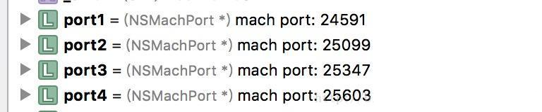

# 15.2 RunLoop与线程保活

## RunLoop 与线程的关系

首先，iOS 开发中能遇到两个线程对象: pthread_t 和 NSThread。过去苹果有份文档标明了 NSThread 只是 pthread_t 的封装，但那份文档已经失效了，现在它们也有可能都是直接包装自最底层的 mach thread。苹果并没有提供这两个对象相互转换的接口，但不管怎么样，可以肯定的是 pthread_t 和 NSThread 是一一对应的。比如，你可以通过 pthread_main_thread_np() 或 [NSThread mainThread] 来获取主线程；也可以通过 pthread_self() 或 [NSThread currentThread] 来获取当前线程。CFRunLoop 是基于 pthread 来管理的。

苹果不允许直接创建 RunLoop，它只提供了两个自动获取的函数：CFRunLoopGetMain() 和 CFRunLoopGetCurrent()。 这两个函数内部的逻辑大概是下面这样:

```
	/// 全局的Dictionary，key 是 pthread_t， value 是 CFRunLoopRef
	static CFMutableDictionaryRef loopsDic;
	/// 访问 loopsDic 时的锁
	static CFSpinLock_t loopsLock;
	 
	/// 获取一个 pthread 对应的 RunLoop。
	CFRunLoopRef _CFRunLoopGet(pthread_t thread) {
	    OSSpinLockLock(&loopsLock);
	    
	    if (!loopsDic) {
	        // 第一次进入时，初始化全局Dic，并先为主线程创建一个 RunLoop。
	        loopsDic = CFDictionaryCreateMutable();
	        CFRunLoopRef mainLoop = _CFRunLoopCreate();
	        CFDictionarySetValue(loopsDic, pthread_main_thread_np(), mainLoop);
	    }
	    
	    /// 直接从 Dictionary 里获取。
	    CFRunLoopRef loop = CFDictionaryGetValue(loopsDic, thread));
	    
	    if (!loop) {
	        /// 取不到时，创建一个
	        loop = _CFRunLoopCreate();
	        CFDictionarySetValue(loopsDic, thread, loop);
	        /// 注册一个回调，当线程销毁时，顺便也销毁其对应的 RunLoop。
	        _CFSetTSD(..., thread, loop, __CFFinalizeRunLoop);
	    }
	    
	    OSSpinLockUnLock(&loopsLock);
	    return loop;
	}
	 
	CFRunLoopRef CFRunLoopGetMain() {
	    return _CFRunLoopGet(pthread_main_thread_np());
	}
	 
	CFRunLoopRef CFRunLoopGetCurrent() {
	    return _CFRunLoopGet(pthread_self());
	}

```

从上面的代码可以看出，线程和 RunLoop 之间是一一对应的，其关系是保存在一个全局的 Dictionary 里。线程刚创建时并没有 RunLoop，如果你不主动获取，那它一直都不会有。RunLoop 的创建是发生在第一次获取时，RunLoop 的销毁是发生在线程结束时。你只能在一个线程的内部获取其 RunLoop（主线程除外）。


* 这是runLoop的获取函数，我们看到系统从一个全局字典中取出runLoop，key就是一个线程，这足以说明runLoop与线程是一一对应的关系。

* 值得一提的是，一个线程最开始是没有对应的runLoop的，是在调用获取函数的时候才对应了一个runLoop的。因为本身这个对应关系是有runLoop类管理的，而不是线程。


当然上述两个为私有api，CF真正对外暴露的只有两个接口：

```
CF_EXPORT CFRunLoopRef CFRunLoopGetCurrent(void);
CF_EXPORT CFRunLoopRef CFRunLoopGetMain(void);

```

两个方法的实现很简单，只要把对应的线程传入获取函数即可：

```
CFRunLoopRef CFRunLoopGetMain(void) {
    CHECK_FOR_FORK();
    static CFRunLoopRef __main = NULL; // no retain needed
    if (!__main) __main = _CFRunLoopGet0(pthread_main_thread_np()); // no CAS needed
    return __main;
}

CFRunLoopRef CFRunLoopGetCurrent(void) {
    CHECK_FOR_FORK();
    CFRunLoopRef rl = (CFRunLoopRef)_CFGetTSD(__CFTSDKeyRunLoop);
    if (rl) return rl;
    return _CFRunLoopGet0(pthread_self());
}

```


总的来讲就是：RunLoop是保证线程不会退出，并且能在不处理消息的时候让线程休眠，节约资源，在接收到消息的时候唤醒线程做出对应处理的消息循环机制。它是寄生于线程的，所以提到RunLoop必然会涉及到线程。


从上面的代码可以看出，线程和 RunLoop 之间是一一对应的，其关系是保存在一个 Dictionary 里。所以我们创建子线程RunLoop时，只需在子线程中获取当前线程的RunLoop对象即可[NSRunLoop currentRunLoop];如果不获取，那子线程就不会创建与之相关联的RunLoop，并且只能在一个线程的内部获取其 RunLoop
[NSRunLoop currentRunLoop];方法调用时，会先看一下字典里有没有存子线程相对用的RunLoop，如果有则直接返回RunLoop，如果没有则会创建一个，并将与之对应的子线程存入字典中。当线程结束时，RunLoop会被销毁。


## RunLoop 的与线程应用实例

>在AFNetworking 2.6.3之前的版本，使用的还是NSURLConnection，可以在AFURLConnectionOperation中找到使用RunLoop的源码：


```
+ (void)networkRequestThreadEntryPoint:(id)__unused object {
    @autoreleasepool {
        [[NSThread currentThread] setName:@"AFNetworking"];
        NSRunLoop *runLoop = [NSRunLoop currentRunLoop];
        [runLoop addPort:[NSMachPort port] forMode:NSDefaultRunLoopMode];
        [runLoop run];
    }
}
 
+ (NSThread *)networkRequestThread {
    static NSThread *_networkRequestThread = nil;
    static dispatch_once_t oncePredicate;
    dispatch_once(&oncePredicate, ^{
        _networkRequestThread = [[NSThread alloc] initWithTarget:self selector:@selector(networkRequestThreadEntryPoint:) object:nil];
        [_networkRequestThread start];
    });
    return _networkRequestThread;
}


```


AFNetworking都是通过调用 [NSObject performSelector:onThread:..] 将这个任务扔到了后台线程的 RunLoop 中。

RunLoop 启动前内部必须要有至少一个 Timer/Observer/Source，所以 AFNetworking 在 [runLoop run] 之前先创建了一个新的 NSMachPort 添加进去了。通常情况下，调用者需要持有这个 NSMachPort (mach_port) 并在外部线程通过这个 port 发送消息到 loop 内；但此处添加 port 只是为了让 RunLoop 不至于退出，并没有用于实际的发送消息。

```
- (void)start {
    [self.lock lock];
    if ([self isCancelled]) {
        [self performSelector:@selector(cancelConnection) onThread:[[self class] networkRequestThread] withObject:nil waitUntilDone:NO modes:[self.runLoopModes allObjects]];
    } else if ([self isReady]) {
        self.state = AFOperationExecutingState;
        [self performSelector:@selector(operationDidStart) onThread:[[self class] networkRequestThread] withObject:nil waitUntilDone:NO modes:[self.runLoopModes allObjects]];
    }
    [self.lock unlock];
}

```

当然，单独看这一个方法意义不大，我们稍微结合一下上下文，看看这个方法在哪里被调用:

```
+ (NSThread *)networkRequestThread {
    static NSThread *_networkRequestThread = nil;
    static dispatch_once_t oncePredicate;
    dispatch_once(&oncePredicate, ^{
        _networkRequestThread = [[NSThread alloc] initWithTarget:self selector:@selector(networkRequestThreadEntryPoint:) object:nil];
        [_networkRequestThread start];
    });
    return _networkRequestThread;
}

```

似乎这种写法提供了一种思路:“如果需要在子线程中异步执行操作，可以利用 runloop 进行线程保活”。但准确的来说，AFN 的这种写法并不能实现我们的需求，它只是在 AFN 这个特殊场景下可以工作。


我们在使用NSURLConnection 或者NSStream时，也需要考虑到RunLoop问题，因为默认情况下这两个类的对象生成后，都是在当前线程的NSDefaultRunLoopMode模式下执行任务。如果是在主线程，那么就会出现滚动ScrollView以及其子视图时，主线程的RunLoop切换到UITrackingRunLoopMode模式，那么NSURLConnection或者NSStream的回调就无法执行了。

要解决这个问题，有两种方式：
第一种方式是创建出NSURLConnection对象或者NSStream对象后，再调用 - (void)scheduleInRunLoop:(NSRunLoop *)aRunLoop forMode:(NSRunLoopMode)mode,设置RunLoopMode即可。需要注意的是NSURLConnection必须使用其初始化构造方法- (nullable instancetype)initWithRequest:(NSURLRequest *)request delegate:(nullable id)delegate startImmediately:(BOOL)startImmediately来创建对象，设置Mode才会起作用。

第二种方式，就是所有的任务都在子线程中执行，并保证子线程的RunLoop正常运行即可（即上面AFNetworking的做法，因为主线程的RunLoop切换到UITrackingRunLoopMode，并不影响其他线程执行哪个mode中的任务，计算机CPU是在每一个时间片切换到不同的线程去跑一会，呈现出的多线程效果）


### 分析原理

1. 首先我们要明确一个概念，线程一般都是一次执行完毕任务，就销毁了。
2. 而在线程中添加了runloop，并运行起来，实际上是添加了一个do，while循环，这样这个线程的程序就一直卡在do，while循环上，这样相当于线程的任务一直没有执行完，所有线程一直不会销毁。
3. 所有，一旦我们添加了一个runloop，并run了，我们如果要销毁这个线程，必须停止runloop，至于停止的方式，我们接着往下看。

* 这里创建了一个线程，取名为AFNetworking，因为添加了一个runloop，所以这个线程不会被销毁，直到runloop停止。

```
[runloop addPort: [NSMachPort port] forMode: NSDefaultRunLoopMode];

```

* 这行代码的目的是添加一个端口监听这个端口的事件，这也是我们后面会讲到的一种线程见的通信方式-基于端口的通信。

```
[runloop run];
```

* runloop开始跑起来，但是要注意，这种runloop，只有一种方式能停止。

```
[NSRunloop currentRunloop] removePort: <#(nonnull NSPort)#> forMode: <#(nonull NSRunLoopMode)#>

```
* 只有从runloop中移除我们之前添加的端口，这样的runloop没有任何事件，所有直接退出。

>再次回到AFN2.x的这行源码上，因为他用的是run，而且并没有记录下自己添加的NSMachPort,所有显然，它没有打算退出这个runloop，这是一个常驻线程。事实上，看过AFN2.x源码的同学都会知道，这个thread需要常驻的原因，在此就不做赘述了。
>


接下来我们看看AFN3.x是怎么用runloop的：

需要开启的时候：
```
CFRunLoopRun();

```


终止的时候：

```
CFRunloopStop(CFRunLoopGetCurrent());

```

由于NSUrlSession参考了AFN2.x的优点，自己维护了一个线程池，做Request线程的调度与管理，所有在AFN3.x中，没有了常驻线程，都是用的run，结束的时候stop。


## 实验线程保活

1.保证线程的长时间存活

在iOS开发过程中，有时候我们不希望一些花费时间比较长的操作阻塞主线程，导致界面卡顿，那么我们就会创建一个子线程，然后把这些花费时间比较长的操作放在子线程中来处理。可是当子线程中的任务执行完毕后，子线程就会被销毁掉。
怎么来验证上面这个结论呢？
首先，我们创建一个HLThread类，继承自NSThread，然后重写dealloc 方法。

```
@interface HLThread : NSThread

@end

@implementation HLThread

- (void)dealloc
{
    NSLog(@"%s",__func__);
}

@end
然后，在控制器中用HLThread创建一个线程，执行一个任务，观察任务执行完毕后，线程是否被销毁。

- (void)viewDidLoad {
    [super viewDidLoad];

    // 1.测试线程的销毁
    [self threadTest];
}

- (void)threadTest
{
    HLThread *subThread = [[HLThread alloc] initWithTarget:self selector:@selector(subThreadOpetion) object:nil];
    [subThread start];
}

- (void)subThreadOpetion
{
    NSLog(@"%@----子线程任务开始",[NSThread currentThread]);
    [NSThread sleepForTimeInterval:3.0];
    NSLog(@"%@----子线程任务结束",[NSThread currentThread]);
}
```

当子线程中的任务执行完毕后，线程就被立刻销毁了。如果程序中，需要经常在子线程中执行任务，频繁的创建和销毁线程，会造成资源的浪费。这时候我们就可以使用RunLoop来让该线程长时间存活而不被销毁。

我们将上面的示例代码修改一下，修改后的代码过程为，创建一个子线程，当子线程启动后，启动runloop，点击视图，会在子线程中执行一个耗时3秒的任务（其实就是让线程睡眠3秒）。

因为执行完任务后，虽然Thread没有被释放，还处于内存中，但是它处于死亡状态（当线程的任务结束后就会进入这种状态）。打个比方，人死不能复生，线程死了也不能复生（重新开启），苹果不允许在线程死亡后再次开启。所以会报错attempt to start the thread again(尝试重新开启线程)

修改后的代码如下：

```
@implementation ViewController

- (void)viewDidLoad {
    [super viewDidLoad];

    // 1.测试线程的销毁
    [self threadTest];
}

- (void)touchesBegan:(NSSet<UITouch *> *)touches withEvent:(UIEvent *)event
{
    [self performSelector:@selector(subThreadOpetion) onThread:self.subThread withObject:nil waitUntilDone:NO];
}

- (void)threadTest
{
    HLThread *subThread = [[HLThread alloc] initWithTarget:self selector:@selector(subThreadEntryPoint) object:nil];
    [subThread setName:@"HLThread"];
    [subThread start];
    self.subThread = subThread;
}

/**
 子线程启动后，启动runloop
 */
- (void)subThreadEntryPoint
{
    NSRunLoop *runLoop = [NSRunLoop currentRunLoop];
    //如果注释了下面这一行，子线程中的任务并不能正常执行
    [runLoop addPort:[NSMachPort port] forMode:NSRunLoopCommonModes];
    NSLog(@"启动RunLoop前--%@",runLoop.currentMode);
    [runLoop run];
}

/**
 子线程任务
 */
- (void)subThreadOpetion
{
    NSLog(@"启动RunLoop后--%@",[NSRunLoop currentRunLoop].currentMode);
    NSLog(@"%@----子线程任务开始",[NSThread currentThread]);
    [NSThread sleepForTimeInterval:3.0];
    NSLog(@"%@----子线程任务结束",[NSThread currentThread]);
}

@end

```

有几点需要注意：
1.获取RunLoop只能使用 [NSRunLoop currentRunLoop] 或 [NSRunLoop mainRunLoop];
2.即使RunLoop开始运行，如果RunLoop 中的 modes 为空，或者要执行的mode里没有item，那么RunLoop会直接在当前loop中返回，并进入睡眠状态。
3.自己创建的Thread中的任务是在kCFRunLoopDefaultMode这个mode中执行的。

注意点二解释
这一点，可以将示例代码中的[runLoop addPort:[NSMachPort port] forMode:NSRunLoopCommonModes];，可以看到注释掉后，无论我们如何点击视图，控制台都不会有任何的输出，那是因为mode 中并没有item任务。经过NSRunLoop封装后，只可以往mode中添加两类item任务：NSPort（对应的是source）、NSTimer，如果使用CFRunLoopRef,则可以使用C语言API,往mode中添加source、timer、observer。
如果不添加 [runLoop addPort:[NSMachPort port] forMode:NSRunLoopCommonModes];，我们把runloop的信息输出，可以看到：


添加port前的RunLoop
如果我们添加上[runLoop addPort:[NSMachPort port] forMode:NSRunLoopCommonModes];,再把RunLoop的信息输出，可以看到：


## 线程保活

### NSThread 与内存泄漏

这种写法的第一个问题就是存在内存泄漏。我们构造以下用例，其实就是把 AFN 的线程创建放在一个循环里:

```
- (void)memoryTest {
    for (int i = 0; i < 100000; ++i) {
        NSThread *thread = [[NSThread alloc] initWithTarget:self selector:@selector(run) object:nil];
        [thread start];
    }
}
- (void)run {
    @autoreleasepool {
        NSLog(@"current thread = %@", [NSThread currentThread]);
        NSRunLoop *runLoop = [NSRunLoop currentRunLoop];
        if (!self.emptyPort) {
            self.emptyPort = [NSMachPort port];
        }
        [runLoop addPort:self.emptyPort forMode:NSDefaultRunLoopMode];
        [runLoop run];
    }
}

```

奇怪的事情出现了，尽管是在 ARC 环境下，内存依然不停的上涨。如果我们把 run 方法中和 runloop 相关的代码删除则不会出现上述问题，显然，开启 runloop 导致了内存泄漏，也就是 thread 对象无法释放。

这里的 emptyPort 用来维持 runloop 的运行，根据官方文档的描述，如果 runloop 中没有任何 modeItem，就不会启动，而是立刻退出。之所以选择作为属性而不是临时变量，是因为我发现每次调用 [NSMachPort port] 方法都会占用内存，原因暂时不清楚。


我们可以尝试手动结束 runloop 并关闭线程:

```

- (void)memoryTest {
    for (int i = 0; i < 100000; ++i) {
        NSThread *thread = [[NSThread alloc] initWithTarget:self selector:@selector(run) object:nil];
        [thread start];
        [self performSelector:@selector(stopThread) onThread:thread withObject:nil waitUntilDone:YES];
    }
}
- (void)stopThread {
    CFRunLoopStop(CFRunLoopGetCurrent());
    NSThread *thread = [NSThread currentThread];
    [thread cancel];
}

```

很遗憾，这依然没有任何效果。而且不难猜测是我们没有能正确的结束 runloop 的运行。


## Runloop 的启动与退出

考验英文水平的时候到了，首先来看一段官方文档对于如何启动 runloop 的介绍，它的启动方式一共有三种:

* Unconditionally
* With a set time limit
* In a particular mode


这三种进入方式分别对应了三种方法，其中第一种就是我们目前使用的:

* run
* runUntilDate
* runMode:beforeDate:


接下来分别是对三种方式的介绍，文字比较啰嗦，这里我简单总结一下，有兴趣的读者可以直接看原文。

* 无条件进入是最简单的做法，但也最不推荐。这会使线程进入死循环，从而不利于控制 runloop，结束 runloop 的唯一方式是 kill 它。
* 如果我们设置了超时时间，那么 runloop 会在处理完事件或超时后结束，此时我们可以选择重新开启 runloop。这种方式要优于前一种
* 这是相对来说最优秀的方式，相比于第二种启动方式，我们可以指定 runloop 以哪种模式运行。
查看 run 方法的文档还可以知道，它的本质就是无限调用 runMode:beforeDate: 方法，同样地，runUntilDate: 也会重复调用 runMode:beforeDate:，区别在于它超时后就不会再调用。

总结来说，runMode:beforeDate: 表示的是 runloop 的单次调用，另外两者则是循环调用。

相比于 runloop 的启动，它的退出就比较简单了，只有两种方法:

* 设置超时时间
* 手动结束


如果你使用方法二或三来启动 runloop，那么在启动的时候就可以设置超时时间。然而考虑到目标是:“利用 runloop 进行线程保活”，所以我们希望对线程和它的 runloop 有最精确的控制，比如在完成任务后立刻结束，而不是依赖于超时机制。

好在根据文档的描述，我们还可以使用 CFRunLoopStop() 方法来手动结束一个 runloop。注意文档中在介绍利用 CFRunLoopStop() 手动退出时有下面这句话:

The difference is that you can use this technique on run loops you started unconditionally.

这里的解释非常容易产生误会，如果在阅读时没有注意到 exit 和 terminate 的微小差异就很容易掉进坑里，因为在 run 方法的文档中还有这句话:

If you want the run loop to terminate, you shouldn't use this method

总的来说，如果你还想从 runloop 里面退出来，就不能用 run 方法。根据实践结果和文档，另外两种启动方法也无法手动退出。

## 正确的做法

难道子线程中开启了 runloop 就无法结束并释放了么？这显然是一个不合理的结论，经过一番查找，终于在这篇文章里找到了答案，它给出了使用 CFRunLoopStop() 无效的原因:

CFRunLoopStop() 方法只会结束当前的 runMode:beforeDate: 调用，而不会结束后续的调用。

这也就是为什么 Runloop 的文档中说 CFRunLoopStop() 可以 exit(退出) 一个 runloop，而在 run 等方法的文档中又说这样会导致 runloop 无法 terminate(终结)。

文章中给出的方案是使用 CFRunLoopRun() 启动 runloop，这样就可以通过 CFRunLoopStop() 方法结束。而文档则推荐了另一种方法:

```

BOOL shouldKeepRunning = YES; // global
NSRunLoop *theRL = [NSRunLoop currentRunLoop];
while (shouldKeepRunning && [theRL runMode:NSDefaultRunLoopMode beforeDate:[NSDate distantFuture]]);


```


实践新的方案

```
- (void)memoryTest {
    for (int i = 0; i < 100000; ++i) {
        NSThread *thread = [[NSThread alloc] initWithTarget:self selector:@selector(run) object:nil];
        [thread start];
        [self performSelector:@selector(stopThread) onThread:thread withObject:nil waitUntilDone:YES];
    }
}
- (void)stopThread {
    CFRunLoopStop(CFRunLoopGetCurrent());
    NSThread *thread = [NSThread currentThread];
    [thread cancel];
}
- (void)run {
    @autoreleasepool {
        NSLog(@"current thread = %@", [NSThread currentThread]);
        NSRunLoop *runLoop = [NSRunLoop currentRunLoop];
        if (!self.emptyPort) {
            self.emptyPort = [NSMachPort port];
        }
        [runLoop addPort:self.emptyPort forMode:NSDefaultRunLoopMode];
        [runLoop runMode:NSRunLoopCommonModes beforeDate:[NSDate distantFuture]];
    }
}

```


采用上述方案后，确实可以观察到不会再出现内存泄漏问题，但这并不是终点。因为我们还需要验证 runloop 确实在启动后被关闭。

为了证明 runloop 确实启动，设计了如下方法:

```
	- (void)printSomething {
	    NSLog(@"current thread = %@", [NSThread currentThread]);
	    [self performSelector:@selector(printSomething) withObject:nil afterDelay:1];
	}

```

我们知道 performSelector:withObject:afterDelay 依赖于线程的 runloop，因为它本质上是由一个定时器负责定期加入到 runloop 中执行。所以如果这个方法可以成功执行，说明当前线程的 runloop 已经开启，否则则说明没有启动。

为了证明 runloop 可以被终止，我创建了一个按钮，在点击按钮时执行以下方法:

```
- (void)stopButtonDidClicked:(id)sender {
    [self performSelector:@selector(stopRunloop) onThread:self.thread withObject:nil waitUntilDone:YES];
}
- (void)stopRunloop {
    CFRunLoopStop(CFRunLoopGetCurrent());
}

```
成功的观察到点击按钮后，控制台不再有日志输出，因此证明 runloop 确实已经停止。


## API接口

#### NSRunLoop的运行接口：
```
// 运行NSRunLoop，运行模式为默认的NSDefaultRunLoopMode模式，没有超时限制
- （void）run；
// 运行NSRunLoop：参数为时间期限，运行模式为默认的NSDefaultRunLoopMode模式
- (void)runUntilDate:(NSDate *)limitDate;
// 运行NSRunLoop：参数为运行模式、时间期限，返回值为YES表示处理事件后返回的，NO表示是超时或者停止运行导致返回的。
- (BOOL)runMode:(NSString *)mode beforeDate:(NSDtate *)limitDate;

```

#### CFRunLoopRef的运行接口：

```
// 运行CFRunLoopRef
void CFRunLoopRun();
// 运行CFRunLoopRef:参数为运行模式、时间和是否在处理Input Source后退出标志，返回值是exit原因
SInt32 CFRunLoopRunInMode(mode, second, returnAfterSourceHandled);
// 停止运行CFRunLoop
void CFRunLoopStop(CFRunLoopRef rl);
// 唤醒CFRunLoopRef
void CFRunLoopWakeUp(CFRunLoopRef rl);


```

####详细了解下NSRunLoop的三个运行接口：

```
- (void)run; // 无条件运行
```

* 不建议使用，因为这个接口会导致Run Loop永久性的在NSDefaultRunLoopMode模式。

* 即使用CFRunLoopStop(runloopRef);也无法停止Run Loop的运行，除非能移除这个runloop上的所有事件源，包括定时器和source时间，不然这个子线程就无法停止，只能永久运行下去。


```
	- (void)runUntilDate:(NSDate *)limitDate; // 有一个超时时间限制

```

* 比上面的接口好点，有个超时时间，可以控制每次Run Loop的运行时间，也是运行在NSDefaultRunLoopMode模式。 

* 这个方法运行Run Loop一段时间会退出给你检查运行条件的机会，如果需要可以再次运行Run Loop。

注意CFRunLoopStop(runloopRef), 也无法停止Run Loop的运行。 
使用如下的代码：

```
while(!Done) {
    [[NSRunLoop currentRunLoop] runUntilDate:[NSDate dateWithTimeIntervalSinceNow: 10]];
    NSLog(@"exiting runloop, ......");
}

```

* 注意这个Done是我们自定义的一个Bool值，用来控制是否还需要开启下一次runloop。

* 这个例子大概做了如下的事情： 这个RunLoop会每10秒退出一次，然后输出exiting runloop ……,然后下次根据我们的Done值来判断是否再去运行runloop。


```
	/ 有一个超时时间限制，而且设置运行模式
	- (BOOL)runMode:(NSString *)mode beforeDate:(NSDate *)limitDate;

```

* 从方法上来看，比上面多了一个参数，可以设置运行模式。

* 由一点需要注意:这种运行方式是可以被CFRunLoopStop(runloopRef)所停止的(大家可以自己写个例子试试)。

* 除此之外，这个方法和第二个方法还有一个很大的区别，就是这样去运行runloop会多一种退出方式。这里我指的退出方式是除了timer触发以外的事件，都会导致runloop退出，这里举个简答的例子：

```
- (void)testDemo1{
    dispatch_async(dispatch_get_global_queue(0,0), ^ {
        NSLog(@"线程开始");
        // 获取当前线程
        self.thread = [NSThread currentThread];
        NSRunLoop *runloop = [NSRunLoop currentRunLoop];
        // 添加一个Port，同理为了防止runloop没事干直接退出
        [runloop addPort: [NSMachPort port] forMode: NSDefaultRunLoopMode];
        // 运行一个runloop， [NSDate distantFuture]:很久很久以后才让它失效
        [runloop runMode:NSDefaultRunloopMode beforeDate: [NSDate distantFuture]];
        NSLog(@"线程结束");
    });
    dispatch_after(dispatch_time(DISPATCH_TIME_NOW,(int64_t)(2*NSEC_PER_SEC)), dispatch_get_main_queue(), ^ {
        // 在我们开启的异步线程调用方法
        [self performSelector:@selector(recieveMsg) onThread: self.thread withObject: nil waitUntilDone: NO];
    });
}

- (void)recieveMsg {
    NSLog(@"收到消息了，在这个线程：%@"， [NSThread currentThread]);
}

2017-11-22 14:04:15.250 TestRunloop3[70591:1742754] 线程开始
2017-11-22 14:04:17.250 TestRunloop3[70591:1742754] 收到消息了，在这个线程：<NSThread: 0x600000263c80>{number = 3, name = (null)}
2017-11-22 14:04:17.250 TestRunloop3[70591:1742754] 线程结束


```

* 在这里我们用了performSelector: onThread…这个方法去进行线程间的通信，这只是其中最简单的方式。但是缺点也很明显，就是在去调用这个线程的时候，如果线程已经不存在了，程序就会crash。后面我们会仔细讲各种线程间的通信。

* 我们看到，我们收到一个消息，这个消息是一个 非timer得事件，所有runloop处理完就退出，这里为什么会这样呢，我们可以看看runloop的源代码：

```
/// RunLoop的实现
int CFRunLoopRunSpecific(runloop, modeName, seconds, stopAfterHandle) {

    /// 首先根据modeName找到对应mode
    CFRunLoopModeRef currentMode = __CFRunLoopFindMode(runloop, modeName, false);
    /// 如果mode里没有source/timer/observer, 直接返回。
    if (__CFRunLoopModeIsEmpty(currentMode)) return;

    /// 1. 通知 Observers: RunLoop 即将进入 loop。
    __CFRunLoopDoObservers(runloop, currentMode, kCFRunLoopEntry);

    /// 内部函数，进入loop
    __CFRunLoopRun(runloop, currentMode, seconds, returnAfterSourceHandled) {

        Boolean sourceHandledThisLoop = NO;
        int retVal = 0;
        do {

            /// 2. 通知 Observers: RunLoop 即将触发 Timer 回调。
            __CFRunLoopDoObservers(runloop, currentMode, kCFRunLoopBeforeTimers);
            /// 3. 通知 Observers: RunLoop 即将触发 Source0 (非port) 回调。
            __CFRunLoopDoObservers(runloop, currentMode, kCFRunLoopBeforeSources);
            /// 执行被加入的block
            __CFRunLoopDoBlocks(runloop, currentMode);

            /// 4. RunLoop 触发 Source0 (非port) 回调。
            sourceHandledThisLoop = __CFRunLoopDoSources0(runloop, currentMode, stopAfterHandle);
            /// 执行被加入的block
            __CFRunLoopDoBlocks(runloop, currentMode);

            /// 5. 如果有 Source1 (基于port) 处于 ready 状态，直接处理这个 Source1 然后跳转去处理消息。
            if (__Source0DidDispatchPortLastTime) {
                Boolean hasMsg = __CFRunLoopServiceMachPort(dispatchPort, &msg)
                if (hasMsg) goto handle_msg;
            }

            /// 6.通知 Observers: RunLoop 的线程即将进入休眠(sleep)。
            if (!sourceHandledThisLoop) {
                __CFRunLoopDoObservers(runloop, currentMode, kCFRunLoopBeforeWaiting);
            }

            /// 7. 调用 mach_msg 等待接受 mach_port 的消息。线程将进入休眠, 直到被下面某一个事件唤醒。
            /// ? 一个基于 port 的Source 的事件。
            /// ? 一个 Timer 到时间了
            /// ? RunLoop 自身的超时时间到了
            /// ? 被其他什么调用者手动唤醒
            __CFRunLoopServiceMachPort(waitSet, &msg, sizeof(msg_buffer), &livePort) {
                mach_msg(msg, MACH_RCV_MSG, port); // thread wait for receive msg
            }

            /// 8. 通知 Observers: RunLoop 的线程刚刚被唤醒了。
            __CFRunLoopDoObservers(runloop, currentMode, kCFRunLoopAfterWaiting);

            /// 9.收到消息，处理消息。
            handle_msg:

            /// 10.1 如果一个 Timer 到时间了，触发这个Timer的回调。
            if (msg_is_timer) {
                __CFRunLoopDoTimers(runloop, currentMode, mach_absolute_time())
            } 

            /// 10.2 如果有dispatch到main_queue的block，执行block。
            else if (msg_is_dispatch) {
                __CFRUNLOOP_IS_SERVICING_THE_MAIN_DISPATCH_QUEUE__(msg);
            } 

            /// 10.3 如果一个 Source1 (基于port) 发出事件了，处理这个事件
            else {
                CFRunLoopSourceRef source1 = __CFRunLoopModeFindSourceForMachPort(runloop, currentMode, livePort);
                sourceHandledThisLoop = __CFRunLoopDoSource1(runloop, currentMode, source1, msg);
                if (sourceHandledThisLoop) {
                    mach_msg(reply, MACH_SEND_MSG, reply);
                }
            }

            /// 执行加入到Loop的block
            __CFRunLoopDoBlocks(runloop, currentMode);


            if (sourceHandledThisLoop && stopAfterHandle) {
                /// 进入loop时参数说处理完事件就返回。
                retVal = kCFRunLoopRunHandledSource;
            } else if (timeout) {
                /// 超出传入参数标记的超时时间了
                retVal = kCFRunLoopRunTimedOut;
            } else if (__CFRunLoopIsStopped(runloop)) {
                /// 被外部调用者强制停止了
                retVal = kCFRunLoopRunStopped;
            } else if (__CFRunLoopModeIsEmpty(runloop, currentMode)) {
                /// source/timer/observer一个都没有了
                retVal = kCFRunLoopRunFinished;
            }

            /// 如果没超时，mode里没空，loop也没被停止，那继续loop。
        } while (retVal == 0);
    }

    /// 11. 通知 Observers: RunLoop 即将退出。
    __CFRunLoopDoObservers(rl, currentMode, kCFRunLoopExit);
}


```

代码一长串，但是标了注释，应该大致能看明白，大概讲一下：

1. 函数的主体是一个do, while循环，用一个变量retVal，来控制循环的执行。默认为0，无限循环。
2. 刚进入循环1，2，3，4，5在做一件事，就是检查是否有事件需要处理，如果有的话，直接跳到9去处理事件。
3. 处理完事件之后，到第10行，会去判断4种是否应该跳出循环的情况，给出变量retVal赋一个不为0的值，来跳出循环。
4. 如果走到6，则判断没有事情做，那么runloop就睡眠了，停在第7行，这一行类似sync这样的同步机制(其实不是，只是举个例子。。)，把程序阻塞在这一行，直到有消息返回值，才继续往下进行。这一阻塞操作是系统内核挂起来的，阻塞了当前的线程，当有消息返回时，因为当前线程是被阻塞的，系统内核会再开辟一条新的线程去返回这个消息。然后程序继续往下进行。
5. 走到第8、9，通知Observers，然后处理事件。
6. 到10，去判断是否退出循环的条件，如果满足条件退出循环，runloop结束。反之，又从新开始循环，从2开始。
7. 这就是一个完整的runloop处理事件的流程。


回到上述的例子这种模式下的runloop：

```
- (BOOL) runMode:(NSString *)mode beforeDate:(NSDate *)limitDate;
```

我们让线程执行了一个事件，结果执行完，runloop就退出了，原因是这样的：

```
if (sourceHandledThisLoop && stopAfterHandle) {
    /// 进入loop时参数处理完毕事件就返回
    retVal = kCFRunLoopHandledSource;
}
```

这种形式开启的runloop， stopAfterHandle这个参数为YES，而sourceHandledThisLoop这个参数在如下代码中被赋值为YES：

```
/// 10.3 如果一个Source1（基于port）发出了事件，处理这个事件
else {
    CFRunLoopSourceRef source1 = __CFRunLoopModeFindSourceForMachPort(runloop, currentMode, livePort);
    sourceHandledThisLoop = __CFRunLoopDoSource1(runloop, currentMode, source1, msg);
    if (sourceHandledThisLoop) {
        mach_msg(reply, MACH_SEND_MSG, reply);
    }
}

```

这里我们触发了事件之后，runloop被退出了，这个时候我们也明白了为什么timer并不会导致runloop的退出。


####Core Foundation中运行的runloop的接口：


```

	/// 运行CFRunLoopRef
	void CFRunLoopRun()
	/// 运行CFRunLoopRef： 参数为运行模式、时间和是否在处理Input Source后退出标示，返回值是exit原因
	SInt32 CFRunLoopRunInMode (mode, seconds, returnAfterSourceHandled);
	/// 停止运行 CFRunLoopRef
	void CFRunLoopStop(CFRunLoopRef rl);
	/// 唤醒 CFRunLoopRef
	void CFRunLoopWakeUp(CFRunLoopRef rl);


```

#####  ```void CFRunLoopRun()```

* 运行在默认的kCFRunLoopDefaultMode模式下，知道CFRunLoopStop接口调用停止这个RunLoop，或者RunLoop的所有事件源被删除。
	
* NSRunLoop是基于CFRunLoop来封装的，NSRunLoop是线程不安全的，而CFRunLoop是线程安全的。
	
	
* 在这里我们可以看到和上面NSRunLoop有一个直观的区别是：CFRunLoop能直接停止掉所有的CFRunLoop运行起来的runloop，其实之前讲到的：

```
- (BOOL)runMode:(NSString *)mode beforeDate:(NSDate *)limitDate;

```

这种方式运行起来的runloop也能用CFRunLoopStop 停止掉的，原因是它完全是基于下面这种方式封装的：

```
SInt32 CFRunLoopRunInMode(mode, seconds, returnAfterSourceHandled);

```

可以看到参数几乎一模一样，前者默认returnAfterSourceHandled参数为YES，当触发一个非timer事件后，runloop就终止了。

  * 这里比较简单，就不举例赘述了。

##### SInt32 CFRunLoopRunInMode(mode, seconds, return AfterSourceHandled);


* 这里有3个参数，1个返回值

* 其中第一个参数是指RunLoop运行的模式(例如kCFRunLoopDefaultMode或者kCFRunLoopCommonModes），第二个参数是运行事件，第三个参数是是否在处理事件后让Run Loop退出返回，NSRunLoop的第三种开启runloop的方法，综上所述，我们知道，实际上就是设置stopAfterHande这个参数为YES

* 关于返回值，我们知道调用runloop运行，代码是停在这一行不返回的，当返回的时候runloop就结束了，所有这个返回值就是runloop结束原因的返回，为一个枚举值，具体原因如下：


```
enum {
    kCFRunLoopRunFinished = 1, // Run Loop结束，没有Timer或者其他Input Source
    kCFRunLoopRunStopped = 2, // Run Loop被停止，使用CFRunLoopStop停止Run Loop
    kCFRunLoopRunTimedOut = 3, // Run Loop超时
    kCFRunLoopRunHandledSource = 4, // Run Loop处理完事件，注意Timer事件的触发是不会让Run Loop退出返回的，即使CFRunLoopRunInMode的第三个参数是YES也不行
}


```

看到这，我们发现我们忽略了NSRunLoop第三种开启方式的返回值。
 
```- (Bool)runMode:(NSString *)mode beforeDate:(NSDate *)limitDate; ```

它其实就是基于CFRunLoopRunInMode封装的，它的返回值为一个Bool值，如果是PerformSelector *事件或者其他Input Source事件触发处理后，Run Loop会退出返回YES， 其他返回NO。

举个例子：

```
- (void)testDemo2
{
    dispatch_async(dispatch_get_global_queue(0, 0), ^{

        NSLog(@"starting thread.......");
        NSTimer *timer = [NSTimer timerWithTimeInterval:1 target:self selector:@selector(doTimerTask1:) userInfo:remotePort repeats:YES];
        [[NSRunLoop currentRunLoop] addTimer:timer forMode:NSDefaultRunLoopMode];

        //最后一个参数，是否处理完事件返回,结束runLoop
        SInt32 result = CFRunLoopRunInMode(kCFRunLoopDefaultMode, 100, YES);
        /*
         kCFRunLoopRunFinished = 1, //Run Loop结束，没有Timer或者其他Input Source
         kCFRunLoopRunStopped = 2, //Run Loop被停止，使用CFRunLoopStop停止Run Loop
         kCFRunLoopRunTimedOut = 3, //Run Loop超时
         kCFRunLoopRunHandledSource = 4 ////Run Loop处理完事件，注意Timer事件的触发是不会让Run Loop退出返回的，即使CFRunLoopRunInMode的第三个参数是YES也不行
         */
        switch (result) {
            case kCFRunLoopRunFinished:
                NSLog(@"kCFRunLoopRunFinished");

                break;
            case kCFRunLoopRunStopped:
                NSLog(@"kCFRunLoopRunStopped");

            case kCFRunLoopRunTimedOut:
                NSLog(@"kCFRunLoopRunTimedOut");

            case kCFRunLoopRunHandledSource:
                NSLog(@"kCFRunLoopRunHandledSource");
            default:
                break;
        }

        NSLog(@"end thread.......");

    });

}

- (void)doTimerTask1:(NSTimer *)timer
{

    count++;
    if (count == 2) {
        [timer invalidate];
    }
    NSLog(@"do timer task count:%d",count);
}


2016-11-23 09:19:28.342 TestRunloop3[88598:1971412] starting thread.......
2016-11-23 09:19:29.347 TestRunloop3[88598:1971412] do timer task count:1
2016-11-23 09:19:30.345 TestRunloop3[88598:1971412] do timer task count:2
2016-11-23 09:19:30.348 TestRunloop3[88598:1971412] kCFRunLoopRunFinished
2016-11-23 09:19:30.348 TestRunloop3[88598:1971412] end thread.......


```


* 很清楚的可以看到，当timer被置无效的时候，runloop里面没有了任何事件源，所以退出了，退出原因为：kCFRunLoopRunFinished，线程也就结束了。


#### runloop的运行方法一共有5种：包括NSRunLoop的3种，CFRunLoop的2种； 
而取消的方式一共为3种： 

1. 移除掉runloop种的所有事件源（timer和source）。 
2. 设置一个超时时间。 
3. 只要CFRunLoop运行起来就可以用：```void CFRunLoopStop(CFRunLoopRef rl);``` 去停止。 
除此之外用 NSRunLoop下面这个方法也能使用```void CFRunLoopStop(CFRunLoopRef rl)```; 停止：

```
[NSRunLoop currentRunLoop] runMode:<#(nonull NSRunLoopMode)#> beforeDate:<#(nonull NSDate)#>
```

实现过程中，可以根据需求，我们可以设置一个自己的Bool值，来控制runloop的开始于停止，类似下面这样：
while(!cancel) {
    CFRunLoopRunInMode(kCFRunLoopDefaultMode, 1, YES);
}

* 每次runloop只运行1秒就停止，然后开始下一次runloop。

* 这里最后一个参数设置为YES，当有非timer事件进来，也会立即开始下一次runloop。

* 当然每次进来我们都可以去修改Mode的值，这样我们呢可以让runloop每次都运行在不同的模式下。

* 当我们不需要runloop的时候，可以直接将cancel设置为YES即可。

* 当然，这里只是提供一个思路，具体有需求，可以根据实际需要。


### 基于runloop的线程通信

首先明确一个概念，线程间的通信(不仅限于通信，几乎所有iOS事件都是如此)，实际上是各种输入源，触发runloop去处理对应的事件，所以我们先来讲讲输入源： 
输入源异步的发送消息给你的线程。事件来源取决于输入源的种类：

* 基于端口的输入源和自定义输入源。基于端口的输入源监听程序相应的端口。自定义输入源则监听自定义的事件源。

当你创建输入源，你需要将其分配给run loop中的一个或多个模式。模式只会在特定事件影响监听的源。大多数情况下，runloop运行在默认模式下，但是你也可以使其运行在自定义模式。若其一源在当前模式下不被监听，那么任何其生成的消息只在run loop运行在其关联的模式下才会被传递。


1. 基于端口的输入源： 
在runloop中，被定义名为source1。Cocoa和Core Foundation内置支持使用端口相关的对象和函数来创建的基于端口对象，并使用NSPort的方法吧端口添加到runloop。端口对象会自己处理创建和配置输入源。

在Core Foundation，你必须人工创建端口和它的run loop源。在两种情况下，你都可以使用端口相关的函数(CFMachPortRef, CFMessagePortRef, CFSockerRef)来创建合适的对象。

这里用Cocoa里的举个例子，Cocoa里用来线程传值得NSMachPort，它的父类是NSPort。 
首先我们看下面：

```
	NSPort *port1 = [[NSPort alloc]init];
	NSPort *port2 = [[NSMachPort alloc]init];
	NSPort *port3 = [NSPort port];
	NSPort *port4 = [NSMachPort port];
	
```
打断点看到如下： 

 


*  发现我们怎么创建，都返回给我们的是NSMachPort的实例，这应该是NSProt内部做了一个消息的转发，这就有点像是一个抽象类，它本身只是定义一些公有属性和方法，然后利用集成它的子类去实现(只是个人猜测。。)

##### 继续看我们写的一个利用NSMachPort来线程通信的实例：

```
- (void)testDemo3
{
    //声明两个端口   随便怎么写创建方法，返回的总是一个NSMachPort实例
    NSMachPort *mainPort = [[NSMachPort alloc]init];
    NSPort *threadPort = [NSMachPort port];
    //设置线程的端口的代理回调为自己
    threadPort.delegate = self;

    //给主线程runloop加一个端口
    [[NSRunLoop currentRunLoop]addPort:mainPort forMode:NSDefaultRunLoopMode];

    dispatch_async(dispatch_get_global_queue(0, 0), ^{

        //添加一个Port
        [[NSRunLoop currentRunLoop]addPort:threadPort forMode:NSDefaultRunLoopMode];
        [[NSRunLoop currentRunLoop]runMode:NSDefaultRunLoopMode beforeDate:[NSDate distantFuture]];

    });

    NSString *s1 = @"hello";

    NSData *data = [s1 dataUsingEncoding:NSUTF8StringEncoding];

    dispatch_after(dispatch_time(DISPATCH_TIME_NOW, (int64_t)(2 * NSEC_PER_SEC)), dispatch_get_main_queue(), ^{
        NSMutableArray *array = [NSMutableArray arrayWithArray:@[mainPort,data]];
        //过2秒向threadPort发送一条消息，第一个参数：发送时间。msgid 消息标识。
        //components，发送消息附带参数。reserved：为头部预留的字节数（从官方文档上看到的，猜测可能是类似请求头的东西...）
        [threadPort sendBeforeDate:[NSDate date] msgid:1000 components:array from:mainPort reserved:0];

    });

}

//这个NSMachPort收到消息的回调，注意这个参数，可以先给一个id。如果用文档里的NSPortMessage会发现无法取值
- (void)handlePortMessage:(id)message
{

    NSLog(@"收到消息了，线程为：%@",[NSThread currentThread]);

    //只能用KVC的方式取值
    NSArray *array = [message valueForKeyPath:@"components"];

    NSData *data =  array[1];
    NSString *s1 = [[NSString alloc]initWithData:data encoding:NSUTF8StringEncoding];
    NSLog(@"%@",s1);

//    NSMachPort *localPort = [message valueForKeyPath:@"localPort"];
//    NSMachPort *remotePort = [message valueForKeyPath:@"remotePort"];

}

2017-11-23 13:30:20.604 TestRunloop[1322:120162] 收到消息了，线程为：<NSThread: 0x60800026d700>{number = 3, name = (null)}
2017-11-23 13:30:26.551 TestRunloop[1322:120162] hello


```


* 我们跨越线程，确实从主线程往另外一个线程发送了消息。

* 这里我们要注意几个点：

 1. ```- (void)handlePortMessage:(id)message ```这里这个代理的参数，从.h中去复制过来的为NSPortMessage类型的一个对象，但是我们发现苹果只是在.h中@class过来，我们无法调用它的任何方法。所有我们用id声明，然后通过kvc去取它的属性。 

 2. 关于下面这个传值类型的问题： 
	```NSMutableArray *array = [NSMutableArray arrayWithArray: @[mainPort, data]]; ```
	在此我困惑了好一会儿。。之前我是往数组里添加的是String或者其他类型的对象，但是发现参数传过去之后，变成了nil。于是查了半天资料，依然没有结果。于是翻看官方文档，终于在方法描述里看到了


> The components array consists of a series of instances 
of some subclass of NSData, and instances of some 
subclass of NSPort; since one subclass of NSPort does 
not necessarily know how to transport an instance of 
another subclass of NSPort (or could do it even if it 
knew about the other subclass), all of the instances 
of NSPort in the components array and the ‘receivePort’ 
argument MUST be of the same subclass of NSPort that 
receives this message. If multiple DO transports are 
being used in the same program, this requires some care.

>从这段描述中我们可以看出，这个传参数组里面只能装两种类型的数据，一种是NSPort的子类，一种是NSData的子类。所有我们如果要用这种方式传值必须得先把数据转成NSData类型的才行。
>
>


2. Cocoa 执行Selector的源

 除了基于端口的源，Cocoa定义了自定义输入源，允许你在任何线程执行selector。它被称为source0，和基于端口的源一样，执行selector请求会在目标线程上序列化，减缓许多在线程上允许多个方法容易引起的同步问题。不像基于源的端口，一个selector执行完后会自动从run loop里面移除
 
```
[self performSelectorOnMainThread:<#(nonnull SEL)#> withObject:<#(nullable id)#> waitUntilDone:<#(BOOL)#>]
[self performSelectorOnMainThread:<#(nonnull SEL)#> withObject:<#(nullable id)#> waitUntilDone:<#(BOOL)#> modes:<#(nullable NSArray<NSString *> *)#>]

[self performSelector:<#(nonnull SEL)#> onThread:<#(nonnull NSThread *)#> withObject:<#(nullable id)#> waitUntilDone:<#(BOOL)#>]
[self performSelector:<#(nonnull SEL)#> onThread:<#(nonnull NSThread *)#> withObject:<#(nullable id)#> waitUntilDone:<#(BOOL)#> modes:<#(nullable NSArray<NSString *> *)#>]


```

* 这四个方法很类似，一个是在主线程去掉，一个可以指定一个线程。然后一个带Mode，一个不带。大概讲一下 waitUntilDone这个参数，顾名思义，就是是否等到结束。 

1. 如果这个值设为YES，那么就需要等到这个方法执行完，线程才能继续往下去执行。它会阻塞提交的线程。 
2. 如果为NO的话，这个调用的方法会异步的实行，不会阻塞提交的线程。 
3. 自定义输入源：

为了自定义输入源，必须使用Core Foundation里面的CGRunLoopSourceRef类型相关的函数来创建。你可以使用回调函数来配置自定义输入源。CoreFoundation会在配置源的不同地方调用回调函数，处理输入时间，在源从runloop移除的时候清理它。除了定义在事件到达时自定义输入源的行为，你也必须定义消息传递机制。源的这部分运行在单独的线程里面，并负责在数据等待处理的时候将数据传递给源并通知它处理数据。消息传递机制的定义取决于你，但是最好不要过于复杂。 
创建自定义的输入源包括定义下面内容： 
1.输入源要处理的信息； 
2.使感兴趣的客户端知道如何和输入源交互的调度历程； 
3.处理其他任何客户端发送请求的历程； 
4.使输入源失效的取消历程。

由于创建输入源来处理自定义消息，实际配置选是灵活的。调度历程，处理历程和取消历程都是创建自定义输入源的关键历程。二输入源其他的大部分行为都发生在这些历程的外部。比如，由于你决定数据传输到输入源的机制，还有输入源的其他线程的通信机制也是由你决定。


这样一来，我们来写一个实例来讲讲自定义的输入源(自定义的输入源，只有用CF来实现)：

```
- (void)testDemo4
{
    dispatch_async(dispatch_get_global_queue(0, 0), ^{

        NSLog(@"starting thread.......");

        _runLoopRef = CFRunLoopGetCurrent();
        //初始化_source_context。
        bzero(&_source_context, sizeof(_source_context));
        //这里创建了一个基于事件的源，绑定了一个函数
        _source_context.perform = fire;
        //参数
        _source_context.info = "hello";
        //创建一个source
        _source = CFRunLoopSourceCreate(NULL, 0, &_source_context);
        //将source添加到当前RunLoop中去
        CFRunLoopAddSource(_runLoopRef, _source, kCFRunLoopDefaultMode);

        //开启runloop 第三个参数设置为YES，执行完一次事件后返回
        CFRunLoopRunInMode(kCFRunLoopDefaultMode, 9999999, YES);

        NSLog(@"end thread.......");
    });


    dispatch_after(dispatch_time(DISPATCH_TIME_NOW, (int64_t)(2 * NSEC_PER_SEC)), dispatch_get_main_queue(), ^{

        if (CFRunLoopIsWaiting(_runLoopRef)) {
            NSLog(@"RunLoop 正在等待事件输入");
            //添加输入事件
            CFRunLoopSourceSignal(_source);
            //唤醒线程，线程唤醒后发现由事件需要处理，于是立即处理事件
            CFRunLoopWakeUp(_runLoopRef);
        }else {
            NSLog(@"RunLoop 正在处理事件");
            //添加输入事件，当前正在处理一个事件，当前事件处理完成后，立即处理当前新输入的事件
            CFRunLoopSourceSignal(_source);
        }
    });

}

//此输入源需要处理的后台事件
static void fire(void* info){

    NSLog(@"我现在正在处理后台任务");

    printf("%s",info);
}

2017-11-34 10:42:24.045 TestRunloop[4683:238183] starting thread.......
2017-11-34 10:42:26.045 TestRunloop[4683:238082] RunLoop 正在等待事件输入 
2017-11-34 10:42:31.663 TestRunloop[4683:238183] 我现在正在处理后台任务
hello
2017-11-34 10:42:31.663 TestRunloop[4683:238183] end thread.......


```
* 例中可见我们创建一个自定义的输入源，绑定了一个函数，一个参数，并且这个输入源，实现了线程间的通信.

* 大概说一下:

1. ```CFRunLoopRef _runLoopRef```;CF的runLoop。 
2. ```CFRunLoopSourceContext _source_context```; 注意到例中用了一个C函数```bzero(&_source_context, sizeof(_source_context))```; 来初始化。其实它的本质是一个结构体：

```
typedef struct {
  CFIndex version;
  void *  info;
  const void *(*retain)(const void *info);
  void    (*release)(const void *info);
  CFStringRef (*copyDescription)(const void *info);
  Boolean (*equal)(const void *info1, const void *info2);
  CFHashCode  (*hash)(const void *info);
  void    (*schedule)(void *info, CFRunLoopRef rl, CFRunLoopMode mode);
  void    (*cancel)(void *info, CFRunLoopRef rl, CFRunLoopMode mode);
  void    (*perform)(void *info);
} CFRunLoopSourceContext;


```

* bzero(&_source_context, sizeof(_source_context)); 所以这个函数其实就是把所有的内容先置为0.

我们在这里绑定了两个参数一个是signal触发的函数，一个是函数的参数，至于其他参数的用途，可以看看苹果官方文档的说明：


> version 
Version number of the structure. Must be 0. 
info 
An arbitrary pointer to program-defined data, which can be associated with the CFRunLoopSource at creation time. This pointer is passed to all the callbacks defined in the context. 
retain 
A retain callback for your program-defined info pointer. Can be NULL. 
release 
A release callback for your program-defined info pointer. Can be NULL. 
copyDescription 
A copy description callback for your program-defined info pointer. Can be NULL. 
equal 
An equality test callback for your program-defined info pointer. Can be NULL. 
hash 
A hash calculation callback for your program-defined info pointer. Can be NULL. 
schedule 
A scheduling callback for the run loop source. This callback is called when the source is added to a run loop mode. Can be NULL. 
cancel 
A cancel callback for the run loop source. This callback is called when the source is removed from a run loop mode. Can be NULL. 
perform 
A perform callback for the run loop source. This callback is called when the source has fired.


3. CFRunLoopSourceRef _source； 这个是自定义输入源中最重要的一个参数。它用来连接runloop和CFRunLoopSourceContext的一些配置选项，注意我们自定义的输入源，必须由我们手动触发。需要先CFRunLoopSourceSignal(_source); 在看当前runloop是否在休眠中，来看是否需要调用CFRunLoopWakeUp(_runLoopRef); （一般都是要调用的）。


4. 定时源：

	* 定时源在预设的时间点同步方式传递消息。定时器是线程通知自己做某事的一种方法。
	
	* 尽管定时器可以产生基于时间的通知，但他并不实时机制。和输入源一样，定时器也和runloop的特点模式相关。如果定时器所在的模式当前未被runloop监视，那么定时器将不会开始知道runloop运行在响应的模式下。类似的，如果定时器在runloop处理某一事件期间开始，定时器会一直等待直到下次runloop开始响应的处理程序，如果runloop不运行了，那么定时器也永远不启动。
	
	* 配置定时源： Cocoa中可以使用以下NSTimer类方法来创建一个定时器：


```

[NSTimer scheduledTimerWithTimeInterval:<#(NSTimeInterval)#> target:<#(nonnull id)#> selector:<#(nonnull SEL)#> userInfo:<#(nullable id)#> repeats:<#(BOOL)#>
[NSTimer timerWithTimeInterval:<#(NSTimeInterval)#> target:<#(nonnull id)#> selector:<#(nonnull SEL)#> userInfo:<#(nullable id)#> repeats:<#(BOOL)#>]


```

当前还有Block，invocation的形式，就不做赘述了。 
第一种timer默认是加到NSDefaultRunLoopMode模式下。 
第二种timer没有默认值，我们使用的时候必须调用 ```[[NSRunLoop currentRunLoop] addTimer: timer forMode: NSDefaultRunLoopMode]```; 去给它指定一个mode。

```
CFRunLoopRef runLoop = CFRunLoopGetCurrent();
CFRunLoopTimerContext context = {0, NULL, NULL, NULL, NULL};
CFRunLoopTimerRef timer = CFRunLoopTimerCreate(kCFAllocatorDefault, 0.1, 0.3, 0, 0, &myCFTimeCallback, &context);
```

最后用一张runloop运行时的流程图来梳理一下我们这些源触发的顺序


* 如图所示，首先我要明确一个知识点：runloop跑一圈，只能执行一个事件。

* timer和source0进入runloop中，都只是通知Observer我要处理，但是还是会有6、7、8睡眠唤醒这一步。但是source1如果有，就会直接跳到第9步执行。

* 我们前面也讲过第7步，这里再提一下。它一直阻塞再这一列，直到：

	1. a.source1来了。b.定时器启动。c.runloop超时。d.runloop被显式唤醒CFRunLoopWakeUp(runloop)（也就是source0）来了。 
	2. 这里大家就奇怪了，之前不是说source1有的话就直接跳到第9步去执行了吗？。但是仔细想想，如果runloop正处于睡眠状态下，这个时候source1来了，是不是也需要唤醒runloop~ 
	3. 至于其他的，应该不难理解了。

### Run Loop的Observer

上图提到了Observer: 
Core Foundaton层的接口可以定义一个Run Loop的观察这在—Run Loop进入下一个状态时得到通知：

* Run loop的进入

* Run loop处理一个Timer的时刻

* Run loop处理一个Input Source的时刻

* Run loop进入睡眠的时刻

* Run loop被唤醒的时刻，但在唤醒它的事件被处理之前

* Run loop的终止

Observer的创建以及添加到Run Loop中需要使用Core Foundation的接口： 
方法很简单如下：
```
// 创建observer
CFRunLoopObserverRef observer = CFRunLoopObserverCreateWithHandler(CFAllocatorGetDefault(), kCFRunLoopAllActivities, YES, 0, ^(CFRunLoopObserverRef observer, CFRunLoopActivity activity) {
});
// 添加观察者：监听RunLoop的状态
CFRunLoopAddObserver(CFRunLoopGetCurrent(), observer, kCFRunLoopDefaultMode);
// 释放Observer
CFRelease(observer);
```
1)方法就是创建一个observer，绑定一个runloop和模式，而block回调就是监听到runloop每种状态的时候回触发。 
2）其中CFRunLoopActivity是一枚举值，与每种状态对应：

```
typedef CF_OPTIONS(CFOptionFlags, CFRunLoopActivity) {
kCFRunLoopEntry = (1UL << 0), // 1 // 即将进入Loop
kCFRunLoopBeforeTimers = (1UL << 1), // 2 // 即将处理 Timer
kCFRunLoopBeforeSources = (1UL << 2), // 4 即将处理 Source
kCFRunLoopBeforeWaiting = (1UL << 5), // 32 // 即将进入休眠
kCFRunLoopAfterWaiting = (1UL << 6), // 64
// 刚从休眠中唤醒
kCFRunLoopExit = (1UL << 7), // 128 // 即将退出Loop
kCFRunLoopAllActivities = 0x0FFFFFFFU // 可以监听以上所有状态
};
```

```
-(void)touchesBegan:(NSSet<UITouch *> *)touches withEvent:(UIEvent *)event
{
     //创建监听者
     /*
     第一个参数 CFAllocatorRef allocator：分配存储空间 CFAllocatorGetDefault()默认分配
     第二个参数 CFOptionFlags activities：要监听的状态 kCFRunLoopAllActivities 监听所有状态
     第三个参数 Boolean repeats：YES:持续监听 NO:不持续
     第四个参数 CFIndex order：优先级，一般填0即可
     第五个参数 ：回调 两个参数observer:监听者 activity:监听的事件
     */
     /*
     所有事件
     typedef CF_OPTIONS(CFOptionFlags, CFRunLoopActivity) {
     kCFRunLoopEntry = (1UL << 0),   //   即将进入RunLoop
     kCFRunLoopBeforeTimers = (1UL << 1), // 即将处理Timer
     kCFRunLoopBeforeSources = (1UL << 2), // 即将处理Source
     kCFRunLoopBeforeWaiting = (1UL << 5), //即将进入休眠
     kCFRunLoopAfterWaiting = (1UL << 6),// 刚从休眠中唤醒
     kCFRunLoopExit = (1UL << 7),// 即将退出RunLoop
     kCFRunLoopAllActivities = 0x0FFFFFFFU
     };
     */
    CFRunLoopObserverRef observer = CFRunLoopObserverCreateWithHandler(CFAllocatorGetDefault(), kCFRunLoopAllActivities, YES, 0, ^(CFRunLoopObserverRef observer, CFRunLoopActivity activity) {
        switch (activity) {
            case kCFRunLoopEntry:
                NSLog(@"RunLoop进入");
                break;
            case kCFRunLoopBeforeTimers:
                NSLog(@"RunLoop要处理Timers了");
                break;
            case kCFRunLoopBeforeSources:
                NSLog(@"RunLoop要处理Sources了");
                break;
            case kCFRunLoopBeforeWaiting:
                NSLog(@"RunLoop要休息了");
                break;
            case kCFRunLoopAfterWaiting:
                NSLog(@"RunLoop醒来了");
                break;
            case kCFRunLoopExit:
                NSLog(@"RunLoop退出了");
                break;
                
            default:
                break;
        }
    });
    
    // 给RunLoop添加监听者
    /*
     第一个参数 CFRunLoopRef rl：要监听哪个RunLoop,这里监听的是主线程的RunLoop
     第二个参数 CFRunLoopObserverRef observer 监听者
     第三个参数 CFStringRef mode 要监听RunLoop在哪种运行模式下的状态
     */
    CFRunLoopAddObserver(CFRunLoopGetCurrent(), observer, kCFRunLoopDefaultMode);
     /*
     CF的内存管理（Core Foundation）
     凡是带有Create、Copy、Retain等字眼的函数，创建出来的对象，都需要在最后做一次release
     GCD本来在iOS6.0之前也是需要我们释放的，6.0之后GCD已经纳入到了ARC中，所以我们不需要管了
     */
    CFRelease(observer);
}

```


[深入理解Runloop，看我一篇就够了](https://blog.csdn.net/u014795020/article/details/72084735)
