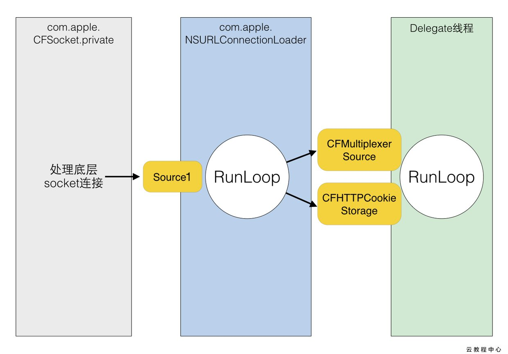

# 15.3 RunLoop应用实践

## 定时器Timer

>1. 我们经常会在应用中看到tableView 的header 上是一个横向ScrollView，一般我们使用NSTimer，每隔几秒切换一张图片。可是当我们滑动tableView的时候，顶部的scollView并不会切换图片，这可怎么办呢？
>2. 界面上除了有tableView，还有显示倒计时的Label，当我们在滑动tableView时，倒计时就停止了，这又该怎么办呢？


我们的定时器Timer是怎么写的呢？
一般的做法是，在主线程（可能是某控制器的viewDidLoad方法）中，创建Timer。
可能会有两种写法，但是都有上面的问题，下面先看下Timer的两种写法：

```
	// 第一种写法NSTimer *timer = [NSTimer timerWithTimeInterval:1.0 target:self selector:@selector(timerUpdate) userInfo:nil repeats:YES];
	[[NSRunLoop currentRunLoop] addTimer:timer forMode:NSDefaultRunLoopMode];
	[timer fire];
	// 第二种写法NSTimer *timer = [NSTimer scheduledTimerWithTimeInterval:1.0 target:self selector:@selector(timerUpdate) userInfo:nil repeats:YES];
	[timer fire];

```

上面的两种写法其实是等价的。第二种写法，默认也是将timer添加到NSDefaultRunLoopMode下的。
要验证这一结论，我们只需要在timerUpdate方法中，将当前runLoop的currentMode打印出来即可。

```
- (void)timerUpdate
{
    NSLog(@"当前线程：%@",[NSThread currentThread]);
    NSLog(@"启动RunLoop后--%@",[NSRunLoop currentRunLoop].currentMode);
//    NSLog(@"currentRunLoop:%@",[NSRunLoop currentRunLoop]);
    dispatch_async(dispatch_get_main_queue(), ^{
        self.count ++;
        NSString *timerText = [NSString stringWithFormat:@"计时器:%ld",self.count];
        self.timerLabel.text = timerText;
    });
}

```

然后，我们在滑动tableView的时候timerUpdate方法，并不会调用。
原因是啥呢？
原因是当我们滑动scrollView时，主线程的RunLoop 会切换到UITrackingRunLoopMode这个Mode，执行的也是UITrackingRunLoopMode下的任务（Mode中的item），而timer 是添加在NSDefaultRunLoopMode下的，所以timer任务并不会执行，只有当UITrackingRunLoopMode的任务执行完毕，runloop切换到NSDefaultRunLoopMode后，才会继续执行timer。

要如何解决这一问题呢？
解决方法很简单，我们只需要在添加timer 时，将mode 设置为NSRunLoopCommonModes即可。


```
	- (void)timerTest
	{
	    // 第一种写法
	    NSTimer *timer = [NSTimer timerWithTimeInterval:1.0 target:self selector:@selector(timerUpdate) userInfo:nil repeats:YES];
	    [[NSRunLoop currentRunLoop] addTimer:timer forMode:NSRunLoopCommonModes];
	    [timer fire];
	    // 第二种写法，因为是固定添加到defaultMode中，就不要用了
	}

```


从RunLoop官方文档和 iPhonedevwiki中的CFRunLoop可以看出，NSRunLoopCommonModes并不是一种Mode，而是一种特殊的标记，包含三种mode(kCFRunLoopDefaultMode、NSTaskDeathCheckMode、UITrackingRunLoopMode),添加到NSRunLoopCommonModes中的还没有执行的任务，会在mode切换时，再次添加到当前的mode中，这样就能保证不管当前runloop切换到哪一个mode，任务都能正常执行。并且被添加到NSRunLoopCommonModes中的任务会存储在runloop 的commonModeItems中。


其他一些关于timer的坑

我们在子线程中使用timer，也可以解决上面的问题，但是需要注意的是把timer加入到当前runloop后，必须让runloop 运行起来，否则timer仅执行一次。

```
//首先是创建一个子线程
- (void)createThread
{
    NSThread *subThread = [[NSThread alloc] initWithTarget:self selector:@selector(timerTest) object:nil];
    [subThread start];
    self.subThread = subThread;
}
 
// 创建timer，并添加到runloop的mode中
- (void)timerTest
{
    NSRunLoop *runLoop = [NSRunLoop currentRunLoop];
    NSLog(@"启动RunLoop前--%@",runLoop.currentMode);
    NSLog(@"currentRunLoop:%@",[NSRunLoop currentRunLoop]);
        // 第一种写法,改正前
//    NSTimer *timer = [NSTimer timerWithTimeInterval:1.0 target:self selector:@selector(timerUpdate) userInfo:nil repeats:YES];
//    [[NSRunLoop currentRunLoop] addTimer:timer forMode:NSDefaultRunLoopMode];
//    [timer fire];
    // 第二种写法
    NSTimer *timer = [NSTimer scheduledTimerWithTimeInterval:1.0 target:self selector:@selector(timerUpdate) userInfo:nil repeats:YES];
    [timer fire];
    [[NSRunLoop currentRunLoop] run];
}
 
//更新label
- (void)timerUpdate
{
    NSLog(@"当前线程：%@",[NSThread currentThread]);
    NSLog(@"启动RunLoop后--%@",[NSRunLoop currentRunLoop].currentMode);
    NSLog(@"currentRunLoop:%@",[NSRunLoop currentRunLoop]);
    dispatch_async(dispatch_get_main_queue(), ^{
        self.count ++;
        NSString *timerText = [NSString stringWithFormat:@"计时器:%ld",self.count];
        self.timerLabel.text = timerText;
    });
}

```

从控制台输出可以看出，timer确实被添加到NSDefaultRunLoopMode中了。可是添加到子线程中的NSDefaultRunLoopMode里，无论如何滚动，timer都能够很正常的运转。这又是为啥呢？

这就是多线程与runloop的关系了，每一个线程都有一个与之关联的RunLoop，而每一个RunLoop可能会有多个Mode。CPU会在多个线程间切换来执行任务，呈现出多个线程同时执行的效果。执行的任务其实就是RunLoop去各个Mode里执行各个item。因为RunLoop是独立的两个，相互不会影响，所以在子线程添加timer，滑动视图时，timer能正常运行。


### 总结

* 1. 如果是在主线程中运行timer，想要timer在某界面有视图滚动时，依然能正常运转，那么将timer添加到RunLoop中时，就需要设置mode 为NSRunLoopCommonModes。
* 2. 如果是在子线程中运行timer,那么将timer添加到RunLoop中后，Mode设置为NSDefaultRunLoopMode或NSRunLoopCommonModes均可，但是需要保证RunLoop在运行，且其中有任务。


### 定时器问题与RunLoop运行特性

* 首先为什么说runLoop只能在各种Mode之间切换，同一时间只能存在一个呢？

	* 因为上面那个方法必须要传一个runLoopMode，然后这个方法贯穿始终，都在用。
	
	* 我们看到，上面的方法中首先就要传入一个指定的mode才能执行对应mode中的事件。那么所谓的CommonMode是如何实现的呢？
	
	* 我们看到runLoop中执行任务有调到CFRunLoopDoBlocks这么一个函数，那么这个函数是什么样的呢？

	```
	static Boolean __CFRunLoopDoBlocks(CFRunLoopRef rl, CFRunLoopModeRef rlm) { // Call with rl and rlm locked
    if (!rl->_blocks_head) return false;
    if (!rlm || !rlm->_name) return false;
    ...省略一些非重点...
    while (item) {
        struct _block_item *curr = item;
        item = item->_next;
    Boolean doit = false;
    if (CFStringGetTypeID() == CFGetTypeID(curr->_mode)) {
        doit = CFEqual(curr->_mode, curMode) || (CFEqual(curr->_mode, kCFRunLoopCommonModes) && CFSetContainsValue(commonModes, curMode));
        } else {
        doit = CFSetContainsValue((CFSetRef)curr->_mode, curMode) || (CFSetContainsValue((CFSetRef)curr->_mode, kCFRunLoopCommonModes) && CFSetContainsValue(commonModes, curMode));
    }
    if (!doit) prev = curr;
    if (doit) {
        if (prev) prev->_next = item;
        if (curr == head) head = item;
        if (curr == tail) tail = prev;
        void (^block)(void) = curr->_block;
            CFRelease(curr->_mode);
            free(curr);
        if (doit) {
                __CFRUNLOOP_IS_CALLING_OUT_TO_A_BLOCK__(block);
            did = true;
        }
    ...省略一些非重点...
    return did;
}
	
	```
	
	> 我们看到doit这个bool变量完全决定了当前block是否执行。默认他是No的，而他被置为true的条件就是CFEqual(curr->_mode, curMode) || (CFEqual(curr->_mode, kCFRunLoopCommonModes) && CFSetContainsValue(commonModes, curMode))。就是当前mode与制定mode相等或者当前mode为commonMode（此处为一个字符串）且commonMode（此处为一个集合，若有不懂，请看runLoop结构）这个集合中包含指定mode。
	
	> 这是因为这个判断的存在才允许commondMode可以在任意Mode下执行。
	
	> 当然这是提交到runLoop里的代码块才会走到__CFRunLoopDoBlocks这个方法。
	
	
相同的，我们通过上述代码也可以知道，runLoop通过端口唤醒的事件需要通过__CFRunLoopDoSource1和__CFRunLoopDoTimers两个方法来调用。__CFRunLoopDoSource1方法没什么说的，直接调用源事件runLoopSourceRef即可。重点我们看一下Timer的实现，核心代码如下：
	
```
	static Boolean __CFRunLoopDoTimers(CFRunLoopRef rl, CFRunLoopModeRef rlm, uint64_t limitTSR) {  /* DOES CALLOUT */
    Boolean timerHandled = false;
    CFMutableArrayRef timers = NULL;
    //遍历runLoopMode维护的Timers数组，取其中有效的timer并加入新临时数组
    for (CFIndex idx = 0, cnt = rlm->_timers ? CFArrayGetCount(rlm->_timers) : 0; idx < cnt; idx++) {
        CFRunLoopTimerRef rlt = (CFRunLoopTimerRef)CFArrayGetValueAtIndex(rlm->_timers, idx);

        if (__CFIsValid(rlt) && !__CFRunLoopTimerIsFiring(rlt)) {
            if (rlt->_fireTSR <= limitTSR) {
                if (!timers) timers = CFArrayCreateMutable(kCFAllocatorSystemDefault, 0, &kCFTypeArrayCallBacks);
                CFArrayAppendValue(timers, rlt);
            }
        }
    }
    //遍历临时数组，每个有效Timer调用__CFRunLoopDoTimer
    for (CFIndex idx = 0, cnt = timers ? CFArrayGetCount(timers) : 0; idx < cnt; idx++) {
        CFRunLoopTimerRef rlt = (CFRunLoopTimerRef)CFArrayGetValueAtIndex(timers, idx);
        Boolean did = __CFRunLoopDoTimer(rl, rlm, rlt);
        timerHandled = timerHandled || did;
    }
    if (timers) CFRelease(timers);
    return timerHandled;
}CFRUNLOOP_IS_CALLING_OUT_TO_A_BLOCK__(block);
            did = true;
        }
    ...省略一些非重点...
    return did;
}
	
```
	

我们可以看到，此处Timer是否会回调完全取决于对应Mode的_Timers数组。那么当我们将Timer加入到commonModes中的时候一定是同时将Timer加入到了commonModes所包含的其他Mode中了，我们看下代码：

```
void CFRunLoopAddTimer(CFRunLoopRef rl, CFRunLoopTimerRef rlt, CFStringRef modeName) {    
    CHECK_FOR_FORK();
    if (__CFRunLoopIsDeallocating(rl)) return;
    if (!__CFIsValid(rlt) || (NULL != rlt->_runLoop && rlt->_runLoop != rl)) return;
    __CFRunLoopLock(rl);
    if (modeName == kCFRunLoopCommonModes) {//commonModes分支
        //取到commonModes所代表的Mode的集合
        CFSetRef set = rl->_commonModes ? CFSetCreateCopy(kCFAllocatorSystemDefault, rl->_commonModes) : NULL;
        if (NULL == rl->_commonModeItems) {
            //将commonModeItems中加入当前定时器
            rl->_commonModeItems = CFSetCreateMutable(kCFAllocatorSystemDefault, 0, &kCFTypeSetCallBacks);
        }
        CFSetAddValue(rl->_commonModeItems, rlt);
        if (NULL != set) {
            CFTypeRef context[2] = {rl, rlt};
            /* add new item to all common-modes */
            //最主要还是还是这句，这句的作用是集合中的所有对象均调用__CFRunLoopAddItemToCommonModes这个方法。
            CFSetApplyFunction(set, (__CFRunLoopAddItemToCommonModes), (void *)context);
            CFRelease(set);
        }
    } else {//非commonModes的分支
        CFRunLoopModeRef rlm = __CFRunLoopFindMode(rl, modeName, true);
        if (NULL != rlm) {
            if (NULL == rlm->_timers) {
                CFArrayCallBacks cb = kCFTypeArrayCallBacks;
                cb.equal = NULL;
                rlm->_timers = CFArrayCreateMutable(kCFAllocatorSystemDefault, 0, &cb);
            }
        }
        if (NULL != rlm && !CFSetContainsValue(rlt->_rlModes, rlm->_name)) {
            __CFRunLoopTimerLock(rlt);
            if (NULL == rlt->_runLoop) {
                rlt->_runLoop = rl;
            } else if (rl != rlt->_runLoop) {
                __CFRunLoopTimerUnlock(rlt);
                __CFRunLoopModeUnlock(rlm);
                __CFRunLoopUnlock(rl);
                return;
            }
            CFSetAddValue(rlt->_rlModes, rlm->_name);
            __CFRunLoopTimerUnlock(rlt);
            __CFRunLoopTimerFireTSRLock();
            __CFRepositionTimerInMode(rlm, rlt, false);
            __CFRunLoopTimerFireTSRUnlock();
            if (!_CFExecutableLinkedOnOrAfter(CFSystemVersionLion)) {
                // Normally we don't do this on behalf of clients, but for
                // backwards compatibility due to the change in timer handling...
                if (rl != CFRunLoopGetCurrent()) CFRunLoopWakeUp(rl);
            }
        }
        if (NULL != rlm) {
            __CFRunLoopModeUnlock(rlm);
        }
    }
    __CFRunLoopUnlock(rl);
}

static void __CFRunLoopAddItemToCommonModes(const void *value, void *ctx) {
    CFStringRef modeName = (CFStringRef)value;
    CFRunLoopRef rl = (CFRunLoopRef)(((CFTypeRef *)ctx)[0]);
    CFTypeRef item = (CFTypeRef)(((CFTypeRef *)ctx)[1]);
    if (CFGetTypeID(item) == __kCFRunLoopSourceTypeID) {
    CFRunLoopAddSource(rl, (CFRunLoopSourceRef)item, modeName);
    } else if (CFGetTypeID(item) == __kCFRunLoopObserverTypeID) {
    CFRunLoopAddObserver(rl, (CFRunLoopObserverRef)item, modeName);
    } else if (CFGetTypeID(item) == __kCFRunLoopTimerTypeID) {
    CFRunLoopAddTimer(rl, (CFRunLoopTimerRef)item, modeName);
    }
}

```

* 我们可以看到，当加入到commonModes中时，实际上系统是找出commonModes代表的所有Mode，如defaultMode和trackingMode，让后分别将其加入了这些mode中。
	
* 同样的方法还有CFRunLoopAddSource/CFRunLoopAddObserver都是同样的道理。
	
* 所以说当scrollView或其子类进行滚动的时候，UIKIT会自动将当前runLoopMode切换为UITrackingRunLoopMode，所以你加在defaultMode中的计时器当然不会走了。


## 使用案例

#### 基于NSTimer的轮播器什么情况下会被页面滚动暂停,怎样可以不被暂停,为什么? 
CommonModes: 
一个 Mode 可以将自己标记为"Common"属性(通过将其 ModeName 添加到 RunLoop 的 "commonModes" 中)。每当 RunLoop 的内容发生变化时,RunLoop 都会自动将 _commonModeItems 里的 Source/Observer/Timer 同步到具有 "Common" 标记的所有Mode里。
应用场景举例:主线程的 RunLoop 里有两个预置的 Mode:kCFRunLoopDefaultMode 和 UITrackingRunLoopMode。这两个 Mode 都已经被标记为"Common"属性。DefaultMode 是 App 平时所处的状态,TrackingRunLoopMode 是追踪 ScrollView 滑动时的状态。当你创建一个 Timer 并加到 DefaultMode 时,Timer 会得到重复回调,但此时滑动一个TableView时,RunLoop 会将 mode 切换为 TrackingRunLoopMode,这时 Timer 就不会被回调,并且也不会影响到滑动操作。

有时你需要一个 Timer,在两个 Mode 中都能得到回调,一种办法就是将这个 Timer 分别加入这两个 Mode。还有一种方式,就是将 Timer 加入到顶层的 RunLoop 的 "commonModeItems" 中。"commonModeItems" 被 RunLoop 自动更新到所有具有"Common"属性的 Mode 里去。

定时器NSTimer: 
NSTimer 其实就是 CFRunLoopTimerRef,他们之间是 toll-free bridged 的。一个 NSTimer 注册到 RunLoop 后,RunLoop 会为其重复的时间点注册好事件。例如 8:00, 8:10, 8:20 这几个时间点。RunLoop为了节省资源,并不会在非常准确的时间点回调这个Timer。Timer 有个属性叫做 Tolerance (宽容度),标示了当时间点到后,容许有多少最大误差。如果某个时间点被错过了,例如执行了一个很长的任务,则那个时间点的回调也会跳过去,不会延后执行。就比如等公交,如果 8:00 时错过了那个点的公交,那只能等 8:10 这一趟了。

```
-(void)touchesBegan:(NSSet<UITouch *> *)touches withEvent:(UIEvent *)event
{
    // [NSTimer scheduledTimerWithTimeInterval:2.0 target:self selector:@selector(show) userInfo:nil repeats:YES];
    NSTimer *timer = [NSTimer timerWithTimeInterval:2.0 target:self selector:@selector(show) userInfo:nil repeats:YES];
    // 加入到RunLoop中才可以运行
    // 1. 把定时器添加到RunLoop中，并且选择默认运行模式NSDefaultRunLoopMode = kCFRunLoopDefaultMode
    // [[NSRunLoop mainRunLoop] addTimer:timer forMode:NSDefaultRunLoopMode];
    // 当textFiled滑动的时候，timer失效，停止滑动时，timer恢复
    // 原因：当textFiled滑动的时候，RunLoop的Mode会自动切换成UITrackingRunLoopMode模式，因此timer失效，当停止滑动，RunLoop又会切换回NSDefaultRunLoopMode模式，因此timer又会重新启动了
    
    // 2. 当我们将timer添加到UITrackingRunLoopMode模式中，此时只有我们在滑动textField时timer才会运行
    // [[NSRunLoop mainRunLoop] addTimer:timer forMode:UITrackingRunLoopMode];
    
    // 3. 那个如何让timer在两个模式下都可以运行呢？
    // 3.1 在两个模式下都添加timer 是可以的，但是timer添加了两次，并不是同一个timer
    // 3.2 使用站位的运行模式 NSRunLoopCommonModes标记，凡是被打上NSRunLoopCommonModes标记的都可以运行，下面两种模式被打上标签
    //0 : <CFString 0x10b7fe210 [0x10a8c7a40]>{contents = "UITrackingRunLoopMode"}
    //2 : <CFString 0x10a8e85e0 [0x10a8c7a40]>{contents = "kCFRunLoopDefaultMode"}
    // 因此也就是说如果我们使用NSRunLoopCommonModes，timer可以在UITrackingRunLoopMode，kCFRunLoopDefaultMode两种模式下运行
    [[NSRunLoop mainRunLoop] addTimer:timer forMode:NSRunLoopCommonModes];
    NSLog(@"%@",[NSRunLoop mainRunLoop]);
}
-(void)show
{
    NSLog(@"-------");
}


```

由上述代码可以看出，NSTimer不管用是因为Mode的切换，因为如果我们在主线程使用定时器，此时RunLoop的Mode为kCFRunLoopDefaultMode，即定时器属于kCFRunLoopDefaultMode，那么此时我们滑动ScrollView时，RunLoop的Mode会切换到UITrackingRunLoopMode，因此在主线程的定时器就不在管用了，调用的方法也就不再执行了，当我们停止滑动时，RunLoop的Mode切换回kCFRunLoopDefaultMode，所以NSTimer就又管用了。


#### 延迟执行performSelecter相关方法是怎样被执行的?在子线程中也是一样的嘛? 

performSelecter: 
当调用 NSObject 的 performSelecter:afterDelay: 后,实际上其内部会创建一个 Timer 并添加到当前线程的 RunLoop 中。所以如果当前线程没有 RunLoop,则这个方法会失效。
当调用 performSelector:onThread: 时,实际上其会创建一个 Timer 加到对应的线程去,同样的,如果对应线程没有 RunLoop 该方法也会失效。

####  事件响应和手势识别底层处理是一致的嘛,为什么? 
事件响应: 
苹果注册了一个 Source1 (基于 mach port 的) 用来接收系统事件,其回调函数为 __IOHIDEventSystemClientQueueCallback()。
当一个硬件事件(触摸/锁屏/摇晃等)发生后,首先由 IOKit.framework 生成一个 IOHIDEvent 事件并由 SpringBoard 接收。SpringBoard 只接收按键(锁屏/静音等),触摸,加速,接近传感器等几种 Event,随后用 mach port 转发给需要的App进程。随后苹果注册的那个 Source1 就会触发回调,并调用 _UIApplicationHandleEventQueue() 进行应用内部的分发。

_UIApplicationHandleEventQueue() 会把 IOHIDEvent 处理并包装成 UIEvent 进行处理或分发,其中包括识别 UIGesture/处理屏幕旋转/发送给 UIWindow 等。通常事件比如 UIButton 点击、touchesBegin/Move/End/Cancel 事件都是在这个回调中完成的。

手势识别: 
当上面的 _UIApplicationHandleEventQueue() 识别了一个手势时,其首先会调用 Cancel 将当前的 touchesBegin/Move/End 系列回调打断。随后系统将对应的 UIGestureRecognizer 标记为待处理。
苹果注册了一个 Observer 监测 BeforeWaiting (Loop即将进入休眠) 事件,这个Observer的回调函数是 _UIGestureRecognizerUpdateObserver(),其内部会获取所有刚被标记为待处理的 GestureRecognizer,并执行GestureRecognizer的回调。
当有 UIGestureRecognizer 的变化(创建/销毁/状态改变)时,这个回调都会进行相应处理。

####  界面刷新,setlayoutIfneed等,是在什么时候会真正执行刷新,为什么会刷新不及时? 
界面刷新: 
当在操作 UI 时,比如改变了 Frame、更新了 UIView/CALayer 的层次时,或者手动调用了 UIView/CALayer 的 setNeedsLayout/setNeedsDisplay方法后,这个 UIView/CALayer 就被标记为待处理,并被提交到一个全局的容器去。

苹果注册了一个 Observer 监听 BeforeWaiting(即将进入休眠) 和 Exit (即将退出Loop) 事件,回调去执行一个很长的函数:_ZN2CA11Transaction17observer_callbackEP19__CFRunLoopObservermPv()。这个函数里会遍历所有待处理的 UIView/CAlayer 以执行实际的绘制和调整,并更新 UI 界面。所以说界面刷新并不一定是在setNeedsLayout相关的代码执行后立刻进行的。

```
-(void)touchesBegan:(NSSet<UITouch *> *)touches withEvent:(UIEvent *)event
{
    NSLog(@"%s",__func__);
    // performSelector默认是在default模式下运行，因此在滑动ScrollView时，图片不会加载
    // [self.imageView performSelector:@selector(setImage:) withObject:[UIImage imageNamed:@"abc"] afterDelay:2.0 ];
    // inModes: 传入Mode数组
    [self.imageView performSelector:@selector(setImage:) withObject:[UIImage imageNamed:@"abc"] afterDelay:2.0 inModes:@[NSDefaultRunLoopMode,UITrackingRunLoopMode]];


```


#### .项目程序运行中,总是伴随着多次自动释放池的创建和销毁,这些是在什么时候发生的呢? 
AutoreleasePool: 
App启动后,苹果在主线程 RunLoop 里注册了两个 Observer,其回调都是 _wrapRunLoopWithAutoreleasePoolHandler()。
第一个 Observer 监视的事件是 Entry(即将进入Loop),其回调内会调用 _objc_autoreleasePoolPush() 创建自动释放池。其 order 是-2147483647,优先级最高,保证创建释放池发生在其他所有回调之前。

第二个 Observer 监视了两个事件: BeforeWaiting(准备进入休眠) 时调用_objc_autoreleasePoolPop() 和 _objc_autoreleasePoolPush() 释放旧的池并创建新池;Exit(即将退出Loop) 时调用 _objc_autoreleasePoolPop() 来释放自动释放池。这个 Observer 的 order 是 2147483647,优先级最低,保证其释放池子发生在其他所有回调之后。

在主线程执行的代码,通常是写在诸如事件回调、Timer回调内的。这些回调会被 RunLoop 创建好的 AutoreleasePool 环绕着,所以不会出现内存泄漏,一般情况下开发者也不必显示创建 Pool 了。

####RunLoop在GCD和网络请求中的使用 
##### GCD 
当调用 dispatch_async(dispatch_get_main_queue(), block) 时,libDispatch 会向主线程的 RunLoop 发送消息,RunLoop会被唤醒,并从消息中取得这个 block,并在回调 CFRUNLOOP_IS_SERVICING_THE_MAIN_DISPATCH_QUEUE() 里执行这个 block。但这个逻辑仅限于 dispatch 到主线程,dispatch 到其他线程仍然是由 libDispatch 处理的。

```
-(void)touchesBegan:(NSSet<UITouch *> *)touches withEvent:(UIEvent *)event
{
    //创建队列
    dispatch_queue_t queue = dispatch_get_global_queue(0, 0);
    //1.创建一个GCD定时器
    /*
     第一个参数:表明创建的是一个定时器
     第四个参数:队列
     */
    dispatch_source_t timer = dispatch_source_create(DISPATCH_SOURCE_TYPE_TIMER, 0, 0, queue);
    // 需要对timer进行强引用，保证其不会被释放掉，才会按时调用block块
    // 局部变量，让指针强引用
    self.timer = timer;
    //2.设置定时器的开始时间,间隔时间,精准度
    /*
     第1个参数:要给哪个定时器设置
     第2个参数:开始时间
     第3个参数:间隔时间
     第4个参数:精准度 一般为0 在允许范围内增加误差可提高程序的性能
     GCD的单位是纳秒 所以要*NSEC_PER_SEC
     */
    dispatch_source_set_timer(timer, DISPATCH_TIME_NOW, 2.0 * NSEC_PER_SEC, 0 * NSEC_PER_SEC);
    
    //3.设置定时器要执行的事情
    dispatch_source_set_event_handler(timer, ^{
        NSLog(@"---%@--",[NSThread currentThread]);
    });
    // 启动
    dispatch_resume(timer);
}

```

##### NSURLConnection 
通常使用 NSURLConnection 时,你会传入一个 Delegate,当调用了 [connection start] 后,这个 Delegate 就会不停收到事件回调。实际上,start 这个函数的内部会会获取 CurrentRunLoop,然后在其中的 DefaultMode 添加了4个 Source0 (即需要手动触发的Source)。CFMultiplexerSource 是负责各种 Delegate 回调的,CFHTTPCookieStorage 是处理各种 Cookie 的。

当开始网络传输时,我们可以看到 NSURLConnection 创建了两个新线程:com.apple.NSURLConnectionLoader 和 com.apple.CFSocket.private。其中 CFSocket 线程是处理底层 socket 连接的。NSURLConnectionLoader 这个线程内部会使用 RunLoop 来接收底层 socket 的事件,并通过之前添加的 Source0 通知到上层的 Delegate。



NSURLConnectionLoader 中的 RunLoop 通过一些基于 mach port 的 Source 接收来自底层 CFSocket 的通知。当收到通知后,其会在合适的时机向 CFMultiplexerSource 等 Source0 发送通知,同时唤醒 Delegate 线程的 RunLoop 来让其处理这些通知。CFMultiplexerSource 会在 Delegate 线程的 RunLoop 对 Delegate 执行实际的回调。

#### 当我们在子线程上需要执行代理方法或者回调时,怎么确保当前线程没有被销毁? 
这个在文章开头其实就已经揭晓答案了,开启一个RunLoop保证线程不退出即可。

RunLoop与线程保活 
至此,对于RunLoop的内部实现,底层原理,iOS中的运用等我们都又有了一些分析,但是应该还有一些关键点没有明确,例如:

1.使用RunLoop线程保活具体是怎么实现的呢,有什么需要关注的点
2.RunLoop的启动和退出是发送在哪个时间?
3.RunLoop的退出(Exit)和终结(terminate)有什么区别?


### Autoreleasepool源码分析，并与runloop的关系. [Autoreleasepool源码分析，并与runloop的关系](https://www.jianshu.com/p/e48f41d2144d)


