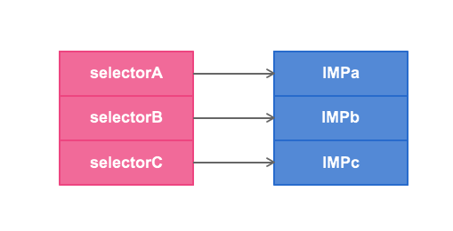
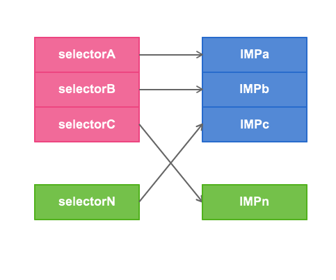

# 16.1 Method Swizzling介绍


## 原理

在Objective-C中调用一个方法，其实是向一个对象发送消息，查找消息的唯一依据是selector的名字。利用Objective-C的动态特性，可以实现在运行时偷换selector对应的方法实现。 

* 每个类都有一个方法列表，存放着selector的名字和方法实现的映射关系。IMP有点类似函数指针，指向具体的Method实现。 
* 我们可以利用 method_exchangeImplementations 来交换2个方法中的IMP， 
* 我们可以利用 class_replaceMethod 来修改类， 
* 我们可以利用 method_setImplementation 来直接设置某个方法的IMP， 
* 通过上边的方法，可以把类的调度表（dispatch table）中选择器到最终函数间的映射关系 替换。就相当于把IMP 的只想替换了。


>在Objective-C中调用一个方法，其实是向一个对象发送消息，查找消息的唯一依据是selector的名字。利用Objective-C的动态特性，可以实现在运行时偷换selector对应的方法实现，达到给方法挂钩的目的。
每个类都有一个方法列表，存放着selector的名字和方法实现的映射关系。IMP有点类似函数指针，指向具体的Method实现。




> 我们可以利用 method_exchangeImplementations 来交换2个方法中的IMP，

>我们可以利用 class_replaceMethod 来修改类，

>我们可以利用 method_setImplementation 来直接设置某个方法的IMP，
>……
>归根结底，都是偷换了selector的IMP，如下图所示：




##  实践

* swizzling 需要在 ```+ (void)load{} ```中使用

* swizzling 需要保证只执行一次。 需要使用 dispatch_once;


* Method Swizzling永远应该在+load方法中完成

```
	+initialize，仅会在该类的方法或者它的实例第一次被调用前，+initialize 方法被调用。即它有可能不被调用。 
	+load 方法会在main 函数运行前调用，每个类、分类的load 方法都会被调用。被调用时，所有的 framework 都已经加载到了运行时中（但有的类可能还未加载）。在一个类的 load 方法中调用其他类的方法，如果被调用的类还未load，并不会触发被调用的类的load 方法。

```

#### 案例

```
#import <objc/runtime.h>

@implementation UIViewController (Tracking)

+ (void)load {
    static dispatch_once_t onceToken;
    dispatch_once(&onceToken, ^{
        Class class = [self class];

        SEL originalSelector = @selector(viewWillAppear:);
        SEL swizzledSelector = @selector(xxx_viewWillAppear:);

        Method originalMethod = class_getInstanceMethod(class, originalSelector);
        Method swizzledMethod = class_getInstanceMethod(class, swizzledSelector);

        // When swizzling a class method, use the following:
        // Class class = object_getClass((id)self);
        // ...
        // Method originalMethod = class_getClassMethod(class, originalSelector);
        // Method swizzledMethod = class_getClassMethod(class, swizzledSelector);

        BOOL didAddMethod =
            class_addMethod(class,
                originalSelector,
                method_getImplementation(swizzledMethod),
                method_getTypeEncoding(swizzledMethod));

        if (didAddMethod) {
            class_replaceMethod(class,
                swizzledSelector,
                method_getImplementation(originalMethod),
                method_getTypeEncoding(originalMethod));
        } else {
            method_exchangeImplementations(originalMethod, swizzledMethod);
        }
    });
}

#pragma mark - Method Swizzling

- (void)xxx_viewWillAppear:(BOOL)animated {
    [self xxx_viewWillAppear:animated];
    NSLog(@"viewWillAppear: %@", self);
}

@end


```

上面是一个通用的方式，会先尝试添加要hook的Method（以swizzledMethod的IMP），如果添加成功，再把swizzledSelector的实现替换为originalMethod的，这样就完成了两个方法实现的互换。如果添加失败（即该class 已经存在对应Method），则直接交换两个Method的实现。

对于UIViewController 这样的已经确定有viewWillAppear: 方法的类，当然可以偷懒直接使用method_exchangeImplementations 来完成，但还是以上面的方式更为严谨。


