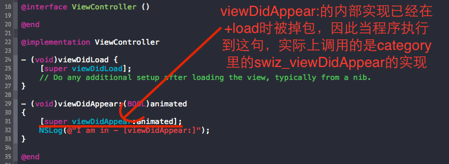

# 16.3 Method Swizzling应用


### Method Swizzling以及AOP编程：在运行时进行代码注入


####目的

>假设工程中有很多ViewController，我需要你统计每个页面间跳转的次数。要求：对原工程的改动越少越好。
>


#### 方案一：

　　在每个ViewController的 ```viewWillAppear``` 或者 ```viewDidAppear```方法中对记录跳转次数的某个全局变量(设为 g_viewTransCount )进行计数自增，代码应该是这样的：
　
　

```
- (void)viewDidAppear:(BOOL)animated
{
    [super viewDidAppear:animated];
    g_viewTransCount++;
}

```

每个ViewController类中都需要做此操作，显然不合适。因为跳转次数统计这种业务与APP的主业务并没有强关联，上面的代码会造成耦合度过高。随着APP业务的不断扩大，代码中这样的杂质代码会越来越大，维护也越来越困难。而且该方案也违背了我们的要求：对原工程的改动越少越好。因此方案一是个很差的方法


#### 方案二：

有没有某种方法可以不用对每个ViewCotroller都修改呢？有！让每个ViewController都继承某个新的ViewController(设为BaseViewController)，然后将统计的代码放到BaseViewCotroller的 viewWillAppear或者viewDidAppear中。这种方案看似较合理，但有以下弊端：

* 继承自BaseViewCotroller的ViewController中仍旧需要显式调用 ```[super viewDidAppear:animated]```; 


* 需要到所有ViewController的头文件中更改其superClass为BaseViewController

方案二虽然相比方案一少一些看得到的“代码杂质”，但对工程的改动同样是巨大的，尤其当工程比较庞大时。


####  方案三

Method Swizzling有哪些优势

* 不需要改动现有工程的任何文件

* 本次统计的代码可复用给其他工程

在工程中新建一个UIViewController的category：

```
#import "UIViewController+swizzling.h"
#import <objc/runtime.h>
 
@implementation UIViewController (swizzling)
 
+ (void)load
{
    SEL origSel = @selector(viewDidAppear:);
    SEL swizSel = @selector(swiz_viewDidAppear:);
    [UIViewController swizzleMethods:[self class] originalSelector:origSel swizzledSelector:swizSel];
}
 
//exchange implementation of two methods
+ (void)swizzleMethods:(Class)class originalSelector:(SEL)origSel swizzledSelector:(SEL)swizSel
{
    Method origMethod = class_getInstanceMethod(class, origSel);
    Method swizMethod = class_getInstanceMethod(class, swizSel);
     
    //class_addMethod will fail if original method already exists
    BOOL didAddMethod = class_addMethod(class, origSel, method_getImplementation(swizMethod), method_getTypeEncoding(swizMethod));
    if (didAddMethod) {
        class_replaceMethod(class, swizSel, method_getImplementation(origMethod), method_getTypeEncoding(origMethod));
    } else {
        //origMethod and swizMethod already exist
        method_exchangeImplementations(origMethod, swizMethod);
    }
}
 
- (void)swiz_viewDidAppear:(BOOL)animated
{
    NSLog(@"I am in - [swiz_viewDidAppear:]");
    //handle viewController transistion counting here, before ViewController instance calls its -[viewDidAppear:] method
    //需要注入的代码写在此处
    [self swiz_viewDidAppear:animated];
}
 
@end

```


上述代码做了这么一件事：在UIViewController的viewDidAppear:方法调用前插入了跳页计数处理，这一切都在运行时完成。对于上述代码有以下几处需要介绍的：

*  ```+ (void)load``` 方法是一个类方法，当某个类的代码被读到内存后，runtime会给每个类发送 ```+ (void)load``` 消息。因此 ```+ (void)load ```方法是一个调用时机相当早的方法，而且不管父类还是子类，其``` + (void)load``` 方法都会被调用到，很适合用来插入swizzling方法

*  最核心的代码要数 ```+ (void)swizzleMethods:(Class)class originalSelector:(SEL)origSel swizzledSelector:(SEL)swizSel``` 了。从函数签名可以看出，该函数是为了交换两个方法内部实现。将目光移到Line23，交换两个方法的内部实现主要依靠两个runtime API:

```

class_replaceMethod(class, swizSel, method_getImplementation(origMethod), method_getTypeEncoding(origMethod));
method_exchangeImplementations(origMethod, swizMethod);


```

```- (void)swiz_viewDidAppear:(BOOL)animated``` 函数看起来像死循环，实际上不会的。原因请看我在下图的注释：



打印结果

```
I am in - [swiz_viewDidAppear:]

I am in - [viewDidAppear:]

```

以上的method swizzling可以应用于iOS的任何类中对其进行代码注入，并且丝毫不影响现有工程的代码。例如，我再举个例子(没办法，我就是喜欢举例子，但我无非是想让你掌握的更多一些)。你想统计整个工程中所有按钮的点击事件的次数，也就是touchUpInside event发生的次数。刚开始你可能会觉得稍微有些没有头绪，因为注入代码的“切入点”相比于UIViewController的viewDidLoad等方法而言不是那么好找。这时候如果你能仔细考虑以下问题或许能找到思路：

* touchUpInside event发送给什么对象？
* 该对象本通过什么途径接受这个消息？

第一个问题很好回答，event是发送给UIButton实例，本质上是发送给UIControl实例；

第二个问题你不懂的话就去看看UIControl的头文件找找线索，于是在头文件中我们找到这样一个函数：

```
- (void)sendAction:(SEL)action to:(id)target forEvent:(UIEvent *)event;

```

看起来很靠近我们的需求， 事实上的确如此。这要从iOS的事件传递机制说起，当你在iOS设备上触摸一个点时这个触摸动作被包装成一个UIEvent按照UIApplication->UIWindow->UIView的顺序传递下去，当发现最后的接受者是UIControl时就会发送上述消息。因此，我们可以对sendAction:方法进行swizzling代码注入来达到统计按钮点击次数的目的。更深入一些，则需要针对不同的action、target、event的状态进行判断，以达到更精准的统计。


#### AOP编程以及Aspect库

Aspect库是对面向切面编程(Aspect Oriented Programming)的实现，里面封装了Runtime的方法，也封装了上文的Method Swizzling方法。因此我们也可以看到，Method Swizzling也是AOP编程的一种。Aspect的用途很广泛，这里不具体展开，想了解更多的可以看一下官方github的介绍，已经够详细了。这里我们只介绍其基础应用。Aspect只提供了两个接口：


```
+ (id<AspectToken>)aspect_hookSelector:(SEL)selector
                      withOptions:(AspectOptions)options
                       usingBlock:(id)block
                            error:(NSError **)error {
    return aspect_add((id)self, selector, options, block, error);
}
 
/// @return A token which allows to later deregister the aspect.
- (id<AspectToken>)aspect_hookSelector:(SEL)selector
                      withOptions:(AspectOptions)options
                       usingBlock:(id)block
                            error:(NSError **)error {
    return aspect_add(self, selector, options, block, error);
}

```

使用起来也非常方便，使用Aspect对本文最初提出的需求“统计每个页面间跳转的次数”进行改造，代码变成这样子：

 ```
 [UIViewController aspect_hookSelector:@selector(viewDidLoad)
                              withOptions:AspectPositionBefore
                               usingBlock:^(id<AspectInfo> info){
                                   g_viewTransCount++
                                   NSLog(@"[ASPECT] inject in class instance:%@", [info instance]);
                               }
                                    error:NULL];
 ```
 
 将以上代码放到AppDelegate的 didFinishLaunchingWithOptions 函数最开始处即可，你可以参考我在文末贴出的代码，使用一个专门的管理类来管理这些AOP代码。

相比于上半部分的原始Method Swizzling代码，使用Aspect有以下好处：

* 原则上不需要新建任何文件。这点很好理解，原始Method Swizzling需要新建category文件，当代码注入的需要较多时会出现过多的文件以及冗余代码。
* 可以对类的实例进行代码注入，因为Aspect提供了实例方法以及类方法


###  数组越界问题 ，空值 。导致程序崩溃的问题。

* 方法一 通过分类添加安全的索引方法 ：

```
@implementation UIView (safe)
- (BOOL)containsObjectAtIndex:(NSInteger)index {
    return index >= 0 && index <self.count;
}
- (id)objectNilAtIndex:(NSInteger)index{
    return [self containsObjectAtIndex:index] ? [self objectAtIndex:index] : nil;
}
@end


```

* 第二种方法。使用Method sizzling

```

	+ (void)load{
	static dispatch_once_t onceToken;
	dispatch_once(&onceToken, ^{
	    @autoreleasepool {
	        [objc_getClass("__NSArray0") swizzleMethod:@selector(objectAtIndex:) swizzledSelector:@selector(emptyObjectIndex:)];
	        [objc_getClass("__NSArrayI") swizzleMethod:@selector(objectAtIndex:) swizzledSelector:@selector(arrObjectIndex:)];
	        [objc_getClass("__NSArrayM") swizzleMethod:@selector(objectAtIndex:) swizzledSelector:@selector(mutableObjectIndex:)];
	        [objc_getClass("__NSArrayM") swizzleMethod:@selector(insertObject:atIndex:) swizzledSelector:@selector(mutableInsertObject:atIndex:)];
	    }
	});
	}

```

写在 NSArray的类目里边

```
	- (id)emptyObjectIndex:(NSInteger)index{
	return nil;}
	
	- (id)arrObjectIndex:(NSInteger)index{
	if (index >= self.count || index < 0) {
	    return nil;
	return [self arrObjectIndex:index];
	}
	
	- (id)mutableObjectIndex:(NSInteger)index{
	if (index >= self.count || index < 0) {
	    return nil;
	}
	    return [self mutableObjectIndex:index];
	}
	
	- (void)mutableInsertObject:(id)object atIndex:(NSUInteger)index{
	if (object) {
	    [self mutableInsertObject:object atIndex:index];
	   }
	 }
	
	
	@implementation NSDictionary (FlyElephant)
	+ (void)load{
	static dispatch_once_t onceToken;
	dispatch_once(&onceToken, ^{
	    @autoreleasepool {
	        [objc_getClass("__NSDictionaryM") swizzleMethod:@selector(setObject:forKey:) swizzledSelector:@selector(mutableSetObject:forKey:)];
	        }
	    });
	}
	- (void)mutableSetObject:(id)obj forKey:(NSString *)key{
	if (obj && key) {
	    [self mutableSetObject:obj forKey:key];
	    }
	}@end


```


* 这里NSArray0表示一般空数组，NSArrayI表示一般数组，__NSArrayM可变数组，NSArray和NSMutableArray相当于工厂，最终实现通过上面三个类进行实现的，有兴趣的可以自行了解一下类簇.


```
- (void)swizzleMethod:(SEL)originalSelector swizzledSelector:(SEL)swizzledSelector{
Class class = [self class];

Method originalMethod = class_getInstanceMethod(class, originalSelector);
Method swizzledMethod = class_getInstanceMethod(class, swizzledSelector);

BOOL didAddMethod = class_addMethod(class,
                                    originalSelector,
                                    method_getImplementation(swizzledMethod),
                                    method_getTypeEncoding(swizzledMethod));

if (didAddMethod) {
    class_replaceMethod(class,
                        swizzledSelector,
                        method_getImplementation(originalMethod),
                        method_getTypeEncoding(originalMethod));
} else {
    method_exchangeImplementations(originalMethod, swizzledMethod);
    }
}

```

上边是 交换方法的封装，可以直接copy拿走直接使用。

通过Runtime进行对数组字典进行方法交换之后，有可能出现不明所以的崩溃 message sent to deallocated instance 0x1459e0600**

通过Runtime进行对数组字典进行方法交换之后，之前对键盘输入的场景没有完全弄清楚，完整过程应该是，文本框输入文字→Home键进入后台→点击App图标重新进入→崩溃，有的时候前两步就直接崩溃了，因此Runtime的这个文件需要通过mrc管理:

一般项目都是 ARC 模式，需要单独问Runtime的这个问题添加MRC支持， 
Build Phases -> Compile Sources找到文件设置 -fno-objc-arc 标签。

如果项目是MRC 模式，则为 ARC 模式的代码文件加入 -fobjc-arc 标签. 
同时可以为相应的代码块添加autoreleasepool：

```
@autoreleasepool {
    if (index >= self.count || index < 0) {
        return nil;
    }
    return [self arrObjectIndex:index];
}   

```


特别说明

* 第一种方法。小团队使用， 人少，新员工 入职需要写说明文档。对苹果原生支持不够。 

* 第二种方法。 多人团队使用。新入职员工，无需说明文档。可以直接调用原生API 。对苹果支持 度高。可扩展性高


### unrecognized selector sent to class会导致APP崩溃。 要想APP 健壮

* 动态方法决议（Dynamic Method Resolution）。
* 和消息转发机制（Message Forwarding）。

```
- (NSMethodSignature *)methodSignatureForSelector:(SEL)sel {
NSMethodSignature *signature = [super methodSignatureForSelector:sel];

if (!signature) {
    NSLog(@"*******%@ - %@ ***un reconize selector %s!",NSStringFromClass([self class]),NSStringFromSelector(sel),__func__);
    signature = [NSMethodSignature signatureWithObjCTypes:@encode(void)];
}
return signature;
}
- (void)forwardInvocation:(NSInvocation *)invocation {

- }

```


###  NSUserDefaults中的数据加密

每个调用NSUserDefaults读写方法的位置，加入加密解密方法也太麻烦。所以想重写NSUserDefaults的读写方法，把加密解密方法内嵌其中，这样修改代码量会大大减小。

```
#import <Foundation/Foundation.h>
 
@interface NSUserDefaults (Swizzle)
 
-(void)swizzleSetObject:(nullable id) value forKey:(nullable NSString *)defaultName;
-(nullable id)swizzleObjectForKey:(NSString *)defaultName;
 
@end

```


```
#import "NSUserDefaults+Swizzle.h"
#import "WFTTripleDES.h"
@implementation NSUserDefaults (Swizzle)
 
-(void)swizzleSetObject:(nullable id) value forKey:(nullable NSString *)defaultName
{
    if ([value isKindOfClass:[NSString class]]) {
        //加密后写入
        [self swizzleSetObject:[WFTTripleDES TripleDES:value encryptOrDecrypt:kCCEncrypt key:[NSString stringWithFormat:@"2016012031009%@",defaultName] ] forKey:defaultName];
    }else{
        [self swizzleSetObject:value forKey:defaultName];
    }
}
 
-(nullable id)swizzleObjectForKey:(NSString *)defaultName;
{
    //如果键值为空直接返回
    if (!defaultName) {
        return @"";
    }
    
    id  getObject = [self swizzleObjectForKey:defaultName];
    if ([getObject isKindOfClass:[NSString class]]) {
        //把结果解密
        return [WFTTripleDES TripleDES:getObject encryptOrDecrypt:kCCDecrypt key:[NSString stringWithFormat:@"2016012031009%@",defaultName]];
    }else{
        return getObject;
    }
}
@end


```


