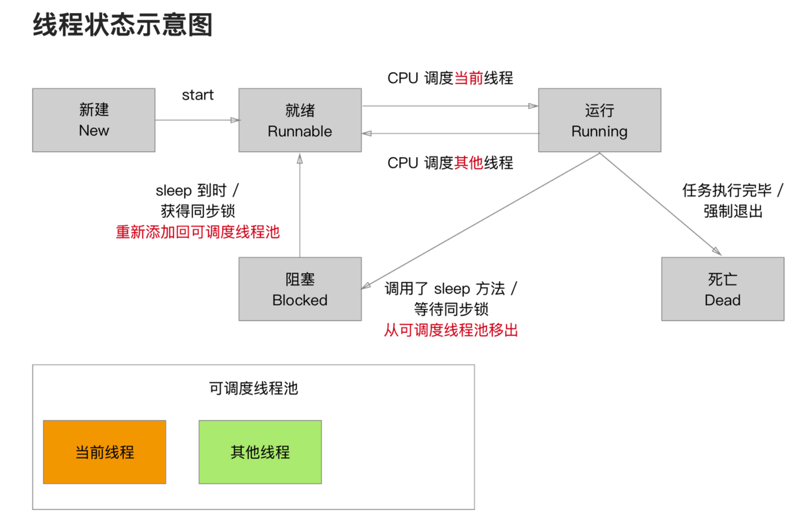

# 5.1 线程与进程

### 多线程的基本概念

* 进程：可以理解成一个运行中的应用程序，是系统进行资源分配和调度的基本单位，是操作系统结构的基础，主要管理资源。

* 线程：是进程的基本执行单元，一个进程对应多个线程。

* 主线程：处理UI，所有更新UI的操作都必须在主线程上执行。不要把耗时操作放在主线程，会卡界面。

* 多线程：在同一时刻，一个CPU只能处理1条线程，但CPU可以在多条线程之间快速的切换，只要切换的足够快，就造成了多线程一同执行的假象。

* 线程就像火车的一节车厢，进程则是火车。车厢（线程）离开火车（进程）是无法跑动的，而火车（进程）至少有一节车厢（主线程）。多线程可以看做多个车厢，它的出现是为了提高效率。

* 多线程是通过提高资源使用率来提高系统总体的效率。

* 我们运用多线程的目的是：将耗时的操作放在后台执行！

### 线程的状态与生命周期

* 从图中可以看出线程的生命周期是：新建 - 就绪 - 运行 - 阻塞 - 死亡

下面分别阐述线程生命周期中的每一步

* 新建：实例化线程对象
* 就绪：向线程对象发送start消息，线程对象被加入可调度线程池等待CPU调度。
* 运行：CPU 负责调度可调度线程池中线程的执行。线程执行完成之前，状态可能会在就绪和运行之间来回切换。就绪和运行之间的状态变化由CPU负责，程序员不能干预。
* 阻塞：当满足某个预定条件时，可以使用休眠或锁，阻塞线程执行。sleepForTimeInterval（休眠指定时长），sleepUntilDate（休眠到指定日期），@synchronized(self)：（互斥锁）。
* 死亡：正常死亡，线程执行完毕。非正常死亡，当满足某个条件后，在线程内部中止执行/在主线程中止线程对象
* 还有线程的exit和cancel
* [NSThread exit]：一旦强行终止线程，后续的所有代码都不会被执行。
* [thread cancel]取消：并不会直接取消线程，只是给线程对象添加 isCancelled 标记。

