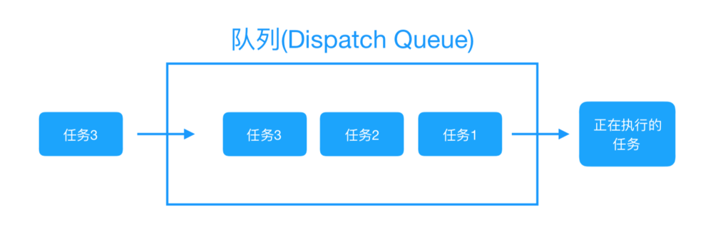
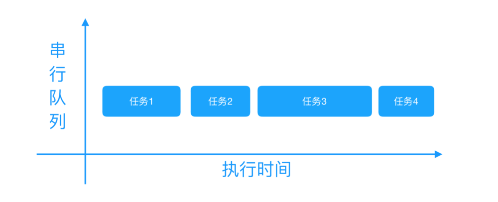
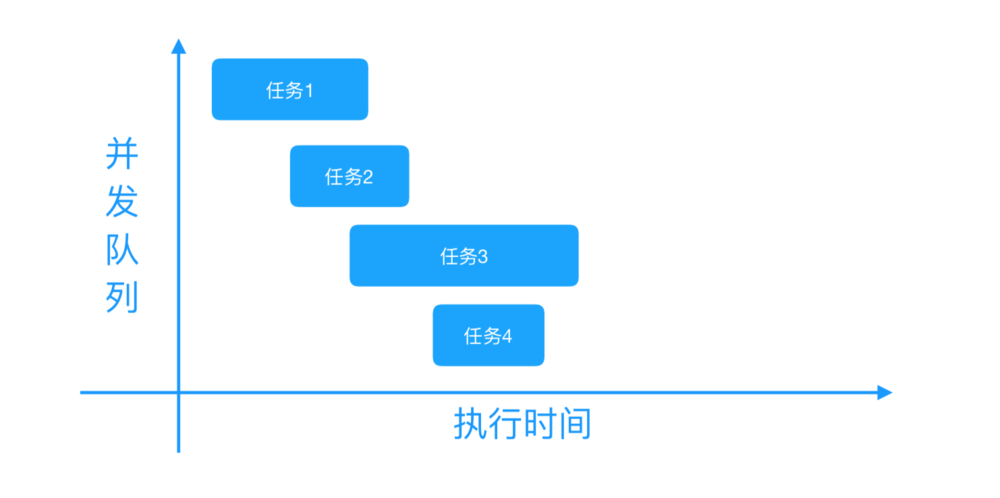
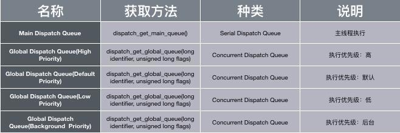
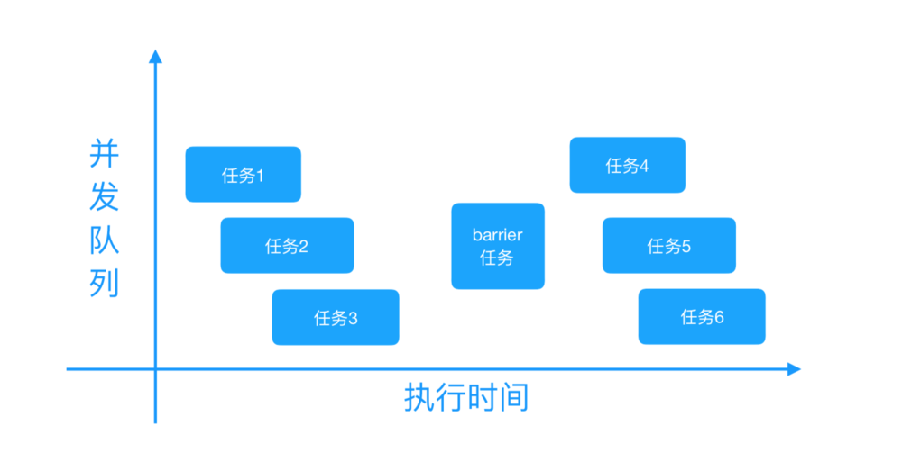

# 4.4 GCD


##  介绍

> Grand Central Dispatch(GCD) 是 Apple 开发的一个多核编程的较新的解决方法。它主要用于优化应用程序以支持多核处理器以及其他对称多处理系统。它是一个在线程池模式的基础上执行的并发任务。在 Mac OS X 10.6 雪豹中首次推出，也可在 iOS 4 及以上版本使用。


* GCD用处

	* GCD 可用于多核的并行运算
	* GCD 会自动利用更多的 CPU 内核（比如双核、四核）
	* GCD 会自动管理线程的生命周期（创建线程、调度任务、销毁线程）
	* 程序员只需要告诉 GCD 想要执行什么任务，不需要编写任何线程管理代码


## GCD实现原理

GCD有一个底层线程池，这个池中存放的是一个个的线程。之所以称为“池”，很容易理解出这个“池”中的线程是可以重用的，当一段时间后这个线程没有被调用胡话，这个线程就会被销毁。注意：开多少条线程是由底层线程池决定的（线程建议控制再3~5条），池是系统自动来维护，不需要我们程序员来维护（看到这句话是不是很开心？）

而我们程序员需要关心的是什么呢？我们只关心的是向队列中添加任务，队列调度即可。

    • 如果队列中存放的是同步任务，则任务出队后，底层线程池中会提供一条线程供这个任务执行，任务执行完毕后这条线程再回到线程池。这样队列中的任务反复调度，因为是同步的，所以当我们用currentThread打印的时候，就是同一条线程。

    • 如果队列中存放的是异步的任务，（注意异步可以开线程），当任务出队后，底层线程池会提供一个线程供任务执行，因为是异步执行，队列中的任务不需等待当前任务执行完毕就可以调度下一个任务，这时底层线程池中会再次提供一个线程供第二个任务执行，执行完毕后再回到底层线程池中。

    • 这样就对线程完成一个复用，而不需要每一个任务执行都开启新的线程，也就从而节约的系统的开销，提高了效率。在iOS7.0的时候，使用GCD系统通常只能开5~8条线程，iOS8.0以后，系统可以开启很多条线程，但是实在开发应用中，建议开启线程条数：3~5条最为合理。


## GCD 任务和队列

GCD 中两个核心概念：任务和队列

#### 任务
> 任务：就是执行操作的意思，换句话说就是你在线程中执行的那段代码。在 GCD 中是放在 block 中的。执行任务有两种方式：同步执行``sync``和异步执行``async``。两者的主要区别是：是否等待队列的任务执行结束，以及是否具备开启新线程的能力。
> 

* 同步执行``sync``：

	* 同步添加任务到指定的队列中，在添加的任务执行结束之前，会一直等待，直到队列里面的任务完成之后再继续执行。
	
	* 只能在当前线程中执行任务，不具备开启新线程的能力。


* 异步执行``async``：

	* 异步添加任务到指定的队列中，它不会做任何等待，可以继续执行任务。
	
	* 可以在新的线程中执行任务，具备开启新线程的能力。


注意：异步执行``async``虽然具有开启新线程的能力，但是并不一定开启新线程。这跟任务所指定的队列类型有关（下面会讲）。


#### 队列
>队列（Dispatch Queue）：这里的队列指执行任务的等待队列，即用来存放任务的队列。队列是一种特殊的线性表，采用 FIFO（先进先出）的原则，即新任务总是被插入到队列的末尾，而读取任务的时候总是从队列的头部开始读取。每读取一个任务，则从队列中释放一个任务。队列的结构可参考下图：



在 GCD 中有两种队列：串行队列和并发队列。两者都符合 FIFO（先进先出）的原则。两者的主要区别是：执行顺序不同，以及开启线程数不同。

* 串行队列（Serial Dispatch Queue）：等待现在执行中处理结束再加入队列

	* 每次只有一个任务被执行。让任务一个接着一个地执行。（只开启一个线程，一个任务执行完毕后，再执行下一个任务）

	

```
dispatch_queue_t serial_queue = dispatch_queue_create("xxx", DISPATCH_QUEUE_SERIAL);
    dispatch_async(serial_queue, ^{
        NSLog(@"block 1");
    });
    dispatch_async(serial_queue, ^{
        NSLog(@"block 2");
    });
    dispatch_async(serial_queue, ^{
        NSLog(@"block 3");
    });
    dispatch_async(serial_queue, ^{
        NSLog(@"block 4");
    });

```

* 并发队列（Concurrent Dispatch Queue）：
	* 可以让多个任务并发（同时）执行。（可以开启多个线程，并且同时执行任务）

   * 注意：并发队列的并发功能只有在异步（dispatch_async）函数下才有效

   * 开辟线程是随机的，因为他们虽然是按顺序把任务提交给线程，但是因为不需要等待前一个任务执行，所以几乎是同时交给线程处理的。所以这里会使用多个线程，而具体线程数的多少由XNU内核决定。


   
   
```
dispatch_queue_t concurrent_queue = dispatch_queue_create("come.tanpei", DISPATCH_QUEUE_CONCURRENT);
    dispatch_async(concurrent_queue, ^{
        NSLog(@"block 1");
    });
    dispatch_async(concurrent_queue, ^{
        NSLog(@"block 2");
    });
    dispatch_async(concurrent_queue, ^{
        NSLog(@"block 3");
    });
    dispatch_async(concurrent_queue, ^{
        NSLog(@"block 4");
    });
```


##  GCD 的使用步骤

GCD 的使用步骤其实很简单，只有两步。

* 创建一个队列（串行队列或并发队列）
* 将任务追加到任务的等待队列中，然后系统就会根据任务类型执行任务（同步执行或异步执行）

### 队列的创建方法/获取方法

* 可以使用``dispatch_queue_create``来创建队列，需要传入两个参数，第一个参数表示队列的唯一标识符，用于 DEBUG，可为空，Dispatch Queue 的名称推荐使用应用程序 ID 这种逆序全程域名；第二个参数用来识别是串行队列还是并发队列。``DISPATCH_QUEUE_SERIAL`` 表示串行队列，``DISPATCH_QUEUE_CONCURRENT`` 表示并发队列。

```
// 串行队列的创建方法
dispatch_queue_t queue = dispatch_queue_create("net.testQueue", DISPATCH_QUEUE_SERIAL);
// 并发队列的创建方法
dispatch_queue_t queue = dispatch_queue_create("net.testQueue", DISPATCH_QUEUE_CONCURRENT);

```

* 可以获取系统给我们提供的队列。系统给我们提供了两种队列

	
	
	* GCD 提供了的一种特殊的串行队列：主队列（Main Dispatch Queue）。  
		* 可使用dispatch_get_main_queue()获得主队列。
		* 所有放在主队列中的任务，都会放到主线程中执行

		```
		// 主队列的获取方法  
		dispatch_queue_t queue = dispatch_get_main_queue();
		```


 * 对于并发队列，GCD 默认提供了全局并发队列（Global Dispatch Queue）。
	 * 可以使用dispatch_get_global_queue来获取。需要传入两个参数。第一个参数表示队列优先级，一般用``DISPATCH_QUEUE_PRIORITY_DEFAULT``。第二个参数暂时没用，用0即可

	 ```
	 // 全局并发队列的获取方法
dispatch_queue_t queue = dispatch_get_global_queue(DISPATCH_QUEUE_PRIORITY_DEFAULT, 0);
	 ```


###  任务的创建方法

GCD 提供了同步执行任务的创建方法``dispatch_sync``和异步执行任务创建方法``dispatch_async``。

```
// 同步执行任务创建方法
dispatch_sync(queue, ^{
    // 这里放同步执行任务代码
});
// 异步执行任务创建方法
dispatch_async(queue, ^{
    // 这里放异步执行任务代码
});

```


## GCD 的基本使用

### 同步执行 + 并发队列

* 在当前线程中执行任务，不会开启新线程，执行完一个任务，再执行下一个任务。

```
/**
 * 同步执行 + 并发队列
 * 特点：在当前线程中执行任务，不会开启新线程，执行完一个任务，再执行下一个任务。
 */
- (void)syncConcurrent {
    NSLog(@"currentThread---%@",[NSThread currentThread]);  // 打印当前线程
    NSLog(@"syncConcurrent---begin");
    
    dispatch_queue_t queue = dispatch_queue_create("net.bujige.testQueue", DISPATCH_QUEUE_CONCURRENT);
    
    dispatch_sync(queue, ^{
        // 追加任务1
        for (int i = 0; i < 2; ++i) {
            [NSThread sleepForTimeInterval:2];              // 模拟耗时操作
            NSLog(@"1---%@",[NSThread currentThread]);      // 打印当前线程
        }
    });
    
    dispatch_sync(queue, ^{
        // 追加任务2
        for (int i = 0; i < 2; ++i) {
            [NSThread sleepForTimeInterval:2];              // 模拟耗时操作
            NSLog(@"2---%@",[NSThread currentThread]);      // 打印当前线程
        }
    });
    
    dispatch_sync(queue, ^{
        // 追加任务3
        for (int i = 0; i < 2; ++i) {
            [NSThread sleepForTimeInterval:2];              // 模拟耗时操作
            NSLog(@"3---%@",[NSThread currentThread]);      // 打印当前线程
        }
    });
    
    NSLog(@"syncConcurrent---end");
}


```


```
输出结果：
2018-02-23 20:34:55.095932+0800 YSC-GCD-demo[19892:4996930] currentThread---<NSThread: 0x60400006bbc0>{number = 1, name = main}
2018-02-23 20:34:55.096086+0800 YSC-GCD-demo[19892:4996930] syncConcurrent---begin
2018-02-23 20:34:57.097589+0800 YSC-GCD-demo[19892:4996930] 1---<NSThread: 0x60400006bbc0>{number = 1, name = main}
2018-02-23 20:34:59.099100+0800 YSC-GCD-demo[19892:4996930] 1---<NSThread: 0x60400006bbc0>{number = 1, name = main}
2018-02-23 20:35:01.099843+0800 YSC-GCD-demo[19892:4996930] 2---<NSThread: 0x60400006bbc0>{number = 1, name = main}
2018-02-23 20:35:03.101171+0800 YSC-GCD-demo[19892:4996930] 2---<NSThread: 0x60400006bbc0>{number = 1, name = main}
2018-02-23 20:35:05.101750+0800 YSC-GCD-demo[19892:4996930] 3---<NSThread: 0x60400006bbc0>{number = 1, name = main}
2018-02-23 20:35:07.102414+0800 YSC-GCD-demo[19892:4996930] 3---<NSThread: 0x60400006bbc0>{number = 1, name = main}
2018-02-23 20:35:07.102575+0800 YSC-GCD-demo[19892:4996930] syncConcurrent---end


```


从``同步执行 + 并发队列``中可看到：

* 所有任务都是在当前线程（主线程）中执行的，没有开启新的线程（同步执行不具备开启新线程的能力）。
* 所有任务都在打印的syncConcurrent---begin和syncConcurrent---end之间执行的（同步任务需要等待队列的任务执行结束）。
* 任务按顺序执行的。按顺序执行的原因：虽然并发队列可以开启多个线程，并且同时执行多个任务。但是因为本身不能创建新线程，只有当前线程这一个线程（同步任务不具备开启新线程的能力），所以也就不存在并发。而且当前线程只有等待当前队列中正在执行的任务执行完毕之后，才能继续接着执行下面的操作（同步任务需要等待队列的任务执行结束）。所以任务只能一个接一个按顺序执行，不能同时被执行。


### 异步执行 + 并发队列
* 可以开启多个线程，任务交替（同时）执行。

```
/**
 * 异步执行 + 并发队列
 * 特点：可以开启多个线程，任务交替（同时）执行。
 */
- (void)asyncConcurrent {
    NSLog(@"currentThread---%@",[NSThread currentThread]);  // 打印当前线程
    NSLog(@"asyncConcurrent---begin");
    
    dispatch_queue_t queue = dispatch_queue_create("net.bujige.testQueue", DISPATCH_QUEUE_CONCURRENT);
    
    dispatch_async(queue, ^{
        // 追加任务1
        for (int i = 0; i < 2; ++i) {
            [NSThread sleepForTimeInterval:2];              // 模拟耗时操作
            NSLog(@"1---%@",[NSThread currentThread]);      // 打印当前线程
        }
    });
    
    dispatch_async(queue, ^{
        // 追加任务2
        for (int i = 0; i < 2; ++i) {
            [NSThread sleepForTimeInterval:2];              // 模拟耗时操作
            NSLog(@"2---%@",[NSThread currentThread]);      // 打印当前线程
        }
    });
    
    dispatch_async(queue, ^{
        // 追加任务3
        for (int i = 0; i < 2; ++i) {
            [NSThread sleepForTimeInterval:2];              // 模拟耗时操作
            NSLog(@"3---%@",[NSThread currentThread]);      // 打印当前线程
        }
    });
    
    NSLog(@"asyncConcurrent---end");
}

```


```
输出结果：
2018-02-23 20:36:41.769269+0800 YSC-GCD-demo[19929:5005237] currentThread---<NSThread: 0x604000062d80>{number = 1, name = main}
2018-02-23 20:36:41.769496+0800 YSC-GCD-demo[19929:5005237] asyncConcurrent---begin
2018-02-23 20:36:41.769725+0800 YSC-GCD-demo[19929:5005237] asyncConcurrent---end
2018-02-23 20:36:43.774442+0800 YSC-GCD-demo[19929:5005566] 2---<NSThread: 0x604000266f00>{number = 5, name = (null)}
2018-02-23 20:36:43.774440+0800 YSC-GCD-demo[19929:5005567] 3---<NSThread: 0x60000026f200>{number = 4, name = (null)}
2018-02-23 20:36:43.774440+0800 YSC-GCD-demo[19929:5005565] 1---<NSThread: 0x600000264800>{number = 3, name = (null)}
2018-02-23 20:36:45.779286+0800 YSC-GCD-demo[19929:5005567] 3---<NSThread: 0x60000026f200>{number = 4, name = (null)}
2018-02-23 20:36:45.779302+0800 YSC-GCD-demo[19929:5005565] 1---<NSThread: 0x600000264800>{number = 3, name = (null)}
2018-02-23 20:36:45.779286+0800 YSC-GCD-demo[19929:5005566] 2---<NSThread: 0x604000266f00>{number = 5, name = (null)}


```

在``异步执行 + 并发队列``中可以看出：

* 除了当前线程（主线程），系统又开启了3个线程，并且任务是交替/同时执行的。（异步执行具备开启新线程的能力。且并发队列可开启多个线程，同时执行多个任务）。
* 所有任务是在打印的syncConcurrent---begin和syncConcurrent---end之后才执行的。说明当前线程没有等待，而是直接开启了新线程，在新线程中执行任务（异步执行不做等待，可以继续执行任务）。


### 同步执行 + 串行队列

* 不会开启新线程，在当前线程执行任务。任务是串行的，执行完一个任务，再执行下一个任务。

```
/**
 * 同步执行 + 串行队列
 * 特点：不会开启新线程，在当前线程执行任务。任务是串行的，执行完一个任务，再执行下一个任务。
 */
- (void)syncSerial {
    NSLog(@"currentThread---%@",[NSThread currentThread]);  // 打印当前线程
    NSLog(@"syncSerial---begin");
    
    dispatch_queue_t queue = dispatch_queue_create("net.bujige.testQueue", DISPATCH_QUEUE_SERIAL);
    
    dispatch_sync(queue, ^{
        // 追加任务1
        for (int i = 0; i < 2; ++i) {
            [NSThread sleepForTimeInterval:2];              // 模拟耗时操作
            NSLog(@"1---%@",[NSThread currentThread]);      // 打印当前线程
        }
    });
    dispatch_sync(queue, ^{
        // 追加任务2
        for (int i = 0; i < 2; ++i) {
            [NSThread sleepForTimeInterval:2];              // 模拟耗时操作
            NSLog(@"2---%@",[NSThread currentThread]);      // 打印当前线程
        }
    });
    dispatch_sync(queue, ^{
        // 追加任务3
        for (int i = 0; i < 2; ++i) {
            [NSThread sleepForTimeInterval:2];              // 模拟耗时操作
            NSLog(@"3---%@",[NSThread currentThread]);      // 打印当前线程
        }
    });
    
    NSLog(@"syncSerial---end");
}


```

```
输出结果为：
2018-02-23 20:39:37.876811+0800 YSC-GCD-demo[19975:5017162] currentThread---<NSThread: 0x604000079400>{number = 1, name = main}
2018-02-23 20:39:37.876998+0800 YSC-GCD-demo[19975:5017162] syncSerial---begin
2018-02-23 20:39:39.878316+0800 YSC-GCD-demo[19975:5017162] 1---<NSThread: 0x604000079400>{number = 1, name = main}
2018-02-23 20:39:41.879829+0800 YSC-GCD-demo[19975:5017162] 1---<NSThread: 0x604000079400>{number = 1, name = main}
2018-02-23 20:39:43.880660+0800 YSC-GCD-demo[19975:5017162] 2---<NSThread: 0x604000079400>{number = 1, name = main}
2018-02-23 20:39:45.881265+0800 YSC-GCD-demo[19975:5017162] 2---<NSThread: 0x604000079400>{number = 1, name = main}
2018-02-23 20:39:47.882257+0800 YSC-GCD-demo[19975:5017162] 3---<NSThread: 0x604000079400>{number = 1, name = main}
2018-02-23 20:39:49.883008+0800 YSC-GCD-demo[19975:5017162] 3---<NSThread: 0x604000079400>{number = 1, name = main}
2018-02-23 20:39:49.883253+0800 YSC-GCD-demo[19975:5017162] syncSerial---end


```

在``同步执行 + 串行队列``可以看到：

* 所有任务都是在当前线程（主线程）中执行的，并没有开启新的线程（同步执行不具备开启新线程的能力）。
* 所有任务都在打印的syncConcurrent---begin和syncConcurrent---end之间执行（同步任务需要等待队列的任务执行结束）。
* 任务是按顺序执行的（串行队列每次只有一个任务被执行，任务一个接一个按顺序执行）。


### 异步执行 + 串行队列

* 会开启新线程，但是因为任务是串行的，执行完一个任务，再执行下一个任务

```
/**
 * 异步执行 + 串行队列
 * 特点：会开启新线程，但是因为任务是串行的，执行完一个任务，再执行下一个任务。
 */
- (void)asyncSerial {
    NSLog(@"currentThread---%@",[NSThread currentThread]);  // 打印当前线程
    NSLog(@"asyncSerial---begin");
    
    dispatch_queue_t queue = dispatch_queue_create("net.bujige.testQueue", DISPATCH_QUEUE_SERIAL);
    
    dispatch_async(queue, ^{
        // 追加任务1
        for (int i = 0; i < 2; ++i) {
            [NSThread sleepForTimeInterval:2];              // 模拟耗时操作
            NSLog(@"1---%@",[NSThread currentThread]);      // 打印当前线程
        }
    });
    dispatch_async(queue, ^{
        // 追加任务2
        for (int i = 0; i < 2; ++i) {
            [NSThread sleepForTimeInterval:2];              // 模拟耗时操作
            NSLog(@"2---%@",[NSThread currentThread]);      // 打印当前线程
        }
    });
    dispatch_async(queue, ^{
        // 追加任务3
        for (int i = 0; i < 2; ++i) {
            [NSThread sleepForTimeInterval:2];              // 模拟耗时操作
            NSLog(@"3---%@",[NSThread currentThread]);      // 打印当前线程
        }
    });
    
    NSLog(@"asyncSerial---end");
}


```


```
输出结果为：
2018-02-23 20:41:17.029999+0800 YSC-GCD-demo[20008:5024757] currentThread---<NSThread: 0x604000070440>{number = 1, name = main}
2018-02-23 20:41:17.030212+0800 YSC-GCD-demo[20008:5024757] asyncSerial---begin
2018-02-23 20:41:17.030364+0800 YSC-GCD-demo[20008:5024757] asyncSerial---end
2018-02-23 20:41:19.035379+0800 YSC-GCD-demo[20008:5024950] 1---<NSThread: 0x60000026e100>{number = 3, name = (null)}
2018-02-23 20:41:21.037140+0800 YSC-GCD-demo[20008:5024950] 1---<NSThread: 0x60000026e100>{number = 3, name = (null)}
2018-02-23 20:41:23.042220+0800 YSC-GCD-demo[20008:5024950] 2---<NSThread: 0x60000026e100>{number = 3, name = (null)}
2018-02-23 20:41:25.042971+0800 YSC-GCD-demo[20008:5024950] 2---<NSThread: 0x60000026e100>{number = 3, name = (null)}
2018-02-23 20:41:27.047690+0800 YSC-GCD-demo[20008:5024950] 3---<NSThread: 0x60000026e100>{number = 3, name = (null)}
2018-02-23 20:41:29.052327+0800 YSC-GCD-demo[20008:5024950] 3---<NSThread: 0x60000026e100>{number = 3, name = (null)}


```


在``异步执行 + 串行队列``可以看到：

* 开启了一条新线程（异步执行具备开启新线程的能力，串行队列只开启一个线程）。
* 所有任务是在打印的syncConcurrent---begin和syncConcurrent---end之后才开始执行的（异步执行不会做任何等待，可以继续执行任务）。
* 任务是按顺序执行的（串行队列每次只有一个任务被执行，任务一个接一个按顺序执行）。


###  主队列

主队列：GCD自带的一种特殊的串行队列

* 所有放在主队列中的任务，都会放到主线程中执行

* 可使用``dispatch_get_main_queue()``获得主队列


#### 同步执行 + 主队列   (在主线程中调用)

* 互相等待卡住不可行

```
/**
 * 同步执行 + 主队列
 * 特点(主线程调用)：互等卡主不执行。
 * 特点(其他线程调用)：不会开启新线程，执行完一个任务，再执行下一个任务。
 */
- (void)syncMain {
    
    NSLog(@"currentThread---%@",[NSThread currentThread]);  // 打印当前线程
    NSLog(@"syncMain---begin");
    
    dispatch_queue_t queue = dispatch_get_main_queue();
    
    dispatch_sync(queue, ^{
        // 追加任务1
        for (int i = 0; i < 2; ++i) {
            [NSThread sleepForTimeInterval:2];              // 模拟耗时操作
            NSLog(@"1---%@",[NSThread currentThread]);      // 打印当前线程
        }
    });
    
    dispatch_sync(queue, ^{
        // 追加任务2
        for (int i = 0; i < 2; ++i) {
            [NSThread sleepForTimeInterval:2];              // 模拟耗时操作
            NSLog(@"2---%@",[NSThread currentThread]);      // 打印当前线程
        }
    });
    
    dispatch_sync(queue, ^{
        // 追加任务3
        for (int i = 0; i < 2; ++i) {
            [NSThread sleepForTimeInterval:2];              // 模拟耗时操作
            NSLog(@"3---%@",[NSThread currentThread]);      // 打印当前线程
        }
    });
    
    NSLog(@"syncMain---end");
}


```

```
输出结果
2018-02-23 20:42:36.842892+0800 YSC-GCD-demo[20041:5030982] currentThread---<NSThread: 0x600000078a00>{number = 1, name = main}
2018-02-23 20:42:36.843050+0800 YSC-GCD-demo[20041:5030982] syncMain---begin
(lldb)


```

在``同步执行 + 主队列``可以惊奇的发现：


* 在主线程中使用同步执行 + 主队列，追加到主线程的任务1、任务2、任务3都不再执行了，而且syncMain---end也没有打印，在XCode 9上还会报崩溃。这是为什么呢？
* 这是因为我们在主线程中执行syncMain方法，相当于把syncMain任务放到了主线程的队列中。而同步执行会等待当前队列中的任务执行完毕，才会接着执行。那么当我们把任务1追加到主队列中，任务1就在等待主线程处理完syncMain任务。而syncMain任务需要等待任务1执行完毕，才能接着执行。
* 那么，现在的情况就是syncMain任务和任务1都在等对方执行完毕。这样大家互相等待，所以就卡住了，所以我们的任务执行不了，而且syncMain---end也没有打印。

* 产生死锁的话一般都是在串行队列中并且是在一个线程中同步往这个线程提交一个Block

* main_queue（主线程）中加入一个加入一个指定的Block，并等待其执行结束。而由于main_queue是一个串行队列，它要等当前线程中的任务处理完后才会把队列中的任务提交到主线程，而主线程又在等待这段代码执行，所以造成了相互等待，就产生了死锁。（而并发队列不会产生死锁）
如:

```
dispatch_queue_t global_queue = dispatch_get_global_queue(0, DISPATCH_QUEUE_PRIORITY_DEFAULT);
    dispatch_sync(global_queue, ^{
        NSLog(@"global_queue out");
        dispatch_sync(global_queue, ^{
            NSLog(@"global_queue in");
        });
    });
    
2017-09-27 16:11:56.332317+0800 aegewgr[4723:1590202] global_queue out
2017-09-27 16:11:56.332446+0800 aegewgr[4723:1590202] global_queue in

```


#### 同步执行 + 主队列  (在其他线程中调用)

* 不会开启新线程，执行完一个任务，再执行下一个任务

```
// 使用 NSThread 的 detachNewThreadSelector 方法会创建线程，并自动启动线程执行
 selector 任务
[NSThread detachNewThreadSelector:@selector(syncMain) toTarget:self withObject:nil];


```

```

输出结果：
2018-02-23 20:44:19.377321+0800 YSC-GCD-demo[20083:5040347] currentThread---<NSThread: 0x600000272fc0>{number = 3, name = (null)}
2018-02-23 20:44:19.377494+0800 YSC-GCD-demo[20083:5040347] syncMain---begin
2018-02-23 20:44:21.384716+0800 YSC-GCD-demo[20083:5040132] 1---<NSThread: 0x60000006c900>{number = 1, name = main}
2018-02-23 20:44:23.386091+0800 YSC-GCD-demo[20083:5040132] 1---<NSThread: 0x60000006c900>{number = 1, name = main}
2018-02-23 20:44:25.387687+0800 YSC-GCD-demo[20083:5040132] 2---<NSThread: 0x60000006c900>{number = 1, name = main}
2018-02-23 20:44:27.388648+0800 YSC-GCD-demo[20083:5040132] 2---<NSThread: 0x60000006c900>{number = 1, name = main}
2018-02-23 20:44:29.390459+0800 YSC-GCD-demo[20083:5040132] 3---<NSThread: 0x60000006c900>{number = 1, name = main}
2018-02-23 20:44:31.391965+0800 YSC-GCD-demo[20083:5040132] 3---<NSThread: 0x60000006c900>{number = 1, name = main}
2018-02-23 20:44:31.392513+0800 YSC-GCD-demo[20083:5040347] syncMain---end


```


在其他线程中使用``同步执行 + 主队列``可看到：

* 所有任务都是在主线程（非当前线程）中执行的，没有开启新的线程（所有放在主队列中的任务，都会放到主线程中执行）。
* 所有任务都在打印的syncConcurrent---begin和syncConcurrent---end之间执行（同步任务需要等待队列的任务执行结束）。
* 任务是按顺序执行的（主队列是串行队列，每次只有一个任务被执行，任务一个接一个按顺序执行）。


* 为什么现在就不会卡住了呢？因为syncMain 任务放到了其他线程里，而任务1、任务2、任务3都在追加到主队列中，这三个任务都会在主线程中执行。syncMain 任务在其他线程中执行到追加任务1到主队列中，因为主队列现在没有正在执行的任务，所以，会直接执行主队列的任务1，等任务1执行完毕，再接着执行任务2、任务3。所以这里不会卡住线程。


#### 异步执行 + 主队列

* 只在主线程中执行任务，执行完一个任务，再执行下一个任务。

```
/**
 * 异步执行 + 主队列
 * 特点：只在主线程中执行任务，执行完一个任务，再执行下一个任务
 */
- (void)asyncMain {
    NSLog(@"currentThread---%@",[NSThread currentThread]);  // 打印当前线程
    NSLog(@"asyncMain---begin");
    
    dispatch_queue_t queue = dispatch_get_main_queue();
    
    dispatch_async(queue, ^{
        // 追加任务1
        for (int i = 0; i < 2; ++i) {
            [NSThread sleepForTimeInterval:2];              // 模拟耗时操作
            NSLog(@"1---%@",[NSThread currentThread]);      // 打印当前线程
        }
    });
    
    dispatch_async(queue, ^{
        // 追加任务2
        for (int i = 0; i < 2; ++i) {
            [NSThread sleepForTimeInterval:2];              // 模拟耗时操作
            NSLog(@"2---%@",[NSThread currentThread]);      // 打印当前线程
        }
    });
    
    dispatch_async(queue, ^{
        // 追加任务3
        for (int i = 0; i < 2; ++i) {
            [NSThread sleepForTimeInterval:2];              // 模拟耗时操作
            NSLog(@"3---%@",[NSThread currentThread]);      // 打印当前线程
        }
    });
    
    NSLog(@"asyncMain---end");
}


```


```
输出结果：
2018-02-23 20:45:49.981505+0800 YSC-GCD-demo[20111:5046708] currentThread---<NSThread: 0x60000006d440>{number = 1, name = main}
2018-02-23 20:45:49.981935+0800 YSC-GCD-demo[20111:5046708] asyncMain---begin
2018-02-23 20:45:49.982352+0800 YSC-GCD-demo[20111:5046708] asyncMain---end
2018-02-23 20:45:51.991096+0800 YSC-GCD-demo[20111:5046708] 1---<NSThread: 0x60000006d440>{number = 1, name = main}
2018-02-23 20:45:53.991959+0800 YSC-GCD-demo[20111:5046708] 1---<NSThread: 0x60000006d440>{number = 1, name = main}
2018-02-23 20:45:55.992937+0800 YSC-GCD-demo[20111:5046708] 2---<NSThread: 0x60000006d440>{number = 1, name = main}
2018-02-23 20:45:57.993649+0800 YSC-GCD-demo[20111:5046708] 2---<NSThread: 0x60000006d440>{number = 1, name = main}
2018-02-23 20:45:59.994928+0800 YSC-GCD-demo[20111:5046708] 3---<NSThread: 0x60000006d440>{number = 1, name = main}
2018-02-23 20:46:01.995589+0800 YSC-GCD-demo[20111:5046708] 3---<NSThread: 0x60000006d440>{number = 1, name = main}

```

在``异步执行 + 主队列``可以看到：

* 所有任务都是在当前线程（主线程）中执行的，并没有开启新的线程（虽然异步执行具备开启线程的能力，但因为是主队列，所以所有任务都在主线程中）。
* 所有任务是在打印的syncConcurrent---begin和syncConcurrent---end之后才开始执行的（异步执行不会做任何等待，可以继续执行任务）。
* 任务是按顺序执行的（因为主队列是串行队列，每次只有一个任务被执行，任务一个接一个按顺序执行）。


## GCD 线程间的通信

在iOS开发过程中，我们一般在主线程里边进行UI刷新，例如：点击、滚动、拖拽等事件。我们通常把一些耗时的操作放在其他线程，比如说图片下载、文件上传等耗时操作。而当我们有时候在其他线程完成了耗时操作时，需要回到主线程，那么就用到了线程之间的通讯。

```
/**
 * 线程间通信
 */
- (void)communication {
    // 获取全局并发队列
    dispatch_queue_t queue = dispatch_get_global_queue(DISPATCH_QUEUE_PRIORITY_DEFAULT, 0); 
    // 获取主队列
    dispatch_queue_t mainQueue = dispatch_get_main_queue(); 
    
    dispatch_async(queue, ^{
        // 异步追加任务
        for (int i = 0; i < 2; ++i) {
            [NSThread sleepForTimeInterval:2];              // 模拟耗时操作
            NSLog(@"1---%@",[NSThread currentThread]);      // 打印当前线程
        }
        
        // 回到主线程
        dispatch_async(mainQueue, ^{
            // 追加在主线程中执行的任务
            [NSThread sleepForTimeInterval:2];              // 模拟耗时操作
            NSLog(@"2---%@",[NSThread currentThread]);      // 打印当前线程
        });
    });
}


```


```
输出结果：
2018-02-23 20:47:03.462394+0800 YSC-GCD-demo[20154:5053282] 1---<NSThread: 0x600000271940>{number = 3, name = (null)}
2018-02-23 20:47:05.465912+0800 YSC-GCD-demo[20154:5053282] 1---<NSThread: 0x600000271940>{number = 3, name = (null)}
2018-02-23 20:47:07.466657+0800 YSC-GCD-demo[20154:5052953] 2---<NSThread: 0x60000007bf80>{number = 1, name = main}


```


###  GCD 栅栏方法：``dispatch_barrier_async``


我们有时需要异步执行两组操作，而且第一组操作执行完之后，才能开始执行第二组操作。这样我们就需要一个相当于栅栏一样的一个方法将两组异步执行的操作组给分割起来，当然这里的操作组里可以包含一个或多个任务。这就需要用到dispatch_barrier_async方法在两个操作组间形成栅栏。
dispatch_barrier_async函数会等待前边追加到并发队列中的任务全部执行完毕之后，再将指定的任务追加到该异步队列中。然后在dispatch_barrier_async函数追加的任务执行完毕之后，异步队列才恢复为一般动作，接着追加任务到该异步队列并开始执行。具体如下图所示：



```
/**
 * 栅栏方法 dispatch_barrier_async
 */
- (void)barrier {
    dispatch_queue_t queue = dispatch_queue_create("net.bujige.testQueue", DISPATCH_QUEUE_CONCURRENT);
    
    dispatch_async(queue, ^{
        // 追加任务1
        for (int i = 0; i < 2; ++i) {
            [NSThread sleepForTimeInterval:2];              // 模拟耗时操作
            NSLog(@"1---%@",[NSThread currentThread]);      // 打印当前线程
        }
    });
    dispatch_async(queue, ^{
        // 追加任务2
        for (int i = 0; i < 2; ++i) {
            [NSThread sleepForTimeInterval:2];              // 模拟耗时操作
            NSLog(@"2---%@",[NSThread currentThread]);      // 打印当前线程
        }
    });
    
    dispatch_barrier_async(queue, ^{
        // 追加任务 barrier
        for (int i = 0; i < 2; ++i) {
            [NSThread sleepForTimeInterval:2];              // 模拟耗时操作
            NSLog(@"barrier---%@",[NSThread currentThread]);// 打印当前线程
        }
    });
    
    dispatch_async(queue, ^{
        // 追加任务3
        for (int i = 0; i < 2; ++i) {
            [NSThread sleepForTimeInterval:2];              // 模拟耗时操作
            NSLog(@"3---%@",[NSThread currentThread]);      // 打印当前线程
        }
    });
    dispatch_async(queue, ^{
        // 追加任务4
        for (int i = 0; i < 2; ++i) {
            [NSThread sleepForTimeInterval:2];              // 模拟耗时操作
            NSLog(@"4---%@",[NSThread currentThread]);      // 打印当前线程
        }
    });
}


```


```
输出结果：
2018-02-23 20:48:18.297745+0800 YSC-GCD-demo[20188:5059274] 1---<NSThread: 0x600000079d80>{number = 4, name = (null)}
2018-02-23 20:48:18.297745+0800 YSC-GCD-demo[20188:5059273] 2---<NSThread: 0x600000079e00>{number = 3, name = (null)}
2018-02-23 20:48:20.301139+0800 YSC-GCD-demo[20188:5059274] 1---<NSThread: 0x600000079d80>{number = 4, name = (null)}
2018-02-23 20:48:20.301139+0800 YSC-GCD-demo[20188:5059273] 2---<NSThread: 0x600000079e00>{number = 3, name = (null)}
2018-02-23 20:48:22.306290+0800 YSC-GCD-demo[20188:5059274] barrier---<NSThread: 0x600000079d80>{number = 4, name = (null)}
2018-02-23 20:48:24.311655+0800 YSC-GCD-demo[20188:5059274] barrier---<NSThread: 0x600000079d80>{number = 4, name = (null)}
2018-02-23 20:48:26.316943+0800 YSC-GCD-demo[20188:5059273] 4---<NSThread: 0x600000079e00>{number = 3, name = (null)}
2018-02-23 20:48:26.316956+0800 YSC-GCD-demo[20188:5059274] 3---<NSThread: 0x600000079d80>{number = 4, name = (null)}
2018-02-23 20:48:28.320660+0800 YSC-GCD-demo[20188:5059273] 4---<NSThread: 0x600000079e00>{number = 3, name = (null)}
2018-02-23 20:48:28.320649+0800 YSC-GCD-demo[20188:5059274] 3---<NSThread: 0x600000079d80>{number = 4, name = (null)}


```

在``dispatch_barrier_async``执行结果中可以看出：

* 在执行完栅栏前面的操作之后，才执行栅栏操作，最后再执行栅栏后边的操作。


### GCD 延时执行方法：dispatch_after

我们经常会遇到这样的需求：在指定时间（例如3秒）之后执行某个任务。可以用 GCD 的dispatch_after函数来实现。
需要注意的是：dispatch_after函数并不是在指定时间之后才开始执行处理，而是在指定时间之后将任务追加到主队列中。严格来说，这个时间并不是绝对准确的，但想要大致延迟执行任务，dispatch_after函数是很有效的。

```
/**
 * 延时执行方法 dispatch_after
 */
- (void)after {
    NSLog(@"currentThread---%@",[NSThread currentThread]);  // 打印当前线程
    NSLog(@"asyncMain---begin");
    
    dispatch_after(dispatch_time(DISPATCH_TIME_NOW, (int64_t)(2.0 * NSEC_PER_SEC)), dispatch_get_main_queue(), ^{
        // 2.0秒后异步追加任务代码到主队列，并开始执行
        NSLog(@"after---%@",[NSThread currentThread]);  // 打印当前线程
    });
}
输出结果：
2018-02-23 20:53:08.713784+0800 YSC-GCD-demo[20282:5080295] currentThread---<NSThread: 0x60000006ee00>{number = 1, name = main}
2018-02-23 20:53:08.713962+0800 YSC-GCD-demo[20282:5080295] asyncMain---begin
2018-02-23 20:53:10.714283+0800 YSC-GCD-demo[20282:5080295] after---<NSThread: 0x60000006ee00>{number = 1, name = main}


```


可以看出：在打印 asyncMain---begin 之后大约 2.0 秒的时间，打印了 after---<NSThread: 0x60000006ee00>{number = 1, name = main}


### GCD 一次性代码（只执行一次）：dispatch_once

我们在创建单例、或者有整个程序运行过程中只执行一次的代码时，我们就用到了 GCD 的 dispatch_once 函数。使用
dispatch_once 函数能保证某段代码在程序运行过程中只被执行1次，并且即使在多线程的环境下，dispatch_once也可以保证线程安全。

```
/**
 * 一次性代码（只执行一次）dispatch_once
 */
- (void)once {
    static dispatch_once_t onceToken;
    dispatch_once(&onceToken, ^{
        // 只执行1次的代码(这里面默认是线程安全的)
    });
}

```


### GCD 快速迭代方法：dispatch_apply


* 通常我们会用 for 循环遍历，但是 GCD 给我们提供了快速迭代的函数dispatch_apply。dispatch_apply按照指定的次数将指定的任务追加到指定的队列中，并等待全部队列执行结束。
如果是在串行队列中使用 dispatch_apply，那么就和 for 循环一样，按顺序同步执行。可这样就体现不出快速迭代的意义了。

我们可以利用并发队列进行异步执行。比如说遍历 0~5 这6个数字，for 循环的做法是每次取出一个元素，逐个遍历。dispatch_apply 可以 在多个线程中同时（异步）遍历多个数字。
还有一点，无论是在串行队列，还是异步队列中，dispatch_apply 都会等待全部任务执行完毕，这点就像是同步操作，也像是队列组中的 dispatch_group_wait方法。

```
/**
 * 快速迭代方法 dispatch_apply
 */
- (void)apply {
    dispatch_queue_t queue = dispatch_get_global_queue(DISPATCH_QUEUE_PRIORITY_DEFAULT, 0);
    
    NSLog(@"apply---begin");
    dispatch_apply(6, queue, ^(size_t index) {
        NSLog(@"%zd---%@",index, [NSThread currentThread]);
    });
    NSLog(@"apply---end");
}
输出结果：
2018-02-23 22:03:18.475499+0800 YSC-GCD-demo[20470:5176805] apply---begin
2018-02-23 22:03:18.476672+0800 YSC-GCD-demo[20470:5177035] 1---<NSThread: 0x60000027b8c0>{number = 3, name = (null)}
2018-02-23 22:03:18.476693+0800 YSC-GCD-demo[20470:5176805] 0---<NSThread: 0x604000070640>{number = 1, name = main}
2018-02-23 22:03:18.476704+0800 YSC-GCD-demo[20470:5177037] 2---<NSThread: 0x604000276800>{number = 4, name = (null)}
2018-02-23 22:03:18.476735+0800 YSC-GCD-demo[20470:5177036] 3---<NSThread: 0x60000027b800>{number = 5, name = (null)}
2018-02-23 22:03:18.476867+0800 YSC-GCD-demo[20470:5177035] 4---<NSThread: 0x60000027b8c0>{number = 3, name = (null)}
2018-02-23 22:03:18.476867+0800 YSC-GCD-demo[20470:5176805] 5---<NSThread: 0x604000070640>{number = 1, name = main}
2018-02-23 22:03:18.477038+0800 YSC-GCD-demo[20470:5176805] apply---end

```
因为是在并发队列中异步执行任务，所以各个任务的执行时间长短不定，最后结束顺序也不定。但是apply---end一定在最后执行。这是因为dispatch_apply函数会等待全部任务执行完毕。


## GCD Group  

### GCD 队列组：dispatch_group

有时候我们会有这样的需求：分别异步执行2个耗时任务，然后当2个耗时任务都执行完毕后再回到主线程执行任务。这时候我们可以用到 GCD 的队列组。

* 调用队列组的 dispatch_group_async 先把任务放到队列中，然后将队列放入队列组中。或者使用队列组的 dispatch_group_enter、dispatch_group_leave 组合 来实现
dispatch_group_async。
* 调用队列组的 dispatch_group_notify 回到指定线程执行任务。或者使用 dispatch_group_wait 回到当前线程继续向下执行（会阻塞当前线程）。


### ``dispatch_group_notify``

* 监听 group 中任务的完成状态，当所有的任务都执行完成后，追加任务到 group 中，并执行任务。

```
/**
 * 队列组 dispatch_group_notify
 */
- (void)groupNotify {
    NSLog(@"currentThread---%@",[NSThread currentThread]);  // 打印当前线程
    NSLog(@"group---begin");
    
    dispatch_group_t group =  dispatch_group_create();
    
    dispatch_group_async(group, dispatch_get_global_queue(DISPATCH_QUEUE_PRIORITY_DEFAULT, 0), ^{
        // 追加任务1
        for (int i = 0; i < 2; ++i) {
            [NSThread sleepForTimeInterval:2];              // 模拟耗时操作
            NSLog(@"1---%@",[NSThread currentThread]);      // 打印当前线程
        }
    });
    
    dispatch_group_async(group, dispatch_get_global_queue(DISPATCH_QUEUE_PRIORITY_DEFAULT, 0), ^{
        // 追加任务2
        for (int i = 0; i < 2; ++i) {
            [NSThread sleepForTimeInterval:2];              // 模拟耗时操作
            NSLog(@"2---%@",[NSThread currentThread]);      // 打印当前线程
        }
    });
    
    dispatch_group_notify(group, dispatch_get_main_queue(), ^{
        // 等前面的异步任务1、任务2都执行完毕后，回到主线程执行下边任务
        for (int i = 0; i < 2; ++i) {
            [NSThread sleepForTimeInterval:2];              // 模拟耗时操作
            NSLog(@"3---%@",[NSThread currentThread]);      // 打印当前线程
        }
        NSLog(@"group---end");
    });
}
输出结果：
2018-02-23 22:05:03.790035+0800 YSC-GCD-demo[20494:5183349] currentThread---<NSThread: 0x604000072040>{number = 1, name = main}
2018-02-23 22:05:03.790237+0800 YSC-GCD-demo[20494:5183349] group---begin
2018-02-23 22:05:05.792721+0800 YSC-GCD-demo[20494:5183654] 1---<NSThread: 0x60000026f280>{number = 4, name = (null)}
2018-02-23 22:05:05.792725+0800 YSC-GCD-demo[20494:5183656] 2---<NSThread: 0x60000026f240>{number = 3, name = (null)}
2018-02-23 22:05:07.797408+0800 YSC-GCD-demo[20494:5183656] 2---<NSThread: 0x60000026f240>{number = 3, name = (null)}
2018-02-23 22:05:07.797408+0800 YSC-GCD-demo[20494:5183654] 1---<NSThread: 0x60000026f280>{number = 4, name = (null)}
2018-02-23 22:05:09.798717+0800 YSC-GCD-demo[20494:5183349] 3---<NSThread: 0x604000072040>{number = 1, name = main}
2018-02-23 22:05:11.799827+0800 YSC-GCD-demo[20494:5183349] 3---<NSThread: 0x604000072040>{number = 1, name = main}
2018-02-23 22:05:11.799977+0800 YSC-GCD-demo[20494:5183349] group---end


```


从dispatch_group_notify相关代码运行输出结果可以看出：
当所有任务都执行完成之后，才执行dispatch_group_notify block 中的任务。


### ``dispatch_group_wait``

* 暂停当前线程（阻塞当前线程），等待指定的 group 中的任务执行完成后，才会往下继续执行。


```
/**
 * 队列组 dispatch_group_wait
 */
- (void)groupWait {
    NSLog(@"currentThread---%@",[NSThread currentThread]);  // 打印当前线程
    NSLog(@"group---begin");
    
    dispatch_group_t group =  dispatch_group_create();
    
    dispatch_group_async(group, dispatch_get_global_queue(DISPATCH_QUEUE_PRIORITY_DEFAULT, 0), ^{
        // 追加任务1
        for (int i = 0; i < 2; ++i) {
            [NSThread sleepForTimeInterval:2];              // 模拟耗时操作
            NSLog(@"1---%@",[NSThread currentThread]);      // 打印当前线程
        }
    });
    
    dispatch_group_async(group, dispatch_get_global_queue(DISPATCH_QUEUE_PRIORITY_DEFAULT, 0), ^{
        // 追加任务2
        for (int i = 0; i < 2; ++i) {
            [NSThread sleepForTimeInterval:2];              // 模拟耗时操作
            NSLog(@"2---%@",[NSThread currentThread]);      // 打印当前线程
        }
    });
    
    // 等待上面的任务全部完成后，会往下继续执行（会阻塞当前线程）
    dispatch_group_wait(group, DISPATCH_TIME_FOREVER);
    
    NSLog(@"group---end");
}
输出结果：
2018-02-23 22:10:16.939258+0800 YSC-GCD-demo[20538:5198871] currentThread---<NSThread: 0x600000066780>{number = 1, name = main}
2018-02-23 22:10:16.939455+0800 YSC-GCD-demo[20538:5198871] group---begin
2018-02-23 22:10:18.943862+0800 YSC-GCD-demo[20538:5199137] 2---<NSThread: 0x600000464b80>{number = 4, name = (null)}
2018-02-23 22:10:18.943861+0800 YSC-GCD-demo[20538:5199138] 1---<NSThread: 0x604000076640>{number = 3, name = (null)}
2018-02-23 22:10:20.947787+0800 YSC-GCD-demo[20538:5199137] 2---<NSThread: 0x600000464b80>{number = 4, name = (null)}
2018-02-23 22:10:20.947790+0800 YSC-GCD-demo[20538:5199138] 1---<NSThread: 0x604000076640>{number = 3, name = (null)}
2018-02-23 22:10:20.948134+0800 YSC-GCD-demo[20538:5198871] group---end


```


从dispatch_group_wait相关代码运行输出结果可以看出：
当所有任务执行完成之后，才执行 dispatch_group_wait 之后的操作。但是，使用dispatch_group_wait 会阻塞当前线程。


### ``dispatch_group_enter``、``dispatch_group_leave``

* ``dispatch_group_enter`` 标志着一个任务追加到 group，执行一次，相当于 group 中未执行完毕任务数+1
* ``dispatch_group_leave`` 标志着一个任务离开了 group，执行一次，相当于 group 中未执行完毕任务数-1。
* 当 group 中未执行完毕任务数为0的时候，才会使``dispatch_group_wait``解除阻塞，以及执行追加到``dispatch_group_notify``中的任务。


```
/**
 * 队列组 dispatch_group_enter、dispatch_group_leave
 */
- (void)groupEnterAndLeave
{
    NSLog(@"currentThread---%@",[NSThread currentThread]);  // 打印当前线程
    NSLog(@"group---begin");
    
    dispatch_group_t group = dispatch_group_create();
    dispatch_queue_t queue = dispatch_get_global_queue(DISPATCH_QUEUE_PRIORITY_DEFAULT, 0);
    dispatch_group_enter(group);
    dispatch_async(queue, ^{
        // 追加任务1
        for (int i = 0; i < 2; ++i) {
            [NSThread sleepForTimeInterval:2];              // 模拟耗时操作
            NSLog(@"1---%@",[NSThread currentThread]);      // 打印当前线程
        }
        dispatch_group_leave(group);
    });
    
    dispatch_group_enter(group);
    dispatch_async(queue, ^{
        // 追加任务2
        for (int i = 0; i < 2; ++i) {
            [NSThread sleepForTimeInterval:2];              // 模拟耗时操作
            NSLog(@"2---%@",[NSThread currentThread]);      // 打印当前线程
        }
        dispatch_group_leave(group);
    });
    
    dispatch_group_notify(group, dispatch_get_main_queue(), ^{
        // 等前面的异步操作都执行完毕后，回到主线程.
        for (int i = 0; i < 2; ++i) {
            [NSThread sleepForTimeInterval:2];              // 模拟耗时操作
            NSLog(@"3---%@",[NSThread currentThread]);      // 打印当前线程
        }
        NSLog(@"group---end");
    });
    
//    // 等待上面的任务全部完成后，会往下继续执行（会阻塞当前线程）
//    dispatch_group_wait(group, DISPATCH_TIME_FOREVER);
//
//    NSLog(@"group---end");
}


```


```
输出结果：
2018-02-23 22:14:17.997667+0800 YSC-GCD-demo[20592:5214830] currentThread---<NSThread: 0x604000066600>{number = 1, name = main}
2018-02-23 22:14:17.997839+0800 YSC-GCD-demo[20592:5214830] group---begin
2018-02-23 22:14:20.000298+0800 YSC-GCD-demo[20592:5215094] 1---<NSThread: 0x600000277c80>{number = 4, name = (null)}
2018-02-23 22:14:20.000305+0800 YSC-GCD-demo[20592:5215095] 2---<NSThread: 0x600000277c40>{number = 3, name = (null)}
2018-02-23 22:14:22.001323+0800 YSC-GCD-demo[20592:5215094] 1---<NSThread: 0x600000277c80>{number = 4, name = (null)}
2018-02-23 22:14:22.001339+0800 YSC-GCD-demo[20592:5215095] 2---<NSThread: 0x600000277c40>{number = 3, name = (null)}
2018-02-23 22:14:24.002321+0800 YSC-GCD-demo[20592:5214830] 3---<NSThread: 0x604000066600>{number = 1, name = main}
2018-02-23 22:14:26.002852+0800 YSC-GCD-demo[20592:5214830] 3---<NSThread: 0x604000066600>{number = 1, name = main}
2018-02-23 22:14:26.003116+0800 YSC-GCD-demo[20592:5214830] group---end


```


从dispatch_group_enter、dispatch_group_leave相关代码运行结果中可以看出：当所有任务执行完成之后，才执行 dispatch_group_notify 中的任务。这里的dispatch_group_enter、dispatch_group_leave组合，其实等同于dispatch_group_async。


## GCD 信号量  ``semaphore``

信号量控制互斥的原理

>信号量就是一个资源计数器，对信号量有两个操作来达到互斥，分别是P和V操作。 一般情况是这样进行临界访问或互斥访问的： 设信号量值为1， 当一个进程1运行是，使用资源，进行P操作，即对信号量值减1，也就是资源数少了1个。这是信号量值为0。系统中规定当信号量值为0是，必须等待，知道信号量值不为零才能继续操作。 这时如果进程2想要运行，那么也必须进行P操作，但是此时信号量为0，所以无法减1，即不能P操作，也就阻塞。这样就到到了进程1排他访问。 当进程1运行结束后，释放资源，进行V操作。资源数重新加1，这是信号量的值变为1， 这时进程2发现资源数不为0，信号量能进行P操作了，立即执行P操作。信号量值又变为0，次数进程2咱有资源，排他访问资源，这就是信号量来控制互斥的原理。


* 信号量其实就是用来保证访问资源的线程数，当信号量大于等于1时，资源可以访问，否则无法访问资源，直到其它线程释放资源。
* 总的来说，信号量为0时就阻塞线程，大于0就不会阻塞，通过改变信号量的值控制线程的阻塞，达到线程的同步。


主要有三个函数：

```
dispatch_semaphore_t dispatch_semaphore_create(long value);  //创建一个dispatch_semaphore_t，value为初始信号量

	/*!
	 * @function dispatch_semaphore_create
	 *
	 * @abstract
	 * // 创建具有初始值的新计数信号量。
	 * Creates new counting semaphore with an initial value.
	 *
	 * @discussion
	 * Passing zero for the value is useful for when two threads need to reconcile
	 * the completion of a particular event. Passing a value greater than zero is
	 * useful for managing a finite pool of resources, where the pool size is equal
	 * to the value.
	 * //如果两个线程需要调整特定事件的完成，则给该值传递0。 传递大于零的值对于管理有限的资源池很有用，其中池大小等于该值。
	 *
	 * @param value
	 * The starting value for the semaphore. Passing a value less than zero will
	 * cause NULL to be returned.
	 * //信号的初始值，传递小于0的值会返回NULL
	 * 
	 * @result
	 * The newly created semaphore, or NULL on failure.
	 * //返回新创建的信号量，或者失败时返回NULL
	 */
	__OSX_AVAILABLE_STARTING(__MAC_10_6,__IPHONE_4_0)
	DISPATCH_EXPORT DISPATCH_MALLOC DISPATCH_RETURNS_RETAINED DISPATCH_WARN_RESULT
	DISPATCH_NOTHROW
	
	dispatch_semaphore_t
	dispatch_semaphore_create(long value);


long dispatch_semaphore_wait(dispatch_semaphore_t dsema, dispatch_time_t timeout);   //信号量-1

	/*!
	 * @function dispatch_semaphore_wait
	 *
	 * @abstract
	 * Wait (decrement) for a semaphore.
	 *//等待（递减）一个信号量
	 *
	 * @discussion
	 * Decrement the counting semaphore. If the resulting value is less than zero,
	 * this function waits for a signal to occur before returning.
	 *//减少计数信号量。 如果结果值小于零，则此函数在返回之前等待信号发生。
	 *
	 * @param dsema
	 * The semaphore. The result of passing NULL in this parameter is undefined.
	 *//信号量，给这个参数传递NULL的结果没有定义。
	 *
	 * @param timeout
	 * When to timeout (see dispatch_time). As a convenience, there are the
	 * DISPATCH_TIME_NOW and DISPATCH_TIME_FOREVER constants.
	 *//超时（请参阅dispatch_time）的时候， 为方便起见，有DISPATCH_TIME_NOW和DISPATCH_TIME_FOREVER常量。
	 *
	 * @result
	 * Returns zero on success, or non-zero if the timeout occurred.
	 *//成功后返回0，超时发生的时候返回非0数。
	 */
	__OSX_AVAILABLE_STARTING(__MAC_10_6,__IPHONE_4_0)
	DISPATCH_EXPORT DISPATCH_NONNULL_ALL DISPATCH_NOTHROW
	
	long
	dispatch_semaphore_wait(dispatch_semaphore_t dsema, dispatch_time_t timeout);


long dispatch_semaphore_signal(dispatch_semaphore_t dsema);   //信号量+1

	/*!
	 * @function dispatch_semaphore_signal
	 *
	 * @abstract
	 * Signal (increment) a semaphore.
	 *  //信号量增加
	 *
	 * @discussion
	 * Increment the counting semaphore. If the previous value was less than zero,
	 * this function wakes a waiting thread before returning.
	 *//增加计数信号量。 如果以前的值小于零，则此函数在返回之前唤醒等待线程。
	 *
	 * @param dsema The counting semaphore.
	 * The result of passing NULL in this parameter is undefined.
	 *// 该参数传递NULL时，返回的结果未定义。
	 *
	 * @result
	 * This function returns non-zero if a thread is woken. Otherwise, zero is
	 * returned.
	 *//如果线程被唤醒，该函数返回的是个非0数，否则，返回的是0
	 */
	__OSX_AVAILABLE_STARTING(__MAC_10_6,__IPHONE_4_0)
	DISPATCH_EXPORT DISPATCH_NONNULL_ALL DISPATCH_NOTHROW
	
	long
	dispatch_semaphore_signal(dispatch_semaphore_t dsema);


```
GCD中的信号量有三种操作函数：

* dispatch_semaphore_create： 创建一个信号量，具有整形的数值，即为信号的总量。

* dispatch_semaphore_signal ：
	* 返回值为long类型，当返回值为0时，表示当前并没有线程等待其处理的信号量，其处理的信号总量增加1。
	* 当返回值不为0时，表示其当前有一个或者多个线程等待其处理的信号量，并且该函数唤醒了一个等待的线程（当线程有优先级的时候，唤醒优先级最高的线程，否则随机唤醒）。
* dispatch_semaphore_wait：
	* 等待信号，具体操作是首先判断信号量desema是否大于0，如果大于0就减掉1个信号，往下执行；
	* 如果等于0函数就阻塞该线程等待timeout（注意timeout类型为dispatch_time_t）时，其所处线程自动执行其后的语句。


假如有两个资源，但是同时有三个线程想要访问，就可以使用信号量进行控制：

```
//crate的value表示，最多几个资源可访问
    dispatch_semaphore_t semaphore = dispatch_semaphore_create(2);
    dispatch_queue_t quene = dispatch_get_global_queue(DISPATCH_QUEUE_PRIORITY_DEFAULT, 0);

    //任务1
    dispatch_async(quene, ^{
        dispatch_semaphore_wait(semaphore, DISPATCH_TIME_FOREVER);
        NSLog(@"run task 1");
        sleep(1);
        NSLog(@"complete task 1");
        dispatch_semaphore_signal(semaphore);
    });
    //任务2
    dispatch_async(quene, ^{
        dispatch_semaphore_wait(semaphore, DISPATCH_TIME_FOREVER);
        NSLog(@"run task 2");
        sleep(1);
        NSLog(@"complete task 2");
        dispatch_semaphore_signal(semaphore);
    });
    //任务3
    dispatch_async(quene, ^{
        dispatch_semaphore_wait(semaphore, DISPATCH_TIME_FOREVER);
        NSLog(@"run task 3");
        sleep(1);
        NSLog(@"complete task 3");
        dispatch_semaphore_signal(semaphore);
    });

```

输出如下：

```
2017-09-27 18:04:27.590428+0800 aegewgr[5149:1860224] run task 1
2017-09-27 18:04:27.590428+0800 aegewgr[5149:1860221] run task 2
2017-09-27 18:04:28.591086+0800 aegewgr[5149:1860224] complete task 1
2017-09-27 18:04:28.591086+0800 aegewgr[5149:1860221] complete task 2
2017-09-27 18:04:28.591386+0800 aegewgr[5149:1860219] run task 3
2017-09-27 18:04:29.591845+0800 aegewgr[5149:1860219] complete task 3

```


假如把信号量设置为3呢？

```
dispatch_semaphore_t semaphore = dispatch_semaphore_create(3);

```

输出如下：

```
2017-09-27 18:08:37.535634+0800 aegewgr[5169:1873722] run task 2
2017-09-27 18:08:37.535637+0800 aegewgr[5169:1873721] run task 1
2017-09-27 18:08:37.535636+0800 aegewgr[5169:1873723] run task 3
2017-09-27 18:08:38.539585+0800 aegewgr[5169:1873723] complete task 3
2017-09-27 18:08:38.539585+0800 aegewgr[5169:1873721] complete task 1
2017-09-27 18:08:38.539585+0800 aegewgr[5169:1873722] complete task 2

```


### ``Dispatch Semaphore`` 线程同步


开发中，会遇到这样的需求：异步执行耗时任务，并使用异步执行的结果进行一些额外的操作。换句话说，相当于，将将异步执行任务转换为同步执行任务。比如说：AFNetworking 中 AFURLSessionManager.m 里面的 tasksForKeyPath: 方法。通过引入信号量的方式，等待异步执行任务结果，获取到 tasks，然后再返回该 tasks。

```

- (NSArray *)tasksForKeyPath:(NSString *)keyPath {
    __block NSArray *tasks = nil;
    dispatch_semaphore_t semaphore = dispatch_semaphore_create(0);
    [self.session getTasksWithCompletionHandler:^(NSArray *dataTasks, NSArray *uploadTasks, NSArray *downloadTasks) {
        if ([keyPath isEqualToString:NSStringFromSelector(@selector(dataTasks))]) {
            tasks = dataTasks;
        } else if ([keyPath isEqualToString:NSStringFromSelector(@selector(uploadTasks))]) {
            tasks = uploadTasks;
        } else if ([keyPath isEqualToString:NSStringFromSelector(@selector(downloadTasks))]) {
            tasks = downloadTasks;
        } else if ([keyPath isEqualToString:NSStringFromSelector(@selector(tasks))]) {
            tasks = [@[dataTasks, uploadTasks, downloadTasks] valueForKeyPath:@"@unionOfArrays.self"];
        }

        dispatch_semaphore_signal(semaphore);
    }];

    dispatch_semaphore_wait(semaphore, DISPATCH_TIME_FOREVER);

    return tasks;
}


```

* 利用 Dispatch Semaphore 实现线程同步，将异步执行任务转换为同步执行任务。

```
/**
 * semaphore 线程同步
 */
- (void)semaphoreSync {
    
    NSLog(@"currentThread---%@",[NSThread currentThread]);  // 打印当前线程
    NSLog(@"semaphore---begin");
    
    dispatch_queue_t queue = dispatch_get_global_queue(DISPATCH_QUEUE_PRIORITY_DEFAULT, 0);
    dispatch_semaphore_t semaphore = dispatch_semaphore_create(0);
    
    __block int number = 0;
    dispatch_async(queue, ^{
        // 追加任务1
        [NSThread sleepForTimeInterval:2];              // 模拟耗时操作
        NSLog(@"1---%@",[NSThread currentThread]);      // 打印当前线程
        
        number = 100;
        
        dispatch_semaphore_signal(semaphore);
    });
    
    dispatch_semaphore_wait(semaphore, DISPATCH_TIME_FOREVER);
    NSLog(@"semaphore---end,number = %zd",number);
}


输出结果：
2018-02-23 22:22:26.521665+0800 YSC-GCD-demo[20642:5246341] currentThread---<NSThread: 0x60400006bc80>{number = 1, name = main}
2018-02-23 22:22:26.521869+0800 YSC-GCD-demo[20642:5246341] semaphore---begin
2018-02-23 22:22:28.526841+0800 YSC-GCD-demo[20642:5246638] 1---<NSThread: 0x600000272300>{number = 3, name = (null)}
2018-02-23 22:22:28.527030+0800 YSC-GCD-demo[20642:5246341] semaphore---end,number = 100


```

* 从 Dispatch Semaphore 实现线程同步的代码可以看到：

 * semaphore---end 是在执行完  number = 100; 之后才打印的。而且输出结果 number 为 100。
这是因为异步执行不会做任何等待，可以继续执行任务。异步执行将任务1追加到队列之后，不做等待，接着执行dispatch_semaphore_wait方法。此时 semaphore == 0，当前线程进入等待状态。然后，异步任务1开始执行。任务1执行到dispatch_semaphore_signal之后，总信号量，此时 semaphore == 1，dispatch_semaphore_wait方法使总信号量减1，正在被阻塞的线程（主线程）恢复继续执行。最后打印semaphore---end,number = 100。这样就实现了线程同步，将异步执行任务转换为同步执行任务。


### Dispatch Semaphore 线程安全和线程同步（为线程加锁）

* 线程安全：如果你的代码所在的进程中有多个线程在同时运行，而这些线程可能会同时运行这段代码。如果每次运行结果和单线程运行的结果是一样的，而且其他的变量的值也和预期的是一样的，就是线程安全的。


	* 若每个线程中对全局变量、静态变量只有读操作，而无写操作，一般来说，这个全局变量是线程安全的；若有多个线程同时执行写操作（更改变量），一般都需要考虑线程同步，否则的话就可能影响线程安全。

* 线程同步：可理解为线程 A 和 线程 B 一块配合，A 执行到一定程度时要依靠线程 B 的某个结果，于是停下来，示意 B 运行；B 依言执行，再将结果给 A；A 再继续操作。

	* 举个简单例子就是：两个人在一起聊天。两个人不能同时说话，避免听不清(操作冲突)。等一个人说完(一个线程结束操作)，另一个再说(另一个线程再开始操作)。

下面，我们模拟火车票售卖的方式，实现 NSThread 线程安全和解决线程同步问题。

>场景：总共有50张火车票，有两个售卖火车票的窗口，一个是北京火车票售卖窗口，另一个是上海火车票售卖窗口。两个窗口同时售卖火车票，卖完为止。
>


#### 非线程安全（不使用 semaphore）

```
/**
 * 非线程安全：不使用 semaphore
 * 初始化火车票数量、卖票窗口(非线程安全)、并开始卖票
 */
- (void)initTicketStatusNotSave {
    NSLog(@"currentThread---%@",[NSThread currentThread]);  // 打印当前线程
    NSLog(@"semaphore---begin");
    
    self.ticketSurplusCount = 50;
    
    // queue1 代表北京火车票售卖窗口
    dispatch_queue_t queue1 = dispatch_queue_create("net.bujige.testQueue1", DISPATCH_QUEUE_SERIAL);
    // queue2 代表上海火车票售卖窗口
    dispatch_queue_t queue2 = dispatch_queue_create("net.bujige.testQueue2", DISPATCH_QUEUE_SERIAL);
    
    __weak typeof(self) weakSelf = self;
    dispatch_async(queue1, ^{
        [weakSelf saleTicketNotSafe];
    });
    
    dispatch_async(queue2, ^{
        [weakSelf saleTicketNotSafe];
    });
}

/**
 * 售卖火车票(非线程安全)
 */
- (void)saleTicketNotSafe {
    while (1) {
        
        if (self.ticketSurplusCount > 0) {  //如果还有票，继续售卖
            self.ticketSurplusCount--;
            NSLog(@"%@", [NSString stringWithFormat:@"剩余票数：%d 窗口：%@", self.ticketSurplusCount, [NSThread currentThread]]);
            [NSThread sleepForTimeInterval:0.2];
        } else { //如果已卖完，关闭售票窗口
            NSLog(@"所有火车票均已售完");
            break;
        }
        
    }
}


输出结果（部分）：
2018-02-23 22:25:35.789072+0800 YSC-GCD-demo[20712:5258914] currentThread---<NSThread: 0x604000068880>{number = 1, name = main}
2018-02-23 22:25:35.789260+0800 YSC-GCD-demo[20712:5258914] semaphore---begin
2018-02-23 22:25:35.789641+0800 YSC-GCD-demo[20712:5259176] 剩余票数：48 窗口：<NSThread: 0x60000027db80>{number = 3, name = (null)}
2018-02-23 22:25:35.789646+0800 YSC-GCD-demo[20712:5259175] 剩余票数：49 窗口：<NSThread: 0x60000027e740>{number = 4, name = (null)}
2018-02-23 22:25:35.994113+0800 YSC-GCD-demo[20712:5259175] 剩余票数：47 窗口：<NSThread: 0x60000027e740>{number = 4, name = (null)}
2018-02-23 22:25:35.994129+0800 YSC-GCD-demo[20712:5259176] 剩余票数：46 窗口：<NSThread: 0x60000027db80>{number = 3, name = (null)}
2018-02-23 22:25:36.198993+0800 YSC-GCD-demo[20712:5259176] 剩余票数：45 窗口：<NSThread: 0x60000027db80>{number = 3, name = (null)}
...


```

在不考虑线程安全，不使用 semaphore 的情况下，得到票数是错乱的，这样显然不符合我们的需求，所以我们需要考虑线程安全问题。


### 线程安全（使用 semaphore 加锁）


```
/**
 * 线程安全：使用 semaphore 加锁
 * 初始化火车票数量、卖票窗口(线程安全)、并开始卖票
 */
- (void)initTicketStatusSave {
    NSLog(@"currentThread---%@",[NSThread currentThread]);  // 打印当前线程
    NSLog(@"semaphore---begin");
    
    semaphoreLock = dispatch_semaphore_create(1);
    
    self.ticketSurplusCount = 50;
    
    // queue1 代表北京火车票售卖窗口
    dispatch_queue_t queue1 = dispatch_queue_create("net.bujige.testQueue1", DISPATCH_QUEUE_SERIAL);
    // queue2 代表上海火车票售卖窗口
    dispatch_queue_t queue2 = dispatch_queue_create("net.bujige.testQueue2", DISPATCH_QUEUE_SERIAL);
    
    __weak typeof(self) weakSelf = self;
    dispatch_async(queue1, ^{
        [weakSelf saleTicketSafe];
    });
    
    dispatch_async(queue2, ^{
        [weakSelf saleTicketSafe];
    });
}

/**
 * 售卖火车票(线程安全)
 */
- (void)saleTicketSafe {
    while (1) {
        // 相当于加锁
        dispatch_semaphore_wait(semaphoreLock, DISPATCH_TIME_FOREVER);
        
        if (self.ticketSurplusCount > 0) {  //如果还有票，继续售卖
            self.ticketSurplusCount--;
            NSLog(@"%@", [NSString stringWithFormat:@"剩余票数：%d 窗口：%@", self.ticketSurplusCount, [NSThread currentThread]]);
            [NSThread sleepForTimeInterval:0.2];
        } else { //如果已卖完，关闭售票窗口
            NSLog(@"所有火车票均已售完");
            
            // 相当于解锁
            dispatch_semaphore_signal(semaphoreLock);
            break;
        }
        
        // 相当于解锁
        dispatch_semaphore_signal(semaphoreLock);
    }
}

输出结果为：
2018-02-23 22:32:19.814232+0800 YSC-GCD-demo[20862:5290531] currentThread---<NSThread: 0x6000000783c0>{number = 1, name = main}
2018-02-23 22:32:19.814412+0800 YSC-GCD-demo[20862:5290531] semaphore---begin
2018-02-23 22:32:19.814837+0800 YSC-GCD-demo[20862:5290687] 剩余票数：49 窗口：<NSThread: 0x6040002709c0>{number = 3, name = (null)}
2018-02-23 22:32:20.017745+0800 YSC-GCD-demo[20862:5290689] 剩余票数：48 窗口：<NSThread: 0x60000046c640>{number = 4, name = (null)}
2018-02-23 22:32:20.222039+0800 YSC-GCD-demo[20862:5290687] 剩余票数：47 窗口：<NSThread: 0x6040002709c0>{number = 3, name = (null)}
...
2018-02-23 22:32:29.024817+0800 YSC-GCD-demo[20862:5290689] 剩余票数：4 窗口：<NSThread: 0x60000046c640>{number = 4, name = (null)}
2018-02-23 22:32:29.230110+0800 YSC-GCD-demo[20862:5290687] 剩余票数：3 窗口：<NSThread: 0x6040002709c0>{number = 3, name = (null)}
2018-02-23 22:32:29.433615+0800 YSC-GCD-demo[20862:5290689] 剩余票数：2 窗口：<NSThread: 0x60000046c640>{number = 4, name = (null)}
2018-02-23 22:32:29.637572+0800 YSC-GCD-demo[20862:5290687] 剩余票数：1 窗口：<NSThread: 0x6040002709c0>{number = 3, name = (null)}
2018-02-23 22:32:29.840234+0800 YSC-GCD-demo[20862:5290689] 剩余票数：0 窗口：<NSThread: 0x60000046c640>{number = 4, name = (null)}
2018-02-23 22:32:30.044960+0800 YSC-GCD-demo[20862:5290687] 所有火车票均已售完
2018-02-23 22:32:30.045260+0800 YSC-GCD-demo[20862:5290689] 所有火车票均已售完


```

可以看出，在考虑了线程安全的情况下，使用 ``dispatch_semaphore``
机制之后，得到的票数是正确的，没有出现混乱的情况。我们也就解决了多个线程同步的问题。


## GCD中取消线程

 GCD 是一种非常方便的使用多线程的方式。通过使用 GCD，我们可以在确保尽量简单的语法的前提下进行灵活的多线程编程。在 “复杂必死” 的多线程编程中，保持简单就是避免错误的金科玉律。然而，GCD不像NSOperation那样可以调用 -(void)cancel 取消一个操作的执行（注意这里的取消只是针对未执行的任务设置finished ＝ YES，如果这个操作已经在执行了，那么我们只能等其操作完成。当我们调用cancel方法的时候，他只是将isCancelled设置为YES）。那我们想取消GCD任务怎么办？难道真的束手无策了吗？


### ``dispatch_block_cancel``

* iOS8之后可以调用dispatch_block_cancel来取消（需要注意必须用dispatch_block_create创建dispatch_block_t） 

* 同样的，dispatch_block_cancel也只能取消尚未执行的任务，对正在执行的任务不起作用。

```
- (void)gcdBlockCancel{
    
    dispatch_queue_t queue = dispatch_queue_create("com.gcdtest.www", DISPATCH_QUEUE_CONCURRENT);
    
    dispatch_block_t block1 = dispatch_block_create(0, ^{
        sleep(5);
        NSLog(@"block1 %@",[NSThread currentThread]);
    });
    
    dispatch_block_t block2 = dispatch_block_create(0, ^{
        NSLog(@"block2 %@",[NSThread currentThread]);
    });
    
    dispatch_block_t block3 = dispatch_block_create(0, ^{
        NSLog(@"block3 %@",[NSThread currentThread]);
    });
    
    dispatch_async(queue, block1);
    dispatch_async(queue, block2);
    dispatch_block_cancel(block3);
}

```

```
2017-07-08 13:59:39.935 beck.wang[2796:284866] block2 <NSThread: 0x6180000758c0>{number = 3, name = (null)}
2017-07-08 13:59:44.940 beck.wang[2796:284889] block1 <NSThread: 0x618000074f80>{number = 4, name = (null)}

```


### 定义外部变量，用于标记block是否需要取消

* 该方法是模拟NSOperation，在执行block前先检查isCancelled = YES ？在block中及时的检测标记变量，当发现需要取消时，终止后续操作（如直接返回return）。

```
- (void)gcdCancel{
    
    dispatch_queue_t queue = dispatch_get_global_queue(DISPATCH_QUEUE_PRIORITY_DEFAULT, 0);
    
    __block BOOL isCancel = NO;
    
    dispatch_async(queue, ^{
        NSLog(@"任务001 %@",[NSThread currentThread]);
    });
    
    dispatch_async(queue, ^{
        NSLog(@"任务002 %@",[NSThread currentThread]);
    });
    
    dispatch_async(queue, ^{
        NSLog(@"任务003 %@",[NSThread currentThread]);
        isCancel = YES;
    });
    
    dispatch_async(queue, ^{
        // 模拟：线程等待3秒，确保任务003完成 isCancel＝YES
        sleep(3);
        if(isCancel){
            NSLog(@"任务004已被取消 %@",[NSThread currentThread]);
        }else{
            NSLog(@"任务004 %@",[NSThread currentThread]);
        }
    });
}

```

```
2017-07-08 15:33:54.017 beck.wang[3022:333990] 任务002 <NSThread: 0x60800007f740>{number = 4, name = (null)}
2017-07-08 15:33:54.017 beck.wang[3022:333989] 任务001 <NSThread: 0x600000261d80>{number = 3, name = (null)}
2017-07-08 15:33:54.017 beck.wang[3022:333992] 任务003 <NSThread: 0x618000261800>{number = 5, name = (null)}
2017-07-08 15:34:02.266 beck.wang[3022:334006] 任务004已被取消 <NSThread: 0x608000267100>{number = 6, name = (null)}

```

### 正在执行的线程取消

```
__block BOOL gcdFlag= NO;
    dispatch_async(dispatch_get_global_queue(0, 0), ^{
        for (long i=0; i<10000; i++) {
            NSLog(@"正在执行第i次:%ld",i);
            sleep(1);
            if (gcdFlag==YES) {
                NSLog(@"终止");
                return ;
                
            }
            

        };
        
    });
    
    dispatch_after(dispatch_time(DISPATCH_TIME_NOW,
                                 (int64_t)(10 * NSEC_PER_SEC)),
                   dispatch_get_main_queue(), ^{
                       NSLog(@"我要停止啦");
                       gcdFlag = YES;
                       
                   });


```

### 中断（interrupt）线程

iOS8以后，如果想中断（interrupt）线程，也就是取消一个正在执行的线程，可以使用dispatch_block_testcancel方法；


## ``Dispatch I/O``

```
dispatch_async(queue, ^{
        /**
         *  读取 0～1001字节
         */
    });
    dispatch_async(queue, ^{
        /**
         *  读取 1002～2001字节
         */
    });
    dispatch_async(queue, ^{
        /**
         *  读取 2002～3001字节
         */
    });
    dispatch_async(queue, ^{
        /**
         *  读取 3002～4001字节
         */
    });


```

```
        pipe_q = dispatch_queue_create("PipeQ", NULL);
        pipe_channel = dispatch_io_create(DISPATCH_IO_STREAM, fd, pipe_q, ^(int err){
            close(fd);
        });
        
        *out_fd = fdpair[1];
        
        dispatch_io_set_low_water(pipe_channel, SIZE_MAX);
        
        dispatch_io_read(pipe_channel, 0, SIZE_MAX, pipe_q, ^(bool done, dispatch_data_t pipedata, int err){
            if (err == 0)
            {
                size_t len = dispatch_data_get_size(pipedata);
                if (len > 0)
                {
                    const char *bytes = NULL;
                    char *encoded;
                    uint32_t eval;
                    
                    dispatch_data_t md = dispatch_data_create_map(pipedata, (const void **)&bytes, &len);
                    encoded = asl_core_encode_buffer(bytes, len);
                    asl_msg_set_key_val(aux, ASL_KEY_AUX_DATA, encoded);
                    free(encoded);
                    eval = _asl_evaluate_send(NULL, (aslmsg)aux, -1);
                    _asl_send_message(NULL, eval, aux, NULL);
                    asl_msg_release(aux);
                    dispatch_release(md);
                }
            }
          if (done)
            {
                dispatch_semaphore_signal(sem);
                dispatch_release(pipe_channel);
                dispatch_release(pipe_q);
            }
        });


```


[13 个 GCD 应用场景](http://www.cocoachina.com/ios/20181017/25224.html)

[iOS App 使用 GCD 导致的卡顿问题](http://www.cocoachina.com/ios/20180530/23566.html)