# 5.4 DeBug__LLDB

## debug模式

debug模式一般就是真机联调或者直接使用模拟器跑代码，这样的情况下crash的时候控制台都会用日志打印的，如下：

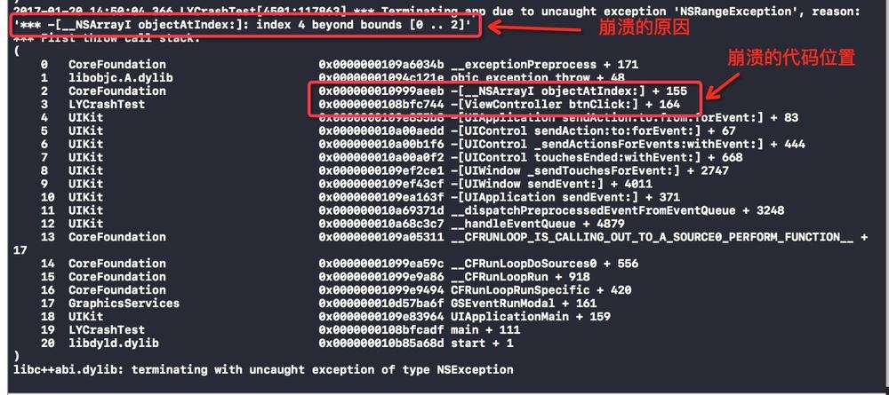


### Address Sanitizer

EXC_BAD_ACCESS一直是很多开发者的噩梦，因为这个错误很不直观，出现后往往要花很长时间才能定位到错误。苹果这次带来了革命性的提升。

在项目的Scheme中Diagnostics下，选中enable address sanitizer（注意选中后Xcode会重新编译整个项目）。

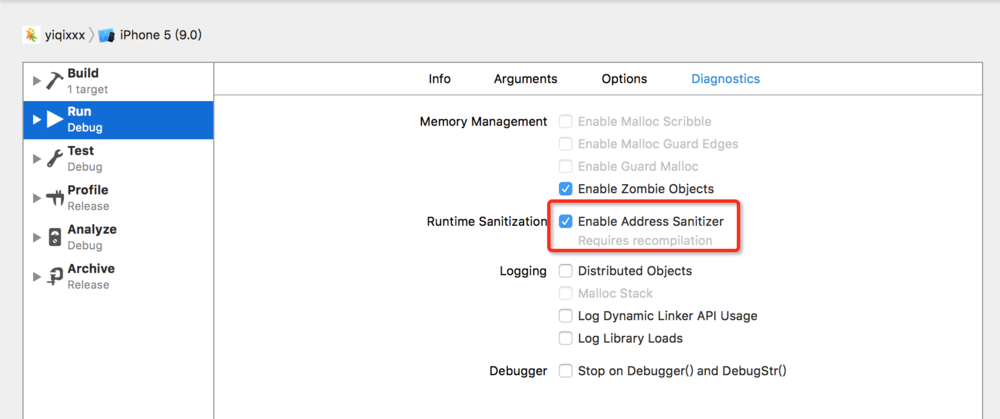

这样设置后，如果再出现类似的错误会有更详细的错误信息提示，甚至会有内存使用情况的展示。

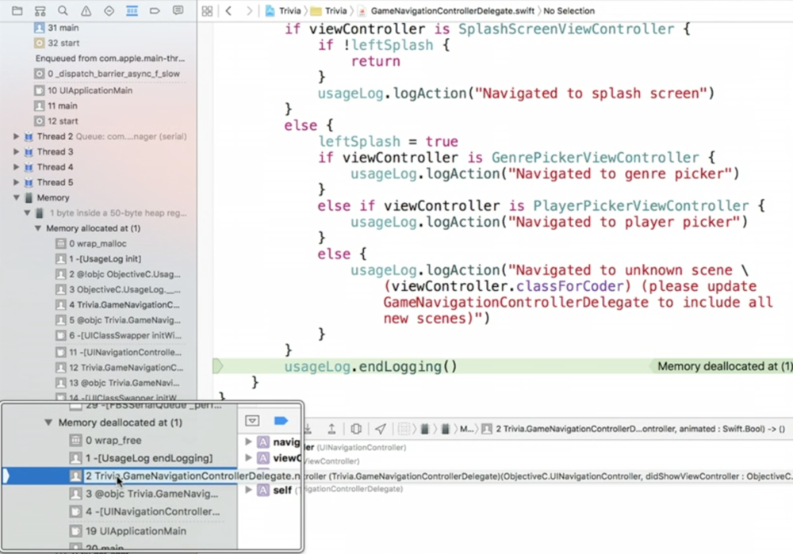


### LLDB阐述

LLDB 是一个有着 REPL 的特性和 C++ ,Python 插件的开源调试器。LLDB 绑定在 Xcode 内部，存在于主窗口底部的控制台中。调试器允许你在程序运行的特定时暂停它，你可以查看变量的值，执行自定的指令，并且按照你所认为合适的步骤来操作程序的进展


LLDB是XCode内置的为我们开发者提供的调试工具。至于还不懂什么是调试的，百度一下概念吧，笔者也不知如何描述。看看下图吧，应该就可以大概明白什么是调试了！

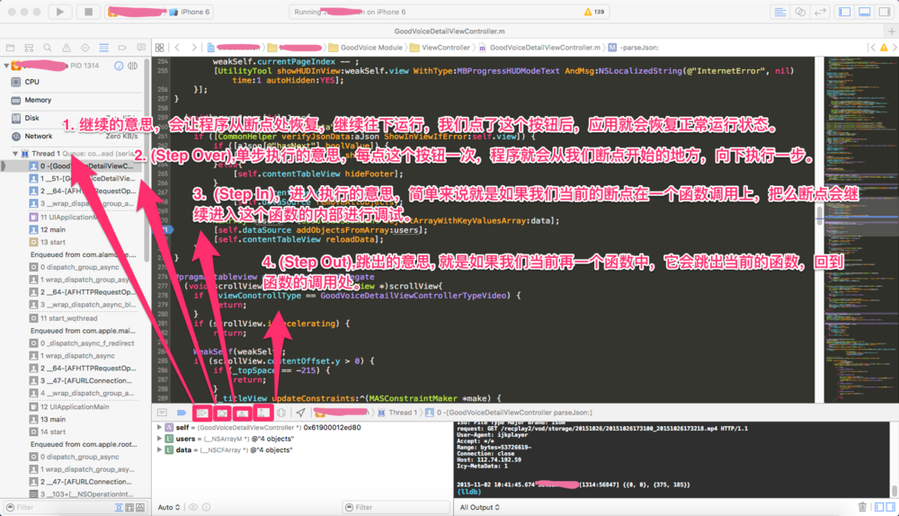

从上图中，我们八个按钮，我们讲讲前五个按钮：

* 第一个按钮点击就会收起这一栏目了，也就看不见了。
* 第二个按钮：如果为蓝色，就是断点有效。如果点击它变成灰色，就是所有断点不起作用。
* 第三个按钮：是继续的意思，会让程序从断点处恢复继续往下运行，我们点了这个按钮后，应用就会恢复正常运行状态。
* 第四个按钮是：单步执行的意思，每点这个按钮一次，程序就会从我们断点开始的地方，向下执行一步。
* 第五个按钮是：进入执行的意思，简单来说就是如果我们当前的断点在一个函数调用上，把么断点会继续进入这个函数的内部进行调试。
* 第六个按钮是：跳出的意思, 就是如果我们当前在一个函数中，它会跳出当前的函数，回到函数的调用处。


LLdB内置了非常多的功能，选择去硬背每一条指令并不是一个明智的选择。我们只需要记住一些常用的指令，在需要的时候通过help命令来查看相关的描述即可。

```
(lldb)help
Debugger commands:

  apropos           -- List debugger commands related to a word or subject.
  breakpoint        -- Commands for operating on breakpoints (see 'help b' for shorthand.)
  ...

```
还可以通过apropos来获取具体命令的合法参数信息以及含义

```
(lldb) apropos breakpoint
The following commands may relate to 'breakpoint':
  _regexp-break                         -- Set a breakpoint using one of
                                           several shorthand formats.
  _regexp-tbreak                        -- Set a one-shot breakpoint using one
                                           of several shorthand formats.
  ...

```

### 唯一匹配原则

LLDB的命令遵循唯一匹配原则：假如根据前n个字母已经能唯一匹配到某个命令，则只写前n个字母等效于写下完整的命令。 


### 常用p、po、call命令

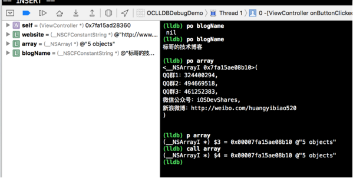


以下是输入help命令时打印出来的，可以看看这四者有什么不同：

```
p         -- ('expression --')  Evaluate an expression (ObjC++ or Swift) in
               the current program context, using user defined variables and
               variables currently in scope.
po        -- ('expression -O  -- ')  Evaluate an expression (ObjC++ or Swift)
               in the current program context, using user defined variables and
               variables currently in scope.
print     -- ('expression --')  Evaluate an expression (ObjC++ or Swift) in
               the current program context, using user defined variables and
               variables currently in scope.
call      -- ('expression --')  Evaluate an expression (ObjC++ or Swift) in
               the current program context, using user defined variables and
               variables currently in scope.

```

从官方的描述来看，p、print、call是一样的，但是po就不太一样了，输入一样但是输出不一样。po的输出的是具体对象的内容。[打印输出格式化](https://sourceware.org/gdb/onlinedocs/gdb/Output-Formats.html)


```

(lldb) p/s blogName
(__NSCFConstantString *) $9 = @"标哥的技术博客"
(lldb) p/x blogName
(__NSCFConstantString *) $10 = 0x000000010921c0a8 @"标哥的技术博客"
(lldb) p/t blogName
(__NSCFConstantString *) $11 = 0b0000000000000000000000000000000100001001001000011100000010101000 @"标哥的技术博客"
(lldb) p/a blogName
(__NSCFConstantString *) $12 = 0x000000010921c0a8 @ @"标哥的技术博客"


```

#### p和po区别

查询变量一般用p与po命令。

po的作用为打印对象，事实上，我们可以通过help po得知，po是expression -O --的简写，我们可以通过它打印出对象，而不是打印对象的指针。而值得一提的是，在 help expression 返回的帮助信息中，我们可以知道，po命令会尝试调用对象的 description 方法来取得对象信息，因此我们也可以重载某个对象的description方法，使我们调试的时候能获得可读性更强，更全面的信息。

```
-(NSString*)description
{
    return [NSString stringWithFormat:@"Portal[%@, %@, %@, %@, %@, %@, %@]", ssid, mpUrl, ticket, authUrl, _openid, _tid, extend];
}

```

p即是print，也是expression --的缩写，与po不同，它不会打出对象的详细信息，只会打印出一个$符号，数字，再加上一段地址信息。由于po命令下，对象的description 有可能被随便乱改，没有输出地址消息。

```
-(NSString*)description
{
    return @"呵呵就不告诉你";
}


```

``$``符号在LLDB中代表着变量的分配。每次使用p后，会自动为你分配一个变量，后面再次想使用这个变量时，就可以直接使用。我们可以直接使用这个地址做一些转换，获取对象的信息
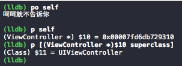


#### ``expression`` 与 `` e ``

expression 可简写为e，作用为执行一个表达式，首当其冲，它肯定可以用来查询当前堆栈变量的值。

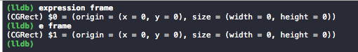


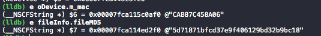


当然e的更主要的用法是通过执行表达式，动态修改当前线程堆栈变量的值，从而达到调试的目的（其实查询也很主要，只是会用另一种方式查询）。
比如，我们可以在某个if..else..的语句前打上断点，直接修改条件表达式的值，使程序覆盖了不同分支，而不用苦心积虑地停止程序、hard code变量值来进行调试，节省了一大坨修改与编译时间。

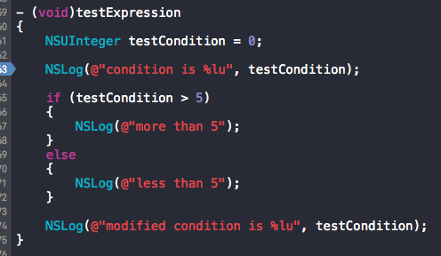


在进入条件判断语句前打了断点，那我们可以通过e命令，来自由控制程序走向任何一个分支。

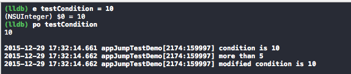

##### expression 动态修改

打印UI所有层级属性

```
po [[[UIApplication sharedApplication] keyWindow] recursiveDescription]

```
每个视图的标识中，都有一个 16进制的字符串，代表这个视图的 ID，比如这个：

```
UIView: 0x7ffcd2c6dc10

```
这个 ID 的作用非常的强大，得到了这个 ID， 我们就可以通过这个命令来得到这个视图的引用了：

```
(lldb) e id $view = (id) 0x7fbd71432590

```
简单解释下，通过 expression 命令(这里用缩写形式 e)，我们用 View 的 ID 值取得了这个 View 引用，并将它保存到 $view 变量中。

我们得到了引用之后，就可以对这个视图进行很多的操作了，比如我们可以在运行时改变这个视图的背景色：

```
(lldb) e (void) [$view setBackgroundColor:[UIColor redColor]]

```

当然，我们运行完这条命令，界面上不会马上反应出来，我们还需要调用这个命令刷新一下：

```
(lldb) e (void)[CATransaction flush]

```


##### ``breakpoint``


所有调试都是由断点开始的，我们接触的最多，就是以``breakpoint``命令为基础的断点。
一般我们对``breakpoint``命令使用得不多，而是在XCode的GUI界面中直接添加断点。除了直接触发程序暂停供调试外，我们可以进行进一步的配置。


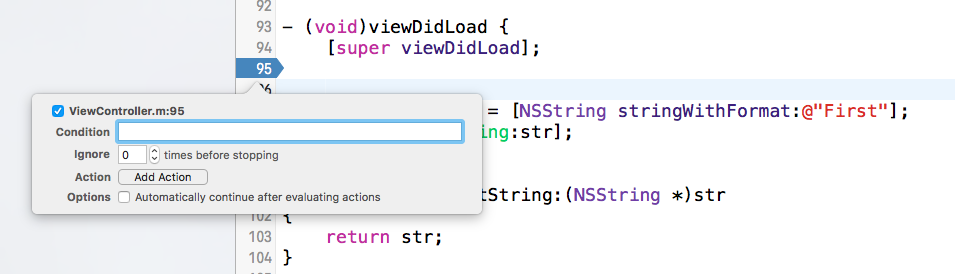


* 添加condition，一般用于多次调用的函数或者循坏的代码中，在作用域内达到某个条件，才会触发程序暂停
* 忽略次数，这个很容易理解，在忽略触发几次后再触发暂停
* 添加Action，为这个断点添加子命令、脚本、shell命令、声效（有个毛线用）等Action，我的理解是一个脚本化的功能，我们可以在断点的基础上添加一些方便调试的脚本，提高调试效率。
* 自动继续，配合上面的添加Action，我们就可以不用一次又一次的暂停程序进行调试来查询某些值（大型程序中断一次还是会有卡顿），直接用Action将需要的信息打印在控制台，一次性查看即可。

除去在代码中直接点击添加断点外，我们也可以在 ``command + 7`` breakpoint页面下直接添加相关的断点。我们常用的有 Exception Breakpoint 与 Symbolic Breakpoint

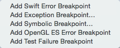

编辑每一个断点的各个选项也因为可视化的操作而变得非常的简单。但是如果我们需要在系统调用的某个函数里设置断点呢，抑或某个函数我们只能在crash log茫茫碌的堆栈信息里才能看到一点它的痕迹，这个时候如何操作呢？

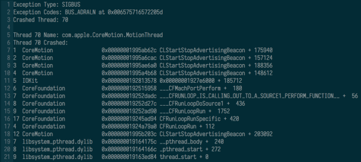

假设我们现在需要给``objc_msgSend``函数设置断点。首先先想办法获取objc_msgSend的地址。我们在Appdelegate.m文件给函数``- (BOOL)application:(UIApplication *)application didFinishLaunchingWithOptions:(NSDictionary *)launchOptions``打一个断点，运行程序如下图所示。

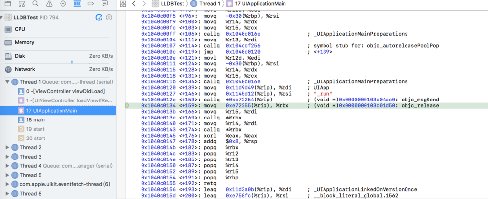

我们可以通过(lldb)br set -a 0x0000000103c04ac0来为objc_msgSend()设置一个断点。输入continue继续执行你会发现如果程序再次调用objc_m
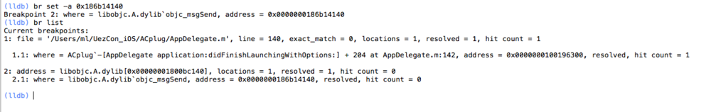


* Add Exception Breakpoint

Exception Breakpoint为异常断点。在某些情况下，TableView的数据源与UI操作不一致，或者容器插入了nil的指针，将消息传至野指针，都会导致程序的crash，并且LLDB输出的信息不是很友好。加上异常断点，能够使程序在抛出异常的栈自动暂停，可直接定位导致抛出异常的代码。在一般的开发流程中，都建议开启这个异常断点，反正你总是会crash的嘿嘿。

* Add Symbolic Breakpoint

Symbolic Breakpoint 为符号断点。有时候，我们并不清楚程序会在什么情况下调用某一个函数，那我们可以通过符号断点来获取调用该函数时的程序堆栈。当然，在自己实现的类，我们也可以在该函数实现的地方打上断点，但如果需要定位其他框架提供的API的调用，就只能使用符号断点啦。


当然，LLDB的``breakpoint``命令也可以实现上述的功能，因为不常用，所以这里就简单列举一些用法。 breakpoint set -n trigger //在所有类的trigger函数实现中打上断点

```
breakpoint set -f ViewController.m -n trigger //在ViewController.m中的trigger方法打上断点 
    breakpoint set -f ViewController.m -l 50 //在ViewController.m的50行打上断点 
    breakpoint set -f ViewController.m -n trigger: -c testCondition > 5 //在ViewController.m中的trigger方法打上断点并添加condition， testCondition大于5时触发断点 
    breakpoint set -n trigger -o //单次断点 
    breakpoint command add -o "frame info" 3 //在设置的三号断点加入子命令frame info 
    breakpoint list // 列出所有断点 
    breakpoint delete 3 //删除3号断点


```


条件断点

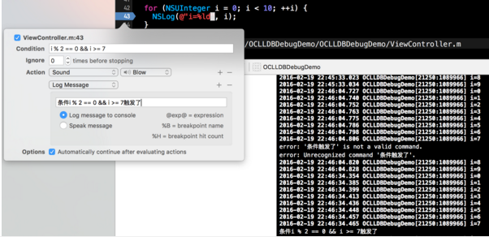

我们在NSLog这一行，设置了条件，只有当条件满中时，才会进入断点，不过这里并没有让它进入断点，而条件满足时就发出声音并打印提示语。

这种应用场景主要是在循环遍历数据时，想要断点跟踪就只能通过这种方式了，除非添加NSLog打印，但是这种需要手动添加代码，在调试时才想到要添加一些打印语句，这时候又得重新运行，这太慢了。如果懂得如何设置断点条件，那么就能满足我们的需求了，直接可以设置条件。


### 断点语法

* 给所有名为xx的函数设置一个断点

```
(lldb)breakpoint set —name xx
(lldb)br s -n xx
(lldb)b xx
```
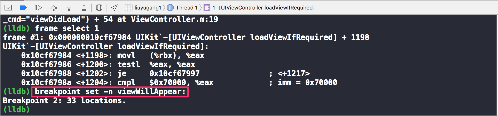

* 在文件F指定行L设置断点

```
(lldb)breakpoint set —file F —line L
(lldb)br s -f F -l L
(lldb)b F:L
```
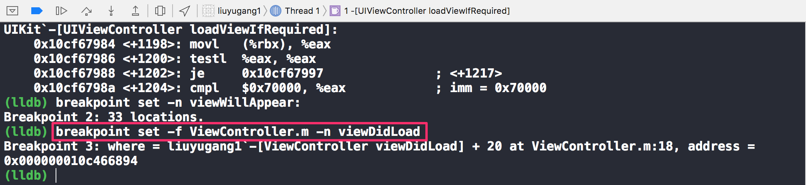
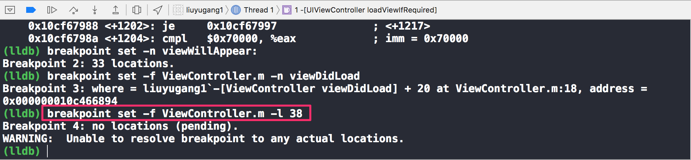

* 给所有名为xx的C++函数设置一个断点（希望没有同名的C函数）

```
(lldb)breakpoint set —method xx
(lldb)br s -M xx
```
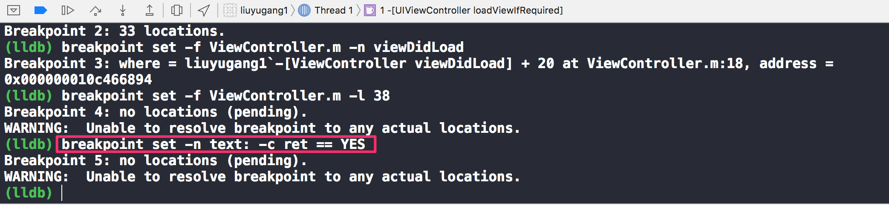

* 给一个OC函数[objc msgSend:]设置一个断点

```
(lldb)breakpoint set —name “[objc msgSend:]”
(lldb)b -n “[objc msgSend:]”
```


* 给所有名为xx的OC方法设置一个断点(希望没有名为xx的C或者C++函数)

```
(lldb)breakpoint set —selector xx
(lldb)br s -S count
```

* 给所有函数名正则匹配成功的函数设置一个断点

```
(lldb)breakpoint set --func-regex regular-expression
(lldb)br s -r regular-expression
```

* 给指定函数地址func_addr的位置设置一个断点

```
(lldb)br set -a func_addr
```
* 断点查看

```
(lldb)breakpoint list
(lldb)br l
```

* 断点删除

```
(lldb)breakpoint delete index
(lldb)br del index
```


### ``watchpoint``


有时候我们会关心类的某个属性什么时候被人修改了，最简单的方法当然就是在setter的方法打断点，或者在``@property``的属性生命行打上断点。这样当对象的setter方法被调用时，就会触发这个断点。


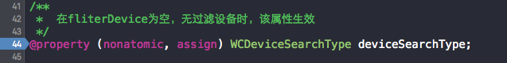


当然这么做是有缺点的，对于直接访问内存地址的修改，setter方法的断点并没有办法监控得到，因此我们需要用到``watchpoint``命令。
watchpoint命令在XCode的GUI中也可以直接使用，当程序暂停时，我们能对当前程序栈中的变量设置watchpoint。值得注意的是，watchpoint是直接设置到该变量所在的内存地址上的，所以当这个变量释放了后，watchpoint仍然是对这个地址的内存生效的。

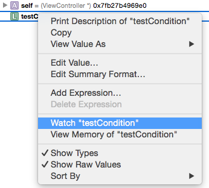


我们也可以在LLDB中直接用watchpoint命令，可以通过选项实现更多效果。


```
    watchpoint set self->testVar     //为该变量地址设置watchpoint
    watchpoint set expression 0x00007fb27b4969e0 //为该内存地址设置watchpoint，内存地址可从前文提及的`p`命令获取
    watchpoint command add -o 'frame info' 1  //为watchpoint 1号加上子命令 `frame info`
    watchpoint list //列出所有watchpoint
    watchpoint delete // 删除所有watchpoint

```

iOS开发当中有一个重要的概念KVO，我们会给一个重要的变量设置一个观察者，用以在它发生变化的时候做出相应的操作。在调试过程中我们也可以借助LLDB来监视某个变量或某一块内存的读写情况。

```
- (void)viewDidLoad {
    [super viewDidLoad];
    // Do any additional setup after loading the view, typically from a nib.
    NSString * str = @"First";
    [self printString:str];
    str = @"Second";
    [self printString:str];
}

- (void)printString:(NSString *)str
{
    NSLog(@"%@",str);
}

```

我们利用watchpoint指令来监视变量str。需要重点说明的是-w选项，下例中并没有写出，缺省值是write，这意味着只有在str被写入的时候程序会暂停。

```

(lldb) watchpoint set variable str
Watchpoint created: Watchpoint 1: addr = 0x7fff5997f9e8 size = 8 state = enabled type = w
    declare @ '/Users/noskthing/Desktop/LLDBTest/LLDBTest/ViewController.m:22'
    watchpoint spec = 'str'
    new value: 0x0000000106280078
2017-07-22 17:35:13.534 LLDBTest[4585:521823] First

Watchpoint 1 hit:
old value: 0x0000000106280078
new value: 0x0000000106280098

(lldb) image lookup -a 0x0000000106280098
      Address: LLDBTest[0x0000000100003098] (LLDBTest.__DATA.__cfstring + 32)
      Summary: @"Second"
(lldb) image lookup -a 0x0000000106280078
      Address: LLDBTest[0x0000000100003078] (LLDBTest.__DATA.__cfstring + 0)
      Summary: @"First"


```


当你输入watchpoint list查看设置的watchpoint时系统会提示你当前测试的机器允许设置的最大个数。

```
(lldb) watchpoint list
Number of supported hardware watchpoints: 4
No watchpoints currently set.

```


###  thread之thread backtrace & bt 

有时候我们想要了解线程堆栈信息，可以使用``thread backtrace``作用是将线程的堆栈打印出来

当发生crash的时候，我们可以使用thread backtrace查看堆栈调用 

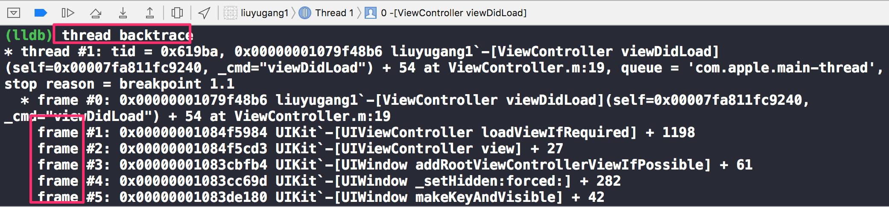


我们可以看到crash发生在-[ViewController viewDidLoad]中的第23行，只需检查这行代码是不是干了什么非法的事儿就可以了。

LLDB还为backtrace专门定义了一个别名：bt，他的效果与thread backtrace相同，如果你不想写那么长一串字母，直接写下bt即可:

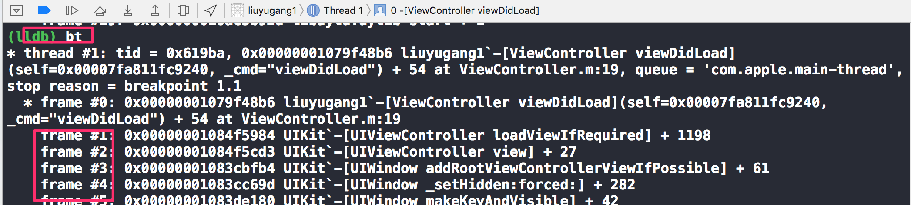


### thread return

我们有一个someMethod方法，默认情况下是返回YES。我们想要让他返回NO 

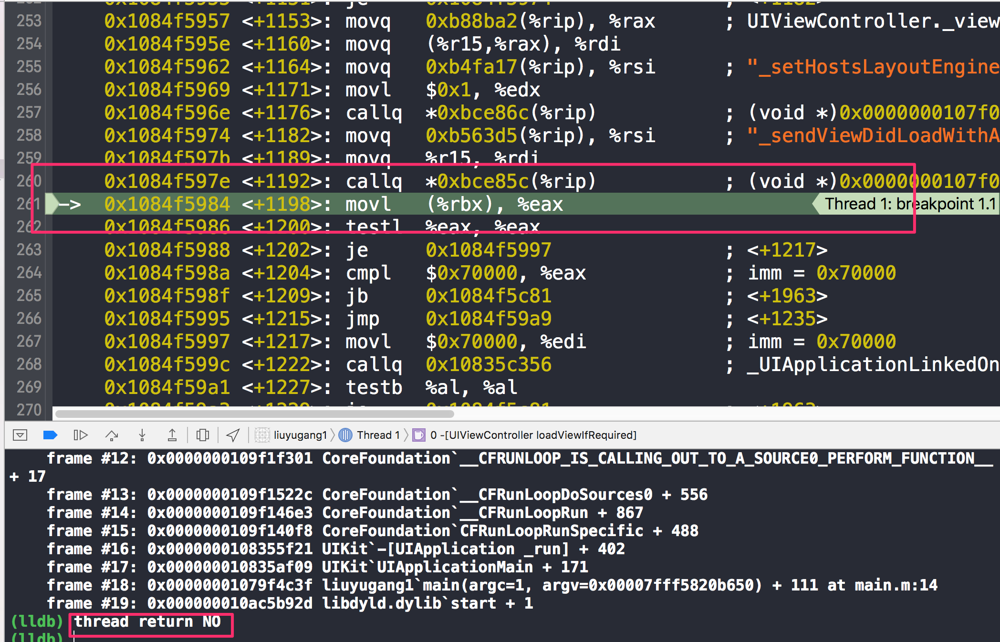

我们只需在方法的开始位置加一个断点，当程序中断的时候，输入命令即可: 
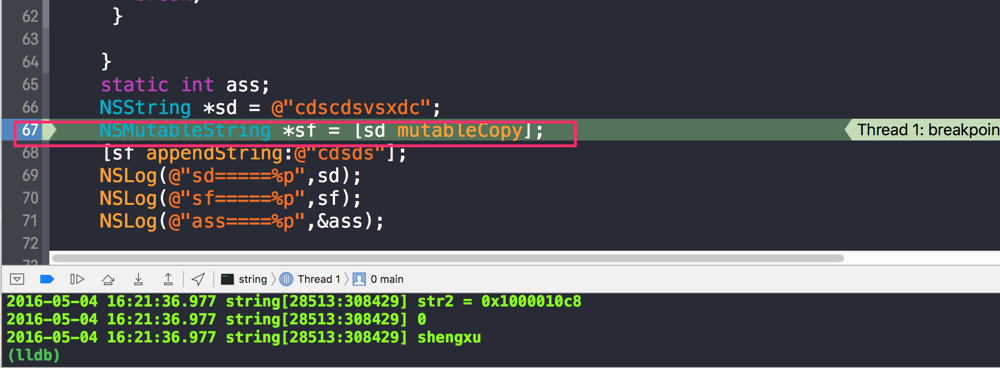

效果相当于在断点位置直接调用return NO;，不会执行断点后面的代码


### image 命令可用于寻址

``image lookup --address + 地址`` 寻找栈地址对应的代码位置（当碰到给一堆堆栈错误时很有用）,即可以直接定位追踪到Bug崩溃在哪一行，像如下这种情况，崩溃是全局的，根本没有定位到哪一行，而且很多时候lldb reason是没有提示的，这个时候就需要用到image lookup --address命令了,当我输入这行命令时image lookup --address 0x0000000106d94cbe，就会在后面打印出崩溃的 类名 所在方法 所在行。

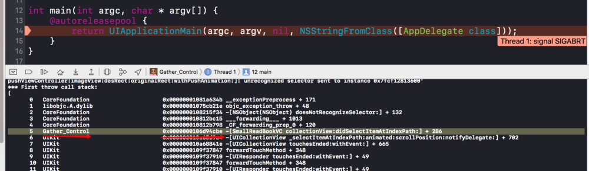
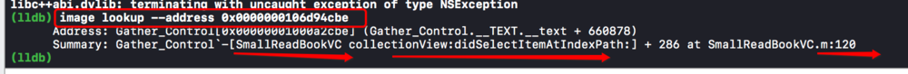


### recursiveDescription 命令

recursiveDescription 是我曾经约束报错的用到的一个方法，这个方法用到时不会提醒。这个命令可以用来打印view的一些层级关系。

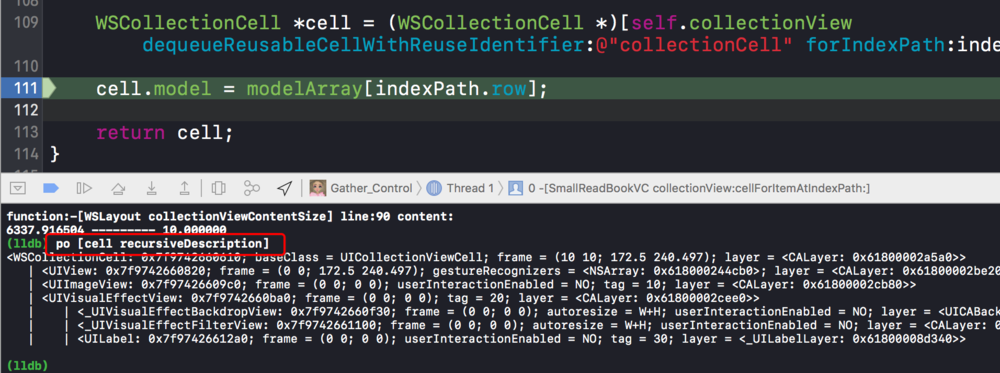


### 参数检查

* 展示当前作用域下的参数和局部变量
```
(lldb)frame variable
(lldb)fr v
```

* 展示当前作用域下的局部变量

```
(lldb)frame variable --no-args
(lldb)fr v -a
```

* 展示指定变量var的具体内容

```
(lldb)frame variable *var*
(lldb)fr v *var*
(lldb)p *var*
```

* 展示当前对象的全局变量

```
(lldb)target variable
(lldb)ta v
```

细心的朋友应该能够有所发现，这些操作都有一个局限：我们查看的各个变量都是当前作用域的。这意味着程序遇到断点的时候暂停，所有的操作都是局限于当前函数以及当前函数所在线程的内部。可视化的操作并没有给我们太多操作的空间，但是借助命令行我们可以打破这样一个局限。

命令行输入(lldb)thread backtrace可以获取当前线程函数的调用栈

```
(lldb)thread backtrace
* frame #0: 0x0000000100057204 test`-[ViewController viewDidLoad](self=0x000000014fe0ad10, _cmd=<unavailable>) at ViewController.m:99 [opt]
  frame #1: 0x000000018e1cfec0 UIKit`-[UIViewController loadViewIfRequired] + 1036
  frame #2: 0x000000018e1cfa9c UIKit`-[UIViewController view] + 28
  frame #3: 0x000000018e1d631c UIKit`-[UIWindow addRootViewControllerViewIfPossible] + 76
  frame #4: 0x000000018e1d37b8 UIKit`-[UIWindow _setHidden:forced:] + 272
  frame #5: 0x000000018e245224 UIKit`-[UIWindow makeKeyAndVisible] + 48


```

输入frame select指令我们可以任意的去选择一个作用域去查看。

```
(lldb)frame select 2
```

类比frame的操作我们可以轻松看出线程选择相关的操作

```
(lldb) thread list
Process 21035 stopped
* thread #1: tid = 0x27361a, 0x00000001892df224 libsystem_kernel.dylib`mach_msg_trap + 8, queue = 'com.apple.main-thread', stop reason = signal SIGSTOP
  thread #2: tid = 0x273639, 0x00000001892fda88 libsystem_kernel.dylib`__workq_kernreturn + 8
  thread #3: tid = 0x27363a, 0x00000001893c2ca8 libsystem_pthread.dylib`start_wqthread
  thread #4: tid = 0x27363e, 0x00000001892fda88 libsystem_kernel.dylib`__workq_kernreturn + 8
  thread #5: tid = 0x27363f, 0x00000001892df224 libsystem_kernel.dylib`mach_msg_trap + 8, name = 'com.apple.uikit.eventfetch-thread'
  thread #6: tid = 0x273640, 0x00000001892fda88 libsystem_kernel.dylib`__workq_kernreturn + 8
  thread #7: tid = 0x273641, 0x00000001892fda88 libsystem_kernel.dylib`__workq_kernreturn + 8
  thread #8: tid = 0x273642, 0x00000001892fda88 libsystem_kernel.dylib`__workq_kernreturn + 8
  thread #10: tid = 0x273646, 0x00000001892df224 libsystem_kernel.dylib`mach_msg_trap + 8, name = 'com.apple.NSURLConnectionLoader'
  thread #11: tid = 0x273644, 0x00000001892df224 libsystem_kernel.dylib`mach_msg_trap + 8, name = 'AFNetworking'
  thread #12: tid = 0x27364a, 0x00000001892fda88 libsystem_kernel.dylib`__workq_kernreturn + 8
  thread #13: tid = 0x27364b, 0x00000001892fd23c libsystem_kernel.dylib`__select + 8, name = 'com.apple.CFSocket.private'
(lldb) thread select 2


```


## 关于 Chisel

>最后，再给大家延展一下。LLDB 本身的命令系统非常健壮，并且它还支持 Python 的脚本扩展，这样它又有了很不错的扩展性，我们可以根据自己的需要来扩展自己的脚本。

>Chisel 正是 LLDB 扩展的一个典型例子，这是由 Facebook 团队开发的一个开源的 LLDB 的 Python 扩展集合，它再 LLDB 命令的基础上，又为我们提供了更加方便的操作接口。


[与调试器共舞 - LLDB 的华尔兹](https://objccn.io/issue-19-2/)
