# 第六章 iOS 响应链和事件传递


iOS中的事件可以分为3大类型：

* 触屏事件(例如点击按钮、通过手势缩放图片、拖动上下滚动页面等) Touch event   Press event
* 加速计事件(例如摇一摇红包、通过旋转设备控制赛车方向、指南针等)
* Shake-motion events,Remote-control events,Editing menu messages远程控制事件(例如耳机的线控、外接手柄、遥控器等)

注意：运动事件相关的加速度计、陀螺仪、磁强计都不属于响应者链。而是由CoreMotion传递事件给你指定的对象。[Core Motion](https://developer.apple.com/documentation/#//apple_ref/doc/uid/TP40007898-CH10-SW27)

iOS处理触屏事件，分为两种方式：

* 高级事件处理：利用UIKit提供的各种用户控件或者手势识别器来处理事件。
* 低级事件处理：在UIView的子类中重写触屏回调方法，直接处理触屏事件。


####  现在来看一下系统是怎么通过hit-test找到究竟是哪一个View产生的Touch，也就是包含Touch事件。

为了模拟系统的实现，在+(void)load()方法里添加。然后写一下方法实现。

```
swizzling_exchangeMethod([UIView class], @selector(hitTest:withEvent:), @selector(ds_hitTest:withEvent:));
swizzling_exchangeMethod([UIView class], @selector(pointInside:withEvent:), @selector(ds_pointInside:withEvent:));


//模拟一下，系统真正的实现肯定不是这样的，毕竟事件我都没用上。。
- (UIView *)ds_hitTest:(CGPoint)point withEvent:(UIEvent *)event {
 
    if (!self.isUserInteractionEnabled || self.isHidden || self.alpha <= 0.01) return nil;
    //判断点在不在这个视图里
    if ([self pointInside:point withEvent:event]) {
        //在这个视图 遍历该视图的子视图
        for (UIView *subview in [self.subviews reverseObjectEnumerator]) {
            //转换坐标到子视图
            CGPoint convertedPoint = [subview convertPoint:point fromView:self];
            //递归调用hitTest:withEvent继续判断
            UIView *hitTestView = [subview hitTest:convertedPoint withEvent:event];
            if (hitTestView) {
                //在这里打印self.class可以看到递归返回的顺序。
                return hitTestView;
            }
        }
        //这里就是该视图没有子视图了 点在该视图中，所以直接返回本身，上面的hitTestView就是这个。
        NSLog(@"命中的view:%@",self.class);
        return self;
    }
    //不在这个视图直接返回nil
    return nil;
}
 
- (BOOL)ds_pointInside:(CGPoint)point withEvent:(nullable UIEvent *)event {
    BOOL success = CGRectContainsPoint(self.bounds, point);
    if (success) {
        NSLog(@"点在%@里",self.class);
    }else {
        NSLog(@"点不在%@里",self.class);
    }
    return success;
}

```


## 响应链工作原理

####Touch event 在 Responder Chain 中的传递与响应流程为例。不同类型的 UIEvent 分发与响应原理还不一致

从你手指触到到屏幕中某一控件到其响应相关事件其实是分为两步：

* 事件的传递     事件分发与传递:自上而下

* 事件的响应     事件响应:自下而上

事件的传递涉及到了UIView中的两个方法

```
- (UIView *)hitTest:(CGPoint)point withEvent:(UIEvent *)event;
//判断当前点击事件是否存在最优响应者(First Responder）

- (BOOL)pointInside:(CGPoint)point withEvent:(UIEvent *)event;
//判断当前点击是否在控件的Bounds之内


```

事件的传递其实就是在事件产生与分发之后如何寻找最优响应视图的一个过程


## 事件的传递流程


* 触碰屏幕产生事件UIEvent并存入UIApplication中的事件队列中, 并且在整个视图结构中自上而下的进行分发

* UIWindow接受到事件开始进行最优响应视图查询的过程(逆序遍历subviews)

* 当到UIViewController这一层时同样对其根视图（self.view及其上subviews）开始最优响应视图查询。该查询会调用上述提及到两个于UIView的方法，之所以采用逆序查询也是为了优化查找速度，毕竟后addSubview的视图在上易于命中


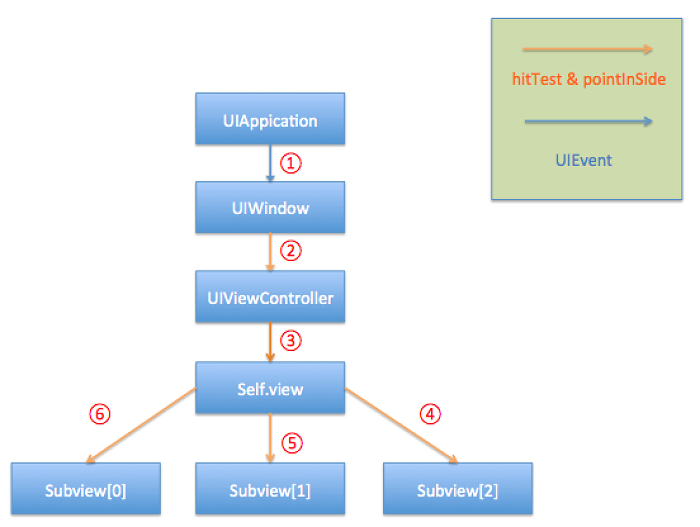

> 如果在hitTest & pointInside过程中查询到最优响应视图则后续对于其他subviews遍历查询则会停止
> 


## 视图命中查找流程

调用hitTest方法进行最优响应视图查询

* hidden = YES
* userInteractionEnabled = NO
* alpha < 0.01

以上三种情况会使该方法返回nil，即当前视图下无最优响应视图


hitTest方法内部会调用pointInside方法对点击点进行是否在当前视图bounds内进行判断，如果超出bounds，hitTest则返回nil，未超出范围则进行步骤3


对当前视图下的subviews采取逆序上述1 2步骤查询最优响应视图。如果hitTest返回了对应视图则说明在当前视图层级下有最优响应视图，可能为self或者其subview，这个要看具体返回。

下面是最优命响应图查询代码示例

```

- (UIView *)hitTest:(CGPoint)point withEvent:(UIEvent *)event {
     
    if (self.alpha < 0.01 || !self.userInteractionEnabled || self.hidden) {
         
        return nil;
    }
     
    if (![self pointInside:point withEvent:event]) {
         
        return nil;
    }
     
    __block UIView *hitView = nil;
    [self.subviews enumerateObjectsWithOptions:NSEnumerationReverse usingBlock:^(__kindof UIView * _Nonnull subview, NSUInteger idx, BOOL * _Nonnull stop) {
         
        hitView = [subview hitTest:point withEvent:event];
        if (hitView) {
             
            *stop = YES;
        }
    }];
     
    return hitView ? : self;
}


```

好了， 事件的分发与传递流程我们已经讲完了，那我们该如果进行相关的验证呢？首先我们要明确相关要确认的点：

* UIApplication开始自上而下的进行事件分发
* UIView内部开始反向遍历查找最优视图


### UIApplication 开始自上而下的进行事件分发

这个我们可以打开Instrument中的TimeProfiler进行一个整体的函数调用查看

在使用Instrument之前记得为其配置相对应的dSYM文件，否则到时候TimeProfiler中看到的将是调用函数的16进制地址，这不便于我们对问题的定位

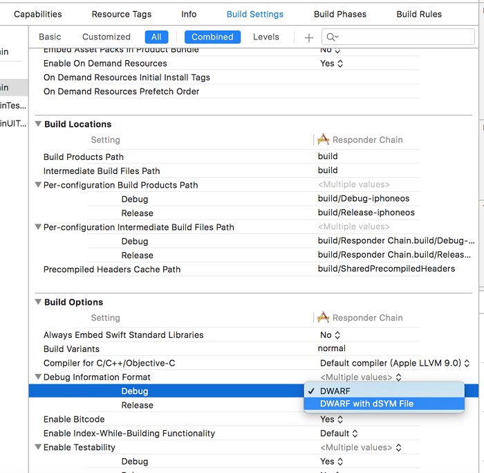


然后我们在ViewController中添加一个Button和对应按钮事件就可以开始运行TimeProfiler了（Command + i）

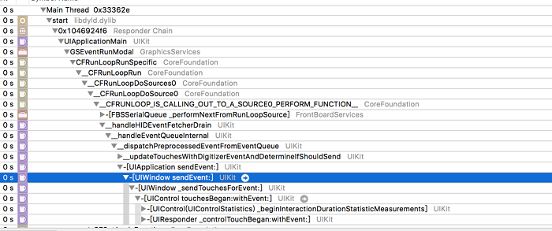


从图中我们可以看到分别一次调用了[UIApplication endEvent:]及 [UIWindow sendEvent:]

这里可能会有同学注意到上面所提及到流程图中UIWindow是进行最优响应视图查询的，为什么TimeProfiler中显示了其调用了一次时间分发。这里让我们来看下Xcode文档中对于UIWindow中sendEvent方法的注释

```
called by UIApplication to dispatch events to views inside the window


```

### UIView 内部开始反向遍历查找最优视图

首先我们可以利用Method Swizzling交换下我们需要监测的 hitTest方法

```
#import "UIView+WCQHitTest.h"
#import @implementation UIView (WCQHitTest)
+ (void)load {
     
    static dispatch_once_t onceToken;
    dispatch_once(&onceToken, ^{
         
        Class class = [self class];
         
        SEL oriSEL = @selector(hitTest:withEvent:);
        SEL swiSEL = @selector(wcq_hitTest:withEvent:);
         
        Method oriMethod = class_getInstanceMethod(class, oriSEL);
        Method swiMethod = class_getInstanceMethod(class, swiSEL);
         
        BOOL didAddMethod = class_addMethod(class, oriSEL,
                                            method_getImplementation(swiMethod),
                                            method_getTypeEncoding(swiMethod));
         
        if (didAddMethod) {
          
            class_replaceMethod(class,
                                swiSEL,
                                method_getImplementation(oriMethod),
                                method_getTypeEncoding(oriMethod));
        }else {
             
            method_exchangeImplementations(oriMethod, swiMethod);
        }
    });
}
- (UIView *)wcq_hitTest:(CGPoint)point withEvent:(UIEvent *)event {
     
    NSLog(@"%@ %s",[self class], __PRETTY_FUNCTION__);
    return [self wcq_hitTest:point withEvent:event];
}

```

然后我们分别新建三个UIView的子类: AView、BView、CView并依次按顺序添加到ViewController上

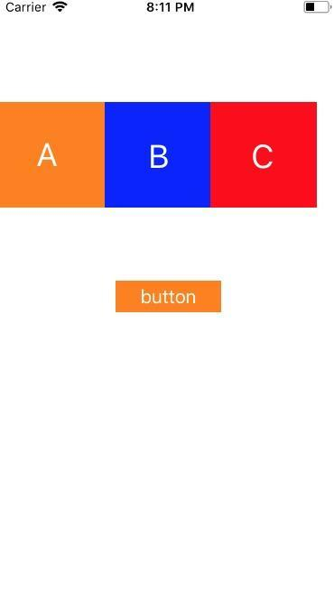

然后我们依次点击A、B视图看下hitTes调用顺序是否和预期一致

>点击A视图

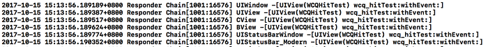


>点击B视图

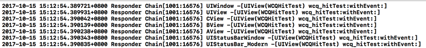


## 事件的响应流程

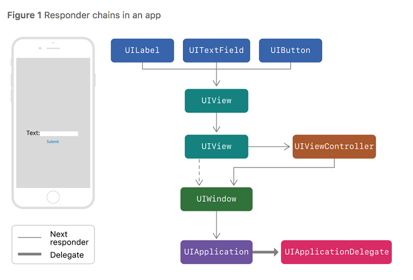


响应链 其实是由一个个UIResponder的子类构成的，UIResponder是系统一个负责接受和处理事件的类。

```
- (void)touchesBegan:(NSSet *)touches withEvent:(nullable UIEvent *)event;
- (void)touchesMoved:(NSSet *)touches withEvent:(nullable UIEvent *)event;
- (void)touchesEnded:(NSSet *)touches withEvent:(nullable UIEvent *)event;
- (void)touchesCancelled:(NSSet *)touches withEvent:(nullable UIEvent *)event;


```

而以上这几个响应触碰的方法其实也是出自于UIResponder类，

UIView作为UIResponder的子类能够处理点击事件也就无可厚非了


现在讲讲事件的响应流程:

1. 首先已确定最优响应视图

2. 判断最优响应视图能否响应事件，如果视图能进行响应则事件在响应链中的传递终止。如果视图不能响应则将事件传递给 nextResponder也就是通常的superview进行事件响应

3. 如果事件继续上报至UIWindow并且无法响应，它将会把事件继续上报给UIApplication

4. 如果事件继续上报至UIApplication并且也无法响应，它将会将事件上报给其Delegate，但前提下这个Delegate不属于 响应链 并且是UIResponder的子类

5. 如果最终事件依旧未被响应则会被系统抛弃


> 也并非所有的nextResponder即是superview，比如UIViewController的根视图self.view的nextResponder是其所在UIViewController。而如果UIViewController如果是UIWindow的根控制器，那么它的nextResponder就是UIWindow，但如果UIViewController是另外一个 UIViewController present出来的话，那么它的nextResponder就是之前所执行present操作的那个UIViewController
> 
> 


设法证实其关键节点

* 事件响应自下而上进行上报

我们这次可以利用该方法进行验证:

```
- (void)touchesBegan:(NSSet *)touches withEvent:(UIEvent *)event

```

同时我们也看看该方法在文档中的描述，看能否查找到一些有用的信息节点

> UIKit calls this method when a new touch is detected in a view or window. Many UIKit classes override this method and use it to handle the corresponding touch events. The default implementation of this method forwards the message up the responder chain. When creating your own subclasses, call super to forward any events that you do not handle yourself.
> 
> 
> 


根据文档所述，该方法默认实现就是将事件沿 响应链 进行自下而上的上报。现在我们同样可以利用Method Swizzling再次对touchesBegan方法进行监测，这里有一个要注意的地方:由于这次置换的方法中调用到super方法，所以我们置换的时候置换的是UIView中的``touchesBegan``方法而没去置换UIResponder中的``touchesBegan``方法


```
- (void)wcq_touchesBegan:(NSSet *)touches withEvent:(UIEvent *)event {
    NSLog(@"%@ %s",[self class], __PRETTY_FUNCTION__);
    [super touchesBegan:touches withEvent:event];
}

```

同时这次我们为了验证事件的响应是自下而上，我们调整下UI的结构:
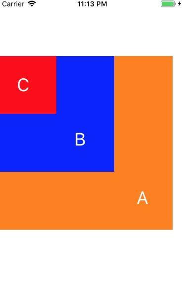

运行模拟器点击CView


[](Resource/5_0_20.jpg)


## 响应者对象(UIResponder)

在iOS中不是任何对象都能处理事件, 只有继承了UIResponder的对象才能接收并处理事件,我们称为响应者对象
UIApplication,UIViewController,UIView都继承自UIResponder,因此他们都是响应者对象, 都能够接收并处理事件

继承自UIResponder的类能处理事件是由于UIResponder内部提供了以下方法

```
@property(nonatomic, readonly, nullable) UIResponder *nextResponder;

```

需要用到参数touches，下面是UITouch的属性和方法：

```
NS_CLASS_AVAILABLE_IOS(2_0) @interface UITouch : NSObject

@property(nonatomic,readonly) NSTimeInterval      timestamp;
@property(nonatomic,readonly) UITouchPhase        phase;
@property(nonatomic,readonly) NSUInteger          tapCount;   // touch down within a certain point within a certain amount of time

// majorRadius and majorRadiusTolerance are in points
// The majorRadius will be accurate +/- the majorRadiusTolerance
@property(nonatomic,readonly) CGFloat majorRadius NS_AVAILABLE_IOS(8_0);
@property(nonatomic,readonly) CGFloat majorRadiusTolerance NS_AVAILABLE_IOS(8_0);

@property(nullable,nonatomic,readonly,strong) UIWindow                        *window;
@property(nullable,nonatomic,readonly,strong) UIView                          *view;
@property(nullable,nonatomic,readonly,copy)   NSArray <UIGestureRecognizer *> *gestureRecognizers NS_AVAILABLE_IOS(3_2);

- (CGPoint)locationInView:(nullable UIView *)view;
- (CGPoint)previousLocationInView:(nullable UIView *)view;

// Force of the touch, where 1.0 represents the force of an average touch
@property(nonatomic,readonly) CGFloat force NS_AVAILABLE_IOS(9_0);
// Maximum possible force with this input mechanism
@property(nonatomic,readonly) CGFloat maximumPossibleForce NS_AVAILABLE_IOS(9_0);


```

UITouch对象

* 当用户用一根手指触摸屏幕时，会创建一个与手指相关的UITouch对象

* 一根手指对应一个UITouch对象

* 如果两根手指同时触摸一个view，那么view只会调用一次touchesBegan:withEvent:方法，touches参数中装着2个UITouch对象

* 如果这两根手指一前一后分开触摸同一个view，那么view会分别调用2次touchesBegan:withEvent:方法，并且每次调用时的touches参数中只包含一个UITouch对象

UITouch的作用

* 保存着跟手指相关的信息，比如触摸的位置、时间、阶段
* 当手指移动时，系统会更新同一个UITouch对象，使之能够一直保存该手指在的触摸位置
* 当手指离开屏幕时，系统会销毁相应的UITouch对象
* 提 示:iPhone开发中，要避免使用双击事件！


UITouch的属性

```
触摸产生时所处的窗口
@property(nonatomic,readonly,retain) UIWindow *window;

触摸产生时所处的视图
@property(nonatomic,readonly,retain) UIView *view
;

短时间内点按屏幕的次数，可以根据tapCount判断单击、双击或更多的点击
@property(nonatomic,readonly) NSUInteger tapCount;

记录了触摸事件产生或变化时的时间，单位是秒
@property(nonatomic,readonly) NSTimeInterval timestamp;

当前触摸事件所处的状态
@property(nonatomic,readonly) UITouchPhase phase;


```

UITouch的方法

```
(CGPoint)locationInView:(UIView *)view;
// 返回值表示触摸在view上的位置
// 这里返回的位置是针对view的坐标系的（以view的左上角为原点(0, 0)）
// 调用时传入的view参数为nil的话，返回的是触摸点在UIWindow的位置

(CGPoint)previousLocationInView:(UIView *)view;
// 该方法记录了前一个触摸点的位置


```

代码实现：

```
- (void)touchesMoved:(NSSet *)touches withEvent:(UIEvent *)event{ 
    // 想让控件随着手指移动而移动,监听手指移动 
    // 获取UITouch对象 
    UITouch *touch = [touches anyObject]; 
    // 获取当前点的位置 
    CGPoint curP = [touch locationInView:self]; 
    // 获取上一个点的位置 
    CGPoint preP = [touch previousLocationInView:self]; 
    // 获取它们x轴的偏移量,每次都是相对上一次 
    CGFloat offsetX = curP.x - preP.x; 
    // 获取y轴的偏移量 
    CGFloat offsetY = curP.y - preP.y; 
    // 修改控件的形变或者frame,center,就可以控制控件的位置 
    // 形变也是相对上一次形变(平移) 
    // CGAffineTransformMakeTranslation:会把之前形变给清空,重新开始设置形变参数 
    // make:相对于最原始的位置形变 
    // CGAffineTransform t:相对这个t的形变的基础上再去形变 
    // 如果相对哪个形变再次形变,就传入它的形变 
    self.transform = CGAffineTransformTranslate(self.transform, offsetX, offsetY);
    }


```


```
触摸事件
- (void)touchesBegan:(NSSet *)touches withEvent:(UIEvent *)event;
- (void)touchesMoved:(NSSet *)touches withEvent:(UIEvent *)event;
- (void)touchesEnded:(NSSet *)touches withEvent:(UIEvent *)event;
- (void)touchesCancelled:(NSSet *)touches withEvent:(UIEvent *)event;
 
加速计事件
- (void)motionBegan:(UIEventSubtype)motion withEvent:(UIEvent *)event;
- (void)motionEnded:(UIEventSubtype)motion withEvent:(UIEvent *)event;
- (void)motionCancelled:(UIEventSubtype)motion withEvent:(UIEvent *)event;
 
远程控制事件
- (void)remoteControlReceivedWithEvent:(UIEvent *)event;


```

两个UIView相关属性:

* multipleTouchEnabled:是否开启多点触控
* exclusiveTouch :多个控件接受事件时的排他性


那么响应链跟这个UIResponder有什么关系呢？事实事件响应链的形成和事件的响应和传递，UIResponder都帮我们做了很多事。我们的app中，所有的视图都是按照一定的结构组织起来的，即树状层次结构，每个view都有自己的superView，包括controller的topmost view(controller的self.view)。当一个view被add到superView上的时候，他的nextResponder属性就会被指向它的superView，当controller被初始化的时候，self.view(topmost view)的nextResponder会被指向所在的controller，而controller的nextResponder会被指向self.view的superView，这样，整个app就通过nextResponder串成了一条链，也就是我们所说的响应链。所以响应链就是一条虚拟的链，并没有一个对象来专门存储这样的一条链，而是通过UIResponder的属性串连起来的。如下图：

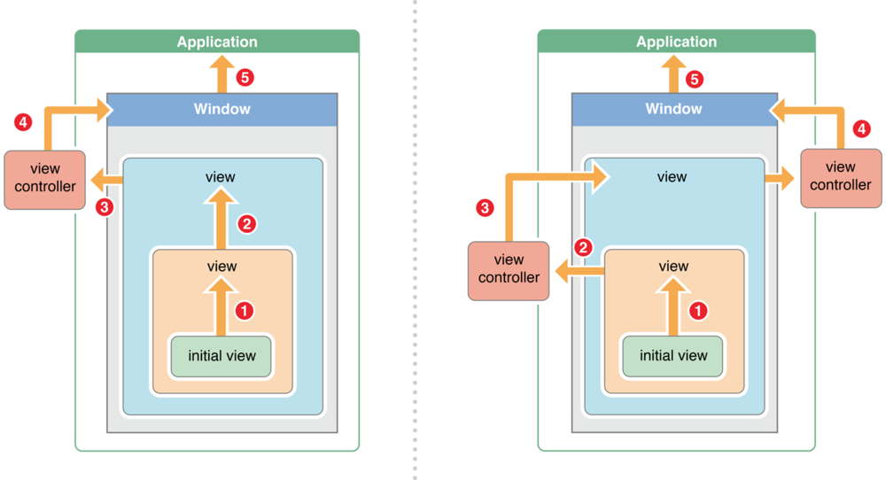

事件传递中UIWindow会根据不同的event，用不同的方式寻找initial object，initial object决定于当前的事件类型。比如Touch Event，UIWindow会首先试着把事件传递给事件发生的那个view，就是下文要说的hit-testview。对于Motion和Remote Event，UIWindow会把例如震动或者远程控制的事件传递给当前的firstResponder，有关firstResponder的相关信息请看这里。下面主要讲Touch Event的hit-testview。

有了事件响应链，接下来的事情就是寻找响应事件的具体响应者了，我们称着为：Hit-Testing View，寻找这个View的过程我们称着为Hit-Test。

那么什么是Hit-Test呢，我们可以把它理解为一个探测器，通过这个探测器我们可以找到并判断手指是否点击在某个视图上面，换句话说就是通过Hit-Test可以找到手指点击到的处于屏幕最前面的那个UIView。

在解释Hit-Test是怎么工作之前，先来看看它是什么时候被调用的。前面说Hit-Test是一个探测器，那么在代码里面其实就是一个函数，UIView有如下两个方法：

```

- (UIView *)hitTest:(CGPoint)point withEvent:(UIEvent *)event;

- (BOOL)pointInside:(CGPoint)point withEvent:(UIEvent *)event;


```

每当手指接触屏幕，UIApplication接收到手指的事件之后，就会去调用UIWindow的``hitTest:withEvent:``，看看当前点击的点是不是在window内，如果是则继续依次调用subView的``hitTest:withEvent:``方法，直到找到最后需要的view。调用结束并且hit-test view确定之后，这个view和view上面依附的手势，都会和一个UITouch的对象关联起来，这个UITouch会作为事件传递的参数之一，我们可以看到UITouch头文件里面有一个view和gestureRecognizers的属性，就是``hitTest view``和它的手势。

现在知道Hit-Test是什么时候调用了，那么接下来看看它是怎么工作的。Hit-Test是采用递归的方法从view层级的根节点开始遍历，看看下面这张图：

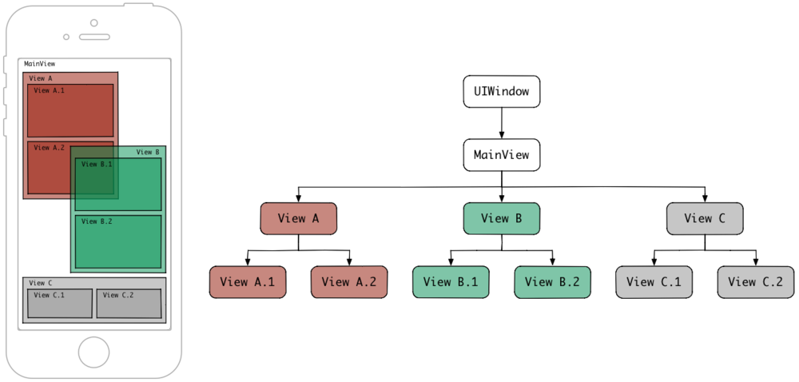

UIWindow有一个MianVIew，MainView里面有三个subView：view A、view B、view C，他们各自有两个subView，他们层级关系是：view A在最下面，view B中间，view C最上(也就是addSubview的顺序，越晚add进去越在上面)，其中view A和view B有一部分重叠。如果手指在view B.1和view A.2重叠的上面点击，按照上面说的递归方式，顺序如下图所示：

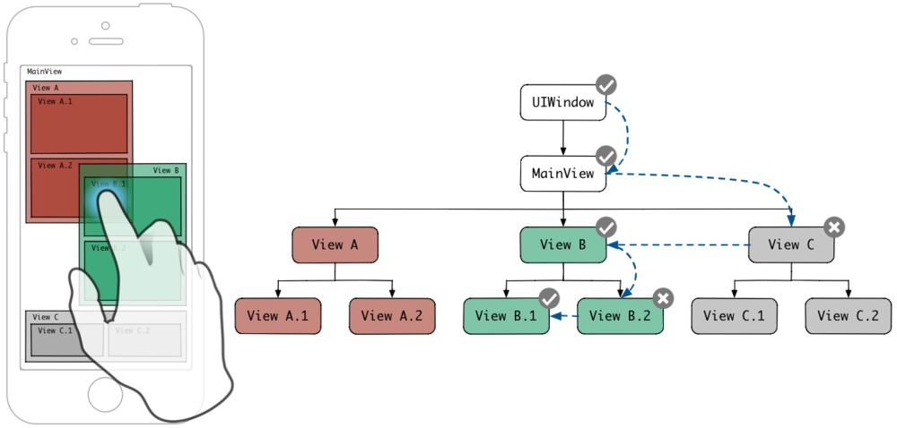

递归是向界面的根节点UIWindow发送hitTest:withEvent:消息开始的，从这个消息返回的是一个UIView，也就是手指当前位置最前面的那个 hittest view。 当向UIWindow发送hitTest:withEvent:消息时，hitTest:withEvent:里面所做的事，就是判断当前的点击位置是否在window里面，如果在则遍历window的subview然后依次对subview发送hitTest:withEvent:消息(注意这里给subview发送消息是根据当前subview的index顺序，index越大就越先被访问)。如果当前的point没有在view上面，那么这个view的subview也就不会被遍历了。当事件遍历到了view B.1，发现point在view B.1里面，并且view B.1没有subview，那么他就是我们要找的hittest view了，找到之后就会一路返回直到根节点，而view B之后的view A也不会被遍历了。

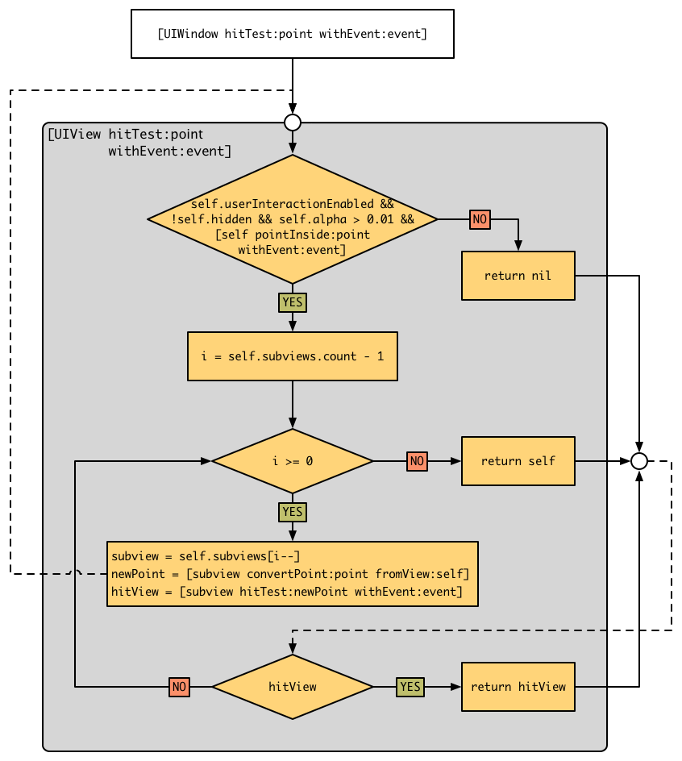


注意hitTest里面是有判断当前的view是否支持点击事件，比如userInteractionEnabled、hidden、alpha等属性，都会影响一个view是否可以相应事件，如果不响应则直接返回nil。 我们留意到还有一个pointInside:withEvent:方法，这个方法跟hittest:withEvent:一样都是UIView的一个方法，通过他开判断point是否在view的frame范围内。如果这些条件都满足了，那么遍历就可以继续往下走了，代码表现大概如下：

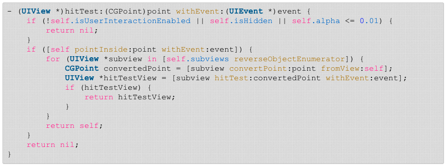


## ``Hit-Test``的应用


#### 扩大view的点击区域


一个按钮尺寸是10pt*10pt，如果要扩大按钮的点击区域(按钮四周之外的10pt也可以响应按钮的事件)，可以怎么做呢？或许重写hittest:withEvent:是个好办法，hitest就是返回可以响应事件的view，如果我们在button的子类里面重写它，在方法里面判断如果point在button的frame之外的10pt内，就返回button自己。

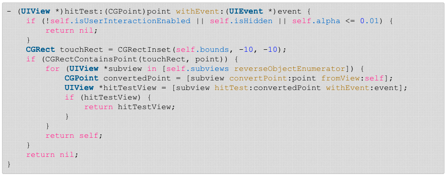


#### 将事件传递给兄弟view

如上面第一个图，如果需要是需要view A响应事件而不是B(即使点在重叠的部分)，什么都不做的话，当点击在重叠的时候，A是不能响应事件的，除非B的userInteractionEnabled为NO并且者B没有任何事件的响应函数。这个时候通过重写B的hittest可以解决这个问题，在B的hittest里面直接返回nil就行了。

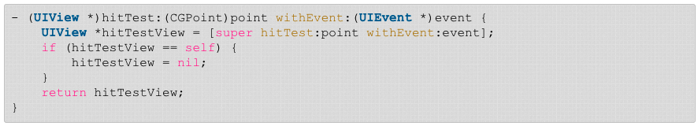


#### 将事件传递给subview

如下图，蓝色的scrollView设置pagingEnabled使得image停止滚动后都会固定在居中的位置，如果在scrollView的左边或者右边活动，发现scrollView是无法滚动的，原因就是hittest里面没有满足pointInSide这个条件，scrollView的bound只有蓝色的区域。这个时候重写UIView的hittest:withEvent:，然后返回scrollView即可解决问题。

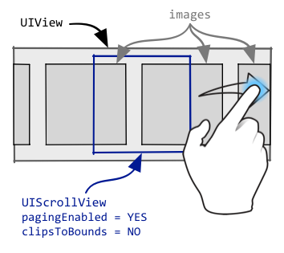

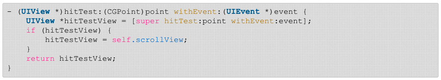


## 事件的传递

有了响应链，并且找到了第一个响应事件的对象，接下来就是把事件发送个这个响应者了。 UIApplication中有个``sendEvent:``的方法，在UIWindow中同样也可以发现一个同样的方法。UIApplication是通过这个方法把事件发送给UIWindow，然后UIWindow通过同样的接口，把事件发送给hit-testview。这个我们可以从Time Profiler里面得到证实：

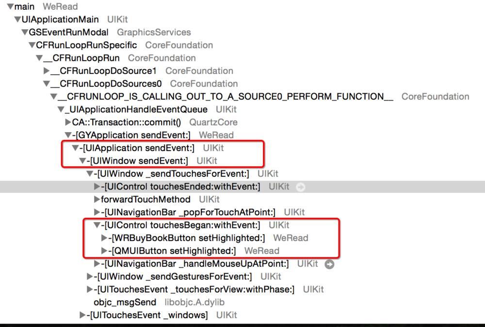


当我点击了WRBuyBookButton之后，UIWindow会通过一个私有方法，在里面会去调用按钮的``touchesBegan``和``touchesEnded``方法，``touchesBegan``里面有设置按钮的高亮等之类的动作，这样就实现了事件的传递。而事件的响应，也就是按钮上绑定的action，是在``touchEnded``里面通过调用UIApplication的``sendAction:to:from:forEvent:``方法来实现的，至于这个方法里面是怎么去响应action，就只能猜测了(可能是通过oc底层消息机制的相关接口 objc_msgSend 来发送消息实现的，可以参考message.h文件)。如果第一响应者没有响应这个事件，那么就会根据响应链，把事件冒泡传递给nextResponder来响应。


注意这里是怎么把事件传递给nextResponder的呢？拿touch事件来说，UIResponder里面touch四个阶段的方法里面，实际上是什么事都没有做的，UIView继承了它进行重写，重写的内容也是没有什么东西，就是把事件传递给nextResponder，比如：``[self.nextResponder touchesBegan:touches withEvent:event]。``所以当一个view或者controller里面没有重写touch事件，那么这个事件就会一直传递下去，直到UIApplication，这也就是事件往上冒泡的原理。如果view重写了touch方法，我们一般会看到的效果是，这个view响应了事件之后，事件就被截断了(就像JavaScript里面调用``e.stopPropagation()``)，它的nextResponder不会收到这个事件，即使重写了nextResponder的touch方法。这个时候如果想事件继续传递下去，可以调用``[super touchesBegan:touches withEvent:event]``，不建议直接调``[self.nextResponder touchesBegan:touches withEvent:event]``。


## 关于UIScrollView的事件

先说一个现象，我们平时加到UIScrollView(或者UITableView和UICollection)上面的UIButton，即使有设置highLighted的样式，点击的时候却发现这个样式老是不出来，但是按钮的事件明明可以响应的，很诡异。

后来才知道，UIScrollView因为要滚动，所以对事件做了特殊的处理： 当UIScrollView接收到事件之后，会暂时劫持当前的事件300毫秒，如果300毫秒之后手指还没有滚动，则认为你放弃滚动，放弃对事件的劫持并往下传递，但是从Time Profiler看到此时按钮并不是调用自身的touch方法，而是调用自身绑定的手势的touch事件，由于按钮的highLighted样式是写在按钮的touch方法上的，所以这个这个时候就看不到高亮了。但是长按按钮缺可以让按钮有高亮的状态，这个就不太清楚为什么了，因为从Time Profiler里面看按钮的touchesBegan好像还是没有被调。 如果300毫秒之内手指滚动了，则响应滚动的事件，事件就不会继续传给subView了，也就是不会继续调用按钮上手势的touch方法了。


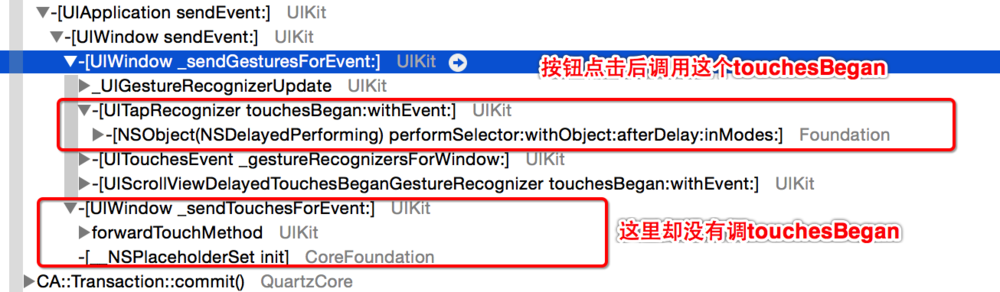


可以通过UIScrollView的一个属性来解决这个问题：delaysContentTouches，意思是是否需要延迟处理事件的传递，默认是NO。把delaysContentTouches设置为YES之后，一切看起来挺好的，按钮终于有高亮样式了哈哈哈，但是发现另一个问题：如果手指点击在按钮上面并滚动UIScrollView，发现怎么也滚动不了。原因是当手指点击UIScrollView并在滚动之前，如果subView接收并且可以响应事件(delaysContentTouches设置为YES)，则事件响应链会在subView响应事件之后就截断，即UIScrollView本身不会响应到此事件，不会发生滚动。可以设置canCancelContentTouches为YES来让UIScrollView可以滚动，与之类似的还有一个touchesShouldCancelInContentView:接口，可以根据参数view来更方便的判断是否需要cancel，如果有需要可以在UIScrollView的子类里面重写这个接口。

这一块里面的具体实现原理我们都不知道，水太深了，只能通过Time Profiler来看到一些大概的实现，我们也没必要去深究，大方向理解就好了。真的有兴趣的同学也可以去研究研究，期待你的分享。


