# Cocoapods高阶操作


远程私有库

1. 首先我们需要一个远程托管仓库，git或者svn。

2. 必须明确一个概念我们需要两个远程仓库，一个是远程的索引库和一个远程的源码库，cocoapods 基本原理也是这样的，平时采用的方式和我们组件化唯一区别就是将公有变为私有。我们通过将远程索引库添加到本地，然后在本地生成索引文件，当 pod 'LibBase',pod install,首先会在本地索引文件中查找到相应库文件地址进行本地clone,这样我们就可以使用了。

3. 当我们将代码传到远程源码仓库以后，需要在进行第5步操作，向私有索引库提交，这里需要解释一下这个过程，当我们通过命令行操作向本地私有索引库推入索引文件，同时也会添加到远程索引库，这样当小伙伴要使用你的库，只需要更新他本地的就可以了。


## 基于git代码托管


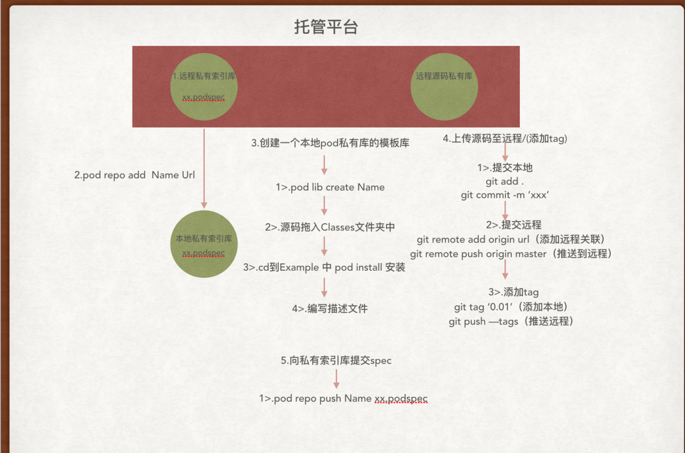


## 基于SVN代码托管


### 选择第三方托管平台 [svnspot](http://code.svnspot.com)

创建两个远程仓库  

*  svn 服务器上新建一个放 spec 的远程仓库,该仓库不需要创建标准的 trunk、tags、branches 目录,仅仅是放组件的 spec 文件的。

* 在 svn 服务器上新建一个 组件私有库 的仓库,因为是代码文件且需要使用 tag,所以使用标准的 trunk、tags、branches 目录


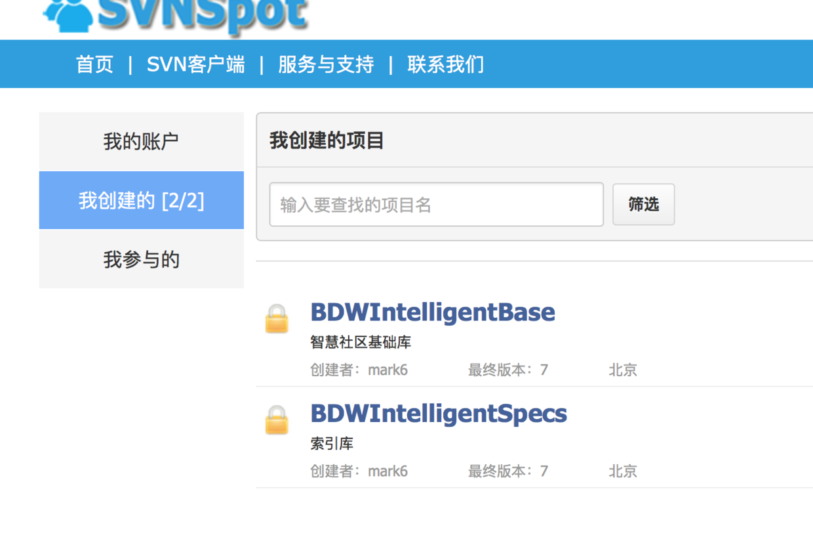


### 远程索引库关联本地

*  为了支持svn 操作我们需要安装一个 [cocoapods-repo-svn](https://github.com/dustywusty/cocoapods-repo-svn)插件

* 关联本地索引库 

```
pod repo-svn add Name Url

```
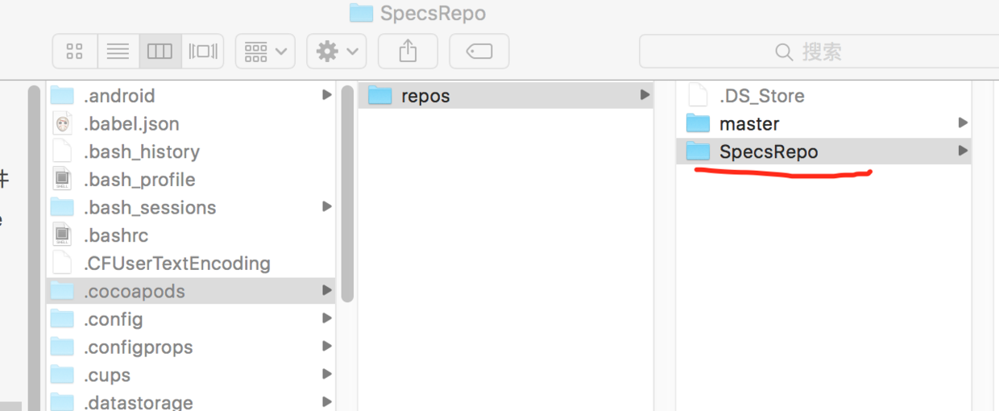

```
pod repo
```

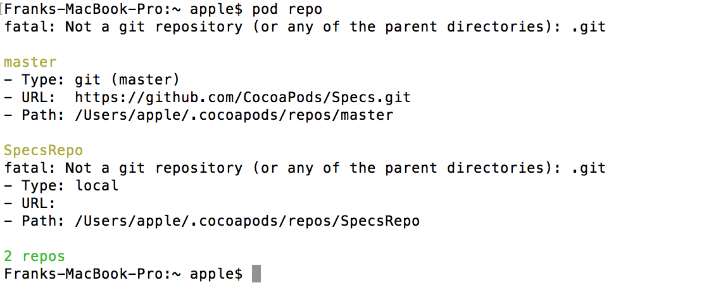


### 远程源码仓库克隆到本地，采用Cornerstone 工具

* 两种方式，直接添加远程地址或者通过终端命令克隆下来然后导入。


### 创建本地私有模板库


```
pod lib create Name

```

* 需要把 .git .gitignore .travis.yml 这是哪个文件删掉，然后将这个库拖入到 svn 本地仓库的 trunk下面。当然这个里面包括你的组件库文件。

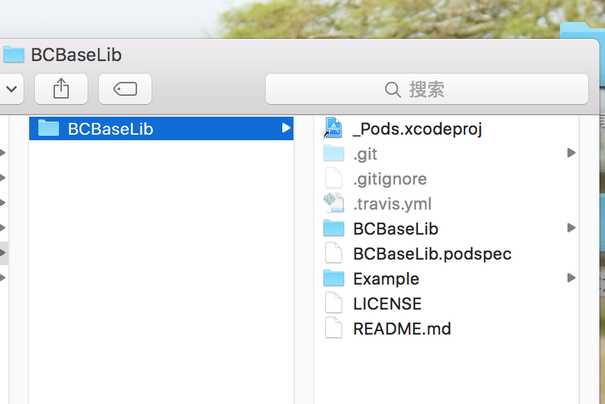


* 将刚刚创建好的工程放入SVN的trunk目录下， 注意此时trunk应为根目录，trunk下存在的文件有 XXX.podspec、XXX文件夹、README.md、LICENSE、Example文件夹、_Pods.xcodeproj，如果CocoaPods在trunk中找不到.podspec文件，后面运行更新时会报错。

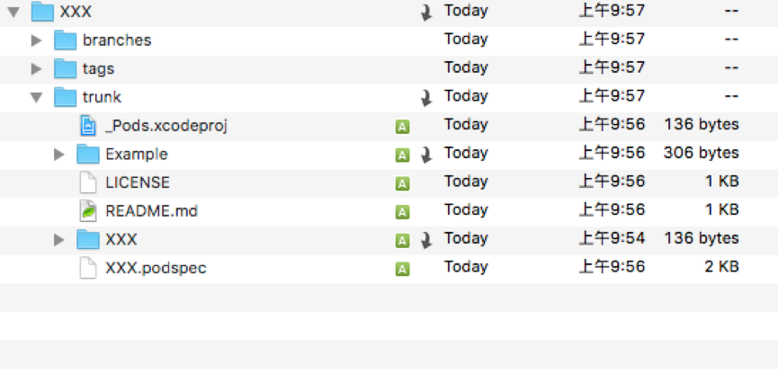


### 编写podsepc 文件


* 在Xcode目录中 找到``Pods/Development Pods/XXX/XXX/Classes`` 目录（可通过查找``ReplaceMe.m``找到该目录），将库文件放入其中，如果该库需要依赖其他开源库可在XXX/Podspec Metadata/XXX.podspec中编辑,重要的编辑项有``s.version=组件版本``，``s.source=组件地址``，``s.dependency=需要依赖的其他库``


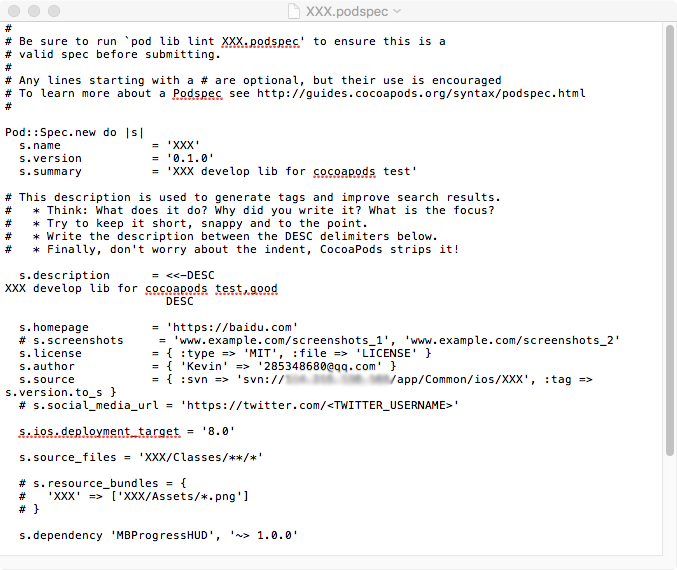

* 与Git不同之处 ``s.source = {:svn =>'http://10.211.55.3/svn/CRProtocolManager', :tag => s.version.to_s },``


* 这里我们需要将原地址改为svn 地址，可以进行本地验证一下``pod lib lint``

* 提交代码至远程


### 远程打标签tag

* 直接通过Cornerstone打tag,需要注意的是标签的tag和podsepc 文件中的版本一致

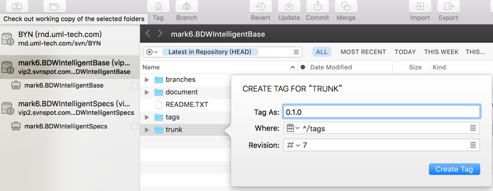

* 在SVN的tag中打包为相应版本。下图是打包tag的步骤（以Cornerstone为例）

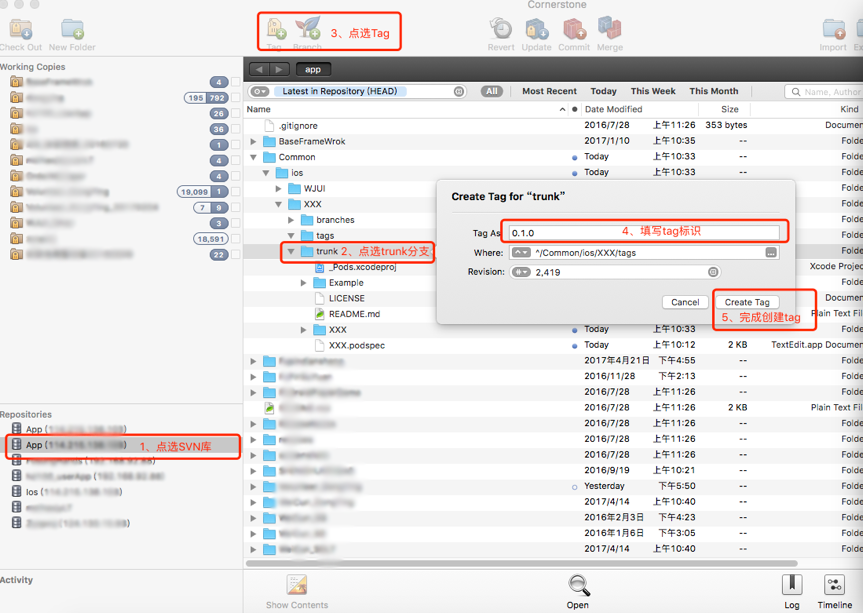

* 还有创建完tag的目录结构，创建tag并保持下图的目录结构非常重要，pod实际是拉取目录 XXX/tags/0.1.0

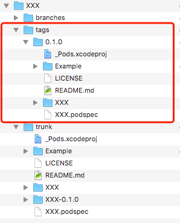


### 提交spec至私有索引库

* 提交

```
pod repo-svn push Name xx.podsepc

```

* 需要注意的是cd 到 本地trunk 文件夹目录下，才能包含xx.podsepc 文件

* 通过终端 搜索一下我们的库 `` pod search BCBaseLib ``


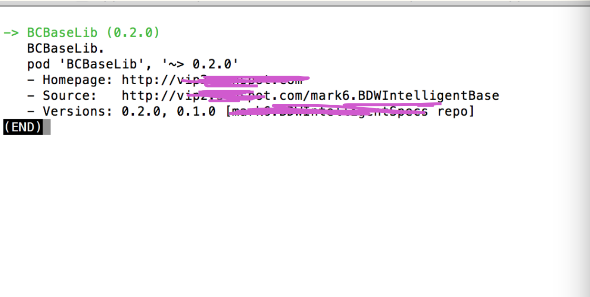


###  使用

* Podfile文件编写

```
platform :ios, '8.0'
target 'test' do
plugin 'cocoapods-repo-svn', :sources => [
        'http://10.211.55.3/svn/SpecRepo' # 远程索引库地址
    ] 
use_frameworks!
pod 'BCBaseLib'  # 本地 svn 私有库
pod 'AFNetworking'    # 可直接 pod 公开三方库
end

```

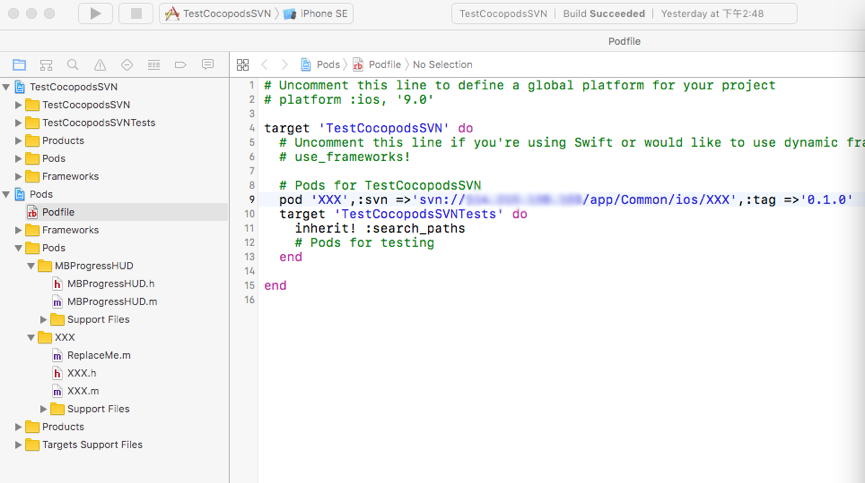

* pod install 报错找不到组件

	* 可以更新一下本地索引库 ``pod repo-svn update --no-repo-update``

* podspec 文件中 s.source 路径不对

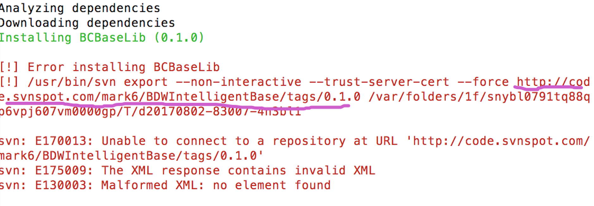

* 有些的svn地址是https的网址，没有配置用户名和密码前会导致无法下载，解决方法是需要你去终端里连接一下svn，并输入用户名和密码。
比如，在终端里运行``svn checkout https://YourSvnPath/XXX`` 会提示你是否信任该https证书然后要求你输入用户名和密码，校验成功后，接着在该终端里返回到项目目录，使用 ``pod install --no-repo-update``安装即可。


### CocoaPods ``cocoapods-packager``来创建静态库

[cocoapods-packager](https://link.jianshu.com/?t=https%3A%2F%2Fgithub.com%2FCocoaPods%2Fcocoapods-packager)

使用CocoaPods制作了基于SVN地址的开发库，然后通过Pod命令将开发库以源代码方式引入工程中。但是，有时我们不希望开发库以源代码方式提供给别人，这时就要制作静态库，这种静态库有两种形式：

* .framework

* .a文件 加 .h头文件


#### 制作静态库的过程：

1. 制作好源代码开发库

2. 重新编辑.podspec文件，用cocoapods-packager将源代码开发库打包成静态库，配置.podspec文件支持静态库的Pod集成


### SVN中的tag分支入手

##### 从tags文件夹0.1.0分支上创建一个新分支0.1.0-framework放入branches中，现在以新分支0.1.0-framework为当前开发分支，这一步主要是为了方便开发。


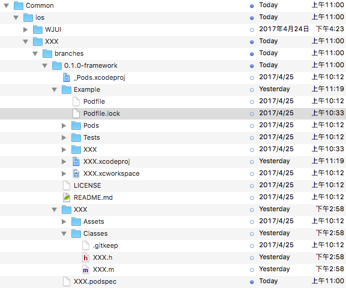

#### 重新编辑.podspec文件，然后在终端.app中使用``pod package XXX.podspec --force``命令来打包生成framework。

	* 打包工具cocoapods-packager会根据.podspec文件中的s.source和s.source_files来确定源码库的路径和所包含文件，其中s.source不支持本地路径，请确保打包的文件被正确提交到了svn。
	* 根据上图分支的svn路径，我们使用的路径为

	```
	s.source = { :svn => 'svn://IP_ADDRESS/app/Common/ios/XXX/branches/0.1.0-framework'}，
s.source_files = 'XXX/Classes/**/*'
	
	```
	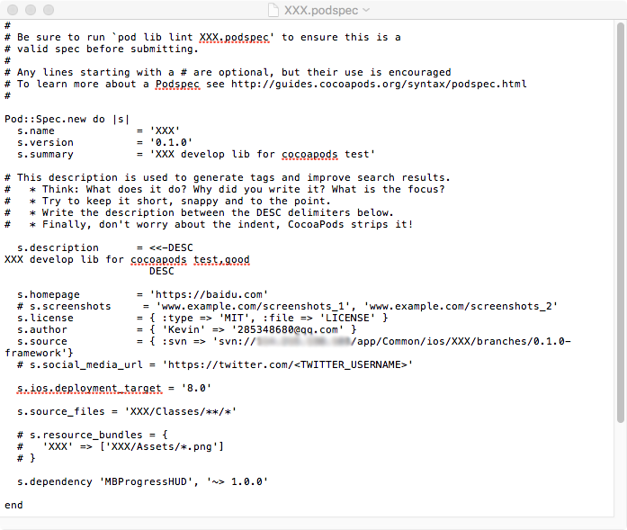
	
	* 编辑完成，在终端.app中定位到``.podspec``文件的上级目录，使用``pod package XXX.podspec --force``命令生成framework。

	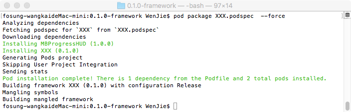
	
	* 查看刚才的目录中，已经生成了包含 XXX.framework的文件夹。将新生成的文件夹和framework文件提交到svn。

	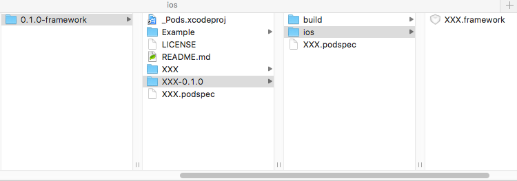
	
##### 配置.podspec文件支持framework的Pod集成。  三种集成配置方式（源码方式、framework方式、.a文件方式）见图中红框，这里我们使用framework下载方式设置项，将framework的路径设置给``s.vendored_frameworks``项。

	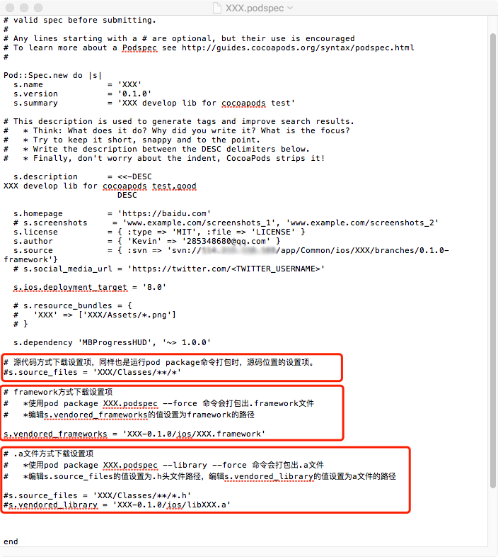
	
	* 通过终端.app在0.1.0-framework/Example文件夹使用pod install --no-repo-update来安装，打开Xcode目录，发现framework被添加进了工程，接下来运行测试。而使用源代码方式集成却没有问题，经查证是由于生成的framework的头文件中没有显示添加#import <UIKit/UIKit.h>，导致无法识别UIView，显示添加之后再次打包framework，问题解决。

	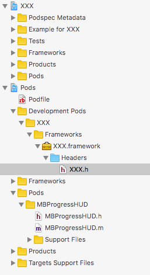
	
	
##### 制作tag分支，并删除tag分支上的源代码。

将XXX.podspec中的s.source还原为

```
s.source = { :svn => 'svn://IPAddress/app/Common/ios/XXX', :tag => s.version.to_s }

```

根据``:tag => s.version.to_s``，在SVN的tag中打包为相应版本。这里为了和源码版本的区别开来，我们将s.version的值设置为``0.1.0-framework``
	
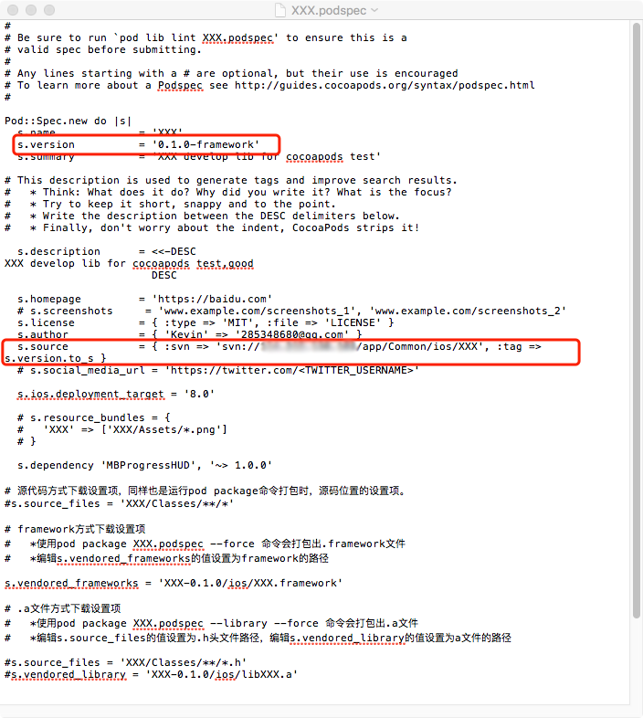


制作tag分支，步骤（以Cornerstone为例）：  制作完成后记得删除掉tag分支上的源代码

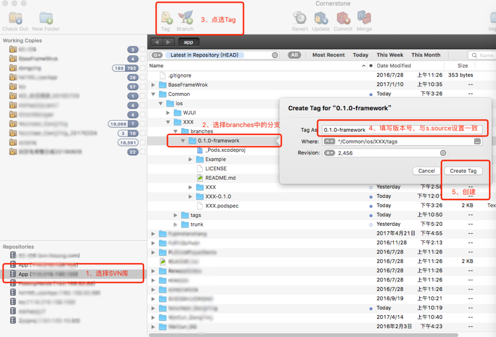


#### 其他工程中使用刚刚配置好的framework

已有工程中的Podfile文件中编辑
``pod ‘XXX’,:svn =>'svn://YourSvnPath/XXX’,:tag =>'0.1.0-framework'``
可参考 Profile文件 Pod语法然后使用``pod install --no-repo-update``进行安装

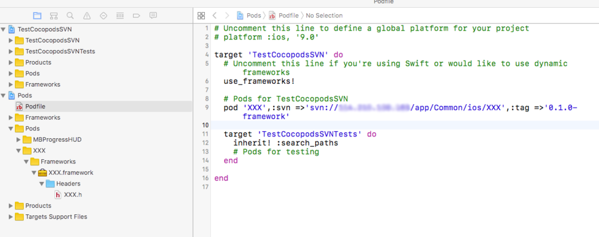


## CocoaPods -- package


##### Cocoapods打包静态库的功能


* 首先保证自己已经正确安装CocoaPods环境，然后在git网站下载CocoaPods 打包插件

[cocoapods-packager](https://github.com/CocoaPods/cocoapods-packager)


* 安装打包插件

```
  sudo gem install cocoapods-packager
  
```

* package 命令 参考文档

```
MacBook-Pro-4:~ beichen$ pod package --help
Usage:

    $ pod COMMAND

      CocoaPods, the Cocoa library package manager.

Commands:

    + cache         Manipulate the CocoaPods cache
    + deintegrate   Deintegrate CocoaPods from your project
    + env           Display pod environment
    + init          Generate a Podfile for the current directory
    + install       Install project dependencies according to versions from a
                    Podfile.lock
    + ipc           Inter-process communication
    + lib           Develop pods
    + list          List pods
    + outdated      Show outdated project dependencies
    + plugins       Show available CocoaPods plugins
    + repo          Manage spec-repositories
    + search        Search for pods
    + setup         Setup the CocoaPods environment
    + spec          Manage pod specs
    + trunk         Interact with the CocoaPods API (e.g. publishing new specs)
    + try           Try a Pod!
    + update        Update outdated project dependencies and create new
                    Podfile.lock

Options:

    --silent        Show nothing
    --version       Show the version of the tool
    --verbose       Show more debugging information
    --no-ansi       Show output without ANSI codes
    --help          Show help banner of specified command


```


* 打包命令很简单，执行   ``--library``指定打包成.a文件，如果不带上将会打包成.framework文件。``--force``是指强制覆盖

```
pod package xxxx.podspec --library --force

```


#### 生成动态库


* 命令

```
pod package AFPodSpec.podspec --force --dynamic --no-mangle --spec-sources=https://github.com/CocoaPods/Specs.git

```

* 命令参数

```
//强制覆盖之前已经生成过的二进制库 
--force

//生成静态.framework 
--embedded

//生成静态.a 
--library

//生成动态.framework 
--dynamic

//动态.framework是需要签名的，所以只有生成动态库的时候需要这个BundleId 
--bundle-identifier

//不包含依赖的符号表，生成动态库的时候不能包含这个命令，动态库一定需要包含依赖的符号表。 
--exclude-deps

//表示生成的库是debug还是release，默认是release。--configuration=Debug 
--configuration


--no-mangle
//表示不使用name mangling技术，pod package默认是使用这个技术的。我们能在用pod package生成二进制库的时候会看到终端有输出Mangling symbols和Building mangled framework。表示使用了这个技术。
//如果你的pod库没有其他依赖的话，那么不使用这个命令也不会报错。但是如果有其他依赖，不使用--no-mangle这个命令的话，那么你在工程里使用生成的二进制库的时候就会报错：Undefined symbols for architecture x86_64。

--subspecs

//如果你的pod库有subspec，那么加上这个命名表示只给某个或几个subspec生成二进制库，--subspecs=subspec1,subspec2。生成的库的名字就是你podspec的名字，如果你想生成的库的名字跟subspec的名字一样，那么就需要修改podspec的名字。 
这个脚本就是批量生成subspec的二进制库，每一个subspec的库名就是podspecName+subspecName。

--spec-sources

//一些依赖的source，如果你有依赖是来自于私有库的，那就需要加上那个私有库的source，默认是cocoapods的Specs仓库。--spec-sources=private,https://github.com/CocoaPods/Specs.git。


```


