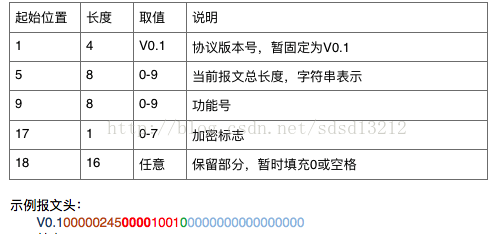

# 21.3 Socket相关


## Socket编程-C语言版

TCP是面向连接的，安全可靠的传输层协议。TCP的程序基本框架设计图：


注意：Socket通信一定有要服务端和客户端。


### 1.1 TCP Socket客户端

客户端的工作流程：首先调用socket函数创建一个Socket，然后指定服务端的IP地址和端口号，就可以调用sendto将字符串传送给服务器端，并可以调用recvfrom接收服务器端返回的字符串，最后关闭该socket。

笔者这里分成了六步：

* 第一步：创建socket并配置socket
* 第二步：调用bind绑定监听ip和端口号
* 第三步：调用connect连接服务器
* 第四步：调用getsockname获取套接字信息
* 第五步：调用send发送消息到服务器端
* 第六步：调用close关闭socket

这里没有写接收来自服务器端的消息，大家可以自行添加。

#### 1.1.1 客户端的代码实现：

```
- (void)tcpClient {
  // 第一步：创建soket
  // TCP是基于数据流的，因此参数二使用SOCK_STREAM
  int error = -1;
  int clientSocketId = socket(AF_INET, SOCK_STREAM, 0);
  BOOL success = (clientSocketId != -1);
  struct sockaddr_in addr;
  
  // 第二步：绑定端口号
  if (success) {
    NSLog(@"client socket create success");
    // 初始化
    memset(&addr, 0, sizeof(addr));
    addr.sin_len = sizeof(addr);
    
    // 指定协议簇为AF_INET，比如TCP/UDP等
    addr.sin_family = AF_INET;
    
    // 监听任何ip地址
    addr.sin_addr.s_addr = INADDR_ANY;
    error = bind(clientSocketId, (const struct sockaddr *)&addr, sizeof(addr));
    success = (error == 0);
  }
  
  if (success) {
    // p2p
    struct sockaddr_in peerAddr;
    memset(&peerAddr, 0, sizeof(peerAddr));
    peerAddr.sin_len = sizeof(peerAddr);
    peerAddr.sin_family = AF_INET;
    peerAddr.sin_port = htons(1024);
    
    // 指定服务端的ip地址，测试时，修改成对应自己服务器的ip
    peerAddr.sin_addr.s_addr = inet_addr("192.168.1.107");
    
    socklen_t addrLen;
    addrLen = sizeof(peerAddr);
    NSLog(@"will be connecting");
    
    // 第三步：连接服务器
    error = connect(clientSocketId, (struct sockaddr *)&peerAddr, addrLen);
    success = (error == 0);
    
    if (success) {
      // 第四步：获取套接字信息
      error = getsockname(clientSocketId, (struct sockaddr *)&addr, &addrLen);
      success = (error == 0);
      
      if (success) {
        NSLog(@"client connect success, local address:%s,port:%d",
              inet_ntoa(addr.sin_addr),
              ntohs(addr.sin_port));
        
        // 这里只发送10次
        int count = 10;
        do {
          // 第五步：发送消息到服务端
          send(clientSocketId, "哈哈，server您好！", 1024, 0);
          count--;
          
          // 告诉server，客户端退出了
          if (count == 0) {
            send(clientSocketId, "exit", 1024, 0);
          }
        } while (count >= 1);
        
        // 第六步：关闭套接字
        close(clientSocketId);
      }
    } else {
      NSLog(@"connect failed");
      
      // 第六步：关闭套接字
      close(clientSocketId);
    }
  }
}
```

#### 1.1.2 客户端的打印日志

```
2017-12-06 18:35:00.385 iOS-Socket-C-Version-Client[9726:4256295] client socket create success
2017-12-06 18:35:00.386 iOS-Socket-C-Version-Client[9726:4256295] will be connecting
2017-12-06 18:35:00.507 iOS-Socket-C-Version-Client[9726:4256295] client connect success, local address:192.168.1.100,port:50311
说明连接服务器成功，然后发送了消息到服务器端。
```

### 1.2 TCP Socket服务器端


服务器端的工作流程：首先调用socket函数创建一个套接字，然后调用bind函数将其与本机地址以及一个本地端口号绑定，接收到一个客户端时，服务器显示该客户端的IP地址，并将字串返回给客户端。

笔者这里分成了五步：

* 第一步：创建socket并配置socket
* 第二步：调用bind绑定服务器本机ip及端口号
* 第三步：调用listen监听客户端的连接，并指定同时最多可让accept的数量
* 第四步：调用accept等待客户端的连接
* 第五步：调用recvfrom接收来自客户端的消息
* 第六步：调用close关闭socket


#### 1.2.1 服务器端代码实现

```
- (void)tcpServer {
  // 第一步：创建socket
  int error = -1;
  
  // 创建socket套接字
  int serverSocketId = socket(AF_INET, SOCK_STREAM, 0);
  // 判断创建socket是否成功
  BOOL success = (serverSocketId != -1);
  
  // 第二步：绑定端口号
  if (success) {
    NSLog(@"server socket create success");
    // Socket address
    struct sockaddr_in addr;
    
    // 初始化全置为0
    memset(&addr, 0, sizeof(addr));
    
    // 指定socket地址长度
    addr.sin_len = sizeof(addr);
    
    // 指定网络协议，比如这里使用的是TCP/UDP则指定为AF_INET
    addr.sin_family = AF_INET;
    
    // 指定端口号
    addr.sin_port = htons(1024);
    
    // 指定监听的ip，指定为INADDR_ANY时，表示监听所有的ip
    addr.sin_addr.s_addr = INADDR_ANY;
    
    // 绑定套接字
    error = bind(serverSocketId, (const struct sockaddr *)&addr, sizeof(addr));
    success = (error == 0);
  }
  
  // 第三步：监听
  if (success) {
    NSLog(@"bind server socket success");
    error = listen(serverSocketId, 5);
    success = (error == 0);
  }
  
  if (success) {
    NSLog(@"listen server socket success");
    
    while (true) {
      // p2p
      struct sockaddr_in peerAddr;
      int peerSocketId;
      socklen_t addrLen = sizeof(peerAddr);
      
      // 第四步：等待客户端连接
      // 服务器端等待从编号为serverSocketId的Socket上接收客户连接请求
      peerSocketId = accept(serverSocketId, (struct sockaddr *)&peerAddr, &addrLen);
      success = (peerSocketId != -1);
      
      if (success) {
        NSLog(@"accept server socket success,remote address:%s,port:%d",
              inet_ntoa(peerAddr.sin_addr),
              ntohs(peerAddr.sin_port));
        char buf[1024];
        size_t len = sizeof(buf);
        
        // 第五步：接收来自客户端的信息
        // 当客户端输入exit时才退出
        do {
          // 接收来自客户端的信息
          recv(peerSocketId, buf, len, 0);
          if (strlen(buf) != 0) {
            NSString *str = [NSString stringWithCString:buf encoding:NSUTF8StringEncoding];
            if (str.length >= 1) {
              NSLog(@"received message from client：%@",str);
            }
          }
        } while (strcmp(buf, "exit") != 0);
        
        NSLog(@"收到exit信号，本次socket通信完毕");
        
        // 第六步：关闭socket
        close(peerSocketId);
      }
    }
  }
}
```

#### 1.2.2 服务器端的打印日志

```
2017-12-06 18:34:31.258 iOS-Socket-C-Version-Server[39929:2622200] server socket create success
2017-12-06 18:34:31.258 iOS-Socket-C-Version-Server[39929:2622200] bind server socket success
2017-12-06 18:34:31.259 iOS-Socket-C-Version-Server[39929:2622200] listen server socket success
2017-12-06 18:35:00.743 iOS-Socket-C-Version-Server[39929:2622200] accept server socket success,remote address:192.168.1.100,port:50311
2017-12-06 18:35:00.743 iOS-Socket-C-Version-Server[39929:2622200] received message from client：哈哈，server您好！
2017-12-06 18:35:00.743 iOS-Socket-C-Version-Server[39929:2622200] received message from client：哈哈，server您好！
2017-12-06 18:35:00.743 iOS-Socket-C-Version-Server[39929:2622200] received message from client：哈哈，server您好！
2017-12-06 18:35:00.744 iOS-Socket-C-Version-Server[39929:2622200] received message from client：哈哈，server您好！
2017-12-06 18:35:00.744 iOS-Socket-C-Version-Server[39929:2622200] received message from client：哈哈，server您好！
2017-12-06 18:35:00.744 iOS-Socket-C-Version-Server[39929:2622200] received message from client：哈哈，server您好！
2017-12-06 18:35:00.744 iOS-Socket-C-Version-Server[39929:2622200] received message from client：哈哈，server您好！
2017-12-06 18:35:00.744 iOS-Socket-C-Version-Server[39929:2622200] received message from client：哈哈，server您好！
2017-12-06 18:35:00.744 iOS-Socket-C-Version-Server[39929:2622200] received message from client：哈哈，server您好！
2017-12-06 18:35:00.745 iOS-Socket-C-Version-Server[39929:2622200] received message from client：哈哈，server您好！
2017-12-06 18:35:00.745 iOS-Socket-C-Version-Server[39929:2622200] received message from client：exit
2017-12-06 18:35:00.745 iOS-Socket-C-Version-Server[39929:2622200] 收到exit信号，本次socket通信完毕
我们这里打印出了客户端发来的消息，由于上面实现的代码中，只发10次，所以这里只有10条。
```

### 源代码
参考代码：[https://github.com/MasterChanMonkey/iOS-Socket-C-Version](https://github.com/MasterChanMonkey/iOS-Socket-C-Version)

注意：这里面有两个工程，一个是客户端，一个是服务器端。运行时，先运行服务器端，然后再选择客户端。另外，客户端所指定的服务器端的ip地址一定要修改成您本机对应的ip，不然使用笔者这里的ip就会失败。


## iOS Socket编程-C语言版（UDP）

先讲一讲UDP编程，因为比TCP要简单多了。首先，我们需要明白UDP是用户数据报协议，英文名为User Datagram Protocol，它是面向无连接的。

注意：Socket通信一定有要服务端和客户端。

### 1.1 UDP Socket客户端

客户端的工作流程：首先调用socket函数创建一个Socket，然后指定服务端的IP地址和端口号，就可以调用sendto将字符串传送给服务器端，并可以调用recvfrom接收服务器端返回的字符串，最后关闭该socket。

笔者这里分成了四步：

* 第一步：创建socket并配置socket，如服务端ip地址和端口号
* 第二步：调用sendto发送消息到服务器端
* 第三步：调用recvfrom接收来自服务器端的消息
* 第四步：调用close关闭socket

#### 1.1.1 客户端的代码实现：

```
- (void)udpClient {
  int clientSocketId;
  ssize_t len;
  socklen_t addrlen;
  struct sockaddr_in client_sockaddr;
  char buffer[256] = "Hello, server, how are you?";
  
  // 第一步：创建Socket
  clientSocketId = socket(AF_INET, SOCK_DGRAM, 0);
  if(clientSocketId < 0) {
    NSLog(@"creat client socket fail\n");
    return;
  }
  
  addrlen = sizeof(struct sockaddr_in);
  bzero(&client_sockaddr, addrlen);
  client_sockaddr.sin_family = AF_INET;
  client_sockaddr.sin_addr.s_addr = inet_addr("192.168.1.107");
  client_sockaddr.sin_port = htons(1024);
  
  int count = 10;
  do {
    bzero(buffer, sizeof(buffer));
    sprintf(buffer, "%s", "Hello, server, how are you?");
    
    // 第二步：发送消息到服务端
    // 注意:UDP是面向无连接的，因此不用调用connect()
    // 将字符串传送给server端
   len = sendto(clientSocketId, buffer, sizeof(buffer), 0, (struct sockaddr *)&client_sockaddr, addrlen);
    
    if (len > 0) {
      NSLog(@"发送成功");
    } else {
      NSLog(@"发送失败");
    }
    
    // 第三步：接收来自服务端返回的消息
    // 接收server端返回的字符串
    bzero(buffer, sizeof(buffer));
    len = recvfrom(clientSocketId, buffer, sizeof(buffer), 0, (struct sockaddr *)&client_sockaddr, &addrlen);
    NSLog(@"receive message from server: %s", buffer);
    
    count--;
  } while (count >= 0);
  
  // 第四步：关闭socket
  // 由于是面向无连接的，消息发出处就可以了，不用管它收不收得到，发完就可以关闭了
  close(clientSocketId);
}

```

#### 1.1.2 客户端的打印日志

```
2017-12-06 15:38:36.095 iOS-Socket-C-Version-Client[9709:4234848] 发送成功
2017-12-06 15:38:36.286 iOS-Socket-C-Version-Client[9709:4234848] receive message from server: Hello, server, how are you?
2017-12-06 15:38:36.286 iOS-Socket-C-Version-Client[9709:4234848] 发送成功
2017-12-06 15:38:36.291 iOS-Socket-C-Version-Client[9709:4234848] receive message from server: Hello, server, how are you?
2017-12-06 15:38:36.291 iOS-Socket-C-Version-Client[9709:4234848] 发送成功
2017-12-06 15:38:36.296 iOS-Socket-C-Version-Client[9709:4234848] receive message from server: Hello, server, how are you?
2017-12-06 15:38:36.296 iOS-Socket-C-Version-Client[9709:4234848] 发送成功
2017-12-06 15:38:36.316 iOS-Socket-C-Version-Client[9709:4234848] receive message from server: Hello, server, how are you?
2017-12-06 15:38:36.317 iOS-Socket-C-Version-Client[9709:4234848] 发送成功
2017-12-06 15:38:36.324 iOS-Socket-C-Version-Client[9709:4234848] receive message from server: Hello, server, how are you?
2017-12-06 15:38:36.324 iOS-Socket-C-Version-Client[9709:4234848] 发送成功
2017-12-06 15:38:36.328 iOS-Socket-C-Version-Client[9709:4234848] receive message from server: Hello, server, how are you?
2017-12-06 15:38:36.329 iOS-Socket-C-Version-Client[9709:4234848] 发送成功
2017-12-06 15:38:36.339 iOS-Socket-C-Version-Client[9709:4234848] receive message from server: Hello, server, how are you?
2017-12-06 15:38:36.339 iOS-Socket-C-Version-Client[9709:4234848] 发送成功
2017-12-06 15:38:36.355 iOS-Socket-C-Version-Client[9709:4234848] receive message from server: Hello, server, how are you?
2017-12-06 15:38:36.356 iOS-Socket-C-Version-Client[9709:4234848] 发送成功
2017-12-06 15:38:36.366 iOS-Socket-C-Version-Client[9709:4234848] receive message from server: Hello, server, how are you?
2017-12-06 15:38:36.366 iOS-Socket-C-Version-Client[9709:4234848] 发送成功
2017-12-06 15:38:36.372 iOS-Socket-C-Version-Client[9709:4234848] receive message from server: Hello, server, how are you?
2017-12-06 15:38:36.373 iOS-Socket-C-Version-Client[9709:4234848] 发送成功
2017-12-06 15:38:36.392 iOS-Socket-C-Version-Client[9709:4234848] receive message from server: Hello, server, how are you?

```

### 1.2 UDP Socket服务器端

服务器端的工作流程：首先调用socket函数创建一个套接字，然后调用bind函数将其与本机地址以及一个本地端口号绑定，接收到一个客户端时，服务器显示该客户端的IP地址，并将字串返回给客户端。

笔者这里分成了五步：

* 第一步：创建socket并配置socket
* 第二步：调用bind绑定服务器本机ip及端口号
* 第三步：调用recvfrom接收来自客户端的消息
* 第四步：调用sendto将接收到服务器端的信息返回给客户端
* 第五步：调用close关闭socket


#### 1.2.1 服务器端代码实现

```
- (void)udpServer {
  int serverSockerId = -1;
  ssize_t len = -1;
  socklen_t addrlen;
  char buff[1024];
  struct sockaddr_in ser_addr;
  
  // 第一步：创建socket
  // 注意，第二个参数是SOCK_DGRAM，因为udp是数据报格式的
  serverSockerId = socket(AF_INET, SOCK_DGRAM, 0);
  
  if(serverSockerId < 0) {
    NSLog(@"Create server socket fail");
    return;
  }
  
  addrlen = sizeof(struct sockaddr_in);
  bzero(&ser_addr, addrlen);
  
  ser_addr.sin_family = AF_INET;
  ser_addr.sin_addr.s_addr = htonl(INADDR_ANY);
  ser_addr.sin_port = htons(1024);
  
  // 第二步：绑定端口号
  if(bind(serverSockerId, (struct sockaddr *)&ser_addr, addrlen) < 0) {
    NSLog(@"server connect socket fail");
    return;
  }
  
  do {
    bzero(buff, sizeof(buff));
    
    // 第三步：接收客户端的消息
    len = recvfrom(serverSockerId, buff, sizeof(buff), 0, (struct sockaddr *)&ser_addr, &addrlen);
    // 显示client端的网络地址
    NSLog(@"receive from %s\n", inet_ntoa(ser_addr.sin_addr));
    // 显示客户端发来的字符串
    NSLog(@"recevce:%s", buff);
    
    // 第四步：将接收到的客户端发来的消息，发回客户端
    // 将字串返回给client端
    sendto(serverSockerId, buff, len, 0, (struct sockaddr *)&ser_addr, addrlen);
  } while (strcmp(buff, "exit") != 0);
  
  // 第五步：关闭socket
  close(serverSockerId);
}
```

#### 1.2.2 服务器端的打印日志

```
2017-12-06 15:38:36.268 iOS-Socket-C-Version-Server[39130:2473780] receive from 192.168.1.100
2017-12-06 15:38:36.269 iOS-Socket-C-Version-Server[39130:2473780] recevce:Hello, server, how are you?
2017-12-06 15:38:36.372 iOS-Socket-C-Version-Server[39130:2473780] receive from 192.168.1.100
2017-12-06 15:38:36.372 iOS-Socket-C-Version-Server[39130:2473780] recevce:Hello, server, how are you?
2017-12-06 15:38:36.377 iOS-Socket-C-Version-Server[39130:2473780] receive from 192.168.1.100
2017-12-06 15:38:36.377 iOS-Socket-C-Version-Server[39130:2473780] recevce:Hello, server, how are you?
2017-12-06 15:38:36.382 iOS-Socket-C-Version-Server[39130:2473780] receive from 192.168.1.100
2017-12-06 15:38:36.382 iOS-Socket-C-Version-Server[39130:2473780] recevce:Hello, server, how are you?
2017-12-06 15:38:36.405 iOS-Socket-C-Version-Server[39130:2473780] receive from 192.168.1.100
2017-12-06 15:38:36.405 iOS-Socket-C-Version-Server[39130:2473780] recevce:Hello, server, how are you?
2017-12-06 15:38:36.409 iOS-Socket-C-Version-Server[39130:2473780] receive from 192.168.1.100
2017-12-06 15:38:36.410 iOS-Socket-C-Version-Server[39130:2473780] recevce:Hello, server, how are you?
2017-12-06 15:38:36.414 iOS-Socket-C-Version-Server[39130:2473780] receive from 192.168.1.100
2017-12-06 15:38:36.415 iOS-Socket-C-Version-Server[39130:2473780] recevce:Hello, server, how are you?
2017-12-06 15:38:36.425 iOS-Socket-C-Version-Server[39130:2473780] receive from 192.168.1.100
2017-12-06 15:38:36.426 iOS-Socket-C-Version-Server[39130:2473780] recevce:Hello, server, how are you?
2017-12-06 15:38:36.441 iOS-Socket-C-Version-Server[39130:2473780] receive from 192.168.1.100
2017-12-06 15:38:36.441 iOS-Socket-C-Version-Server[39130:2473780] recevce:Hello, server, how are you?
2017-12-06 15:38:36.452 iOS-Socket-C-Version-Server[39130:2473780] receive from 192.168.1.100
2017-12-06 15:38:36.452 iOS-Socket-C-Version-Server[39130:2473780] recevce:Hello, server, how are you?
2017-12-06 15:38:36.472 iOS-Socket-C-Version-Server[39130:2473780] receive from 192.168.1.100
2017-12-06 15:38:36.473 iOS-Socket-C-Version-Server[39130:2473780] recevce:Hello, server, how are you?

```
我们这里打印出了客户端发来的消息，由于上面实现的代码中，只发10次，所以这里只有10条。

参考：[https://github.com/MasterChanMonkey/iOS-Socket-C-Version](https://github.com/MasterChanMonkey/iOS-Socket-C-Version)
注意：这里面有两个工程，一个是客户端，一个是服务器端。运行时，先运行服务器端，然后再选择客户端。另外，客户端所指定的服务器端的ip地址一定要修改成您本机对应的ip，不然使用笔者这里的ip就会失败。


## GCDAsyncSocket 

### 介绍

在iOS开发中使用socket，一般都是用第三方库GCDAsyncSocket（虽然也有原生CFSocket）。
GCDAsyncSocket 下载地址: [GCDAsyncSocket](https://github.com/robbiehanson/CocoaAsyncSocket/)


### GCDAsyncSocket使用

#### 1. 通过pod导入 ``pod 'CocoaAsyncSocket'``

#### 2. 导入头文件 #import <GCDAsyncSocket.h>声明变量 遵循代理

#### 3. 单例方法

* 一般来说，一个用户只需要建立一个socket长连接，所以可以用单例类方便使用。

```
// 创建单例
+ (Singleton *) sharedInstance
{
    static Singleton *sharedInstace = nil;
    static dispatch_once_t onceToken;
    dispatch_once(&onceToken, ^{
        sharedInstace = [[self alloc] initPrivate];
    });
    return sharedInstace;
}

// 私有创建方法，不公开
- (instancetype)initPrivate {
    if (self = [super init]) {
        _lockStr = @"1234";
    }
    return self;
}

// 废除init创建方法
- (instancetype)init {
    @throw [NSException exceptionWithName:@"初始化异常" reason:@"不允许通过init方法创建对象" userInfo:nil];
}

```


#### 4. 声明变量 遵循代理 

```
@interface ViewController ()<GCDAsyncSocketDelegate>
@property (nonatomic, strong) GCDAsyncSocket *socket;

```

#### 5. 连接socket

```
#pragma mark - 连接socket
- (IBAction)didClickConnectSocket:(id)sender {
    // 创建socket
    if (self.socket == nil)
        // 并发队列，这个队列将影响delegate回调,但里面是同步函数！保证数据不混乱，一条一条来
        // 这里最好是写自己并发队列
        self.socket = [[GCDAsyncSocket alloc] initWithDelegate:self delegateQueue:dispatch_get_global_queue(0, 0)];
    // 连接socket
    if (!self.socket.isConnected){
        NSError *error;
        [self.socket connectToHost:@"127.0.0.1" onPort:8040 withTimeout:-1 error:&error];
        if (error) NSLog(@"%@",error);
    }
}


// socket成功连接回调
-(void)socket:(GCDAsyncSocket *)sock didConnectToHost:(NSString *)host port:(uint16_t)port {
    NSLog(@"成功连接到%@:%d",host,port);
    _bufferData = [[NSMutableData alloc] init]; // 存储接收数据的缓存区
    [_socket readDataWithTimeout:-1 tag:99];
}


```

#### 6.发送消息

```
- (IBAction)didClickSendAction:(id)sender {
    
    NSData *data = [@"发送的消息内容" dataUsingEncoding:NSUTF8StringEncoding];
    [self.socket writeData:data withTimeout:-1 tag:10086];
}

```


#### 7. 重连

```
- (IBAction)didClickReconnectAction:(id)sender {
    // 创建socket
    if (self.socket == nil)
        self.socket = [[GCDAsyncSocket alloc] initWithDelegate:self delegateQueue:dispatch_get_global_queue(0, 0)];
    // 连接socket
    if (!self.socket.isConnected){
        NSError *error;
        [self.socket connectToHost:@"127.0.0.1" onPort:8040 withTimeout:-1 error:&error];
        if (error) NSLog(@"%@",error);
    }
}

```

#### 8. 关闭socket

```
- (IBAction)didClickCloseAction:(id)sender {
    [self.socket disconnect];
    self.socket = nil;
}

```


#### 9. GCDAsyncSocketDelegate

```
//已经连接到服务器
- (void)socket:(GCDAsyncSocket *)sock didConnectToHost:(nonnull NSString *)host port:(uint16_t)port{
    NSLog(@"连接成功 : %@---%d",host,port);
    //连接成功或者收到消息，必须开始read，否则将无法收到消息,
    //不read的话，缓存区将会被关闭
    // -1 表示无限时长 ,永久不失效
    [self.socket readDataWithTimeout:-1 tag:10086];
}

// 连接断开  被动断开
- (void)socketDidDisconnect:(GCDAsyncSocket *)sock withError:(NSError *)err{
    NSLog(@"断开 socket连接 原因:%@",err);
}

//已经接收服务器返回来的数据
- (void)socket:(GCDAsyncSocket *)sock didReadData:(NSData *)data withTag:(long)tag{
    NSLog(@"接收到tag = %ld : %ld 长度的数据",tag,data.length);
    //连接成功或者收到消息，必须开始read，否则将无法收到消息
    //不read的话，缓存区将会被关闭
    // -1 表示无限时长 ， tag
    [self.socket readDataWithTimeout:-1 tag:10086];
}

//消息发送成功 代理函数 向服务器 发送消息
- (void)socket:(GCDAsyncSocket *)sock didWriteDataWithTag:(long)tag{
    NSLog(@"%ld 发送数据成功",tag);
}

```

#### 10. 心跳


```
@property (nonatomic, retain) NSTimer             *heartTimer;   // 心跳计时器

```

在连接成功的回调方法里，启动定时器，每隔2秒向服务器发送固定的消息来检测长连接。

```
// 心跳连接
-(void)longConnectToSocket{
    根据服务器要求发送固定格式的数据，假设为指令@"longConnect"，但是一般不会是这么简单的指令
    NSString *longConnect = @"longConnect";
    NSData   *dataStream  = [longConnect dataUsingEncoding:NSUTF8StringEncoding];
    [_socket writeData:dataStream withTimeout:1 tag:1];
}

```


###  粘包 分包(拆包)

Socket通信时会对发送的字节数据进行分包和粘包处理，属于一种Socket内部的优化机制。

#####粘包：

当发送的字节数据包比较小且频繁发送时，Socket内部会将字节数据进行粘包处理，既将频繁发送的小字节数据打包成 一个整包进行发送，降低内存的消耗。


```
当前发送方发送了两个包，两个包的内容如下：
123456789
ABCDEFGH

```

* 我们希望接收方的情况是：收到两个包，第一个包为：123456789，第二个包为：ABCDEFGH。但是在粘包和分包出现的情况就达不到预期情况。

* 两个包在很短的时间间隔内发送，比如在0.1秒内发送了这两个包，如果包长度足够的话，那么接收方只会接收到一个包，如下：

```
123456789ABCDEFGH

```


#####分包：

当发送的字节数据包比较大时，Socket内部会将发送的字节数据进行分包处理，降低内存和性能的消耗。

```
当前发送方发送了两个包，两个包的内容如下：
123456789
ABCDEFGH

```

* 假设包的长度最长设置为5字节（较极端的假设，一般长度设置为1000到1500之间），那么在没有粘包的情况下，接收方就会收到4个包,如下：

```
12345
6789
ABCDE
FGH

```


### 解决方案

以上的消息格式分成3块，数据和校验符在这里称为身体部分

* 1.消息头部：起始符 + 目标地址 + 原地址 + 数据长度 = 7Byte，（头部包含了那么多信息，并且长度是固定的，所以我们接收消息的时候，要先从头部开始入手）
* 2.消息体：要发送或者接收到的数据，长度为dataLength
* 3.校验符：用来检验接收的数据是否完整一致（开发中可能没有）




这是自定以的协议头，后面拼接了一个json包(目前改为了protobuf,因为这个确实比较好用,体积也小),后面的封装基于这个协议，可供大家做一个参考！！！！


```
#import <Foundation/Foundation.h>
 
typedef void(^recive_Success_Block)(NSString *data,NSString *type);
 
@interface HTAsyncSocket : NSObject
 
//sockct
@property(nonatomic,strong)GCDAsyncSocket* socket;
 
//链接服务器
- (BOOL)connecteServerWith:(NSString *)host onPort:(uint16_t )port;
 
//断开服务器
+ (void)disconnect;
 
//发送数据
- (void)sendDataWithType:(int)type withDic:(NSMutableDictionary *)dic ;
 
//回调数据
- (void) reciveData:(recive_Success_Block)reciveBlock;
 
 
//拆包的到lenght
+ (NSInteger)unpackingLenght:(NSString *) packing;
 
//拆包的到type
+ (NSString *)unpackingHeard:(NSString *)packing;
 
//拆包的到json
+ (NSDictionary *)unpackingDicWith:(NSString *) packing;
 
//拆包的到NSMutableArray
+ (NSMutableArray *) unpackingArrWith:(NSString *)packing WithHeard:(NSString *)str;
 
//单利
+(instancetype) shareAsncSocket;


```


```

#import "HTAsyncSocket.h"
 
@interface HTAsyncSocket()<GCDAsyncSocketDelegate>
//定时器
@property(nonatomic,strong)NSTimer* connectTimer;
 
//接收成功的回调
@property(nonatomic,copy) recive_Success_Block reciveBlock;
 
//接收完整的包
@property(nonatomic,strong)NSMutableData* completeData;
 
//完整包的长度
@property(nonatomic,assign)NSInteger lenght;
 
//发送心跳包的线程
@property (nonatomic, strong)NSThread *thread;
 
@end
 
@implementation HTAsyncSocket
 
//链接服务器
- (BOOL) connecteServerWith:(NSString *)host  onPort:(uint16_t)port{
    static BOOL success;
    GCDAsyncSocket *sockte =  [HTAsyncSocket shareAsncSocket].socket;
    if (!sockte.isConnected) {
        NSError *err;
        success = [sockte connectToHost:host onPort:port error:&err];
        if (err != nil)
        {
            NSLog(@"%@",err);
        }
    }
    return success;
}
 
//链接成功
-(void)socket:(GCDAsyncSocket *)sock didConnectToHost:(NSString *)host port:(uint16_t)port{
    NSLog(@"交易链接成功");
 
    [_socket readDataWithTimeout:-1 tag:0]; 
    
    //开始发送心跳包
    [self.thread start];
}
 
 
//心跳包发送
- (void)threadStart{
    @autoreleasepool {
        [NSTimer scheduledTimerWithTimeInterval:5 target:self selector:@selector(heartBeat) userInfo:nil repeats:YES];
        [[NSRunLoop currentRunLoop]run];
    }
}
 
- (void)heartBeat{
    NSString *str = @"心跳包内容";
    NSData *ndata = [str dataUsingEncoding:NSUTF8StringEncoding];
    [self.socket writeData:ndata withTimeout:-1 tag:1];
}
 
//socket断开
- (void)socketDidDisconnect:(GCDAsyncSocket *)sock withError:(nullable NSError *)err{
    NSLog(@"交易服务器断开%@",err);
}
 
 
//断开服务器
+ (void)disconnect{
    //断开连接时候一定要清空socket
    GCDAsyncSocket *sockte =  [HTAsyncSocket shareAsncSocket].socket;
    
    [sockte disconnect];
    
    sockte = nil;
}
 
//接收信息
- (void)socket:(GCDAsyncSocket *)sock didReadData:(NSData *)data withTag:(long)tag{
    
    [self.completeData appendData:data];
    NSString *msg = [[NSString alloc] initWithData:self.completeData encoding:NSUTF8StringEncoding];
    self.lenght = [HTAsyncSocket unpackingLenght:msg];
    //这里因为有时候会粘包，所以等长度一致，拼接完整之后再发送数据出去
//    NSLog(@"self.completeData.length-%ld  self.lenght-%ld",self.completeData.length ,self.lenght);
    if (self.completeData.length >= self.lenght) {
        NSString *type = [HTAsyncSocket unpackingHeard:msg];
        if (_reciveBlock ) {
//            NSLog(@"tmsg = %@ ", msg);
            _reciveBlock(msg,type);
        }
        self.completeData = 0;
        self.lenght = 0;
    }
    [self.socket readDataWithTimeout: -1 tag:0];
}
 
//发送数据
- (void)sendDataWithType:(int)type withDic:(NSMutableDictionary *)dic {
    NSData *data=[NSJSONSerialization dataWithJSONObject:dic options:NSJSONWritingPrettyPrinted error:nil];
    NSString *json=[[NSString alloc]initWithData:data encoding:NSUTF8StringEncoding];
    
    NSString *lenght = [NSString stringWithFormat:@"%ld",json.length];
    int num = [lenght intValue]+37;
    
    lenght = [self num:num];
    NSString *stype = [self num:type];
 
    NSString *header= [NSString stringWithFormat:@"V0.1%@%@00000000000000000",lenght,stype];
    NSString *package = [NSString stringWithFormat:@"%@%@",header,json];
    NSLog(@"package-%@",package);
    NSData *ndata = [package dataUsingEncoding:NSUTF8StringEncoding];
    
    [self.socket writeData:ndata withTimeout:-1 tag:1];
    
}
 
//接收数据
- (void) reciveData:(recive_Success_Block)reciveBlock {
   _reciveBlock = reciveBlock;
}
 
- (NSString *)num:(int) num{
    NSString *str = [NSString stringWithFormat:@"%d",num];
    int sum = 0 ;
    while(num!=0){
        num /= 10;
        sum++;
    }
    for (int i = sum ; i < 8 ; i ++) {
        str = [NSString stringWithFormat:@"0%@",str];
    }
    return str;
}
 
 
//拆分出长度
+ (NSInteger)unpackingLenght:(NSString *) packing{
    if (!packing ) return 0;
    NSRange range =  NSMakeRange (0, 37);
    NSString *heard = [packing substringWithRange:range];
    
    NSRange sRange = NSMakeRange(4, 8);
    NSString *lenght = [heard substringWithRange:sRange];
    
    NSInteger slenght = [lenght integerValue];
    return slenght;
}
 
//拆分出类型
+ (NSString *)unpackingHeard:(NSString *)packing{
    if (!packing ) return nil;
    NSRange range =  NSMakeRange (0, 37);
    NSString *heard = [packing substringWithRange:range];
    
    NSRange sRange = NSMakeRange(12, 8);
    NSString *type = [heard substringWithRange:sRange];
    
    return type;
}
 
//NSDictionary拆包
+ (NSDictionary *)unpackingDicWith:(NSString *) packing{
    
    if (!packing ) return nil;
    
    NSRange rjson = NSMakeRange(37, packing.length - 37);
    NSString *json = [packing substringWithRange:rjson];
    
    NSData *jsonData = [json dataUsingEncoding:NSUTF8StringEncoding];
    
    NSError *err;
    NSDictionary *dic = [NSJSONSerialization JSONObjectWithData:jsonData
                                                        options:NSJSONReadingMutableContainers
                                                        error:&err];
    
    return dic;
}
 
//NSMutableArray拆包
+ (NSMutableArray *) unpackingArrWith:(NSString *)packing WithHeard:(NSString *)str{
 
    if (!packing ) return nil;
    
    NSRange rjson = NSMakeRange(37, packing.length - 37);
    NSString *json = [packing substringWithRange:rjson];
    
    NSData *jsonData = [json dataUsingEncoding:NSUTF8StringEncoding];
    
    NSDictionary *dic = [NSJSONSerialization JSONObjectWithData:jsonData
                                                        options:NSJSONReadingMutableContainers
                                                        error:nil];
    
    NSMutableArray *array = dic[str];
    
    return array;
    
    
}
 
//发送成功
- (void)socket:(GCDAsyncSocket *)sock didWriteDataWithTag:(long)tag{
    NSLog(@"交易发送成功"); 
    [_socket readDataWithTimeout:-1 tag:0];
}
 
//全局唯一
- (GCDAsyncSocket *)socket{
    if (!_socket) {
        _socket = [[GCDAsyncSocket alloc] 
                   initWithDelegate:self 
                   delegateQueue:dispatch_get_main_queue()];
    }
    return _socket;
}
 
 
- (NSMutableData *)completeData{
    if (!_completeData ) {
        _completeData = [[NSMutableData alloc]init];
    }
    return _completeData;
}
 
- (NSInteger)lenght{
    if (!_lenght) {
        _lenght = 0 ;
    }
    return _lenght;
}
 
- (NSThread*)thread{
    if (!_thread) {
        _thread = [[NSThread alloc]initWithTarget:self selector:@selector(threadStart) object:nil];
    }
    return _thread;
}
 
+(instancetype) shareAsncSocket{
    static id _instance;
    static dispatch_once_t _onceToken;
    dispatch_once(&_onceToken, ^{
        _instance = [[self alloc]init];
    });
    return _instance;

}
```

* 调用的时候也很简单

```
//请求登陆
    HTAsyncSocket *socket = [HTAsyncSocket shareAsncSocket];
    [socket sendDataWithType:功能号 
                     withDic:发送的数据];
    [socket reciveData:^(NSString  *data, NSString *type) {
    }];

```


