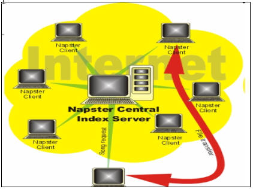
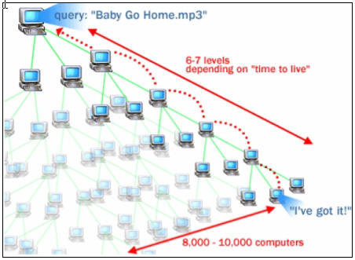
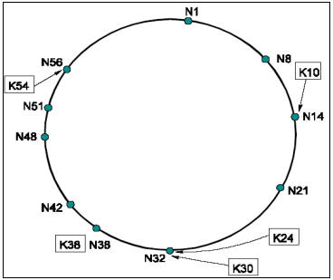
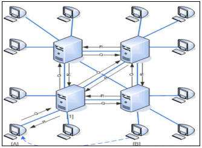

# 21.4 P2P网络通信

## 介绍

计算机网络的初衷就是建立一个相互通信的对等的计算机网络，但是由于历史问题连接在网络的计算机配置不高，计算能力和存储能力不足，因此相当长一段时间我们更倾向于使用基于客户端（client）和服务器（server）的C/S模式及浏览器（Browser）和服务器（server）的B/S模式。

采用服务器这种中心化的模式优点是易于维护，缺点是对高并发量的处理存在瓶颈。

而现代计算机的计算能力和配置都有了显著提高，建立去中心化的P（peer）2P（peer）对等网络，能很好的处理这种高并发数据处理，被广泛应用于文件下载和在线视频领域。

#### 纵观P2P的发展，主要包括4种常见的形式

* 中心化拓扑网络

* 全分布式非结构化拓扑网络

* 全分布式结构化拓扑网络

* 半分布式拓扑网络

### 中心化拓扑网络

由一台中心索引服务器连接各个设备，当需要下载某个资源时，请求索引服务器，索引服务器查询所在资源的地址返回给主机，主机则直接请求存在资源的服务器，获取结果。中心服务器不存储任何资源，只存储文件索引，这样有些的降低了服务器负荷。最典型的应用是MP3下载网站napster

但是这种中心化的P2P模式由于还是依赖于一台中心服务器，中心服务器崩溃，整个p2p网络则崩溃，可扩展性也存在问题，并且法律方面的风险比较大，napster后来就被各个唱片公司起诉。

### 全分布式非结构化拓扑网络

采用随机图组织方式，节点度数据服从power-law规律，主要采用基于完全随机图的Flooding搜索算法，即从当前节点开始查找与他相邻的索引主机，相连的主机再查找相连主机，为了控制搜索消息不至于永远这样传递下去，一般通过TTL (Time To Live)的减值来控制查询的深度,主要案例是Gnutella协议，如上图可以看出这种方式并不能查找所有的主机，只能查询到部分网络。

### 全分布式结构化拓扑网络

通过加密散列函数，一个对象的名字或关键词被映射为128位或160位的散列值，全分布式结构化拓扑的P2P网络主要是采用分布式散列表（Distributed Hash Table, 简写成DHT）技术来组织网络中的结点，DHT是由一个广域范围维护的巨大散列表，散列表有很多不连续的散列块组成，每个散列块可能存储在不同的主机，每个主机维护自己的散列块。DHT类结构能够自适应结点的动态加入/退出，有着良好的可扩展性、健壮性、结点ID分配的均匀性和自组织能力。由于重叠网络采用了确定性拓扑结构，DHT可以提供精确的发现。只要目的结点存在于网络中DHT总能发现它，发现的准确性得到了保证，最经典的案例是Tapestry，Pastry，Chord和CAN。

Pastry 是微软研究院提出的可扩展的分布式对象定位和路由协议，可用于构建大规模的P2P系统。如图3 所示，在Pastry中，每个结点分配一个128位的结点标识符号(nodeID) ，所有的结点标识符形成了一个环形的nodeID空间，范围从0到2128 - 1 ，结点加入系统时通过散列结点IP地址在128位nodeID空间中随机分配。

Chord [10]项目诞生于美国的麻省理工学院。它的目标是提供一个适合于P2P环境的分布式资源发现服务，它通过使用DHT技术使得发现指定对象只需要维护O(logN)长度的路由表。在DHT技术中，网络结点按照一定的方式分配一个唯一结点标识符(Node ID) ，资源对象通过散列运算产生一个唯一的资源标识符(Object ID) ，且该资源将存储在结点ID与之相等或者相近的结点上。需要查找该资源时，采用同样的方法可定位到存储该资源的结点。因此，Chord的主要贡献是提出了一个分布式查找协议，该协议可将指定的关键字(Key) 映射到对应的结点(Node) 。从算法来看，Chord是相容散列算法的变体。

### 半分布式拓扑结构

由于集中式网络由于过度依赖于中央索引服务器，而全分布式拓扑结构查找维护成本较高，半分布式拓扑结构吸取了中心化结构和全分布式非结构化拓扑的优点，选择性能较高（处理、存储、带宽等方面性能）的结点作为超级结点（英文表达为SuperNodes或者Hubs），在各个超级结点上存储了系统中其他部分结点的信息，发现算法仅在超级结点之间转发，超级结点再将查询请求转发给适当的叶子结点。半分布式结构也是一个层次式结构，超级结点之间构成一个高速转发层，超级结点和所负责的普通结点构成若干层次。采用这种结构的最典型的案例就是KaZaa。

#### 在实际应用中，每种拓扑结构的P2P网络都有其优缺点，下表从可扩展性、可靠性、可维护性、发现算法的效率、复杂查询等方面比较了这四种拓扑结构的综合性能。

| 比较标准／拓扑结构  |  中心化拓扑  | 全分布式非结构化拓扑  | 全分布式结构化拓扑  | 半分布式拓扑  |
| ------------- |:-------------:|:-------------:|:-------------:| -----:|
| 可扩展性  |  差  |  差 |  好 | 中 |
| 可靠性  |  差  |  好 |  好 | 中 |
| 可维护性  |  最好  |  好 |  高 | 中 |
| 发现算法效率  |  最高  |  中 |  高 | 中 |
| 复杂查询  |  支持  |  支持 |  不支持 | 中 |

