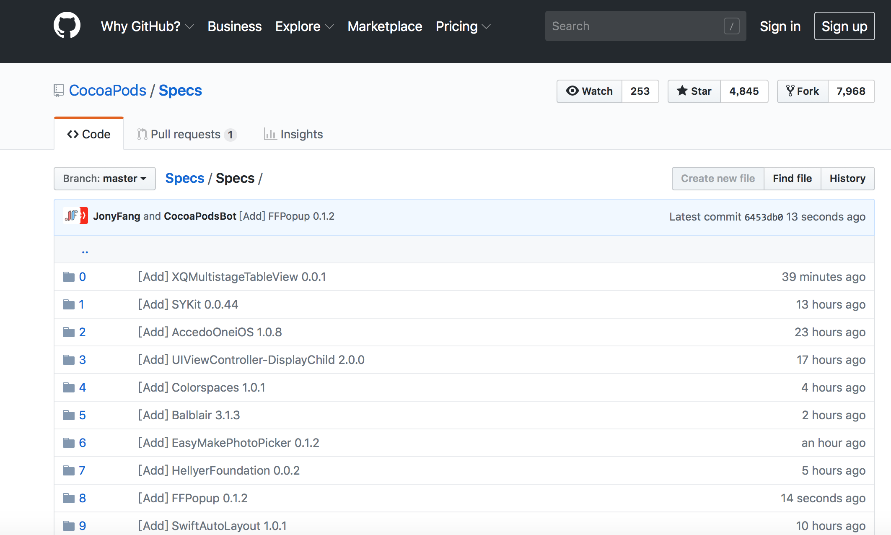
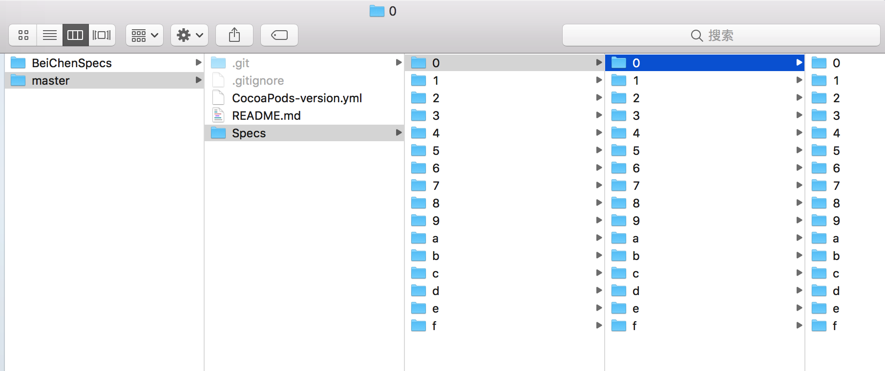
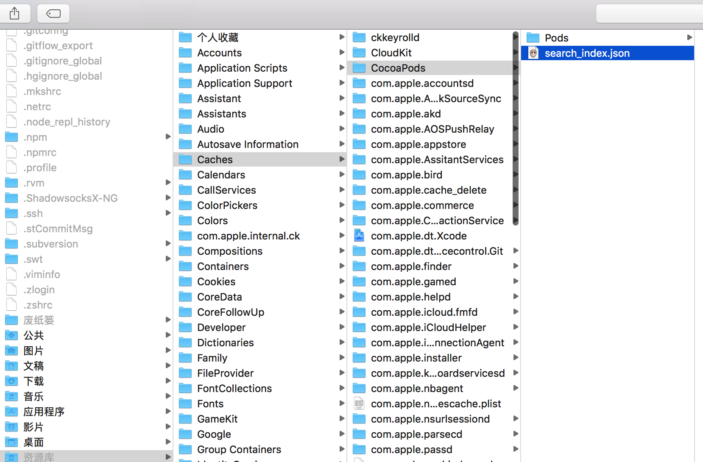
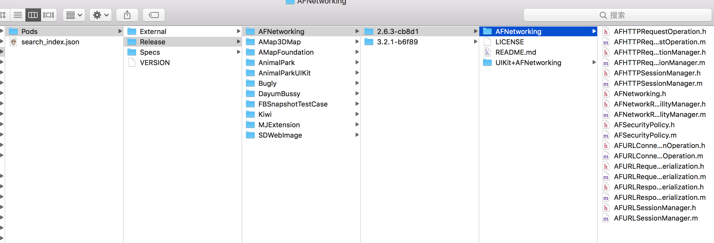
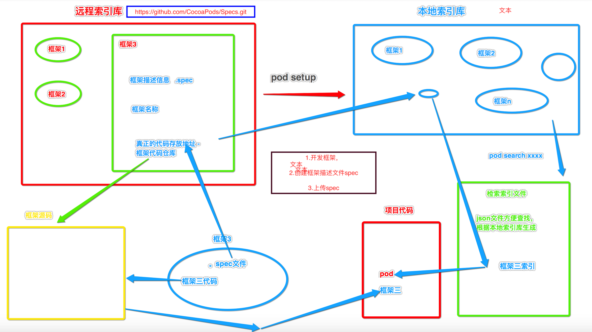

# 基于GitHub远程公有库原理剖析


## 名词解释  


##### 远程索引库  

* 远程索引库 `` https://github.com/CocoaPods/Specs.git ``



* 远程索引库以树形结构存储的是共有库配置信息 包括名词 版本 源码仓库地址等


##### 本地索引库 


*  本地索引库 ``/Users/chenbo/.cocoapods/repos/master`` 将 远程索引库中信息 `` pod setup `` 拉去到本地




#####  本地检索索引文件  通过key - value 在 ``pod search `` 依据本地索引库树形文件结构生产的文件  

* 检索索引文件 `` /Users/chenbo/Library/Caches/CocoaPods/search_index.json ``



* 如果 出现找不到 某个已有库 ，先  删除 本地索引文件 ， 再尝试更新本地索引库，非常耗时


##### 本地缓存第三方库源码 

* 缓存源码 `` /Users/chenbo/Library/Caches/CocoaPods/Pods/Release ``

* 已经执行过 `` pod install `` 到本地的第三方库源码会缓存在这里



* 缓存命令 ``pod cache``

```
chenbos-MacBook-Pro:~ chenbo$ pod cache --help
Usage:

    $ pod cache COMMAND

      Manipulate the download cache for pods, like printing the cache content or
      cleaning the pods cache.

Commands:

    + clean     Remove the cache for pods
    + list      List the paths of pod caches for each known pod

Options:

    --silent    Show nothing
    --verbose   Show more debugging information
    --no-ansi   Show output without ANSI codes
    --help      Show help banner of specified command

```

* 清楚缓存, 在同版本改错发布时需要执行删除本地缓存，才能使用时更新代码

```
chenbos-MacBook-Pro:~ chenbo$ pod cache clean --help
Usage:

    $ pod cache clean [NAME]

      Remove the cache for a given pod, or clear the cache completely.

      If there is multiple cache for various versions of the requested pod, you
      will be asked which one to clean. Use `--all` to clean them all.

      If you don't give a pod `NAME`, you need to specify the `--all` flag (this
      is to avoid cleaning all the cache by mistake).

Options:

    --all       Remove all the cached pods without asking
    --silent    Show nothing
    --verbose   Show more debugging information
    --no-ansi   Show output without ANSI codes
    --help      Show help banner of specified command

```


##  远程公共库工作原理流程




#### 生产流程


* 代码管理 源码本地仓库    ->    gitHub远程代码仓库  

* 库生产  本地 .spec 文件编写校验  ->  本地 .spec推送至远程公共索引库


#### 使用流程  

* 创建 podFile 添加 `` pod 'xxxx' ``


* 从本地索引文件中快速查找，如果找不到，会选择从缓存中拉去代码，找不到应该依据本地索引库更新索引文件，如果依旧找不到，只能选择更新本地索引库


