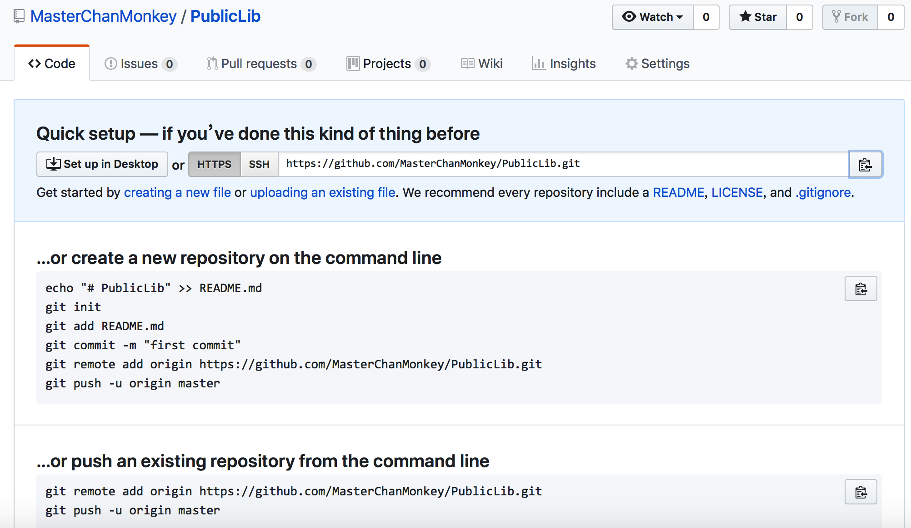
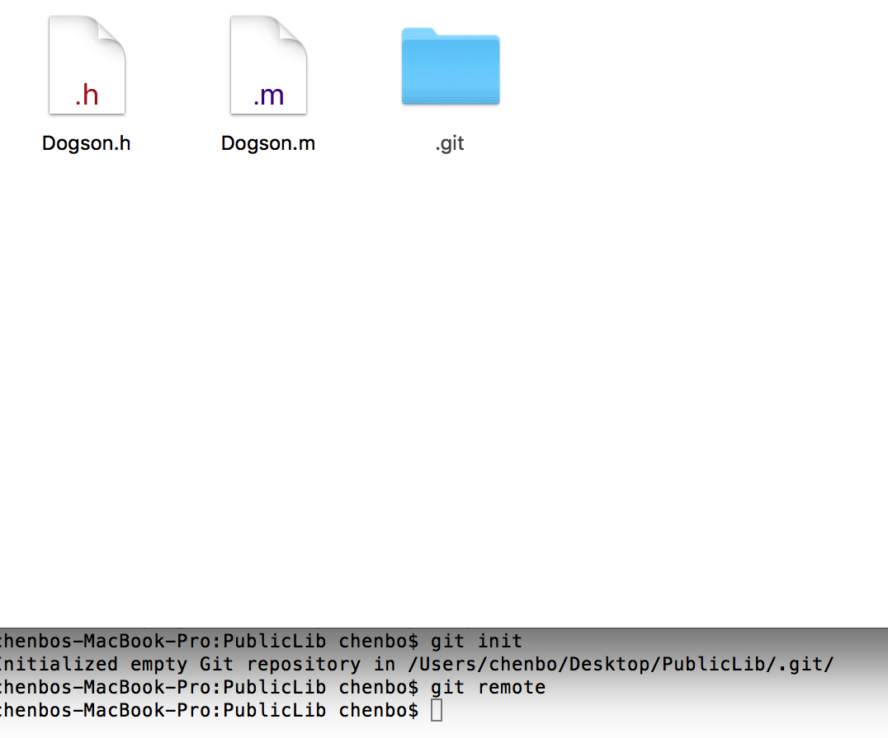
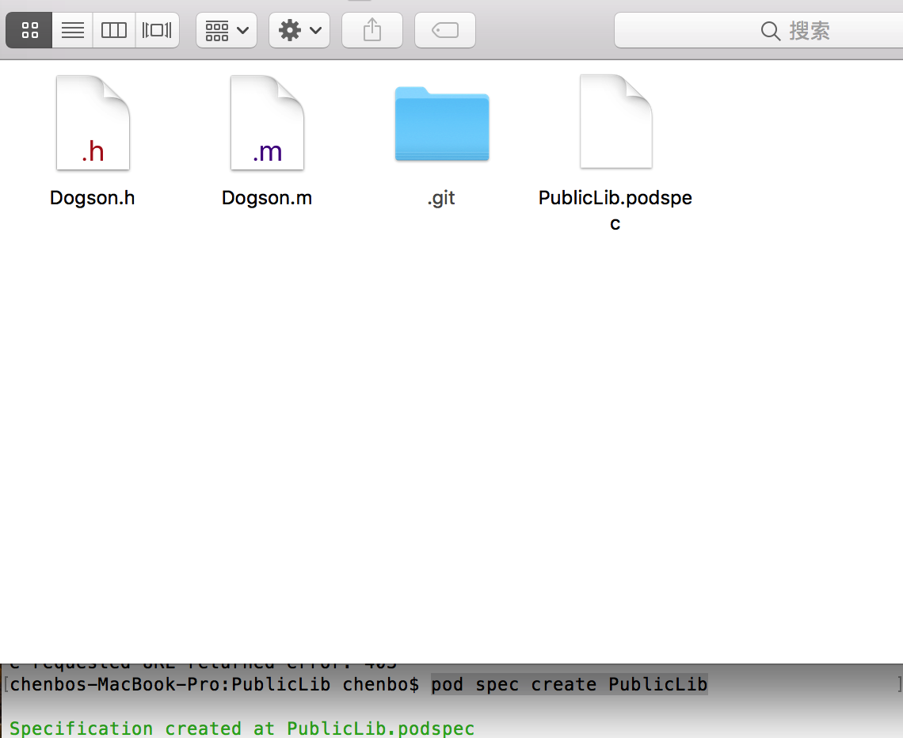

# 部署远程公有库操作流程

###  构建远程代码仓库

* github 远程代码仓库 `` https://github.com/MasterChanMonkey/PublicLib.git ``




###  构建本地代码仓库 

* 构建本地代码仓库 PublicLib



* 代码仓库关联 

```
chenbos-MacBook-Pro:PublicLib chenbo$ git remote
chenbos-MacBook-Pro:PublicLib chenbo$ git remote add origin https://github.com/MasterChanMonkey/PublicLib.git
chenbos-MacBook-Pro:PublicLib chenbo$ git remote
origin

```


## 核心流程


* 创建 .podspec 文件  ``pod spec create PublicLib``



* 编辑podspec 文件 

```
#
#  Be sure to run `pod spec lint PublicLib.podspec' to ensure this is a
#  valid spec and to remove all comments including this before submitting the spec.
#
#  To learn more about Podspec attributes see http://docs.cocoapods.org/specification.html
#  To see working Podspecs in the CocoaPods repo see https://github.com/CocoaPods/Specs/
#

Pod::Spec.new do |s|

  # ―――  Spec Metadata  ―――――――――――――――――――――――――――――――――――――――――――――――――――――――――― #
  #
  #  These will help people to find your library, and whilst it
  #  can feel like a chore to fill in it's definitely to your advantage. The
  #  summary should be tweet-length, and the description more in depth.
  #

  s.name         = "PublicLib"
  s.version      = "0.0.1"
  s.summary      = "A short description of PublicLib."

  # This description is used to generate tags and improve search results.
  #   * Think: What does it do? Why did you write it? What is the focus?
  #   * Try to keep it short, snappy and to the point.
  #   * Write the description between the DESC delimiters below.
  #   * Finally, don't worry about the indent, CocoaPods strips it!
  s.description  = <<-DESC
                   DESC

  s.homepage     = "http://EXAMPLE/PublicLib"
  # s.screenshots  = "www.example.com/screenshots_1.gif", "www.example.com/screenshots_2.gif"


  # ―――  Spec License  ――――――――――――――――――――――――――――――――――――――――――――――――――――――――――― #
  #
  #  Licensing your code is important. See http://choosealicense.com for more info.
  #  CocoaPods will detect a license file if there is a named LICENSE*
  #  Popular ones are 'MIT', 'BSD' and 'Apache License, Version 2.0'.
  #

  s.license      = "MIT (example)"
  # s.license      = { :type => "MIT", :file => "FILE_LICENSE" }


  # ――― Author Metadata  ――――――――――――――――――――――――――――――――――――――――――――――――――――――――― #
  #
  #  Specify the authors of the library, with email addresses. Email addresses
  #  of the authors are extracted from the SCM log. E.g. $ git log. CocoaPods also
  #  accepts just a name if you'd rather not provide an email address.
  #
  #  Specify a social_media_url where others can refer to, for example a twitter
  #  profile URL.
  #

  s.author             = { "北辰青" => "" }
  # Or just: s.author    = "北辰青"
  # s.authors            = { "北辰青" => "" }
  # s.social_media_url   = "http://twitter.com/北辰青"

  # ――― Platform Specifics ――――――――――――――――――――――――――――――――――――――――――――――――――――――― #
  #
  #  If this Pod runs only on iOS or OS X, then specify the platform and
  #  the deployment target. You can optionally include the target after the platform.
  #

  # s.platform     = :ios
  # s.platform     = :ios, "5.0"

  #  When using multiple platforms
  # s.ios.deployment_target = "5.0"
  # s.osx.deployment_target = "10.7"
  # s.watchos.deployment_target = "2.0"
  # s.tvos.deployment_target = "9.0"


  # ――― Source Location ―――――――――――――――――――――――――――――――――――――――――――――――――――――――――― #
  #
  #  Specify the location from where the source should be retrieved.
  #  Supports git, hg, bzr, svn and HTTP.
  #

  s.source       = { :git => "http://EXAMPLE/PublicLib.git", :tag => "#{s.version}" }


  # ――― Source Code ―――――――――――――――――――――――――――――――――――――――――――――――――――――――――――――― #
  #
  #  CocoaPods is smart about how it includes source code. For source files
  #  giving a folder will include any swift, h, m, mm, c & cpp files.
  #  For header files it will include any header in the folder.
  #  Not including the public_header_files will make all headers public.
  #

  s.source_files  = "Classes", "Classes/**/*.{h,m}"
  s.exclude_files = "Classes/Exclude"

  # s.public_header_files = "Classes/**/*.h"


  # ――― Resources ―――――――――――――――――――――――――――――――――――――――――――――――――――――――――――――――― #
  #
  #  A list of resources included with the Pod. These are copied into the
  #  target bundle with a build phase script. Anything else will be cleaned.
  #  You can preserve files from being cleaned, please don't preserve
  #  non-essential files like tests, examples and documentation.
  #

  # s.resource  = "icon.png"
  # s.resources = "Resources/*.png"

  # s.preserve_paths = "FilesToSave", "MoreFilesToSave"


  # ――― Project Linking ―――――――――――――――――――――――――――――――――――――――――――――――――――――――――― #
  #
  #  Link your library with frameworks, or libraries. Libraries do not include
  #  the lib prefix of their name.
  #

  # s.framework  = "SomeFramework"
  # s.frameworks = "SomeFramework", "AnotherFramework"

  # s.library   = "iconv"
  # s.libraries = "iconv", "xml2"


  # ――― Project Settings ――――――――――――――――――――――――――――――――――――――――――――――――――――――――― #
  #
  #  If your library depends on compiler flags you can set them in the xcconfig hash
  #  where they will only apply to your library. If you depend on other Podspecs
  #  you can include multiple dependencies to ensure it works.

  # s.requires_arc = true

  # s.xcconfig = { "HEADER_SEARCH_PATHS" => "$(SDKROOT)/usr/include/libxml2" }
  # s.dependency "JSONKit", "~> 1.4"

end

```


* .podspec 文件 校验

```
pod lib lint  校验本地podspec 文件有效性

pod spec lint 校验远程podspec 文件有效性

```


* pod trunk    注册 


```
pod trunk register '邮箱' '用户名' --description='描述'

```

向trunk服务器查询到自己的注册信息


```
pod trunk me

```


* 提交至远程索引库

```
pod trunk push xxxxx.podsepc --verbose 

```


