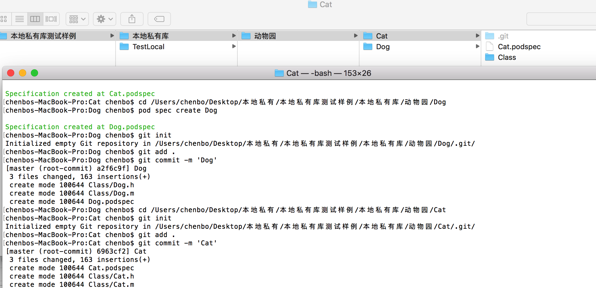

# 部署部署本地私有库操作流程


## 创建本地私有库目录结构

* 创建本地私有库 Cat 与 Dog


* 使用 `` pod spec create XXX `` 创建索引说明文件


* 分别编写对应库说明文件 


由于在同一文件下，源文件标记地址修改如下

```

s.source       = { :git => "", :tag => "#{s.version}" }

s.source_files  = "Class/**/*.{h,m}"

```


* 添加 本地git代码仓库 ，只需要本地仓库，commit即可




