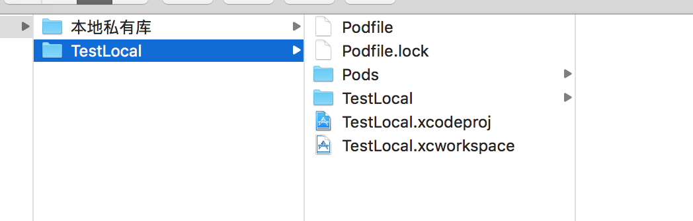
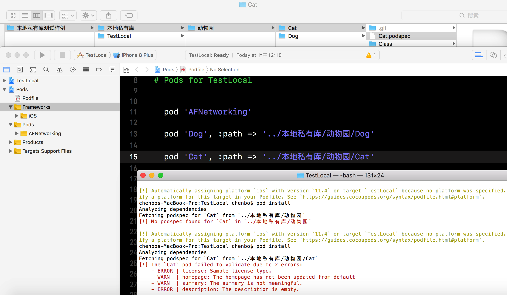
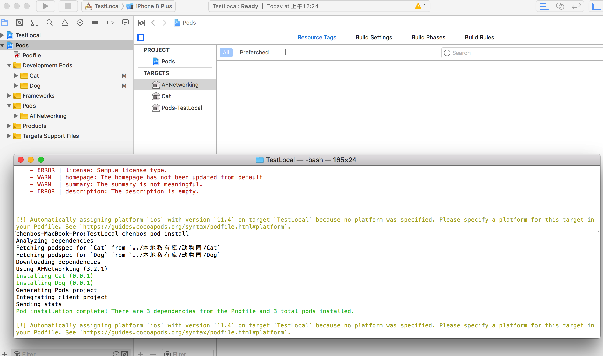
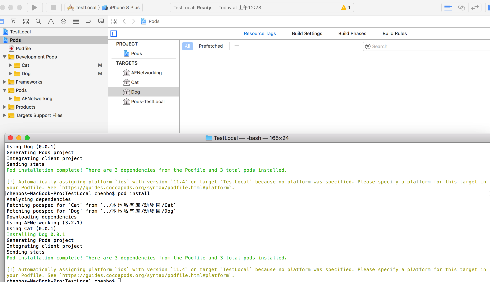

# 本地私有库使用以及维护

## 创建本地私有库`` TestLocal ``

* 创建工程并编辑PodFile文件

```

target 'TestLocal' do
  # Uncomment the next line if you're using Swift or would like to use dynamic frameworks
  # use_frameworks!

  # Pods for TestLocal

    pod 'AFNetworking'

end


```




## 编辑如何关联本地索引库

* 修改  podFile 文件  

```
target 'TestLocal' do
  # Uncomment the next line if you're using Swift or would like to use dynamic frameworks
  # use_frameworks!

  # Pods for TestLocal


    pod 'AFNetworking'
    
    pod 'Dog', :path => '../本地私有库/动物园/Dog'
    
    pod 'Cat', :path => '../本地私有库/动物园/Cat'
    
    

end

```




* 修改好说明文件后






