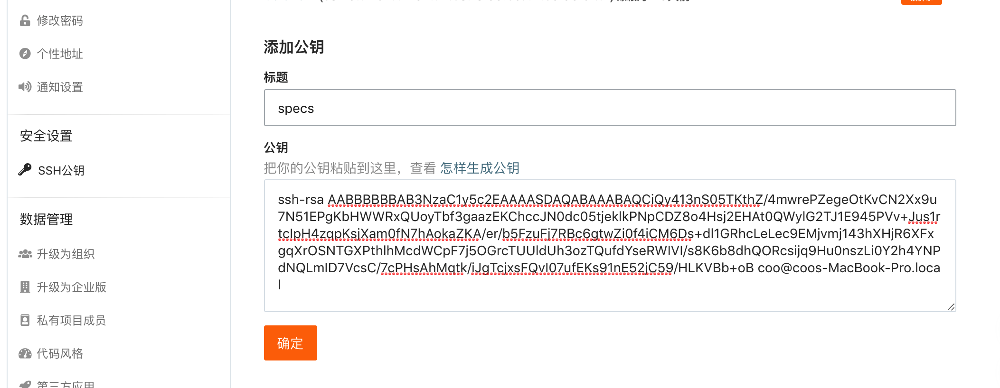
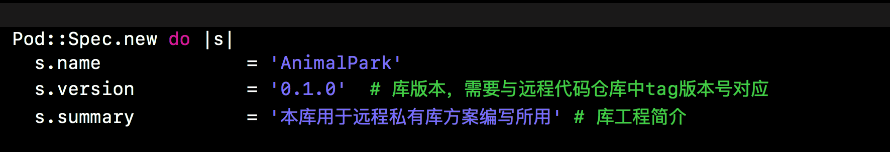

# 部署远程私有库操作流程


## 远程私有库远程索引库创建

* 基于码云远程私有库远程索引库创建
  * [码云官网](https://gitee.com/) 
  * 创建远程仓库```https://gitee.com/dawuyu/BeichenSpecs```  

   
   
  
  


* 查看本地已存在的索引库```pod repo ```

```
	MacBook-Pro:~ coo$ pod repo
	
	master
	- Type: git (master)
	- URL:  https://github.com/CocoaPods/Specs.git
	- Path: /Users/chenbo/.cocoapods/repos/master
	
	1 repo
```

* 查看```pod repo ```  下相关命令

```
	MacBook-Pro:~ coo$ pod repo --help
	Usage:
	
	    $ pod repo [COMMAND]
	
	      Manage spec-repositories
	
	Commands:
	
	    + add       Add a spec repo
	    + lint      Validates all specs in a repo
	    > list      List repos
	    + push      Push new specifications to a spec-repo
	    + remove    Remove a spec repo
	    + update    Update a spec repo
	
	Options:
	
	    --silent    Show nothing
	    --verbose   Show more debugging information
	    --no-ansi   Show output without ANSI codes
	    --help      Show help banner of specified command

```


## 创建本地的私有索引库，并与远程私有索引库进行关联

*  本地仓库与远程Git仓库关联有两种身份认证方式
  *  HTTPS仓库地址``` https://gitee.com/dawuyu/BeichenSpecs.git ``` 与码云账号密码  
  *  SSH仓库地址``` git@gitee.com:dawuyu/BeichenSpecs.git ```  结合公钥私钥


* 本次操作流程采用SSH认证方式进行两端仓库关联
  * 执行命令： ``` pod repo add 本地仓库名 远程仓库地址```
  * 注意本地仓库名最好与远程仓库项目名称一直
  * 未进行公钥私钥命令执行报错如下


```
	MacBook-Pro:~ coo$ pod repo add BeiChenSpecs git@gitee.com:dawuyu/BeichenSpecs.git
	Cloning spec repo `BeiChenSpecs` from `git@gitee.com:dawuyu/BeichenSpecs.git`
	The authenticity of host 'gitee.com (120.55.226.24)' can't be established.
	ECDSA key fingerprint is SHA256:FQGC9Kn/eye1W8icdBgrQp+KkGYoFgbVr17bmjey0Wc.
	Are you sure you want to continue connecting (yes/no)? yes
	[!] /usr/bin/git clone git@gitee.com:dawuyu/BeichenSpecs.git BeiChenSpecs
	
	Cloning into 'BeiChenSpecs'...
	Warning: Permanently added 'gitee.com,120.55.226.24' (ECDSA) to the list of known hosts.
	git@gitee.com: Permission denied (publickey).
	fatal: Could not read from remote repository.
	
	Please make sure you have the correct access rights
	and the repository exists.

```

* Mac公钥认证流程


>许多 Git 服务器都使用 SSH 公钥进行认证。 为了向 Git 服务器提供 SSH 公钥，如果某系统用户尚未拥有密钥，必须事先为其生成一份。 这个过程在所有操作系统上都是相似的。 首先，你需要确认自己是否已经拥有密钥。 默认情况下，用户的 SSH 密钥存储在其 ~/.ssh 目录下。 进入该目录并列出其中内容，你便可以快速确认自己是否已拥有密钥：


  * 查看计算机是否已生成公钥私钥

  ```
$ cd ~/.ssh
$ ls
authorized_keys2  id_dsa       known_hosts
config            id_dsa.pub
  
  ```
  
>我们需要寻找一对以 id_dsa 或 id_rsa 命名的文件，其中一个带有 .pub 扩展名。 .pub 文件是你的公钥，另一个则是私钥。 如果找不到这样的文件（或者根本没有 .ssh 目录），你可以通过运行 ssh-keygen 程序来创建它们。在 Linux/Mac 系统中，ssh-keygen 随 SSH 软件包提供；在 Windows 上，该程序包含于 MSysGit 软件包中。
>
 

  
  
  * 新开终端命令页面 执行 ``` ssh-keygen```

  


  
  * 查看公钥私钥是否生成，进入路径将其取出

  ```
  $ cat ~/.ssh/id_rsa.pub
ssh-rsa AAAAB3NzaC1yc2EAAAABIwAAAQEAklOUpkDHrfHY17SbrmTIpNLTGK9Tjom/BWDSU
GPl+nafzlHDTYW7hdI4yZ5ew18JH4JW9jbhUFrviQzM7xlELEVf4h9lFX5QVkbPppSwg0cda3
Pbv7kOdJ/MTyBlWXFCR+HAo3FXRitBqxiX1nKhXpHAZsMciLq8V6RjsNAQwdsdMFvSlVK/7XA
t3FaoJoAsncM1Q9x5+3V0Ww68/eIFmb1zuUFljQJKprrX88XypNDvjYNby6vw/Pb0rwert/En
mZ+AW4OZPnTPI89ZPmVMLuayrD2cE86Z/il8b+gw3r3+1nKatmIkjn2so1d01QraTlMqVSsbx
NrRFi9wrf+M7Q== schacon@mylaptop.local
  
  ```

  

  
  
  
  * 托管平台（码云）添加公钥


  


* 创建本地的私有索引库，并与远程私有索引库进行关联
  * 执行结果：

```
	MacBook-Pro:~ coo$ pod repo add BeiChenSpecs git@gitee.com:dawuyu/BeichenSpecs.git
	Cloning spec repo ‘BeiChenSpecs’ from ‘git@gitee.com:dawuyu/BeichenSpecs.git’
	
	MacBook-Pro:~ coo$ pod repo
	
	BeiChenSpecs
	- Type: git (master)
	- URL:  git@gitee.com:dawuyu/BeichenSpecs.git
	- Path: /Users/coo/.cocoapods/repos/BeiChenSpecs
	
	master
	- Type: git (master)
	- URL:  https://github.com/CocoaPods/Specs.git
	- Path: /Users/coo/.cocoapods/repos/master
	
	2 repos

```


## 创建功能组件模版案例远程私有库


###创建远程私有库代码仓库
* 创建功能业务围绕动物园代码仓库
  * 远程仓库地址 ``` git@gitee.com:dawuyu/AnimalPark.git ```


* 本地目标文件夹下创建Cocoapods模版库工程
  * 执行命令 ```MacBook-Pro:目标文件夹 coo$ pod lib create AnimalPark ```

  * 案例代码操作

```
MacBook-Pro:目标文件夹 coo$ pod lib create AnimalPark
Cloning `https://github.com/CocoaPods/pod-template.git` into `AnimalPark`.
Configuring AnimalPark template.
! Before you can create a new library we need to setup your git credentials.

 What is your email?
 > beichenqing528369@gmail.com   预留邮箱

! Setting your email in git to beichenqing528369@gmail.com
  git config user.email "beichenqing528369@gmail.com"

------------------------------

To get you started we need to ask a few questions, this should only take a minute.

If this is your first time we recommend running through with the guide: 
 - https://guides.cocoapods.org/making/using-pod-lib-create.html
 ( hold cmd and double click links to open in a browser. )


What platform do you want to use?? [ iOS / macOS ]
 > iOS   平台选择

What language do you want to use?? [ Swift / ObjC ]
 > ObjC  语言选择

Would you like to include a demo application with your library? [ Yes / No ]
 > Yes  是否生成测试案例工程

Which testing frameworks will you use? [ Specta / Kiwi / None ]
 > None 

Would you like to do view based testing? [ Yes / No ]
 > No    

What is your class prefix?
 > BeiChan

Running pod install on your new library.

Analyzing dependencies
Fetching podspec for `AnimalPark` from `../`
Downloading dependencies
Installing AnimalPark (0.1.0)
Generating Pods project
Integrating client project

[!] Please close any current Xcode sessions and use `AnimalPark.xcworkspace` for this project from now on.
Sending stats
Pod installation complete! There is 1 dependency from the Podfile and 1 total pod installed.

[!] Automatically assigning platform `ios` with version `9.3` on target `AnimalPark_Example` because no platform was specified. Please specify a platform for this target in your Podfile. See `https://guides.cocoapods.org/syntax/podfile.html#platform`.

 Ace! you're ready to go!
 We will start you off by opening your project in Xcode
  open 'AnimalPark/Example/AnimalPark.xcworkspace'

To learn more about the template see `https://github.com/CocoaPods/pod-template.git`.
To learn more about creating a new pod, see `http://guides.cocoapods.org/making/making-a-cocoapod`.


```
  
  
* Cocoapods模版库工程结构分析


  
  
* 样板工程中```AnimalPark.podspec ```文件详解

  
```
	#
	# Be sure to run `pod lib lint AnimalPark.podspec' to ensure this is a
	# valid spec before submitting.
	#
	# Any lines starting with a # are optional, but their use is encouraged
	# To learn more about a Podspec see https://guides.cocoapods.org/syntax/podspec.html
	#
	
	Pod::Spec.new do |s|
	  s.name             = 'AnimalPark'
	  s.version          = '0.1.0'
	  s.summary          = 'A short description of AnimalPark.'
	
	# This description is used to generate tags and improve search results.
	#   * Think: What does it do? Why did you write it? What is the focus?
	#   * Try to keep it short, snappy and to the point.
	#   * Write the description between the DESC delimiters below.
	#   * Finally, don't worry about the indent, CocoaPods strips it!
	
	  s.description      = <<-DESC
	TODO: Add long description of the pod here.
	                       DESC
	
	  s.homepage         = 'https://github.com/beichenqing528369/AnimalPark'
	  # s.screenshots     = 'www.example.com/screenshots_1', 'www.example.com/screenshots_2'
	  s.license          = { :type => 'MIT', :file => 'LICENSE' }
	  s.author           = { 'beichenqing528369' => 'beichenqing528369@gmail.com' }
	  s.source           = { :git => 'https://github.com/beichenqing528369/AnimalPark.git', :tag => s.version.to_s }
	  # s.social_media_url = 'https://twitter.com/<TWITTER_USERNAME>'
	
	  s.ios.deployment_target = '8.0'
	
	  s.source_files = 'AnimalPark/Classes/**/*'
	  
	  # s.resource_bundles = {
	  #   'AnimalPark' => ['AnimalPark/Assets/*.png']
	  # }
	
	  # s.public_header_files = 'Pod/Classes/**/*.h'
	  # s.frameworks = 'UIKit', 'MapKit'
	  # s.dependency 'AFNetworking', '~> 2.3'
	end

```
  
* 完成库说明文件podspec配置

```
	#
	# Be sure to run `pod lib lint AnimalPark.podspec' to ensure this is a
	# valid spec before submitting.
	#
	# Any lines starting with a # are optional, but their use is encouraged
	# To learn more about a Podspec see https://guides.cocoapods.org/syntax/podspec.html
	#

	Pod::Spec.new do |s|
	  s.name             = 'AnimalPark'
	  s.version          = '0.1.0'  #库版本，需要与远程代码仓库中tag版本号对应
	  s.summary          = '本库用于远程私有库方案编写所用' # 库工程简介
	
	# This description is used to generate tags and improve search results.
	#   * Think: What does it do? Why did you write it? What is the focus?
	#   * Try to keep it short, snappy and to the point.
	#   * Write the description between the DESC delimiters below.
	#   * Finally, don't worry about the indent, CocoaPods strips it!
	
	  s.description      = <<-DESC
	本库用于远程私有库方案编写所用 -------------为编写GitBooK提供案例支撑
	                       DESC
	
	  s.homepage         = 'https://gitee.com/dawuyu/AnimalPark'
	  # 将github仓库首页地址替换为本库选用git平台码云仓库首页地址
	  # s.screenshots     = 'www.example.com/screenshots_1', 'www.example.com/screenshots_2'
	  s.license          = { :type => 'MIT', :file => 'LICENSE' }
	  s.author           = { 'beichenqing528369' => 'beichenqing528369@gmail.com' }
	  s.source           = { :git => 'https://gitee.com/dawuyu/AnimalPark.git', :tag => s.version.to_s }
	  # 将库远程代码仓库地址替换为码云代码仓库地址
	  # s.social_media_url = 'https://twitter.com/<TWITTER_USERNAME>'
	
	  s.ios.deployment_target = '8.0'
	
	  s.source_files = 'AnimalPark/Classes/**/*'
	  
	  # s.resource_bundles = {
	  #   'AnimalPark' => ['AnimalPark/Assets/*.png']
	  # }
	
	  # s.public_header_files = 'Pod/Classes/**/*.h'
	  # s.frameworks = 'UIKit', 'MapKit'
	  # s.dependency 'AFNetworking', '~> 2.3'
	end

```
  
  
 * 将样板库git本地仓库与远程代码仓库相关联
   * 上文中有提到执行``` pod lib create AnimalPark```有自动生成git本地代码仓库

   * 采用HTTPS 用户名密码方式进行关联，演示案例如下：

 
```

	MacBook-Pro:~ coo$ cd /Users/chenbo/Documents/Gitee/AnimalPark 
	MacBook-Pro:AnimalPark coo$ git remote
	MacBook-Pro:AnimalPark coo$ git remote add origin https://gitee.com/dawuyu/AnimalPark.git
	MacBook-Pro:AnimalPark coo$ git remote
	origin
	chenbos-MacBook-Pro:AnimalPark coo$ git status
	On branch master
	Changes not staged for commit:
	  (use "git add <file>..." to update what will be committed)
	  (use "git checkout -- <file>..." to discard changes in working directory)
	
		modified:   AnimalPark.podspec
		modified:   Example/AnimalPark.xcodeproj/project.pbxproj
	
	Untracked files:
	  (use "git add <file>..." to include in what will be committed)
	
		Example/AnimalPark.xcworkspace/
		Example/Podfile.lock
		Example/Pods/
	
	no changes added to commit (use "git add" and/or "git commit -a")
	MacBook-Pro:AnimalPark coo$ git add .
	MacBook-Pro:AnimalPark coo$ git commit -m '修改pod库spec配置说明文件'[master cb7e856] 修改pod库spec配置说明文件
	 34 files changed, 1689 insertions(+), 8 deletions(-)
	 create mode 100644 Example/AnimalPark.xcworkspace/contents.xcworkspacedata
	 create mode 100644 Example/AnimalPark.xcworkspace/xcshareddata/IDEWorkspaceChecks.plist
	 create mode 100644 Example/Podfile.lock
	 create mode 100644 Example/Pods/Local Podspecs/AnimalPark.podspec.json
	 create mode 100644 Example/Pods/Manifest.lock
	 create mode 100644 Example/Pods/Pods.xcodeproj/project.pbxproj
	 create mode 100644 Example/Pods/Target Support Files/AnimalPark/AnimalPark-dummy.m
	 create mode 100644 Example/Pods/Target Support Files/AnimalPark/AnimalPark-prefix.pch
	 create mode 100644 Example/Pods/Target Support Files/AnimalPark/AnimalPark-umbrella.h
	 create mode 100644 Example/Pods/Target Support Files/AnimalPark/AnimalPark.modulemap
	 create mode 100644 Example/Pods/Target Support Files/AnimalPark/AnimalPark.xcconfig
	 create mode 100644 Example/Pods/Target Support Files/AnimalPark/Info.plist
	 create mode 100644 Example/Pods/Target Support Files/Pods-AnimalPark_Example/Info.plist
	 create mode 100644 Example/Pods/Target Support Files/Pods-AnimalPark_Example/Pods-AnimalPark_Example-acknowledgements.markdown
	 create mode 100644 Example/Pods/Target Support Files/Pods-AnimalPark_Example/Pods-AnimalPark_Example-acknowledgements.plist
	 create mode 100644 Example/Pods/Target Support Files/Pods-AnimalPark_Example/Pods-AnimalPark_Example-dummy.m
	 create mode 100755 Example/Pods/Target Support Files/Pods-AnimalPark_Example/Pods-AnimalPark_Example-frameworks.sh
	 create mode 100755 Example/Pods/Target Support Files/Pods-AnimalPark_Example/Pods-AnimalPark_Example-resources.sh
	 create mode 100644 Example/Pods/Target Support Files/Pods-AnimalPark_Example/Pods-AnimalPark_Example-umbrella.h
	 create mode 100644 Example/Pods/Target Support Files/Pods-AnimalPark_Example/Pods-AnimalPark_Example.debug.xcconfig
	 create mode 100644 Example/Pods/Target Support Files/Pods-AnimalPark_Example/Pods-AnimalPark_Example.modulemap
	 create mode 100644 Example/Pods/Target Support Files/Pods-AnimalPark_Example/Pods-AnimalPark_Example.release.xcconfig
	 create mode 100644 Example/Pods/Target Support Files/Pods-AnimalPark_Tests/Info.plist
	 create mode 100644 Example/Pods/Target Support Files/Pods-AnimalPark_Tests/Pods-AnimalPark_Tests-acknowledgements.markdown
	 create mode 100644 Example/Pods/Target Support Files/Pods-AnimalPark_Tests/Pods-AnimalPark_Tests-acknowledgements.plist
	 create mode 100644 Example/Pods/Target Support Files/Pods-AnimalPark_Tests/Pods-AnimalPark_Tests-dummy.m
	 create mode 100755 Example/Pods/Target Support Files/Pods-AnimalPark_Tests/Pods-AnimalPark_Tests-frameworks.sh
	 create mode 100755 Example/Pods/Target Support Files/Pods-AnimalPark_Tests/Pods-AnimalPark_Tests-resources.sh
	 create mode 100644 Example/Pods/Target Support Files/Pods-AnimalPark_Tests/Pods-AnimalPark_Tests-umbrella.h
	 create mode 100644 Example/Pods/Target Support Files/Pods-AnimalPark_Tests/Pods-AnimalPark_Tests.debug.xcconfig
	 create mode 100644 Example/Pods/Target Support Files/Pods-AnimalPark_Tests/Pods-AnimalPark_Tests.modulemap
	 create mode 100644 Example/Pods/Target Support Files/Pods-AnimalPark_Tests/Pods-AnimalPark_Tests.release.xcconfig
	chenbos-MacBook-Pro:AnimalPark chenbo$ git log
	commit cb7e856418ef75cd5be08f3dd43002d4766bb8cd (HEAD -> master)
	Author: 北辰青 <>
	Date:   Wed Aug 8 22:20:26 2018 +0800
	
	    修改pod库spec配置说明文件
	
	commit 1fa8ef5bfcd4a5558281d64bf9f6d83f0fc06190
	Author: 北辰青 <>
	Date:   Tue Aug 7 23:30:41 2018 +0800
	
	    Initial commit
	MacBook-Pro:AnimalPark coo$ git push origin master
	Counting objects: 83, done.
	Delta compression using up to 4 threads.
	Compressing objects: 100% (74/74), done.
	Writing objects: 100% (83/83), 29.71 KiB | 2.70 MiB/s, done.
	Total 83 (delta 19), reused 0 (delta 0)
	remote: Powered by Gitee.com
	To https://gitee.com/dawuyu/AnimalPark.git
	 * [new branch]      master -> master


```
  
  


## CocoaPods私有库-开发-提交-使用


### 私有库需求代码开发

* 若私有库业务代码已存在即可按照下图中将代码拷贝到目标文件夹
  * 需要在测试工程文件夹下执行``` pod install```

```
MacBook-Pro:AnimalPark coo$ ls
AnimalPark		Example			README.md
AnimalPark.podspec	LICENSE			_Pods.xcodeproj
MacBook-Pro:AnimalPark coo$ cd Example
MacBook-Pro:Example coo$ pod install
Analyzing dependencies
Fetching podspec for `AnimalPark` from `../`
Downloading dependencies
Installing AnimalPark 0.1.0
Generating Pods project
Integrating client project
Sending stats
Pod installation complete! There is 1 dependency from the Podfile and 1 total pod installed.

[!] Automatically assigning platform `ios` with version `9.3` on target `AnimalPark_Example` because no platform was specified. Please specify a platform for this target in your Podfile. See `https://guides.cocoapods.org/syntax/podfile.html#platform`.

  
```


  


---
### 私有库代码提交以及如何提交至远程私有索引库

###### 核对私有库代码仓库Tag版本与``` AnimalPark.podspec```是否一致

```
MacBook-Pro:AnimalPark coo$ git tag
MacBook-Pro:AnimalPark coo$ git tag '0.1.0'
MacBook-Pro:AnimalPark coo$ git tag
0.1.0
MacBook-Pro:AnimalPark coo$ git push --tags
Total 0 (delta 0), reused 0 (delta 0)
remote: Powered by Gitee.com
To https://gitee.com/dawuyu/AnimalPark.git
 * [new tag]         0.1.0 -> 0.1.0

MacBook-Pro:~ coo$ cd /Users/coo/Documents/Gitee/AnimalPark 
MacBook-Pro:AnimalPark coo$ git tag
0.1.0
```


#### ``` AnimalPark.podspec```文件本地验证 podspec 有效性
 *  执行 ```pod lib lint ```

```
MacBook-Pro:AnimalPark coo$ pod lib lint

 -> AnimalPark (0.1.0)
    - WARN  | url: The URL (https://gitee.com/dawuyu/AnimalPark) is not reachable.

[!] AnimalPark did not pass validation, due to 1 warning (but you can use `--allow-warnings` to ignore it) and all results apply only to public specs, but you can use `--private` to ignore them if linting the specification for a private pod.
You can use the `--no-clean` option to inspect any issue.
chenbos-MacBook-Pro:AnimalPark chenbo$ pod lib lint -- help

 -> help
    - ERROR | spec: The specification defined in `help` could not be loaded.

[!] No podspec exists at path `help`.

[!] help did not pass validation, due to 1 error.
You can use the `--no-clean` option to inspect any issue.

```

###### 查看```pod lib lint ```命令详情

* 执行 ``` pod lib lint --help ```

```
MacBook-Pro:AnimalPark coo$ pod lib lint --help
Usage:

    $ pod lib lint

      Validates the Pod using the files in the working directory.

Options:

    --quick                                           Lint skips checks that
                                                      would require to download
                                                      and build the spec
    --allow-warnings                                  Lint validates even if
                                                      warnings are present
    --subspec=NAME                                    Lint validates only the
                                                      given subspec
    --no-subspecs                                     Lint skips validation of
                                                      subspecs
    --no-clean                                        Lint leaves the build
                                                      directory intact for
                                                      inspection
    --fail-fast                                       Lint stops on the first
                                                      failing platform or
                                                      subspec
    --use-libraries                                   Lint uses static libraries
                                                      to install the spec
    --sources=https://github.com/artsy/Specs,master   The sources from which to
                                                      pull dependent pods
                                                      (defaults to
                                                      https://github.com/CocoaPods/Specs.git).
                                                      Multiple sources must be
                                                      comma-delimited.
    --private                                         Lint skips checks that
                                                      apply only to public specs
    --swift-version=VERSION                           The SWIFT_VERSION that
                                                      should be used to lint the
                                                      spec. This takes
                                                      precedence over a
                                                      .swift-version file.
    --skip-import-validation                          Lint skips validating that
                                                      the pod can be imported
    --skip-tests                                      Lint skips building and
                                                      running tests during
                                                      validation
    --silent                                          Show nothing
    --verbose                                         Show more debugging
                                                      information
    --no-ansi                                         Show output without ANSI
                                                      codes
    --help                                            Show help banner of
                                                      specified command

```

* 执行 ``` pod lib lint --private ``` 本地成功校验 podspec 有效性

```
MacBook-Pro:AnimalPark coo$ pod lib lint --private

 -> AnimalPark (0.1.0)
    - WARN  | url: The URL (https://gitee.com/dawuyu/AnimalPark) is not reachable.

AnimalPark passed validation.


```

#### ``` AnimalPark.podspec```文件远程验证 podspec 有效性

* 执行 ``` pod spec lint ```

```
MacBook-Pro:AnimalPark coo$ pod spec lint

 -> AnimalPark (0.1.0)
    - WARN  | url: The URL (https://gitee.com/dawuyu/AnimalPark) is not reachable.

Analyzed 1 podspec.

[!] The spec did not pass validation, due to 1 warning (but you can use `--allow-warnings` to ignore it) and all results apply only to public specs, but you can use `--private` to ignore them if linting the specification for a private pod.
```

###### 查看``` pod spec lint ```命令详情

* 执行 ``` pod spec lint --help ```

```
MacBook-Pro:AnimalPark coo$ pod spec lint --help
Usage:

    $ pod spec lint [NAME.podspec|DIRECTORY|http://PATH/NAME.podspec ...]

      Validates `NAME.podspec`. If a `DIRECTORY` is provided, it validates the
      podspec files found, including subfolders. In case the argument is
      omitted, it defaults to the current working dir.

Options:

    --quick                                           Lint skips checks that
                                                      would require to download
                                                      and build the spec
    --allow-warnings                                  Lint validates even if
                                                      warnings are present
    --subspec=NAME                                    Lint validates only the
                                                      given subspec
    --no-subspecs                                     Lint skips validation of
                                                      subspecs
    --no-clean                                        Lint leaves the build
                                                      directory intact for
                                                      inspection
    --fail-fast                                       Lint stops on the first
                                                      failing platform or
                                                      subspec
    --use-libraries                                   Lint uses static libraries
                                                      to install the spec
    --sources=https://github.com/artsy/Specs,master   The sources from which to
                                                      pull dependent pods
                                                      (defaults to
                                                      https://github.com/CocoaPods/Specs.git).
                                                      Multiple sources must be
                                                      comma-delimited.
    --private                                         Lint skips checks that
                                                      apply only to public specs
    --swift-version=VERSION                           The SWIFT_VERSION that
                                                      should be used to lint the
                                                      spec. This takes
                                                      precedence over a
                                                      .swift-version file.
    --skip-import-validation                          Lint skips validating that
                                                      the pod can be imported
    --skip-tests                                      Lint skips building and
                                                      running tests during
                                                      validation
    --silent                                          Show nothing
    --verbose                                         Show more debugging
                                                      information
    --no-ansi                                         Show output without ANSI
                                                      codes
    --help                                            Show help banner of
                                                      specified command

```

* 执行 ``` pod spec lint --private ``` 本地成功校验 podspec 有效性

```
MacBook-Pro:AnimalPark coo$ pod spec lint --private

 -> AnimalPark (0.1.0)
    - WARN  | url: The URL (https://gitee.com/dawuyu/AnimalPark) is not reachable.

Analyzed 1 podspec.

AnimalPark.podspec passed validation.


```


#### 将本地私有库说明文件 ``` AnimalPark.podspec ``` 提交至远程私有Pod索引库 

* 远程私有索引库地址 ``` BeiChenSpecs ```

```
MacBook-Pro:AnimalPark coo$ pod repo

BeiChenSpecs
- Type: git (master)
- URL:  git@gitee.com:dawuyu/BeichenSpecs.git
- Path: /Users/chenbo/.cocoapods/repos/BeiChenSpecs

master
- Type: git (master)
- URL:  https://github.com/CocoaPods/Specs.git
- Path: /Users/chenbo/.cocoapods/repos/master

2 repos


```

* 查看 ``` pod repo ``` 命令详情

```
MacBook-Pro:AnimalPark coo$ pod repo --help
Usage:

    $ pod repo [COMMAND]

      Manage spec-repositories

Commands:

    + add       Add a spec repo
    + lint      Validates all specs in a repo
    > list      List repos
    + push      Push new specifications to a spec-repo
    + remove    Remove a spec repo
    + update    Update a spec repo

Options:

    --silent    Show nothing
    --verbose   Show more debugging information
    --no-ansi   Show output without ANSI codes
    --help      Show help banner of specified command

```

* 执行 ``` pod repo push Pod本地索引库名称 说明文件名称  ```  

```
MacBook-Pro:AnimalPark coo$ pod repo push BeiChenSpecs AnimalPark.podspec

Validating spec
 -> AnimalPark (0.1.0)
    - WARN  | url: The URL (https://gitee.com/dawuyu/AnimalPark) is not reachable.

Updating the `BeiChenSpecs' repo

Already up to date.

Adding the spec to the `BeiChenSpecs' repo

 - [Add] AnimalPark (0.1.0)

Pushing the `BeiChenSpecs' repo

```


*  ``` pod repo push ```  命令详解以及试错
  *  ``` pod repo push ``` 本质上完成了将本地私有库，库说明文件``` AnimalPark.podspec ``` 推送到远程私有索引库 ``` git@gitee.com:dawuyu/BeichenSpecs.git ```
  *  实际上本地私有库库说明文件``` AnimalPark.podspec ``` 先推送至私有库本地索引库 ``` BeiChenSpecs ``` ，然后再推送至私有库远程索引库中 ``` git@gitee.com:dawuyu/BeichenSpecs.git ```

  
  * 错误演示  ``` pod repo push ``` + ```BeichenSpecs（远程索引库名称） ``` + ``` AnimalPark.podspec ```

```
	MacBook-Pro:AnimalPark coo$ pod repo push BeichenSpecs AnimalPark.podspec
	Cloning spec repo `beichenspecs-1` from `BeichenSpecs`
	[!] Unable to find the `BeichenSpecs` repo. If it has not yet been cloned, add it via `pod repo add`.
	
	MacBook-Pro:AnimalPark coo$ pod repo
	
	BeiChenSpecs
	- Type: git (master)
	- URL:  git@gitee.com:dawuyu/BeichenSpecs.git
	- Path: /Users/chenbo/.cocoapods/repos/BeiChenSpecs
	
	beichenspecs-1
	- Type: git (master)
	- URL:  /Users/chenbo/.cocoapods/repos/BeichenSpecs
	- Path: /Users/chenbo/.cocoapods/repos/beichenspecs-1
	
	master
	- Type: git (master)
	- URL:  https://github.com/CocoaPods/Specs.git
	- Path: /Users/chenbo/.cocoapods/repos/master
	
	3 repos
	
	MacBook-Pro:AnimalPark coo$ pod repo remove beichenspecs-1
	Removing spec repo `beichenspecs-1`
	
	MacBook-Pro:AnimalPark coo$ pod repo
	
	BeiChenSpecs
	- Type: git (master)
	- URL:  git@gitee.com:dawuyu/BeichenSpecs.git
	- Path: /Users/chenbo/.cocoapods/repos/BeiChenSpecs
	
	master
	- Type: git (master)
	- URL:  https://github.com/CocoaPods/Specs.git
	- Path: /Users/chenbo/.cocoapods/repos/master
	


```


### 项目开发中远程私有库使用


> 远程私有库使用与远程公有库并无本质性区别

* 使用时需要注意到的细节
 * 1.创建Podfile文件后源文件需要关联
 * 2.使用中如果出现已关联源文件但无法Search可以采用下文中列举的三个方法

 
 
```
	MacBook-Pro:AnimalParkProject coo$ pod install
	Analyzing dependencies
	[!] Unable to find a specification for `AFNetworking`

```
 
 
 
 
* 已关联源文件但无法Search 解决方案

 * 1.执行 ```pod update``` 和 ``` pod setup ``` 更新本地索引库以及索引文件
 * 2.删除对应本地的索引库对于的本地索引文件 资源路径 ``` /Users/coo/Library/Caches/CocoaPods/search_index.json
 ```
 
 * 3.删除本地索引库同时删除本地索引文件

 


