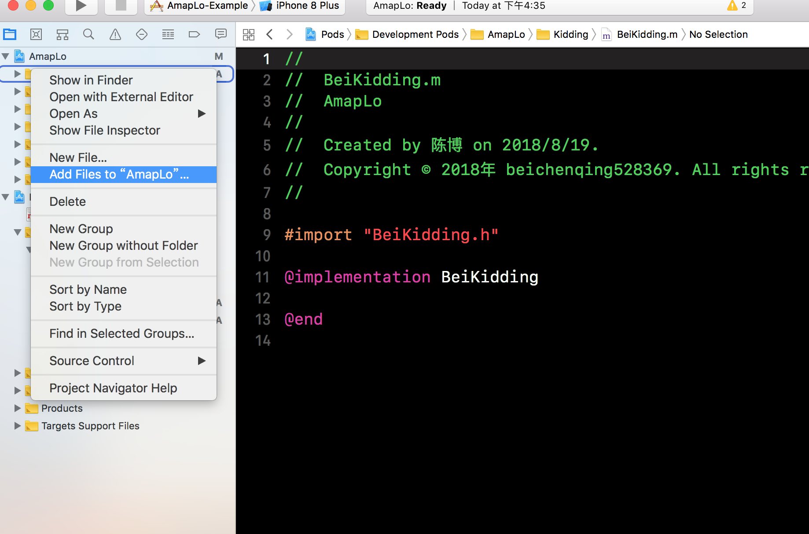
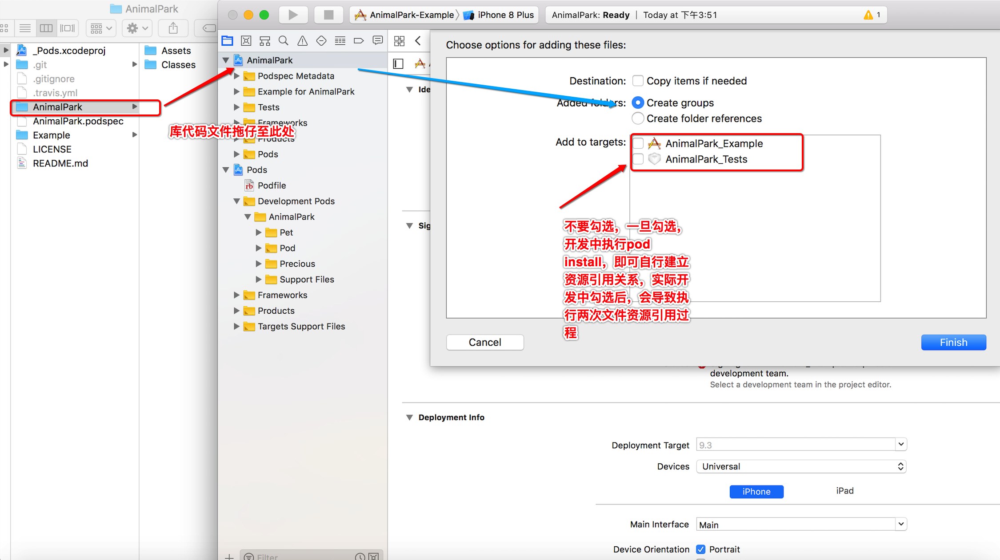
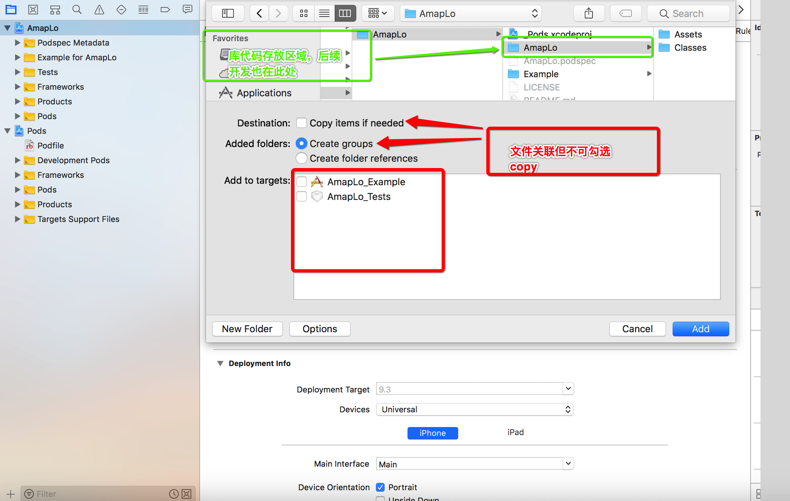
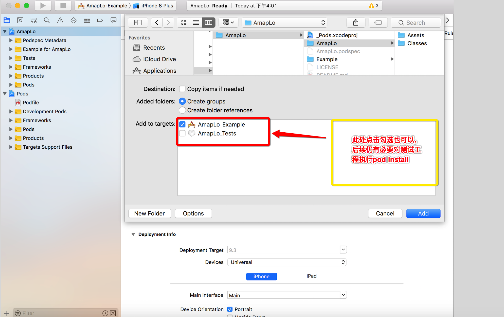
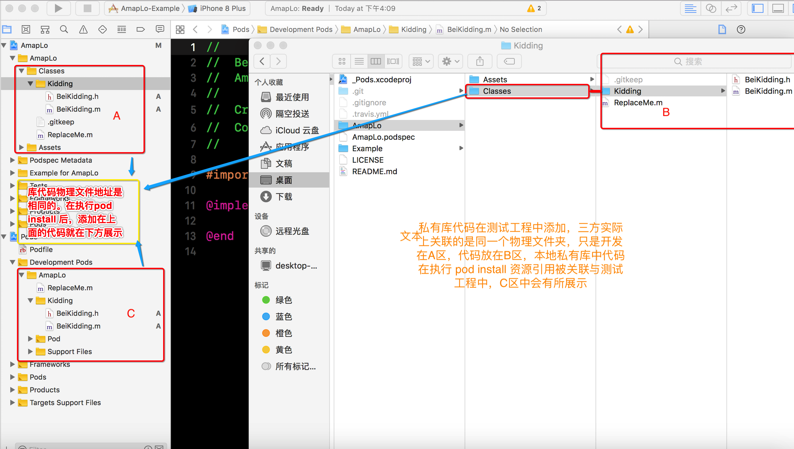
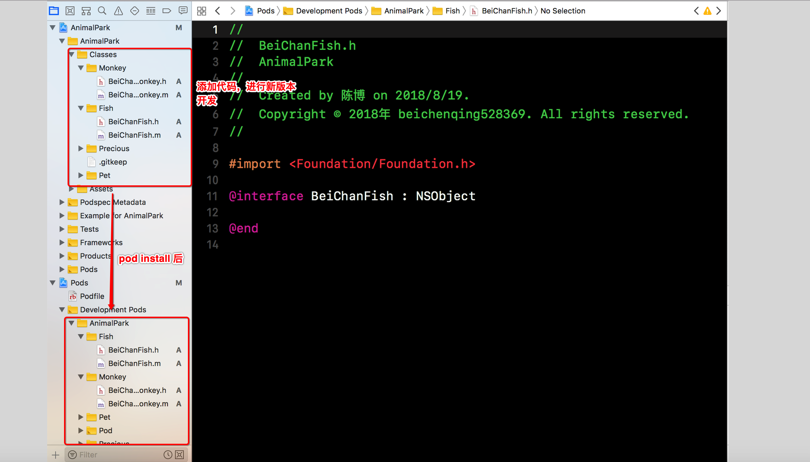
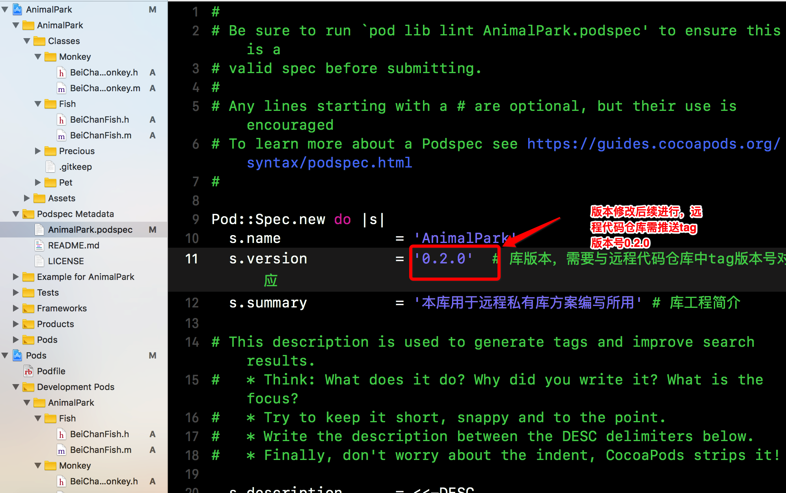
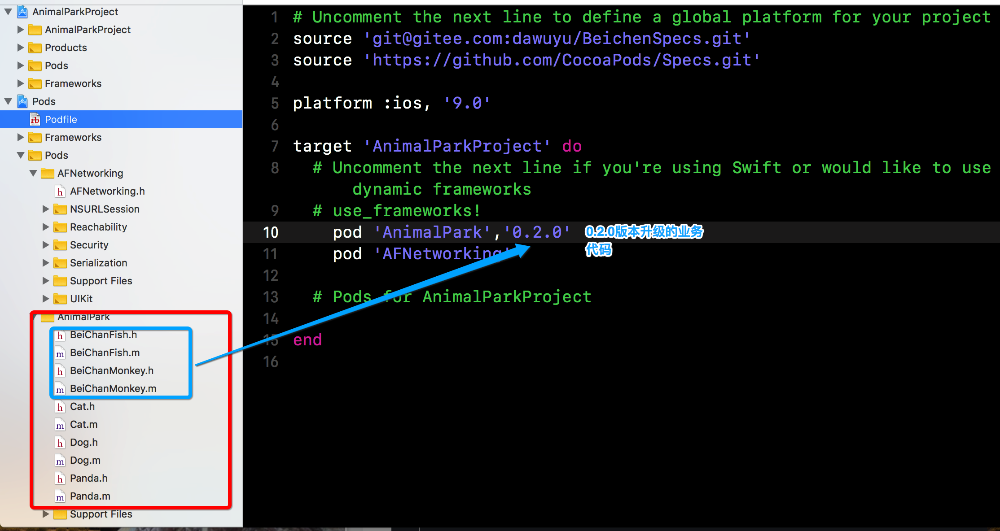

# 远程私有库维护升级

> 在私有库样板工程项目创建之后私有库需要不停的更新维护，一般可以选择比较麻烦的方式开发
> 
> * 额外建立库代码开发工程  缺点：需要copy代码，不利于库版本控制以及，每次更新要么copy代码 ，要么copy源文件
> * 私有库样板工程测试工程中开发 代码源文件资源关联测试工程target 缺点：也需要copy代码 ，要么copy源文件
> 
> * 根据Xcode工程管理界面，文件文件夹资源与工程target关联关系，文件路径引用规范，有了文中更符合规范的远程私有库开发方案


### 远程私有库样板工程库开发流程

* 测试工程对私有库代码进行管理-文件资源加入

> 方案- 执行 ``` add files``` 操作



> 方案二 拖拽原本库代码文件




* 测试工程对私有库代码进行管理-文件资源关联




*  库开发中详解 




### 私有库代码开发实践


* 代码开发以及调试



* 修改库说明文件 ``` AnimalPark.podspec ```



* 将修改代码提交至远程代码仓库

```

	MacBook-Pro:Example coo$ cd /Users/coo/Documents/Gitee/AnimalPark 
	MacBook-Pro:AnimalPark coo$ git status
	On branch master
	Changes to be committed:
	  (use "git reset HEAD <file>..." to unstage)
	
		new file:   AnimalPark/Classes/Fish/BeiChanFish.h
		new file:   AnimalPark/Classes/Fish/BeiChanFish.m
		new file:   AnimalPark/Classes/Monkey/BeiChanMonkey.h
		new file:   AnimalPark/Classes/Monkey/BeiChanMonkey.m
	
	Changes not staged for commit:
	  (use "git add <file>..." to update what will be committed)
	  (use "git checkout -- <file>..." to discard changes in working directory)
	
		modified:   AnimalPark.podspec
		modified:   Example/AnimalPark.xcodeproj/project.pbxproj
		modified:   Example/Pods/Pods.xcodeproj/project.pbxproj
		modified:   Example/Pods/Target Support Files/AnimalPark/AnimalPark-umbrella.h
	
	Untracked files:
	  (use "git add <file>..." to include in what will be committed)
	
		Example/Pods/Pods.xcodeproj/project.xcworkspace/
	
	MacBook-Pro:AnimalPark coo$ git add .
	MacBook-Pro:AnimalPark coo$ git commit -m'库开发维护01'
	[master ab78283] 库开发维护01
	 9 files changed, 374 insertions(+), 181 deletions(-)
	 create mode 100644 AnimalPark/Classes/Fish/BeiChanFish.h
	 create mode 100644 AnimalPark/Classes/Fish/BeiChanFish.m
	 create mode 100644 AnimalPark/Classes/Monkey/BeiChanMonkey.h
	 create mode 100644 AnimalPark/Classes/Monkey/BeiChanMonkey.m
	 create mode 100644 Example/Pods/Pods.xcodeproj/project.xcworkspace/contents.xcworkspacedata
	MacBook-Pro:AnimalPark coo$ git push origin master
	Counting objects: 22, done.
	Delta compression using up to 4 threads.
	Compressing objects: 100% (22/22), done.
	Writing objects: 100% (22/22), 9.38 KiB | 2.34 MiB/s, done.
	Total 22 (delta 10), reused 0 (delta 0)
	remote: Powered by Gitee.com
	To https://gitee.com/dawuyu/AnimalPark.git
	   bff3a33..ab78283  master -> master
	MacBook-Pro:AnimalPark coo$ git log
	commit ab782836684ac561cdae0606b159ef6c77ffb962 (HEAD -> master, origin/master)
	Author: 北辰青 <>
	Date:   Sun Aug 19 18:03:43 2018 +0800
	
	    库开发维护01
	
	commit bff3a332a2612f9d3b421a58cded8866964c98e4 (tag: 0.1.0)
	Author: 北辰青 <>
	Date:   Wed Aug 8 23:30:36 2018 +0800
	
	    业务代码拷贝至本地pod库
	
	commit cb7e856418ef75cd5be08f3dd43002d4766bb8cd
	Author: 北辰青 <>
	Date:   Wed Aug 8 22:20:26 2018 +0800
	
	    修改pod库spec配置说明文件
	
	commit 1fa8ef5bfcd4a5558281d64bf9f6d83f0fc06190
	Author: 北辰青 <>
	Date:   Tue Aug 7 23:30:41 2018 +0800
	
	    Initial commit
	MacBook-Pro:AnimalPark coo$ git tag
	0.1.0
	MacBook-Pro:AnimalPark coo$ git tag '0.2.0'
	MacBook-Pro:AnimalPark coo$ git tag
	0.1.0
	0.2.0
	MacBook-Pro:AnimalPark coo$ git push origin 0.2.0
	Total 0 (delta 0), reused 0 (delta 0)
	remote: Powered by Gitee.com
	To https://gitee.com/dawuyu/AnimalPark.git
	 * [new tag]         0.2.0 -> 0.2.0
	MacBook-Pro:AnimalPark coo$ pod spec lint --private
	
	 -> AnimalPark (0.2.0)
	    - WARN  | url: The URL (https://gitee.com/dawuyu/AnimalPark) is not reachable.
	
	Analyzed 1 podspec.
	
	AnimalPark.podspec passed validation.
	
	MacBook-Pro:AnimalPark coo$ pod repo
	
	BeiChenSpecs
	- Type: git (master)
	- URL:  git@gitee.com:dawuyu/BeichenSpecs.git
	- Path: /Users/chenbo/.cocoapods/repos/BeiChenSpecs
	
	master
	- Type: git (master)
	- URL:  https://github.com/CocoaPods/Specs.git
	- Path: /Users/chenbo/.cocoapods/repos/master
	
	2 repos
	MacBook-Pro:AnimalPark coo$ pod repo push BeiChenSpecs AnimalPark.podspec
	
	Validating spec
	 -> AnimalPark (0.2.0)
	    - WARN  | url: The URL (https://gitee.com/dawuyu/AnimalPark) is not reachable.
	
	Updating the `BeiChenSpecs' repo
	
	Already up to date.
	
	Adding the spec to the `BeiChenSpecs' repo
	
	 - [Update] AnimalPark (0.2.0)
	
	Pushing the `BeiChenSpecs' repo


```


* 项目主工程中使用

 * 工程``` Podfile ```文件锁定版本 ``` Podfile ```

 
 


