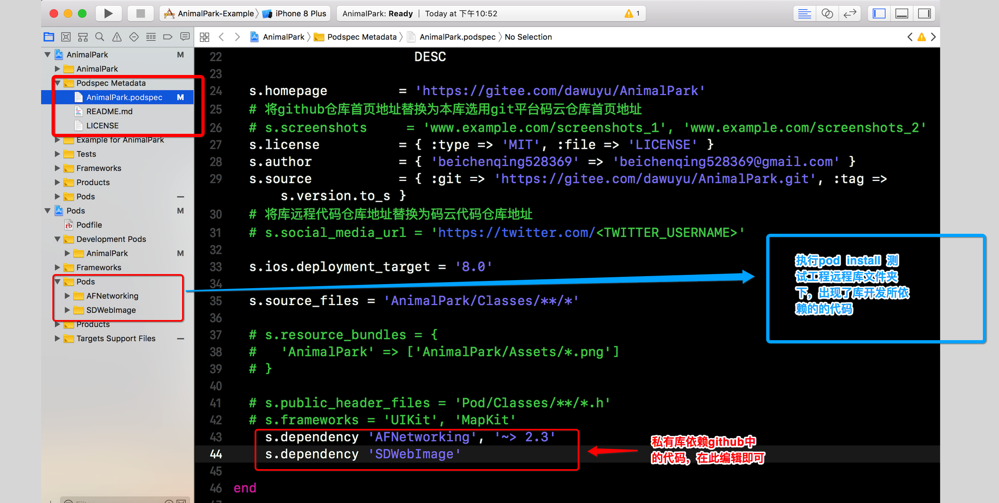
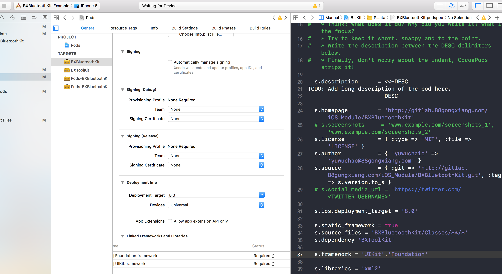
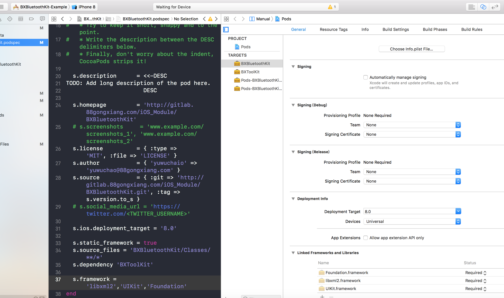
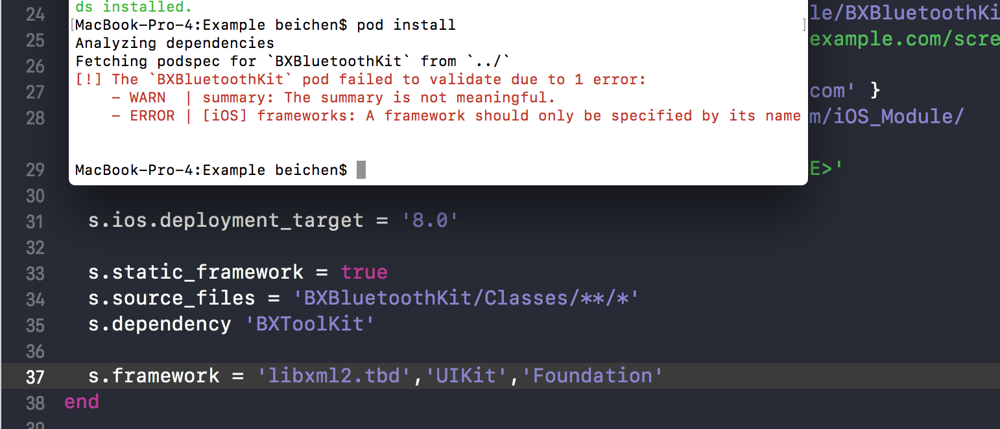
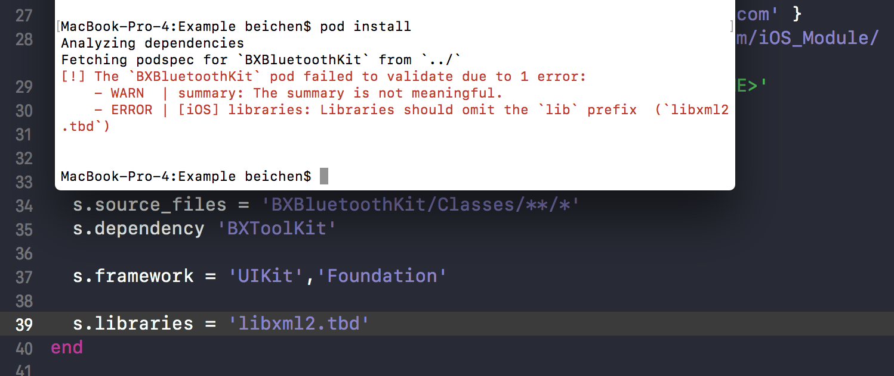
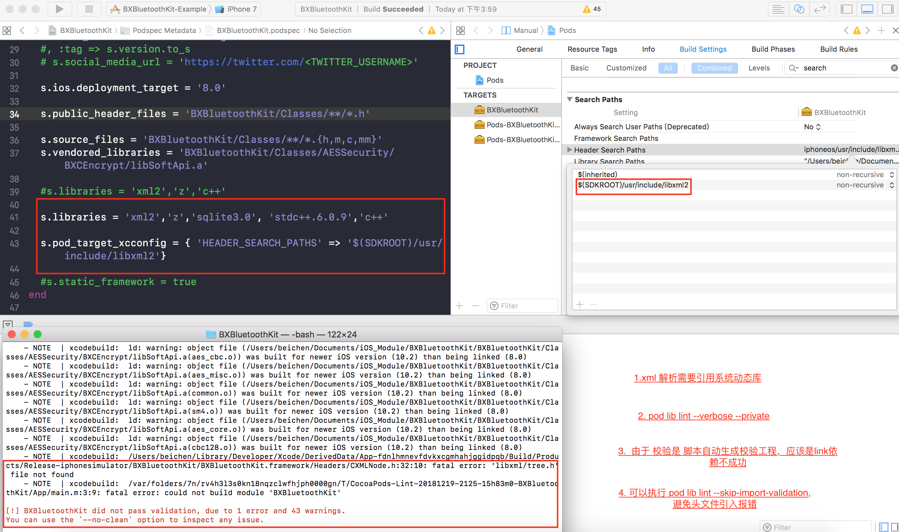
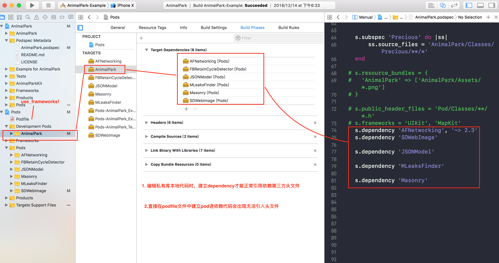
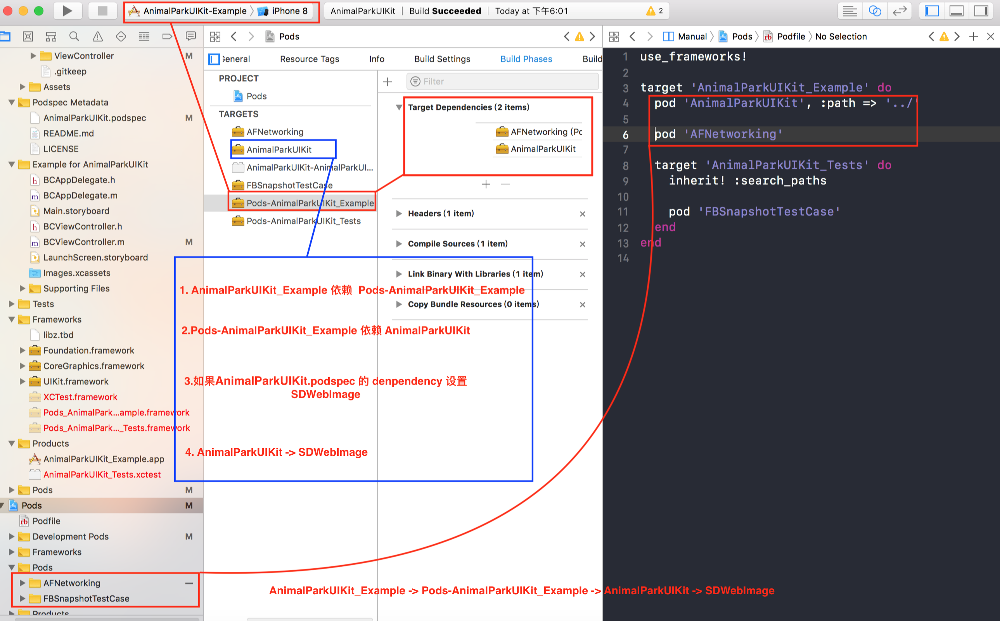
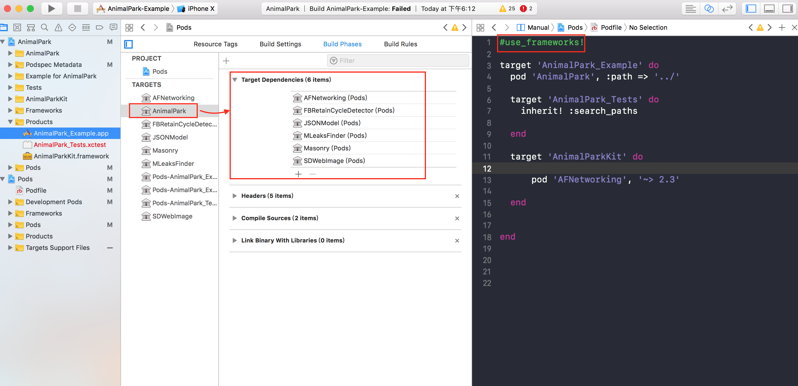

# 远程私有库库依赖处理

#### 开源公有库依赖

* 需要在私有库说明文件  ``` ``` 中进行库依赖处理

```
	s.dependency 'AFNetworking', '~> 2.3'
    s.dependency 'SDWebImage'

```

> 执行 ``` pod install ``` 后，样板工程




* 库依赖与主工程依赖的项目或者其他私有库，需要维持版本号统一
* 遇到无法检测通过的，执行 ``` pod spec lint --private --allow-warnings ```
* 库说明文件代码警告报错 ``` pod repo push BeiChenSpecs AnimalPark.podspec --allow-warnings ```


```
MacBook-Pro:AnimalPark coo$ git tag 0.3.0
MacBook-Pro:AnimalPark coo$ git tag
0.1.0
0.2.0
0.3.0
MacBook-Pro:AnimalPark coo$ git push tags
fatal: 'tags' does not appear to be a git repository
fatal: Could not read from remote repository.

Please make sure you have the correct access rights
and the repository exists.
MacBook-Pro:AnimalPark coo$ git push --tags
Total 0 (delta 0), reused 0 (delta 0)
remote: Powered by Gitee.com
To https://gitee.com/dawuyu/AnimalPark.git
 * [new tag]         0.3.0 -> 0.3.0


MacBook-Pro:AnimalPark coo$ pod repo

BeiChenSpecs
- Type: git (master)
- URL:  git@gitee.com:dawuyu/BeichenSpecs.git
- Path: /Users/coo/.cocoapods/repos/BeiChenSpecs

master
- Type: git (master)
- URL:  https://github.com/CocoaPods/Specs.git
- Path: /Users/coo/.cocoapods/repos/master

2 repos
MacBook-Pro:AnimalPark coo$ pod repo push BeiChenSpecs AnimalPark.podspec

Validating spec
 -> AnimalPark (0.3.0)
    - WARN  | url: The URL (https://gitee.com/dawuyu/AnimalPark) is not reachable.
    - WARN  | xcodebuild:  AFNetworking/AFNetworking/AFURLConnectionOperation.m:69:67: warning: this block declaration is not a prototype [-Wstrict-prototypes]
    - WARN  | xcodebuild:  AFNetworking/UIKit+AFNetworking/UIActivityIndicatorView+AFNetworking.m:90:34: warning: unknown warning group '-Wreceiver-is-weak', ignored [-Wunknown-warning-option]
    - WARN  | xcodebuild:  AFNetworking/UIKit+AFNetworking/UIActivityIndicatorView+AFNetworking.m:119:34: warning: unknown warning group '-Wreceiver-is-weak', ignored [-Wunknown-warning-option]
    - WARN  | xcodebuild:  AFNetworking/UIKit+AFNetworking/UIActivityIndicatorView+AFNetworking.m:139:34: warning: unknown warning group '-Wreceiver-is-weak', ignored [-Wunknown-warning-option]
    - WARN  | xcodebuild:  AFNetworking/UIKit+AFNetworking/UIActivityIndicatorView+AFNetworking.m:148:34: warning: unknown warning group '-Wreceiver-is-weak', ignored [-Wunknown-warning-option]
    - WARN  | xcodebuild:  AFNetworking/UIKit+AFNetworking/UIRefreshControl+AFNetworking.m:89:34: warning: unknown warning group '-Wreceiver-is-weak', ignored [-Wunknown-warning-option]
    - WARN  | xcodebuild:  AFNetworking/UIKit+AFNetworking/UIRefreshControl+AFNetworking.m:113:34: warning: unknown warning group '-Wreceiver-is-weak', ignored [-Wunknown-warning-option]
    - WARN  | xcodebuild:  AFNetworking/UIKit+AFNetworking/UIRefreshControl+AFNetworking.m:134:34: warning: unknown warning group '-Wreceiver-is-weak', ignored [-Wunknown-warning-option]
    - WARN  | xcodebuild:  AFNetworking/UIKit+AFNetworking/UIRefreshControl+AFNetworking.m:143:34: warning: unknown warning group '-Wreceiver-is-weak', ignored [-Wunknown-warning-option]

[!] The `AnimalPark.podspec` specification does not validate.
MacBook-Pro:AnimalPark coo$ pod spec lint --private

 -> AnimalPark (0.3.0)
    - WARN  | url: The URL (https://gitee.com/dawuyu/AnimalPark) is not reachable.
    - WARN  | xcodebuild:  AFNetworking/AFNetworking/AFURLConnectionOperation.m:69:67: warning: this block declaration is not a prototype [-Wstrict-prototypes]
    - WARN  | xcodebuild:  AFNetworking/UIKit+AFNetworking/UIActivityIndicatorView+AFNetworking.m:90:34: warning: unknown warning group '-Wreceiver-is-weak', ignored [-Wunknown-warning-option]
    - WARN  | xcodebuild:  AFNetworking/UIKit+AFNetworking/UIActivityIndicatorView+AFNetworking.m:119:34: warning: unknown warning group '-Wreceiver-is-weak', ignored [-Wunknown-warning-option]
    - WARN  | xcodebuild:  AFNetworking/UIKit+AFNetworking/UIActivityIndicatorView+AFNetworking.m:139:34: warning: unknown warning group '-Wreceiver-is-weak', ignored [-Wunknown-warning-option]
    - WARN  | xcodebuild:  AFNetworking/UIKit+AFNetworking/UIActivityIndicatorView+AFNetworking.m:148:34: warning: unknown warning group '-Wreceiver-is-weak', ignored [-Wunknown-warning-option]
    - WARN  | xcodebuild:  AFNetworking/UIKit+AFNetworking/UIRefreshControl+AFNetworking.m:89:34: warning: unknown warning group '-Wreceiver-is-weak', ignored [-Wunknown-warning-option]
    - WARN  | xcodebuild:  AFNetworking/UIKit+AFNetworking/UIRefreshControl+AFNetworking.m:113:34: warning: unknown warning group '-Wreceiver-is-weak', ignored [-Wunknown-warning-option]
    - WARN  | xcodebuild:  AFNetworking/UIKit+AFNetworking/UIRefreshControl+AFNetworking.m:134:34: warning: unknown warning group '-Wreceiver-is-weak', ignored [-Wunknown-warning-option]
    - WARN  | xcodebuild:  AFNetworking/UIKit+AFNetworking/UIRefreshControl+AFNetworking.m:143:34: warning: unknown warning group '-Wreceiver-is-weak', ignored [-Wunknown-warning-option]

Analyzed 1 podspec.

[!] The spec did not pass validation, due to 10 warnings (but you can use `--allow-warnings` to ignore them).
MacBook-Pro:AnimalPark coo$ pod spec lint --private --allow-warnings

 -> AnimalPark (0.3.0)
    - WARN  | url: The URL (https://gitee.com/dawuyu/AnimalPark) is not reachable.
    - WARN  | xcodebuild:  AFNetworking/AFNetworking/AFURLConnectionOperation.m:69:67: warning: this block declaration is not a prototype [-Wstrict-prototypes]
    - WARN  | xcodebuild:  AFNetworking/UIKit+AFNetworking/UIActivityIndicatorView+AFNetworking.m:90:34: warning: unknown warning group '-Wreceiver-is-weak', ignored [-Wunknown-warning-option]
    - WARN  | xcodebuild:  AFNetworking/UIKit+AFNetworking/UIActivityIndicatorView+AFNetworking.m:119:34: warning: unknown warning group '-Wreceiver-is-weak', ignored [-Wunknown-warning-option]
    - WARN  | xcodebuild:  AFNetworking/UIKit+AFNetworking/UIActivityIndicatorView+AFNetworking.m:139:34: warning: unknown warning group '-Wreceiver-is-weak', ignored [-Wunknown-warning-option]
    - WARN  | xcodebuild:  AFNetworking/UIKit+AFNetworking/UIActivityIndicatorView+AFNetworking.m:148:34: warning: unknown warning group '-Wreceiver-is-weak', ignored [-Wunknown-warning-option]
    - WARN  | xcodebuild:  AFNetworking/UIKit+AFNetworking/UIRefreshControl+AFNetworking.m:89:34: warning: unknown warning group '-Wreceiver-is-weak', ignored [-Wunknown-warning-option]
    - WARN  | xcodebuild:  AFNetworking/UIKit+AFNetworking/UIRefreshControl+AFNetworking.m:113:34: warning: unknown warning group '-Wreceiver-is-weak', ignored [-Wunknown-warning-option]
    - WARN  | xcodebuild:  AFNetworking/UIKit+AFNetworking/UIRefreshControl+AFNetworking.m:134:34: warning: unknown warning group '-Wreceiver-is-weak', ignored [-Wunknown-warning-option]
    - WARN  | xcodebuild:  AFNetworking/UIKit+AFNetworking/UIRefreshControl+AFNetworking.m:143:34: warning: unknown warning group '-Wreceiver-is-weak', ignored [-Wunknown-warning-option]

Analyzed 1 podspec.

AnimalPark.podspec passed validation.

MacBook-Pro:AnimalPark coo$ pod repo push BeiChenSpecs AnimalPark.podspec --allow-warnings

Validating spec
 -> AnimalPark (0.3.0)
    - WARN  | url: The URL (https://gitee.com/dawuyu/AnimalPark) is not reachable.
    - WARN  | xcodebuild:  AFNetworking/AFNetworking/AFURLConnectionOperation.m:69:67: warning: this block declaration is not a prototype [-Wstrict-prototypes]
    - WARN  | xcodebuild:  AFNetworking/UIKit+AFNetworking/UIActivityIndicatorView+AFNetworking.m:90:34: warning: unknown warning group '-Wreceiver-is-weak', ignored [-Wunknown-warning-option]
    - WARN  | xcodebuild:  AFNetworking/UIKit+AFNetworking/UIActivityIndicatorView+AFNetworking.m:119:34: warning: unknown warning group '-Wreceiver-is-weak', ignored [-Wunknown-warning-option]
    - WARN  | xcodebuild:  AFNetworking/UIKit+AFNetworking/UIActivityIndicatorView+AFNetworking.m:139:34: warning: unknown warning group '-Wreceiver-is-weak', ignored [-Wunknown-warning-option]
    - WARN  | xcodebuild:  AFNetworking/UIKit+AFNetworking/UIActivityIndicatorView+AFNetworking.m:148:34: warning: unknown warning group '-Wreceiver-is-weak', ignored [-Wunknown-warning-option]
    - WARN  | xcodebuild:  AFNetworking/UIKit+AFNetworking/UIRefreshControl+AFNetworking.m:89:34: warning: unknown warning group '-Wreceiver-is-weak', ignored [-Wunknown-warning-option]
    - WARN  | xcodebuild:  AFNetworking/UIKit+AFNetworking/UIRefreshControl+AFNetworking.m:113:34: warning: unknown warning group '-Wreceiver-is-weak', ignored [-Wunknown-warning-option]
    - WARN  | xcodebuild:  AFNetworking/UIKit+AFNetworking/UIRefreshControl+AFNetworking.m:134:34: warning: unknown warning group '-Wreceiver-is-weak', ignored [-Wunknown-warning-option]
    - WARN  | xcodebuild:  AFNetworking/UIKit+AFNetworking/UIRefreshControl+AFNetworking.m:143:34: warning: unknown warning group '-Wreceiver-is-weak', ignored [-Wunknown-warning-option]

Updating the `BeiChenSpecs' repo

Already up to date.

Adding the spec to the `BeiChenSpecs' repo

 - [Update] AnimalPark (0.3.0)

Pushing the `BeiChenSpecs' repo

MacBook-Pro:AnimalPark coo$ cd /Users/coo/Documents/Gitee/AnimalParkProject/AnimalParkProject 
MacBook-Pro:AnimalParkProject coo$ pod install
Analyzing dependencies
Downloading dependencies
Using AFNetworking (3.2.1)
Using AnimalPark (0.2.0)
Generating Pods project
Integrating client project
Sending stats
Pod installation complete! There are 2 dependencies from the Podfile and 2 total pods installed.


```


#### 闭源公有库依赖 （.a .framework） 


####  苹果 系统官方库依赖


* 引用静态库：’(.ios).library’。去掉头尾的lib，用”,”分割

```
// 引用libxml2.lib和libz.lib.
spec.libraries =  'xml2', 'z'

```


* 引用公有framework：’(.ios).framework’. 用”,”分割. 去掉尾部的”.framework”

```
spec.frameworks = 'UIKit','SystemConfiguration', 'Accelerate' 

```

* 引用 系统公拥有有 `` libxml2.tbd ``. 由于xcode将 某次版本更新系统静态库改为 .tbd 动态库   原因 ： 官网给出指导用 spec.libraries 但是有可能无法执行，需要手动调整

```
手动关联 或者修改 Cocoapods 源码

```










#### 工程 Project Target 配置相关


* pod_target_xcconfig

```
spec.pod_target_xcconfig = { 'OTHER_LDFLAGS' => '-lObjC' }

```

* user_target_xcconfig

```
spec.user_target_xcconfig = { 'MY_SUBSPEC' => 'YES' }

```


###  系统动态库  `` libxml2.tbd  ``. xml解析引入库报错



* 执行 `` pod lib lint --verbose --private `` 脚本生成测试校验工程

```

分析库说明文件依赖

Analyzing dependencies

Inspecting targets to integrate
  Using `ARCHS` setting to build architectures of target `Pods-App`: (``)

Fetching external sources
-> Fetching podspec for `BXBluetoothKit` from `/Users/beichen/Documents/iOS_Module/BXBluetoothKit`

Resolving dependencies of 

Comparing resolved specification to the sandbox manifest
  A BXBluetoothKit

Downloading dependencies


-> Installing BXBluetoothKit (0.5.0)
  - Running pre install hooks


脚本自动生成校验工程

Generating Pods project
  - Creating Pods project
  - Adding source files to Pods project
  - Adding frameworks to Pods project
  - Adding libraries to Pods project
  - Adding resources to Pods project
  - Adding development pod helper files to Pods project
  - Linking headers
  - Installing targets
    - Installing target `BXBluetoothKit` iOS 8.0

    
    。。。。。
    
    
    
    
 Testing with `xcodebuild`. 
 -> BXBluetoothKit (0.5.0)
    - WARN  | source: Git sources should specify a tag.
    - WARN  | summary: The summary is not meaningful.
    - ERROR | [iOS] xcodebuild: Returned an unsuccessful exit code.
    - WARN  | xcodebuild:  /Users/beichen/Documents/iOS_Module/BXBluetoothKit/BXBluetoothKit/Classes/Bluetooth/BlueToothManager.h:46:43: warning: 'CBManagerState' is only available on iOS 10.0 or newer [-Wunguarded-availability]
    - NOTE  | xcodebuild:  /Applications/Xcode.app/Contents/Developer/Platforms/iPhoneSimulator.platform/Developer/SDKs/iPhoneSimulator11.4.sdk/System/Library/Frameworks/CoreBluetooth.framework/Headers/CBManager.h:31:28: note: 'CBManagerState' has been explicitly marked partial here
    - NOTE  | xcodebuild:  /Users/beichen/Documents/iOS_Module/BXBluetoothKit/BXBluetoothKit/Classes/Bluetooth/BlueToothManager.h:46:15: note: annotate 'BlueToothManagerStateBlock' with an availability attribute to silence this warning
    - WARN  | xcodebuild:  /Users/beichen/Documents/iOS_Module/BXBluetoothKit/BXBluetoothKit/Classes/BlueNSLog/LogViewController/BlueToothLogListViewController.m:96:18: warning: unused variable 'model' [-Wunused-variable]
    - WARN  | [iOS] xcodebuild:  /Users/beichen/Documents/iOS_Module/BXBluetoothKit/BXBluetoothKit/Classes/Bluetooth/BlueToothManager.m:202:39: warning: values of type 'NSUInteger' should not be used as format arguments; add an explicit cast to 'unsigned long' instead [-Wformat]
    - WARN  | xcodebuild:  /Users/beichen/Documents/iOS_Module/BXBluetoothKit/BXBluetoothKit/Classes/Bluetooth/BlueToothManager.m:289:38: warning: 'CBManagerStatePoweredOn' is only available on iOS 10.0 or newer [-Wunguarded-availability]
    - NOTE  | xcodebuild:  /Users/beichen/Documents/iOS_Module/BXBluetoothKit/BXBluetoothKit/Classes/Bluetooth/BlueToothManager.m:289:38: note: enclose 'CBManagerStatePoweredOn' in an @available check to silence this warning
    - WARN  | xcodebuild:  /Users/beichen/Documents/iOS_Module/BXBluetoothKit/BXBluetoothKit/Classes/Bluetooth/BlueToothManager.m:301:26: warning: 'CBManagerStatePoweredOn' is only available on iOS 10.0 or newer [-Wunguarded-availability]
    - NOTE  | xcodebuild:  /Users/beichen/Documents/iOS_Module/BXBluetoothKit/BXBluetoothKit/Classes/Bluetooth/BlueToothManager.m:301:26: note: enclose 'CBManagerStatePoweredOn' in an @available check to silence this warning
    - WARN  | xcodebuild:  /Users/beichen/Documents/iOS_Module/BXBluetoothKit/BXBluetoothKit/Classes/Bluetooth/BlueToothManager.m:438:1: warning: implementing deprecated method [-Wdeprecated-implementations]
    - NOTE  | xcodebuild:  /Applications/Xcode.app/Contents/Developer/Platforms/iPhoneSimulator.platform/Developer/SDKs/iPhoneSimulator11.4.sdk/System/Library/Frameworks/CoreBluetooth.framework/Headers/CBPeripheral.h:297:1: note: method 'peripheralDidUpdateRSSI:error:' declared here
    - WARN  | [iOS] xcodebuild:  /Users/beichen/Documents/iOS_Module/BXBluetoothKit/BXBluetoothKit/Classes/BlueToothService/BXEncryptionRequestService.m:207:43: warning: values of type 'NSInteger' should not be used as format arguments; add an explicit cast to 'long' instead [-Wformat]
    - WARN  | [iOS] xcodebuild:  /Users/beichen/Documents/iOS_Module/BXBluetoothKit/BXBluetoothKit/Classes/BlueToothService/BXEncryptionRequestService.m:481:43: warning: values of type 'NSInteger' should not be used as format arguments; add an explicit cast to 'long' instead [-Wformat]
    - WARN  | xcodebuild:  /Users/beichen/Documents/iOS_Module/BXBluetoothKit/BXBluetoothKit/Classes/BXVehicleManger.h:20:30: warning: 'CBManagerState' is only available on iOS 10.0 or newer [-Wunguarded-availability]
    - NOTE  | xcodebuild:  /Users/beichen/Documents/iOS_Module/BXBluetoothKit/BXBluetoothKit/Classes/BXVehicleManger.h:16:12: note: annotate 'BXVehicleManger' with an availability attribute to silence this warning
    - WARN  | xcodebuild:  /Users/beichen/Documents/iOS_Module/BXBluetoothKit/BXBluetoothKit/Classes/BXVehicleManger.m:117:61: warning: 'CBManagerState' is only available on iOS 10.0 or newer [-Wunguarded-availability]
    - NOTE  | xcodebuild:  /Users/beichen/Documents/iOS_Module/BXBluetoothKit/BXBluetoothKit/Classes/BXVehicleManger.m:117:61: note: enclose 'CBManagerState' in an @available check to silence this warning
    - WARN  | [iOS] xcodebuild:  /Users/beichen/Documents/iOS_Module/BXBluetoothKit/BXBluetoothKit/Classes/BXVehicleManger.m:606:67: warning: values of type 'NSInteger' should not be used as format arguments; add an explicit cast to 'long' instead [-Wformat]
    - WARN  | [iOS] xcodebuild:  /Users/beichen/Documents/iOS_Module/BXBluetoothKit/BXBluetoothKit/Classes/BXVehicleManger.m:661:37: warning: values of type 'NSInteger' should not be used as format arguments; add an explicit cast to 'long' instead [-Wformat]
    - WARN  | xcodebuild:  /Users/beichen/Documents/iOS_Module/BXBluetoothKit/BXBluetoothKit/Classes/BlueNSLog/LogViewController/Reader/View/LSYMenuView.m:90:9: warning: block implicitly retains 'self'; explicitly mention 'self' to indicate this is intended behavior [-Wimplicit-retain-self]
    - WARN  | xcodebuild:  /Users/beichen/Documents/iOS_Module/BXBluetoothKit/BXBluetoothKit/Classes/BlueNSLog/LogViewController/Reader/View/LSYMenuView.m:91:9: warning: block implicitly retains 'self'; explicitly mention 'self' to indicate this is intended behavior [-Wimplicit-retain-self]
    - WARN  | xcodebuild:  /Users/beichen/Documents/iOS_Module/BXBluetoothKit/BXBluetoothKit/Classes/BlueNSLog/LogViewController/Reader/View/LSYMenuView.m:102:9: warning: block implicitly retains 'self'; explicitly mention 'self' to indicate this is intended behavior [-Wimplicit-retain-self]
    - WARN  | xcodebuild:  /Users/beichen/Documents/iOS_Module/BXBluetoothKit/BXBluetoothKit/Classes/BlueNSLog/LogViewController/Reader/View/LSYMenuView.m:103:10: warning: block implicitly retains 'self'; explicitly mention 'self' to indicate this is intended behavior [-Wimplicit-retain-self]
    - WARN  | xcodebuild:  /Users/beichen/Documents/iOS_Module/BXBluetoothKit/BXBluetoothKit/Classes/BlueNSLog/LogViewController/Reader/LSYReadPageViewController.m:181:13: warning: block implicitly retains 'self'; explicitly mention 'self' to indicate this is intended behavior [-Wimplicit-retain-self]
    - WARN  | xcodebuild:  /Users/beichen/Documents/iOS_Module/BXBluetoothKit/BXBluetoothKit/Classes/BlueNSLog/LogViewController/Reader/LSYReadPageViewController.m:184:14: warning: block implicitly retains 'self'; explicitly mention 'self' to indicate this is intended behavior [-Wimplicit-retain-self]
    - WARN  | xcodebuild:  /Users/beichen/Documents/iOS_Module/BXBluetoothKit/BXBluetoothKit/Classes/BlueNSLog/LogViewController/Reader/LSYReadPageViewController.m:191:14: warning: block implicitly retains 'self'; explicitly mention 'self' to indicate this is intended behavior [-Wimplicit-retain-self]
    - WARN  | xcodebuild:  /Users/beichen/Documents/iOS_Module/BXBluetoothKit/BXBluetoothKit/Classes/BlueNSLog/LogViewController/Reader/LSYReadPageViewController.m:193:13: warning: block implicitly retains 'self'; explicitly mention 'self' to indicate this is intended behavior [-Wimplicit-retain-self]
    - WARN  | xcodebuild:  /Users/beichen/Documents/iOS_Module/BXBluetoothKit/BXBluetoothKit/Classes/BlueNSLog/LogViewController/Reader/Third/ZipArchive/ZipArchive.h:43:6: warning: '@result' command used in a comment that is attached to a method returning void [-Wdocumentation]
    - WARN  | xcodebuild:  /Users/beichen/Documents/iOS_Module/BXBluetoothKit/BXBluetoothKit/Classes/BlueNSLog/LogViewController/Reader/Core/LSYReadUtilites.m:34:19: warning: block captures an autoreleasing out-parameter, which may result in use-after-free bugs [-Wblock-capture-autoreleasing]
    - NOTE  | xcodebuild:  /Users/beichen/Documents/iOS_Module/BXBluetoothKit/BXBluetoothKit/Classes/BlueNSLog/LogViewController/Reader/Core/LSYReadUtilites.m:14:43: note: declare the parameter __autoreleasing explicitly to suppress this warning
    - NOTE  | xcodebuild:  /Users/beichen/Documents/iOS_Module/BXBluetoothKit/BXBluetoothKit/Classes/BlueNSLog/LogViewController/Reader/Core/LSYReadUtilites.m:14:43: note: declare the parameter __strong or capture a __block __strong variable to keep values alive across autorelease pools
    - WARN  | xcodebuild:  /Users/beichen/Documents/iOS_Module/BXBluetoothKit/BXBluetoothKit/Classes/BlueNSLog/LogViewController/Reader/View/LSYReadView.m:233:26: warning: block implicitly retains 'self'; explicitly mention 'self' to indicate this is intended behavior [-Wimplicit-retain-self]
    - WARN  | xcodebuild:  /Users/beichen/Documents/iOS_Module/BXBluetoothKit/BXBluetoothKit/Classes/BlueNSLog/LogViewController/Reader/View/LSYReadView.m:233:54: warning: block implicitly retains 'self'; explicitly mention 'self' to indicate this is intended behavior [-Wimplicit-retain-self]
    - WARN  | xcodebuild:  /Users/beichen/Documents/iOS_Module/BXBluetoothKit/BXBluetoothKit/Classes/BlueNSLog/LogViewController/Reader/Third/ZipArchive/minizip/mztools.c:30:29: warning: this old-style function definition is not preceded by a prototype [-Wstrict-prototypes]
    - WARN  | xcodebuild:  /Users/beichen/Documents/iOS_Module/BXBluetoothKit/BXBluetoothKit/Classes/BlueNSLog/LogViewController/Reader/Third/ZipArchive/minizip/unzip.c:613:9: warning: add explicit braces to avoid dangling else [-Wdangling-else]
    - WARN  | xcodebuild:  /Users/beichen/Documents/iOS_Module/BXBluetoothKit/BXBluetoothKit/Classes/BlueNSLog/LogViewController/Reader/Third/ZipArchive/minizip/unzip.c:693:13: warning: add explicit braces to avoid dangling else [-Wdangling-else]
    - WARN  | xcodebuild:  /Users/beichen/Documents/iOS_Module/BXBluetoothKit/BXBluetoothKit/Classes/BlueNSLog/LogViewController/Reader/Third/ZipArchive/minizip/unzip.c:718:13: warning: add explicit braces to avoid dangling else [-Wdangling-else]
    - WARN  | xcodebuild:  /Users/beichen/Documents/iOS_Module/BXBluetoothKit/BXBluetoothKit/Classes/BlueNSLog/LogViewController/Reader/Third/ZipArchive/minizip/unzip.c:982:9: warning: add explicit braces to avoid dangling else [-Wdangling-else]
    - WARN  | xcodebuild:  /Users/beichen/Documents/iOS_Module/BXBluetoothKit/BXBluetoothKit/Classes/BlueNSLog/LogViewController/Reader/Third/ZipArchive/minizip/unzip.c:1242:46: warning: equality comparison with extraneous parentheses [-Wparentheses-equality]
    - NOTE  | xcodebuild:  /Users/beichen/Documents/iOS_Module/BXBluetoothKit/BXBluetoothKit/Classes/BlueNSLog/LogViewController/Reader/Third/ZipArchive/minizip/unzip.c:1242:46: note: remove extraneous parentheses around the comparison to silence this warning
    - NOTE  | xcodebuild:  /Users/beichen/Documents/iOS_Module/BXBluetoothKit/BXBluetoothKit/Classes/BlueNSLog/LogViewController/Reader/Third/ZipArchive/minizip/unzip.c:1242:46: note: use '=' to turn this equality comparison into an assignment
    - WARN  | xcodebuild:  /Users/beichen/Documents/iOS_Module/BXBluetoothKit/BXBluetoothKit/Classes/BlueNSLog/LogViewController/Reader/Third/ZipArchive/minizip/unzip.c:1537:9: warning: unused variable 'err' [-Wunused-variable]
    - WARN  | xcodebuild:  /Users/beichen/Documents/iOS_Module/BXBluetoothKit/BXBluetoothKit/Classes/BlueNSLog/LogViewController/Reader/Third/ZipArchive/minizip/zip.c:761:15: warning: equality comparison with extraneous parentheses [-Wparentheses-equality]
    - NOTE  | xcodebuild:  /Users/beichen/Documents/iOS_Module/BXBluetoothKit/BXBluetoothKit/Classes/BlueNSLog/LogViewController/Reader/Third/ZipArchive/minizip/zip.c:761:15: note: remove extraneous parentheses around the comparison to silence this warning
    - NOTE  | xcodebuild:  /Users/beichen/Documents/iOS_Module/BXBluetoothKit/BXBluetoothKit/Classes/BlueNSLog/LogViewController/Reader/Third/ZipArchive/minizip/zip.c:761:15: note: use '=' to turn this equality comparison into an assignment
    - WARN  | xcodebuild:  /Users/beichen/Documents/iOS_Module/BXBluetoothKit/BXBluetoothKit/Classes/BlueNSLog/LogViewController/Reader/Third/ZipArchive/minizip/zip.c:763:15: warning: equality comparison with extraneous parentheses [-Wparentheses-equality]
    - NOTE  | xcodebuild:  /Users/beichen/Documents/iOS_Module/BXBluetoothKit/BXBluetoothKit/Classes/BlueNSLog/LogViewController/Reader/Third/ZipArchive/minizip/zip.c:763:15: note: remove extraneous parentheses around the comparison to silence this warning
    - NOTE  | xcodebuild:  /Users/beichen/Documents/iOS_Module/BXBluetoothKit/BXBluetoothKit/Classes/BlueNSLog/LogViewController/Reader/Third/ZipArchive/minizip/zip.c:763:15: note: use '=' to turn this equality comparison into an assignment
    - WARN  | xcodebuild:  /Users/beichen/Documents/iOS_Module/BXBluetoothKit/BXBluetoothKit/Classes/BlueNSLog/LogViewController/Reader/Third/ZipArchive/minizip/zip.c:192:12: warning: unused function 'free_linkedlist' [-Wunused-function]
    - WARN  | [iOS] xcodebuild:  /Users/beichen/Documents/iOS_Module/BXBluetoothKit/BXBluetoothKit/Classes/BlueNSLog/LogViewController/Reader/Third/UIImage+ImageEffects.m:130:26: warning: implicit conversion loses integer precision: 'size_t' (aka 'unsigned long') to 'int' [-Wshorten-64-to-32]
    - WARN  | [iOS] xcodebuild:  /Users/beichen/Documents/iOS_Module/BXBluetoothKit/BXBluetoothKit/Classes/BlueNSLog/LogViewController/Reader/Third/UIImage+ImageEffects.m:207:87: warning: implicit conversion loses integer precision: 'NSUInteger' (aka 'unsigned long') to 'uint32_t' (aka 'unsigned int') [-Wshorten-64-to-32]
    - WARN  | [iOS] xcodebuild:  /Users/beichen/Documents/iOS_Module/BXBluetoothKit/BXBluetoothKit/Classes/BlueNSLog/LogViewController/Reader/Third/UIImage+ImageEffects.m:207:95: warning: implicit conversion loses integer precision: 'NSUInteger' (aka 'unsigned long') to 'uint32_t' (aka 'unsigned int') [-Wshorten-64-to-32]
    - WARN  | [iOS] xcodebuild:  /Users/beichen/Documents/iOS_Module/BXBluetoothKit/BXBluetoothKit/Classes/BlueNSLog/LogViewController/Reader/Third/UIImage+ImageEffects.m:208:87: warning: implicit conversion loses integer precision: 'NSUInteger' (aka 'unsigned long') to 'uint32_t' (aka 'unsigned int') [-Wshorten-64-to-32]
    - WARN  | [iOS] xcodebuild:  /Users/beichen/Documents/iOS_Module/BXBluetoothKit/BXBluetoothKit/Classes/BlueNSLog/LogViewController/Reader/Third/UIImage+ImageEffects.m:208:95: warning: implicit conversion loses integer precision: 'NSUInteger' (aka 'unsigned long') to 'uint32_t' (aka 'unsigned int') [-Wshorten-64-to-32]
    - WARN  | [iOS] xcodebuild:  /Users/beichen/Documents/iOS_Module/BXBluetoothKit/BXBluetoothKit/Classes/BlueNSLog/LogViewController/Reader/Third/UIImage+ImageEffects.m:209:87: warning: implicit conversion loses integer precision: 'NSUInteger' (aka 'unsigned long') to 'uint32_t' (aka 'unsigned int') [-Wshorten-64-to-32]
    - WARN  | [iOS] xcodebuild:  /Users/beichen/Documents/iOS_Module/BXBluetoothKit/BXBluetoothKit/Classes/BlueNSLog/LogViewController/Reader/Third/UIImage+ImageEffects.m:209:95: warning: implicit conversion loses integer precision: 'NSUInteger' (aka 'unsigned long') to 'uint32_t' (aka 'unsigned int') [-Wshorten-64-to-32]
    - NOTE  | xcodebuild:  ld: warning: object file (/Users/beichen/Documents/iOS_Module/BXBluetoothKit/BXBluetoothKit/Classes/AESSecurity/BXCEncrypt/libSoftApi.a(SoftApi-B8408DBA9711E37E.o)) was built for newer iOS version (10.2) than being linked (8.0)
    - NOTE  | xcodebuild:  ld: warning: object file (/Users/beichen/Documents/iOS_Module/BXBluetoothKit/BXBluetoothKit/Classes/AESSecurity/BXCEncrypt/libSoftApi.a(softapi-3FAB16148921FE9B.o)) was built for newer iOS version (10.2) than being linked (8.0)
    - NOTE  | xcodebuild:  ld: warning: object file (/Users/beichen/Documents/iOS_Module/BXBluetoothKit/BXBluetoothKit/Classes/AESSecurity/BXCEncrypt/libSoftApi.a(aes_cbc.o)) was built for newer iOS version (10.2) than being linked (8.0)
    - NOTE  | xcodebuild:  ld: warning: object file (/Users/beichen/Documents/iOS_Module/BXBluetoothKit/BXBluetoothKit/Classes/AESSecurity/BXCEncrypt/libSoftApi.a(aes_misc.o)) was built for newer iOS version (10.2) than being linked (8.0)
    - NOTE  | xcodebuild:  ld: warning: object file (/Users/beichen/Documents/iOS_Module/BXBluetoothKit/BXBluetoothKit/Classes/AESSecurity/BXCEncrypt/libSoftApi.a(common.o)) was built for newer iOS version (10.2) than being linked (8.0)
    - NOTE  | xcodebuild:  ld: warning: object file (/Users/beichen/Documents/iOS_Module/BXBluetoothKit/BXBluetoothKit/Classes/AESSecurity/BXCEncrypt/libSoftApi.a(sm4.o)) was built for newer iOS version (10.2) than being linked (8.0)
    - NOTE  | xcodebuild:  ld: warning: object file (/Users/beichen/Documents/iOS_Module/BXBluetoothKit/BXBluetoothKit/Classes/AESSecurity/BXCEncrypt/libSoftApi.a(aes_core.o)) was built for newer iOS version (10.2) than being linked (8.0)
    - NOTE  | xcodebuild:  ld: warning: object file (/Users/beichen/Documents/iOS_Module/BXBluetoothKit/BXBluetoothKit/Classes/AESSecurity/BXCEncrypt/libSoftApi.a(cbc128.o)) was built for newer iOS version (10.2) than being linked (8.0)
    - NOTE  | xcodebuild:  /Users/beichen/Library/Developer/Xcode/DerivedData/App-fdnlhmnevfdvkxcgmhahjggidpqb/Build/Products/Release-iphonesimulator/BXBluetoothKit/BXBluetoothKit.framework/Headers/CXMLNode.h:32:10: fatal error: 'libxml/tree.h' file not found
    - NOTE  | xcodebuild:  /var/folders/7n/rv4h3l3s0kn18nqzclwfhjph0000gn/T/CocoaPods-Lint-20181219-2125-15h83m0-BXBluetoothKit/App/main.m:3:9: fatal error: could not build module 'BXBluetoothKit'

[!] BXBluetoothKit did not pass validation, due to 1 error and 43 warnings.
You can use the `--no-clean` option to inspect any issue.

运行测试工程结果显示  头文件找不到
    
    
    
    

```


* 解决方案  提交或者校验   `` --skip-import-validation ``  `` --skip-tests ``

```
pod spec lint --skip-import-validation

```


## 私有库依赖 ``s.dependency 'AFNetworking' ``z作用

* 依赖在podspec文件中建立依赖 头文件可以正常引用

* 在podfile文件中添加``pod 'AFNetworking'`` 会导致生产库代码头文件引用报错





