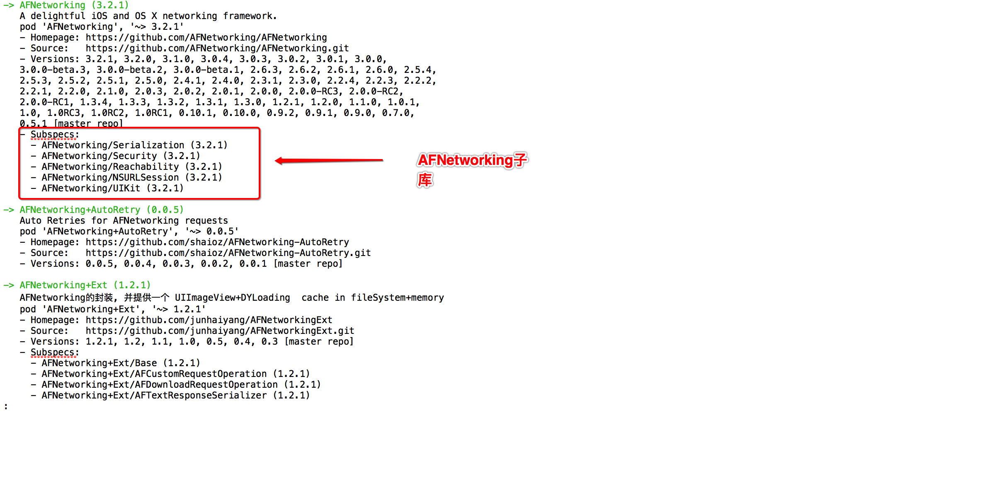
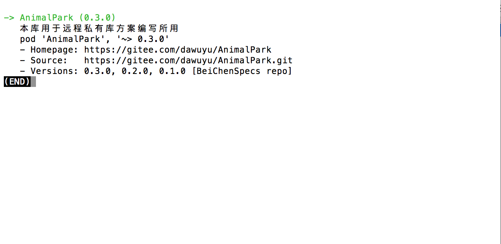
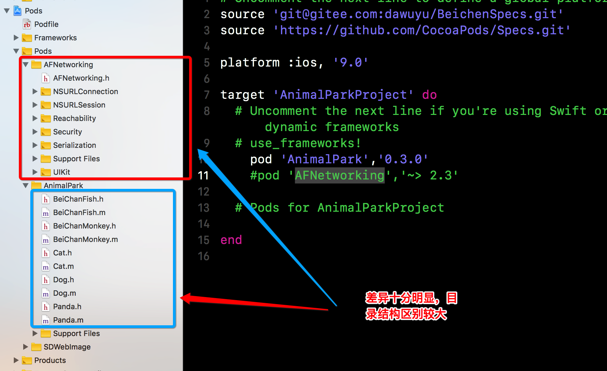
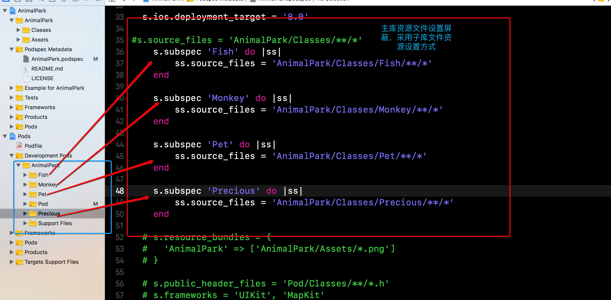
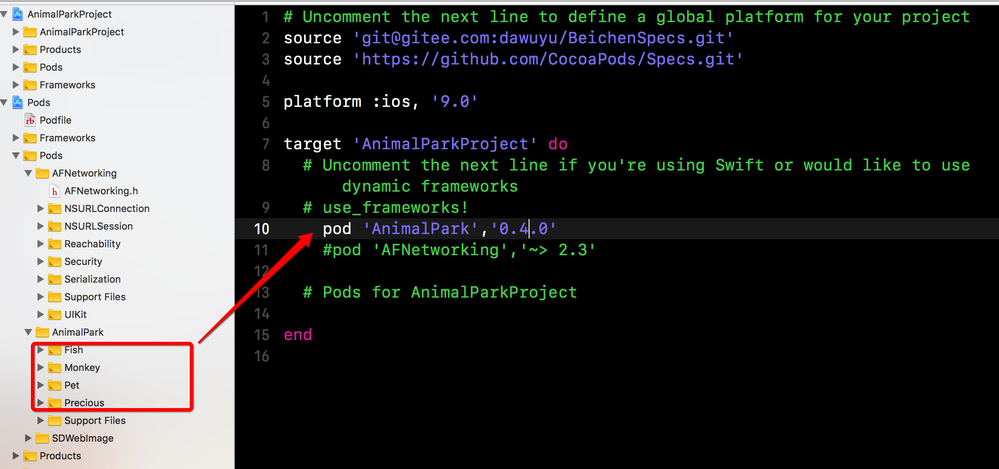
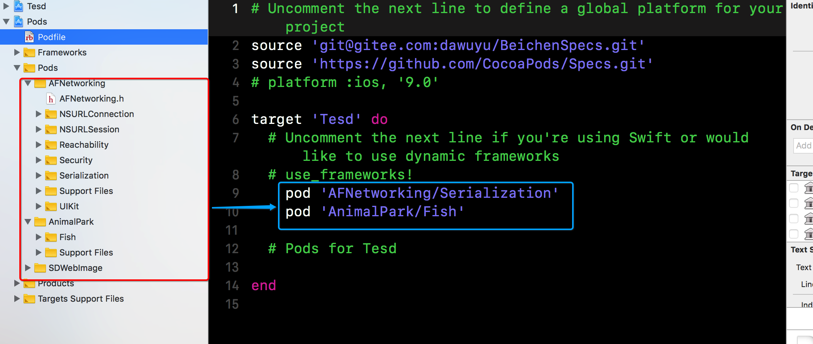
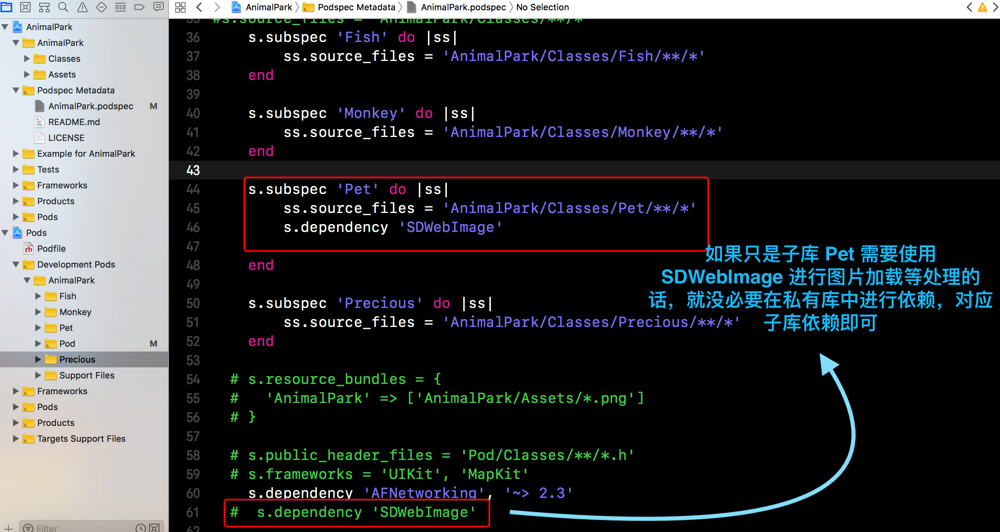
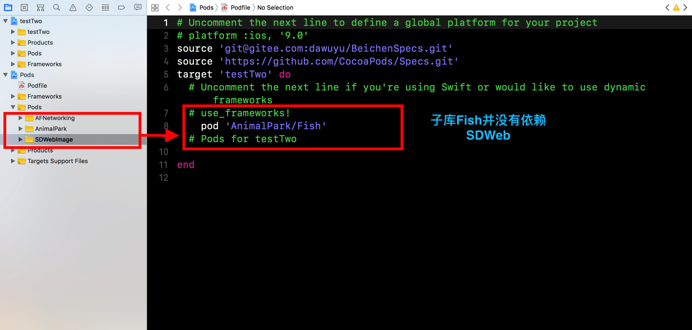
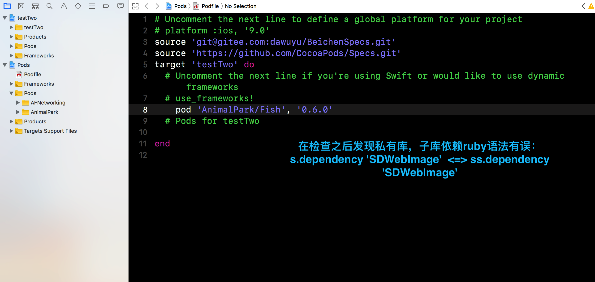

# 远程私有库设计优化


### 库文件目录结构优化

* 对比 ``` AnimalPark ``` 与 ``` AFNetworking ``` 差异








* ``` AnimalPark.podspec ``` 进行添加子库操作



```
#
# Be sure to run `pod lib lint AnimalPark.podspec' to ensure this is a
# valid spec before submitting.
#
# Any lines starting with a # are optional, but their use is encouraged
# To learn more about a Podspec see https://guides.cocoapods.org/syntax/podspec.html
#

Pod::Spec.new do |s|
  s.name             = 'AnimalPark'
  s.version          = '0.4.0'  # 库版本，需要与远程代码仓库中tag版本号对应
  s.summary          = '本库用于远程私有库方案编写所用' # 库工程简介

# This description is used to generate tags and improve search results.
#   * Think: What does it do? Why did you write it? What is the focus?
#   * Try to keep it short, snappy and to the point.
#   * Write the description between the DESC delimiters below.
#   * Finally, don't worry about the indent, CocoaPods strips it!

  s.description      = <<-DESC
本库用于远程私有库方案编写所用 -------------为编写GitBooK提供案例支撑
                       DESC

  s.homepage         = 'https://gitee.com/dawuyu/AnimalPark'
  # 将github仓库首页地址替换为本库选用git平台码云仓库首页地址
  # s.screenshots     = 'www.example.com/screenshots_1', 'www.example.com/screenshots_2'
  s.license          = { :type => 'MIT', :file => 'LICENSE' }
  s.author           = { 'beichenqing528369' => 'beichenqing528369@gmail.com' }
  s.source           = { :git => 'https://gitee.com/dawuyu/AnimalPark.git', :tag => s.version.to_s }
  # 将库远程代码仓库地址替换为码云代码仓库地址
  # s.social_media_url = 'https://twitter.com/<TWITTER_USERNAME>'

  s.ios.deployment_target = '8.0'

#s.source_files = 'AnimalPark/Classes/**/*'
    s.subspec 'Fish' do |ss|
        ss.source_files = 'AnimalPark/Classes/Fish/**/*'
    end
    
    s.subspec 'Monkey' do |ss|
        ss.source_files = 'AnimalPark/Classes/Monkey/**/*'
    end
    
    s.subspec 'Pet' do |ss|
        ss.source_files = 'AnimalPark/Classes/Pet/**/*'
    end
    
    s.subspec 'Precious' do |ss|
        ss.source_files = 'AnimalPark/Classes/Precious/**/*'
    end
  
  # s.resource_bundles = {
  #   'AnimalPark' => ['AnimalPark/Assets/*.png']
  # }

  # s.public_header_files = 'Pod/Classes/**/*.h'
  # s.frameworks = 'UIKit'

```


* 修改后的库说明文件 ``` AnimalPark.podspec ``` 提交至远程索引库

```
MacBook-Pro:AnimalPark coo$ pod repo push BeiChenSpecs AnimalPark.podspec --allow-warnings

Validating spec
 -> AnimalPark
 -> AnimalPark (0.4.0)
    - WARN  | url: The URL (https://gitee.com/dawuyu/AnimalPark) is not reachable.
    - WARN  | [AnimalPark/Fish, AnimalPark/Monkey, AnimalPark/Pet, and more...] xcodebuild:  AFNetworking/AFNetworking/AFURLConnectionOperation.m:69:67: warning: this block declaration is not a prototype [-Wstrict-prototypes]
    - WARN  | [AnimalPark/Fish, AnimalPark/Monkey, AnimalPark/Pet, and more...] xcodebuild:  AFNetworking/UIKit+AFNetworking/UIActivityIndicatorView+AFNetworking.m:90:34: warning: unknown warning group '-Wreceiver-is-weak', ignored [-Wunknown-warning-option]
    - WARN  | [AnimalPark/Fish, AnimalPark/Monkey, AnimalPark/Pet, and more...] xcodebuild:  AFNetworking/UIKit+AFNetworking/UIActivityIndicatorView+AFNetworking.m:119:34: warning: unknown warning group '-Wreceiver-is-weak', ignored [-Wunknown-warning-option]
    - WARN  | [AnimalPark/Fish, AnimalPark/Monkey, AnimalPark/Pet, and more...] xcodebuild:  AFNetworking/UIKit+AFNetworking/UIActivityIndicatorView+AFNetworking.m:139:34: warning: unknown warning group '-Wreceiver-is-weak', ignored [-Wunknown-warning-option]
    - WARN  | [AnimalPark/Fish, AnimalPark/Monkey, AnimalPark/Pet, and more...] xcodebuild:  AFNetworking/UIKit+AFNetworking/UIActivityIndicatorView+AFNetworking.m:148:34: warning: unknown warning group '-Wreceiver-is-weak', ignored [-Wunknown-warning-option]
    - WARN  | [AnimalPark/Fish, AnimalPark/Monkey, AnimalPark/Pet, and more...] xcodebuild:  AFNetworking/UIKit+AFNetworking/UIRefreshControl+AFNetworking.m:89:34: warning: unknown warning group '-Wreceiver-is-weak', ignored [-Wunknown-warning-option]
    - WARN  | [AnimalPark/Fish, AnimalPark/Monkey, AnimalPark/Pet, and more...] xcodebuild:  AFNetworking/UIKit+AFNetworking/UIRefreshControl+AFNetworking.m:113:34: warning: unknown warning group '-Wreceiver-is-weak', ignored [-Wunknown-warning-option]
    - WARN  | [AnimalPark/Fish, AnimalPark/Monkey, AnimalPark/Pet, and more...] xcodebuild:  AFNetworking/UIKit+AFNetworking/UIRefreshControl+AFNetworking.m:134:34: warning: unknown warning group '-Wreceiver-is-weak', ignored [-Wunknown-warning-option]
    - WARN  | [AnimalPark/Fish, AnimalPark/Monkey, AnimalPark/Pet, and more...] xcodebuild:  AFNetworking/UIKit+AFNetworking/UIRefreshControl+AFNetworking.m:143:34: warning: unknown warning group '-Wreceiver-is-weak', ignored [-Wunknown-warning-option]

Updating the `BeiChenSpecs' repo

Already up to date.

Adding the spec to the `BeiChenSpecs' repo

 - [Update] AnimalPark (0.4.0)

Pushing the `BeiChenSpecs' repo


```

* 在工程中更新库版本






### 私有库子库与远程公有库依赖关系

> 私有库开发中必定会遇到，某个业务小模块需要依赖第三方框架或者其他的私有库，但并不是全部业务都会依赖
> 

* 对私有库说明文件 ``` AnimalPark.podspec ``` 进行如下修改并提交至远程私有仓库

```
#
# Be sure to run `pod lib lint AnimalPark.podspec' to ensure this is a
# valid spec before submitting.
#
# Any lines starting with a # are optional, but their use is encouraged
# To learn more about a Podspec see https://guides.cocoapods.org/syntax/podspec.html
#

Pod::Spec.new do |s|
  s.name             = 'AnimalPark'
  s.version          = '0.5.0'  # 库版本，需要与远程代码仓库中tag版本号对应
  s.summary          = '本库用于远程私有库方案编写所用' # 库工程简介

# This description is used to generate tags and improve search results.
#   * Think: What does it do? Why did you write it? What is the focus?
#   * Try to keep it short, snappy and to the point.
#   * Write the description between the DESC delimiters below.
#   * Finally, don't worry about the indent, CocoaPods strips it!

  s.description      = <<-DESC
本库用于远程私有库方案编写所用 -------------为编写GitBooK提供案例支撑
                       DESC

  s.homepage         = 'https://gitee.com/dawuyu/AnimalPark'
  # 将github仓库首页地址替换为本库选用git平台码云仓库首页地址
  # s.screenshots     = 'www.example.com/screenshots_1', 'www.example.com/screenshots_2'
  s.license          = { :type => 'MIT', :file => 'LICENSE' }
  s.author           = { 'beichenqing528369' => 'beichenqing528369@gmail.com' }
  s.source           = { :git => 'https://gitee.com/dawuyu/AnimalPark.git', :tag => s.version.to_s }
  # 将库远程代码仓库地址替换为码云代码仓库地址
  # s.social_media_url = 'https://twitter.com/<TWITTER_USERNAME>'

  s.ios.deployment_target = '8.0'

#s.source_files = 'AnimalPark/Classes/**/*'
    s.subspec 'Fish' do |ss|
        ss.source_files = 'AnimalPark/Classes/Fish/**/*'
    end
    
    s.subspec 'Monkey' do |ss|
        ss.source_files = 'AnimalPark/Classes/Monkey/**/*'
    end
    
    s.subspec 'Pet' do |ss|
        ss.source_files = 'AnimalPark/Classes/Pet/**/*'
        s.dependency 'SDWebImage'
    end
    
    s.subspec 'Precious' do |ss|
        ss.source_files = 'AnimalPark/Classes/Precious/**/*'
    end
  
  # s.resource_bundles = {
  #   'AnimalPark' => ['AnimalPark/Assets/*.png']
  # }

  # s.public_header_files = 'Pod/Classes/**/*.h'
  # s.frameworks = 'UIKit', 'MapKit'
    s.dependency 'AFNetworking', '~> 2.3'
  #  s.dependency 'SDWebImage'
    
end


```



* 使用样例 






### 私有库头文件.h管理