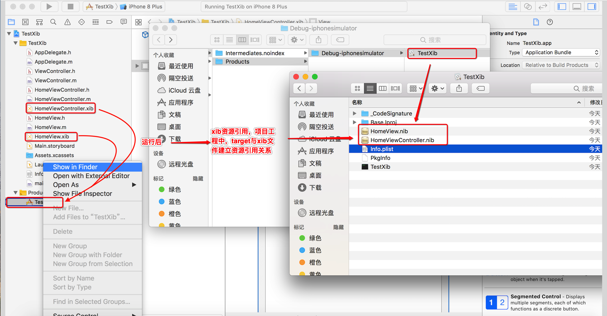
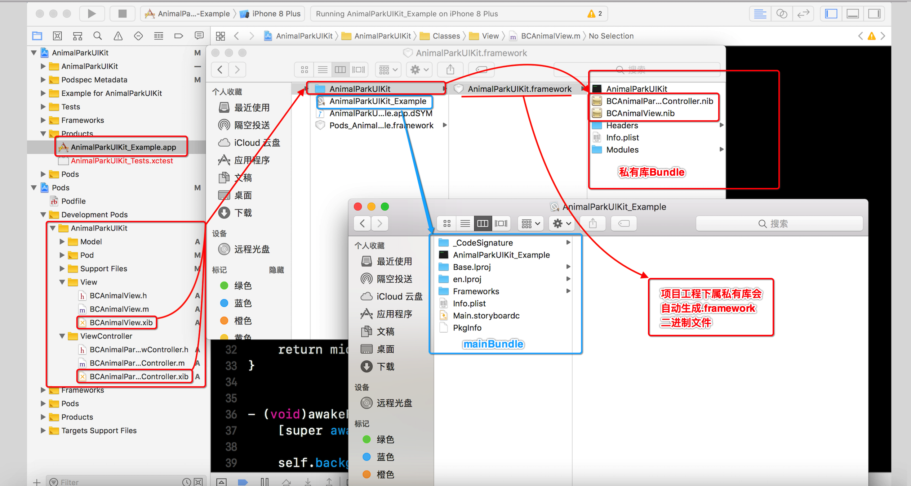
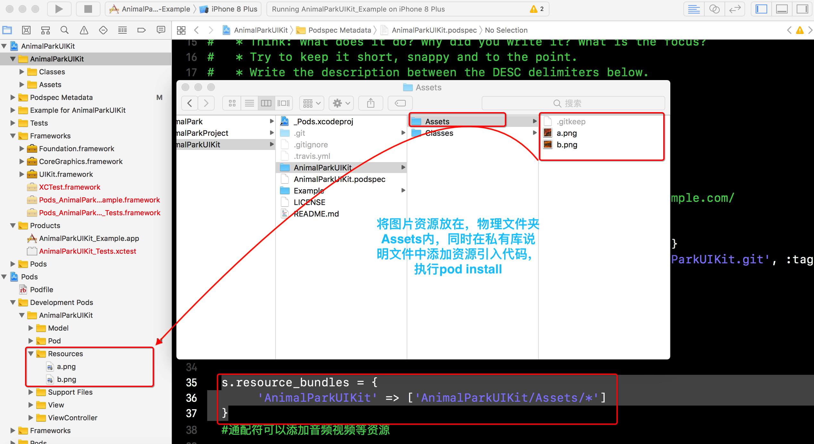
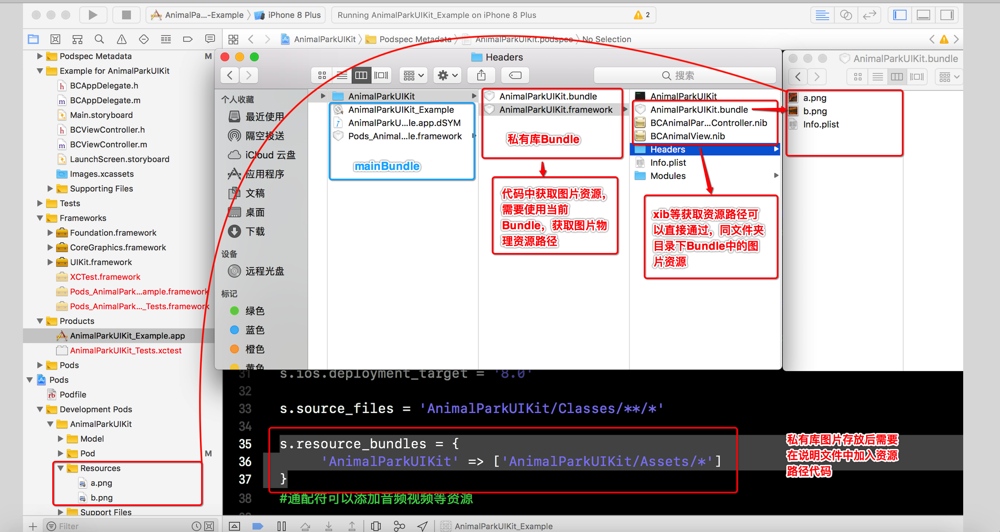
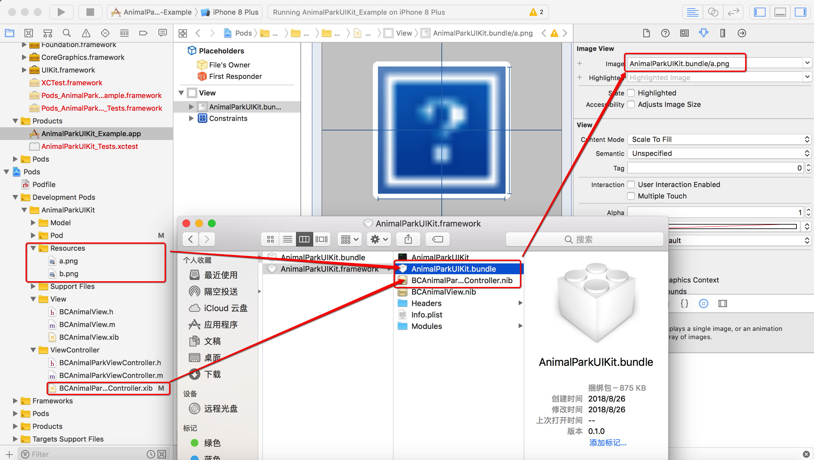
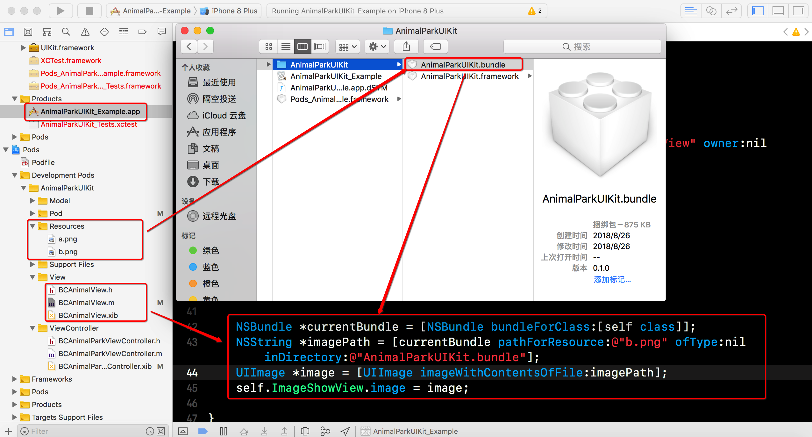
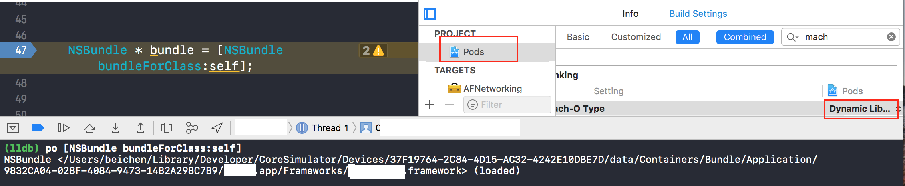
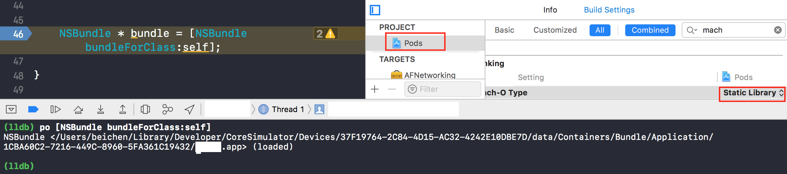
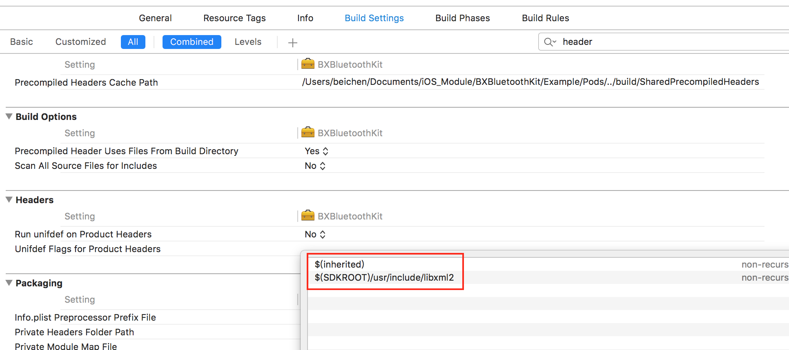

# 远程私有库资源文件加载处理


### 代码资源文件加载Xib

>xib资源加载过程中，主工程直接引用，与主工程通过是有库引用区别很大


* 主工程引用xib资源,以及图解

```
 NSBundle *bundle = [NSBundle mainBundle];
    
 BCAnimalView * middleView = [[bundle loadNibNamed:@"BCAnimalView" owner:nil options:nil] firstObject];
```




* 私有库引用xib资源,以及图解

```
 //NSBundle *bundle = [NSBundle mainBundle];
 NSBundle *bundle = [NSBundle bundleForClass:self];
    
 BCAnimalView * middleView = [[bundle loadNibNamed:@"BCAnimalView" owner:nil options:nil] firstObject];

```



### 图片视频等文件加载

* 私有库图片资源物理存放,在私有库说明文件中修改

```
  s.resource_bundles = {
       'AnimalParkUIKit' => ['AnimalParkUIKit/Assets/*']
  }
```





* xib,storyboard图片资源引用

> xib由于运行后包内容中与目标内容同一文件夹




* 代码中资源路径引用

```
 NSBundle *currentBundle = [NSBundle bundleForClass:[self class]];
 NSString *imagePath = [currentBundle pathForResource:@"b.png" ofType:nil inDirectory:@"AnimalParkUIKit.bundle"];
 UIImage *image = [UIImage imageWithContentsOfFile:imagePath];
 self.ImageShowView.image = image;

```




## ``[NSBundle bundleForClass:[self class]]`` 获取资源限制


* 壳工程中Podfile文件中使用 ``use_frameworks!`` 可能导致的资源无法引用情况


* 壳工程修改pod 所在project资源link 方式导致资源路径的不同






## 文件资源引用以及配置


####  资源文件引用姿势

```
  // 资源文件引用添加
  s.resources = ['VerifaceKit/Classes/BaiduOcrSdk/**/*.bundle']
  
  s.source_files = 'VerifaceKit/Classes/**/*.{h,m}'
  
  //二级制文件需要暴露头文件
  s.public_header_files = 'VerifaceKit/Classes/**/*.h'
  s.vendored_frameworks = 'VerifaceKit/Classes/BaiduOcrSdk/**/*.{framework}'
  s.vendored_libraries = 'VerifaceKit/Classes/BaiduOcrSdk/**/*.{a}'
  
  # 考察开发平台需要支持哪些
  s.frameworks = 'Foundation', 'UIKit', 'AudioToolbox','CoreGraphics', 'QuartzCore','SystemConfiguration', 'CFNetwork', 'CoreTelephony', 'CoreMotion', 'CoreText'
  s.libraries = 'z','sqlite3.0','c++'

```

#### 资源文件依赖时，编译设置

```
 s.libraries = 'xml2','z','sqlite3.0', 'stdc++.6.0.9','c++'
  
  s.pod_target_xcconfig = { 'HEADER_SEARCH_PATHS' => '$(SDKROOT)/usr/include/libxml2'}
  

```




