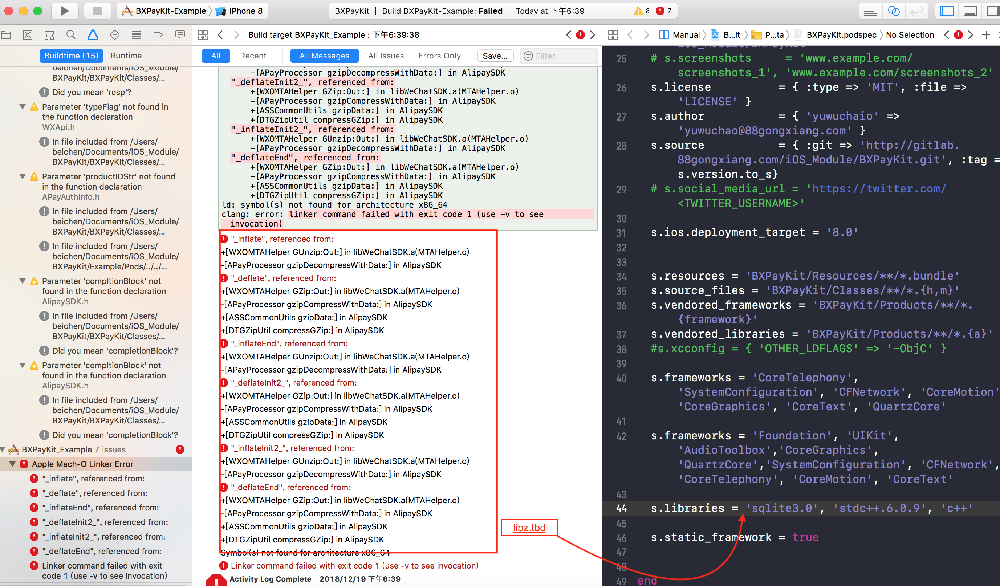

# 常见问题以及解决方案


### 问题一  由于使用GitLab ，远程仓库地址使用错误

* 个人远程仓库地址  `` http://tom369@gitlab.NNgonxia.com/iOS_Module/CustomUIKit.git ``

* 团队远程仓库地址   `` http://gitlab.NNgonxia.com/iOS_Module/CustomUIKit ``


### 问题二 在维护库版本tag时，同版本开发，提交后使用时会出现无法更新最新代码情况

* 执行 `` pod cache clean --all`` 即可


### 问题三 ``use_frameworks!`` 对podFile 文件影响

* 使用时需要谨慎区分不同的资源调用方式，以及包linking 方式

* 最好与 spec.static_framework = true 同时使用 避免动态库导致上线问题


### 问题四 ``ERROR  spec: The specification defined in   xx.podspec could not be loaded.``

```
-> xx.podspec
    - ERROR | spec: The specification defined in `xx.podspec` could not be loaded.


[!] Invalid `xx.podspec` file: syntax error, unexpected tIDENTIFIER, expecting keyword_end
...<-DESC 这是一个测试文档, 这里主要是描述类库...
...                               ^
xx.podspec:28: syntax error, unexpected '\n', expecting '='.

 #  from xx.podspec:27
 #  -------------------------------------------
 #    #   * Finally, don't worry about the indent, CocoaPods strips it!
 >    s.description  = <<-DESC 这是一个测试文档, 这里主要是描述类库的功能设计初衷介绍
 #                     DESC
 #  -------------------------------------------


[!] xx.podspec did not pass validation, due to 1 error.
[!] The validator for Swift projects uses Swift 3.0 by default, if you are using a different version of swift you can use a `.swift-version` file to set the version for your Pod. For example to use Swift 2.3, run: 
    `echo "2.3" > .swift-version`.
You can use the `--no-clean` option to inspect any issue.


```
可以看出是在设置s.description 字段时发生的错误写法是:

```
s.description  = <<-DESC LZTool 是一个用于保存一些常用工具类的工具 DESC

```

正确写法需要分行

```

s.description  = <<-DESC 
                          LZTool 是一个用于保存一些常用工具类的工具
                   DESC

```


### 问题五 加载xib问题  通过cocoapods下载的类库中含有Xib文件, 使用原来的方式初始化

```

[[[NSBundle mainBundle] loadNibNamed:@"xibName" owner:self options:nil] lastObject];
[self.collectionView registerNib:[UINib nibWithNibName:@"xibName" bundle:nil] forCellWithReuseIdentifier:@"XXXCellID"];


```

正确修改应该是


```

#define XXXKitBundle [NSBundle bundleForClass:[self class]]
[[XXXKitBundle loadNibNamed:@"ZLPhotoActionSheet" owner:self options:nil] lastObject];
[self.collectionView registerNib:[UINib nibWithNibName:@"ZLCollectionCell" bundle:XXXKitBundle] forCellWithReuseIdentifier:@"XXXCellID"];


```


### 问题六 加载图片资源问题

* 创建bundle资源目录

```
command+N -> Resource -> Settings Bundle

```


* 改变代码图片路径

```
// 图片路径
#define kXXXSrcName(file) [@"XXX.bundle" stringByAppendingPathComponent:file]
#define kXXXFrameworkSrcName(file) [@"Frameworks/XXX.framework/XXX.bundle" stringByAppendingPathComponent:file]
kXXXSrcName(file) 为通过copy文件夹方式获取图片路径的宏
kXXXFrameworkSrcName(file) 为通过cocoapods下载安装获取图片路径的宏


```

```
UIImage *img = [UIImage imageNamed:kXXXSrcName(@"img.png")]?:[UIImage imageNamed:kXXXFrameworkSrcName(@"img.png")];

```


###  问题七 ``trunk: getaddrinfo: nodename nor servname provided, or not known``

* 网络 vpn APN 设置 关闭即可

```
pod trunk register 302934443@qq.com --description= 'xxxx'
[!] There was an error registering with trunk: getaddrinfo: nodename nor servname provided, or not known

```

### 问题八 xcodebuild: Returned an unsuccessful exit code. You can use `--verbose` for more information

* 文件编译无法找到

```
- WARN  | [iOS] license: Unable to find a license file
    - ERROR | [iOS] xcodebuild: Returned an unsuccessful exit code. You can use `--verbose` for more information.
    - NOTE  | [iOS] xcodebuild:  Tool.m:14:9: fatal error: 'ChineseToPinyin.h' file not found


```


### 问题九 验证成功后搜索不到新加的支持库

* 搜索不到这个库, 或者在使用时找不到这个库, 可以使用下面的指令来清理一下缓存:

```
rm ~/Library/Caches/CocoaPods/search_index.json

```


### 问题十 由于未引入 `` libz.tbd `` 导致 支付宝微信 SDK 库依赖报错 -- 错误很奇怪 -- 包架构命令集报错


```
Undefined symbols for architecture x86_64:
  "_inflate", referenced from:
      +[WXOMTAHelper GUnzip:Out:] in libWeChatSDK.a(MTAHelper.o)
      -[APayProcessor gzipDecompressWithData:] in AlipaySDK
  "_deflate", referenced from:
      +[WXOMTAHelper GZip:Out:] in libWeChatSDK.a(MTAHelper.o)
      -[APayProcessor gzipCompressWithData:] in AlipaySDK
      +[ASSCommonUtils gzipData:] in AlipaySDK
      +[DTGZipUtil compressGZip:] in AlipaySDK
  "_inflateEnd", referenced from:
      +[WXOMTAHelper GUnzip:Out:] in libWeChatSDK.a(MTAHelper.o)
      -[APayProcessor gzipDecompressWithData:] in AlipaySDK
  "_deflateInit2_", referenced from:
      +[WXOMTAHelper GZip:Out:] in libWeChatSDK.a(MTAHelper.o)
      -[APayProcessor gzipCompressWithData:] in AlipaySDK
      +[ASSCommonUtils gzipData:] in AlipaySDK
      +[DTGZipUtil compressGZip:] in AlipaySDK
  "_inflateInit2_", referenced from:
      +[WXOMTAHelper GUnzip:Out:] in libWeChatSDK.a(MTAHelper.o)
      -[APayProcessor gzipDecompressWithData:] in AlipaySDK
  "_deflateEnd", referenced from:
      +[WXOMTAHelper GZip:Out:] in libWeChatSDK.a(MTAHelper.o)
      -[APayProcessor gzipCompressWithData:] in AlipaySDK
      +[ASSCommonUtils gzipData:] in AlipaySDK
      +[DTGZipUtil compressGZip:] in AlipaySDK
ld: symbol(s) not found for architecture x86_64
clang: error: linker command failed with exit code 1 (use -v to see invocation)


```
* 解决方案 

``` 
s.libraries = 'z','sqlite3.0', 'stdc++.6.0.9', 'c++'
 
```

