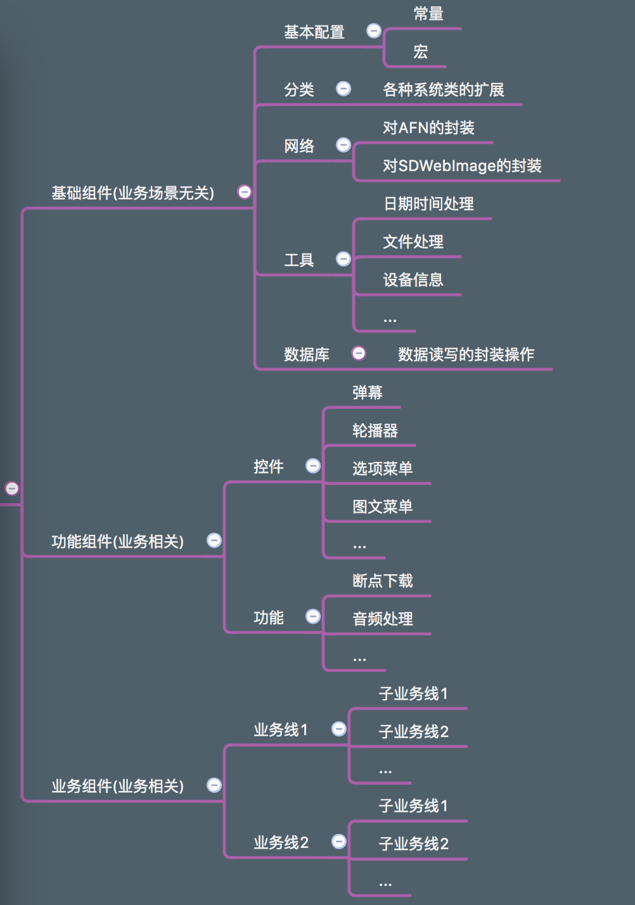
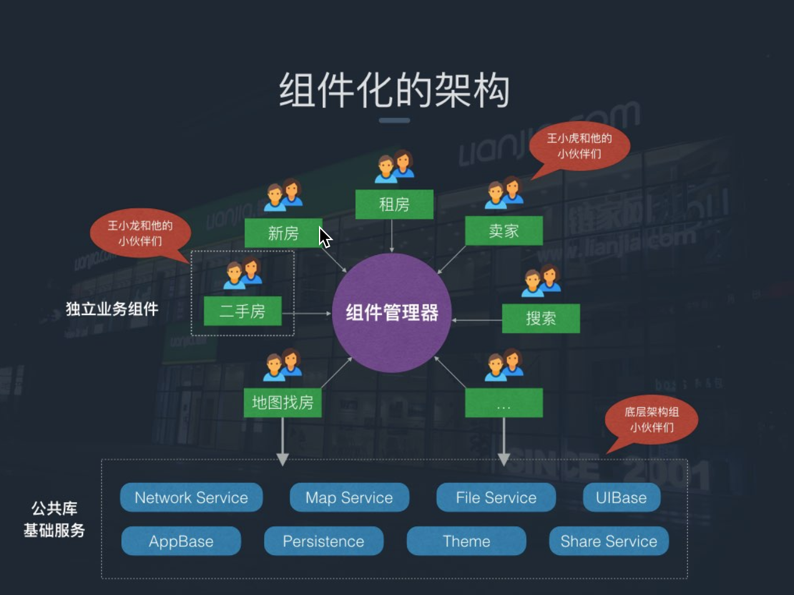
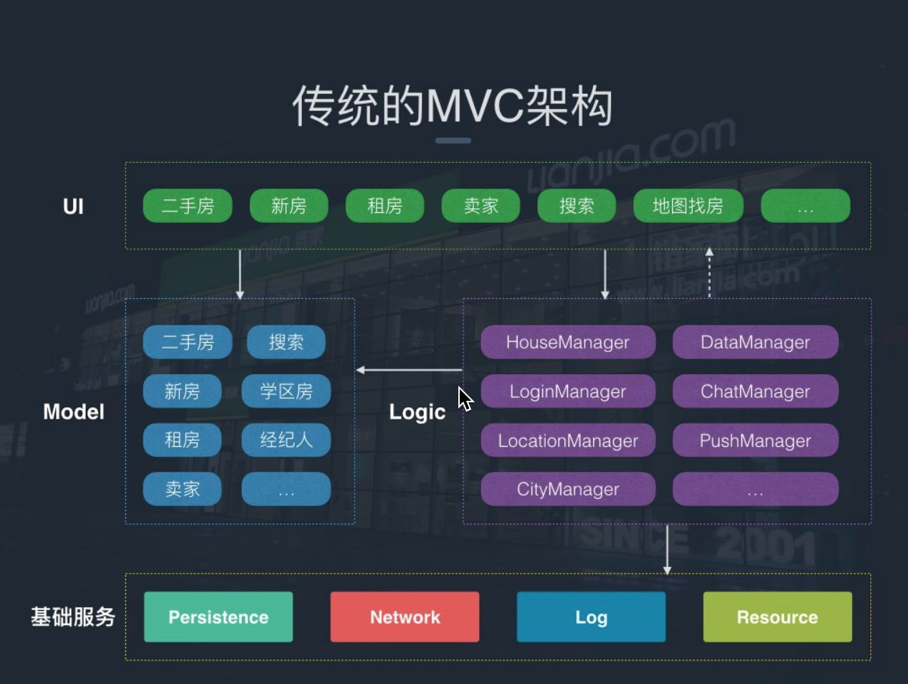
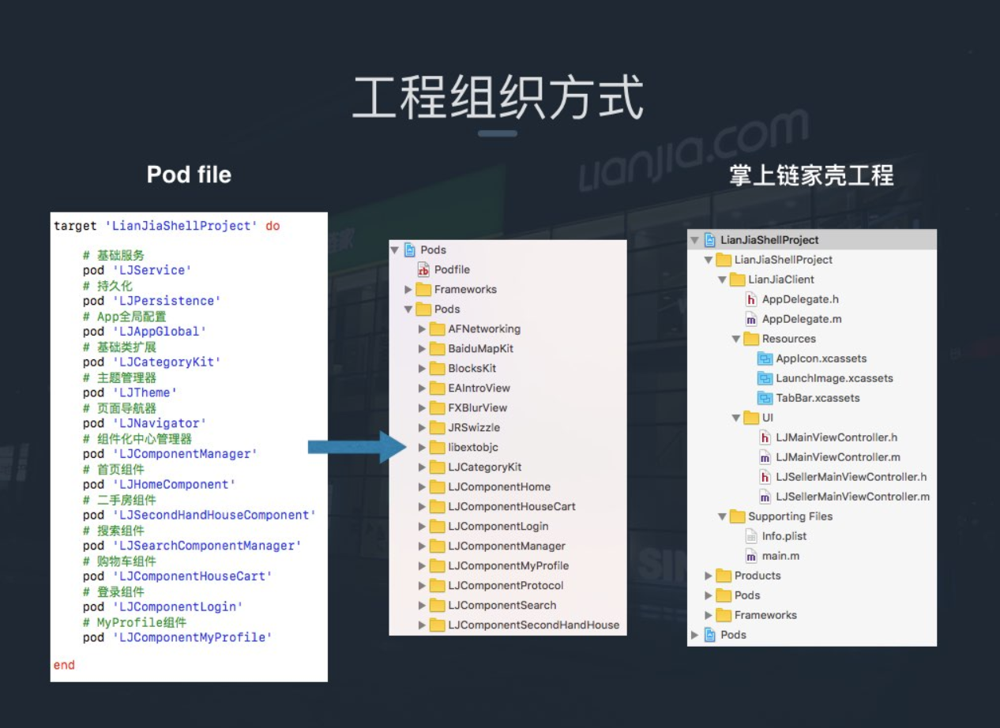
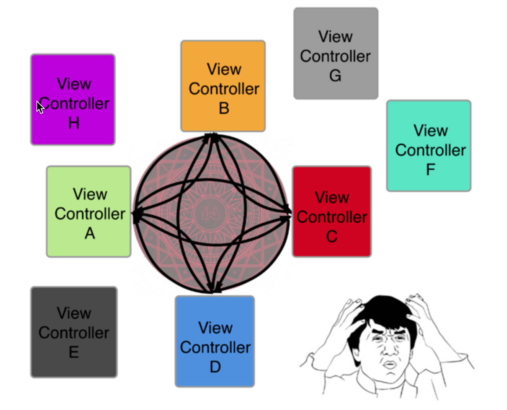
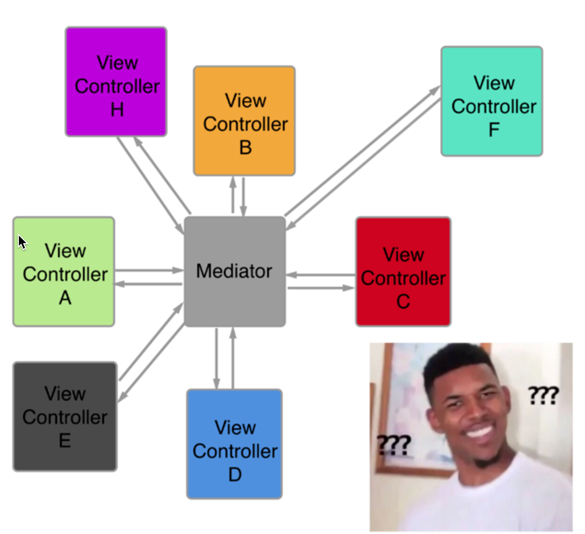
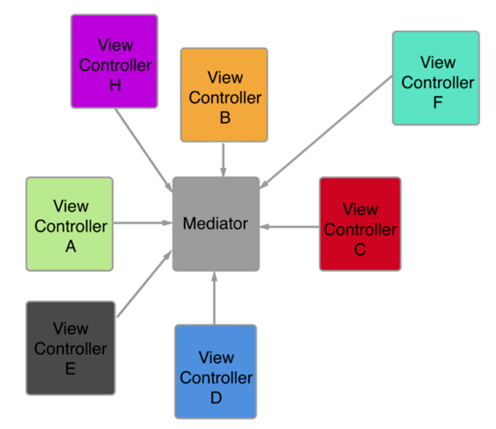

# 模块·组件概念介绍

``组件化``与``模块化``已经深入体现到软件开发当中，也是为了让开发者更好的去解决软件上的``高耦合``、``低内聚``、``无重用``的3大代码问题。

##  组件化 

就是"基础库"或者“基础组件"，意思是把代码重复的部分提炼出一个个组件供给功能使用。

* 使用：各种自定义的UI控件、能在项目或者不同项目重复应用的代码等等。

* 目的：复用，解耦。
      
* 依赖：组件之间低依赖，比较独立。

* 架构定位：纵向分层（位于架构底层，被其他层所依赖）。

## 模块化 

就是"业务框架"或者“业务模块"，也可以理解为“框架”，意思是把功能进行划分，将同一类型的代码整合在一起，所以模块的功能相对复杂，但都同属于一个业务。

* 使用：按照项目功能需求划分成不同类型的业务框架（例如：注册、登录、外卖、直播.....）

* 目的：隔离/封装 （高内聚）。

* 依赖：模块之间有依赖的关系，可通过路由器进行模块之间的耦合问题。

* 架构定位：横向分块（位于架构业务框架层）。

## 如何组件化

当我们确定需要对项目进行组件化了，我们第一个要解决的问题就是如何拆分组件。这是一个见仁见智的问题，没有太明确的划分边界，大致做到每个组件只包含一个功能即可，具体实施还是要根据实际情况权衡。

当我们写一个类的时候，我们会谨记高内聚，低耦合的原则去设计这个类，当涉及多个类之间交互的时候，我们也会运用SOLID原则，或者已有的设计模式去优化设计，但在实现完整的业务模块的时候，我们很容易忘记对这个模块去做设计上的思考，粒度越大，越难做出精细稳定的设计，我暂且把这个粒度认为是组件的粒度。

组件可以是个广义上的概念，并不一定是页面跳转，还可以是其他不具备UI属性的服务提供者，比如日志服务，VOIP服务，内存管理服务等等。说白了我们目标是站在更高的维度去封装功能单元，把多个功能单元组合在一起形成一个更大的功能单元，也就是组件。对这些功能单元进行进一步的分类，才能在具体的业务场景下做更合理的设计。

下面的组件划分粒度，大家可以借鉴一下

组件化前后对比

iOS里面的组件化主要是通过cocopods把组件打包成单独的私有pod库来进行管理，这样就可以通过podfile文件，进行动态的增删和版本管理了。

下面是链家APP在实行组件化前后的对比

可以看到传统的MVC架构把所有的模块全部糅合在一起，是一种分布式的管理方法，耦合严重，当业务线过多的时候就会出现我们上面说的问题。 而下图的组件化方式是一种中心Mediator的方式，让所有业务组件都分开，然后都依赖于Mediator进行统一管理，减少耦合。

组件化后，代码分类也更符合人类大脑的思考方式

组件化方案对比分析

组件化如何解决现有工程问题

传统模式的组件之间的跳转都是通过直接import，当模块比较少的时候这个方式看起来没啥问题。但到了项目越来越庞大，这种模式会导致每个模块都离不开其他模块，互相依赖耦合严重。这种方式是分布式的处理方式，每个组件都是处理和自己相关的业务。管理起来很混乱

那么按照人脑的思维方式，改成如下这种中心化的方式更加清晰明了： 

但是上面这个图虽然看起来比刚开始好了许多，但是每个组件还是和mediator双向依赖，如果改成如下图所示就完美了:

这个时候看起来就舒服多了，每个组件只需要自己管好自己就完了，然后由mediator负责在各个组件中间进行转发或者跳转，perfect 那么如何实现这个架构呢？只要解决下面两个问题就好了：

* mediator作为中间件，需要通过某种方式找到每个组件，并能调用组件的方法

* 每个组件如何得知其他组件提供了哪些方法？只有这样才可以调用对方嘛

