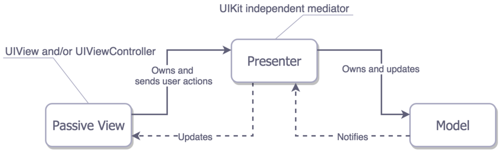

# 6.3 常用设计模式剖析

##  代码架构模式

[猿题库 iOS 客户端架构设计](http://gracelancy.com/blog/2016/01/06/ape-ios-arch-design/)


* Models（模型）— 数据层，或者负责处理数据的数据接口层。比如Person和PersonDataProvider类

* Views（视图）- 展示层(GUI)。对于 iOS 来说所有以UI开头的类基本都属于这层。

* Controller/Presenter/ViewModel（控制器/展示器/视图模型）- 它是Model和View之间的胶水或者说是中间人。一般来说，当用户对View有操作时它负责去修改相应Model；当Model的值发生变化时它负责去更新对应View。


### MVC模式

MVC全名是Model View Controller，是模型(model)－视图(view)－控制器(controller)的缩写，一种软件设计典范，用一种业务逻辑、数据、界面显示分离的方法组织代码，将业务逻辑聚集到一个部件里面，在改进和个性化定制界面及用户交互的同时，不需要重新编写业务逻辑。MVC被独特的发展起来用于映射传统的输入、处理和输出功能在一个逻辑的图形化用户界面的结构中

MVC根据角色划分类，涉及到三个角色：

* Model:模型保存应用程序的数据。

* View：视图是模型的可视化表示以及用户交互的控件。

* Controller:控制器是一个协调所有工作的中介者。它访问模型中的数据并在视图中展示它们，同时它们还监听事件和操作数据。

一个MVC模式的好的实现也就意味着每一个对象都会被划分到上面所说的组中。


####数据关系

* View 接受用户交互请求

* View 将请求转交给Controller

* Controller 操作Model进行数据更新

* 数据更新之后，Model通知View更新数据变化

### 方式

* 所有方式都是单向通信

MVC中的View是可以直接访问Model的！从而，View里会包含Model信息，不可避免的还要包括一些业务逻辑。在MVC模型里，更关注的Model的不变，而同时有多个对Model的不同显示，及View。所以，在MVC模型里，Model不依赖于View，但是 View是依赖于Model的。不仅如此，因为有一些业务逻辑在View里实现了，导致要更改View也是比较困难的，至少那些业务逻辑是无法重用的。


### MVVM

MVVM是Model-View-ViewModel的简写。微软的WPF带来了新的技术体验，如Silverlight、音频、视频、3D、动画……，这导致了软件UI层更加细节化、可定制化。同时，在技术层面，WPF也带来了 诸如Binding、Dependency Property、Routed Events、Command、DataTemplate、ControlTemplate等新特性。MVVM（Model-View-ViewModel）框架的由来便是MVP（Model-View-Presenter）模式与WPF结合的应用方式时发展演变过来的一种新型架构框架。它立足于原有MVP框架并且把WPF的新特性糅合进去，以应对客户日益复杂的需求变化。


MVVM就是在MVC的基础上分离出业务处理的逻辑到ViewModel层，即

* Model层：请求的原始数据
* View层：视图展示，由ViewController来控制
* ViewModel层：负责业务处理和数据转化


#### 数据关系

* View 接收用户交互请求

* View 将请求转交给ViewModel

* ViewModel 操作Model数据更新

* Model 更新完数据，通知ViewModel数据发生变化

* ViewModel 更新View数据

#### 方式

* 双向绑定。View/Model的变动，自动反映在 ViewModel，反之亦然。

#### 使用

* 可以兼容你当下使用的 MVC/MVP 框架。

* 增加你的应用的可测试性。

* 配合一个绑定机制效果最好。

#### MVVM优点

MVVM模式和MVC模式一样，主要目的是分离视图（View）和模型（Model），有几大优点:

1. 低耦合。View可以独立于Model变化和修改，一个ViewModel可以绑定到不同的”View”上，当View变化的时候Model可以不变，当Model变化的时候View也可以不变。

2. 可重用性。你可以把一些视图逻辑放在一个ViewModel里面，让很多view重用这段视图逻辑。

3. 独立开发。开发人员可以专注于业务逻辑和数据的开发（ViewModel），设计人员可以专注于页面设计，生成xml代码。

4. 可测试。界面素来是比较难于测试的，而现在测试可以针对ViewModel来写。


### MVP

MVP的全称为Model-View-Presenter，Model提供数据，View负责显示，Controller/Presenter负责逻辑的处理。MVP与MVC有着一个重大的区别：在MVP中View并不直接使用Model，它们之间的通信是通过Presenter (MVC中的Controller)来进行的，所有的交互都发生在Presenter内部，而在MVC中View会直接从Model中读取数据而不是通过 Controller。


#### 数据关系

* View 接收用户交互请求

* View 将请求转交给 Presenter

* Presenter 操作Model进行数据更新

* Model 通知Presenter数据发生变化

* Presenter 更新View数据

#### MVP的优势

* Model与View完全分离，修改互不影响

* 更高效地使用，因为所有的逻辑交互都发生在一个地方—Presenter内部

* 一个Preseter可用于多个View，而不需要改变Presenter的逻辑（因为View的变化总是比Model的变化频繁）。

* 更便于测试。把逻辑放在Presenter中，就可以脱离用户接口来测试逻辑（单元测试）

#### 方式

* 各部分之间都是双向通信

####结构实现

* View ：使用 Composite模式

* View和Presenter：使用 Mediator模式

* Model和Presenter：使用 Command模式同步信息

#### MVC和MVP区别

MVP与MVC最大的一个区别就是：Model与View层之间倒底该不该通信（甚至双向通信）

#### MVC和MVP关系

* MVP：是MVC模式的变种。

* 项目开发中，UI是容易变化的，且是多样的，一样的数据会有N种显示方式；业务逻辑也是比较容易变化的。为了使得应用具有较大的弹性，我们期望将UI、逻辑（UI的逻辑和业务逻辑）和数据隔离开来，而MVP是一个很好的选择。

* Presenter代替了Controller，它比Controller担当更多的任务，也更加复杂。Presenter处理事件，执行相应的逻辑，这些逻辑映射到Model操作Model。那些处理UI如何工作的代码基本上都位于Presenter。

* MVC中的Model和View使用Observer模式进行沟通；MPV中的Presenter和View则使用Mediator模式进行通信；Presenter操作Model则使用Command模式来进行。基本设计和MVC相同：Model存储数据，View对Model的表现，Presenter协调两者之间的通信。在 MVP 中 View 接收到事件，然后会将它们传递到 Presenter, 如何具体处理这些事件，将由Presenter来完成。

* 如果要实现的UI比较复杂，而且相关的显示逻辑还跟Model有关系，就可以在View和 Presenter之间放置一个Adapter。由这个 Adapter来访问Model和View，避免两者之间的关联。而同时，因为Adapter实现了View的接口，从而可以保证与Presenter之 间接口的不变。这样就可以保证View和Presenter之间接口的简洁，又不失去UI的灵活性。

#### 使用

MVP的实现会根据View的实现而有一些不同，一部分倾向于在View中放置简单的逻辑，在Presenter放置复杂的逻辑；另一部分倾向于在presenter中放置全部的逻辑。这两种分别被称为：Passive View和Superivising Controller。


### MVC -> MVP -> MVVM 转变

任何的项目框架，都是为项目服务的。没有绝对的好坏之分，只有更合适的选择。在项目进展的不同阶段，做出最合适的调整，才是是更适合团队项目发展的框架。项目设计者要谨记，任何的项目设计，都是要围绕项目发展阶段，团队成员规模，和团队整体能力而定的。切莫为了设计而设计，为了框架而框架。快速，高效的配合整个团队进展项目，才是最合适的架构。才是一个程序员为成一个leader，成为一个架构师的必经之路。

定义一下好的框架应该具有的特征：

* 用严格定义的角色，平衡的将职责划分给不同的实体。

* 可测性通常取决于上面说的第一点（不用太担心，如果架构何时的话，做到这点并不难）。

* 易用并且维护成本低。

为什么要划分？

* 当我们试图去理解事物的工作原理的时候，划分可以减轻我们的脑部压力。如果你觉得开发的越多，大脑就越能适应去处理复杂的工作，确实是这样。但是大脑的这种能力不是线性提高的，而且很快就会达到一个瓶颈。所以要处理复杂的事情，最好的办法还是在遵循单一责任原则的条件下，将它的职责划分到多个实体中去。

为什么要可测性？

* 对于那些对单元测试心存感激的人来说，应该不会有这方面的疑问：单元测试帮助他们测试出了新功能里面的错误，或者是帮他们找出了重构的一个复杂类里面的 bug。这意味着这些单元测试帮助这些开发者们在程序运行之前就发现了问题，这些问题如果被忽视的话很可能会提交到用户的设备上去；而修复这些问题，又至少需要一周左右的时间（AppStore 审核）。

为什么要易用

* 这块没什么好说的，直说一点：最好的代码是那些从未被写出来的代码。代码写的越少，问题就越少；所以开发者想少写点代码并不一定就是因为他懒。还有，当你想用一个比较聪明的方法的时候，全完不要忽略了它的维护成本。


### [传统的 MVC](https://en.wikipedia.org/wiki/Model)

View 是无状态的，在 Model 变化的时候它只是简单的被 Controller 重绘；就像网页一样，点击了一个新的链接，整个网页就重新加载。尽管这种架构可以在 iOS 应用里面实现，但是由于 MVC 的三种实体被紧密耦合着，每一种实体都和其他两种有着联系，所以即便是实现了也没有什么意义。这种紧耦合还戏剧性的减少了它们被重用的可能，这恐怕不是你想要在自己的应用里面看到的。综上，传统 MVC 的例子我觉得也没有必要去写了。

### Apple 的 MVC


View 和 Model 之间是相互独立的，它们只通过 Controller 来相互联系。有点恼人的是 Controller 是重用性最差的，因为我们一般不会把冗杂的业务逻辑放在 Model 里面，那就只能放在 Controller 里了。


View 和 Model 之间是相互独立的，它们只通过 Controller 来相互联系。有点恼人的是 Controller 是重用性最差的，因为我们一般不会把冗杂的业务逻辑放在 Model 里面，那就只能放在 Controller 里了。


Cocoa MVC 鼓励你去写重控制器是因为 View 的整个生命周期都需要它去管理，Controller 和 View 很难做到相互独立。虽然你可以把控制器里的一些业务逻辑和数据转换的工作交给 Model，但是你再想把负担往 View 里面分摊的时候就没办法了；因为 View 的主要职责就只是讲用户的操作行为交给 Controller 去处理而已。于是 ViewController 最终就变成了所有东西的代理和数据源，甚至还负责网络请求的发起和取消


Cocoa MVC 被戏称为重控制器模式还是有原因的。

问题直到开始单元测试（希望你的项目里面已经有了）之后才开始显现出来。Controller 测试起来很困难，因为它和 View 耦合的太厉害，要测试它的话就需要频繁的去 mock View 和 View 的生命周期；而且按照这种架构去写控制器代码的话，业务逻辑的代码也会因为视图布局代码的原因而变得很散乱。


综上所述，Cocoa MVC 貌似并不是一个很好的选择。但是我们还是评估一下他在各方面的表现（在文章开头有讲）：

* 划分- View 和 Model 确实是实现了分离，但是 View 和 Controller 耦合的太厉害

* 可测性- 因为划分的不够清楚，所以能测的基本就只有 Model 而已

* 易用- 相较于其他模式，它的代码量最少。而且基本上每个人都很熟悉它，即便是没太多经验的开发者也能维护。

* 在这种情况下你可以选择 Cocoa MVC：你并不想在架构上花费太多的时间，而且你觉得对于你的小项目来说，花费更高的维护成本只是浪费而已。


#### MVP - 保证了职责划分的（promises delivered） Cocoa MVC



看起来确实很像 Apple 的 MVC 对吧？确实蛮像，它的名字是MVP（被动变化的 View）。稍等...这个意思是说 Apple 的 MVC 实际上是 MVP 吗？不是的，回想一下，在 MVC 里面 View 和 Controller 是耦合紧密的，但是对于 MVP 里面的 Presenter 来讲，它完全不关注 ViewController 的生命周期，而且 View 也能被简单 mock 出来，所以在 Presenter 里面基本没什么布局相关的代码，它的职责只是通过数据和状态更新 View。

如果我跟你讲 UIViewController 在这里的角色其实是 View 你感觉如何。

在 MVP 架构里面，UIViewController 的那些子类其实是属于 View 的，而不是 Presenter。这种区别提供了极好的可测性，但是这是用开发速度的代价换来的

MVP 架构拥有三个真正独立的分层，所以在组装的时候会有一些问题，而 MVP 也成了第一个披露了这种问题的架构。因为我们不想让 View 知道 Model 的信息，所以在当前的 ViewController（角色其实是 View）里面去进行组装肯定是不正确的，我们应该在另外的地方完成组装。比如，我们可以创建一个应用层（app-wide）的 Router 服务，让它来负责组装和 View-to-View 的转场。这个问题不仅在 MVP 中存在，在接下来要介绍的模式里面也都有这个问题。

让我们来看一下 MVP 在各方面的表现：

* 划分- 我们把大部分的职责都分配到了 Presenter 和 Model 里面，而 View 基本上不需要做什么（在上面的例子里面，Model 也什么都没做）。

* 可测性- 简直棒，我们可以通过 View 来测试大部分的业务逻辑。

* 易用- 就我们上面那个简单的例子来讲，代码量差不多是 MVC 架构的两倍，但是 MVP 的思路还是蛮清晰的。

* MVP 架构在 iOS 中意味着极好的可测性和巨大的代码量。

* MVP - 添加了数据绑定的另一个版本


还存在着另一种的 MVP - Supervising Controller MVP。这个版本的 MVP 包括了 View 和 Model 的直接绑定，与此同时 Presenter（Supervising Controller）仍然继续处理 View 上的用户操作，控制 View 的显示变化。

但是我们之前讲过，模糊的职责划分是不好的事情，比如 View 和 Model 的紧耦合。这个道理在 Cocoa 桌面应用开发上面也是一样的。

就像传统 MVC 架构一样，我找不到有什么理由需要为这个有瑕疵的架构写一个例子。

MVVM - 是 MV(X) 系列架构里面最新兴的，也是最出色的


MVVM架构是 MV(X) 里面最新的一个，让我们希望它在出现的时候已经考虑到了 MV(X) 模式之前所遇到的问题吧。

* 理论上来说，Model - View - ViewModel 看起来非常棒。View 和 Model 我们已经都熟悉了，中间人的角色我们也熟悉了，但是在这里中间人的角色变成了 ViewModel。

* 它跟 MVP 很像：

* MVVM 架构把 ViewController 看做 View。

* View 和 Model 之间没有紧耦合

另外，它还像 Supervising 版的 MVP 那样做了数据绑定，不过这次不是绑定 View 和 Model，而是绑定 View 和 ViewModel。

* 那么，iOS 里面的 ViewModel 到底是个什么东西呢？本质上来讲，他是独立于 UIKit 的， View 和 View 的状态的一个呈现（representation）。ViewModel 能主动调用对 Model 做更改，也能在 Model 更新的时候对自身进行调整，然后通过 View 和 ViewModel 之间的绑定，对 View 也进行对应的更新。

绑定

* 在 MVP 的部分简单的提过这个内容，在这里让我们再延伸讨论一下。绑定这个概念源于 OS X 平台的开发，但是在 iOS 平台上面，我们并没有对应的开发工具。当然，我们也有 KVO 和 通知，但是用这些方式去做绑定不太方便

选一个基于 KVO 的绑定库，比如[RZDataBinding](https://github.com/Raizlabs/RZDataBinding)或者[SwiftBond](https://github.com/DeclarativeHub/Bond)。


使用全量级的[函数式响应编程](https://gist.github.com/JaviLorbada/4a7bd6129275ebefd5a6)框架,比如[ReactiveCocoa](https://www.google.co.uk/url?sa=t)、[RxSwift](https://github.com/ReactiveX/RxSwift/)或者[PromiseKit](https://github.com/mxcl/PromiseKit)。


* 划分- 这在我们的小栗子里面表现的不是很清楚，但是 MVVM 框架里面的 View 比 MVP 里面负责的事情要更多一些。因为前者是通过 ViewModel 的数据绑定来更新自身状态的，而后者只是把所有的事件统统交给 Presenter 去处理就完了，自己本身并不负责更新。

* 可测性- 因为 ViewModel 对 View 是一无所知的，这样我们对它的测试就变得很简单。View 应该也是能够被测试的，但是可能因为它对 UIKit 的依赖，你会直接略过它。

* 易用- 在我们的例子里面，它的代码量基本跟 MVP 持平，但是在实际的应用当中 MVVM 会更简洁一些。因为在 MVP 下你必须要把 View 的所有事件都交给 Presenter 去处理，而且需要手动的去更新 View 的状态；而在 MVVM 下，你只需要用绑定就可以解决。

* MVVM 真的很有魅力，因为它不仅结合了上述几种框架的优点，还不需要你为视图的更新去写额外的代码（因为在 View 上已经做了数据绑定），另外它在可测性上的表现也依然很棒。


###  VIPER

把搭建乐高积木的经验应用到 iOS 应用的设计上


VIPER 对职责进行了划分，这次划分了五层。


* ``Interactor``（交互器）- 包括数据（Entities）或者网络相关的业务逻辑。比如创建新的 entities 或者从服务器上获取数据；要实现这些功能，你可能会用到一些服务和管理（Services and Managers）：这些可能会被误以为成是外部依赖东西，但是它们就是 VIPER 的 Interactor 模块。

* ``Presenter``（展示器）- 包括 UI（but UIKit independent）相关的业务逻辑，可以调用 Interactor 中的方法。

* ``Entities``（实体）- 纯粹的数据对象。不包括数据访问层，因为这是 Interactor 的职责。

* ``Router``（路由）- 负责 VIPER 模块之间的转场


实际上 VIPER 模块可以只是一个页面（screen），也可以是你应用里整个的用户使用流程（the whole user story）- 比如说「验证」这个功能，它可以只是一个页面，也可以是连续相关的一组页面。你的每个「乐高积木」想要有多大，都是你自己来决定的。

如果我们把 VIPER 和 MV(X) 系列做一个对比的话，我们会发现它们在职责划分上面有下面的一些区别：

* Model（数据交互）的逻辑被转移到了 Interactor 里面，Entities 只是一个什么都不用做的数据结构体。

* Controller/Presenter/ViewModel的职责里面，只有 UI 的展示功能被转移到了 Presenter 里面。Presenter 不具备直接更改数据的能力。

VIPER 是第一个把导航的职责单独划分出来的架构模式，负责导航的就是Router层。

如何正确的使用导航（doing routing）对于 iOS 应用开发来说是一个挑战，MV(X) 系列的架构完全就没有意识到（所以也不用处理）这个问题。


### 工厂模式

静态工作方法模式，是工厂方法模式的特殊实现（也就是说工厂模式包含简单工厂模式）。这里对简单工厂模式进行介绍，是为后面的工厂方法和抽象工厂模式做一个引子。


“专门定义一个类来负责创建其他类的实例，被创建的实例通常具有共同的父类。”

世界上就是由一个工厂类，根据传入的参数，动态地决定创建出哪一个产品类的实例。

什么是抽象工厂？

抽象工厂提供一个固定的接口，用于创建一系列有关联或相依存的对象，而不必指定其具体类或其创建的细节。客户端与从工厂得到的具体对象之间没有耦合。


抽象工厂与工厂方法模式的区别

抽象工厂与工厂方法模式在许多方面有很多相似之处，以至于我们常常搞不清楚应该在什么时候用哪一个。两个模式都用于相同的目的：创建对象而不让客户端知晓返回了什么确切的具体对象。


###  单例模式

单例模式是一种常用的软件设计模式，其定义是单例对象的类只能允许一个实例存在。

许多时候整个系统只需要拥有一个的全局对象，这样有利于我们协调系统整体的行为。比如在某个服务器程序中，该服务器的配置信息存放在一个文件中，这些配置数据由一个单例对象统一读取，然后服务进程中的其他对象再通过这个单例对象获取这些配置信息。这种方式简化了在复杂环境下的配置管理。


* 由Objective-C的一些特性可以知道，在对象创建的时候，无论是alloc还是new，都会调用到 allocWithZone方法。在通过拷贝的时候创建对象时，会调用到``-(id)copyWithZone:(NSZone *)zone，-(id)mutableCopyWithZone:(NSZone *)zone``方法。因此，可以重写这些方法，让创建的对象唯一。

```
+(id)allocWithZone:(NSZone *)zone{
    return [DJSingleton sharedInstance];
}
+(DJSingleton *) sharedInstance{
    static DJSingleton * s_instance_dj_singleton = nil;
    static dispatch_once_t onceToken;
    dispatch_once(&onceToken, ^{
        s_instance_dj_singleton = [[super allocWithZone:nil] init];
    });
    return s_instance_dj_singleton;
}
-(id)copyWithZone:(NSZone *)zone{
    return [DJSingleton sharedInstance];
}
-(id)mutableCopyWithZone:(NSZone *)zone{
    return [DJSingleton sharedInstance];
}

```

*  alloc，new，copy，mutableCopy方法不可以直接调用。否则编译不过

```
+(instancetype) alloc __attribute__((unavailable("call sharedInstance instead")));
+(instancetype) new __attribute__((unavailable("call sharedInstance instead")));
-(instancetype) copy __attribute__((unavailable("call sharedInstance instead")));
-(instancetype) mutableCopy __attribute__((unavailable("call sharedInstance instead")));


```

单例模式的各种套路封装成了宏。

```
#define DJ_SINGLETON_DEF(_type_) + (_type_ *)sharedInstance;\
+(instancetype) alloc __attribute__((unavailable("call sharedInstance instead")));\
+(instancetype) new __attribute__((unavailable("call sharedInstance instead")));\
-(instancetype) copy __attribute__((unavailable("call sharedInstance instead")));\
-(instancetype) mutableCopy __attribute__((unavailable("call sharedInstance instead")));\
#define DJ_SINGLETON_IMP(_type_) + (_type_ *)sharedInstance{\
static _type_ *theSharedInstance = nil;\
static dispatch_once_t onceToken;\
dispatch_once(&onceToken, ^{\
theSharedInstance = [[super alloc] init];\
});\
return theSharedInstance;\
}


```

在定义和实现的时候就很简单

```
@interface DJSingleton : NSObject
    DJ_SINGLETON_DEF(DJSingleton);
@end
@implementation DJSingleton
    DJ_SINGLETON_IMP(DJSingleton);
@end

```


### 代理模式

代理模式官方定义是：为其他对象提供一种代理以控制对这个对象的访问。
所谓代理，就是一个人或者一个机构代表另一个人或者另一个机构采取行动。
在一些情况下，一个客户不想或者不能够直接引用一个对象，而代理对象可
以在客户端和目标对象之间起到中介的作用。


### 策略模式

1. 多个类之区别在表现行为不同，可以使用strategy模式，在运行时动态选择要执行的行为

2. 需要在不同情况下使用不同的策略，或者策略还可能在未来用其他方式来实现

3. 对客户隐藏具体策略的实现细节，彼此完全独立


###  观察者模式

观察者模式的定义：观察者模式定义了一种一对多的依赖关系，让多个观察者对象同时监听某一个主题对象。这个主题对象在状态上发生变化时，会通知所有观察者对象，使它们能够自动更新自己。  简而言之，就是A和B，A对B的变化感兴趣，就注册为B的观察者，当B发生变化时通知A，告知B发生了变化。这个也叫做经典观察者模式。

在iOS中通过什么方案来解决的呢？
在iOS中观察者模式的实现有两种方法：Notification、KVO。

#### 1.Notification
对于感兴趣的A来说，在这里定义通知，也就是注册观察者(A就是观察者,怎么观察的以及观察到了会做些什么)


```
[[NSNotificationCenter defaultCenter] addObserver:self selector:@selector(notice:) name:@"tongzhi" object:nil];

-(void)notice:(id)sender{  
  NSLog(@"%@",sender);
}


```


对于变化源B来说，在B这里发出通知

```
//创建通知对象
NSNotification *notification = [NSNotification notificationWithName:@"tongzhi" object:nil];
 //Name是通知的名称 object是通知的发布者(是谁要发布通知,也就是对象) userInfo是一些额外的信息(通知发布者传递给通知接收者的信息内容，字典格式)
//    [NSNotification notificationWithName:@"tongzhi" object:nil userInfo:nil];
//发送通知
 [[NSNotificationCenter defaultCenter] postNotification:notification];

```


还要移除观察者，在dealloc里面

```
- (void)dealloc {
  //删除根据name和对象，如果object对象设置为nil，则删除所有叫name的，否则便删除对应的
    [[NSNotificationCenter defaultCenter] removeObserver:self name:@"tongzhi" object:nil];
}


```

#### KVO全称叫Key Value Observing,顾名思义就是一种观察者模式用于监听属性的变化，

KVO和NSNotification有很多相似的地方，用addObserver:forKeyPath:options:context方法 去观察，用removeObserver:forKeyPath:context去移除观察者，用observeValueForKeyPath:ofObject:change:context:去响应观察者


KVO监听属性的变化非常方便，下面举个例子

```
//自定义MyTimer类，在.h文件中定义一个属性name
@property (nonatomic, strong) NSString *name;

//自定义ViewController，在controller的.h文件中也定义一个属性myView
@property (nonatomic, strong) UIView *myView;


```

```

//在Viewcontroller的.m文件中定义一个button，设置点击事件，在该事件中分别调用上面定义的两个属性

int i = 5;
int sum = 15;
- (void)viewDidLoad {
    [super viewDidLoad];
    self.view.backgroundColor = [UIColor whiteColor];
        UIButton *btn = [UIButton buttonWithType:UIButtonTypeSystem];
        btn.frame = CGRectMake(100, 100, 100, 30);
        [btn setTitle:@"点击" forState:UIControlStateNormal];
        [btn addTarget:self action:@selector(handleTimer:) forControlEvents:UIControlEventTouchUpInside];
        [self.view addSubview:btn];
    
    
    _label = [[UILabel alloc ] initWithFrame:CGRectMake(100, 200, 180, 30)];
    _label.text = @"当前年龄15岁";
    [self.view addSubview:_label];
    
    //创建Mytimer对象
    _ourTimer = [[MyTimer alloc ] init];
    //观察属性name
    [_ourTimer addObserver:self forKeyPath:@"name" options:NSKeyValueObservingOptionNew || NSKeyValueChangeOldKey context:nil];
    //观察属性myView
    [self addObserver:self forKeyPath:@"myView" options:NSKeyValueObservingOptionNew || NSKeyValueChangeOldKey context:nil];
    
}

```


```
//点击事件，分别调用属性
- (void)handleTimer:(UIButton *)btn {
    _ourTimer.name = @"小明";
    self.myView = nil;
    NSLog(@"第一次设置名字");
}

//一旦属性被操作了，这里会自动响应（上面设置观察的属性才会在这响应）
- (void)observeValueForKeyPath:(NSString *)keyPath ofObject:(id)object change:(NSDictionary<NSString *,id> *)change context:(void *)context {
    if ([keyPath isEqualToString:@"name"]) {
        NSLog(@"名字发生了改变");
        _label.text = [NSString stringWithFormat:@"当前年龄%d岁", i + sum];
        sum = i + sum;
    } else if ([keyPath isEqualToString:@"myView"]) {
        NSLog(@"我的视图");
    }
}

//移除
- (void)dealloc {
    [_ourTimer removeObserver:self forKeyPath:@"name"];
    [self removeObserver:self forKeyPath:@"myView"];
    
}


```


