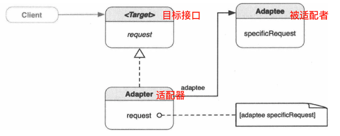

# 组件接口设计方案

## 适配器模式

适配器模式是用来解决已有类与新的接口不兼容的情况，将一个类的接口转换成客户希望的另一个接口

#### 类适配器和对象适配器

类适配器是通过继承实现的。因为OC不支持多继承，Target只能以协议形式存在。Adapter遵守Target协议，继承Adaptee。Target协议定义了对外的接口（request方法）。Adapter没有重载Adaptee的specificRequest方法，而是在request方法的实现中，调用父类（Adaptee）的specificRequest方法。

与类适配器不同，对象适配器不继承被适配者，而是组合了一个对它的引用，从“属于”变成了“包含”。在request方法的实现中，调用了``[adaptee specificRequest]``。

这两种方式的适配器达成的目是一样的，只是各自的特征和试用范围有所差异。我们需要根据具体的需求去选择。

* 代理委托模式就是适配器模式的一种实现

控制器上有个tableview，控制器遵守tableview的dataSource协议，实现dataSource协议中的方法，比如获取rows数量（从数组的count获取）。在这里，dataSource协议就是Target，tableview是客户端，控制器是适配器，数组对象就是被适配者。

## 桥接

桥接模式用于帮助消除抽象接口与实现的耦合，从而接口可以独立的进行变更。桥接模式把抽象层次结构从实现中分离出来,使其可以独立变更,抽象层定义了供客户端使用的上层抽象接口,实现层次结构定义了供抽象层次使用的底层接口,实现类的引用被封装于抽象层的实例中,桥接就形成了。
其实,就是抽象的管理类管理一个抽象的执行类,通过一个方法或者多个方法来让抽象执行类完成功能,这就是传说中的桥接模式。换句话说，就是管理类和执行类是不同的层次结构，但是通过对象组合关系，在两个层次结构的上层抽象类之间形成“桥接”，从而联系起来。

Abstraction定义了供客户端使用的上层抽象接口的父接口。它有一个对Implementor实例的引用，Implementor定义了实现类的接口。Implementor的接口提供基础操作，而Abstraction的上层操作基于这些基础操作。当客户端向Abstraction的实例发送operation消息时，这个方法向imp发送operationImp消息。底下的实际ConcreteImplementator（A或B）做出响应。
当想往系统添加新的ConcreteImplementator时，所要做的只是为Implementor创建出一个新的实现类，这对Abstraction方面没有任何影响。同样，想要修改Abstraction的接口或者创建更细化的Abstraction类，也不会影响到Implementor这头。（去掉一头的抽象不就是对象适配器了吗？）

我们现在需要在完全不同的硬件体系结构的台式机和iOS设备上运行。consoleController和ConsoleEmulator分别是虚拟控制器和仿真器的抽象类。我们操纵虚拟控制器，实际执行的是仿真器。通过这样的设计，我们加上安卓设备或者GameXX都是相当容易的。

以下情况，需要考虑使用桥接模式：

1. 不想在抽象与其实现之间形成固定的绑定关系（这样就可以再运行时切换实现）。
2. 抽象及其实现都应可以通过子类化独立进行扩展。
3. 对抽象的实现修改不应影响客户端代码。
4. 如果每个实现需要额外的子类以细化抽象，则说明有必要把它们分成两部分。
5. 想在带有不同抽象接口的多个对象之间共享一个实现。

## 外观模式

外观模式能够把不同的接口组合起来，而且可以把它们简化成单一入口，就像建筑的外观（大门）一样。外观模式为子系统中一组不同的接口提供了统一的接口，外观定义了上层接口，通过降低复杂度和隐藏子系统之间的通信及依存关系，让子系统更易于使用。
比方说子系统有一组不同的类，其中一些彼此依赖，如下图所示。这让客户端很难使用子系统中的类，因为客户端需要知道每一个类。有时如果客户端只是需要子系统的某些基本行为，而对子系统的类不做太多定制,外观为这样的客户端提供了简化的入口。

举个例子 : 以整个坐出租车为例，出租车服务作为一个封闭的系统，包括出租车司机（Driver）、出租车（Car）和计时器（Taximeter）。一旦乘客向司机发出driveToLocation:x消息，Driver就会收到这个消息，操作两个子系统。Driver会启动Taximeter，让它开始计价，然后让汽车进行换挡、踩油门等操作。到达目的地后，Driver会松油门，踩刹车，停止Taximeter。无论这两个系统多负责，乘客只负责提供Driver一个driveToLocation:x的信息。所以说Driver充当的外观类。

当程序逐渐变大变复杂时，会有越来越小型的类从设计和应用模式中演化出来。如果没有一种简化的方式来使用这些类，客户端代码将变得越来越大、越来越难理解。外观有助于提供一种更为简洁的方式来使用子系统的这些类。处理这些子系统类的默认行为的，可能只是定义在外观中的一个简单的方法，而不必直接去使用这些类。

在以下情况，需要考虑使用外观模式：

1. 子系统正逐渐变得复杂。应用模式的过程中演化出许多类。可以使用外观为这些子系统类提供一个较简单的接口。

2. 可以使用外观对子系统进行分层。每个子系统级别有一个外观作为入口点。让它们通过其外观进行通信，可以简化它们的依赖关系。

