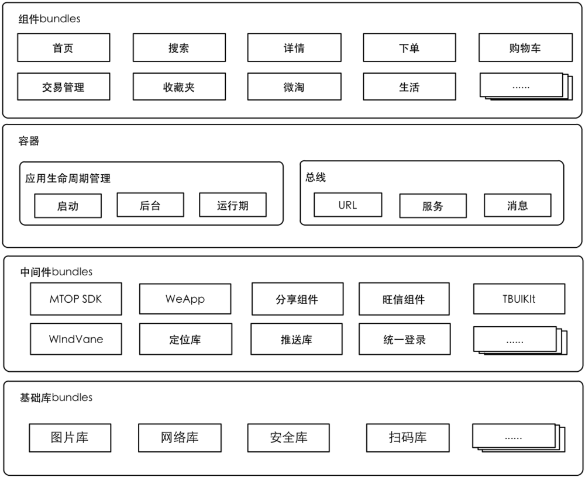
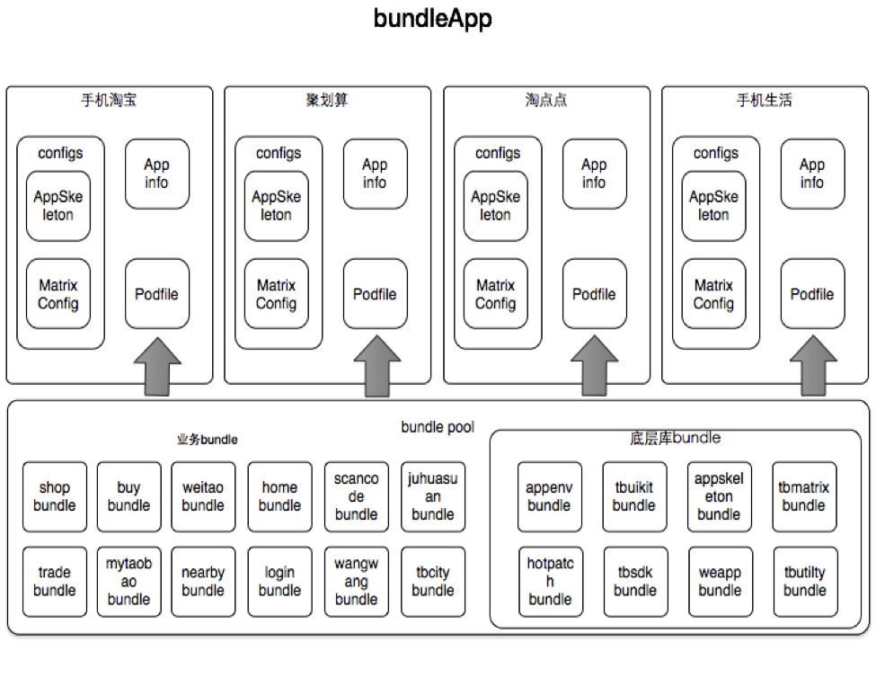

# 通信方案概述

### 组件化核心 

* 组件化的核心层其实是容器层。

手机淘宝将业务都进行细粒度的拆分，拆分出的每一个部分都作为一个组件。每个组件可以单独进行测试与调试，并且确保了单一的功能性，方便在新业务接入的时候，可以按照需求选择相应的组件来进行添加

[CocoaPods](https://github.com/CocoaPods/CocoaPods)是一个著名的iOS类库管理工具。这里就不详细介绍如何安装与用CocoaPods了，感兴趣的可以自己去[CocoaPods Guide](http://guides.cocoapods.org/using/using-cocoapods.html)去看一下。
通过CocoaPods可以十分方便的选择需要的bundle包进入项目，并且最关键的是可以控制bundle包的版本号，选择稳定的旧版本或者新功能的老版本，避免了协同开发的时候，可能出现的外部问题，方便开发与测试。

容器层主要分为两大块

* 应用生命周期
* 总线

而总线，就是核心组件之间的解耦的关键。
总线主要分为三块：

* URL
* 服务
* 消息

## URL

* URL应该是整个总线传输的核心。

模块通过URL跳转的的方式，来进行模块之间的消息传递。URL的用处是最多的，比如获取相应对象，跳转相应页面，或者发起请求，都可以使用URL来进行。

MGJRouter主要就是通过各个模块注册相应的URL跳转block，建立起一层URL与block的映射关系，然后调用方通过URL去访问block，获得结果。
通过URL的方式，调用方不需要去依赖其他模块代码，只需要直接调用，或者获取相应的结果进行处理。

比如常见的页面跳转问题，通过URL路由，就可以直接跳转到相应的页面。

## 服务

服务用来弥补URL无法处理或者难以处理的功能。
服务的作用主要体现在一些组件之间的功能调用，会比URL更佳通用。比如登陆，购物车等模块的常用功能。
服务主要通过ModuleManager，去注册Protocol->Class的关系，获得相应的对象，进行Protocol的方法调用。

## 消息

消息就是常见的NSNotification相关的消息转发机制，在这里做一个消息的统一管理和分发给各个模块，各个模块自己去处理响应的消息。

