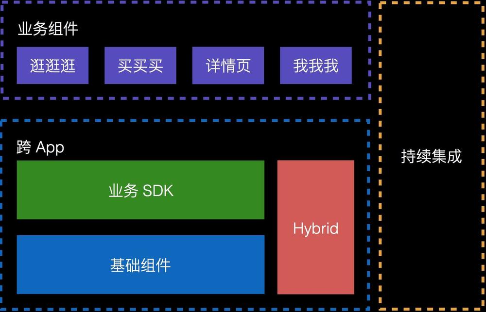

# MGJRouter - 中间件   Url-Block


蘑菇街 App 的代码都是在一个工程里开发的，在人比较少，业务发展不是很快的时候，这样是比较合适的，能一定程度地保证开发效率。

慢慢地代码量多了起来，开发人员也多了起来，业务发展也快了起来，这时单一工程开发模式就会显露出一些弊端：

* 耦合比较严重（因为没有明确的约束，「组件」间引用的现象会比较多）；
* 容易出现冲突（尤其是使用 Xib，还有就是 Xcode Project，虽说有脚本可以改善）；
* 业务方的开发效率不够高（只关心自己的组件，却要编译整个项目，与其他不相干的代码糅合在一起）。

为了解决这些问题，就采取了「组件化」策略。「组件化」顾名思义就是把一个大的 App 拆成一个个小的组件，相互之间不直接引用。它能带来这些好处：

* 加快编译速度（不用编译主客那一大坨代码了）；
* 自由选择开发姿势（MVC / MVVM / FRP）；
* 方便 QA 有针对性地测试；
* 提高业务开发效率。





## 组件间通信


蘑菇街的组件间通信在这里：

[MGJRouter](https://github.com/meili/MGJRouter)


蘑菇街通过MGJRouter实现中间层，由MGJRouter进行组件间的消息转发，从名字上来说更像是“路由器”。实现方式大致是，在提供服务的组件中提前注册block，然后在调用方组件中通过URL调用block，下面是调用方式。


* ``MGJRouter``  开放出的API

```

/**
 *  注册 URLPattern 对应的 Handler，在 handler 中可以初始化 VC，然后对 VC 做各种操作
 *
 *  @param URLPattern 带上 scheme，如 mgj://beauty/:id
 *  @param handler    该 block 会传一个字典，包含了注册的 URL 中对应的变量。
 *                    假如注册的 URL 为 mgj://beauty/:id 那么，就会传一个 @{@"id": 4} 这样的字典过来
 */
+ (void)registerURLPattern:(NSString *)URLPattern toHandler:(MGJRouterHandler)handler;

/**
 *  注册 URLPattern 对应的 ObjectHandler，需要返回一个 object 给调用方
 *
 *  @param URLPattern 带上 scheme，如 mgj://beauty/:id
 *  @param handler    该 block 会传一个字典，包含了注册的 URL 中对应的变量。
 *                    假如注册的 URL 为 mgj://beauty/:id 那么，就会传一个 @{@"id": 4} 这样的字典过来
 *                    自带的 key 为 @"url" 和 @"completion" (如果有的话)
 */
+ (void)registerURLPattern:(NSString *)URLPattern toObjectHandler:(MGJRouterObjectHandler)handler;

/**
 *  取消注册某个 URL Pattern
 *
 *  @param URLPattern URLPattern
 */
+ (void)deregisterURLPattern:(NSString *)URLPattern;

/**
 *  打开此 URL
 *  会在已注册的 URL -> Handler 中寻找，如果找到，则执行 Handler
 *
 *  @param URL 带 Scheme，如 mgj://beauty/3
 */
+ (void)openURL:(NSString *)URL;

/**
 *  打开此 URL，同时当操作完成时，执行额外的代码
 *
 *  @param URL        带 Scheme 的 URL，如 mgj://beauty/4
 *  @param completion URL 处理完成后的 callback，完成的判定跟具体的业务相关
 */
+ (void)openURL:(NSString *)URL completion:(void (^)(id result))completion;

/**
 *  打开此 URL，带上附加信息，同时当操作完成时，执行额外的代码
 *
 *  @param URL        带 Scheme 的 URL，如 mgj://beauty/4
 *  @param userInfo 附加参数
 *  @param completion URL 处理完成后的 callback，完成的判定跟具体的业务相关
 */
+ (void)openURL:(NSString *)URL withUserInfo:(NSDictionary *)userInfo completion:(void (^)(id result))completion;

/**
 * 查找谁对某个 URL 感兴趣，如果有的话，返回一个 object
 *
 *  @param URL 带 Scheme，如 mgj://beauty/3
 */
+ (id)objectForURL:(NSString *)URL;

/**
 * 查找谁对某个 URL 感兴趣，如果有的话，返回一个 object
 *
 *  @param URL 带 Scheme，如 mgj://beauty/3
 *  @param userInfo 附加参数
 */
+ (id)objectForURL:(NSString *)URL withUserInfo:(NSDictionary *)userInfo;

/**
 *  是否可以打开URL
 *
 *  @param URL 带 Scheme，如 mgj://beauty/3
 *
 *  @return 返回BOOL值
 */
+ (BOOL)canOpenURL:(NSString *)URL;
+ (BOOL)canOpenURL:(NSString *)URL matchExactly:(BOOL)exactly;

/**
 *  调用此方法来拼接 urlpattern 和 parameters
 *
 *  #define MGJ_ROUTE_BEAUTY @"beauty/:id"
 *  [MGJRouter generateURLWithPattern:MGJ_ROUTE_BEAUTY, @[@13]];
 *
 *
 *  @param pattern    url pattern 比如 @"beauty/:id"
 *  @param parameters 一个数组，数量要跟 pattern 里的变量一致
 *
 *  @return 返回生成的URL String
 */
+ (NSString *)generateURLWithPattern:(NSString *)pattern parameters:(NSArray *)parameters;


```

MGJRouter是一个单例对象，在其内部维护着一个“URL -> block”格式的注册表，通过这个注册表来保存服务方注册的block，以及使调用方可以通过URL映射出block，并通过MGJRouter对服务方发起调用。


MGJRouter是所有组件的调度中心，负责所有组件的调用、切换、特殊处理等操作，可以用来处理一切组件间发生的关系。除了原生页面的解析外，还可以根据URL跳转H5页面。


### ``MGJRouter``代码中做了两件事：注册与调用。

```
[MGJRouter registerURLPattern:@"mgj://detail" toHandler:^(NSDictionary *routerParameters) {
    // 下面可以在拿到参数后，为其他组件提供对应的服务
    NSString uid = routerParameters[@"id"];
}];

[MGJRouter openURL:@"mgj://detail?id=404"];
    
```
注册过程``self.routes``做了一系列的赋值处理。其中 routes 是一个关键的字典，就是用来承载注册信息的

```
- (void)addURLPattern:(NSString *)URLPattern andHandler:(MGJRouterHandler)handler
{
    NSMutableDictionary *subRoutes = [self addURLPattern:URLPattern];
    if (handler && subRoutes) {
        subRoutes[@"_"] = [handler copy];
    }
}


```

```
- (NSMutableDictionary *)addURLPattern:(NSString *)URLPattern
{
    NSArray *pathComponents = [self pathComponentsFromURL:URLPattern];

    NSMutableDictionary* subRoutes = self.routes;
    
    for (NSString* pathComponent in pathComponents) {
        if (![subRoutes objectForKey:pathComponent]) {
            subRoutes[pathComponent] = [[NSMutableDictionary alloc] init];
        }
        subRoutes = subRoutes[pathComponent];
    }
    return subRoutes;
}

```


观察后可知

* 注册URL的过程 实现 Block 在内存中常驻

* 调用时 触发Block回调


## 通信执行过程


* App启动时实例化各组件模块，然后这些组件向ModuleManager注册Url，有些时候不需要实例化，使用class注册。

* 当组件A需要调用组件B时，向ModuleManager传递URL，参数跟随URL以GET方式传递，类似openURL。然后由ModuleManager负责调度组件B，最后完成任务。

MGJRouter的好处在于，其调用方式很灵活，通过MGJRouter注册并在block中处理回调，通过URL直接调用或者URL+Params字典的方式进行调用。由于通过URL拼接参数或Params字典传值，所以其参数类型没有数量限定，传递比较灵活。在通过openURL:调用后，可以在completionBlock中处理完成逻辑。

MGJRouter有个问题在于，在编写组件间通信的代码时，会涉及到大量的Hardcood。对于Hardcode的问题，蘑菇街开发了一套后台系统，将所有的Router需要的URL和参数名，都定义到这套系统中。我们维护了一个Plist表，内部按不同组件进行划分，包含URL和传参名以及回调参数。


对于``Url-Block``为中间件的总线机制有以下好处：

* 平台统一

iOS,Android通过同一个URL总线在后台进行管理与配置。

* 自动降级

老版本解析不了URL，走老的逻辑依旧可用。新版本可以解析URL，走新的逻辑。

* 中心分发

业务方分别注册自己的URL拦截规则，配置在自己的模块中。通过总线来中心分发响应能够响应的模块进行处理。


## 缺憾

缺陷有以下几点

1. 其他组件  执行``openURL:`` 与 ``registerURLPattern:`` 都需要通过引入``MGJRouter``通信组件
2. 由于管理注册信息``MGJRouter``为单例对象，其他组件``registerURLPattern:``的服务会引起不必要的内存常驻
3. 何时是最恰当注册服务的时机？ 在APP启动阶段``+ (void)load``必须完成，或者说在其他组件A中抽离子库，以单例的形式在该组件将要执行服务的时候注册；
4. ``openUrl:``只支持GET方式的URL调用，限制传参样
5. ``MGJRouter``在注册过程中会像章鱼哥一样将触手深入到每一个需要夸组件通信的组件，逐渐引起代码耦合，以及不同的库中注册的URL需要悉心维护


## 蘑菇街组件通信方案硬编码问题


为了解决MGJRouter方案中URL硬编码，以及字典参数类型不明确等问题，蘑菇街在原有组件化方案的基础上推出了Protocol方案。Protocol方案由两部分组成，进行组件间通信的ModuleManager类以及MGJComponentProtocol协议类。

通过中间件ModuleManager进行消息的调用转发，在ModuleManager内部维护一张映射表，映射表由之前的"URL -> block"变成"Protocol -> Class"。

在中间件中创建MGJComponentProtocol文件，服务方组件将可以用来调用的方法都定义在Protocol中，将所有服务方的Protocol都分别定义到MGJComponentProtocol文件中，如果协议比较多也可以分开几个文件定义。这样所有调用方依然是只依赖中间件，不需要依赖除中间件之外的其他组件。

Protocol方案中每个组件需要一个MGJModuleImplement，此类负责实现当前组件对应的协议方法，也就是对外提供服务的实现。在程序开始运行时将自身的Class注册到ModuleManager中，并将Protocol反射为字符串当做key。

Protocol方案依然需要提前注册服务，由于Protocol方案是返回一个Class，并将Class反射为对象再调用方法，这种方式不会直接调用类的内部逻辑。可以将Protocol方案的Class注册，都放在类对应的MGJModuleImplement中，或者专门建立一个RegisterProtocol类。


``[ModuleManager registerClass:ClassA forProtocol:ProtocolA]`` 的结果就是在 MM 内部维护的 dict 里新加了一个映射关系。

``[ModuleManager classForProtocol:ProtocolA]`` 的返回结果就是之前在 MM 内部 dict 里 protocol 对应的 class，使用方不需要关心这个 class 是个什么东东，反正实现了 ``ProtocolA`` 协议，拿来用就行。

这里需要有一个公共的地方来容纳这些 ``public protocl``，也就是图中的 ``PublicProtocl.h``


### 示例代码

创建MGJUserImpl类当做User组件对外公开的类，并在MGJComponentProtocol.h中定义MGJUserProtocol协议，由MGJUserImpl类实现协议中定义的方法，完成对外提供服务的过程。下面是协议定义：

```
@protocol MGJUserProtocol <NSObject>
- (NSString *)getUserName;
@end

```

Class遵守协议并实现定义的方法，外界通过Protocol获取的Class并实例化为对象，调用服务方实现的协议方法。

ModuleManager的协议注册方法，注册时将Protocol反射为字符串当做存储的key，将实现协议的Class当做值存储。通过Protocol取Class的时候，就是通过Protocol从ModuleManager中将Class映射出来。

```
[ModuleManager registerClass:MGJUserImpl forProtocol:@protocol(MGJUserProtocol)];

```

调用时通过Protocol从ModuleManager中映射出注册的Class，将获取到的Class实例化，并调用Class实现的协议方法完成服务调用。


```

Class cls = [[ModuleManager sharedInstance] classForProtocol:@protocol(MGJUserProtocol)];
id userComponent = [[cls alloc] init];
NSString *userName = [userComponent getUserName];


```

### 项目调用流程

蘑菇街是MGJRouter和Protocol混用的方式，两种实现的调用方式不同，但大体调用逻辑和实现思路类似。在MGJRouter不能满足需求或调用不方便时，就可以通过Protocol的方式调用。

1. 在进入程序后，先使用MGJRouter对服务方组件进行注册。每个URL对应一个block的实现，block中的代码就是组件对外提供的服务，调用方可以通过URL调用这个服务。

2. 调用方通过MGJRouter调用openURL:方法，并将被调用代码对应的URL传入，MGJRouter会根据URL查找对应的block实现，从而调用组件的代码进行通信。

3. 调用和注册block时，block有一个字典用来传递参数。这样的优势就是参数类型和数量理论上是不受限制的，但是需要很多硬编码的key名在项目中。


## 路由层安全

组件化架构需要注意路由层的安全问题。MGJRouter方案可以处理本地及远程的OpenURL调用，如果是程序内组件间的OpenURL调用，则不需要进行校验。而跨应用的OpenURL调用，则需要进行合法性检查。这是为了防止第三方伪造进行OpenURL调用，所以对应用外调起的OpenURL进行的合法性检查，例如其他应用调起、服务器Remote Push等。

在合法性检查的设计上，每个从应用外调起的合法URL都会带有一个token，在本地会对token进行校验。这种方式的优势在于，没有网络请求的限制和延时。


URL-Scheme库：

[JLRoutes](https://github.com/joeldev/JLRoutes)
[routable-ios](https://github.com/clayallsopp/routable-ios)
[HHRouter](https://github.com/lightory/HHRouter)


