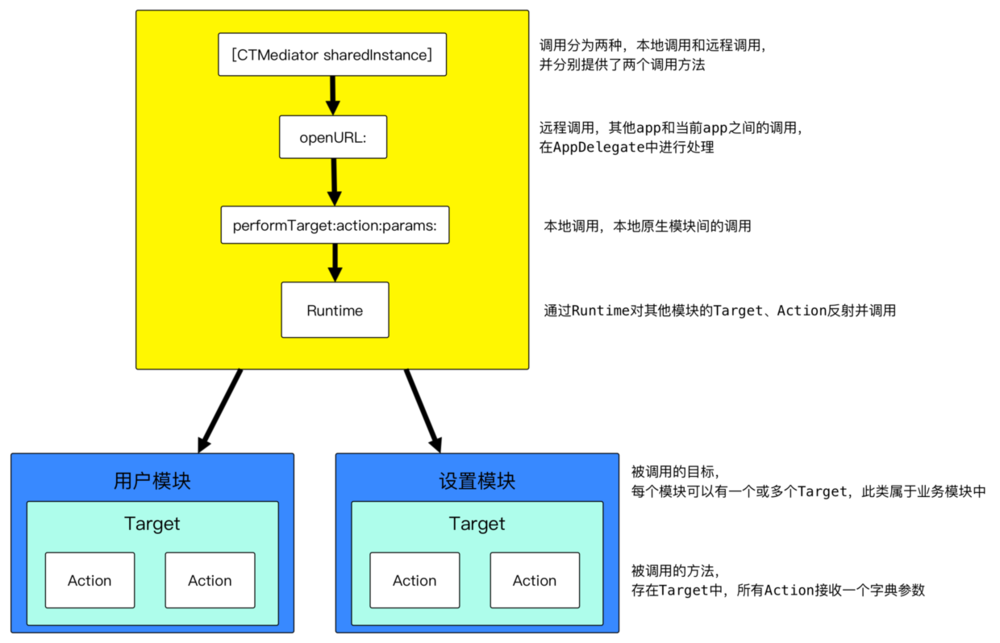
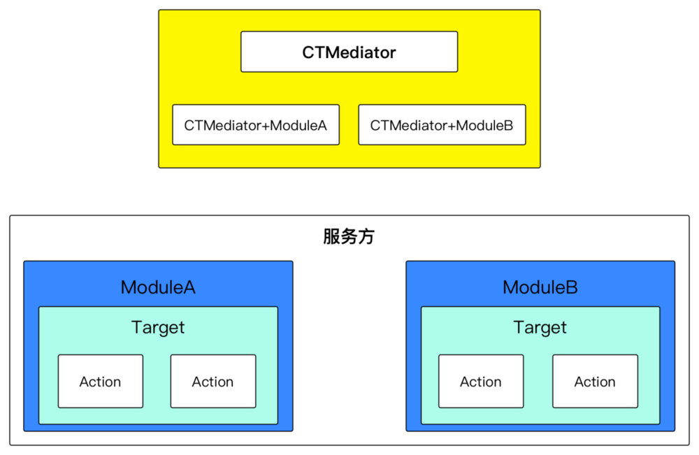
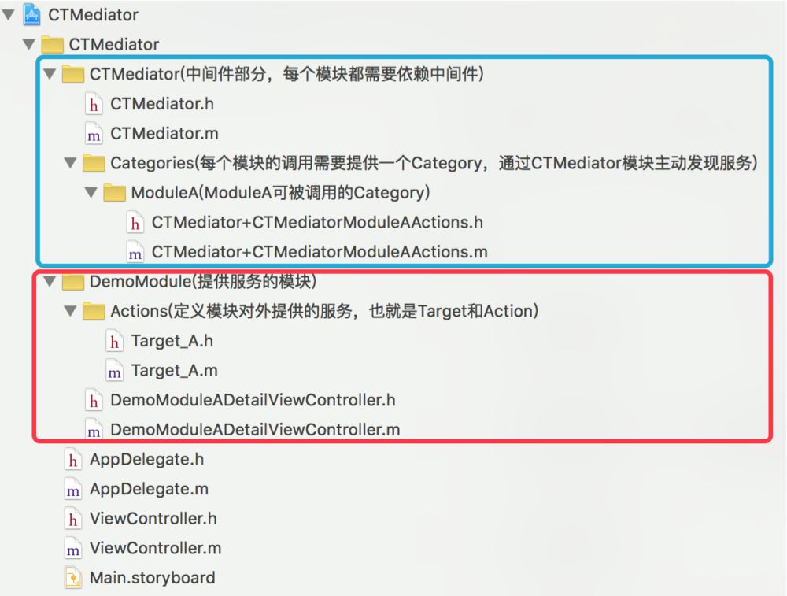

# Target·Action - 中间件

[iOS应用架构谈 组件化方案](https://casatwy.com/iOS-Modulization.html)

``casatwy``组件化方案可以处理两种方式的调用，远程调用和本地调用，对于两个不同的调用方式分别对应两个接口。


* 远程调用通过AppDelegate代理方法传递到当前应用后，调用远程接口并在内部做一些处理，处理完成后会在远程接口内部调用本地接口，以实现本地调用为远程调用服务。

* 本地调用由``performTarget:action:params:``方法负责，但调用方一般不直接调用``performTarget:``方法。CTMediator会对外提供明确参数和方法名的方法，在方法内部调用``performTarget:``方法和参数的转换。





## 架构设计思路


casatwy是通过CTMediator类实现组件化的，在此类中对外提供明确参数类型的接口，接口内部通过performTarget方法调用服务方组件的Target、Action。由于CTMediator类的调用是通过runtime主动发现服务的，所以服务方对此类是完全解耦的。

但如果CTMediator类对外提供的方法都放在此类中，将会对CTMediator造成极大的负担和代码量。解决方法就是对每个服务方组件创建一个CTMediator的Category，并将对服务方的performTarget调用放在对应的Category中，这些Category都属于CTMediator中间件，从而实现了感官上的接口分离。




对于服务方的组件来说，每个组件都提供一个或多个Target类，在``Target``类中声明Action方法。Target类是当前组件对外提供的一个“服务类”，``Target``将当前组件中所有的服务都定义在里面，CTMediator通过runtime主动发现服务。

在Target中的所有Action方法，都只有一个字典参数，所以可以传递的参数很灵活，这也是casatwy提出的去Model化的概念。在Action的方法实现中，对传进来的字典参数进行解析，再调用组件内部的类和方法。


#### 思路分析

[CTMediator](https://github.com/casatwy/CTMediator)





在``CTMediator``中定义远程调用和本地调用的两个方法，其他业务相关的调用由Category完成。


```
// 远程App调用入口
- (id)performActionWithUrl:(NSURL *)url completion:(void(^)(NSDictionary *info))completion;
// 本地组件调用入口
- (id)performTarget:(NSString *)targetName action:(NSString *)actionName params:(NSDictionary *)params;


```


在CTMediator中定义的ModuleA的Category，为其他组件提供了一个获取控制器并跳转的功能，下面是代码实现。由于casatwy的方案中使用performTarget的方式进行调用，所以涉及到很多硬编码字符串的问题，casatwy采取定义常量字符串来解决这个问题，这样管理也更方便。

```
#import "CTMediator+CTMediatorModuleAActions.h"

NSString * const kCTMediatorTargetA = @"A";
NSString * const kCTMediatorActionNativFetchDetailViewController = @"nativeFetchDetailViewController";

@implementation CTMediator (CTMediatorModuleAActions)

- (UIViewController *)CTMediator_viewControllerForDetail {
    UIViewController *viewController = [self performTarget:kCTMediatorTargetA
                                                    action:kCTMediatorActionNativFetchDetailViewController
                                                    params:@{@"key":@"value"}];
    if ([viewController isKindOfClass:[UIViewController class]]) {
        // view controller 交付出去之后，可以由外界选择是push还是present
        return viewController;
    } else {
        // 这里处理异常场景，具体如何处理取决于产品逻辑
        return [[UIViewController alloc] init];
    }
}


```


下面是ModuleA组件中提供的服务，被定义在Target_A类中，这些服务可以被CTMediator通过runtime的方式调用，这个过程就叫做发现服务。

在Target_A中对传递的参数做了处理，以及内部的业务逻辑实现。方法是发生在ModuleA内部的，这样就可以保证组件内部的业务不受外部影响，对内部业务没有侵入性。

```
- (UIViewController *)Action_nativeFetchDetailViewController:(NSDictionary *)params {
    // 对传过来的字典参数进行解析，并调用ModuleA内部的代码
    DemoModuleADetailViewController *viewController = [[DemoModuleADetailViewController alloc] init];
    viewController.valueLabel.text = params[@"key"];
    return viewController;
}
```


在大型项目中代码量比较大，需要避免命名冲突的问题。对于这个问题casatwy采取的是加前缀的方式，从casatwy的Demo中也可以看出，其组件ModuleA的Target命名为Target_A，可以区分各个组件的Target。被调用的Action命名为Action_nativeFetchDetailViewController:，可以区分组件内的方法与对外提供的方法。

casatwy将类和方法的命名，都统一按照其功能做区分当做前缀，这样很好的将组件相关和组件内部代码进行了划分。


## 优缺点

在CTMediator方案中存在很多硬编码的问题，例如``target``、``action``以及参数名都是硬编码在中间件中的，这种调用方式并不灵活直接。

但casatwy提出了去Model化的想法，我觉得这在组件化中传参来说，是非常灵活的，这点我比较认同。相对于MGJRouter的话，也采用了去Model化的传参方式，而不是直接传递模型对象。组件化传参并不适用传模型对象，但组件内部还是可以使用Model的。


