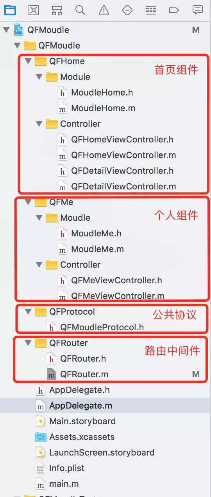

# 7.6 Protocol-Moudle 与蘑菇街优化方案 ）- 中间件


在iOS中，协议（``Protocol``）定义了一个纲领性的接口，所有类都可以选择实现。它主要是用来定义一套对象之间的通信规则。protocol也是我们设计时常用的一个东西，相对于直接继承的方式，protocol则偏向于组合模式。他使得两个毫不相关的类能够相互通信，从而实现特定的目标。





路由的一些细节，它只需要提供两个关键的东西：

* 提供路由器单例
* 获取对应的Moudle
  * 通过Protocol获取
  * 通过URL获取

首先提供单例：

```
+ (instancetype)router {

    static dispatch_once_t onceToken;
    dispatch_once(&onceToken, ^{
        _router = [[self alloc]init];
    });
    return _router;
}

```


通过Runtime的反射机制，我们可以通过NSString获取一个class进而创建对应的对象，而Protocol又可以得到一个NSString，那么是否可以由此入手呢？答案是可以的：

```
- (Class)classForProtocol:(Protocol *)protocol {
    NSString *classString = NSStringFromProtocol(protocol);
    return NSClassFromString(classString);
}

```


这里传入一个protocol即可获取对应的Module的class，再通过class即可以得到对应的Module的object。

通过Protocol或者URL获取对应的Module：

```

#pragma mark - Public
- (id)interfaceForProtocol:(Protocol *)protocol {
    Class class = [self classForProtocol:protocol];
    return [[class alloc]init];
}

- (id)interfaceForURL:(NSURL *)url {
    id result = [self interfaceForProtocol:objc_getProtocol(url.scheme.UTF8String)];
    NSURLComponents *cp = [NSURLComponents componentsWithURL:url resolvingAgainstBaseURL:NO];
    [cp.queryItems enumerateObjectsUsingBlock:^(NSURLQueryItem * _Nonnull obj, NSUInteger idx, BOOL * _Nonnull stop) {
        [result setValue:obj.value forKey:obj.name];//KVC设置
    }];
    return result;
}


```


调用实例如下：

* 通过Protocol获取

```
id homeMoudle = [[QFRouter router]interfaceForProtocol:@protocol(MoudleHome)];

```
通过对外暴露的属性可以对其进行传值，通过其回调block则可以拿到回调参数。


* 通过URL获取

```
id meMoudle = [[QFRouter router]interfaceForURL:[NSURL URLWithString:@"MoudleMe://?paramterForMe=ModuleMe"]];

```
这里通过url传入，通过KVC设置其属性值。同样地，通过其回调block则可以拿到回调参数。


### 公共协议

通过上面我们了解到：通过Protocol可以获取对应的组件实例，那么这个协议放在哪儿？如何管理呢?

在日常开发过程中，跨组件的交互场景最多的应该就是：从组件A附带参数跳转到组件B的某个页面，组件B的这个页面中做一些操作，再回到组件A（可能有回调参数，也可能不回调参数），那么我们的协议应该能处理这两个最常见和基础的操作，所以给protocol定义了两个属性：


```
typedef void(^QFCallBackBlock)(id parameter);

#pragma mark - 基础协议
@protocol QFMoudleProtocol <NSObject>

/// 暴露给组件外部的控制器，一般为该组件的主控制器
@property (nonatomic, weak) UIViewController *interfaceViewController;
/// 回调参数
@property (nonatomic, copy) QFCallBackBlock callbackBlock;

@end

```


这里的interfaceViewController为何声明成了weak属性？这个问题先留一下，后面会聊到这一点。

有了这里的两个属性我们即可完成，对应的跳转和参数回调，但是如何正向传值呢？

应该还需要对应的属性来做入参,但是组件何其多，入参何其多，如果都把正向的属性写入这里面，那么随着时间和业务的增长，这个协议可能会十分杂乱和臃肿。

所以这里把这个协议定为基础协议，对应的组件都继承自它，然后定义各自的需要的入参属性：

首页组件：

```
#pragma mark - ”首页“组件
@protocol MoudleHome <QFMoudleProtocol>

/// 组件“Home”首页所需要的参数
@property (nonatomic, copy) NSString *paramterForHome;

/// 组件“Home”中详情页面所需要的参数
@property (nonatomic, copy) NSString *titleString;

/// 组件“Home”中详情页面所需要的参数
@property (nonatomic, copy) NSString *descString;

/// 组件“Home”所需要暴露的特殊接口，比如其他组件也要跳转到该页面
@property (nonatomic, weak) UIViewController *detailViewController;

@end

```


可以看到，由于首页组件需要对外暴露一个主页面 QFHomeViewController 和详细页面 QFDetailViewController所以参数会多一点。

我的组件：

```

#pragma mark - “我的”组件
@protocol MoudleMe <QFMoudleProtocol>

/// 组件“Me”所需要的参数
@property (nonatomic, copy) NSString *paramterForMe;

@end

```

而“我的”组件，只对外提供一个QFMeViewController页面，参数比较简单。

这样，基本算是达成了对协议的处理，但是无可避免的问题就是: 这个公共协议中定义了各个组件的协议，所以需要对多个开发团队可见，感觉这也是组件化过程中的一个普遍问题，目前没找到好的解决方式。

### Module

上面我们说到了公开protocol中定义了一些属性，比如interfaceViewController 那么这些属性由谁提供呢？没错，就是Module，通过上面的步骤我们可以获取到对应的Module实例，但是我们跳转需要的是Controller，所以，在此时就需要Module的帮助了, Module通过公共协议定义的属性为外部提供Controller接口：

```
- (UIViewController *)interfaceViewController {
    QFHomeViewController *homeViewController = [[QFHomeViewController alloc]init];
    homeViewController.interface = self;
    interfaceViewController = (UIViewController *)homeViewController;
    return interfaceViewController;
}

```


因为Module是在对应的组件中，所以可以随意引用自己组件内部的头文件完成初始化，

而对应的控制器中，需要组件外部的参数，所以这里把Module实例也暴露给对应的控制器实例，也就是homeViewController.interface = self;所做的事情。

在上面说协议的时候我们提到为什么要使用weak，至此，应该比较明朗了 ———— 打破循环强引用。

通过公共协议解耦获取到Module，Module完成为组件内和组件外的搭桥铺路工作，由此，使得跨组件传值、调用、参数回调得以实现。更多细节请看QFMoudle。

由于时间关系，如何制作私有库就不再赘述了，有需要欢迎留言，我们一起手把手创建一个属于你自己的pod私有库。


## 蘑菇街 Protocol 方案

###  原理 

每个组件先通过 Mediator 拿到其他的组件对象class，然后在实例化该class为实例对象，再通过该对象去调用它自身实现的protocol方法，因为是通过接口的形式实现的方法，所以任何类型参数都是可以传递的。

但是这会导致一个问题：组件方法的调用是分散在各地的，没有统一的入口，也就没法做组件不存在时的统一处理。


### protocolMediator实现：

* 通过protocol的字符串存储class


```
#import @interface ProtocolMediator : NSObject
+ (instancetype)sharedInstance;
- (void)registerProtocol:(Protocol *)proto forClass:(Class)cls;
- (Class)classForProtocol:(Protocol *)proto;
 
@end
 
============
 
#import "ProtocolMediator.h"
 
@interface ProtocolMediator()
@property (nonatomic,strong) NSMutableDictionary *protocolCache;
 
@end
@implementation ProtocolMediator
 
 
+ (instancetype)sharedInstance
{
static ProtocolMediator *mediator;  
static dispatch_once_t onceToken;  
dispatch_once(&onceToken, ^{  
    mediator = [[ProtocolMediator alloc] init];
});
return mediator;  
}
 
-(NSMutableDictionary *)protocolCache{
    if (!_protocolCache) {
        _protocolCache = [NSMutableDictionary new];
    }
    return _protocolCache;
}
 
- (void)registerProtocol:(Protocol *)proto forClass:(Class)cls {
    [self.protocolCache setObject:cls forKey:NSStringFromProtocol(proto)];
}
 
- (Class)classForProtocol:(Protocol *)proto {
    return self.protocolCache[NSStringFromProtocol(proto)];
}
 
 
@end


```

### commonProtocol实现：

* 功能：所有需要传递非常规参数的方法都放在这里定义，然后各个组件自己去具体实现（这里为了演示方便，使用的常规的字符串和int类型。当然也可以传递UIImage等非常规对象）

```
#import @protocol A_VC_Protocol -(void)action_A:(NSString*)para1;
 
@end
 
@protocol B_VC_Protocol -(void)action_B:(NSString*)para para2:(NSInteger)para2 para3:(NSInteger)para3 para4:(NSInteger)para4;
@end

```

### 组件A实现：

```
#import #import "CommonProtocol.h"
 
@interface A_VC : UIViewController@end
 
 
=============================
 
#import "A_VC.h"
#import "ProtocolMediator.h"
 
 
@implementation A_VC
 
//注册自己的class
+(void)load{
    [[ProtocolMediator sharedInstance] registerProtocol:@protocol(A_VC_Protocol) forClass:[self class]];
}
 
 
//调用组件B，先通过protocol字符串取出类class，然后再实例化之调用组件B的方法    
-(void)btn_click{
    Class cls = [[ProtocolMediator sharedInstance] classForProtocol:@protocol(B_VC_Protocol)];
    UIViewController *B_VC = [[cls alloc] init];
    [B_VC action_B:@"param1" para2:222 para3:333 para4:444];
}
 
 
-(void)action_A:(NSString*)para1 {
    NSLog(@"call action_A: %@",para1);
}
 
@end


```


### 组件B实现

```
#import #import "CommonProtocol.h"
 
 
@interface B_VC : UIViewController@end
 
=============
 
#import "B_VC.h"
#import "ProtocolMediator.h"
 
@implementation B_VC
 
+(void)load{
    [[ProtocolMediator sharedInstance] registerProtocol:@protocol(B_VC_Protocol) forClass:[self class]];
}
 
 
-(void)btn_click{
    Class cls = [[ProtocolMediator sharedInstance] classForProtocol:@protocol(A_VC_Protocol)];
    UIViewController *A_VC = [[cls alloc] init];
    [A_VC action_A:@"param1"];
}
 
 
-(void)action_B:(NSString*)para1 para2:(NSInteger)para2 para3:(NSInteger)para3 para4:(NSInteger)para4{
    NSLog(@"call action_B: %@---%zd---%zd---%zd",para1,para2,para3,para4);
}
 
@end

```


从上面的实现就可以看出来A调用B不是直接通过mediator去调用，而是先通过mediator生成其他组件的对象，然后自己再用该对象去调用其他组件的方法，这就导致组件方法调用分散在各个调用组件内部，而不能像target-action方案那样对所有组件的方法调用进行统一的管理。

再者这种方式让组件同时依赖两个中心：ProtocolMediator和CommonProtocol，依赖越多，后期扩展和迁移也会相对困难。

并且这种调用其他组件的方式有点诡异，不是正常的使用方法，一般都是直接你发起一个调用请求，其他组件直接把执行结果告诉你，但是这里确实给你返回一个组件对象，让你自己在用这个对象去发起请求，这操作有点蛋疼。。。


