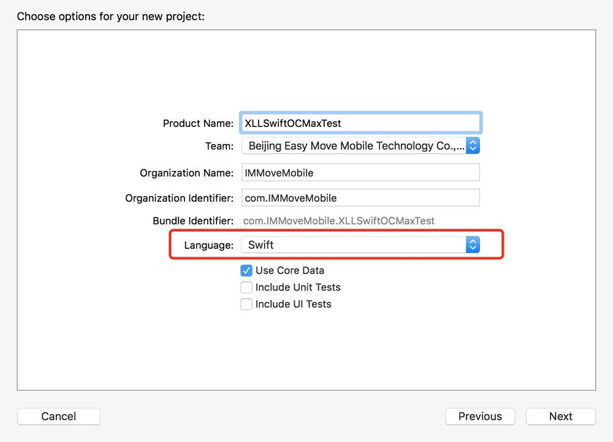
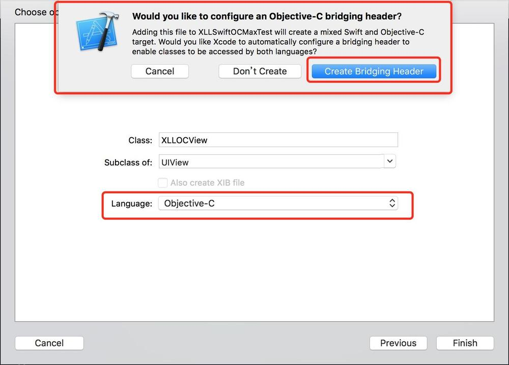
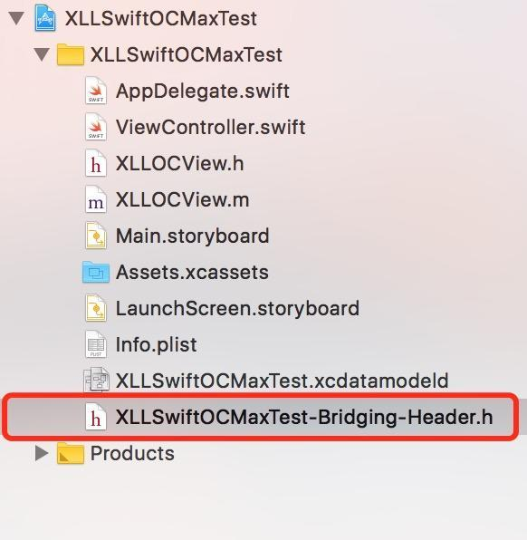
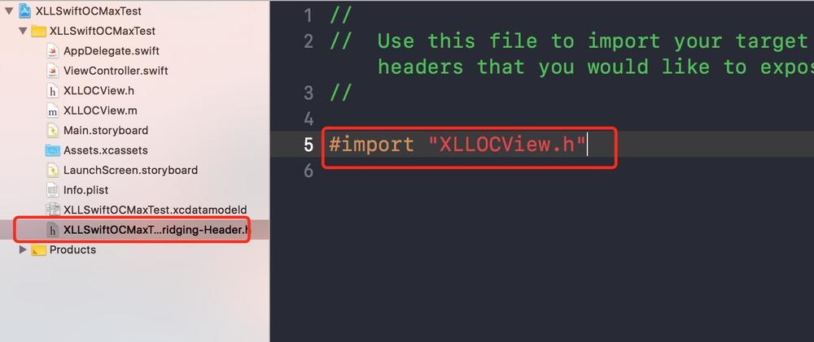
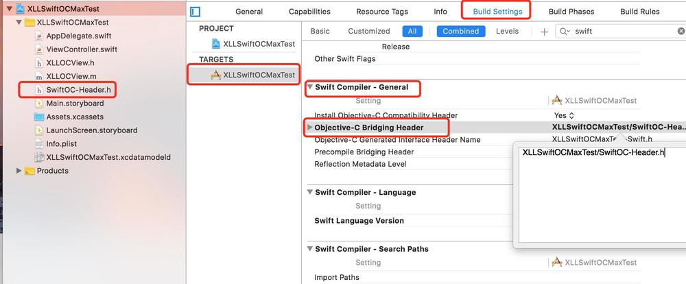

# 8.10 私有库二进制化--Swift相关


## 头文件引入于OC不同

* Swift 采用了现代的库函数命名空间，其实不单是Swift，java 和 C#也都是这样；命名空间意味着库函数可以层层嵌套，同名的函数只要不处在同一命名空间内，依然是相安无事的

* Objc 采用import，那么背后实际上是把一组include整合起来,include 如果太多文件，那么程序看起来要过于复杂


## Swift-Objc混编

### Swift项目混编OC

#### 建立Swift-OC桥接文件（在Swift类中引用OC类及方法）

* 如图，新建project，language选择Swift。



* 在Swift工程主目录下新建一个OC类，如果是项目第一次创建OC类的话，会弹出如图的提示窗。这个提示窗就是是否建立Swift-OC的桥接文件的弹窗提示。



* 点击Create Bridging Header，Xcode会自动创建一个头文件。这个头文件，就是Swift-OC的桥接文件，如下图所示:



* 在Swift-OC桥接文件里将OC类进行声明（声明的时候不会任何系统提示，需要全手写）如图:



>此时在Swift与OC根据Swift-OC桥接文件，就建立了交接关系，在Swift类中就可以调用OC类里的方法了。


* 在OC类随便实现一个自定义实例方法。在Swift类中调用OC的这个方法。如图:

```
override func viewDidLoad() {
        super.viewDidLoad()
        // Do any additional setup after loading the view, typically from a nib.
        let ocView = XLLOCView.init()
        let count = ocView.getConstCount()
        print(count)
    }

```


##### 亮点一：在弹出建立桥接文件提示的时候，误点了cancel怎么破

* 新建一个header文件，如果点击next设置header文件名为SwiftOC-Header

* 在项目target下的build setting -> Swift Compiler-General ->Objective-C Bridging Header将上面建立文件的目录设置上去。我的Demo头文件目录为XLLSwiftOCMaxTest/SwiftOC-Header.h。如图




* 此时再在Swift类中调用OC方法，发现一样好使

> 其实系统提示情况下建立的Swift-OC桥接文件，在``build setting->Objective-C Bridging Heade``中，Xcode默认将路径已经设置了。所以根据提示建立的桥接文件，这个地方就不需要再进行手动设置


#### OC-Swift桥接文件（OC类引用Swift类及方法）

> 在Swift的项目里，并不会有提示让你去建立OC-Swift桥接文件。那么我们怎样在OC类中去调用Swift呢？请看图六，在Objective-C Bridging Header下面的一行Objective-C Generated Interface Header Name,这个就是OC-Swift桥接文件声明的地方。可以看到其命名为XLLSwiftOCMaxTest-Swift.h。


* 在Swift类实现一个实例方法

```
import UIKit

class XLLSwiftView: UIView {

    @objc func getSwiftConstCount() -> NSString? {
        
        return "5"
    }
}

```

* 在OC类中声明OC-Swift桥接文件，并调用Swift类的实例方法。


```
#import "XLLOCView.h"
#import "XLLSwiftOCMaxTest-Swift.h"

@implementation XLLOCView

- (instancetype)init
{
    if (self = [super init])
    {
        XLLSwiftView *swiftView = [[XLLSwiftView alloc] init];
        NSString *count = [swiftView getSwiftConstCount];
        NSLog(@"%@", count);
    }
    return self;
}


```


###  OC项目混编Swift

* 其实与Swift混编OC原理一样，第一次新建Swift类的时候，会弹出建立OC-Swift桥接文件的提示，点击create即可。如果没有误点了取消。去设置项目target下的``build setting -> Swift Compiler-General -> Objective-C Generated Interface Header Name``。双击键入$(SWIFT_MODULE_NAME)-Swift.h，然后在OC调用Swift方法的类中声明#import "项目名称-Swift.h"即可。

* 对于Swift-OC的桥接文件，需要手动建立。方法与Swift项目中手动创建Swift-OC桥接文件一样。


## SDK项目下的混编


###目前遇到的是在framework工程下，OC与Swift混编，OC类调用Swift方法的情况。


* 在framework工程下，混编不会提示任何创建桥接文件的提示。如果OC类需要调用Swift类的方法，需要在OC类这样声明桥接文件：#import "工程名/工程名-Swift.h"。

* 而设置Swift-OC桥接文件路径Objective-C Bridging Header，编译之后会报如下错误:


如上错误，显然说framework是不支持设置此类桥接文件的（这就尴尬了）。因为项目需要没有涉及到此操作，所以这个问题也没细细研究，有时间的小伙伴可以钻研一下。


## Swift和Objective C混编的Framework


[官方文档](https://developer.apple.com/documentation/swift#2984801)


