# .a库生产流程

#### 创建库工程
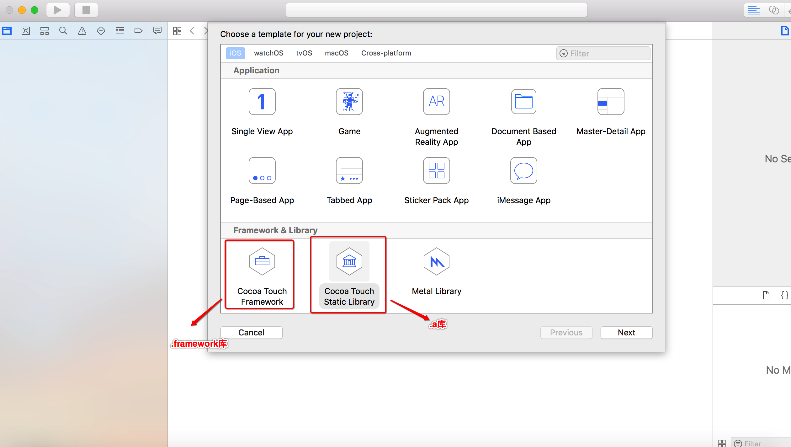

#### 创建不同运行环境.a库版本
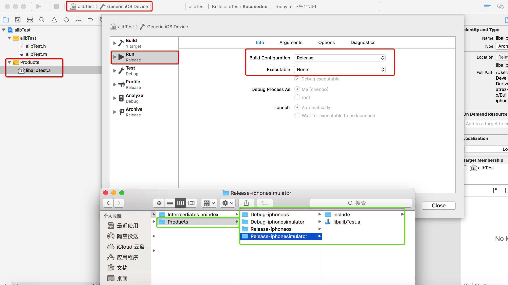


#### .h头文件Subpath 设置方式
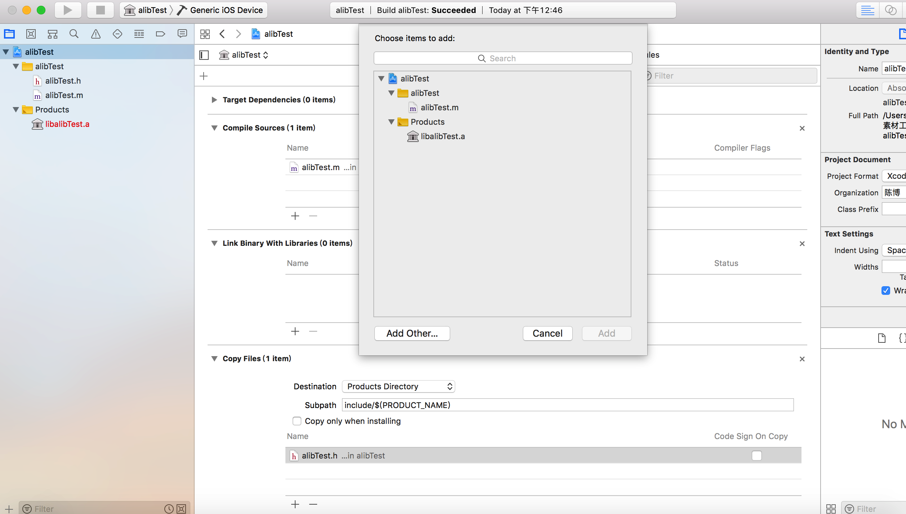
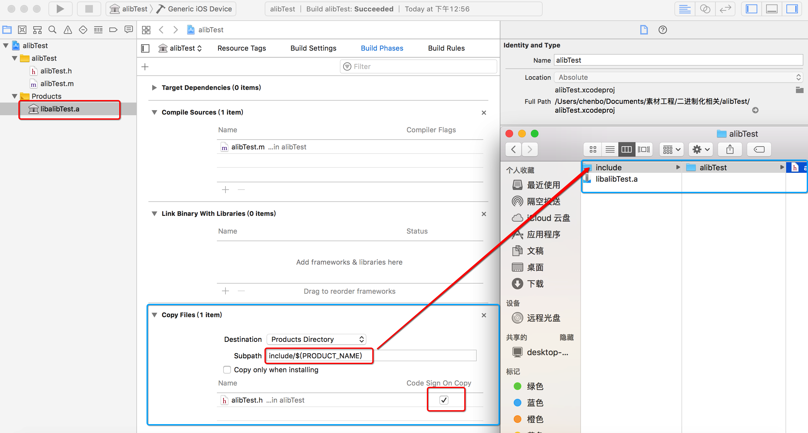
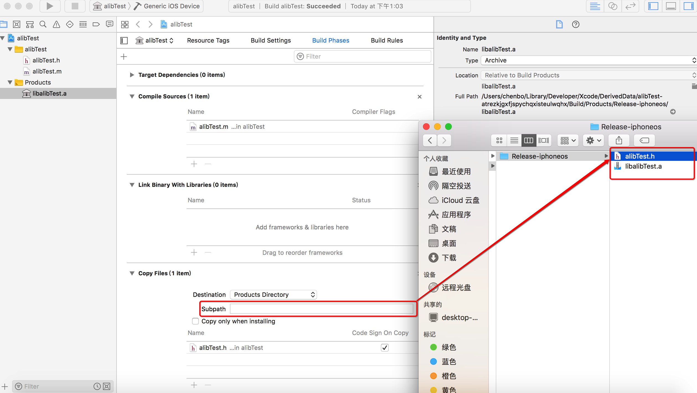


#### 包架构设置

> 模拟器:   4s----5  : i386    5s----x : x86_64
> 真机: 3gs---4s : armv7   5/5c : armv7s(armv7兼容armv7s)  5s---x: arm64


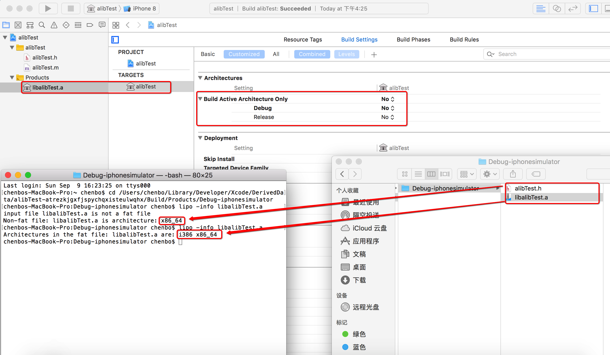

#### 合成架构包
```
chenbos-MacBook-Pro:~ chenbo$ cd /Users/chenbo/Library/Developer/Xcode/DerivedData/alibTest-atrezkjgxfjspychqxisteulwqhx/Build/Products/Debug-iphoneos 
chenbos-MacBook-Pro:Debug-iphoneos chenbo$ lipo -info libalibTest.a
Architectures in the fat file: libalibTest.a are: armv7 arm64 
chenbos-MacBook-Pro:Debug-iphoneos chenbo$ cd /Users/chenbo/Library/Developer/Xcode/DerivedData/alibTest-atrezkjgxfjspychqxisteulwqhx/Build/Products 
chenbos-MacBook-Pro:Products chenbo$ lipo -create /Users/chenbo/Library/Developer/Xcode/DerivedData/alibTest-atrezkjgxfjspychqxisteulwqhx/Build/Products/Debug-iphoneos/libalibTest.a /Users/chenbo/Library/Developer/Xcode/DerivedData/alibTest-atrezkjgxfjspychqxisteulwqhx/Build/Products/Debug-iphonesimulator/libalibTest.a -output libalibTest.a
chenbos-MacBook-Pro:Products chenbo$ lipo -info libalibTest.a
Architectures in the fat file: libalibTest.a are: armv7 i386 x86_64 arm64 
chenbos-MacBook-Pro:Products chenbo$ 

```

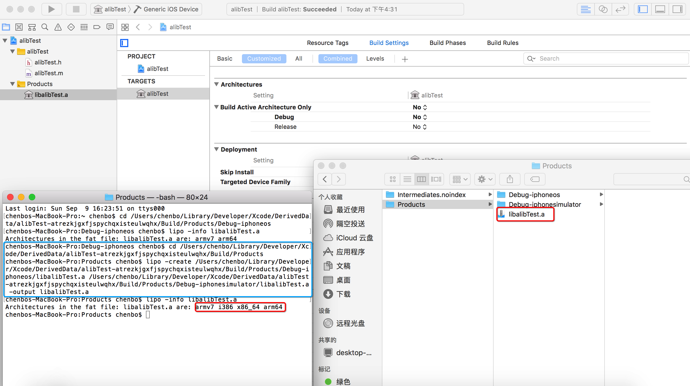


#### 分解库架构

```
chenbos-MacBook-Pro:~ chenbo$ cd /Users/chenbo/Library/Developer/Xcode/DerivedData/alibTest-atrezkjgxfjspychqxisteulwqhx/Build/Products 
chenbos-MacBook-Pro:Products chenbo$ lipo -info libalibTest.a
Architectures in the fat file: libalibTest.a are: armv7 i386 x86_64 arm64 
chenbos-MacBook-Pro:Products chenbo$ lipo -remove i386 /Users/chenbo/Library/Developer/Xcode/DerivedData/alibTest-atrezkjgxfjspychqxisteulwqhx/Build/Products/libalibTest.a -output thin.a
chenbos-MacBook-Pro:Products chenbo$ lipo -info thin.a
Architectures in the fat file: thin.a are: armv7 x86_64 arm64 
chenbos-MacBook-Pro:Products chenbo$ lipo -info thin.a
Architectures in the fat file: thin.a are: armv7 x86_64 arm64 
chenbos-MacBook-Pro:Products chenbo$ lipo -thin arm64 /Users/chenbo/Library/Developer/Xcode/DerivedData/alibTest-atrezkjgxfjspychqxisteulwqhx/Build/Products/libalibTest.a -output arm64.a
chenbos-MacBook-Pro:Products chenbo$ lipo -info arm64.a
input file arm64.a is not a fat file
Non-fat file: arm64.a is architecture: arm64
chenbos-MacBook-Pro:Products chenbo$ 

```

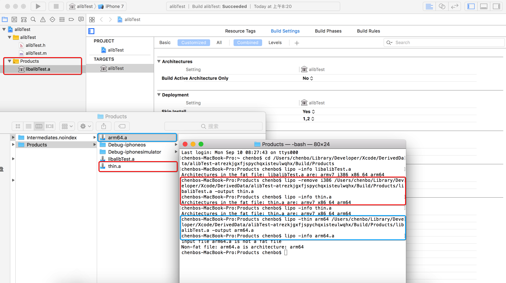

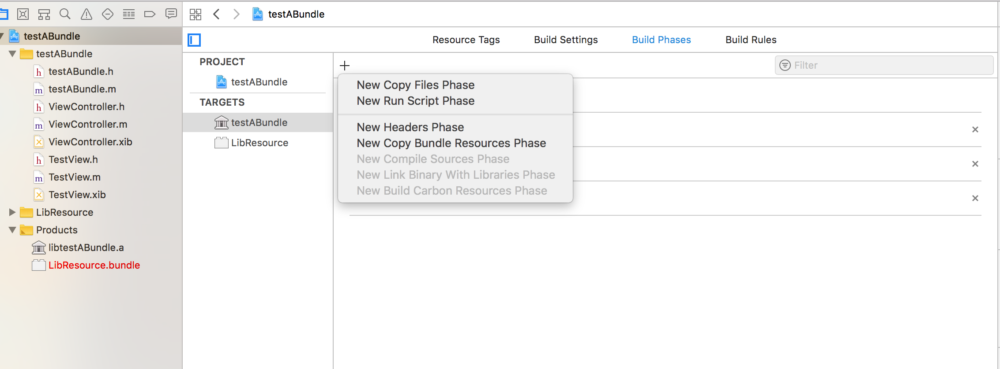

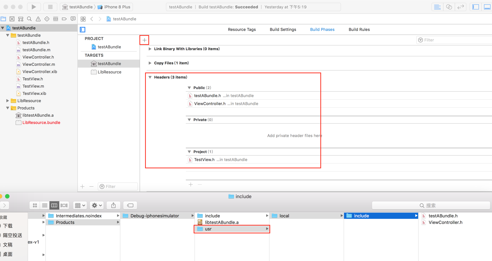


## 二进制文件资源加载方式

* 由于窥探避免.a二进制库内代码，对于代码引用图片，Xib资源等，如果出现同命名情况需要将图片放入Bundle内

* 静态库的封装，一定要带上bundle的包名 ``UIImage *key_img = [UIImage imageNamed:@"FFTKeyBoardBundle.bundle/ps.png"]``


####  首先在testABundle中添加bundle,名称为：LibResource

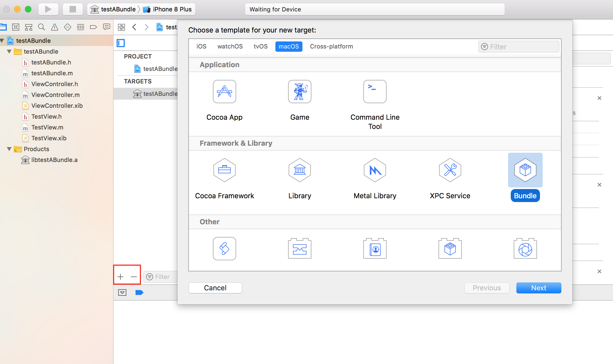


#### 因为bundle默认是OS系统的，所有需要修改他的信息。如图，修改成iOS系统


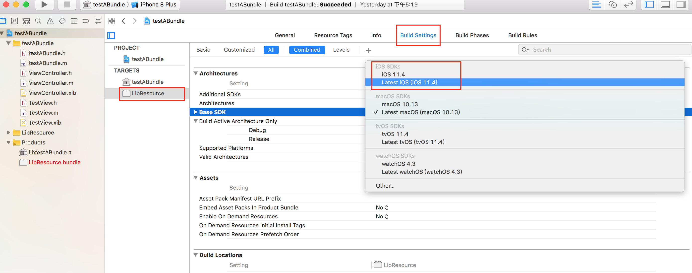

#### 设置Build Setting中的``COMBINE_HIDPI_IMAGES`` 为NO,否则bundle中的图片就是tiff格式了

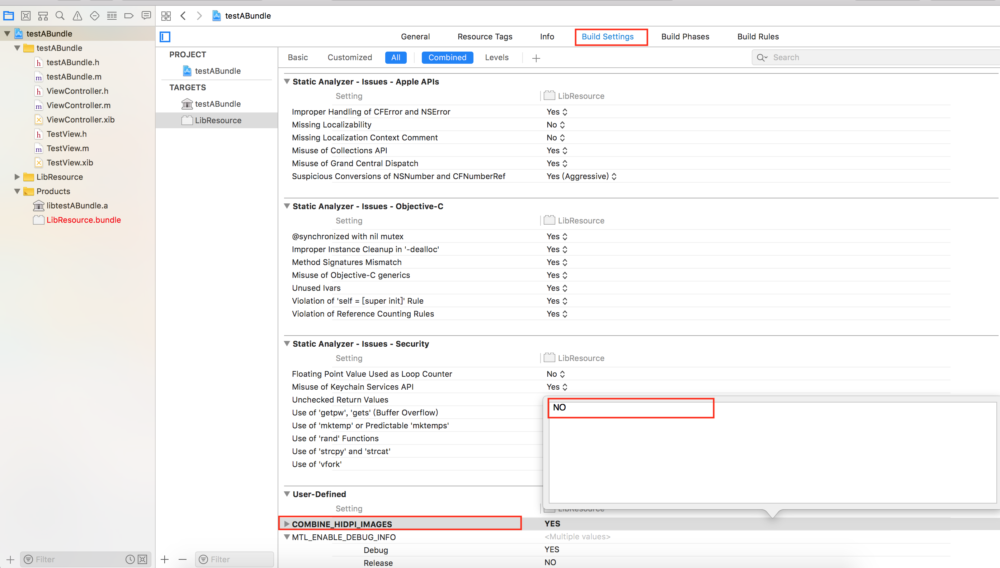


#### 创建一个测试类 `` TestViewController ``  创建的时候记得带上xib,MyViewController.xib以及图片拖到 ``BundleResources``项目下

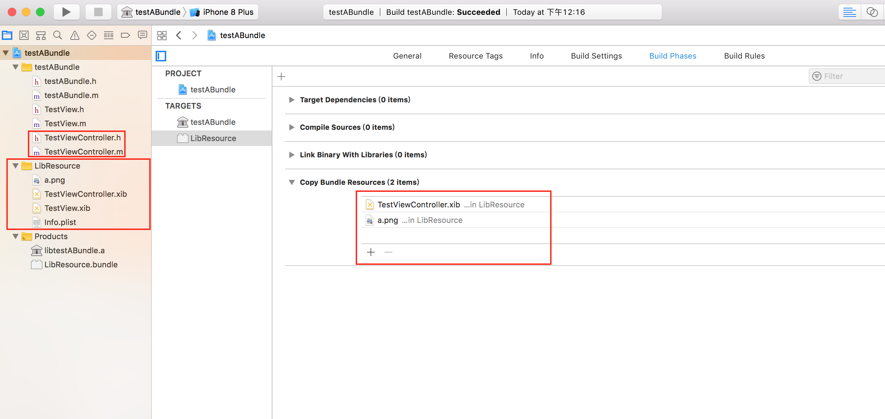

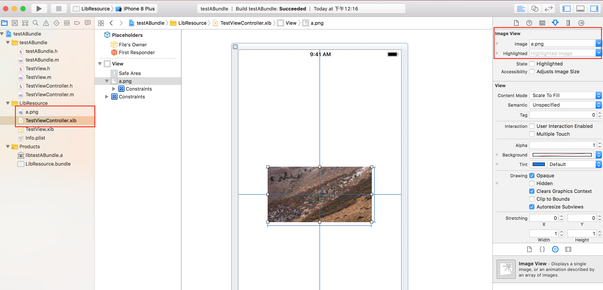


####  实现静态库中加载xib资源 ,xib 引入 图片资源

```
NSString * rescourcePath = [[NSBundle bundleForClass:self] pathForResource:@"LibResource" ofType:@"bundle"];
    
NSBundle * bundle =[NSBundle bundleWithPath:rescourcePath];
    
TestViewController * vC =[[TestViewController alloc]initWithNibName:@"TestViewController" bundle:bundle];

```

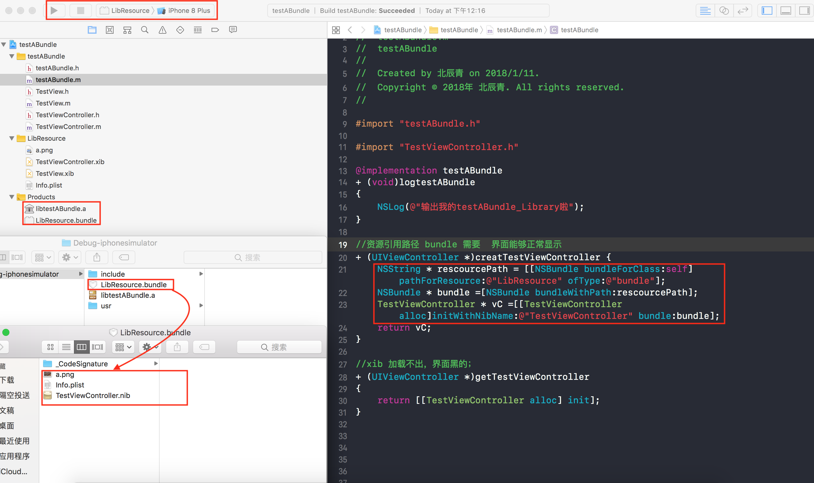

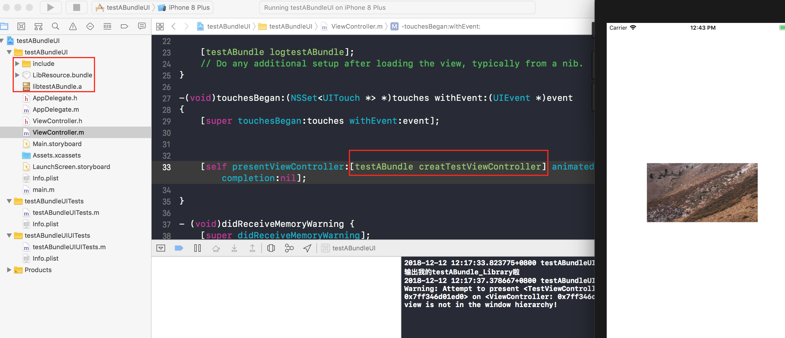


#### 静态库中代码引入图片资源

```
UIImage * bgImage = [UIImage imageNamed:@"LibResource.bundle/b.png"];

```

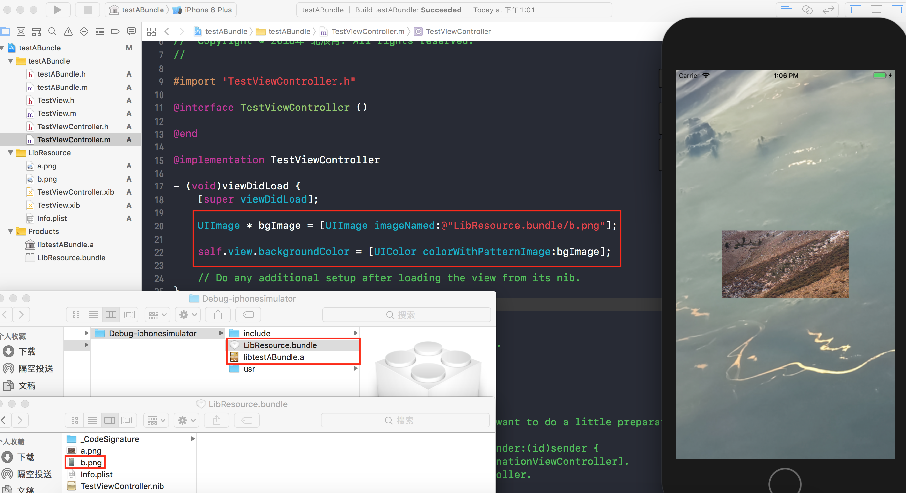


