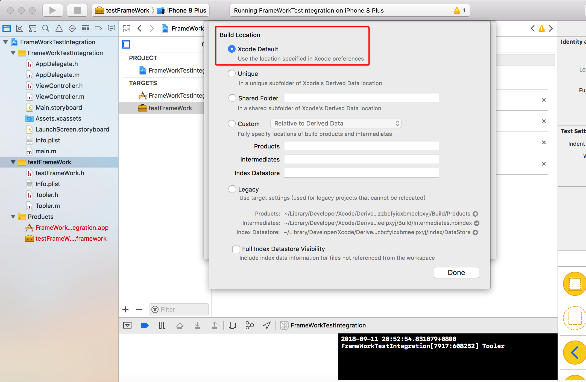

# .framework库生产流程

##  .framework 生产

###  ``API ``头文件

* FrameWork项目里的Products文件多了我们的.framework文件。你Show in Finder一下就会看到下面这样的两个文件夹了，一个就是真机一个就是模拟机的

### 真机与模拟器打包

* 库最低版本

* 编译不同状态使用二进制文件： 真机  模拟器

### 动态库静态库区别

### 动态库如何使用

* 

### 如何生产静态 `` framework `` 库

### 另一种显示头文件的方式

## 静态库Link 细节

* 首先是Dead Code Stripping设置为NO，网上对此项的解释如下，大致意思是如果开启此项就会对代码中的”dead”、”unreachable”的代码过滤，不过这个开关是否关闭，似乎没有多大影响，不过为了完整还原framework中的代码，将此项关闭也未曾不可。

* ``Link With Standard Libraries``关闭，我想可能是为了避免重复链接

* 将``Mach-O Type``设为Static Library，framework可以是动态库也可以是静态库，对于系统的framework是动态库，而用户制作的framework只能是静态库。

## 如何调整二进制库文件生产文件夹

## swift工程二进化

#### 以下步骤缺一不可

* 要暴露的swift文件拖到Public内即可

* 暴露的swift文件的访问权限申明为public属性

## 编译过程：

从C代码到可执行文件经历的步骤是：源代码 > 预处理器 > 编译器 > 汇编器 > 机器码 > 链接器 > 可执行文件

在最后一步需要把.o文件和C语言运行库链接起来，这时候需要用到ld命令。源文件经过一系列处理以后，会生成对应的.obj文件，然后一个项目必然会有许多.obj文件，并且这些文件之间会有各种各样的联系，例如函数调用。链接器做的事就是把这些目标文件和所用的一些库链接在一起形成一个完整的可执行文件。Other linker flags设置的值实际上就是ld命令执行时后面所加的参数

[iOS 使用动态库](https://www.cnblogs.com/wfwenchao/p/5577789.html)

[iOS的SDK开发之Framework制作](https://www.jianshu.com/p/b34340869b59)

[ios中如何制作framewframework 以及用处](https://blog.csdn.net/wang_bo_justone/article/details/77161102)