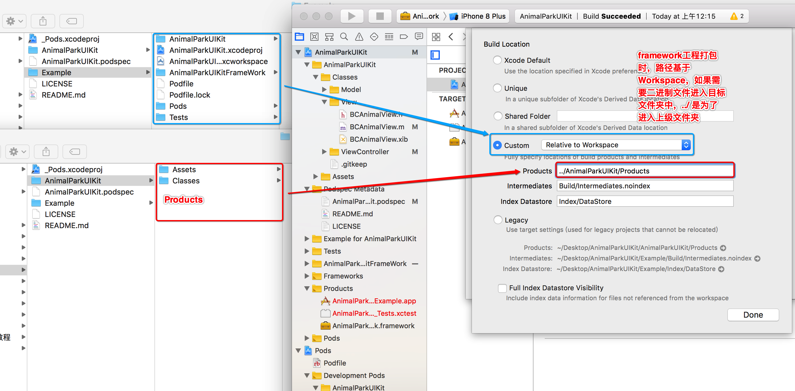

# 8.4 私有库二进制化


### 方案一 Cocoapods库源代码与二进制库文件分开管理


>弊端   实际开发过程中需要维护两套代码，过于麻烦


* 将已经生产完成的库文件移植到framework库工程


* 修改二进制文件生成路径，并运行工程


* 添加并编写`` .podspec  `` 库说明文件，校验后推送至私有索引库


### 方案二  Cocoapods 样板工程协调打包

> 在处理架构包文件位置，版本更新维护时需要手动处理

* 在 cocoapods 样板库中创建 ``` AnimalParkUIKitFrameWork ``` 库工程


* 创建 ``` AnimalParkUIKitFrameWork ``` 库工程时注意资源引用关系


* ``` AnimalParkUIKitFrameWork ``` 运行打包后，修改pod说明文件，验证通过后即可提交至远程代码仓库


* 如果不愿意手动创建二进制文件匹配文件夹，可以如下操作




## 自产Cocoapods 二进制私有库 原文件修改方案

* Framework库 

```

s.source_files = 'AnimalPark/Classes/**/*.h'
s.vendored_framework = 'AnimalPark/Products/AnimalParkKit.framework'

s.ios.vendored_frameworks = 'AnimalPark/Products/AnimalParkKit.framework'


s.vendored_frameworks = 'AnimalPark/Products/AnimalParkKit.framework','AnimalPark/Products/AnimalUIKit.framework'

```


* 引用自己生成的.a文件. 提交到私有仓库的时候需要加上--use-libraries

```
s.source_files = 'AnimalPark/Classes/**/*.h'
s.vendored_libraries = 'AnimalPark/Products/AnimalParkKit.a'

s.ios.vendored_libraries = 'AnimalPark/Products/AnimalParkKit.a'


```


