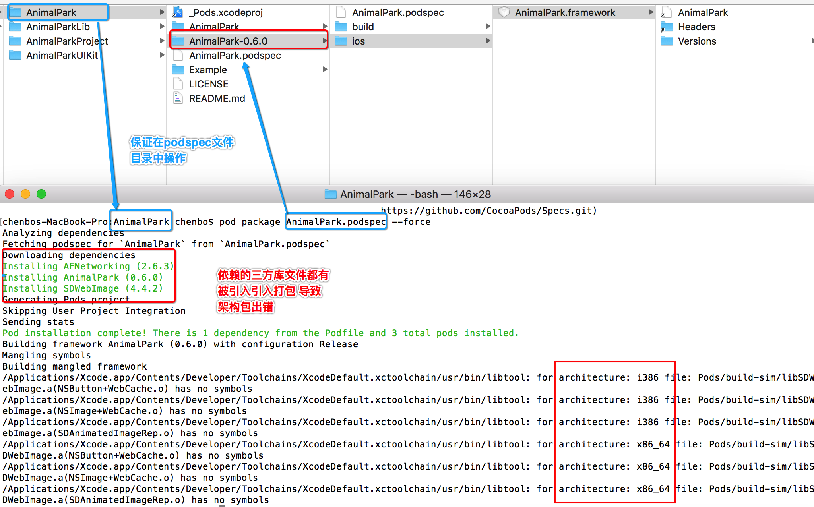
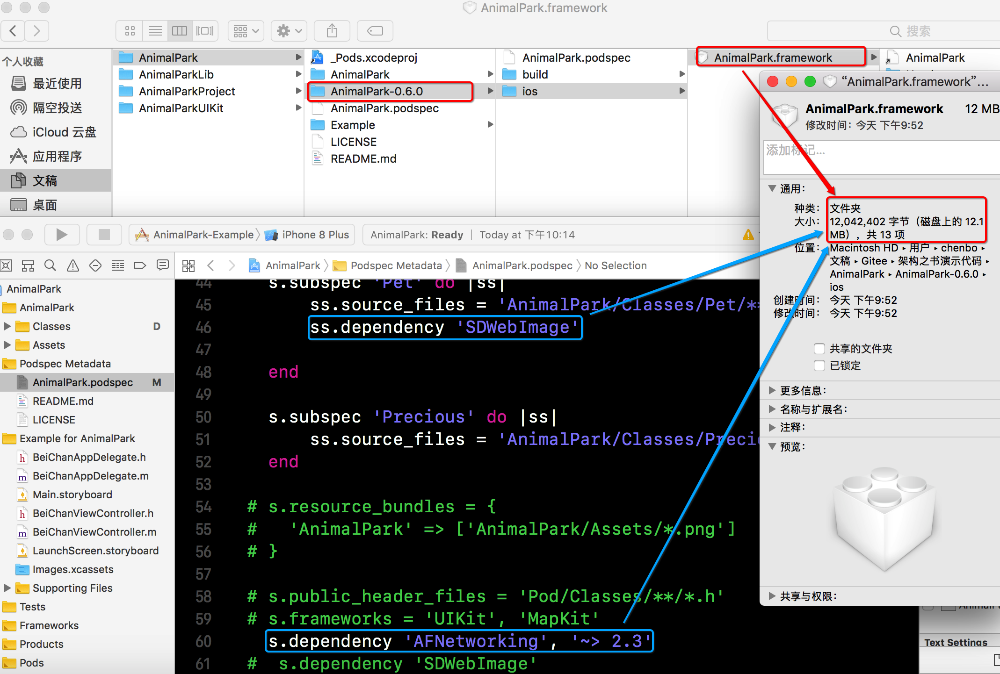
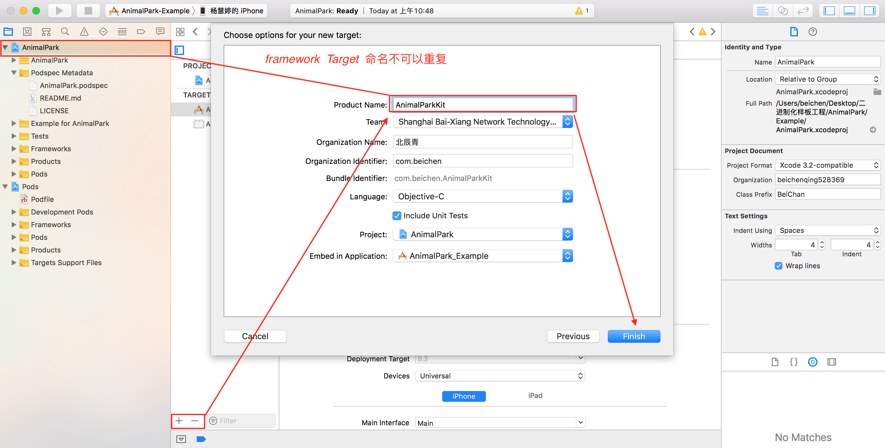
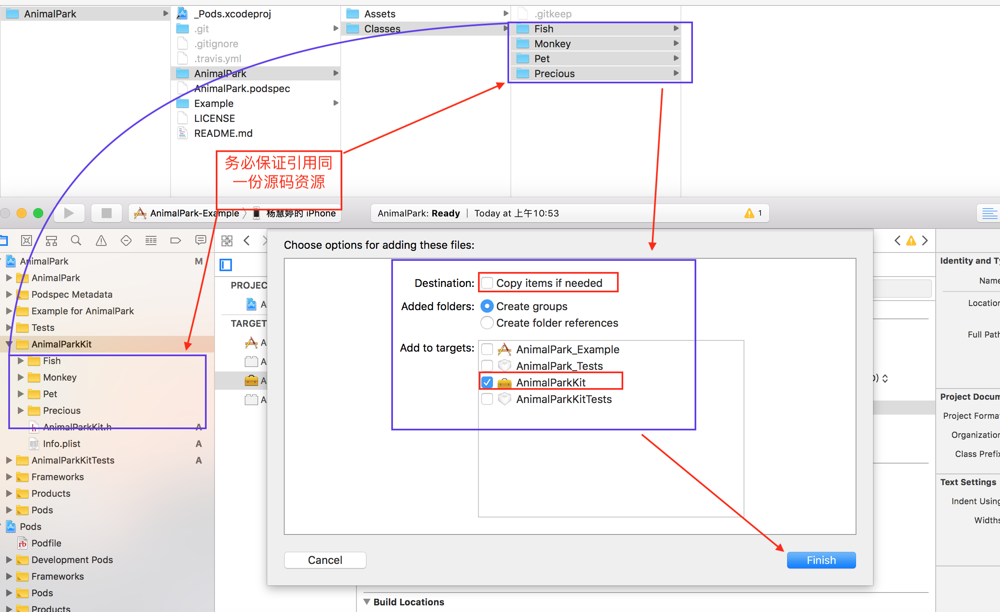
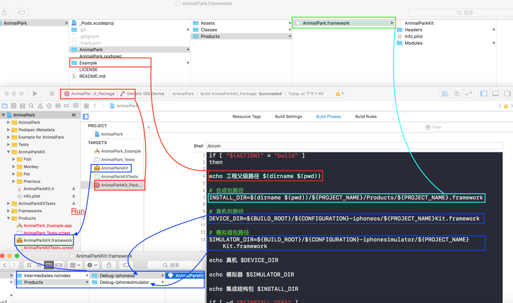
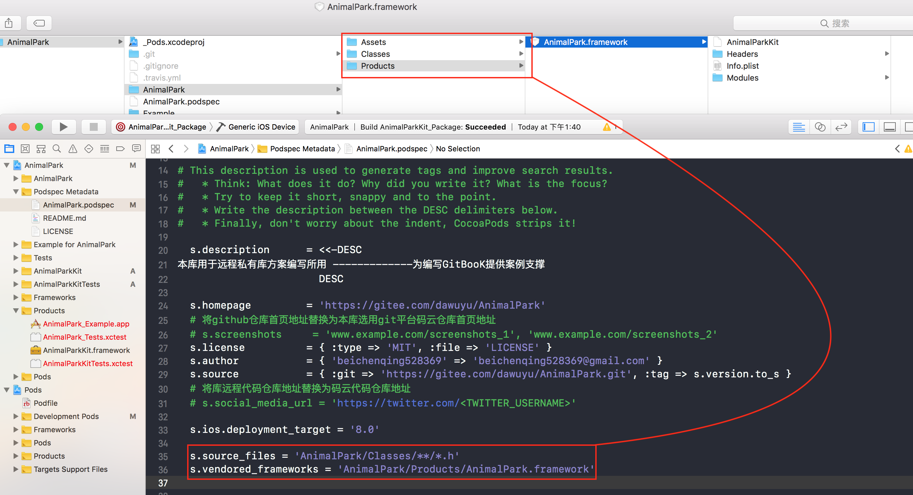
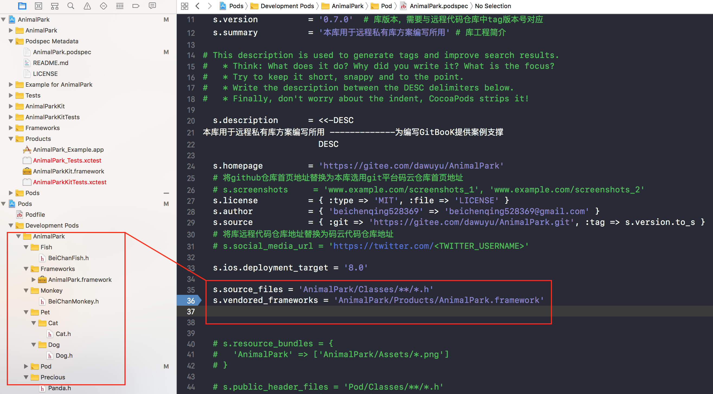

# 8.5 私有库二进制化-快速便捷


## Cocoapods _ Package 打包

* 选择已经拥有远程代码仓库的Cocoapods 必须拥有 ``.podspec``文件 样版工程 执行

```
  pod package AnimalPark.podspec --force 

```



* 包文件过大




## Shell脚本自动打包

> 在处理好第三方引用关系的前提下，即引入的第三方库资源不得与 生产Framework 的 Target 产生资源引用关系，就不会将第三方资源引入生产静态库二进制文件

#### 在标准Pod库工程中创建Framework Target 注意代码资源引用





####  创建脚本运行`` aggregate  `` target 编写脚本

* 编写脚本

```
if [ "${ACTION}" = "build" ]
then

echo 工程父级路径 $(dirname $(pwd))

# 合成包路径
INSTALL_DIR=$(dirname $(pwd))/${PROJECT_NAME}/Products/${PROJECT_NAME}.framework

# 真机包路径
DEVICE_DIR=${BUILD_ROOT}/${CONFIGURATION}-iphoneos/${PROJECT_NAME}Kit.framework

# 模拟器包路径
SIMULATOR_DIR=${BUILD_ROOT}/${CONFIGURATION}-iphonesimulator/${PROJECT_NAME}Kit.framework

echo 真机 $DEVICE_DIR

echo 模拟器 $SIMULATOR_DIR

echo 集成结构包 $INSTALL_DIR

if [ -d "${INSTALL_DIR}" ]
then
rm -rf "${INSTALL_DIR}"
fi

mkdir -p "${INSTALL_DIR}"

cp -R "${DEVICE_DIR}/" "${INSTALL_DIR}/"
#ditto "${DEVICE_DIR}/Headers" "${INSTALL_DIR}/Headers"

# 使用lipo命令将其合并成一个通用framework
# 最后将生成的通用framework放置在工程根目录下新建的Products目录下
lipo -create "${DEVICE_DIR}/${PROJECT_NAME}Kit" "${SIMULATOR_DIR}/${PROJECT_NAME}Kit" -output "${INSTALL_DIR}/${PROJECT_NAME}Kit"

#open "${DEVICE_DIR}"
#open "${SRCROOT}/Products"
fi

```

* 运行脚本后，查看运行结果




#### 重新编写 ``podspec`` 文件,校验后推送至远程代码仓库




##### 执行pod install 之后




##### *如果有类似AFNetWorking 等第三方依赖，应用通过pod建立代码引用关系


## 二进制化与源码自由切换


#### 方案 一  子库 ``subspec`` 更改 默认 资源索取位置

* ``. podspec`` 文件修改为 

```
 #s.source_files = 'TPBlocksKit/Classes/**/*'
  s.default_subspec = 'framework'
 
  s.subspec 'source' do |ss|
    ss.source_files = 'CXBlocksKit/CXBlocksKit/BlocksKit/**/*'
  end
 
  s.subspec 'framework' do |ss|
    ss.ios.vendored_framework = 'CXBlocksKit/CXBlocksKit_Products/*.framework'
  end

```

* 使用者工程 podFile 如此编辑 引用 关系

```

# 默认framework
pod 'CXBlocksKit'
 
 
# 切换成源码
pod 'CXBlocksKit/source'
# 或者
pod 'CXBlocksKit', :subspec => ['source']

```


#### 方案二 ``XXX.podspec`` 宏定义 文件关联限制


宏定义规则

* 不区分子库情况下

```
  # vendored_frameworks 仅仅是针对于, 我们创建编译之后的库, 是framework
  # .a s.vendored_libraries = "xxxx"  .a 静态库
  
  if ENV['IS_SOURCE'] || ENV['XMGDownLoad']
      s.source_files = 'AnimalPark/Classes/**/*'
      else
      s.source_files = 'AnimalPark/Classes/**/*.h'
      s.vendored_frameworks = 'AnimalPark/Products/AnimalParkKit.framework'
  end
  

```


* 区分子库情况

```

  
  # vendored_frameworks 仅仅是针对于, 我们创建编译之后的库, 是framework
  # .a s.vendored_libraries = "xxxx"  .a 静态库
  
  if ENV['IS_SOURCE'] || ENV['XMGDownLoad']
      
      #s.source_files = 'AnimalPark/Classes/**/*'
          s.subspec 'Fish' do |ss|
              ss.source_files = 'AnimalPark/Classes/Fish/**/*'
          end
          
          s.subspec 'Monkey' do |ss|
              ss.source_files = 'AnimalPark/Classes/Monkey/**/*'
          end
          
          s.subspec 'Pet' do |ss|
              ss.source_files = 'AnimalPark/Classes/Pet/**/*'
              ss.dependency 'SDWebImage'
              
          end
      
      
      else
      s.source_files = 'AnimalPark/Classes/**/*.h'
      s.vendored_frameworks = 'AnimalPark/Products/AnimalParkKit.framework'
  end
  


```


* 使用时执行

 ```
 IS_SOURCE=1 pod install
 
 ```
 
 
 

